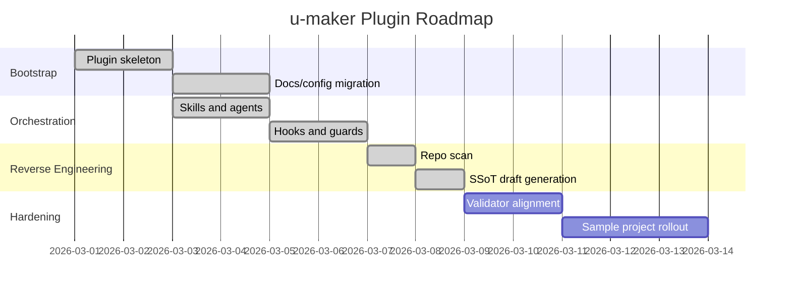

# u-maker Plugin Roadmap

- **Owner**: u-PM
- **Status**: Draft
- **Version**: v0.1.0
- **Last Updated**: 2026-03-07
- **Related Docs**: [Index](1_Index_PM.md), [SRS](../../web/01-plan/1_SRS_RA.md), [IA](../../web/01-plan/1_IA_RA.md)

## 1. Background

### 1.1 Project Overview

`u-maker`는 Claude Code, Codex, Gemini 환경에서 PDCA 기반 SSoT 협업 워크플로우를 실행하기 위한 로컬 플러그인이다. 이 저장소는 플러그인 메타데이터, 전문 에이전트 프롬프트, 사용자 호출 스킬, 훅, 상태 관리 라이브러리, 검증 스크립트, 문서 템플릿을 함께 제공한다.

### 1.2 Problem Statement

- 기존 에이전트 기반 개발 흐름은 요구사항, 설계, 구현, 테스트의 추적성이 쉽게 끊어진다.
- 사용자 프롬프트가 바로 코드 작성으로 이어지면 SSoT 문서가 뒤처진다.
- 다중 CLI 환경에서 플러그인 배포와 동기화가 반복적이며 오류가 발생하기 쉽다.
- Phase Gate와 종료 조건이 문서와 코드에 동시에 반영되지 않으면 PDCA 루프가 형식화된다.

### 1.3 Goals

| ID | Goal | Success Metric |
|---|---|---|
| G-0010 | 문서 중심 PDCA 워크플로우 정착 | PLAN, DESIGN, DO, CHECK, ACT 문서 체계가 일관되게 생성되고 유지됨 |
| G-0020 | 다중 환경 플러그인 배포 단순화 | `deploy_local.sh`로 Claude/Codex/Gemini 동기화가 재현 가능함 |
| G-0030 | Docs-First 가드 강제 | 새 기능 요청 시 문서 갱신 우선 유도가 자동 동작함 |
| G-0040 | 검증 자동화 확보 | `validate-ssot.py`, `check-exit-criteria.py`, `lib/gate.js`가 동일한 상태 모델을 참조함 |

## 2. Scope

### 2.1 In-Scope

- 플러그인 메타데이터와 로컬 배포 스크립트
- 전문 에이전트 및 사용자 스킬 카탈로그
- 훅 기반 Docs-First 가드와 세션 초기화
- SSoT 문서 구조, 템플릿, 추적성 기준
- Phase 상태, Iteration 상태, Gate 판정 로직

### 2.2 Out-of-Scope

- 실제 제품 서비스용 웹 UI 제공
- 원격 SaaS 백엔드 또는 DB 운영
- 외부 API 서버 호스팅
- 실사용자 대상 실시간 협업 기능

## 3. Milestones

| Milestone | Deliverables | Status |
|---|---|---|
| M1 | 플러그인 구조 정리, README, 기본 config | Completed |
| M2 | skills/agents/hooks/templates/lib 구성 | Completed |
| M3 | reverse-engineered SSoT 초안 생성 | Completed in Draft |
| M4 | validator/gate 기준 정합화 | Planned |
| M5 | 실사용 프로젝트 적용 검증 및 보강 | Planned |

## 4. Gantt Chart

## 5. Key Risks

| Risk | Impact | Mitigation |
|---|---|---|
| 템플릿과 validator 헤더 규칙 불일치 | Gate/검증 실패 | 문서에 YAML frontmatter와 markdown header bullet을 함께 유지 |
| `web` 스코프와 실제 플러그인 저장소 간 의미 차이 | 문서 해석 혼동 | 문서 전반에 `web`을 논리적 interaction surface로 명시 |
| 저장소에 실제 DB/API 부재 | 설계 문서 공백 | 개념 모델과 automation interface 관점으로 문서화 |

## Change Log

| Version | Date | Author | Description |
|---|---|---|---|
| v0.1.0 | 2026-03-07 | u-PM | Existing repository reverse-engineered into initial roadmap |
