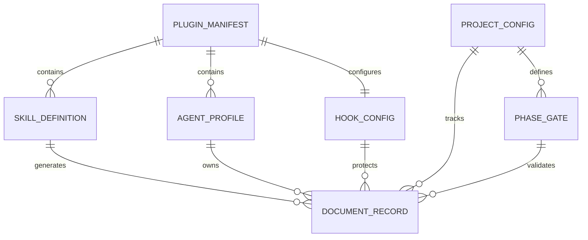

# u-maker Plugin Conceptual ERD

- **Owner**: u-SA
- **Status**: Draft
- **Version**: v0.1.0
- **Last Updated**: 2026-03-07
- **Related Docs**: [SRS](../../web/01-plan/1_SRS_RA.md), [API Contract](../../web/02-design/2_API_SA.md), [Code Record](../../web/03-dev/3_Code_DV.md)

## 1. Purpose

이 저장소에는 관계형 DB 스키마가 존재하지 않는다. 따라서 ERD는 런타임과 문서화 흐름에서 반복적으로 다뤄지는 핵심 개념 객체를 모델링한 개념 ERD로 정의한다.

## 2. Entity Definitions

| Entity | Description | Source of Truth |
|---|---|---|
| PLUGIN_MANIFEST | 플러그인 이름, 버전, 설명, 태그 | `.claude-plugin/plugin.json`, `.claude-plugin/marketplace.json` |
| SKILL_DEFINITION | 사용자 호출 스킬의 메타데이터와 workflow | `skills/*/SKILL.md` |
| AGENT_PROFILE | 전문 에이전트의 역할 정의 | `agents/*.md` |
| HOOK_CONFIG | 세션 훅 및 guard 연결 | `hooks/hooks.json` |
| PROJECT_CONFIG | PDCA 상태와 문서 스코프 | `.u-maker/u-maker.config.json` |
| DOCUMENT_RECORD | 생성된 SSoT 문서와 상태 | `.u-maker/docs/**` |
| PHASE_GATE | phase 전환 규칙과 validator | `.u-maker/u-maker.config.json`, `lib/gate.js` |

## 3. ER Diagram

## 4. Data Specification

| Entity | Key Attributes |
|---|---|
| PLUGIN_MANIFEST | name, version, description, keywords |
| SKILL_DEFINITION | name, description, triggers, allowed-tools, agents |
| AGENT_PROFILE | role, phase scope, responsibilities |
| HOOK_CONFIG | event, matcher, command, timeout |
| PROJECT_CONFIG | documentLanguage, currentPhase, currentIteration, documentScopes |
| DOCUMENT_RECORD | document, owner, status, version, related_docs |
| PHASE_GATE | transition, required docs, conditions, validator |

## Change Log

| Version | Date | Author | Description |
|---|---|---|---|
| v0.1.0 | 2026-03-07 | u-SA | Created conceptual data model for repo without physical DB |
