# u-maker Plugin Information Architecture

- **Owner**: u-UX
- **Status**: Draft
- **Version**: v0.1.0
- **Last Updated**: 2026-03-07
- **Related Docs**: [Roadmap](../../common/01-plan/1_Roadmap_PM.md), [SRS](1_SRS_RA.md), [Screen Design](../02-design/2_Screen_UX.md)

## 1. Domain Registry

| Domain Code | Domain Name | Description |
|---|---|---|
| BOOT | Bootstrap | 배포, 설치, 초기화 |
| PLAN | Plan Docs | roadmap, srs, ia, index |
| DES | Design Docs | erd, api, screen, flow, ux guide |
| DO | Delivery | dev phase 문서와 구현 로그 |
| CHK | Check | testcase, qa report, validate, build |
| ACT | Act | backlog, retrospective, daily report, archive |
| UTIL | Utilities | status, docs listing, summary, help |

## 2. Menu Tree

```mermaid
flowchart TD
    ROOT["u-maker"] --> BOOT["BOOT"]
    ROOT --> PLAN["PLAN"]
    ROOT --> DES["DES"]
    ROOT --> DO["DO"]
    ROOT --> CHK["CHK"]
    ROOT --> ACT["ACT"]
    ROOT --> UTIL["UTIL"]

    BOOT --> B1["deploy_local.sh"]
    BOOT --> B2["/u-skill-create-project"]
    BOOT --> B3["/u-skill-init"]
    PLAN --> P1["/u-skill-plan"]
    PLAN --> P2["/u-skill-srs"]
    PLAN --> P3["/u-skill-index"]
    DES --> D1["/u-skill-design"]
    DES --> D2["/u-skill-api"]
    DES --> D3["/u-skill-screen"]
    DO --> O1["/u-skill-dev"]
    DO --> O2["/u-agent-dv-fe"]
    CHK --> C1["/u-skill-check"]
    CHK --> C2["/u-skill-qa"]
    CHK --> C3["/u-skill-build"]
    ACT --> A1["/u-skill-act"]
    ACT --> A2["/u-skill-archive"]
    UTIL --> U1["/u-skill-status"]
    UTIL --> U2["/u-skill-docs"]
    UTIL --> U3["/u-skill-help"]
```

## 3. Menu Table

| Menu ID | Menu Name | Path | Screen ID | FT Mapping |
|---|---|---|---|---|
| MN-BOOT-0010 | Local Deploy | `./deploy_local.sh` | S-0020 | FT-0010 |
| MN-BOOT-0020 | Existing Repo Init | `/u-skill-init` | S-0030 | FT-0020 |
| MN-PLAN-0010 | Plan Phase | `/u-skill-plan` | S-0010 | FT-0030 |
| MN-DES-0010 | Design Phase | `/u-skill-design` | S-0040 | FT-0030, FT-0070 |
| MN-DO-0010 | Do Phase | `/u-skill-dev` | S-0040 | FT-0030 |
| MN-CHK-0010 | Check Phase | `/u-skill-check` | S-0050 | FT-0050, FT-0060 |
| MN-ACT-0010 | Act Phase | `/u-skill-act` | S-0060 | FT-0080 |
| MN-UTIL-0010 | Validate/Status | `/u-skill-validate`, `/u-skill-status` | S-0050, S-0060 | FT-0050, FT-0060 |

## Change Log

| Version | Date | Author | Description |
|---|---|---|---|
| v0.1.0 | 2026-03-07 | u-UX | IA derived from slash commands and plugin workflow |
