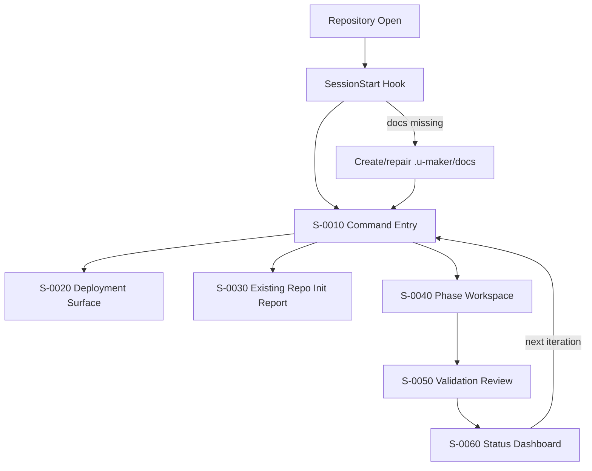

# u-maker Plugin Screen Flow

- **Owner**: u-UX
- **Status**: Draft
- **Version**: v0.1.0
- **Last Updated**: 2026-03-07
- **Related Docs**: [IA](../01-plan/1_IA_RA.md), [Screen Design](2_Screen_UX.md), [UX Guide](../../common/02-design/2_UXGuide_UX.md)

## 1. Global Flow

## 2. Main Transition Rules

| From | To | Trigger | Condition |
|---|---|---|---|
| Repository Open | S-0010 | session start complete | docs structure exists or repaired |
| S-0010 | S-0020 | deploy/check/clean command | maintainer action |
| S-0010 | S-0030 | `/u-skill-init` | existing repo selected |
| S-0030 | S-0040 | draft docs generated | init complete |
| S-0040 | S-0050 | validate/build/check command | docs or code review needed |
| S-0050 | S-0060 | status or retrospective review | report available |

## Change Log

| Version | Date | Author | Description |
|---|---|---|---|
| v0.1.0 | 2026-03-07 | u-UX | Screen flow defined for repo initialization and PDCA progression |
