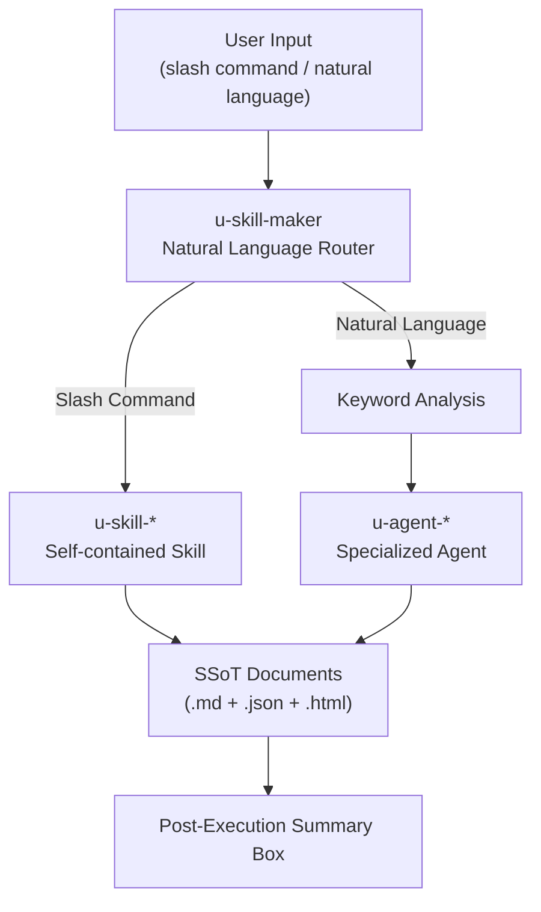
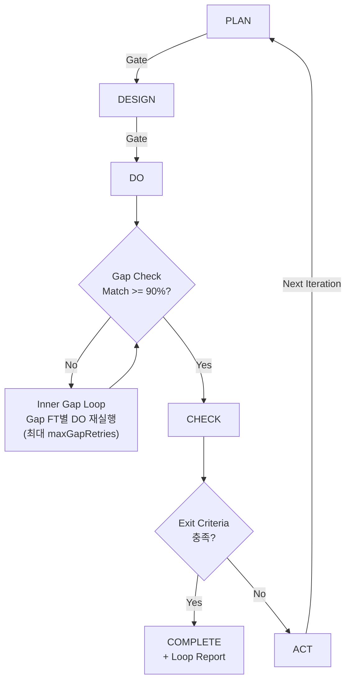
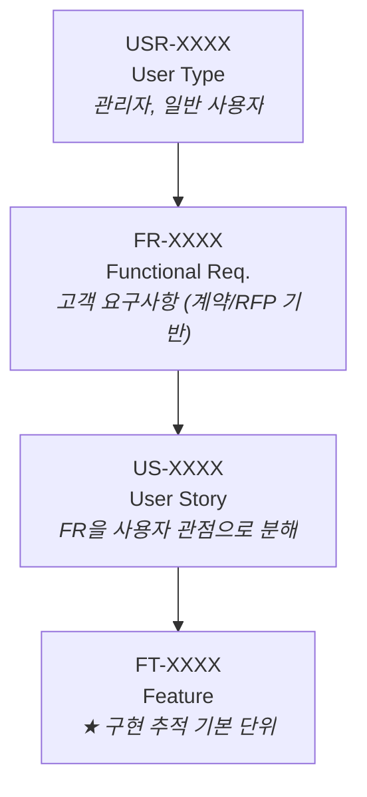
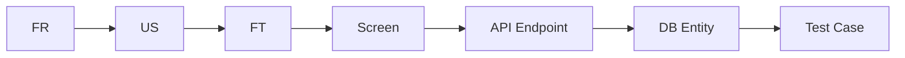
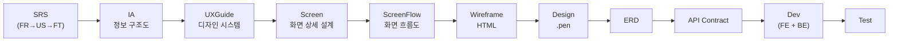

# u-maker Plugin

PDCA(Plan-Design-Do-Check-Act) 기반 SSoT(Single Source of Truth) 협업 오케스트레이터.
8개 전문 에이전트와 53개 스킬로 소프트웨어 개발 전 과정을 자동화하는 Claude Code 플러그인.

- Plugin version: `1.0.4`
- SSoT config version: `2.0.0`
- Skills: `54` | Agents: `8` | Templates: `20` | References: `13`
- [시작 가이드 (초보자용)](GET_STARTED.md) | [한국어 README (HTML)](README.ko.html) | [English README (HTML)](README.en.html)

---

## TL;DR

```bash
# 1. 설치 (macOS/Linux)
curl -fsSL https://raw.githubusercontent.com/upleat-ax/u-maker-plugin/main/install.sh | bash

# 2. Claude Code 재시작 후 프로젝트에서 실행
/u-skill-create-project my-app    # 새 프로젝트
/u-skill-init .                   # 기존 프로젝트 역공학

# 3. 자동 PDCA 루프
/u-skill-loop
```

---

## Table of Contents

1. [What This Plugin Solves](#1-what-this-plugin-solves)
2. [Architecture Overview](#2-architecture-overview)
3. [Agents](#3-agents)
4. [Skills & Commands](#4-skills--commands)
5. [PDCA Workflow](#5-pdca-workflow)
6. [4-Tier ID Hierarchy](#6-4-tier-id-hierarchy)
7. [SSoT Document Structure](#7-ssot-document-structure)
8. [Document Output Pipeline](#8-document-output-pipeline)
9. [Repository Layout](#9-repository-layout)
10. [Prerequisites & Install](#10-prerequisites--install)
11. [Role-Based Guide](#11-role-based-guide)
12. [Scenario Guide](#12-scenario-guide)
13. [Hooks & Guardrails](#13-hooks--guardrails)
14. [Tech Stack Policy](#14-tech-stack-policy)
15. [Validation & Scripts](#15-validation--scripts)
16. [Troubleshooting](#16-troubleshooting)
17. [Contributor Notes](#17-contributor-notes)
18. [License](#18-license)

---

## 1. What This Plugin Solves

u-maker는 **문서 중심 개발(SSoT)**을 강제하는 협업 오케스트레이터이다.

### 기존 방식 vs u-maker

| 기존 방식 | u-maker 방식 |
|----------|-------------|
| 코드 먼저, 문서는 나중에 | 문서 먼저, 코드는 문서 기반 생성 (Docs-First) |
| 요구사항과 코드가 따로 놀아 추적 불가 | 4-Tier ID(`USR→FR→US→FT`)로 요구사항~테스트 전 구간 추적 |
| 설계서와 코드가 달라지는 문제 | Match Rate 자동 측정, 90% 미만이면 자동 보완 |
| 단계 건너뛰기로 품질 저하 | Phase Gate로 전 단계 문서 Final 확인 후에만 다음 단계 진행 |
| 반복적인 수정-테스트 사이클 | PDCA Loop 자동화 (최대 10회 반복, 종료 조건 자동 판정) |
| 기술 스택 규칙 위반 | Hook 기반 실시간 차단 (CSS-in-JS, Pages Router 등 10개 규칙) |
| 문서와 코드 버전 불일치 | `.md` + `.json` 동시 생성, 리포트는 `.html`도 추가 생성 |
| 각 역할자가 개별 도구로 작업 | 8개 AI 에이전트가 하나의 SSoT 체계에서 협업 |

---

## 2. Architecture Overview



### Token Architecture

- **u-skill-maker**: ~5KB 슬림 라우터 (자연어 분석 + Command-Skill 매핑만)
- **각 u-skill-***: 1~3KB 자립형 (필요한 `_refer/` import만 + agent 직접 선언)
- **명령당 토큰**: ~11K (이전 ~26K 대비 55-60% 절감)

---

## 3. Agents

8개 전문 에이전트가 Phase별 역할을 분담한다.

| Agent | Role | Phase | Key Outputs |
|-------|------|-------|-------------|
| `u-agent-pm` | Product Manager | PLAN, ACT | Roadmap, Index, Retrospective, Daily Report, Loop Report |
| `u-agent-ra` | Requirements Analyst | ALL | Milestone, Validation, Backlog, Iteration Log, RTM, Glossary, Workflow |
| `u-agent-sa` | Software Architect | PLAN, DESIGN | SRS, ERD, API Contract |
| `u-agent-ux` | UX Designer | PLAN, DESIGN, DO | IA, Screen, ScreenFlow, Wireframe, UX Guide, Design Token |
| `u-agent-ux-ds` | Visual Designer | DESIGN, DO | 디자인 도구(pencil/figma/stitch)로 시각 디자인 (config `designTool` 설정 기반) |
| `u-agent-dv-fe` | Frontend Developer | DO | Next.js App Router + react-query + Storybook |
| `u-agent-dv-be` | Backend Developer | DO | API Routes + Prisma/Drizzle ORM |
| `u-agent-qa` | QA Engineer | CHECK | Test Cases (Vitest+Playwright), Test Execution, Defect Analysis |

### Agent Invocation

에이전트를 호출하는 두 가지 방법:

```bash
# 1. Skill을 통한 정형화된 호출 (특정 문서/태스크)
/u-skill-srs web          # u-agent-sa가 SRS 문서를 생성

# 2. Agent Direct 호출 (자유 형식 작업 요청)
/u-agent-sa ERD를 PostgreSQL 기준으로 최적화해줘
```

---

## 4. Skills & Commands

전체 54개 스킬. 자연어 입력 시 `u-skill-maker` 라우터가 자동으로 적절한 스킬/에이전트로 분배한다.

### 4.0 Router

| Command | Description |
|---------|-------------|
| `/u-skill-maker` | 자연어 라우터. 사용자 입력을 분석하여 적절한 스킬/에이전트로 자동 라우팅 (직접 호출 불필요, 자연어 입력 시 자동 동작) |

### 4.1 Lifecycle

| Command | Description |
|---------|-------------|
| `/u-skill-create-project <name>` | 새 프로젝트 초기화 (Turborepo + SSoT 문서 구조) |
| `/u-skill-init [path]` | 기존 프로젝트 분석 후 SSoT 문서 자동 역공학 생성 |
| `/u-skill-plan [app]` | PLAN Phase: Roadmap -> SRS -> IA -> Index |
| `/u-skill-design [app]` | DESIGN Phase: UXGuide -> Screen -> ScreenFlow -> ERD -> API -> RTM |
| `/u-skill-dev [app]` | DO Phase: UX/FE/BE 병렬 개발 |
| `/u-skill-check [app]` | CHECK Phase: 테스트 케이스 설계 -> 실행 -> 결함 분석 |
| `/u-skill-act` | ACT Phase: 백로그 정리 -> 회고 -> 아카이브 |

### 4.2 Auto-Loop

| Command | Description |
|---------|-------------|
| `/u-skill-loop` | PDCA 사이클을 종료 조건 충족까지 자동 반복 (DO 후 Gap Check 포함) |
| `/u-skill-loop-from <phase>` | 지정 Phase부터 루프 시작 (plan/design/dev/check/act) |
| `/u-skill-stop` | 실행 중인 루프를 즉시 중단 (상태 저장) |
| `/u-skill-resume` | 중단된 루프를 재개 |
| `/u-skill-gap-detector` | 설계-구현 Gap 분석 (Match Rate 산출) |

### 4.3 Agent Direct

| Command | Description |
|---------|-------------|
| `/u-agent-pm [task]` | PM에게 자유 형식 작업 요청 |
| `/u-agent-ra [task]` | RA에게 자유 형식 작업 요청 |
| `/u-agent-sa [task]` | SA에게 자유 형식 작업 요청 |
| `/u-agent-ux [task]` | UX에게 자유 형식 작업 요청 |
| `/u-agent-dv-fe [task]` | FE 개발자에게 자유 형식 작업 요청 |
| `/u-agent-dv-be [task]` | BE 개발자에게 자유 형식 작업 요청 |
| `/u-agent-qa [task]` | QA에게 자유 형식 작업 요청 |

### 4.4 Document & Requirement Management

| Command | Description |
|---------|-------------|
| `/u-skill-srs [app]` | SRS 생성/수정 (FR -> US -> FT) |
| `/u-skill-erd` | ERD 생성/수정 |
| `/u-skill-api [app]` | API Contract (OpenAPI 3.0) 생성/수정 |
| `/u-skill-screen [app]` | 화면 상세 설계 |
| `/u-skill-wireframe [app]` | 와이어프레임 HTML 생성 |
| `/u-skill-ux-figma [app]` | 디자인 도구(pencil/figma/stitch) 기반 화면 디자인 |
| `/u-skill-ux-designsystem [app]` | 디자인 도구 기반 디자인 시스템/컴포넌트 시각 구성 |
| `/u-skill-import [source] [path]` | 외부 소스(문서, Figma, pencil, Stitch, URL, 이미지)를 SSoT 문서로 변환 |
| `/u-skill-glossary [app]` | 용어 정의(Glossary) 문서 생성/수정 |
| `/u-skill-workflow [app]` | 워크플로우 정의 문서 생성/수정 |
| `/u-skill-testcase [app]` | Unit+E2E 테스트 케이스 일괄 설계 |
| `/u-skill-tc-add [app] [FT] [desc]` | 테스트 케이스 개별 추가 (`all` 지원) |
| `/u-skill-tc-refine <TC> [app]` | 테스트 케이스 세분화 (하위 TC로 분해) |
| `/u-skill-qa [app]` | 테스트 실행 (Vitest + Playwright) |
| `/u-skill-us-add [desc]` | 유저 스토리 추가 |
| `/u-skill-fr-add [app] [desc]` | 기능 요구사항(FR) 추가 |
| `/u-skill-refine <ID> [app]` | FR/US/FT 세분화 (하위 항목으로 분해) |
| `/u-skill-backlog-add [desc]` | 백로그 항목 추가 |

### 4.5 Reports & HTML

모든 리포트는 `.md` + `.html` 2종 파일을 동시에 생성한다.

| Command | Description |
|---------|-------------|
| `/u-skill-report [app]` | 프로젝트 종합 보고서 (FR/NFR/US/FT/TC 카운트 + 이전 보고서 비교 + 3종 부채 + 기여자별 작업 + Git 활동 + QA 결과). Dark/Light 모드 HTML |
| `/u-skill-html-doc [doc-type]` | SSoT 문서를 인터랙티브 HTML 뷰어로 변환. `all`로 전체 변환, `srs`, `erd`, `api` 등 개별 지정 가능 |

### 4.6 Status & Utility

| Command | Description |
|---------|-------------|
| `/u-skill-status` | 현재 Iteration, Phase, 완료율, 문서 상태 보고 |
| `/u-skill-docs` | SSoT 문서 목록과 상태(Draft/Review/Final) 표시 |
| `/u-skill-validate` | 문서 무결성 검증 (헤더, 추적성, 구조) |
| `/u-skill-backlog` | 백로그 Open 항목 조회 |
| `/u-skill-index` | 문서 인덱스 갱신 |
| `/u-skill-history` | Iteration 이력 조회 |
| `/u-skill-archive` | 현재 Iteration 아카이브 |
| `/u-skill-summary` | 프로젝트 요약 (터미널 출력만, 파일 미생성) |
| `/u-skill-build` | `bun run build` 실행 |
| `/u-skill-storybook` | Storybook 실행 |
| `/u-skill-fix [app] [desc]` | 버그/기능 수정 + QA 에이전트가 자동으로 TC 보강 |
| `/u-skill-git-pr [feat-name]` | feature별 git commit + GitHub PR 생성 |
| `/u-skill-help` | 전체 명령어 도움말 |

### 4.7 Workshop

| Command | Description |
|---------|-------------|
| `/u-workshop` | 브레인스토밍 & 아이디어 설계. 창의적 작업 전에 사용자 의도/요구사항/설계를 협업 대화로 탐색 |

---

## 5. PDCA Workflow



### Phase Details

| Phase | Agents | Key Activities | Gate to Next |
|-------|--------|---------------|--------------|
| **PLAN** | PM, SA, UX | Roadmap, SRS(FR->US->FT), IA, Index | Roadmap + SRS + IA = Final |
| **DESIGN** | UX, SA, RA | UXGuide, Screen, ScreenFlow, Wireframe, ERD, API, RTM, 모순 검수 | ERD + RTM + UXGuide + API + Screen + ScreenFlow = Final |
| **DO** | UX, DV-FE, DV-BE | Screen 구현, Frontend, Backend, Code Doc, Gap Check | `bun run build` 성공 + Match Rate >= 90% |
| **CHECK** | QA | Test Case 설계, 실행 (Vitest+Playwright), 결함 분석 | Critical/Major=0, All FT Implemented, Build OK |
| **ACT** | RA, PM | Backlog 정리, Archive, Retrospective, Daily Report | Log + Retro 완료 |

### Exit Criteria

루프 종료를 위해 **모든** 조건 충족 필요:

| # | Condition | Check Method |
|---|-----------|-------------|
| 1 | Critical/Major 결함 0건 | `4_Report_QA.md` 파싱 |
| 2 | SRS의 모든 FT 구현 완료 | `1_SRS_RA.md` 상태 확인 |
| 3 | 빌드 성공 | `bun run build` 실행 |

### Inner Gap Loop

DO Phase 완료 후 `u-skill-gap-detector`로 설계-구현 Match Rate를 측정한다.

| Match Rate | Action |
|-----------|--------|
| >= 90% | CHECK Phase로 진행 |
| < 90% | Gap FT 목록 추출 -> FT별 DO 재실행 -> 재측정 (최대 `maxGapRetries`회, 기본 3) |

- Gap FT별로 `u-agent-dv-fe` + `u-agent-dv-be`를 증분 호출 (전체 재작성 금지)
- 재시도 초과 시 현재 Match Rate를 기록하고 CHECK Phase로 강제 진행
- Gap 이력은 `3_Code_DV.md`에 누적, Loop Report에 포함

---

## 6. 4-Tier ID Hierarchy

요구사항부터 테스트까지 전 구간 추적을 위한 계층 구조:



> FT = **Feature** (구현 단위). ~~Functional Test~~ 절대 아님.

### Traceability Matrix (RTM)

`2_RTM_RA.md`에서 전체 추적성을 관리한다:



---

## 7. SSoT Document Structure

```
.u-maker/docs/
├── common/                              # 프로젝트 공용
│   ├── 01-plan/
│   │   ├── 1_Roadmap_PM.md (.json)      # 로드맵
│   │   ├── 1_Index_PM.md (.json)        # 문서 인덱스
│   │   └── 1_Common_RA.md (.json)       # 공통 정의
│   ├── 02-design/
│   │   ├── 2_ERD_SA.md (.json)          # Entity Relationship Diagram
│   │   ├── 2_RTM_RA.md (.json)          # 요구사항 추적표
│   │   └── 2_UXGuide_UX.md (.json)      # UX 표준가이드 + 디자인 시스템
│   ├── 03-dev/
│   │   ├── 3_UIComponents_UX.md (.json) # UI 컴포넌트 명세
│   │   └── 3_DesignToken_UX.md (.json)  # 디자인 토큰
│   └── 05-act/
│       ├── 5_IterationLog_RA.md (.json) # 백로그 + Iteration 이력
│       ├── 5_Retrospective_PM.md (.json)# 회고
│       ├── 5_DailyReport_PM_*.md/json/html  # 데일리 리포트
│       └── 5_LoopReport_PM_*.md/json/html   # 루프 종합 보고서
├── {app}/                               # 앱별 문서
│   ├── 01-plan/
│   │   ├── 1_SRS_RA.md (.json)          # Software Requirements Spec
│   │   ├── 1_IA_RA.md (.json)           # 정보 구조도
│   │   ├── 1_Glossary_RA.md (.json)     # 용어 정의
│   │   └── 1_Workflow_RA.md (.json)     # 워크플로우 정의
│   ├── 02-design/
│   │   ├── 2_API_SA.md (.json)          # API Contract (OpenAPI 3.0)
│   │   ├── 2_Screen_UX.md (.json)       # 화면 상세 설계
│   │   ├── 2_ScreenFlow_UX.md (.json)   # 화면 흐름도
│   │   └── 2_Screen_Wireframes/         # 와이어프레임 HTML
│   ├── 03-dev/
│   │   ├── 3_Code_DV.md (.json)         # 구현 기록
│   │   └── 3_Screen_UX.md (.json)       # 화면 구현 명세
│   └── 04-check/
│       ├── 4_Case_QA.md (.json)         # 테스트 케이스
│       └── 4_Report_QA.md/json/html     # QA 리포트
└── iterations/                          # Iteration 아카이브
    └── iter-N/
```

### Document Header (필수 필드)

```markdown
- **Owner**: u-agent-xx
- **Status**: Draft | Review | Final
- **Version**: vX.Y.Z
- **Last Updated**: YYYY-MM-DD
- **Related Docs**: [문서 경로 목록]
```

### File Export Rule

| Extension | Purpose | 생성 조건 |
|-----------|---------|----------|
| `.md` | 사람이 읽는 마크다운 문서 (SSoT 원본) | 모든 문서 |
| `.json` | 기계가 파싱하는 구조화 데이터 (ID 기반 배열) | 모든 문서 |
| `.html` | 브라우저 독립 표시 가능한 인터랙티브 뷰어/리포트 | 리포트 문서 자동 + `/u-skill-html-doc`으로 전체 변환 |

---

## 8. Document Output Pipeline

문서 생성 순서:



---

## 9. Repository Layout

```
u-maker-plugin/
├── .claude-plugin/        # plugin.json, marketplace.json
├── agents/                # 8개 전문 에이전트 프롬프트
│   ├── u-agent-pm.md
│   ├── u-agent-ra.md
│   ├── u-agent-sa.md
│   ├── u-agent-ux.md
│   ├── u-agent-ux-ds.md
│   ├── u-agent-dv-fe.md
│   ├── u-agent-dv-be.md
│   └── u-agent-qa.md
├── skills/                # 54개 user-invocable 스킬
│   ├── u-skill-maker/     #   슬림 라우터 (자연어 -> 에이전트 라우팅)
│   ├── u-skill-plan/      #   PLAN Phase
│   ├── u-skill-design/    #   DESIGN Phase
│   ├── u-skill-dev/       #   DO Phase
│   ├── u-skill-check/     #   CHECK Phase
│   ├── u-skill-act/       #   ACT Phase
│   ├── u-skill-loop/      #   PDCA 자동 반복
│   ├── u-skill-srs/       #   SRS 문서
│   ├── u-skill-fix/       #   버그/기능 수정 + 자동 TC 보강
│   ├── u-skill-import/    #   외부 소스 → SSoT 문서 변환
│   ├── u-skill-refine/    #   FR/US/FT 세분화
│   ├── u-skill-tc-add/    #   테스트 케이스 개별 추가
│   ├── u-skill-tc-refine/ #   테스트 케이스 세분화
│   ├── u-skill-glossary/  #   용어 정의
│   ├── u-skill-workflow/  #   워크플로우 정의
│   ├── u-skill-html-doc/  #   SSoT 문서 HTML 변환
│   ├── u-agent-*/         #   에이전트 직접 호출 (7개)
│   ├── u-workshop/        #   브레인스토밍 & 아이디어 설계
│   └── ...                #   기타 스킬
├── hooks/                 # Claude hook 설정
│   ├── hooks.json
│   └── session-start.js
├── scripts/               # guard/검증/초기화 스크립트
│   ├── prompt-docs-first-guard.js
│   ├── pre-write-guard.js
│   ├── post-write-index.js
│   ├── stop-state-save.js
│   ├── validate-ssot.py
│   ├── check-exit-criteria.py
│   └── init-project.sh
├── lib/                   # 상태/게이트/문서추적 라이브러리
│   ├── state.js
│   ├── gate.js
│   └── doc-tracker.js
├── templates/             # SSoT 문서 템플릿 (20개)
│   ├── 01-plan/           #   SRS, IA, Index, Roadmap, Common (5)
│   ├── 02-design/         #   API, ERD, Screen, ScreenFlow, UXGuide, RTM (6)
│   ├── 03-dev/            #   Code, DesignToken, Screen, UIComponents (4)
│   ├── 04-check/          #   Case, Report (2)
│   └── 05-act/            #   Backlog, IterationLog, Retrospective (3)
├── _refer/                # 표준/정책/명령어 레퍼런스 (13개)
│   ├── ssot-standard.md
│   ├── pdca-workflow.md
│   ├── slash-commands.md
│   ├── tech-stack-rules.md
│   ├── iteration-rules.md
│   ├── traceability-matrix.md
│   ├── json-export.md
│   ├── html-report-standard.md
│   ├── html-doc-template.md
│   ├── html-wireframe-template.md
│   ├── post-execution-summary.md
│   ├── mermaid-guide.md
│   └── model-assignment.md
├── evals/                 # 평가 설정
├── .u-maker/              # 프로젝트 설정
│   └── u-maker.config.json
└── deploy_local.sh        # 로컬 배포/검증/정리
```

---

## 10. Prerequisites & Install

### Prerequisites

| Tool | Purpose | Required |
|------|---------|----------|
| `bash` | macOS/Linux/WSL/Git Bash | Yes |
| `node` | Hook 스크립트 실행 | Yes |
| `python3` | validate-ssot.py, check-exit-criteria.py | Yes |
| `bun` | 관리 대상 프로젝트 빌드/개발 | Yes |
| Claude Code | 플러그인 호스트 | Yes |
| Codex CLI / Gemini CLI | `~/.codex` / `~/.gemini` 공유 링크 | No |

### Install

#### 방법 A: 원클릭 설치 (권장)

**macOS / Linux:**
```bash
curl -fsSL https://raw.githubusercontent.com/upleat-ax/u-maker-plugin/main/install.sh | bash
```

**Windows (PowerShell):**
```powershell
Invoke-WebRequest -Uri https://raw.githubusercontent.com/upleat-ax/u-maker-plugin/main/install.bat -OutFile install.bat; .\install.bat; Remove-Item install.bat
```

> 특정 버전 설치: `./install.sh --version 1.0.7`

#### 방법 B: 소스코드에서 로컬 설치

```bash
cd /path/to/u-maker-plugin
./deploy_local.sh
```

배포 스크립트 수행 내용:
- `~/.claude/plugins/` 마켓플레이스 + 캐시 등록
- `~/.claude/skills/`, `~/.claude/agents/` 심볼릭 링크 생성
- Codex/Gemini 설치 시 공유 링크 설정

```bash
./deploy_local.sh --check   # 설치 상태 확인
./deploy_local.sh --clean   # 완전 제거
```

> 설치 후 반드시 **Claude Code를 재시작**해주세요.

### Config Migration (Breaking Change)

설정 파일명이 변경되었다. 기존 프로젝트는 1회 마이그레이션 필요:

```bash
mv .u-maker/u-ssot.config.json .u-maker/u-maker.config.json
```

---

## 11. Role-Based Guide

> 각 역할별 상세 가이드는 [GET_STARTED.md](GET_STARTED.md) Part 3을 참고하세요.

### 기획자 (PM / RA)

요구사항 정의와 프로젝트 관리를 담당한다.

| 핵심 명령어 | 용도 |
|-------------|------|
| `/u-skill-plan` | Plan Phase 전체 실행 |
| `/u-skill-us-add` | 유저 스토리 추가 |
| `/u-skill-fr-add` | 기능 요구사항 추가 |
| `/u-skill-refine` | 항목 세분화 |
| `/u-skill-status` | 프로젝트 현황 |
| `/u-skill-report` | 종합 보고서 |
| `/u-skill-validate` | 문서 무결성 검증 |
| `/u-skill-glossary` | 용어 정의 |
| `/u-skill-workflow` | 워크플로우 정의 |

### 디자이너 (UX)

화면 구조 설계, 와이어프레임, 시각 디자인을 담당한다.

| 핵심 명령어 | 용도 |
|-------------|------|
| `/u-skill-design` | Design Phase 전체 실행 |
| `/u-skill-screen` | 화면 상세 설계 |
| `/u-skill-wireframe` | 와이어프레임 HTML |
| `/u-skill-ux-figma` | 디자인 도구 기반 화면 디자인 |
| `/u-skill-ux-designsystem` | 디자인 도구 기반 디자인 시스템 구성 |
| `/u-skill-html-doc screen` | 설계서 HTML 변환 |

### 개발자 (Frontend / Backend)

설계 문서 기반 코드 구현을 담당한다.

| 핵심 명령어 | 용도 |
|-------------|------|
| `/u-skill-dev` | DO Phase 전체 실행 |
| `/u-skill-fix` | 버그 수정 + 자동 TC 보강 |
| `/u-skill-build` | 빌드 실행 |
| `/u-skill-storybook` | Storybook 실행 |
| `/u-skill-gap-detector` | 설계-구현 Gap 분석 |
| `/u-skill-git-pr` | Git PR 생성 |
| `/u-agent-dv-fe` | FE 에이전트 직접 요청 |
| `/u-agent-dv-be` | BE 에이전트 직접 요청 |

### QA (테스터)

테스트 설계, 실행, 결함 분석을 담당한다.

| 핵심 명령어 | 용도 |
|-------------|------|
| `/u-skill-testcase` | TC 일괄 설계 |
| `/u-skill-tc-add` | TC 개별 추가 |
| `/u-skill-tc-refine` | TC 세분화 |
| `/u-skill-qa` | 테스트 실행 |
| `/u-skill-check` | CHECK Phase 전체 |
| `/u-agent-qa` | QA 에이전트 직접 요청 |

---

## 12. Scenario Guide

### Scenario 1: 새 프로젝트 처음부터 끝까지

```bash
/u-skill-create-project my-saas
/u-skill-loop
```

루프 종료 시 종합 보고서가 자동 생성된다 (`5_LoopReport_PM_*.md/json/html`).

### Scenario 2: 기존 프로젝트에 SSoT 적용

```bash
/u-skill-init .
/u-skill-status
/u-skill-validate
/u-skill-loop
```

### Scenario 3: 단계별 수동 실행

```bash
/u-skill-plan web
/u-skill-design web
/u-skill-dev web
/u-skill-check web
/u-skill-act
```

### Scenario 4: 새 기능 추가

```bash
/u-skill-us-add
/u-skill-fr-add web
/u-skill-refine FR-0010 web
/u-skill-design web
/u-skill-dev web
/u-skill-check web
```

### Scenario 5: 버그 수정

```bash
/u-skill-fix web "로그인 시 토큰 만료 처리 버그"
```

### Scenario 6: 중간에 루프 중단 & 재개

```bash
/u-skill-stop
/u-skill-status
/u-skill-resume
```

### Scenario 7: 종합 보고서 생성

```bash
/u-skill-report
/u-skill-report web          # 멀티앱 프로젝트 시 앱 지정
```

#### 보고서 주요 기능

| 기능 | 설명 |
|------|------|
| **전체 카운트 대시보드** | FR/NFR/US/FT/TC 전체 및 구현/미구현 갯수를 KPI 카드로 표시 |
| **이전 보고서 비교** | 직전 보고서와 비교하여 Delta(증감) 테이블 + 트렌드 바 차트 시각화 |
| **US 상세 카드** | As a / I want to / So that 3요소 + 수락 기준 원문 리스트 카드 |
| **TC FT별 그룹 뷰** | FT 단위 카드 내 TC 테이블 (시나리오, 기대/실제 결과, Pass/Fail 뱃지) |
| **3종 부채 현황** | 기획 부채 (TBD/누락 US) + 디자인 부채 (미작성 와이어프레임) + 기술 부채 |
| **기여자별 작업 내역** | git 기반 기여자 요약 테이블 + 작업 상세 카드 |
| **Git 활동 요약** | 커밋 분류 도넛 차트, 변경 통계, Top 5 변경사항 |
| **Dark/Light 모드** | OS 설정 자동 감지 + 토글 버튼 + localStorage 저장 |

### Scenario 8: SSoT 문서를 HTML로 변환

```bash
/u-skill-html-doc              # 모든 문서 변환
/u-skill-html-doc srs          # 특정 문서만
/u-skill-html-doc all          # 전체 변환 (파일 없으면 Skip)
```

### Scenario 9: 에이전트에게 직접 요청

```bash
/u-agent-sa "User 엔티티에 프로필 이미지 필드를 추가해줘"
/u-agent-ux "로그인 화면에 소셜 로그인 버튼을 추가해줘"
/u-agent-qa "인증 관련 테스트 케이스를 보강해줘"
/u-agent-pm "이번 주 데일리 리포트를 생성해줘"
```

### Scenario 10: 자연어로 요청하기

슬래시 커맨드 대신 자연어로 말해도 된다. u-maker가 적절한 에이전트에게 자동 전달한다:

```
"로그인 기능을 추가하고 싶어"         → RA/SA가 문서 작성
"ERD를 PostgreSQL로 최적화해줘"      → SA가 ERD 수정
"테스트 케이스를 보강해줘"            → QA가 TC 추가
"이번 주 보고서를 만들어줘"           → PM이 보고서 생성
```

---

## 13. Hooks & Guardrails

`hooks/hooks.json`에 정의된 자동 훅:

| Event | Script | Purpose |
|-------|--------|---------|
| `SessionStart` | `hooks/session-start.js` | `.u-maker/docs/` 구조 자동 생성/복구 |
| `UserPromptSubmit` | `scripts/prompt-docs-first-guard.js` | 새 요구사항/기능 감지 시 문서 업데이트 우선 유도 (Docs-First) |
| `PreToolUse(Write\|Edit)` | `scripts/pre-write-guard.js` | 문서 경로 정책 + 기술스택 규칙 위반 차단 |
| `PostToolUse(Write)` | `scripts/post-write-index.js` | 문서 작성 후 인덱스 업데이트 힌트 출력 |
| `Stop` | `scripts/stop-state-save.js` | 세션 종료 시 phase/iteration/loop 상태 저장 |

### Docs-First Guard

새 기능/요구사항을 코드로 바로 구현하려 하면 hook이 감지하여 차단한다:

```
"먼저 /u-skill-us-add 또는 /u-skill-fr-add로 문서를 업데이트한 후 구현을 진행하세요."
```

---

## 14. Tech Stack Policy

u-maker가 강제하는 10가지 기술 스택 규칙:

| # | Rule | Violation |
|---|------|-----------|
| 1 | Clean Architecture (`apps/`, `packages/`) | 잘못된 폴더 구조 거부 |
| 2 | `react-query` only (usecase 패턴 금지) | usecase import 거부 |
| 3 | Plain `.css` only (CSS-in-JS 금지) | styled-components/emotion 거부 |
| 4 | Next.js App Router (Pages Router 금지) | `pages/` 디렉토리 거부 |
| 5 | `eslint-plugin-header` 사용 금지 | 해당 플러그인 거부 |
| 6 | Turborepo 모노레포 | 단일 패키지 구조 거부 |
| 7 | Functional Components only | Class 컴포넌트 거부 |
| 8 | Storybook 필수 | `.stories.tsx` 없이 PR 거부 |
| 9 | Design Token 기반 스타일링 | 하드코딩 색상/크기 거부 |
| 10 | `bun` only (npm/yarn/pnpm 금지) | package-lock.json/yarn.lock 거부 |

상세: `_refer/tech-stack-rules.md`

---

## 15. Validation & Scripts

### SSoT Validation

```bash
python3 scripts/validate-ssot.py
python3 scripts/validate-ssot.py .u-maker/docs
```

검증 항목: 헤더 필수 필드, Status 값, 추적성 깨짐, 구조 위반

### Exit Criteria Check

```bash
python3 scripts/check-exit-criteria.py
```

판정 항목: Critical/Major 결함 0, FT 구현 완료, 빌드 성공

### Project Scaffold

```bash
./scripts/init-project.sh my-new-app
```

Turborepo + Next.js App Router + Storybook + Design Token 구조를 자동 생성한다.

---

## 16. Troubleshooting

### 배포 후 명령어가 안 보일 때

1. `./deploy_local.sh --check` 실행
2. Claude Code 재시작
3. `~/.claude/plugins/cache/u-maker/` 경로 확인
4. `~/.claude/skills/u-maker__*` 심볼릭 링크 확인

### 문서 작성이 차단될 때

`PreToolUse` 또는 Docs-First guard에 의한 차단이다.
먼저 `/u-skill-us-add`, `/u-skill-fr-add`, `/u-skill-srs` 등 문서 스킬을 실행한 후 구현을 진행한다.

### Build gate 실패 시

```bash
/u-skill-build              # 빌드 로그 확인
/u-agent-dv-fe 빌드 에러 수정해줘  # FE 에러 수정
/u-agent-dv-be 빌드 에러 수정해줘  # BE 에러 수정
```

### 다중 앱 문서 경로가 꼬일 때

`.u-maker/u-maker.config.json`의 `techStack.monorepo.structure.apps` 값을 확인한다.
app 인자가 필요한 스킬은 명시적으로 `/u-skill-xxx <app>` 형태로 호출한다.

### 루프가 무한 반복될 때

최대 반복 제한 (기본 10회)에 도달하면 자동 종료된다.
`.u-maker/u-maker.config.json`의 `pdca.maxIterations` 값을 조정할 수 있다.

### Gap Loop가 수렴하지 않을 때

Inner Gap Loop는 최대 `maxGapRetries` (기본 3회) 재시도 후 강제 진행된다.
`.u-maker/u-maker.config.json`의 `pdca.gapThreshold` (기본 90%)와 `pdca.maxGapRetries` 값을 조정할 수 있다.

---

## 17. Contributor Notes

### 새 스킬 추가

1. `skills/<skill-name>/SKILL.md` 생성 (frontmatter: name, description, model, allowed-tools, imports, agents)
2. `skills/u-skill-maker/SKILL.md`의 Command-Skill 매핑 테이블에 등록
3. `_refer/slash-commands.md`에 커맨드 정의 추가
4. `_refer/post-execution-summary.md` 커맨드 목록에 추가
5. 필요 시 `templates/` 에 문서 템플릿 추가
6. `./deploy_local.sh` 재실행

### 스킬 구조 (Self-contained Pattern)

```yaml
---
name: u-skill-xxx
description: |
  설명. Triggers: /u-skill-xxx, 키워드1, 키워드2
model: sonnet
user-invocable: true
argument-hint: "[app]"
allowed-tools:
  - Read
  - Write
  - Edit
  - Glob
  - Grep
  - Bash
imports:
  - ${PLUGIN_ROOT}/_refer/ssot-standard.md
  - ${PLUGIN_ROOT}/_refer/post-execution-summary.md
agents:
  - u-maker:u-agent-xx
---

# Skill Body
실행 로직을 여기에 인라인으로 작성한다.
```

### 정책 변경 시

- `_refer/*.md`와 `.u-maker/u-maker.config.json`을 함께 업데이트
- Gate/Validation 코드(`lib/`, `scripts/`)와 문서 기준을 일치시킬 것

---

## 18. License

Private repository. Internal use only.
