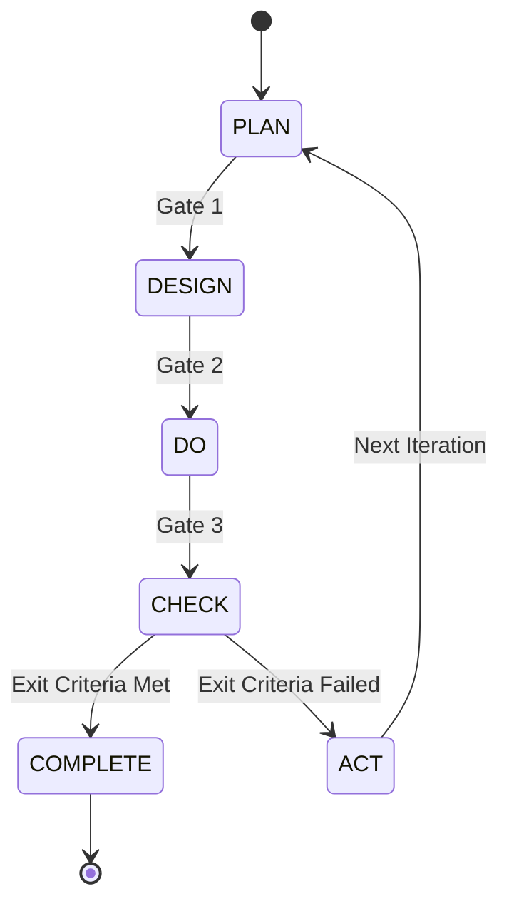
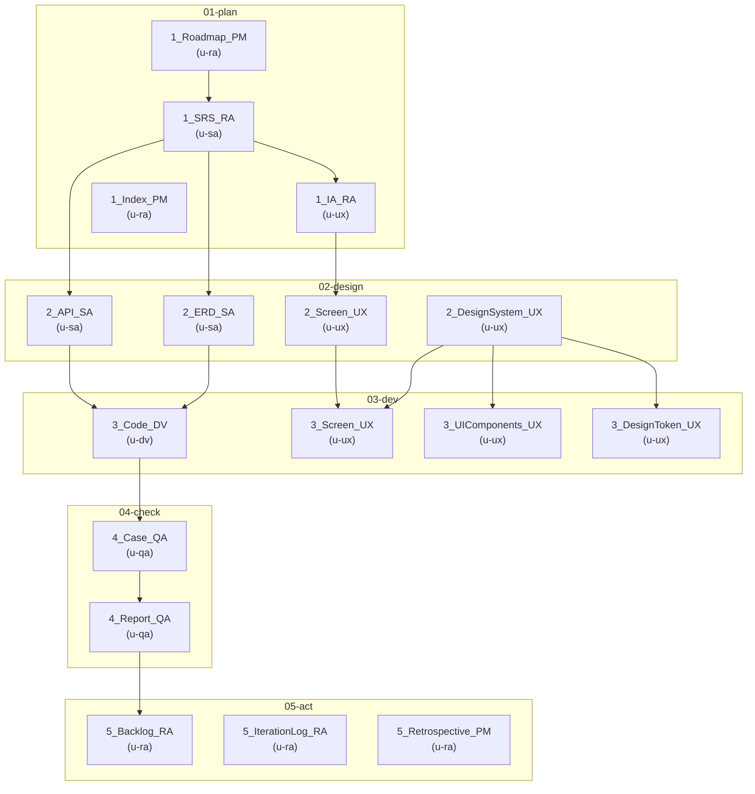
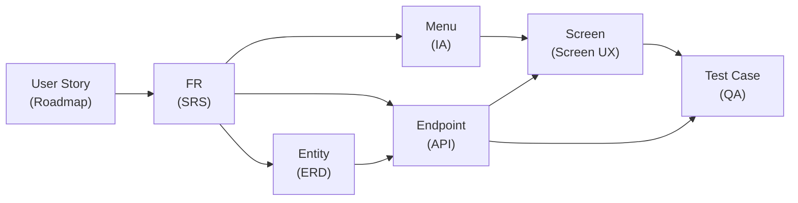

# u-Agent SSoT

> PDCA 사이클 기반의 SSoT(Single Source of Truth) 소프트웨어 개발 협업 자동화 Claude Code Plugin

**문서가 프로세스를 강제하고, 에이전트가 이를 실행한다.**

---

## Overview

u-Agent SSoT는 6개 전문 에이전트가 PDCA(Plan-Design-Do-Check-Act) 사이클을 따라 소프트웨어 개발을 자동화하는 Claude Code Plugin이다. 모든 결정과 산출물은 `u-docs/` SSoT 문서 체계에 기록되며, 종료 조건 충족까지 자동 반복한다.

### 핵심 원칙

- **문서 중심**: 모든 결정과 산출물은 `u-docs/` SSoT 문서에 기록
- **Phase Gate**: 각 Phase 전환은 Gate 조건 충족 필수
- **자동 반복**: CHECK 실패 시 ACT → 다음 Iteration 자동 전환
- **역할 분리**: 6개 전문 에이전트가 명확한 역할 분담
- **기술 스택 강제**: 10가지 기술 스택 규칙 위반 시 거부
- **연쇄 갱신**: 요구사항 변경 시 영향받는 하위 문서를 자동으로 함께 갱신
- **다이어그램 필수**: 모든 SSoT 문서에 Mermaid 다이어그램 최소 1개 이상 포함

---

## Installation

```bash
# Claude Code Plugin 디렉토리에 복사
cp -r u-ssot/ ~/.claude/plugins/u-ssot/
```

또는 프로젝트 로컬 플러그인으로 사용:

```bash
# 프로젝트 루트에 배치
cp -r u-ssot/ .claude/plugins/u-ssot/
```

---

## Quick Start

```bash
# 1-a. 새 프로젝트 생성
/u-create-project my-app

# 1-b. 기존 프로젝트 분석 → SSoT 문서 자동 생성
/u-init                     # 기본 한국어
/u-init --lang en           # 영어로 문서 생성

# 2. PLAN Phase (로드맵 → SRS → IA → 인덱스)
/u-plan

# 3. DESIGN Phase (화면설계 → 디자인시스템 → ERD → API)
/u-design

# 4. DO Phase (Frontend + Backend 병렬 개발)
/u-dev

# 5. CHECK Phase (테스트 케이스 → 실행 → 결함분석)
/u-check

# 6. 종료 조건 충족까지 자동 반복
/u-loop
```

---

## 6 Agents

| Agent | Role | Phase | 담당 문서 |
|-------|------|-------|----------|
| `u-ra` | Requirements Analyst | ALL | 1_Roadmap_PM, 1_Index_PM, 5_Backlog_RA, 5_IterationLog_RA, 5_Retrospective_PM |
| `u-sa` | Software Architect | PLAN, DESIGN | 1_SRS_RA, 2_ERD_SA, 2_API_SA |
| `u-ux` | UX Designer | PLAN, DESIGN, DO | 1_IA_RA, 2_Screen_UX, 2_DesignSystem_UX, 3_Screen_UX, 3_UIComponents_UX, 3_DesignToken_UX |
| `u-dv-fe` | Frontend Developer | DO | 코드 생성 (Next.js + react-query) |
| `u-dv-be` | Backend Developer | DO | 코드 생성 (API Routes + ORM) |
| `u-qa` | Quality Assurance | CHECK | 4_Case_QA, 4_Report_QA |

---

## PDCA Workflow


```mermaid
stateDiagram-v2
    [*] --> PLAN
    PLAN --> DESIGN : Gate 1
    DESIGN --> DO : Gate 2
    DO --> CHECK : Gate 3
    CHECK --> COMPLETE : Exit Criteria Met
    CHECK --> ACT : Exit Criteria Failed
    ACT --> PLAN : Next Iteration
    COMPLETE --> [*]
```

### Phase Gate 조건

| Transition | 조건 |
|------------|------|
| PLAN → DESIGN | Roadmap + SRS + IA 모두 Final |
| DESIGN → DO | ERD + API + Screen 모두 Final + u-RA 검수 |
| DO → CHECK | 코드 구현 완료 + `bun run build` 성공 |
| CHECK → Complete | Critical/Major 0건 + 백로그 0건 + 전체 FR 구현 |
| CHECK → ACT | 위 조건 미충족 시 자동 전환 |

### 종료 조건 (Exit Criteria)

4가지 모두 충족 시 루프 종료:

1. `5_Backlog_RA.md`의 모든 항목 Done
2. Critical/Major 결함 0건
3. SRS의 모든 FR 구현 완료
4. `bun run build` 성공

---

## Slash Commands

### Lifecycle

| Command | Description |
|---------|-------------|
| `/u-create-project` | 새 프로젝트 초기화 (Turborepo + u-docs) |
| `/u-init [--lang ko\|en\|ja\|zh]` | 기존 프로젝트 분석 → SSoT 문서 자동 생성 |
| `/u-plan` | PLAN Phase 실행 |
| `/u-design` | DESIGN Phase 실행 |
| `/u-dev` | DO Phase 실행 (FE/BE 병렬) |
| `/u-check` | CHECK Phase 실행 |
| `/u-act` | ACT Phase 실행 |

### Loop

| Command | Description |
|---------|-------------|
| `/u-loop` | 종료 조건까지 PDCA 자동 반복 |
| `/u-loop-from [phase]` | 지정 Phase부터 루프 시작 |
| `/u-stop` | 루프 중단 |
| `/u-resume` | 루프 재개 |

### Document Management

| Command | Description |
|---------|-------------|
| `/u-status` | 현재 상태 보고 |
| `/u-docs` | 문서 목록 조회 |
| `/u-validate` | SSoT 무결성 검증 |
| `/u-backlog` | 백로그 조회 |
| `/u-backlog-add` | 백로그 항목 추가 |
| `/u-us-add` | 유저 스토리 추가 |
| `/u-fr-add [app]` | 기능 요구사항(FR) 추가 |
| `/u-index` | 문서 인덱스 갱신 |

### Individual Agent

| Command | Description |
|---------|-------------|
| `/u-srs [app]` | SRS 문서 생성/갱신 |
| `/u-erd` | ERD 생성/갱신 |
| `/u-api [app]` | API Contract 생성/갱신 |
| `/u-screen [app]` | 화면 설계 생성/갱신 |
| `/u-fe [app]` | Frontend 개발 실행 |
| `/u-be [app]` | Backend 개발 실행 |
| `/u-test [app]` | 테스트 케이스 설계/실행 |
| `/u-bug-report [app]` | 결함 분석 리포트 |
| `/u-gap-detector` | 설계-구현 Gap 분석 |

### Utility

| Command | Description |
|---------|-------------|
| `/u-help` | 전체 명령어 도움말 |
| `/u-history` | Iteration 이력 조회 |
| `/u-archive` | 현재 Iteration 아카이브 |
| `/u-storybook` | Storybook 실행 |
| `/u-build` | 프로젝트 빌드 |
| `/u-summary` | 프로젝트 요약 생성 |
| `/u-git-pr` | Git commit + PR 생성 |

---

## SSoT Document Structure


```mermaid
flowchart TD
    subgraph PLAN["01-plan"]
        ROADMAP["1_Roadmap_PM\n(u-ra)"]
        SRS["1_SRS_RA\n(u-sa)"]
        IA["1_IA_RA\n(u-ux)"]
        INDEX["1_Index_PM\n(u-ra)"]
    end

    subgraph DESIGN["02-design"]
        ERD["2_ERD_SA\n(u-sa)"]
        API["2_API_SA\n(u-sa)"]
        SCREEN["2_Screen_UX\n(u-ux)"]
        DSYS["2_DesignSystem_UX\n(u-ux)"]
    end

    subgraph DEV["03-dev"]
        CODE["3_Code_DV\n(u-dv)"]
        SCR_UX["3_Screen_UX\n(u-ux)"]
        UICOMP["3_UIComponents_UX\n(u-ux)"]
        DTOKEN["3_DesignToken_UX\n(u-ux)"]
    end

    subgraph CHECK["04-check"]
        CASE["4_Case_QA\n(u-qa)"]
        REPORT["4_Report_QA\n(u-qa)"]
    end

    subgraph ACT["05-act"]
        BACKLOG["5_Backlog_RA\n(u-ra)"]
        ITERLOG["5_IterationLog_RA\n(u-ra)"]
        RETRO["5_Retrospective_PM\n(u-ra)"]
    end

    ROADMAP --> SRS
    SRS --> IA
    SRS --> ERD
    SRS --> API
    IA --> SCREEN
    DSYS --> SCR_UX
    DSYS --> UICOMP
    DSYS --> DTOKEN
    ERD --> CODE
    API --> CODE
    SCREEN --> SCR_UX
    CODE --> CASE
    CASE --> REPORT
    REPORT --> BACKLOG
```

### Shared vs App-Specific Documents

| Scope | Path | Documents |
|-------|------|-----------|
| shared | `u-docs/shared/{phase}/` | Roadmap, Index, ERD, DesignSystem, UIComponents, DesignToken, Backlog, IterationLog, Retrospective |
| app | `u-docs/{app}/{phase}/` | SRS, IA, API, Screen(design+dev), Code, Case, Report |

모든 문서는 공통 SSoT 헤더를 포함한다:

```yaml
---
Owner: [agent-id]
Status: Draft | Review | Final
Version: 1.0.0
Last Updated: YYYY-MM-DD
Related Docs:
  - [relative path]
---
```

---

## Cascading Document Update

기능, 시나리오, 요구사항 등을 추가/수정/삭제할 때, 영향받는 하위 문서를 **반드시 함께 갱신**한다.


```mermaid
flowchart LR
    US["User Story\n(Roadmap)"] --> FR["FR\n(SRS)"]
    FR --> IA_D["Menu\n(IA)"]
    FR --> ERD_D["Entity\n(ERD)"]
    FR --> API_D["Endpoint\n(API)"]
    IA_D --> SCR["Screen\n(Screen UX)"]
    API_D --> SCR
    ERD_D --> API_D
    SCR --> TC["Test Case\n(QA)"]
    API_D --> TC
```

| 변경 대상 | 영향받는 문서 |
|-----------|-------------|
| User Story (Roadmap) | → SRS (FR mapping) → IA |
| FR (SRS) | → IA → Screen → API → ERD → Code → QA Case |
| Menu/IA | → Screen → Navigation Flow |
| Screen | → API → QA Case |
| API | → Screen → ERD → Code → QA Case |
| ERD | → API → Code |

---

## Mermaid Diagram Requirements

모든 SSoT 문서는 최소 1개 이상의 Mermaid 다이어그램을 포함한다. 17개 템플릿에 총 39개 다이어그램이 내장되어 있다.

| Diagram Type | 사용 문서 | 용도 |
|-------------|----------|------|
| `mindmap` | IA | 메뉴 트리 구조 |
| `flowchart` | Index, SRS, IA, Screen, Code, DesignSystem, UIComponents, Report | 의존성, 계층, 로직 흐름 |
| `gantt` | Roadmap, SRS | 타임라인, 일정 |
| `erDiagram` | ERD | Entity-Relationship |
| `sequenceDiagram` | API, Case | API 호출 흐름, 테스트 실행 |
| `stateDiagram-v2` | Index, ERD, Screen, Backlog, Report | 상태 전이 |
| `pie` | Case, Report, Backlog | 분포도 |
| `xychart-beta` | IterationLog, Retrospective | 추이 차트 |

---

## Tech Stack Rules

코드 생성 시 아래 10가지 규칙을 강제한다. 위반 시 `PreToolUse` hook이 차단한다.

| # | Rule | 위반 예시 |
|---|------|----------|
| 1 | Clean Architecture 폴더 구조 | `src/` 직하에 비즈니스 로직 |
| 2 | react-query 사용 (usecase 금지) | usecase/ 패턴 |
| 3 | .css 직접 사용 (CSS-in-JS 금지) | styled-components, emotion |
| 4 | Next.js App Router | Pages Router |
| 5 | eslint-plugin-header 사용 금지 | eslint config에 header 플러그인 |
| 6 | Turborepo monorepo | 단일 패키지 구조 |
| 7 | 함수형 컴포넌트만 | class 컴포넌트 |
| 8 | Storybook 적용 | .stories 파일 미생성 |
| 9 | Design Token 기반 | 하드코딩된 색상/폰트 |
| 10 | bun 패키지 매니저 | npm install, yarn add |

---

## Plugin Structure

```
u-ssot/
├── .claude-plugin/
│   └── plugin.json              # Plugin 메타데이터
├── skills/
│   ├── u-ssot/SKILL.md          # 메인 오케스트레이터
│   └── u-*/SKILL.md             # 35개 개별 스킬
├── agents/                      # 6 에이전트 정의
├── references/                  # 참조 문서
├── templates/                   # 17 SSoT 템플릿 (39 다이어그램)
├── commands/                    # 슬래시 커맨드
├── scripts/                     # 자동화 스크립트
├── hooks/                       # Hook 시스템
├── lib/                         # 유틸리티 라이브러리
├── evals/                       # 테스트 케이스
└── u-ssot.config.json           # 설정 파일
```

---

## Hooks

| Hook | Trigger | Action |
|------|---------|--------|
| `SessionStart` | 플러그인 초기화 | u-docs/ 구조 검증/생성 |
| `PreToolUse(Write\|Edit)` | 파일 작성 시 | u-docs/ 경로 강제 + 기술 스택 위반 탐지 |
| `PostToolUse(Write)` | 문서 생성 후 | 자동 인덱스 갱신 알림 |
| `Stop` | 세션 종료 | Phase/Iteration/Loop 상태 저장 |

---

## Configuration

`u-ssot.config.json`에서 다음을 설정할 수 있다:

```jsonc
{
  "documentLanguage": "ko", // 문서 작성 언어 (ko|en|ja|zh, 기본: ko)
  "pdca": {
    "maxIterations": 10,    // 최대 반복 횟수
    "autoIterate": true     // 자동 반복 여부
  },
  "techStack": {
    "rules": [...]          // 기술 스택 규칙 on/off
  },
  "agents": {
    "routing": {            // 에이전트별 Phase/Trigger 설정
      "u-ra": { "phases": ["plan", "design", "do", "check", "act"], ... }
    }
  }
}
```

---

## License

Private - Internal use only.
