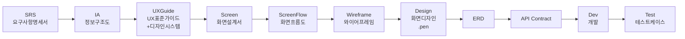
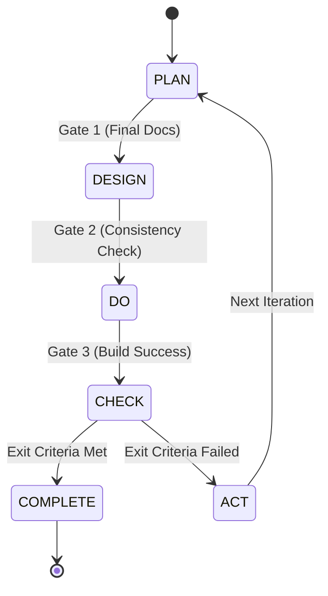

# u-maker v2.0.0

> PDCA 사이클 기반의 SSoT(Single Source of Truth) 소프트웨어 개발 협업 자동화 AI 에이전트 생태계
> (Claude Code / Codex CLI / Gemini CLI 플러그인)

**문서가 프로세스를 강제하고, 에이전트가 이를 실행한다.**

---

## Overview

u-maker는 7개 전문 에이전트가 PDCA(Plan-Design-Do-Check-Act) 사이클을 따라 소프트웨어 개발 전 과정을 자동화하는 시스템입니다. 모든 결정과 산출물은 `.u-maker/docs/` SSoT 문서 체계에 기록되며, 종료 조건(Exit Criteria)을 충족할 때까지 이터레이션을 반복합니다.

### 핵심 원칙

| 원칙 | 설명 |
|------|------|
| **문서 중심 (SSoT)** | 모든 결정과 산출물은 `.u-maker/docs/` 내 지정된 문서에만 기록 |
| **Phase Gate** | 각 단계 전환 시 Gate 조건(Final 상태, 모순 검수 등) 충족 필수 |
| **추적성 (Traceability)** | US/FR → 설계(API/ERD/Screen) → 코드 → 테스트까지 연쇄 추적 |
| **유저 스토리 기반** | 추상적 요구사항을 유저 스토리로 구체화 → 기능 요구사항(FR) 도출 |
| **자동 반복 (PDCA Loop)** | CHECK 단계 실패 시 ACT를 거쳐 다음 Iteration으로 자동 전환 |
| **기술 스택 강제** | 10가지 핵심 기술 스택 규칙 위반 시 도구 실행 차단 |
| **JSON 내보내기** | 마크다운 문서 생성/갱신 시 동명의 `.json` 파일을 동일 경로에 함께 생성 |
| **Docs-First Guard** | 새 기능/요구사항 감지 시 문서 수정을 먼저 요구 (UserPromptSubmit Hook) |

---

## Quick Start

```bash
# 1. 새 프로젝트 초기화 (Turborepo + .u-maker/docs 구조)
/u-skill-create-project my-app

# 2. PLAN Phase (로드맵 → SRS(US+FR) → IA → 인덱스)
/u-skill-plan

# 3. DESIGN Phase (UXGuide → Screen → ScreenFlow → Wireframe → Design → ERD + API → 모순검수)
/u-skill-design

# 4. DO Phase (Frontend + Backend 병렬 구현)
/u-skill-dev

# 5. CHECK Phase (테스트 케이스 설계 → 실행 → 결함 분석)
/u-skill-check

# 6. 종료 조건 충족까지 PDCA 자동 반복
/u-skill-loop
```

---

## Plugin Structure

```
u-maker-plugin/
├── .u-maker/                          # 프로젝트 설정 및 SSoT 문서
│   ├── u-ssot.config.json             # 프로젝트 설정 (단일 진실 공급원)
│   └── docs/                          # SSoT 문서 루트
│       ├── shared/                    # 공유 문서 (Roadmap, ERD 등)
│       ├── {app}/                     # 앱별 문서 (SRS, API 등)
│       └── iterations/                # 이터레이션 아카이브
│
├── skills/u-skill-*/SKILL.md          # 39개 스킬 (user-invocable)
├── agents/u-agent-*.md                # 7개 전문 에이전트
├── _refer/                            # 참고용 표준 문서
│   ├── ssot-standard.md               # SSoT 문서 작성 규격
│   ├── json-export.md                 # 15개 문서별 JSON 스키마
│   ├── pdca-workflow.md               # PDCA 워크플로우 규칙
│   ├── tech-stack-rules.md            # 기술 스택 10가지 규칙
│   ├── traceability-matrix.md         # 추적성 매트릭스
│   ├── iteration-rules.md             # 이터레이션 규칙
│   ├── post-execution-summary.md      # 실행 후 요약 박스
│   ├── mermaid-guide.md               # Mermaid 다이어그램 가이드
│   ├── slash-commands.md              # 스킬 명령어 목록
│   └── model-assignment.md            # 에이전트별 모델 배정
│
├── templates/                         # SSoT 문서 템플릿
│   ├── 01-plan/                       # PLAN Phase 템플릿
│   ├── 02-design/                     # DESIGN Phase 템플릿
│   ├── 03-dev/                        # DO Phase 템플릿
│   ├── 04-check/                      # CHECK Phase 템플릿
│   └── 05-act/                        # ACT Phase 템플릿
│
├── hooks/                             # Claude Code 이벤트 훅
│   ├── hooks.json                     # 훅 설정
│   └── session-start.js               # 세션 시작 시 .u-maker/docs/ 구조 생성
│
├── scripts/                           # 훅 스크립트
│   ├── prompt-docs-first-guard.js     # UserPromptSubmit: 문서 우선 가드
│   ├── pre-write-guard.js             # PreToolUse: SSoT 경로 + 기술스택 검증
│   ├── post-write-index.js            # PostToolUse: 인덱스 갱신 알림
│   ├── stop-state-save.js             # Stop: 세션 상태 저장
│   └── render-json-report.js          # JSON → HTML 보고서 렌더러
│
├── lib/                               # 공유 라이브러리
│   ├── state.js                       # PDCA 상태 관리
│   ├── doc-tracker.js                 # 문서 추적
│   └── gate.js                        # Phase Gate 검증
│
├── evals/                             # 평가 테스트
├── deploy_local.sh                    # 로컬 배포 스크립트
└── README.md
```

---

## 7 Specialized Agents

| Agent | Role | Phase | 주요 담당 범위 |
|-------|------|-------|--------------|
| `u-agent-ra` | Requirements Analyst | ALL | 로드맵, 인덱스, 이터레이션 로그(백로그 포함), 회고, SSoT 검증 |
| `u-agent-sa` | Solution Architect | PLAN, DESIGN | SRS(요구사항 명세), ERD(데이터 모델), API Contract(OpenAPI) |
| `u-agent-ux` | UX Designer | PLAN, DESIGN, DO | IA(메뉴구조), UXGuide(UX표준가이드+디자인시스템), 화면 설계, 화면 흐름도, HTML 와이어프레임, UI 컴포넌트, 디자인 토큰 |
| `u-agent-ux-ds` | Pencil Designer | DESIGN, DO | pencil.dev MCP 기반 시각적 디자인 (.pen 파일) 생성 및 업데이트 |
| `u-agent-dv-fe` | Frontend Developer | DO | Next.js App Router + react-query 기반 프론트엔드 코드 구현 |
| `u-agent-dv-be` | Backend Developer | DO | API Routes + Prisma/Drizzle ORM 기반 백엔드 로직 구현 |
| `u-agent-qa` | QA Engineer | CHECK | 테스트 케이스 설계 및 실행, 결함 분석 리포트, 설계-구현 Gap 분석 |

---

## 산출문서 파이프라인

문서는 아래 순서로 생산됩니다. 테이블에 작성되는 목록 데이터는 동명의 `.json` 파일로 별도 생성합니다.


```mermaid
flowchart LR
    SRS[SRS\n요구사항명세서] --> IA[IA\n정보구조도]
    IA --> UXG[UXGuide\nUX표준가이드\n+디자인시스템]
    UXG --> SCR[Screen\n화면설계서]
    SCR --> SF[ScreenFlow\n화면흐름도]
    SF --> WF[Wireframe\n와이어프레임]
    WF --> VD[Design\n화면디자인\n.pen]
    VD --> ERD[ERD]
    ERD --> API[API Contract]
    API --> DEV[Dev\n개발]
    DEV --> TEST[Test\n테스트케이스]
```

| # | 산출문서 | 파일명 | 담당 에이전트 | Scope |
|---|---------|--------|-------------|-------|
| 1 | 로드맵 | `1_Roadmap_PM.md` | u-agent-ra | shared |
| 2 | 요구사항명세서 | `1_SRS_RA.md` | u-agent-sa | app |
| 3 | 정보구조도 (IA) | `1_IA_RA.md` | u-agent-ux | app |
| 4 | 문서인덱스 | `1_Index_PM.md` | u-agent-ra | shared |
| 5 | UX표준가이드 (디자인시스템 포함) | `2_UXGuide_UX.md` | u-agent-ux | shared |
| 6 | 화면설계서 | `2_Screen_UX.md` | u-agent-ux | app |
| 7 | 화면흐름도 | `2_ScreenFlow_UX.md` | u-agent-ux | app |
| 8 | 와이어프레임 | `2_Screen_Wireframes/*.html` | u-agent-ux | app |
| 9 | 화면디자인 | `.pen` 파일 (pencil.dev) | u-agent-ux-ds | app |
| 10 | ERD | `2_ERD_SA.md` | u-agent-sa | shared |
| 11 | API Contract | `2_API_SA.md` | u-agent-sa | app |
| 12 | 개발현황 | `3_Code_DV.md` + 코드 | u-agent-dv-fe/be | app |
| 13 | 테스트케이스 | `4_Case_QA.md` | u-agent-qa | app |
| 14 | 테스트보고서 | `4_Report_QA.md` | u-agent-qa | app |

---

## PDCA Workflow & Gates

### Workflow


```mermaid
stateDiagram-v2
    [*] --> PLAN
    PLAN --> DESIGN : Gate 1 (Final Docs)
    DESIGN --> DO : Gate 2 (Consistency Check)
    DO --> CHECK : Gate 3 (Build Success)
    CHECK --> COMPLETE : Exit Criteria Met
    CHECK --> ACT : Exit Criteria Failed
    ACT --> PLAN : Next Iteration
    COMPLETE --> [*]
```

### Phase Gates (전환 조건)

| Transition | 조건 (Gate Criteria) | 검수자 |
|------------|---------------------|-------|
| PLAN → DESIGN | Roadmap + SRS + IA 상태가 'Final'이며 모든 US→FR 매핑 완료 | `u-agent-ra` |
| DESIGN → DO | ERD + UXGuide + API + Screen + ScreenFlow 상태가 'Final'이며 모순 검수 통과 | `u-agent-ra` |
| DO → CHECK | 모든 코드 구현 완료 및 `bun run build` 성공 | 시스템 |
| CHECK → COMPLETE | Critical/Major 결함 0건 + 모든 FR 구현 완료 + 백로그 0건 | `u-agent-qa` |
| CHECK → ACT | 위 조건 미충족 시 자동으로 ACT 단계로 진입 | 시스템 |

### Exit Criteria

루프가 종료되려면 아래 조건을 모두 충족해야 합니다:

1. `4_Report_QA.md`에서 Critical/Major 결함 수 = 0
2. `1_SRS_RA.md`의 모든 FR 항목 상태가 Implemented
3. `bun run build` 통과

---

## SSoT Document Structure

`.u-maker/docs/` 폴더 내의 문서는 **Shared(공유)**와 **App-Specific(앱 전용)**으로 구분됩니다.

```
.u-maker/docs/
├── shared/
│   ├── 01-plan/          1_Roadmap_PM, 1_Index_PM
│   ├── 02-design/        2_ERD_SA, 2_UXGuide_UX
│   ├── 03-dev/           3_UIComponents_UX, 3_DesignToken_UX
│   └── 05-act/           5_IterationLog_RA, 5_Retrospective_PM
├── {app}/
│   ├── 01-plan/          1_SRS_RA, 1_IA_RA
│   ├── 02-design/        2_API_SA, 2_Screen_UX, 2_ScreenFlow_UX, 2_Screen_Wireframes/
│   ├── 03-dev/           3_Code_DV, 3_Screen_UX (Dev ver.)
│   └── 04-check/         4_Case_QA, 4_Report_QA
└── iterations/           아카이브된 이전 이터레이션
```

---

## Skills Reference

모든 스킬은 `user-invocable`로 슬래시(`/u-skill-*`)로 직접 호출 가능합니다.

### Lifecycle & Auto-Loop

| Skill | Syntax | Description |
|-------|--------|-------------|
| `u-skill-create-project` | `/u-skill-create-project <name>` | 새 프로젝트 생성 및 .u-maker/docs 구조 초기화 |
| `u-skill-init` | `/u-skill-init [path]` | 기존 프로젝트 분석 및 SSoT 역공학 생성 |
| `u-skill-plan` | `/u-skill-plan [app]` | PLAN 단계 실행 (Roadmap, SRS, IA 생성) |
| `u-skill-design` | `/u-skill-design [app]` | DESIGN 단계 실행 (UXGuide ~ API, 모순검수) |
| `u-skill-dev` | `/u-skill-dev [app]` | DO 단계 실행 (FE/BE 병렬 구현) |
| `u-skill-check` | `/u-skill-check [app]` | CHECK 단계 실행 (테스트 및 결함 분석) |
| `u-skill-act` | `/u-skill-act` | ACT 단계 실행 (백로그 정리, 회고) |
| `u-skill-loop` | `/u-skill-loop` | 종료 조건 충족까지 PDCA 전체 자동 반복 |
| `u-skill-loop-from` | `/u-skill-loop-from <phase>` | 특정 단계부터 루프 시작 |
| `u-skill-stop` | `/u-skill-stop` | 실행 중인 루프 중단 |
| `u-skill-resume` | `/u-skill-resume` | 중단된 루프 재개 |

### Document & Requirements Management

| Skill | Description |
|-------|-------------|
| `u-skill-us-add` | 새로운 유저 스토리 추가 → `1_SRS_RA.md` |
| `u-skill-fr-add` | 새로운 기능 요구사항(FR) 추가 → `1_SRS_RA.md` |
| `u-skill-backlog-add` | 새로운 백로그(버그/개선) 항목 추가 → `5_IterationLog_RA.md` |
| `u-skill-status` | 현재 Iteration/Phase 진행률 및 상태 보고 |
| `u-skill-docs` | 전체 SSoT 문서 목록 및 상태 조회 |
| `u-skill-validate` | SSoT 문서 무결성 및 추적성 검증 |
| `u-skill-gap-detector` | 설계 문서 vs 실제 구현 코드 일치도 분석 |
| `u-skill-summary` | 프로젝트 개요 및 현재 상태 요약 출력 |

### Individual Agent Skills

| Category | Skills |
|----------|--------|
| **Design** | `u-skill-srs` (요구사항 명세), `u-skill-erd` (ERD), `u-skill-api` (API Contract), `u-skill-screen` (화면 설계), `u-skill-wireframe` (HTML 와이어프레임) |
| **Visual Design** | `u-skill-ux-design` (pencil.dev 기반 시각 디자인), `u-skill-ux-ds` (디자인 시스템) |
| **Implementation** | `u-skill-fe` (Frontend), `u-skill-be` (Backend), `u-skill-storybook` (Storybook) |
| **Quality** | `u-skill-test` (테스트 케이스), `u-skill-bug-report` (결함 분석) |

### Utility

| Skill | Description |
|-------|-------------|
| `u-skill-build` | 프로젝트 빌드 실행 (`bun run build`) |
| `u-skill-git-pr` | 변경 파일을 feature 단위로 커밋 및 GitHub PR 생성 |
| `u-skill-history` | 전체 Iteration 수행 이력 조회 |
| `u-skill-archive` | 현재 Iteration 문서를 `iterations/`로 아카이브 |
| `u-skill-index` | 문서 인덱스 갱신 |
| `u-skill-help` | 모든 스킬 상세 설명 및 사용법 표시 |
| `u-skill-json-report` | JSON Export 파일을 HTML 보고서로 렌더링 |
| `u-skill-json-report-render` | 지정 template + json으로 HTML 보고서 렌더링 |

---

## Command Workflows by Scenario

### 1. 신규 프로젝트 시작 (Zero to One)
```bash
/u-skill-create-project my-app    # 프로젝트 구조 생성
/u-skill-us-add "핵심 아이디어"     # 유저 스토리 등록
/u-skill-loop                      # 전체 PDCA 자동 실행
```

### 2. 기존 프로젝트 분석 및 SSoT 도입
```bash
/u-skill-init                      # 기존 코드 → SSoT 역공학
/u-skill-status                    # 생성된 문서 상태 확인
/u-skill-loop                      # 부족한 설계 보완 후 개발 사이클
```

### 3. 새로운 기능 추가 (Feature Addition)
```bash
/u-skill-us-add                    # 유저 스토리(사용자 요구사항) 추가
/u-skill-fr-add                    # 기능 요구사항(시스템 상세 명세) 추가
/u-skill-loop                      # 설계 변경 및 코드 구현 자동화
```

### 4. 유지보수 및 버그 수정 (Maintenance)
```bash
/u-skill-backlog-add               # 이슈 등록
/u-skill-loop-from design          # DESIGN 단계부터 루프
/u-skill-bug-report                # 결함 분석 및 수정 가이드
```

### 5. 품질 검증 및 배포 (Quality & Deploy)
```bash
/u-skill-validate                  # SSoT 문서 무결성 검증
/u-skill-gap-detector              # 설계-구현 일치도 분석
/u-skill-build                     # 최종 빌드 확인
/u-skill-git-pr                    # feature별 커밋 + PR 생성
```

---

## Hooks (이벤트 자동화)

u-maker는 5개의 이벤트 훅으로 개발 품질을 자동 강제합니다.

| Event | Script | 동작 |
|-------|--------|------|
| `SessionStart` | `session-start.js` | `.u-maker/docs/` 폴더 구조 자동 생성/복구 |
| `UserPromptSubmit` | `prompt-docs-first-guard.js` | 새 기능/요구사항 감지 시 문서 수정 먼저 요구 |
| `PreToolUse(Write\|Edit)` | `pre-write-guard.js` | SSoT 문서 경로 검증 + 기술 스택 위반 차단 |
| `PostToolUse(Write)` | `post-write-index.js` | `.u-maker/docs/` 문서 쓰기 후 인덱스 갱신 알림 |
| `Stop` | `stop-state-save.js` | 세션 종료 시 PDCA 상태 저장 |

---

## Tech Stack Rules (TS-01 ~ TS-10)

코드 생성 시 아래 10가지 규칙이 엄격히 강제됩니다. 위반 시 `PreToolUse` 훅에 의해 차단됩니다.

| ID | Rule | Enforce |
|----|------|---------|
| TS-01 | Clean Architecture 폴더 구조 | Hook |
| TS-02 | `react-query` 데이터 페칭 (Usecase 패턴 금지) | Agent |
| TS-03 | Plain `.css` 파일 (CSS-in-JS 금지) | Hook |
| TS-04 | Next.js App Router (Pages Router 금지) | Agent |
| TS-05 | `eslint-plugin-header` 금지 | Agent |
| TS-06 | Turborepo Monorepo 구조 | Agent |
| TS-07 | Functional Components Only (Class 금지) | Hook |
| TS-08 | Storybook 컴포넌트 문서화 | Agent |
| TS-09 | Design Token 기반 스타일링 | Agent |
| TS-10 | `bun` 패키지 매니저 (npm/yarn/pnpm 금지) | Hook |

---

## Mermaid Diagram Requirements

모든 SSoT 문서는 정보의 가시성을 위해 다이어그램을 포함해야 합니다.

| Diagram Type | 주요 용도 |
|-------------|----------|
| `flowchart` | IA 메뉴 트리, 로직 흐름, 문서 의존성, 네비게이션 플로우 |
| `erDiagram` | DB 엔티티 관계 (ERD) |
| `sequenceDiagram` | API 호출 흐름, 인증 흐름, 테스트 시나리오 |
| `stateDiagram-v2` | 상태 전이 (결함 상태, 문서 상태 등) |
| `journey` | 사용자 경험 흐름 |
| `xychart-beta` | 이터레이션별 진척도 및 품질 추이 |

---

## JSON Report Rendering

SSoT JSON 파일을 시각적 HTML 보고서로 렌더링합니다.

```bash
# 단건 템플릿 생성 + HTML 렌더링
node scripts/render-json-report.js --json <path/to/doc.json> --init-template

# 지정 템플릿으로 HTML 생성
node scripts/render-json-report.js \
  --json <path/to/doc.json> \
  --template templates/report/json-report.template.html \
  --output <path/to/doc.report.html>

# 전체 JSON 일괄 렌더링
node scripts/render-json-report.js --all --root .u-maker/docs --init-template
```

---

## Deployment

```bash
# 로컬 배포 (Claude Code + Codex + Gemini)
./deploy_local.sh

# 배포 상태 확인
./deploy_local.sh --check

# 배포 제거
./deploy_local.sh --clean
```

배포 스크립트는 자동으로:
1. `~/.claude/plugins/cache/`에 플러그인 파일을 동기화
2. `~/.claude/skills/`에 스킬 심볼릭 링크 등록
3. Codex/Gemini CLI와 플러그인 디렉토리를 공유

---

## License

Private - Internal use only.
