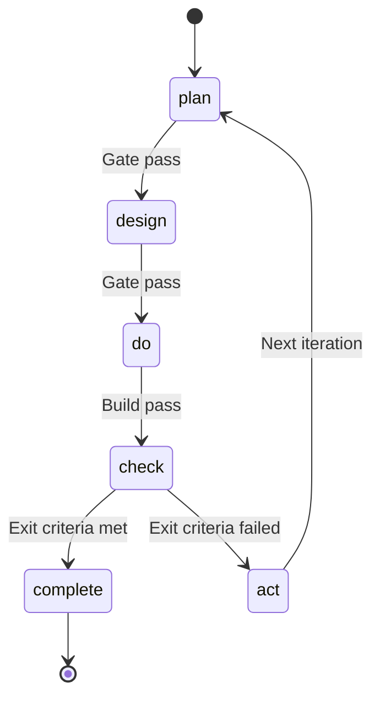

# u-maker Plugin

PDCA(Plan-Design-Do-Check-Act) 기반 SSoT(Single Source of Truth) 협업 워크플로우를 Claude Code/Codex/Gemini 환경에서 실행하기 위한 로컬 플러그인입니다.

- Plugin package version: `1.0.0` (`.claude-plugin/plugin.json`)
- SSoT spec/config version: `2.0.0` (`.u-maker/u-ssot.config.json`)

## TL;DR

1. `./deploy_local.sh` 실행
2. Claude Code/Codex/Gemini 재시작
3. 프로젝트에서 `/u-skill-create-project <name>` 또는 `/u-skill-init [path]` 실행
4. `/u-skill-loop`로 PDCA 자동 반복

---

## 1) What This Plugin Solves

u-maker는 문서와 코드를 분리하지 않고, **문서 중심 개발(SSoT)**을 강제하는 협업 플러그인입니다.

핵심 목표:

- 요구사항부터 테스트까지 추적 가능한 체계 유지 (`FR → US → FT → 설계 → 코드 → QA`)
- Phase Gate 기반으로 무분별한 단계 전환 방지
- 문서/코드/테스트의 반복 개선(PDCA Loop) 자동화
- 기술 스택 규칙 위반을 Hook으로 사전 차단

SRS(`1_SRS_RA.md`) 작성 규칙은 항상 **Requirements(FR) 먼저, User Stories(US) 다음, Features(FT) 마지막**입니다.

---

## 2) Core Concepts

### 2.1 PDCA 흐름


```mermaid
stateDiagram-v2
    [*] --> plan
    plan --> design: Gate pass
    design --> do: Gate pass
    do --> check: Build pass
    check --> complete: Exit criteria met
    check --> act: Exit criteria failed
    act --> plan: Next iteration
    complete --> [*]
```

### 2.2 Phase Gate (현재 구현 기준)

- `plan -> design`
  - common: `1_Roadmap_PM.md` = Final
  - per-app: `1_SRS_RA.md`, `1_IA_RA.md` = Final
- `design -> do`
  - common: `2_ERD_SA.md`, `2_RTM_RA.md`, `2_UXGuide_UX.md` = Final
  - per-app: `2_API_SA.md`, `2_Screen_UX.md`, `2_ScreenFlow_UX.md` = Final
- `do -> check`
  - `bun run build` 성공

### 2.3 Exit Criteria

`lib/gate.js` / `scripts/check-exit-criteria.py` 기준 자동 판정 항목:

- Critical/Major 결함 0건
- SRS의 FR 구현 완료
- `bun run build` 성공

운영 정책 문서에서는 백로그 0건까지 포함한 stricter 기준을 함께 사용합니다.

---

## 3) Agents & Responsibilities

현재 저장소 기준 전문 에이전트 파일은 8개입니다.

| Agent | Main Role | Primary Phase |
|---|---|---|
| `u-agent-pm` | 로드맵/인덱스/회고/데일리 리포트 | PLAN, ACT |
| `u-agent-ra` | 요구사항 관리, 추적성/무결성 검증, 백로그 | ALL |
| `u-agent-sa` | SRS/ERD/API Contract | PLAN, DESIGN |
| `u-agent-ux` | IA/화면설계/와이어프레임/디자인 시스템 문서 | PLAN, DESIGN, DO |
| `u-agent-ux-ds` | pencil.dev 기반 시각 디자인(.pen) | DESIGN, DO |
| `u-agent-dv-fe` | Frontend 개발 (Next.js App Router, react-query) | DO |
| `u-agent-dv-be` | Backend 개발 (API Routes, Prisma/Drizzle) | DO |
| `u-agent-qa` | 테스트 설계/실행/결함 분석 | CHECK |

오케스트레이션은 `u-skill-maker` 및 phase/lifecycle 스킬들이 담당합니다.

---

## 4) Repository Layout

```text
u-maker-plugin/
├── .claude-plugin/              # plugin.json, marketplace.json
├── agents/                      # 전문 에이전트 프롬프트
├── skills/                      # user-invocable 스킬 (슬래시 커맨드)
├── hooks/                       # Claude hook 설정 + SessionStart hook
├── scripts/                     # guard/검증/초기화 스크립트
├── lib/                         # 상태/게이트/문서추적 라이브러리
├── templates/                   # SSoT 문서 템플릿
├── _refer/                      # 표준/정책/명령어 레퍼런스
├── .u-maker/u-ssot.config.json  # SSoT 규칙 및 게이트/스코프 설정
└── deploy_local.sh              # 로컬 배포/검증/정리
```

---

## 5) Prerequisites

로컬 환경에 아래가 준비되어 있어야 합니다.

- `bash` (macOS/Linux/WSL/Git Bash)
- `node` (hook 스크립트 실행)
- `python3` (`validate-ssot.py`, `check-exit-criteria.py`)
- `bun` (관리 대상 프로젝트의 빌드/개발 워크플로우)
- Claude Code 설치
- 선택: Codex CLI (`~/.codex`), Gemini CLI (`~/.gemini`)

---

## 6) Install / Deploy

### 6.1 Deploy

```bash
cd /path/to/u-maker-plugin
./deploy_local.sh
```

배포 스크립트가 수행하는 일:

- `~/.claude/plugins/marketplaces`에 마켓플레이스 링크 등록
- `~/.claude/plugins/cache`에 플러그인 파일 동기화
- `known_marketplaces.json`, `installed_plugins.json` 갱신
- `~/.claude/skills`, `~/.claude/agents`에 u-maker 심볼릭 링크 등록
- Codex/Gemini 설치 시 `plugins/skills/agents` 공유 링크 설정

### 6.2 Check

```bash
./deploy_local.sh --check
```

### 6.3 Clean

```bash
./deploy_local.sh --clean
```

---

## 7) Quick Start Scenarios

### 7.1 새 프로젝트 시작

```bash
/u-skill-create-project my-app
/u-skill-plan web
/u-skill-design web
/u-skill-dev web
/u-skill-check web
/u-skill-loop
```

### 7.2 기존 프로젝트 역공학 도입

```bash
/u-skill-init .
/u-skill-status
/u-skill-validate
/u-skill-loop
```

### 7.3 기능 추가

```bash
/u-skill-us-add
/u-skill-fr-add web
/u-skill-design web
/u-skill-dev web
/u-skill-check web
```

### 7.4 결함/유지보수

```bash
/u-skill-backlog-add
/u-skill-loop-from design
/u-skill-bug-report web
```

---

## 8) SSoT Document Structure

```text
.u-maker/docs/
├── common/
│   ├── 01-plan/      # 1_Roadmap_PM.md, 1_Index_PM.md, 1_Common_RA.md
│   ├── 02-design/    # 2_ERD_SA.md, 2_RTM_RA.md, 2_UXGuide_UX.md
│   ├── 03-dev/       # 3_UIComponents_UX.md, 3_DesignToken_UX.md
│   └── 05-act/       # 5_IterationLog_RA.md, 5_Retrospective_PM.md, 5_DailyReport_*.md
├── {app}/
│   ├── 01-plan/      # 1_SRS_RA.md, 1_IA_RA.md
│   ├── 02-design/    # 2_API_SA.md, 2_Screen_UX.md, 2_ScreenFlow_UX.md, 2_Screen_Wireframes/
│   ├── 03-dev/       # 3_Code_DV.md, 3_Screen_UX.md
│   └── 04-check/     # 4_Case_QA.md, 4_Report_QA.md
└── iterations/       # iter-N 아카이브
```

문서 헤더 필수 필드(현재 validator 기준):

- `- **Owner**:`
- `- **Status**:` (`Draft|Review|Final`)
- `- **Version**:` (`vX.Y.Z`)
- `- **Last Updated**:` (`YYYY-MM-DD`)
- `- **Related Docs**:`

---

## 9) Command Guide

명령어 전체 스펙은 `_refer/slash-commands.md`가 기준입니다.

### 9.1 Lifecycle / Loop

- `/u-skill-create-project <name>`
- `/u-skill-init [path]`
- `/u-skill-plan [app]`
- `/u-skill-design [app]`
- `/u-skill-dev [app]`
- `/u-skill-check [app]`
- `/u-skill-act`
- `/u-skill-loop`
- `/u-skill-loop-from <phase>`
- `/u-skill-stop`
- `/u-skill-resume`

### 9.2 Agent Direct

- `/u-agent-pm`
- `/u-agent-ra`
- `/u-agent-sa`
- `/u-agent-ux`
- `/u-agent-dv-fe`
- `/u-agent-dv-be`
- `/u-agent-qa`

### 9.3 Document / Requirement Management

- `/u-skill-status`
- `/u-skill-docs`
- `/u-skill-validate`
- `/u-skill-backlog`
- `/u-skill-backlog-add`
- `/u-skill-us-add`
- `/u-skill-fr-add [app]`
- `/u-skill-index`

### 9.4 Task-specific

- `/u-skill-srs [app]`
- `/u-skill-erd`
- `/u-skill-api [app]`
- `/u-skill-screen [app]`
- `/u-skill-wireframe [app]`
- `/u-skill-ux-figma [app]`
- `/u-skill-ux-dsystem [app]`
- `/u-skill-testcase [app]`
- `/u-skill-qa [app]`
- `/u-skill-bug-report [app]`
- `/u-skill-daily-report [yyyymmddhhmm]`

### 9.5 Utility

- `/u-skill-help`
- `/u-skill-history`
- `/u-skill-archive`
- `/u-skill-storybook`
- `/u-skill-build`
- `/u-skill-summary`
- `/u-skill-git-pr`
- `/u-skill-gap-detector`

---

## 10) Hooks and Guardrails

`hooks/hooks.json`에 정의된 자동 훅:

- `SessionStart`
  - `hooks/session-start.js`
  - `.u-maker/docs` 구조 자동 생성/복구
- `UserPromptSubmit`
  - `scripts/prompt-docs-first-guard.js`
  - 새 요구사항/기능 의도 감지 시 문서 업데이트 우선 유도(Docs-First)
- `PreToolUse (Write|Edit)`
  - `scripts/pre-write-guard.js`
  - 문서 경로 정책 + 일부 기술스택 규칙 위반 차단
- `PostToolUse (Write)`
  - `scripts/post-write-index.js`
  - 문서 작성 후 인덱스 업데이트 힌트 출력
- `Stop`
  - `scripts/stop-state-save.js`
  - 세션 종료 시 phase/iteration/loop 상태 저장

---

## 11) Tech Stack Policy

u-maker 기준 기술 규칙(요약):

- Turborepo monorepo 구조
- Next.js App Router
- `react-query` 기반 데이터 페칭
- CSS-in-JS 금지, plain `.css` 선호
- 함수형 컴포넌트만 허용
- Storybook 기반 UI 문서화
- Design Token 기반 스타일링
- 패키지 매니저 `bun` 사용

참조 문서:

- `_refer/tech-stack-rules.md`

---

## 12) Validation & Script Utilities

### 12.1 SSoT Validation

```bash
python3 scripts/validate-ssot.py
# 또는
python3 scripts/validate-ssot.py .u-maker/docs
```

### 12.2 Exit Criteria Check

```bash
python3 scripts/check-exit-criteria.py
# 또는
python3 scripts/check-exit-criteria.py .u-maker/docs
```

### 12.3 Project Scaffold

```bash
./scripts/init-project.sh my-new-app
```

---

## 13) Troubleshooting

### 배포 후 명령어가 안 보일 때

1. `./deploy_local.sh --check` 실행
2. Claude Code/Codex/Gemini 프로세스 재시작
3. `~/.claude/plugins/cache/u-maker/...` 경로 생성 여부 확인
4. `~/.claude/skills/u-maker__*`, `~/.claude/agents/u-maker__*` 링크 확인

### 문서 작성이 막힐 때

- `PreToolUse` 또는 `Docs-First` 가드에 의해 차단된 경우가 많습니다.
- 먼저 `/u-skill-us-add`, `/u-skill-fr-add`, `/u-skill-srs` 등 문서 스킬을 실행한 뒤 구현을 진행하세요.

### build gate 실패 시

- `/u-skill-build`로 빌드 로그를 먼저 확인
- 실패 원인 반영 후 `/u-skill-dev` 또는 `/u-agent-dv-fe`/`/u-agent-dv-be` 재실행

### 다중 앱 문서 경로가 꼬일 때

- `.u-maker/u-ssot.config.json`의 `techStack.monorepo.structure.apps` 값을 확인
- app 인자가 필요한 스킬은 명시적으로 `/u-skill-xxx <app>` 형태로 호출

---

## 14) Contributor Notes

- 새 스킬 추가 시:
  - `skills/<skill-name>/SKILL.md` 생성
  - 필요 시 `agents/`와 `_refer/slash-commands.md` 동기화
  - `./deploy_local.sh` 재실행으로 링크 갱신
- 정책 변경 시:
  - `_refer/*.md`와 `.u-maker/u-ssot.config.json`을 함께 업데이트
  - Gate/Validation 코드(`lib/`, `scripts/`)와 문서 기준을 일치시킬 것

---

## 15) License

Private repository. Internal use only.
