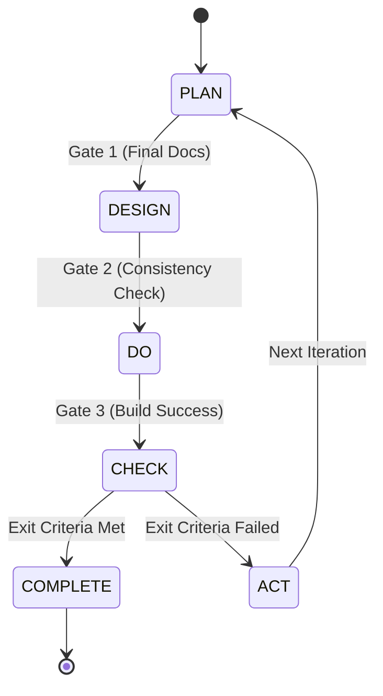

# u-Agent SSoT v2.0.0

> PDCA 사이클 기반의 SSoT(Single Source of Truth) 소프트웨어 개발 협업 자동화 AI 에이전트 생태계
> (Claude Code / Gemini CLI 전용 플러그인)

**문서가 프로세스를 강제하고, 에이전트가 이를 실행한다.**

---

## Overview

u-Agent SSoT는 6개 전문 에이전트가 PDCA(Plan-Design-Do-Check-Act) 사이클을 따라 소프트웨어 개발 전 과정을 자동화하는 시스템입니다. 모든 결정과 산출물은 `u-docs/` SSoT 문서 체계에 기록되며, 종료 조건(Exit Criteria)을 충족할 때까지 이터레이션을 반복합니다.

### 핵심 원칙

- **문서 중심 (SSoT)**: 모든 결정과 산출물은 `u-docs/` 내 지정된 SSoT 문서에만 기록
- **Phase Gate**: 각 단계 전환 시 Gate 조건(Final 상태, 모순 검수 등) 충족 필수
- **추적성 (Traceability)**: 요구사항(US/FR)부터 설계(API/ERD/Screen), 코드, 테스트까지 연쇄 추적
- **시나리오 기반 (User Scenario)**: 추상적 요구사항을 구체적 페르소나와 시나리오로 발전시켜 설계 유도
- **자동 반복 (PDCA Loop)**: CHECK 단계 실패 시 ACT를 거쳐 다음 Iteration으로 자동 전환
- **기술 스택 강제**: 10가지 핵심 기술 스택 규칙 위반 시 도구 실행 차단
- **다이어그램 필수**: 모든 SSoT 문서에 최소 1개 이상의 Mermaid 다이어그램 포함

---

## Quick Start

```bash
# 1. 새 프로젝트 초기화 (Turborepo + u-docs 구조)
/u-create-project my-app

# 2. PLAN Phase (로드맵 → User Scenario → SRS → IA → 인덱스)
/u-plan

# 3. DESIGN Phase (ERD → API Contract → 화면 설계 → 디자인시스템)
/u-design

# 4. DO Phase (Frontend + Backend 병렬 구현)
/u-dev

# 5. CHECK Phase (테스트 케이스 설계 → 실행 → 결함 분석)
/u-check

# 6. 종료 조건 충족까지 PDCA 자동 반복
/u-loop
```

---

## Command Workflows by Scenario

사용자 시나리오별 권장 명령어 흐름입니다.

### 🚀 시나리오 1: 신규 프로젝트 시작 (Zero to One)
새로운 아이디어를 실제 서비스로 구현할 때의 흐름입니다.
1. `/u-create-project <name>` : 프로젝트 구조 생성
2. `/u-us-add "핵심 아이디어"` : 구현하고자 하는 서비스의 핵심 목표 및 유저 스토리 등록
3. `/u-loop` : 요구사항 상세화(PLAN)부터 코드 구현, 테스트까지 자동 실행

### 🔍 시나리오 2: 기존 프로젝트 분석 및 SSoT 도입
이미 개발된 프로젝트에 u-Agent SSoT를 적용하고 싶을 때 사용합니다.
1. `/u-init` : 기존 코드를 분석하여 설계 문서(SSoT) 역공학 생성
2. `/u-status` : 생성된 문서 상태 확인 및 미비점 파악
3. `/u-loop` : 부족한 설계를 보완하고 다음 개발 사이클 진행

### ✨ 시나리오 3: 새로운 기능 추가 (Feature Addition)
기존 프로젝트에 새로운 기능을 추가하고 싶을 때의 흐름입니다.
1. `/u-us-add` : 유저 스토리(사용자 요구사항) 추가
2. `/u-fr-add` : 기능 요구사항(시스템 상세 명세) 추가
3. `/u-loop` : 추가된 요구사항에 맞춰 설계 변경 및 코드 구현 자동화

### 🐞 시나리오 4: 유지보수 및 버그 수정 (Maintenance)
발견된 결함을 수정하거나 품질을 개선할 때의 흐름입니다.
1. `/u-backlog-add` : 개선 항목이나 발견된 이슈 등록
2. `/u-loop-from design` : 설계 변경이 필요한 경우 DESIGN 단계부터 루프 실행
3. `/u-bug-report` : 테스트 중 발견된 결함에 대한 상세 분석 및 수정 가이드 생성

### 🛠️ 시나리오 5: 품질 검증 및 협업 (Quality & Collaboration)
배포 전 품질을 확인하고 팀원과 공유할 때 사용합니다.
1. `/u-validate` : 모든 SSoT 문서의 무결성과 추적성 검증
2. `/u-gap-detector` : 설계(SSoT)와 실제 구현 코드 간의 불일치 분석
3. `/u-build` : 최종 빌드 성공 여부 확인
4. `/u-git-pr` : 변경 사항을 그룹핑하여 커밋하고 GitHub PR 생성

---

## 6 Specialized Agents

| Agent | Role | Phase | 주요 담당 범위 |
|-------|------|-------|--------------|
| `u-ra` | Requirements Analyst | ALL | 로드맵, 인덱스, 백로그, 요약, 이터레이션 로그, 회고, SSoT 검증 |
| `u-sa` | Solution Architect | PLAN, DESIGN | SRS(요구사항 명세), ERD(데이터 모델), API Contract(OpenAPI) |
| `u-ux` | UX Designer | PLAN, DESIGN, DO | IA(메뉴구조), 화면 상세 설계, HTML 와이어프레임, 디자인시스템, UI 컴포넌트, 디자인 토큰 |
| `u-ux-ds` | Pencil Designer | DESIGN, DO | pencil.dev MCP 기반 시각적 디자인 (.pen 파일) 생성 및 업데이트 |
| `u-dv-fe` | Frontend Developer | DO | Next.js App Router + react-query 기반 프론트엔드 코드 구현 |
| `u-dv-be` | Backend Developer | DO | API Routes + Prisma/Drizzle ORM 기반 백엔드 로직 구현 |
| `u-qa` | QA Engineer | CHECK | 테스트 케이스 설계 및 실행, 결함 분석 리포트, 설계-구현 Gap 분석 |

---

## PDCA Workflow & Gates

### Workflow

```mermaid
stateDiagram-v2
    [*] --> PLAN
    PLAN --> DESIGN : Gate 1 (Final Docs)
    DESIGN --> DO : Gate 2 (Consistency Check)
    DO --> CHECK : Gate 3 (Build Success)
    CHECK --> COMPLETE : Exit Criteria Met
    CHECK --> ACT : Exit Criteria Failed
    ACT --> PLAN : Next Iteration
    COMPLETE --> [*]
```

### Phase Gates (전환 조건)

| Transition | 조건 (Gate Criteria) | 검수자 |
|------------|---------------------|-------|
| PLAN → DESIGN | Roadmap + SRS + IA 상태가 'Final'이며 모든 FR/SC 매핑 완료 | `u-ra` |
| DESIGN → DO | ERD + API + Screen 상태가 'Final'이며 에이전트 간 모순 검수 통과 | `u-ra` |
| DO → CHECK | 모든 코드 구현 완료 및 `bun run build` 성공 | 시스템 |
| CHECK → COMPLETE | Critical/Major 결함 0건 + 모든 FR 구현 완료 + 백로그 0건 | `u-qa` |
| CHECK → ACT | 위 조건 미충족 시 자동으로 ACT 단계로 진입 | 시스템 |

---

## SSoT Document Structure

`u-docs/` 폴더 내의 문서는 **Shared(공유)**와 **App-Specific(앱 전용)**으로 구분됩니다.

### Shared Documents (공유 영역)
- `u-docs/shared/01-plan/`: 1_Roadmap_PM, 1_Index_PM
- `u-docs/shared/02-design/`: 2_ERD_SA, 2_DesignSystem_UX
- `u-docs/shared/03-dev/`: 3_UIComponents_UX, 3_DesignToken_UX
- `u-docs/shared/05-act/`: 5_IterationLog_RA, 5_Retrospective_PM

### App-Specific Documents (앱 개별 영역)
- `u-docs/{app}/01-plan/`: 1_SRS_RA, 1_IA_RA
- `u-docs/{app}/02-design/`: 2_API_SA, 2_Screen_UX
- `u-docs/{app}/03-dev/`: 3_Code_DV, 3_Screen_UX (Dev ver.)
- `u-docs/{app}/04-check/`: 4_Case_QA, 4_Report_QA

### Root Documents (관리 영역)
- `u-docs/backlog.md`: 전체 미해결 항목 및 개선 요구사항 관리
- `u-docs/summary.md`: 프로젝트 개요 및 현재 진행 상태 요약

---

## Tech Stack Rules (TS-01 ~ TS-10)

코드 생성 시 아래 10가지 규칙이 엄격히 강제됩니다. 위반 시 실행이 차단될 수 있습니다.

1. **Clean Architecture**: 명확한 관심사 분리(Domain, Infrastructure, Data 등) 폴더 구조
2. **React Query**: 데이터 페칭은 반드시 `react-query` 사용 (Usecase 패턴 금지)
3. **Plain CSS**: CSS-in-JS(Styled-components 등) 대신 `.css` 파일 직접 사용
4. **Next.js App Router**: Pages Router 사용 금지
5. **No Header Plugin**: `eslint-plugin-header` 등 자동 헤더 삽입 플러그인 금지
6. **Turborepo**: 반드시 Monorepo 구조로 프로젝트 관리
7. **Functional Components**: Class 컴포넌트 사용 금지
8. **Storybook**: 모든 UI 컴포넌트는 Storybook 문서화 필수
9. **Design Tokens**: 색상, 폰트 등은 하드코딩 대신 디자인 토큰 기반 스타일링
10. **Bun PM**: 패키지 매니저는 반드시 `bun` 사용 (`npm`/`yarn`/`pnpm` 금지)

---

## Slash Commands (상세 가이드)

모든 커맨드는 슬래시(`/`)로 시작하며, 각 단계별 자동화 및 문서 관리를 담당합니다.

### 1. Lifecycle & Auto-Loop (라이프사이클 및 자동화)
프로젝트의 전체 개발 주기를 관리하고 반복 실행을 제어합니다.

| Command | Syntax | Description | Prerequisites |
|---------|--------|-------------|---------------|
| `/u-create-project` | `/u-create-project <name>` | 새 프로젝트 생성 및 u-docs 구조 초기화 | 없음 |
| `/u-init` | `/u-init [path]` | 기존 프로젝트 분석 및 SSoT 역공학 생성 | 프로젝트 파일 존재 |
| `/u-plan` | `/u-plan [app]` | PLAN 단계 실행 (Roadmap, SRS, IA 생성) | u-docs 존재 |
| `/u-design` | `/u-design [app]` | DESIGN 단계 실행 (ERD, API, Screen 설계) | PLAN Gate 통과 |
| `/u-dev` | `/u-dev [app]` | DO 단계 실행 (FE/BE 병렬 구현) | DESIGN Gate 통과 |
| `/u-check` | `/u-check [app]` | CHECK 단계 실행 (테스트 및 결함 분석) | DO Gate 통과 |
| `/u-act` | `/u-act` | ACT 단계 실행 (백로그 정리, 회고) | CHECK 완료 |
| `/u-loop` | `/u-loop` | 종료 조건 충족까지 PDCA 전체 자동 반복 | 프로젝트 초기화 완료 |
| `/u-loop-from` | `/u-loop-from <phase>` | 특정 단계(plan/design 등)부터 루프 시작 | 선행 문서 Final 상태 |
| `/u-stop` / `/u-resume` | - | 실행 중인 루프 중단 또는 재개 | 루프 실행/중단 중 |

### 2. Document & Requirements Management (문서 및 요구사항 관리)
SSoT 문서의 무결성을 유지하고 요구사항을 추가/관리합니다.

| Command | Syntax | Description | Output |
|---------|--------|-------------|--------|
| `/u-status` | `/u-status` | 현재 Iteration/Phase 진행률 및 상태 보고 | 상태 요약 배너 |
| `/u-docs` | `/u-docs` | 전체 SSoT 문서 목록 및 상태 조회 | 문서 현황 테이블 |
| `/u-validate` | `/u-validate` | SSoT 문서 무결성 및 추적성 검증 | 검증 결과 보고서 |
| `/u-us-add` | `/u-us-add [desc]` | 새로운 유저 스토리 추가 | `1_Roadmap_PM.md` |
| `/u-fr-add` | `/u-fr-add [app] [desc]` | 새로운 기능 요구사항(FR) 추가 | `1_SRS_RA.md` |
| `/u-backlog-add` | `/u-backlog-add [desc]` | 새로운 백로그(버그/개선) 항목 추가 | `backlog.md` |
| `/u-gap-detector` | `/u-gap-detector` | 설계 문서와 실제 구현 코드 간 일치도 분석 | Match Rate 보고서 |
| `/u-summary` | `/u-summary` | 프로젝트 개요 및 현재 상태 요약 생성 | `u-docs/summary.md` |

### 3. Individual Agent Call (에이전트 개별 호출)
특정 영역의 설계나 구현을 부분적으로 수행할 때 사용합니다.

- **Design**: `/u-srs [app]` (요구사항 명세), `/u-erd` (데이터 모델), `/u-api [app]` (API 설계), `/u-screen [app]` (화면 설계), `/u-wireframe [app]` (HTML 와이어프레임)
- **Visual Design**: `/u-ux-design` (Pencil.dev 기반 시각 디자인 생성 및 업데이트)
- **Implementation**: `/u-fe [app]` (프론트엔드), `/u-be [app]` (백엔드), `/u-storybook` (Storybook 생성)
- **Quality**: `/u-test [app]` (테스트 케이스), `/u-bug-report [app]` (결함 분석)

### 4. Utility (유틸리티)
- `/u-build`: 프로젝트 빌드 실행 (`bun run build`) 및 결과 확인
- `/u-git-pr`: 변경된 파일을 feature 단위로 그룹핑하여 커밋 및 GitHub PR 생성
- `/u-history`: 전체 Iteration 수행 이력 조회
- `/u-archive`: 현재 Iteration 문서를 `iterations/` 폴더로 아카이브
- `/u-help`: 모든 커맨드 상세 설명 및 사용법 표시

---

## Mermaid Diagram Requirements

모든 문서는 정보의 가시성을 위해 아래와 같은 다이어그램을 포함해야 합니다.

| Diagram Type | 주요 용도 |
|-------------|----------|
| `flowchart` | IA 메뉴 트리 구조, 로직 흐름, 문서 의존성, 마일스톤 |
| `journey` | User Scenario 사용자 경험 흐름 |
| `mindmap` | 일반 계층 구조 시각화 (IA 메뉴 트리에는 사용하지 않음) |
| `erDiagram` | DB 엔티티 관계 (ERD) |
| `sequenceDiagram` | API 호출 흐름 및 테스트 시나리오 |
| `stateDiagram-v2` | 상태 전이 (결함 상태, 문서 상태 등) |
| `xychart-beta` | 이터레이션별 진척도 및 품질 추이 |

---

## License

Private - Internal use only.
