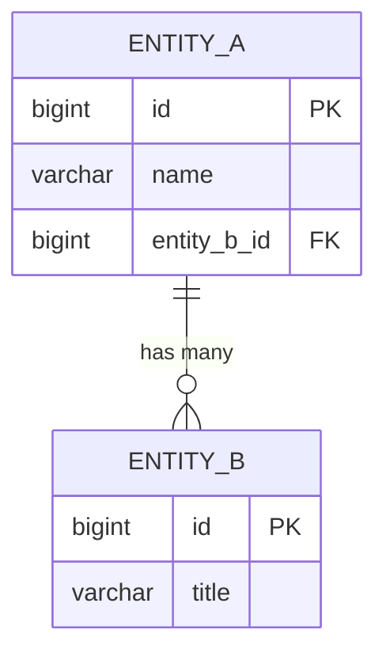

# Entity-Relationship Diagram (ERD)

> JSON companion: `erd.json`
> ID Rule: ENT-010, ENT-020, ... (entities), REL-010, REL-020, ... (relationships)
> Mermaid constraint: PK, FK, UK 중 하나만 사용 (결합 표기 금지)

## 1. Entity List

### ENT-010: {{entityName}}

| Column | Type | PK | FK | Nullable | Default | Description |
|--------|------|----|----|----------|---------|-------------|
| {{name}} | {{type}} | {{pk}} | {{fk}} | {{nullable}} | {{default}} | {{description}} |

## 2. Relationships

| ID | From Entity | To Entity | Type | FK Column | Description |
|----|-------------|-----------|------|-----------|-------------|
| REL-010 | {{from}} | {{to}} | 1:N / N:M / 1:1 | {{fkColumn}} | {{description}} |

## 3. ERD Diagram

## 4. Common Table References

| Table | Referenced By | Context |
|-------|---------------|---------|
| {{name}} | {{referencedBy}} | {{context}} |
