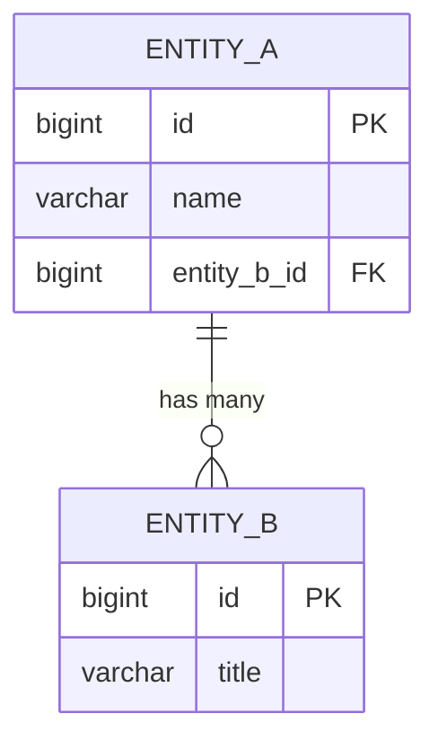

# Entity-Relationship Diagram (ERD)

> JSON companion: `erd.json`
> ID Rule: ENT-010, ENT-020, ... (entities), REL-010, REL-020, ... (relationships)
> Mermaid constraint: PK, FK, UK 중 하나만 사용 (결합 표기 금지)

## 1. Entity List

### ENT-010: {{entityName}}

| Column | Type | PK | FK | Nullable | Default | Description |
|--------|------|----|----|----------|---------|-------------|
| {{name}} | {{type}} | {{pk}} | {{fk}} | {{nullable}} | {{default}} | {{description}} |

## 2. Relationships

| ID | From Entity | To Entity | Type | FK Column | Description |
|----|-------------|-----------|------|-----------|-------------|
| REL-010 | {{from}} | {{to}} | 1:N / N:M / 1:1 | {{fkColumn}} | {{description}} |

## 3. Relationship Descriptions

### REL-010: {{from}} → {{to}}

- **관계 유형:** {{type}} (1:1 / 1:N / N:M)
- **FK Column:** `{{fkColumn}}` on {{childEntity}}
- **비즈니스 의미:** {{businessDescription}} (예: "하나의 주문(Order)은 여러 개의 주문항목(OrderItem)을 가진다")
- **참조 무결성:** ON DELETE {{CASCADE/SET NULL/RESTRICT}} · ON UPDATE {{CASCADE/RESTRICT}}
- **필수 여부:** {{mandatory/optional}} (FK nullable 여부에 따름)

## 4. ERD Diagram

## 5. Sample Data

> 각 엔티티별 3~5건의 현실적 샘플 데이터를 제시한다. FK 값은 실제 참조 엔티티의 샘플 PK와 일치해야 한다.

### ENT-010: {{entityName}}

| id | {{col1}} | {{col2}} | ... | createdAt | updatedAt |
|----|----------|----------|-----|-----------|-----------|
| 1 | {{val}} | {{val}} | ... | 2026-01-15 09:00:00 | 2026-01-15 09:00:00 |
| 2 | {{val}} | {{val}} | ... | 2026-01-16 10:30:00 | 2026-01-16 10:30:00 |
| 3 | {{val}} | {{val}} | ... | 2026-01-17 14:00:00 | 2026-01-17 14:00:00 |

### Sample Data Relationships

> 샘플 데이터 간의 관계를 자연어와 표로 설명한다.

#### REL-010: {{from}} → {{to}}

- **연결 예시:** {{from}} #1("{{sampleName}}") → {{to}} #1, #2 ("{{sampleNames}}")
- **비즈니스 시나리오:** {{scenarioDescription}}

| {{from}}.id | {{from}} 대표값 | {{to}}.id | {{to}} 대표값 | FK Column |
|-------------|----------------|-----------|--------------|-----------|
| 1 | {{val}} | 1 | {{val}} | {{fkColumn}} |
| 1 | {{val}} | 2 | {{val}} | {{fkColumn}} |

## 6. Common Table References

| Table | Referenced By | Context |
|-------|---------------|---------|
| {{name}} | {{referencedBy}} | {{context}} |
