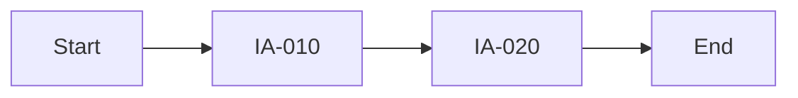

# Information Architecture (IA)

> JSON companion: `ia.json`
> ID Rule: 10-increment (IA-010, IA-020, ...)

## 1. Site Map

```mermaid
graph TD
    ROOT[{{appName}}]
    ROOT --> S010[IA-010: {{section}}]
    S010 --> S020[IA-020: {{page}}]
```

## 2. Page Inventory

| ID | Page Name | Path | Parent | Description | Related FR |
|----|-----------|------|--------|-------------|-----------|
| IA-010 | {{pageName}} | {{path}} | — | {{description}} | FR-010 |

## 3. Navigation Structure

| Level | Label | Target | Auth Required |
|-------|-------|--------|--------------|
| GNB | {{label}} | IA-010 | Yes/No |

## 4. User Flows

### Flow: {{flowName}}


