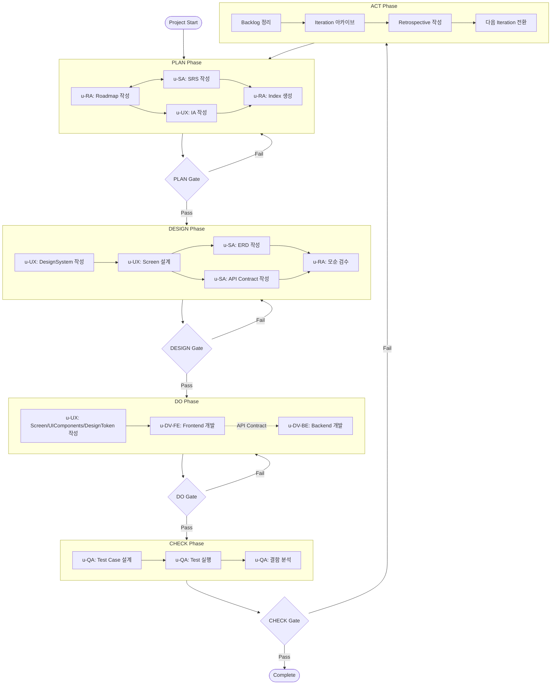
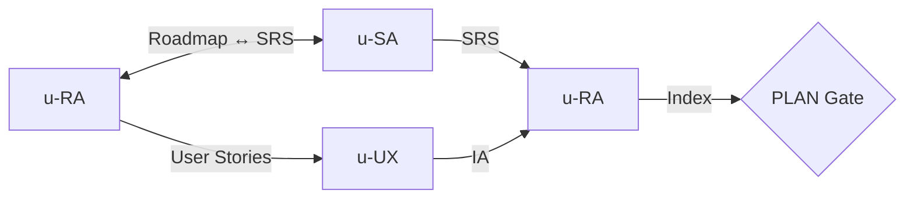
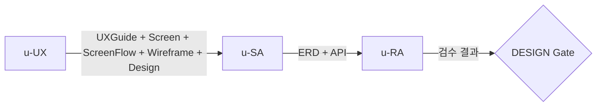
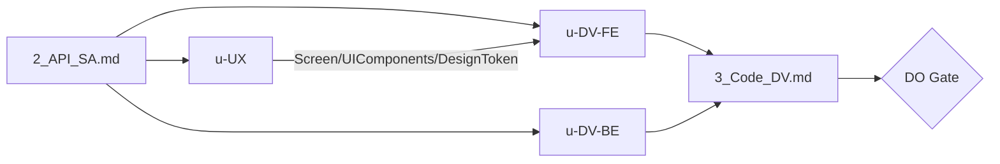
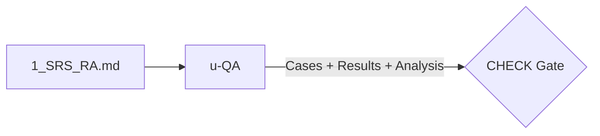
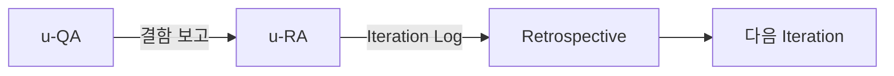

# PDCA Workflow

> u-maker의 PDCA(Plan-Design-Do-Check-Act) 5-Phase 워크플로우를 정의한다.
> 모든 에이전트는 이 워크플로우를 기반으로 협업한다.

---

## 1. Main Workflow



---

## 2. Phase Details

### 2.1 PLAN Phase

**목적**: 프로젝트 범위와 요구사항을 정의한다.

| Step | Agent | Output | Description |
|------|-------|--------|-------------|
| 1 | u-RA or u-SA | `shared/1_Roadmap_PM.md` or `{app}/1_SRS_RA.md` | US-First: Roadmap 먼저, FR-First: SRS 먼저 |
| 2 | u-SA or u-RA | `{app}/1_SRS_RA.md` or `shared/1_Roadmap_PM.md` | 나머지 문서 작성 |
| 2.5 | u-RA + u-SA | Cross-mapping 갱신 | TBD 매핑을 실제 ID로 갱신 |
| 3 | u-UX | `{app}/1_IA_RA.md` | 정보 구조도 + Menu Tree (MN-{DOMAIN}-{NNNN}) |
| 4 | u-RA | `shared/1_Index_PM.md` | 문서 인덱스 생성, 상태 추적 시작 |



> **Backlog Trigger**: TBD 매핑 잔존 또는 NFR 누락 발견 시 u-agent-ra가 BL 생성 (Origin: PLAN). Phase를 블로킹하지 않음.

### 2.2 DESIGN Phase

**목적**: UX 가이드, 화면 설계, 흐름도, 와이어프레임, 화면 디자인과 데이터/API 구조를 확정한다.

| Step | Agent | Output | Description |
|------|-------|--------|-------------|
| 1 | u-UX | `shared/2_UXGuide_UX.md` | UX 표준가이드 + 디자인 시스템 (컬러, 타이포, 스페이싱, 컴포넌트) |
| 2 | u-UX | `{app}/2_Screen_UX.md` | 화면 상세 설계 (UI 컴포넌트, 상태 전이) |
| 3 | u-UX | `{app}/2_ScreenFlow_UX.md` | 화면 간의 흐름도 (네비게이션 플로우, 딥링크) |
| 4 | u-UX | `{app}/2_Screen_Wireframes/` | 와이어프레임 HTML |
| 5 | u-UX | `.pen` 파일 | 화면 디자인 (pencil.dev MCP) |
| 6 | u-SA | `shared/2_ERD_SA.md` | Entity Relationship Diagram |
| 7 | u-SA | `{app}/2_API_SA.md` | API Contract (OpenAPI 3.0) |
| 8 | u-RA | 검수 결과 | 문서 간 모순 검수, 추적성 검증 |



> **Backlog Trigger**: 모순 검수에서 불일치 발견 시 u-agent-ra가 BL 생성 (Origin: DESIGN). Phase를 블로킹하지 않음.

### 2.3 DO Phase

**목적**: Contract 기반으로 Frontend/Backend를 병렬 개발한다.

| Step | Agent | Output | Description |
|------|-------|--------|-------------|
| 1 | u-UX | `{app}/3_Screen_UX.md`, `shared/3_UIComponents_UX.md`, `shared/3_DesignToken_UX.md` | 화면 구현 명세, UI 컴포넌트 명세, 디자인 토큰 |
| 2 | u-DV-FE | Frontend Code | Next.js + react-query + Storybook |
| 3 | u-DV-BE | Backend Code | API Routes + Prisma/Drizzle |
| 4 | Both | `{app}/3_Code_DV.md` | 구현 기록, 파일 매핑 |



> **Backlog Trigger**: 빌드 실패 또는 Gap Rate < 90% 시 u-agent-ra가 BL 생성 (Origin: DEV). Phase를 블로킹하지 않음.

### 2.4 CHECK Phase

**목적**: 테스트를 수행하고 결함을 분석한다.

| Step | Agent | Output | Description |
|------|-------|--------|-------------|
| 1 | u-QA | `{app}/4_Case_QA.md` | 테스트 케이스 설계 |
| 2 | u-QA | `{app}/4_Report_QA.md` | 테스트 실행 및 결과 기록 |
| 3 | u-QA | Defect Analysis | 결함 분류 (Critical/Major/Minor/Trivial), 리포트, 수정 요청. DEF→BL 변환은 ACT Phase에서 u-RA가 수행 |



> **Note**: CHECK Phase에서 생성된 DEF(결함)는 ACT Phase에서 u-RA가 BL(백로그 항목)로 변환한다.

### 2.5 ACT Phase

**목적**: 실패 항목을 정리하고 다음 Iteration을 준비한다.

| Step | Agent | Output | Description |
|------|-------|--------|-------------|
| 1 | u-RA | `shared/5_IterationLog_RA.md` | DEF→BL 변환 + PLAN/DESIGN/DEV 기원 항목 확인 + 미해결 항목 정리 |
| 2 | u-RA | `iterations/iter-N/` | 현재 Iteration 문서 아카이브 |
| 3 | u-RA | `shared/5_IterationLog_RA.md` | Iteration 이력 기록 |
| 4 | Team | `shared/5_Retrospective_PM.md` | 회고 (Good / Improve / Actions) |



---

## 3. Phase Transition Gate Conditions

| Transition | Gate Conditions | Validator |
|-----------|----------------|-----------|
| PLAN → DESIGN | `shared/1_Roadmap_PM.md` = Final + 모든 앱의 `1_SRS_RA.md`, `1_IA_RA.md` = Final | u-RA |
| DESIGN → DO | `shared/2_ERD_SA.md`, `shared/2_UXGuide_UX.md` = Final + 모든 앱의 `2_API_SA.md`, `2_Screen_UX.md`, `2_ScreenFlow_UX.md` = Final + u-RA 검수 통과 | u-RA |
| DO → CHECK | 코드 구현 완료 + `bun run build` 성공 | u-RA |
| CHECK → Complete | Critical/Major 결함 0건 + 백로그 활성 항목 0건 (Done/Cancelled/Deferred 외) + 모든 앱의 전체 FR 구현 완료 | u-RA + scripts |
| CHECK → ACT | 위 CHECK → Complete 조건 미충족 시 자동 전환 | Orchestrator |
| ACT → PLAN (Iter N+1) | `shared/5_IterationLog_RA.md` 정리 완료 + `shared/5_Retrospective_PM.md` 작성 + 아카이브 완료 | u-RA |

> **Note**: shared 문서는 1회 검증. perApp 문서는 모든 앱이 Final이어야 Gate 통과.

<details><summary>JSON Format (Gate Conditions)</summary>

```json
{
  "gateConditions": [
    {
      "transition": "PLAN→DESIGN",
      "shared": [
        { "document": "1_Roadmap_PM.md", "status": "Final" }
      ],
      "perApp": [
        { "document": "1_SRS_RA.md", "status": "Final" },
        { "document": "1_IA_RA.md", "status": "Final" }
      ],
      "rule": "shared 1회 검증 + 모든 앱 perApp Final",
      "validator": "u-RA"
    },
    {
      "transition": "DESIGN→DO",
      "shared": [
        { "document": "2_ERD_SA.md", "status": "Final" },
        { "document": "2_UXGuide_UX.md", "status": "Final" }
      ],
      "perApp": [
        { "document": "2_API_SA.md", "status": "Final" },
        { "document": "2_Screen_UX.md", "status": "Final" },
        { "document": "2_ScreenFlow_UX.md", "status": "Final" }
      ],
      "additionalCheck": "u-RA 검수 통과",
      "rule": "shared 1회 검증 + 모든 앱 perApp Final",
      "validator": "u-RA"
    },
    {
      "transition": "DO→CHECK",
      "conditions": [
        { "check": "코드 구현 완료" },
        { "check": "bun run build 성공" }
      ],
      "validator": "u-RA"
    },
    {
      "transition": "CHECK→Complete",
      "conditions": [
        { "check": "Critical/Major 결함 0건" },
        { "check": "백로그 활성 항목 0건" },
        { "check": "전체 FR 구현 완료" }
      ],
      "validator": "u-RA + scripts"
    },
    {
      "transition": "ACT→PLAN(N+1)",
      "conditions": [
        { "check": "5_IterationLog_RA.md 정리 완료" },
        { "check": "5_Retrospective_PM.md 작성" },
        { "check": "아카이브 완료" }
      ],
      "validator": "u-RA"
    }
  ]
}
```

</details>

---

## 4. Iteration Rules

1. **자동 반복**: CHECK Gate 실패 시 자동으로 ACT Phase 진입, ACT 완료 후 다음 Iteration의 PLAN으로 전환
2. **증분 작업**: Iteration 2+ 에서는 `5_IterationLog_RA.md`의 Open 항목만 대상으로 변경분만 갱신
3. **최대 반복**: 기본 10회 제한 (설정 변경 가능)
4. **중단/재개**: `/u-skill-stop`으로 루프 중단, `/u-skill-resume`으로 재개 가능
5. **Final 유지**: 기존 Final 문서는 유지하되, 해당 항목만 PATCH 업데이트
6. **아카이브**: 매 Iteration 완료 시 `.u-maker/docs/iterations/iter-N/`에 문서 스냅샷 보관

---

## 5. Exit Criteria

PDCA 사이클 종료를 위해 다음 4가지 조건을 **모두** 충족해야 한다:

```
EXIT =
  (backlog.filter(status not in ['Done', 'Cancelled', 'Deferred']).length === 0) AND
  (defects.filter(severity in ['Critical', 'Major']).length === 0) AND
  (srs.features.every(fr => fr.implemented === true)) AND
  (buildResult === 'SUCCESS')
```

| # | Condition | Check Method |
|---|-----------|-------------|
| 1 | 백로그 활성 항목 없음 (Done/Cancelled/Deferred 외 0건) | `5_IterationLog_RA.md` 파싱 |
| 2 | Critical/Major 결함 0건 | `4_Report_QA.md` 파싱 |
| 3 | SRS의 모든 FT 구현 완료 | `1_SRS_RA.md` 구현 상태 확인 |
| 4 | 빌드 성공 | `bun run build` 실행 결과 |

<details><summary>JSON Format (Exit Criteria)</summary>

```json
{
  "exitCriteria": {
    "conditions": [
      { "id": 1, "name": "backlogNoActive", "check": "5_IterationLog_RA.md", "rule": "status not in ['Done','Cancelled','Deferred'] === 0" },
      { "id": 2, "name": "noCriticalMajor", "check": "4_Report_QA.md", "rule": "Critical + Major === 0" },
      { "id": 3, "name": "allFtImplemented", "check": "1_SRS_RA.md", "rule": "모든 FT implemented === true" },
      { "id": 4, "name": "buildSuccess", "check": "bun run build", "rule": "returncode === 0" }
    ],
    "passCondition": "all",
    "onFail": "ACT Phase 진입"
  }
}
```

</details>
