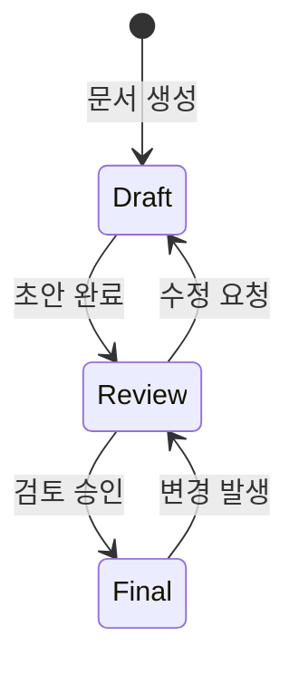
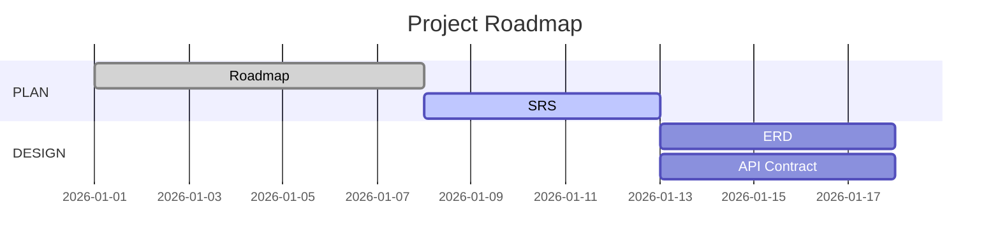
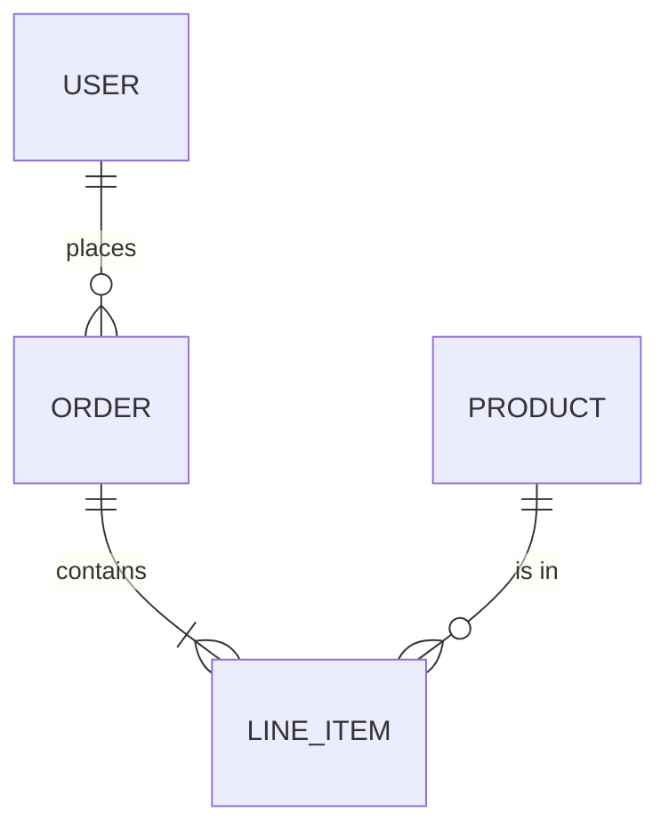
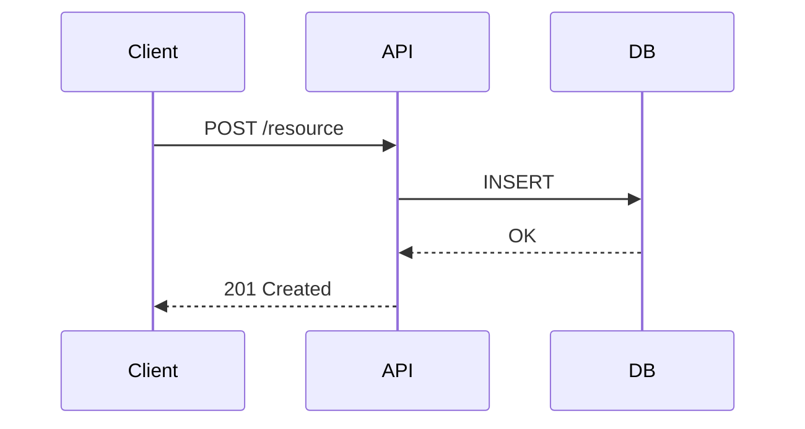
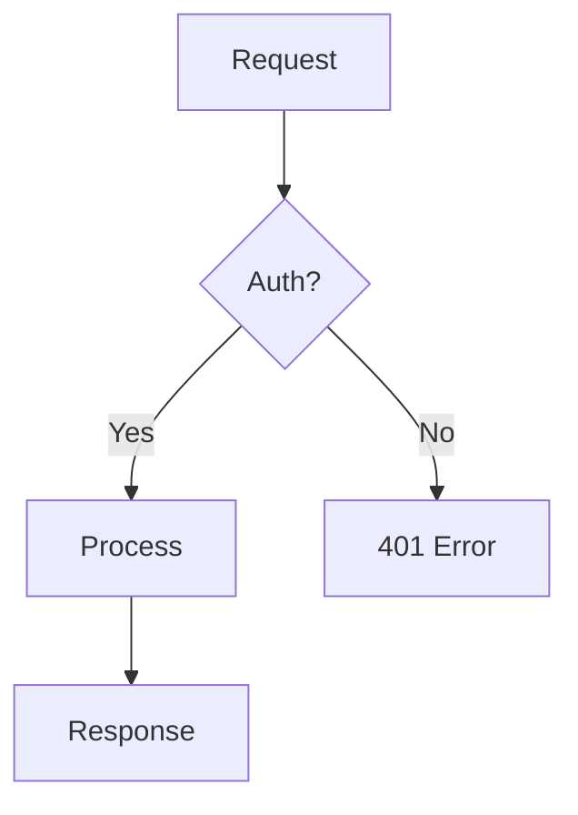
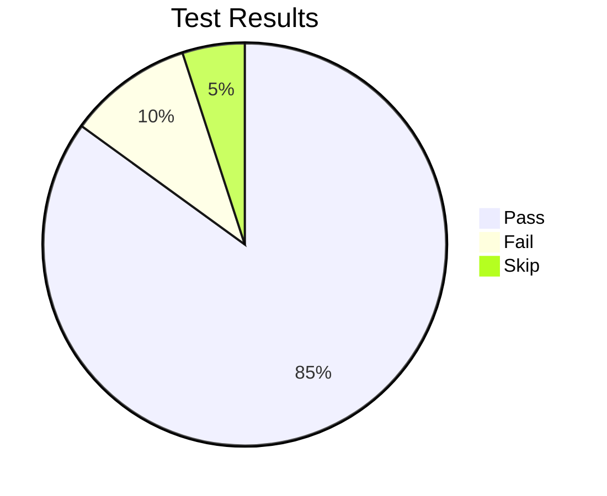
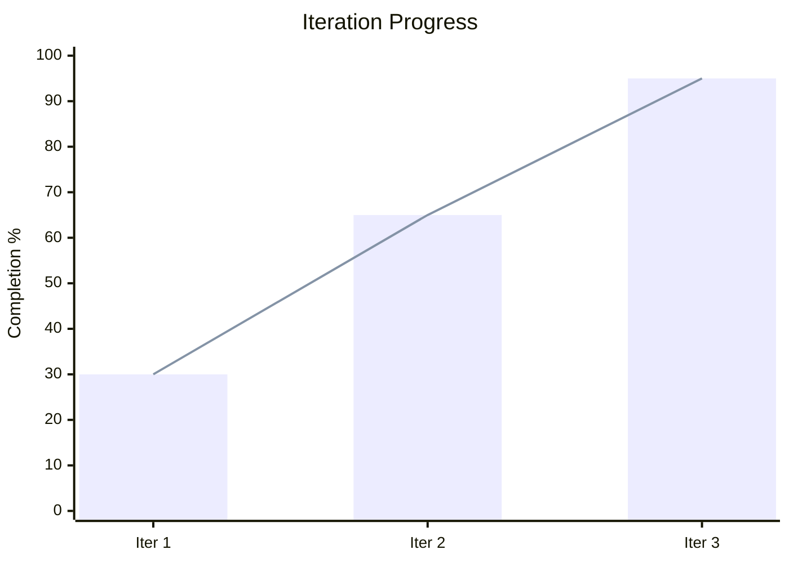

# SSoT Document Standard

> u-maker 플러그인의 모든 SSoT 문서가 준수해야 하는 표준 양식을 정의한다.

---

## 1. Common Header Template

모든 SSoT 문서는 다음 YAML frontmatter 헤더를 포함해야 한다:

```yaml
---
document: "{DOC_ID}"           # 예: 1_Roadmap_PM, 2_ERD_SA
title: "{문서 제목}"
owner: "{담당 에이전트}"        # 예: u-PM, u-RA, u-SA, u-UX
status: "Draft"                # Draft | Review | Final
version: "v0.1.0"             # vMAJOR.MINOR.PATCH
last_updated: "YYYY-MM-DD"
related_docs:
  - "{관련 문서 경로}"          # 예: .u-maker/docs/01-plan/1_SRS_RA.md
external_links:
  - "{외부 참조 URL}"          # 선택사항
---
```

### Header Fields

| Field | Required | Description |
|-------|----------|-------------|
| `document` | Yes | 문서 고유 ID (파일명 기반) |
| `title` | Yes | 문서 제목 (한글) |
| `owner` | Yes | 담당 에이전트 ID |
| `status` | Yes | 문서 상태: `Draft` / `Review` / `Final` |
| `version` | Yes | Semantic versioning: `vMAJOR.MINOR.PATCH` |
| `last_updated` | Yes | 최종 수정일 (`YYYY-MM-DD`) |
| `related_docs` | Yes | 관련 SSoT 문서 상대 경로 목록 |
| `external_links` | No | 외부 참조 링크 (선택) |

### Status Lifecycle



- **Draft**: 작성 중 (에이전트가 생성/수정 중)
- **Review**: 검토 대기 (u-RA 또는 관련 에이전트 검토)
- **Final**: 확정 (Phase 전환 Gate 통과 가능)

---

## 2. Version Rules

Semantic Versioning (`vMAJOR.MINOR.PATCH`)을 따른다:

| Change Type | Version Bump | Example | Description |
|-------------|-------------|---------|-------------|
| 구조 변경 | **MAJOR** | v1.0.0 → v2.0.0 | 섹션 추가/삭제, 문서 구조 재편 |
| 내용 추가/수정 | **MINOR** | v1.0.0 → v1.1.0 | FR 추가, 다이어그램 갱신, 상세 내용 보강 |
| 오타/포맷 수정 | **PATCH** | v1.1.0 → v1.1.1 | 오탈자 수정, 포맷팅 변경, 링크 수정 |

### Version Rules

1. 최초 생성 시 `v0.1.0`으로 시작한다
2. `Draft` → `Review` 전환 시 최소 MINOR bump 필요
3. `Review` → `Final` 전환 시 추가 bump 없이 상태만 변경
4. `Final` 상태 문서 수정 시 반드시 `Review`로 되돌리고 version bump
5. Iteration 2+ 진입 시 변경되는 문서만 MINOR 이상 bump

---

## 3. Phase-Specific Required Sections

### 3.1 PLAN Phase Documents

> 대상: `1_Roadmap_PM.md` (common), `1_SRS_RA.md` (per-app), `1_IA_RA.md` (per-app), `1_Index_PM.md` (common), `1_Common_RA.md` (common)

| Required Section | Description |
|-----------------|-------------|
| Background | 프로젝트 배경 및 목적 |
| Scope | 범위 정의 (In-Scope / Out-of-Scope) |
| Functional Requirements | 기능 요구사항 목록 (SRS Section 2, US Mapping 포함) |
| Non-Functional Requirements | 비기능 요구사항 목록 (SRS Section 3, 성능/보안/신뢰성 등) |
| Users | 사용자 역할 목록 (SRS Section 4, USR 정의) |
| User Stories | 사용자 스토리 목록 (SRS Section 5, FR/FT 매핑 포함) |
| Features | 기능 구현 단위 목록 (SRS Section 6, US Mapping 포함) |
| Menu Tree | IA 문서에 필수: Domain Registry, Menu Tree Table (MN-{DOMAIN}-{NNNN} 형식) |
| Gantt Chart | Mermaid `gantt` 다이어그램 (마일스톤, 일정) |



### 3.2 DESIGN Phase Documents

> 대상: `2_UXGuide_UX.md`, `2_Screen_UX.md`, `2_ERD_SA.md`, `2_API_SA.md`, `2_RTM_RA.md`

| Required Section | Description |
|-----------------|-------------|
| Design System | 디자인 시스템 정의 (컬러 팔레트, 타이포그래피, 스페이싱, 컴포넌트 규칙) |
| Screen Definition | 화면 목록 및 상세 설계 (화면ID, 화면명, 주요 컴포넌트) |
| Data Specification | 데이터 구조 정의 (Entity, Attribute, Type) |
| Requirements Traceability Matrix | `FR+NFR→US→FT→IA/Screen/API/ERD/QA` 매핑 테이블 |
| State Changes | 상태 전이 다이어그램 (`stateDiagram-v2`) |
| Exception Handling | 예외 케이스 정의 테이블 |
| ER Diagram | Mermaid `erDiagram` (Entity 관계도) |
| Sequence Diagram | Mermaid `sequenceDiagram` (인터랙션 흐름) |





### 3.3 DEV (DO) Phase Documents

> 대상: `3_Screen_UX.md`, `3_UIComponents_UX.md`, `3_DesignToken_UX.md`, `3_Code_DV.md`

| Required Section | Description |
|-----------------|-------------|
| Screen Implementation | 화면 구현 명세 (레이아웃, 인터랙션, 반응형 규칙) |
| UI Components | UI 컴포넌트 명세 (Props, 상태, 변형) |
| Design Tokens | 디자인 토큰 정의 (색상, 간격, 폰트 변수) |
| Build Configuration | 빌드 설정 (Turborepo, bun, Next.js) |
| Deploy Log | 배포/빌드 로그 기록 |
| API Specification | 구현된 API 엔드포인트 목록 |
| Flowchart | Mermaid `flowchart` (주요 로직 흐름) |



### 3.4 CHECK Phase Documents

> 대상: `4_Case_QA.md`, `4_Report_QA.md`

| Required Section | Description |
|-----------------|-------------|
| Test Conditions | 테스트 전제 조건 목록 |
| Test Steps | 테스트 절차 (Step-by-Step) |
| Actual vs Expected | 실제 결과 vs 기대 결과 비교 테이블 |
| Evidence | 테스트 증빙 (스크린샷, 로그 경로) |
| Pie Chart | Mermaid `pie` (테스트 커버리지, Pass/Fail 비율) |



### 3.5 ACT Phase Documents

> 대상: `5_IterationLog_RA.md`, `5_Retrospective_PM.md`, `5_DailyReport_PM_yyyymmddhhmm.md`

| Required Section | Description |
|-----------------|-------------|
| Iteration History | Iteration별 변경 이력 (날짜, Phase, 변경 내용) |
| Retrospective | 회고 (Good / Improve / Actions) |
| Daily Report | 일일 진행/이슈/다음 액션 보고 (파일명 타임스탬프 포함) |
| XY Chart | Mermaid `xychart-beta` (Iteration별 진행률 추이) |



---

## 4. Document File Naming Convention

| Phase | Prefix | Example |
|-------|--------|---------|
| PLAN | `1_` | `1_Roadmap_PM.md`, `1_SRS_RA.md`, `1_IA_RA.md`, `1_Index_PM.md`, `1_Common_RA.md` |
| DESIGN | `2_` | `2_UXGuide_UX.md`, `2_ERD_SA.md`, `2_RTM_RA.md`, `2_API_SA.md`, `2_Screen_UX.md`, `2_ScreenFlow_UX.md` |
| DEV | `3_` | `3_Screen_UX.md`, `3_UIComponents_UX.md`, `3_DesignToken_UX.md`, `3_Code_DV.md` |
| CHECK | `4_` | `4_Case_QA.md`, `4_Report_QA.md` |
| ACT | `5_` | `5_IterationLog_RA.md`, `5_Retrospective_PM.md`, `5_DailyReport_PM_yyyymmddhhmm.md` |
| ALL (root) | — | `_links.json` (.u-maker/docs/ 루트, 문서 간 매핑) |

---

## 5. Document Storage Path

모든 SSoT 문서는 프로젝트 루트의 `.u-maker/docs/` 하위에 저장된다. common 문서와 per-app 문서가 분리된다:

```
.u-maker/docs/
├── common/                         # Project-level common docs
│   ├── 01-plan/
│   │   ├── 1_Roadmap_PM.md
│   │   ├── 1_Index_PM.md
│   │   └── 1_Common_RA.md
│   ├── 02-design/
│   │   ├── 2_ERD_SA.md
│   │   ├── 2_RTM_RA.md
│   │   └── 2_UXGuide_UX.md
│   ├── 03-dev/
│   │   ├── 3_UIComponents_UX.md
│   │   └── 3_DesignToken_UX.md
│   └── 05-act/
│       ├── 5_IterationLog_RA.md
│       ├── 5_Retrospective_PM.md
│       └── 5_DailyReport_PM_yyyymmddhhmm.md
├── _links.json                     # u-agent-ra 소유 (문서 간 매핑 단일 진실 공급원)
├── {app}/                          # Per-app docs (e.g., web/, admin/)
│   ├── 01-plan/
│   │   ├── 1_SRS_RA.md
│   │   └── 1_IA_RA.md
│   ├── 02-design/
│   │   ├── 2_API_SA.md
│   │   ├── 2_Screen_UX.md
│   │   └── 2_ScreenFlow_UX.md
│   ├── 03-dev/
│   │   ├── 3_Code_DV.md
│   │   └── 3_Screen_UX.md
│   └── 04-check/
│       ├── 4_Case_QA.md
│       └── 4_Report_QA.md
├── assets/
│   └── (다이어그램, 스크린샷)
└── iterations/
    └── iter-N/
        └── (Iteration 아카이브)
```

---

## 6. Cross-Reference Rules

1. `related_docs`에는 반드시 `.u-maker/docs/` 기준 상대 경로를 사용한다 (common/ 또는 {app}/ 접두사 포함)
2. 문서 내 다른 SSoT 문서 참조 시 `[문서명](상대경로)` 형식을 사용한다
3. shared 문서 참조: `.u-maker/docs/common/{phase}/{doc}` 형식
4. app-specific 문서 참조: `.u-maker/docs/{app}/{phase}/{doc}` 형식
5. 수직적 추적성: Roadmap(why) → SRS(FR+NFR→US→FT+what) → MN/IA(navigate) → Screen(design) → ERD(how) → Code(execute)
6. 수평적 추적성: Screen(UI) ↔ API(data) ↔ QA Case(verify)
7. 추적성 깨짐 발견 시 `u-RA`에게 보고한다

---

## 7. ID 넘버링 규칙

- **기본 형식**: `{PREFIX}-{4자리숫자}` (예: `FT-0010`, `FR-0010`, `US-0020`, `S-0010`, `TC-0010`)
- **기본 증분**: 10 단위 (0010, 0020, 0030, ...)
- **삽입 규칙**: 기존 ID 사이에 연관 서브 항목이 필요하면 중간 번호 사용
  - 예: FR-0010, FR-0020 사이 → FR-0011 (서브/관련 FR)
  - 판단 기준: 기존 항목의 하위/파생이면 바로 다음 번호(0011), 독립적이면 다음 10단위(0030)
- **자동 채번**: 기존 최대값의 10단위 올림 (예: 최대 FR-0023 → 다음 FR-0030)
- **4자리 포맷 유지**: 0010~9990 (최대 999개 기본 항목 + 중간 삽입)
- **앱 이름 포함 금지**: ID에 앱 이름(WEB, ADMIN 등)을 절대 포함하지 않는다. 앱 구분은 파일 경로(`.u-maker/docs/{app}/`)로 한다
- **FT 도메인 그룹**: 도메인별 1000단위 범위 할당
  - AUTH Group: FT-0010~0099
  - CORE Group: FT-0110~0199
  - ADMIN Group: FT-0210~0299
- **FR 도메인 그룹**: FT 그룹과 동일 범위 할당
  - AUTH Group: FR-0010~0099
  - CORE Group: FR-0110~0199
  - ADMIN Group: FR-0210~0299
  - 각 그룹 내에서 10단위 증가

### 금지 예시 (절대 사용 금지)

| 잘못된 형식 | 올바른 형식 | 위반 사유 |
|------------|-----------|----------|
| `FT-WEB-001` | `FT-0010` | 앱 이름 포함 + 3자리 + 1단위 증분 |
| `FT-001` | `FT-0010` | 3자리 + 1단위 증분 |
| `FR-WEB-001` | `FR-0010` | 앱 이름 포함 + 3자리 + 1단위 증분 |
| `FR-001` | `FR-0010` | 3자리 + 1단위 증분 |
| `US-WEB-001` | `US-0010` | 앱 이름 포함 |
| `S-001` | `S-0010` | 3자리 + 1단위 증분 |
| `NFR-01` | `NFR-0010` | 2자리 |
| `TC-1` | `TC-0010` | 1자리 |

---

## 8. Collaboration Rules (협업 규칙)

### 8.1 Reference-Only Principle (참조 전용 원칙)

문서 간 상호 참조 시 **ID만 기재**하고 타 문서의 상세 내용을 복사하지 않는다.

| 항목 | 허용 | 금지 |
|------|------|------|
| FT 참조 | `FT-0010` | `FT-0010 사용자 로그인 (이메일+비밀번호로 인증)` |
| FR 참조 | `FR-0010` | `FR-0010 이메일+비밀번호 인증 처리` |
| Screen 참조 | `S-0010` | `S-0010 로그인 화면 — 이메일/비밀번호 입력 폼` |
| API 참조 | `POST /auth/login` | `POST /auth/login — 이메일/비밀번호 검증 후 토큰 반환` |
| Entity 참조 | `Entity: USER` | `Entity: USER (id, email, password_hash, name, role)` |

**원칙**: 상세 내용은 원본 문서에만 존재한다. 변경 시 원본 1개만 수정하면 된다.

### 8.2 `_links.json` — 문서 간 매핑 단일 진실 공급원

문서 간의 추적성 매핑을 `.u-maker/docs/_links.json` 단일 파일에서 관리한다.

```json
{
  "mappings": [
    {
      "ft": "FT-0010",
      "us": ["US-0010"],
      "mn": "MN-AUTH-0010",
      "screen": "S-0010",
      "api": "POST /auth/login",
      "erd": ["USER"],
      "qa": "TC-0010"
    }
  ]
}
```

| 필드 | 설명 | 원본 문서 |
|------|------|-----------|
| `fr` | 기능 요구사항 ID | `1_SRS_RA.md` |
| `us` | 유저 스토리 ID 목록 | `1_SRS_RA.md` |
| `mn` | 메뉴 네비게이션 ID | `1_IA_RA.md` |
| `screen` | 화면 ID | `2_Screen_UX.md` |
| `api` | API Endpoint | `2_API_SA.md` |
| `erd` | Entity 이름 목록 | `2_ERD_SA.md` |
| `qa` | 테스트 케이스 ID | `4_Case_QA.md` |

**규칙**:
1. 문서에 항목을 추가/삭제할 때 `_links.json`의 해당 매핑도 함께 갱신한다
2. 매핑 필드가 아직 미정이면 `null`로 기입한다 (예: Screen 미설계 시 `"screen": null`)
3. `/u-agent-validate` 검증 시 `_links.json` 기준으로 누락을 탐지한다
4. Technical FR (US 없는 FR)은 `"us": ["-"]`로 표기한다

### 8.3 Deferred Cascading Update (지연 연쇄 갱신)

문서 변경 시 관련 문서를 **즉시 갱신하지 않는다**. 대신 아래 절차를 따른다:

```
1. 원본 문서 수정 (예: SRS에 FT-0030 추가)
2. _links.json에 매핑 행 추가 (미정 필드는 null)
3. 각 문서 담당자가 자기 문서를 비동기로 갱신
4. /u-agent-validate로 누락 항목 탐지
```

**즉시 갱신이 필요한 예외**:
- 항목 삭제 시: 삭제된 ID를 참조하는 모든 문서에서 해당 ID 제거
- 구조 변경 시: Phase Gate 전환 전 반드시 모든 관련 문서 동기화

### 8.4 분업 단위

| 협업 규모 | 권장 분업 단위 |
|-----------|---------------|
| 1인 | 제약 없음 |
| 2~3인 (역할 분리) | 문서 소유권(owner) 기준 분업 |
| 4인+ | 문서 + 도메인 그룹 기준 분업. common 문서는 순차 PR |

- 같은 문서를 동시에 편집하지 않는다
- common 문서(`2_ERD_SA`, `2_RTM_RA`, `1_Roadmap_PM`, `1_Index_PM` 등)는 동시 편집 금지, PR 기반 순차 merge
- ID 채번 충돌 방지: 도메인 그룹 범위를 작업자별로 할당
