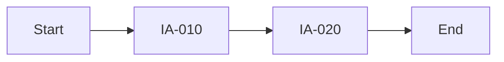
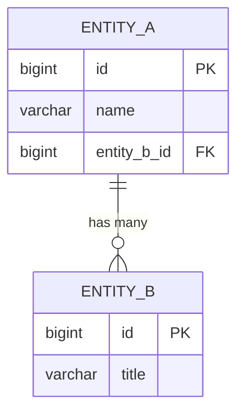

# u-maker-plugin v4.0 Remodel Implementation Plan

> **For agentic workers:** REQUIRED SUB-SKILL: Use superpowers:subagent-driven-development (recommended) or superpowers:executing-plans to implement this plan task-by-task. Steps use checkbox (`- [ ]`) syntax for tracking.

**Goal:** Rebuild u-maker-plugin from v3.1 to v4.0 — consolidate 39 skills into 7, expand 4 agents to 7, simplify runtime folder structure, add Gatekeeper scoring with 11 criteria, add HTML engine, and rewrite documentation.

**Architecture:** Big Bang rebuild. Delete all v3.1 agents/skills/hooks/templates/schemas, then create new structure from scratch. Runtime `.u-maker/` folder uses `data/dropzone/ → data/digest/ → docs/ → output/` pipeline. Each phase (plan/design/dev/check) has one consolidated skill and one dedicated agent.

**Tech Stack:** Claude Code Plugin (markdown agents, markdown skills, JS hooks, JSON schemas, HTML templates with Tailwind CSS + Mermaid CDN)

**Spec:** `docs/superpowers/specs/2026-04-03-v4-remodel-design.md`

---

## File Structure

### Files to DELETE (v3.1 artifacts)

```
agents/u-agent-builder.md
agents/u-agent-gatekeeper.md
agents/u-agent-orchestrator.md
agents/u-agent-planner.md

skills/u-add/
skills/u-ask/
skills/u-assume/
skills/u-backlog/
skills/u-browse/
skills/u-codereview/
skills/u-coverage/
skills/u-design/
skills/u-dev/
skills/u-discuss/
skills/u-doc/
skills/u-gate/
skills/u-git-pr/
skills/u-ingest/
skills/u-init/
skills/u-loop/
skills/u-maker/
skills/u-plan/
skills/u-qa/
skills/u-report/
skills/u-reverse/
skills/u-ship/
skills/u-skill-analyzer/
skills/u-skill-backlog/
skills/u-skill-code-engine/
skills/u-skill-dep-engine/
skills/u-skill-designer/
skills/u-skill-doc-engine/
skills/u-skill-estimator/
skills/u-skill-facilitator/
skills/u-skill-phase-detector/
skills/u-skill-router/
skills/u-skill-test/
skills/u-skill-validator/
skills/u-skill-workflow-runner/
skills/u-status/
skills/u-sync/
skills/u-trace/
skills/u-update/

hooks/on-build-complete.js
hooks/on-check-fail.js
hooks/on-classified-validated.js
hooks/on-gate-pass.js
hooks/on-input-added.js
hooks/on-session-wrap.js
hooks/on-ship-incomplete.js
hooks/hooks.json

_meta/templates/code-review-rules.template.md
_meta/templates/iteration-log.template.md
_meta/templates/retrospective.template.md
_meta/templates/roadmap.template.md
_meta/templates/rtm.template.md
_meta/templates/screen-flow.template.md
_meta/templates/ux-guide.template.md

_meta/schemas/assumption.schema.json
_meta/schemas/backlog.schema.json
_meta/schemas/classified.schema.json
_meta/schemas/json-export.schema.json
_meta/schemas/session.schema.json
_meta/schemas/gate-rules.json

_meta/session-protocols/ (entire directory)

spec.md
evals/ (entire directory)
.agents/ (entire directory)
README.md
README.html
GET_STARTED.md
u-maker-plugin-v3.1.1-windows.zip
setup.bat
update.sh
```

### Files to CREATE

```
# Plugin manifest
.claude-plugin/plugin.json                    (overwrite)

# Agents (7)
agents/u-agent-pm.md
agents/u-agent-plan.md
agents/u-agent-design.md
agents/u-agent-dev.md
agents/u-agent-qa.md
agents/u-agent-gatekeeper.md
agents/u-agent-report.md

# Skills (7 skills, each with SKILL.md + references/)
skills/u-plan/SKILL.md
skills/u-plan/references/ingest-flow.md
skills/u-plan/references/srs-spec.md
skills/u-plan/references/ia-spec.md

skills/u-design/SKILL.md
skills/u-design/references/erd-spec.md
skills/u-design/references/api-spec.md
skills/u-design/references/screen-spec.md
skills/u-design/references/design-system-spec.md

skills/u-dev/SKILL.md
skills/u-dev/references/code-gen-rules.md
skills/u-dev/references/tech-rules.md

skills/u-check/SKILL.md
skills/u-check/references/testcase-spec.md
skills/u-check/references/test-execution.md

skills/u-engine/SKILL.md
skills/u-engine/references/doc-engine.md
skills/u-engine/references/html-engine.md
skills/u-engine/references/dep-engine.md
skills/u-engine/references/digest-engine.md
skills/u-engine/references/router.md

skills/u-discuss/SKILL.md
skills/u-discuss/references/session-types.md

skills/u-git-pr/SKILL.md

# Hooks (3 + registry)
hooks/on-dropzone-added.js
hooks/on-doc-change.js
hooks/on-gate-result.js
hooks/hooks.json

# Templates (12)
_meta/templates/srs.template.md              (overwrite)
_meta/templates/ia.template.md               (overwrite)
_meta/templates/erd.template.md              (overwrite)
_meta/templates/api.template.md              (overwrite)
_meta/templates/screens.template.md          (overwrite)
_meta/templates/design-system.template.md
_meta/templates/testcase.template.md         (overwrite)
_meta/templates/test-results.template.md
_meta/templates/daily-report.template.html
_meta/templates/output-page.template.html
_meta/templates/output-index.template.html
_meta/templates/pr.template.md

# Schemas (5)
_meta/schemas/digest.schema.json
_meta/schemas/doc-companion.schema.json
_meta/schemas/links.schema.json
_meta/schemas/gate-rules.json
_meta/schemas/config.schema.json

# Documentation (3)
README.ko.html                               (overwrite)
README.en.html                               (overwrite)
GET_STARTED.html                             (overwrite)
```

---

## Task 1: Clean v3.1 Artifacts

**Files:**
- Delete: All files listed in "Files to DELETE" section above

- [ ] **Step 1: Delete old agents**

```bash
rm -f agents/u-agent-builder.md agents/u-agent-gatekeeper.md agents/u-agent-orchestrator.md agents/u-agent-planner.md
```

- [ ] **Step 2: Delete old skills**

```bash
rm -rf skills/u-add skills/u-ask skills/u-assume skills/u-backlog skills/u-browse skills/u-codereview skills/u-coverage skills/u-design skills/u-dev skills/u-discuss skills/u-doc skills/u-gate skills/u-git-pr skills/u-ingest skills/u-init skills/u-loop skills/u-maker skills/u-plan skills/u-qa skills/u-report skills/u-reverse skills/u-ship skills/u-skill-analyzer skills/u-skill-backlog skills/u-skill-code-engine skills/u-skill-dep-engine skills/u-skill-designer skills/u-skill-doc-engine skills/u-skill-estimator skills/u-skill-facilitator skills/u-skill-phase-detector skills/u-skill-router skills/u-skill-test skills/u-skill-validator skills/u-skill-workflow-runner skills/u-status skills/u-sync skills/u-trace skills/u-update
```

- [ ] **Step 3: Delete old hooks**

```bash
rm -f hooks/on-build-complete.js hooks/on-check-fail.js hooks/on-classified-validated.js hooks/on-gate-pass.js hooks/on-input-added.js hooks/on-session-wrap.js hooks/on-ship-incomplete.js hooks/hooks.json
```

- [ ] **Step 4: Delete old templates, schemas, session-protocols**

```bash
rm -f _meta/templates/code-review-rules.template.md _meta/templates/iteration-log.template.md _meta/templates/retrospective.template.md _meta/templates/roadmap.template.md _meta/templates/rtm.template.md _meta/templates/screen-flow.template.md _meta/templates/ux-guide.template.md
rm -f _meta/schemas/assumption.schema.json _meta/schemas/backlog.schema.json _meta/schemas/classified.schema.json _meta/schemas/json-export.schema.json _meta/schemas/session.schema.json _meta/schemas/gate-rules.json
rm -rf _meta/session-protocols
```

- [ ] **Step 5: Delete obsolete root files**

```bash
rm -f spec.md README.md README.html GET_STARTED.md u-maker-plugin-v3.1.1-windows.zip setup.bat update.sh
rm -rf evals .agents
```

- [ ] **Step 6: Verify clean state**

```bash
ls agents/    # should be empty
ls skills/    # should be empty
ls hooks/     # should only have on-doc-change.js (kept)
ls _meta/templates/   # should have srs, ia, erd, api, screens, testcase
ls _meta/schemas/     # should be empty
```

Wait — `on-doc-change.js` should also be deleted and recreated fresh. Delete it too:

```bash
rm -f hooks/on-doc-change.js
```

- [ ] **Step 7: Commit clean state**

```bash
git add -A
git commit -m "chore: remove all v3.1 artifacts for v4.0 rebuild

Co-Authored-By: Claude Opus 4.6 <noreply@anthropic.com>"
```

---

## Task 2: Create Directory Structure + Plugin Manifest

**Files:**
- Create: Directory scaffolding
- Modify: `.claude-plugin/plugin.json`

- [ ] **Step 1: Create skill directories**

```bash
mkdir -p skills/u-plan/references
mkdir -p skills/u-design/references
mkdir -p skills/u-dev/references
mkdir -p skills/u-check/references
mkdir -p skills/u-engine/references
mkdir -p skills/u-discuss/references
mkdir -p skills/u-git-pr
```

- [ ] **Step 2: Ensure other directories exist**

```bash
mkdir -p agents hooks _meta/templates _meta/schemas
```

- [ ] **Step 3: Update plugin.json**

Write `.claude-plugin/plugin.json`:

```json
{
  "name": "u-maker",
  "version": "4.0.0",
  "description": "PDCA-based SSoT plugin for Claude Code. 4-phase pipeline (dropzone → digest → docs → output), 7 agents (PM/Plan/Design/Dev/QA/Gatekeeper/Report), 7 skills, 11-criteria quality gate with scoring.",
  "author": {
    "name": "u-plugin"
  },
  "repository": "https://github.com/upleat-ax/u-maker-plugin",
  "homepage": "https://github.com/upleat-ax/u-maker-plugin",
  "keywords": [
    "pdca",
    "ssot",
    "gatekeeper",
    "agents",
    "digest-pipeline",
    "quality-gate",
    "scoring",
    "html-engine"
  ]
}
```

- [ ] **Step 4: Commit structure**

```bash
git add -A
git commit -m "chore: scaffold v4.0 directory structure + plugin.json

Co-Authored-By: Claude Opus 4.6 <noreply@anthropic.com>"
```

---

## Task 3: Create Schemas (5 files)

**Files:**
- Create: `_meta/schemas/digest.schema.json`
- Create: `_meta/schemas/doc-companion.schema.json`
- Create: `_meta/schemas/links.schema.json`
- Create: `_meta/schemas/gate-rules.json`
- Create: `_meta/schemas/config.schema.json`

- [ ] **Step 1: Create digest.schema.json**

```json
{
  "$schema": "https://json-schema.org/draft/2020-12/schema",
  "title": "Digest File",
  "description": "Refined analysis data from raw dropzone files",
  "type": "object",
  "required": ["sourceFile", "sourceHash", "analyzedAt", "summary", "keywords"],
  "properties": {
    "sourceFile": {
      "type": "string",
      "description": "Relative path from data/dropzone/"
    },
    "sourceHash": {
      "type": "string",
      "description": "SHA-256 hash of source file for change detection"
    },
    "analyzedAt": {
      "type": "string",
      "format": "date-time"
    },
    "summary": {
      "type": "string",
      "description": "Concise summary of the source document"
    },
    "keywords": {
      "type": "array",
      "items": { "type": "string" }
    },
    "requirements": {
      "type": "array",
      "items": {
        "type": "object",
        "properties": {
          "id": { "type": "string" },
          "type": { "enum": ["functional", "non-functional"] },
          "title": { "type": "string" },
          "description": { "type": "string" },
          "priority": { "enum": ["Must", "Should", "Could", "Won't"] }
        }
      }
    },
    "constraints": {
      "type": "array",
      "items": { "type": "string" }
    },
    "domainTerms": {
      "type": "array",
      "items": {
        "type": "object",
        "properties": {
          "term": { "type": "string" },
          "definition": { "type": "string" }
        }
      }
    },
    "stakeholders": {
      "type": "array",
      "items": {
        "type": "object",
        "properties": {
          "name": { "type": "string" },
          "role": { "type": "string" },
          "needs": { "type": "string" }
        }
      }
    },
    "painPoints": {
      "type": "array",
      "items": { "type": "string" }
    },
    "workflows": {
      "type": "array",
      "items": {
        "type": "object",
        "properties": {
          "name": { "type": "string" },
          "steps": { "type": "array", "items": { "type": "string" } }
        }
      }
    }
  }
}
```

- [ ] **Step 2: Create doc-companion.schema.json**

```json
{
  "$schema": "https://json-schema.org/draft/2020-12/schema",
  "title": "Document Companion JSON",
  "description": "Structured companion for SSoT markdown documents",
  "type": "object",
  "required": ["docType", "app", "status", "version", "lastUpdated", "items"],
  "properties": {
    "docType": {
      "enum": ["srs", "ia", "erd", "api", "screens", "design-system", "testcases", "test-results"]
    },
    "app": { "type": "string" },
    "status": { "enum": ["Draft", "Review", "Final"] },
    "version": { "type": "string" },
    "lastUpdated": { "type": "string", "format": "date-time" },
    "items": {
      "type": "array",
      "items": {
        "type": "object",
        "required": ["id", "type", "title", "status"],
        "properties": {
          "id": {
            "type": "string",
            "pattern": "^[A-Z]{2,4}-\\d{3}$",
            "description": "ID in 10-increment format: FR-010, US-020, etc."
          },
          "type": { "type": "string" },
          "title": { "type": "string" },
          "description": { "type": "string" },
          "status": { "enum": ["Draft", "Review", "Approved", "Implemented", "Tested"] },
          "priority": { "enum": ["Must", "Should", "Could", "Won't"] },
          "tracedFrom": {
            "type": "array",
            "items": { "type": "string" },
            "description": "IDs of parent items (e.g., FR-010 traces from USR-010)"
          },
          "tracedTo": {
            "type": "array",
            "items": { "type": "string" },
            "description": "IDs of child items"
          }
        }
      }
    },
    "crossRefs": {
      "type": "array",
      "items": {
        "type": "object",
        "properties": {
          "from": { "type": "string" },
          "to": { "type": "string" },
          "relation": { "type": "string" }
        }
      }
    }
  }
}
```

- [ ] **Step 3: Create links.schema.json**

```json
{
  "$schema": "https://json-schema.org/draft/2020-12/schema",
  "title": "Dependency Graph",
  "description": "Global dependency graph linking digest items to doc items",
  "type": "object",
  "required": ["version", "nodes", "edges"],
  "properties": {
    "version": { "type": "string" },
    "lastUpdated": { "type": "string", "format": "date-time" },
    "nodes": {
      "type": "array",
      "items": {
        "type": "object",
        "required": ["id", "type", "path"],
        "properties": {
          "id": { "type": "string" },
          "type": { "enum": ["digest", "doc", "item"] },
          "path": { "type": "string" },
          "itemId": { "type": "string" }
        }
      }
    },
    "edges": {
      "type": "array",
      "items": {
        "type": "object",
        "required": ["from", "to", "relation"],
        "properties": {
          "from": { "type": "string" },
          "to": { "type": "string" },
          "relation": { "enum": ["derives", "implements", "tests", "references"] }
        }
      }
    }
  }
}
```

- [ ] **Step 4: Create gate-rules.json**

```json
{
  "$schema": "https://json-schema.org/draft/2020-12/schema",
  "title": "Gatekeeper Validation Rules",
  "description": "11 quality criteria for gatekeeper scoring",
  "passThreshold": 95,
  "maxRetries": 3,
  "criteria": [
    {
      "id": "GK-01",
      "name": "Completeness",
      "nameKo": "완전성",
      "description": "All required sections and items exist without omission",
      "maxScore": 100,
      "checks": ["required-sections-exist", "no-empty-sections", "all-mandatory-fields-filled"]
    },
    {
      "id": "GK-02",
      "name": "Accuracy",
      "nameKo": "정확성",
      "description": "Content matches source digest and upstream documents",
      "maxScore": 100,
      "checks": ["digest-alignment", "upstream-doc-consistency", "data-correctness"]
    },
    {
      "id": "GK-03",
      "name": "Consistency",
      "nameKo": "일관성",
      "description": "IDs, terminology, and values are consistent across documents",
      "maxScore": 100,
      "checks": ["id-uniqueness", "term-consistency", "value-no-contradiction"]
    },
    {
      "id": "GK-04",
      "name": "Traceability",
      "nameKo": "추적성",
      "description": "FR→US→FT→TC chain is complete without gaps",
      "maxScore": 100,
      "checks": ["chain-completeness", "no-orphan-items", "bidirectional-links"]
    },
    {
      "id": "GK-05",
      "name": "TOC Quality",
      "nameKo": "TOC 적정성",
      "description": "Table of contents is logical, detailed enough, correct depth, no missing entries",
      "maxScore": 100,
      "checks": ["toc-depth-adequate", "toc-entries-match-sections", "toc-logical-order"]
    },
    {
      "id": "GK-06",
      "name": "Content Composition",
      "nameKo": "내용 구성",
      "description": "Logical structure, natural section flow, key information properly placed",
      "maxScore": 100,
      "checks": ["section-flow-logical", "info-placement-appropriate", "no-redundancy"]
    },
    {
      "id": "GK-07",
      "name": "Visual Adequacy",
      "nameKo": "시각 표현 적정성",
      "description": "Stars, cards, tables, lists used appropriately for content type",
      "maxScore": 100,
      "checks": ["visual-element-fit", "no-over-decoration", "no-under-representation"]
    },
    {
      "id": "GK-08",
      "name": "Diagram Fitness",
      "nameKo": "다이어그램 적정성",
      "description": "Diagram types appropriate for subject, SVG renders correctly",
      "maxScore": 100,
      "checks": ["diagram-type-match", "svg-render-valid", "diagram-content-alignment"]
    },
    {
      "id": "GK-09",
      "name": "Mermaid Integrity",
      "nameKo": "Mermaid 무결성",
      "description": "No Mermaid syntax errors, renderable, no missing nodes/edges",
      "maxScore": 100,
      "checks": ["mermaid-syntax-valid", "mermaid-renderable", "nodes-edges-complete"]
    },
    {
      "id": "GK-10",
      "name": "JSON Sync",
      "nameKo": "JSON 동기화",
      "description": ".md and .json companion are exactly synchronized, ID 10-increment rule",
      "maxScore": 100,
      "checks": ["md-json-sync", "id-10-increment", "id-format-valid"]
    },
    {
      "id": "GK-11",
      "name": "Cross-Reference",
      "nameKo": "교차참조",
      "description": "links.json dependency graph matches actual document references",
      "maxScore": 100,
      "checks": ["links-json-matches-refs", "no-dangling-refs", "no-missing-edges"]
    }
  ],
  "gates": {
    "plan-to-design": {
      "required": [
        { "doc": "srs", "status": "Final" },
        { "doc": "ia", "status": "Final" }
      ]
    },
    "design-to-dev": {
      "required": [
        { "doc": "erd", "status": "Final" },
        { "doc": "api", "status": "Final" },
        { "doc": "screens", "status": "Final" },
        { "doc": "design-system", "status": "Final" }
      ]
    },
    "dev-to-check": {
      "required": [
        { "condition": "code-complete" },
        { "condition": "build-success" }
      ]
    },
    "check-to-done": {
      "required": [
        { "doc": "testcases", "status": "Final" },
        { "doc": "test-results", "status": "Final" },
        { "condition": "critical-defects-zero" }
      ]
    }
  }
}
```

- [ ] **Step 5: Create config.schema.json**

```json
{
  "$schema": "https://json-schema.org/draft/2020-12/schema",
  "title": "u-maker Config",
  "description": "Project-level configuration for .u-maker/",
  "type": "object",
  "required": ["version", "project"],
  "properties": {
    "version": { "type": "string", "const": "4.0" },
    "project": {
      "type": "object",
      "required": ["name"],
      "properties": {
        "name": { "type": "string" },
        "description": { "type": "string" },
        "apps": {
          "type": "array",
          "items": { "type": "string" },
          "description": "List of app names for multi-app projects"
        }
      }
    },
    "defaults": {
      "type": "object",
      "properties": {
        "auto": { "type": "boolean", "default": true },
        "loop": { "type": "boolean", "default": false },
        "loopMaxRetries": { "type": "integer", "default": 3 },
        "gatekeeperThreshold": { "type": "integer", "default": 95 }
      }
    }
  }
}
```

- [ ] **Step 6: Commit schemas**

```bash
git add _meta/schemas/
git commit -m "feat: add v4.0 schemas (digest, doc-companion, links, gate-rules, config)

Co-Authored-By: Claude Opus 4.6 <noreply@anthropic.com>"
```

---

## Task 4: Create Document Templates (8 MD files)

**Files:**
- Overwrite: `_meta/templates/srs.template.md`
- Overwrite: `_meta/templates/ia.template.md`
- Overwrite: `_meta/templates/erd.template.md`
- Overwrite: `_meta/templates/api.template.md`
- Overwrite: `_meta/templates/screens.template.md`
- Create: `_meta/templates/design-system.template.md`
- Overwrite: `_meta/templates/testcase.template.md`
- Create: `_meta/templates/test-results.template.md`

- [ ] **Step 1: Write srs.template.md**

Update existing SRS template — remove Roadmap references, enforce 10-increment IDs, add JSON companion note:

```markdown
---
Owner: {{owner}}
Status: {{status}}
Version: {{version}}
Last Updated: {{date}}
App: {{app}}
Companion: srs.json
---

# Software Requirements Specification (SRS)

> JSON companion: `srs.json` — all items with IDs, statuses, and cross-references.
> ID Rule: 10-increment (FR-010, FR-020, ...). Insert between: FR-015.

## 1. Project Overview

| Item | Value |
|------|-------|
| Project Name | {{projectName}} |
| Description | {{description}} |
| Target Users | {{targetUsers}} |
| Platform | {{platform}} |

## 2. Stakeholders

| ID | Name | Role | Department | Needs |
|----|------|------|------------|-------|
| STK-010 | {{name}} | {{role}} | {{department}} | {{needs}} |

## 3. Functional Requirements

| ID | Title | Description | Priority | Status | Traced From |
|----|-------|-------------|----------|--------|-------------|
| FR-010 | {{title}} | {{description}} | Must/Should/Could/Won't | Draft | — |

## 4. Non-Functional Requirements

| ID | Category | Title | Description | Priority | Metric |
|----|----------|-------|-------------|----------|--------|
| NFR-010 | {{category}} | {{title}} | {{description}} | {{priority}} | {{metric}} |

## 5. User Stories

### US-010: {{title}}

- **As a** {{actor}}
- **I want to** {{action}}
- **So that** {{benefit}}
- **Acceptance Criteria:**
  - [ ] {{criterion}}
- **Traced From:** FR-010

## 6. Features (FT)

| ID | Title | Description | Story Points | Status | Traced From |
|----|-------|-------------|--------------|--------|-------------|
| FT-010 | {{title}} | {{description}} | {{sp}} | Draft | US-010 |

## 7. Constraints

- **{{type}}**: {{description}}

## 8. Glossary

| Term | Definition |
|------|-----------|
| {{term}} | {{definition}} |
```

- [ ] **Step 2: Write ia.template.md**

```markdown
---
Owner: {{owner}}
Status: {{status}}
Version: {{version}}
Last Updated: {{date}}
App: {{app}}
Companion: ia.json
---

# Information Architecture (IA)

> JSON companion: `ia.json`
> ID Rule: 10-increment (IA-010, IA-020, ...)

## 1. Site Map

```mermaid
graph TD
    ROOT[{{appName}}]
    ROOT --> S010[IA-010: {{section}}]
    S010 --> S020[IA-020: {{page}}]
```

## 2. Page Inventory

| ID | Page Name | Path | Parent | Description | Related FR |
|----|-----------|------|--------|-------------|-----------|
| IA-010 | {{pageName}} | {{path}} | — | {{description}} | FR-010 |

## 3. Navigation Structure

| Level | Label | Target | Auth Required |
|-------|-------|--------|--------------|
| GNB | {{label}} | IA-010 | Yes/No |

## 4. User Flows

### Flow: {{flowName}}


```

- [ ] **Step 3: Write erd.template.md**

Update existing ERD template — add JSON companion note, enforce Mermaid constraint rule:

```markdown
---
Owner: {{owner}}
Status: {{status}}
Version: {{version}}
Last Updated: {{date}}
App: {{app}}
Companion: erd.json
---

# Entity-Relationship Diagram (ERD)

> JSON companion: `erd.json`
> ID Rule: ENT-010, ENT-020, ... (entities), REL-010, REL-020, ... (relationships)
> Mermaid constraint: PK, FK, UK 중 하나만 사용 (결합 표기 금지)

## 1. Entity List

### ENT-010: {{entityName}}

| Column | Type | PK | FK | Nullable | Default | Description |
|--------|------|----|----|----------|---------|-------------|
| {{name}} | {{type}} | {{pk}} | {{fk}} | {{nullable}} | {{default}} | {{description}} |

## 2. Relationships

| ID | From Entity | To Entity | Type | FK Column | Description |
|----|-------------|-----------|------|-----------|-------------|
| REL-010 | {{from}} | {{to}} | 1:N / N:M / 1:1 | {{fkColumn}} | {{description}} |

## 3. ERD Diagram



## 4. Common Table References

| Table | Referenced By | Context |
|-------|---------------|---------|
| {{name}} | {{referencedBy}} | {{context}} |
```

- [ ] **Step 4: Write api.template.md**

```markdown
---
Owner: {{owner}}
Status: {{status}}
Version: {{version}}
Last Updated: {{date}}
App: {{app}}
Companion: api.json
---

# API Contract

> JSON companion: `api.json`
> ID Rule: API-010, API-020, ...

## 1. API Summary

| ID | Method | Path | Description | Auth | Related FR |
|----|--------|------|-------------|------|-----------|
| API-010 | GET/POST/PUT/DELETE | {{path}} | {{description}} | Bearer/None | FR-010 |

## 2. API Details

### API-010: {{title}}

**Endpoint:** `{{method}} {{path}}`

**Request:**
```json
{
  "field": "type — description"
}
```

**Response (200):**
```json
{
  "field": "type — description"
}
```

**Error Responses:**

| Code | Message | Condition |
|------|---------|-----------|
| 400 | Bad Request | {{condition}} |
| 401 | Unauthorized | {{condition}} |
| 404 | Not Found | {{condition}} |

## 3. Authentication & Authorization

| Role | Endpoints | Permissions |
|------|-----------|-------------|
| {{role}} | API-010, API-020 | read/write/admin |

## 4. Common Models

```mermaid
classDiagram
    class {{ModelName}} {
        +bigint id
        +string name
        +datetime createdAt
    }
```
```

- [ ] **Step 5: Write screens.template.md**

```markdown
---
Owner: {{owner}}
Status: {{status}}
Version: {{version}}
Last Updated: {{date}}
App: {{app}}
Companion: screens.json
---

# Screen Specification

> JSON companion: `screens.json`
> ID Rule: SC-010, SC-020, ...

## 1. Screen Inventory

| ID | Screen Name | Path | Category | Related IA | Related FR |
|----|------------|------|----------|-----------|-----------|
| SC-010 | {{screenName}} | {{path}} | {{category}} | IA-010 | FR-010 |

## 2. Screen Details

### SC-010: {{screenName}}

**Layout:**
- Header: {{headerDescription}}
- Body: {{bodyDescription}}
- Footer: {{footerDescription}}

**Components:**

| # | Component | Type | Props/Data | Interaction |
|---|-----------|------|-----------|-------------|
| 1 | {{name}} | Button/Input/Card/Table/... | {{props}} | {{interaction}} |

**API Calls:**

| Trigger | API | Method | Purpose |
|---------|-----|--------|---------|
| onLoad | API-010 | GET | {{purpose}} |

**State:**

| State | Type | Default | Description |
|-------|------|---------|-------------|
| {{name}} | {{type}} | {{default}} | {{description}} |

**Validation Rules:**

| Field | Rule | Message |
|-------|------|---------|
| {{field}} | required/minLength/pattern/... | {{message}} |
```

- [ ] **Step 6: Write design-system.template.md**

```markdown
---
Owner: {{owner}}
Status: {{status}}
Version: {{version}}
Last Updated: {{date}}
App: {{app}}
Companion: design-system.json
---

# Design System

> JSON companion: `design-system.json`
> ID Rule: DS-010, DS-020, ... (tokens), CMP-010, CMP-020, ... (components)

## 1. Design Tokens

### 1.1 Colors

| ID | Token | Value | Usage |
|----|-------|-------|-------|
| DS-010 | --color-primary | {{value}} | Primary actions, links |
| DS-020 | --color-secondary | {{value}} | Secondary elements |
| DS-030 | --color-bg | {{value}} | Page background |
| DS-040 | --color-surface | {{value}} | Card/panel background |
| DS-050 | --color-text | {{value}} | Body text |
| DS-060 | --color-border | {{value}} | Borders, dividers |
| DS-070 | --color-error | {{value}} | Error states |
| DS-080 | --color-success | {{value}} | Success states |

### 1.2 Typography

| Token | Font | Size | Weight | Line Height |
|-------|------|------|--------|-------------|
| --font-heading-1 | {{font}} | {{size}} | {{weight}} | {{lineHeight}} |
| --font-body | {{font}} | {{size}} | {{weight}} | {{lineHeight}} |

### 1.3 Spacing

| Token | Value | Usage |
|-------|-------|-------|
| --space-xs | 4px | Tight spacing |
| --space-sm | 8px | Compact elements |
| --space-md | 16px | Default gap |
| --space-lg | 24px | Section spacing |
| --space-xl | 32px | Major sections |

### 1.4 Border Radius

| Token | Value | Usage |
|-------|-------|-------|
| --radius-sm | 4px | Inputs, small elements |
| --radius-md | 8px | Cards, buttons |
| --radius-lg | 16px | Modals, large panels |

## 2. UI Components

### CMP-010: Button

| Variant | Background | Text | Border | Usage |
|---------|-----------|------|--------|-------|
| Primary | --color-primary | #fff | none | Main CTA |
| Secondary | transparent | --color-primary | --color-primary | Alternative action |
| Danger | --color-error | #fff | none | Destructive action |

### CMP-020: Input

| State | Border | Background | Text |
|-------|--------|-----------|------|
| Default | --color-border | --color-surface | --color-text |
| Focus | --color-primary | --color-surface | --color-text |
| Error | --color-error | --color-surface | --color-text |

### CMP-030: Card

| Property | Value |
|----------|-------|
| Background | --color-surface |
| Border | 1px solid --color-border |
| Radius | --radius-md |
| Shadow | 0 1px 3px rgba(0,0,0,0.1) |
| Padding | --space-md |

## 3. Layout Patterns

| Pattern | Description | Breakpoints |
|---------|-------------|-------------|
| Sidebar + Content | 280px sidebar + fluid content | < 768px: stack |
| Grid Cards | Auto-fill grid, min 280px | Responsive |
| Form Stack | Vertical form fields, max-width 480px | Always stacked |
```

- [ ] **Step 7: Write testcase.template.md**

```markdown
---
Owner: {{owner}}
Status: {{status}}
Version: {{version}}
Last Updated: {{date}}
App: {{app}}
Companion: testcases.json
---

# Test Cases

> JSON companion: `testcases.json`
> ID Rule: TC-010, TC-020, ...
> Traced from FT (Feature) items in SRS

## 1. Test Case Summary

| ID | Title | Type | Priority | FT | Status |
|----|-------|------|----------|-----|--------|
| TC-010 | {{title}} | unit/integration/e2e/a11y/perf/security | P1/P2/P3 | FT-010 | Draft |

## 2. Test Case Details

### TC-010: {{title}}

| Field | Value |
|-------|-------|
| Type | unit / integration / e2e / a11y / perf / security |
| Priority | P1 (Must) / P2 (Should) / P3 (Could) |
| Traced From | FT-010 |
| Precondition | {{precondition}} |

**Steps:**

| # | Action | Expected Result |
|---|--------|----------------|
| 1 | {{action}} | {{expected}} |

**Test Data:**

| Input | Value | Notes |
|-------|-------|-------|
| {{field}} | {{value}} | {{notes}} |
```

- [ ] **Step 8: Write test-results.template.md**

```markdown
---
Owner: {{owner}}
Status: {{status}}
Version: {{version}}
Last Updated: {{date}}
App: {{app}}
Companion: test-results.json
---

# Test Results

> JSON companion: `test-results.json`

## 1. Execution Summary

| Metric | Value |
|--------|-------|
| Total TCs | {{total}} |
| Passed | {{passed}} |
| Failed | {{failed}} |
| Skipped | {{skipped}} |
| Pass Rate | {{passRate}}% |
| Execution Date | {{date}} |

## 2. Results by Type

| Type | Total | Passed | Failed | Pass Rate |
|------|-------|--------|--------|-----------|
| Unit | {{n}} | {{p}} | {{f}} | {{rate}}% |
| Integration | {{n}} | {{p}} | {{f}} | {{rate}}% |
| E2E | {{n}} | {{p}} | {{f}} | {{rate}}% |

## 3. Failed Test Details

### TC-{{id}}: {{title}}

| Field | Value |
|-------|-------|
| Status | FAIL |
| Error | {{errorMessage}} |
| Severity | Critical / Major / Minor |
| Root Cause | {{rootCause}} |
| Action | Fix / Retest / Skip |

## 4. Coverage Matrix

| FR | US | FT | TC | Result |
|----|----|----|-----|--------|
| FR-010 | US-010 | FT-010 | TC-010 | PASS/FAIL |
```

- [ ] **Step 9: Commit document templates**

```bash
git add _meta/templates/
git commit -m "feat: add v4.0 document templates (srs, ia, erd, api, screens, design-system, testcase, test-results)

Co-Authored-By: Claude Opus 4.6 <noreply@anthropic.com>"
```

---

## Task 5: Create HTML Templates (3 files) + PR Template

**Files:**
- Create: `_meta/templates/output-index.template.html`
- Create: `_meta/templates/output-page.template.html`
- Create: `_meta/templates/daily-report.template.html`
- Create: `_meta/templates/pr.template.md`

- [ ] **Step 1: Write output-index.template.html**

This is the navigation index page based on the user-provided sidebar design. Write to `_meta/templates/output-index.template.html`:

```html
<!DOCTYPE html>
<html lang="ko">
<head>
<meta charset="UTF-8">
<meta name="viewport" content="width=device-width, initial-scale=1.0">
<title>{{appName}} — SSoT Documents</title>
<style>
:root{--bg:#e8edf2;--surface:#fff;--border:#d1d9e0;--sb:#0f172a;--sb-hover:#1e293b;--text:#1a202c;--text2:#4a5568;--text3:#94a3b8;--accent:#3b82f6}
*{box-sizing:border-box;margin:0;padding:0}
body{font-family:-apple-system,BlinkMacSystemFont,'Segoe UI','Noto Sans KR',sans-serif;background:var(--bg);color:var(--text);height:100vh;overflow:hidden}
.layout{display:flex;height:100vh}
.nav-sidebar{width:280px;background:var(--sb);color:#fff;display:flex;flex-direction:column;flex-shrink:0;overflow:hidden}
.nav-header{padding:16px 20px;border-bottom:1px solid rgba(255,255,255,.08)}
.nav-header h1{font-size:14px;font-weight:700;color:#fff;margin-bottom:2px}
.nav-header p{font-size:11px;color:var(--text3)}
.nav-body{flex:1;overflow-y:auto;padding:8px 0}
.nav-body::-webkit-scrollbar{width:4px}
.nav-body::-webkit-scrollbar-thumb{background:rgba(255,255,255,.15);border-radius:2px}
.nav-group{margin-bottom:4px}
.nav-group-title{padding:10px 20px 6px;font-size:10px;font-weight:700;text-transform:uppercase;letter-spacing:.08em;color:var(--text3);display:flex;align-items:center;gap:6px}
.nav-group-title::before{content:'';display:block;width:8px;height:2px;border-radius:1px}
.nav-group.plan .nav-group-title::before{background:#3b82f6}
.nav-group.design .nav-group-title::before{background:#10b981}
.nav-group.check .nav-group-title::before{background:#f59e0b}
.nav-item{display:flex;align-items:center;gap:10px;padding:8px 20px;font-size:12px;color:#94a3b8;cursor:pointer;border-left:3px solid transparent;transition:all .15s}
.nav-item:hover{background:rgba(255,255,255,.06);color:#e2e8f0}
.nav-item.active{background:rgba(59,130,246,.15);color:#fff;border-left-color:var(--accent)}
.nav-item .label{white-space:nowrap;overflow:hidden;text-overflow:ellipsis}
.nav-count{font-size:10px;background:rgba(255,255,255,.1);padding:1px 7px;border-radius:8px;color:var(--text3);margin-left:auto}
.content{flex:1;display:flex;flex-direction:column;overflow:hidden}
.content-header{background:var(--surface);border-bottom:1px solid var(--border);padding:10px 20px;display:flex;align-items:center;justify-content:space-between;flex-shrink:0}
.content-header .crumb{font-size:12px;color:var(--text2)}
.content-header .crumb strong{color:var(--text);font-weight:700}
.content-header .actions{display:flex;gap:8px}
.btn-nav{padding:5px 12px;border-radius:6px;font-size:11px;font-weight:600;cursor:pointer;border:1px solid var(--border);background:#fff;color:var(--text2);transition:all .15s}
.btn-nav:hover{background:#f1f5f9}
.btn-nav:disabled{opacity:.35;cursor:default}
.content-frame{flex:1;border:none;width:100%;height:100%}
.welcome{flex:1;display:flex;align-items:center;justify-content:center;flex-direction:column;gap:12px;color:var(--text3)}
.welcome .icon{font-size:48px;opacity:.3}
.welcome h2{font-size:16px;font-weight:600;color:var(--text2)}
.welcome p{font-size:12px}
.footer{padding:8px 20px;border-top:1px solid rgba(255,255,255,.08);font-size:10px;color:var(--text3);text-align:center}
</style>
</head>
<body>
<div class="layout">
  <nav class="nav-sidebar">
    <div class="nav-header">
      <h1>{{appName}}</h1>
      <p>{{appDescription}}</p>
    </div>
    <div class="nav-body" id="navBody">
      <!-- Plan -->
      <div class="nav-group plan">
        <div class="nav-group-title">Plan <span class="nav-count">{{planCount}}</span></div>
        {{#planItems}}
        <div class="nav-item" data-src="plan/{{file}}">
          <span class="label">{{title}}</span>
        </div>
        {{/planItems}}
      </div>
      <!-- Design -->
      <div class="nav-group design">
        <div class="nav-group-title">Design <span class="nav-count">{{designCount}}</span></div>
        {{#designItems}}
        <div class="nav-item" data-src="design/{{file}}">
          <span class="label">{{title}}</span>
        </div>
        {{/designItems}}
      </div>
      <!-- Check -->
      <div class="nav-group check">
        <div class="nav-group-title">Check <span class="nav-count">{{checkCount}}</span></div>
        {{#checkItems}}
        <div class="nav-item" data-src="check/{{file}}">
          <span class="label">{{title}}</span>
        </div>
        {{/checkItems}}
      </div>
    </div>
    <div class="footer">Copyright(c) 2026 U PLEAT</div>
  </nav>
  <div class="content" id="content">
    <div class="content-header" id="contentHeader" style="display:none">
      <span class="crumb" id="crumb"></span>
      <div class="actions">
        <button class="btn-nav" id="btnPrev" onclick="navigate(-1)">&larr; Prev</button>
        <button class="btn-nav" id="btnNext" onclick="navigate(1)">Next &rarr;</button>
        <button class="btn-nav" onclick="window.open(currentSrc,'_blank')">New Tab</button>
      </div>
    </div>
    <div class="welcome" id="welcome">
      <div class="icon">&#9776;</div>
      <h2>Select a document</h2>
      <p>Click a document in the sidebar to view it here</p>
    </div>
    <iframe class="content-frame" id="frame" style="display:none"></iframe>
  </div>
</div>
<script>
const items=[...document.querySelectorAll('.nav-item')];
const frame=document.getElementById('frame');
const welcome=document.getElementById('welcome');
const header=document.getElementById('contentHeader');
const crumb=document.getElementById('crumb');
const btnPrev=document.getElementById('btnPrev');
const btnNext=document.getElementById('btnNext');
let currentIdx=-1,currentSrc='';
items.forEach((item,idx)=>{item.addEventListener('click',()=>loadPage(idx))});
function loadPage(idx){
  if(idx<0||idx>=items.length)return;
  currentIdx=idx;const item=items[idx];const src=item.dataset.src;currentSrc=src;
  items.forEach(i=>i.classList.remove('active'));item.classList.add('active');
  item.scrollIntoView({block:'nearest',behavior:'smooth'});
  welcome.style.display='none';frame.style.display='block';header.style.display='flex';frame.src=src;
  const group=item.closest('.nav-group').querySelector('.nav-group-title').textContent.trim();
  const label=item.querySelector('.label').textContent;
  crumb.innerHTML=group+' &rsaquo; <strong>'+label+'</strong>';
  btnPrev.disabled=idx===0;btnNext.disabled=idx===items.length-1;
}
function navigate(dir){loadPage(currentIdx+dir)}
document.addEventListener('keydown',(e)=>{
  if(e.key==='ArrowUp'||e.key==='ArrowLeft'){e.preventDefault();navigate(-1)}
  if(e.key==='ArrowDown'||e.key==='ArrowRight'){e.preventDefault();navigate(1)}
});
</script>
</body>
</html>
```

- [ ] **Step 2: Write output-page.template.html**

Template for individual document HTML pages. Write to `_meta/templates/output-page.template.html`:

```html
<!DOCTYPE html>
<html lang="ko">
<head>
<meta charset="UTF-8">
<meta name="viewport" content="width=device-width, initial-scale=1.0">
<title>{{docTitle}} — {{appName}}</title>
<script src="https://cdn.tailwindcss.com"></script>
<script src="https://cdn.jsdelivr.net/npm/mermaid@11/dist/mermaid.min.js"></script>
<script>mermaid.initialize({startOnLoad:true,theme:'default',flowchart:{curve:'basis'}});</script>
<style>
:root{--bg:#f8fafc;--surface:#fff;--text:#1a202c;--text2:#4a5568;--border:#e2e8f0;--accent:#3b82f6}
body{font-family:-apple-system,BlinkMacSystemFont,'Segoe UI','Noto Sans KR',sans-serif;background:var(--bg);color:var(--text);line-height:1.7;margin:0}
.doc-container{max-width:960px;margin:0 auto;padding:32px 24px 64px}
h1{font-size:24px;font-weight:800;margin-bottom:8px;color:var(--text)}
h2{font-size:18px;font-weight:700;margin:32px 0 12px;padding-bottom:6px;border-bottom:2px solid var(--accent);color:var(--text)}
h3{font-size:15px;font-weight:700;margin:24px 0 8px;color:var(--text)}
table{width:100%;border-collapse:collapse;margin:12px 0;font-size:13px}
th{background:#f1f5f9;font-weight:600;text-align:left;padding:8px 12px;border:1px solid var(--border)}
td{padding:8px 12px;border:1px solid var(--border);vertical-align:top}
tr:hover td{background:#fafbfc}
code{background:#f1f5f9;padding:2px 6px;border-radius:4px;font-size:12px;font-family:'Fira Code',monospace}
pre{background:#1e293b;color:#e2e8f0;padding:16px;border-radius:8px;overflow-x:auto;font-size:12px;line-height:1.5}
pre code{background:none;padding:0;color:inherit}
.meta-bar{display:flex;gap:12px;flex-wrap:wrap;margin-bottom:24px;font-size:12px;color:var(--text2)}
.meta-bar span{background:#f1f5f9;padding:4px 10px;border-radius:4px}
.toc{background:var(--surface);border:1px solid var(--border);border-radius:8px;padding:16px 20px;margin:16px 0 32px}
.toc h4{font-size:13px;font-weight:700;margin-bottom:8px}
.toc ul{list-style:none;padding-left:0}
.toc li{font-size:12px;padding:3px 0}
.toc a{color:var(--accent);text-decoration:none}
.toc a:hover{text-decoration:underline}
.mermaid{margin:16px 0;text-align:center}
svg{max-width:100%}
.footer{text-align:center;padding:24px;font-size:11px;color:var(--text2);border-top:1px solid var(--border);margin-top:48px}
</style>
</head>
<body>
<div class="doc-container">
  <h1>{{docTitle}}</h1>
  <div class="meta-bar">
    <span>App: {{appName}}</span>
    <span>Status: {{status}}</span>
    <span>Version: {{version}}</span>
    <span>Updated: {{lastUpdated}}</span>
  </div>
  <nav class="toc">
    <h4>Table of Contents</h4>
    {{toc}}
  </nav>
  {{content}}
  <div class="footer">Copyright(c) 2026 U PLEAT</div>
</div>
</body>
</html>
```

- [ ] **Step 3: Write daily-report.template.html**

Write to `_meta/templates/daily-report.template.html`:

```html
<!DOCTYPE html>
<html lang="ko">
<head>
<meta charset="UTF-8">
<meta name="viewport" content="width=device-width, initial-scale=1.0">
<title>Daily Report — {{date}}</title>
<script src="https://cdn.tailwindcss.com"></script>
<style>
:root{--bg:#f8fafc;--surface:#fff;--text:#1a202c;--text2:#4a5568;--border:#e2e8f0;--accent:#3b82f6;--green:#10b981;--red:#ef4444;--yellow:#f59e0b}
body{font-family:-apple-system,BlinkMacSystemFont,'Segoe UI','Noto Sans KR',sans-serif;background:var(--bg);color:var(--text);margin:0}
.report{max-width:800px;margin:0 auto;padding:32px 24px 64px}
h1{font-size:22px;font-weight:800}
h2{font-size:16px;font-weight:700;margin:28px 0 12px;color:var(--accent)}
.date-badge{font-size:12px;background:var(--accent);color:#fff;padding:4px 12px;border-radius:12px;display:inline-block;margin:8px 0 24px}
.card-grid{display:grid;grid-template-columns:repeat(auto-fit,minmax(160px,1fr));gap:12px;margin:16px 0}
.card{background:var(--surface);border:1px solid var(--border);border-radius:8px;padding:16px;text-align:center}
.card .value{font-size:28px;font-weight:800}
.card .label{font-size:11px;color:var(--text2);margin-top:4px}
.card.green .value{color:var(--green)}
.card.red .value{color:var(--red)}
.card.yellow .value{color:var(--yellow)}
table{width:100%;border-collapse:collapse;font-size:13px;margin:12px 0}
th{background:#f1f5f9;padding:8px 12px;text-align:left;border:1px solid var(--border);font-weight:600}
td{padding:8px 12px;border:1px solid var(--border)}
.score{display:inline-block;padding:2px 8px;border-radius:4px;font-size:11px;font-weight:700}
.score.pass{background:#d1fae5;color:#065f46}
.score.fail{background:#fee2e2;color:#991b1b}
.footer{text-align:center;padding:24px;font-size:11px;color:var(--text2);border-top:1px solid var(--border);margin-top:48px}
</style>
</head>
<body>
<div class="report">
  <h1>Daily Report</h1>
  <div class="date-badge">{{date}}</div>

  <h2>Project Status</h2>
  <div class="card-grid">
    <div class="card"><div class="value">{{currentPhase}}</div><div class="label">Current Phase</div></div>
    <div class="card green"><div class="value">{{docsComplete}}</div><div class="label">Docs Complete</div></div>
    <div class="card yellow"><div class="value">{{docsInProgress}}</div><div class="label">In Progress</div></div>
    <div class="card red"><div class="value">{{blockers}}</div><div class="label">Blockers</div></div>
  </div>

  <h2>Document Status</h2>
  <table>
    <tr><th>Document</th><th>Phase</th><th>Status</th><th>Last Updated</th></tr>
    {{#docs}}
    <tr><td>{{name}}</td><td>{{phase}}</td><td>{{status}}</td><td>{{updated}}</td></tr>
    {{/docs}}
  </table>

  <h2>Gatekeeper Scores</h2>
  <table>
    <tr><th>#</th><th>Criteria</th><th>Score</th><th>Status</th></tr>
    {{#scores}}
    <tr>
      <td>{{id}}</td>
      <td>{{name}}</td>
      <td>{{score}}/100</td>
      <td><span class="score {{passClass}}">{{passLabel}}</span></td>
    </tr>
    {{/scores}}
    <tr><td colspan="2"><strong>Average</strong></td><td><strong>{{avgScore}}/100</strong></td><td><span class="score {{avgPassClass}}">{{avgPassLabel}}</span></td></tr>
  </table>

  <h2>Changes Today</h2>
  {{#changes}}
  - {{description}}
  {{/changes}}

  <div class="footer">Copyright(c) 2026 U PLEAT</div>
</div>
</body>
</html>
```

- [ ] **Step 4: Write pr.template.md**

Write to `_meta/templates/pr.template.md`:

```markdown
## {{prTitle}}

### Work Summary

| Commit | Description |
|--------|-------------|
{{#commits}}
| `{{hash}}` | {{message}} |
{{/commits}}

### Changed Files

{{#files}}
- `{{path}}` — {{description}}
{{/files}}

### Implementation Details

{{implementationDetails}}

### Checklist

- [ ] base/compare branch confirmed
- [ ] Build success (`bun run build`)
- [ ] Type check passed (`tsc --noEmit`)
- [ ] No `console.log` in production code
- [ ] `.env.example` updated if needed

### Review Guide

| Priority | Action | Scope |
|----------|--------|-------|
| **P1** | Request Changes | Feature bugs, security issues |
| **P2** | Comment | Style/structure improvement suggestions |
| **P3** | Approve | Minor opinions |
```

- [ ] **Step 5: Commit HTML templates + PR template**

```bash
git add _meta/templates/
git commit -m "feat: add HTML templates (output-index, output-page, daily-report) + PR template

Co-Authored-By: Claude Opus 4.6 <noreply@anthropic.com>"
```

---

## Task 6: Create u-engine Skill (SKILL.md + 5 references)

**Files:**
- Create: `skills/u-engine/SKILL.md`
- Create: `skills/u-engine/references/doc-engine.md`
- Create: `skills/u-engine/references/html-engine.md`
- Create: `skills/u-engine/references/dep-engine.md`
- Create: `skills/u-engine/references/digest-engine.md`
- Create: `skills/u-engine/references/router.md`

- [ ] **Step 1: Write u-engine/SKILL.md**

```markdown
---
name: u-engine
description: "This skill should be used when any u-maker command needs internal engine support — document CRUD, HTML generation, dependency graph management, digest processing, or command routing. Provides shared infrastructure for all phase skills."
version: 4.0.0
---

# u-engine — Shared Engine Infrastructure

Internal engine bundle providing cross-cutting capabilities for all u-maker phase skills.

## Engines

| Engine | Reference | Purpose |
|--------|-----------|---------|
| doc-engine | `references/doc-engine.md` | Document CRUD, template rendering, JSON companion generation |
| html-engine | `references/html-engine.md` | MD→HTML conversion, SVG diagrams, Mermaid CDN, base64 images, sidebar navigation |
| dep-engine | `references/dep-engine.md` | links.json dependency graph, cascade propagation |
| digest-engine | `references/digest-engine.md` | dropzone→digest refinement, hash comparison, _index.json management |
| router | `references/router.md` | Intent classification, command parsing, agent dispatch |

## Document CRUD Protocol

All document operations follow this protocol:

1. Read template from `_meta/templates/{docType}.template.md`
2. Generate `.md` document with template structure filled
3. Generate `.json` companion with structured items, IDs, cross-references
4. Update `data/links.json` with new nodes and edges
5. Verify `.md` ↔ `.json` synchronization

### ID Convention

- All IDs use 10-increment: FR-010, FR-020, FR-030
- Insert between existing: FR-015 (between 010 and 020)
- Format: `{TYPE}-{NNN}` where NNN is zero-padded 3 digits
- Types: FR, NFR, US, FT, SC, TC, ENT, REL, API, IA, DS, CMP, STK

### JSON Companion Structure

Every `.md` SSoT document has a `.json` companion following `_meta/schemas/doc-companion.schema.json`.

## HTML Generation Protocol

1. Read `.md` source document
2. Parse frontmatter metadata
3. Convert markdown → HTML body
4. Render Mermaid diagrams via CDN (`https://cdn.jsdelivr.net/npm/mermaid@11/dist/mermaid.min.js`)
5. Generate SVG diagrams inline (curved connectors)
6. Encode images as base64
7. Apply `_meta/templates/output-page.template.html` wrapper
8. Generate TOC from headings
9. Write to `output/{app}/{phase}/{docName}.html`
10. Update `output/{app}/index.html` navigation

### HTML Rules

- Light mode default
- Tailwind CSS utility classes
- Dark/light toggle switcher
- Mermaid CDN for UML rendering
- SVG inline with curved connectors (flowchart curve: 'basis')
- Images embedded as base64
- Footer: `Copyright(c) 2026 U PLEAT`

## Command Options (All Phase Skills)

| Option | Default | Description |
|--------|---------|-------------|
| `--auto` | ON | No questions, proceed automatically |
| `--loop` | OFF | Gatekeeper-driven iteration (avg < 95 → retry, max 3) |
| `--app {name}` | — | Target app name |

## Reference Files

For detailed specifications, consult:
- **`references/doc-engine.md`** — Document lifecycle, template rendering, JSON companion details
- **`references/html-engine.md`** — HTML conversion pipeline, SVG generation, Mermaid integration
- **`references/dep-engine.md`** — Dependency graph structure, cascade rules
- **`references/digest-engine.md`** — Dropzone scanning, hash comparison, digest format
- **`references/router.md`** — Intent classification patterns, command dispatch rules
```

- [ ] **Step 2: Write references/doc-engine.md**

Write detailed doc-engine reference covering: document lifecycle (Draft→Review→Final), template rendering with Mustache-style placeholders, JSON companion generation rules, ID auto-assignment with 10-increment, frontmatter schema, version management.

- [ ] **Step 3: Write references/html-engine.md**

Write detailed html-engine reference covering: MD→HTML conversion pipeline, Mermaid rendering configuration (theme, curve:basis), SVG inline generation, base64 image encoding, Tailwind CSS integration, dark/light toggle implementation, sidebar navigation for output-index.html, TOC auto-generation from headings, footer template.

- [ ] **Step 4: Write references/dep-engine.md**

Write detailed dep-engine reference covering: links.json schema, node types (digest/doc/item), edge types (derives/implements/tests/references), cascade propagation rules (when a digest changes → which docs need update), orphan detection, graph validation.

- [ ] **Step 5: Write references/digest-engine.md**

Write detailed digest-engine reference covering: dropzone scanning algorithm, file type detection, SHA-256 hash computation, _index.json management (status: pending→done, analyzedAt timestamps), digest.json structure per schema, mirror-tree creation, incremental re-analysis (only changed files).

- [ ] **Step 6: Write references/router.md**

Write detailed router reference covering: `/u-*` command parsing, natural language intent classification patterns, agent dispatch mapping (u-plan→u-agent-plan, u-design→u-agent-design, etc.), option parsing (--auto, --loop, --app), error handling for unknown commands.

- [ ] **Step 7: Commit u-engine skill**

```bash
git add skills/u-engine/
git commit -m "feat: add u-engine skill with 5 engine references (doc, html, dep, digest, router)

Co-Authored-By: Claude Opus 4.6 <noreply@anthropic.com>"
```

---

## Task 7: Create u-plan Skill (SKILL.md + 3 references)

**Files:**
- Create: `skills/u-plan/SKILL.md`
- Create: `skills/u-plan/references/ingest-flow.md`
- Create: `skills/u-plan/references/srs-spec.md`
- Create: `skills/u-plan/references/ia-spec.md`

- [ ] **Step 1: Write u-plan/SKILL.md**

```markdown
---
name: u-plan
description: "This skill should be used when the user asks to 'plan', 'ingest data', 'create SRS', 'generate IA', 'add requirements', '/u-plan', or wants to analyze raw data and produce Plan phase documents (SRS + IA)."
version: 4.0.0
triggers:
  - "/u-plan"
  - "plan phase"
  - "SRS"
  - "ingest"
  - "requirements"
---

# u-plan — Plan Phase

`/u-plan [--auto] [--loop] [--app {name}]`

Plan phase: analyze raw data from `data/dropzone/`, generate refined `data/digest/`, then produce `docs/{app}/plan/srs.md+json` and `docs/{app}/plan/ia.md+json`.

**Primary Agent:** u-agent-plan
**Engine Dependencies:** doc-engine, digest-engine, dep-engine

## Execution Flow

### Step 1: Scan Dropzone

1. Scan `data/dropzone/` for all files recursively
2. Compare against `data/digest/_index.json` hashes
3. Identify new/changed files requiring (re-)analysis
4. If no changes and existing digest → skip to Step 3

### Step 2: Generate Digest

For each new/changed file:

1. Read source file from `data/dropzone/{path}`
2. Analyze content: extract requirements, constraints, stakeholders, domain terms, workflows, pain points
3. Generate `data/digest/{mirror-path}/{filename}.digest.json` per `_meta/schemas/digest.schema.json`
4. Compute SHA-256 hash, store in `_index.json`
5. Mark status as `done` with `analyzedAt` timestamp

### Step 3: Generate SRS

1. Load all digest files from `data/digest/`
2. Aggregate: functional requirements, non-functional requirements, stakeholders, constraints, glossary
3. Apply ID 10-increment rule (FR-010, NFR-010, US-010, FT-010)
4. Build traceability chains: FR→US→FT
5. Render `_meta/templates/srs.template.md` → `docs/{app}/plan/srs.md`
6. Generate `docs/{app}/plan/srs.json` (doc-companion schema)
7. Update `data/links.json`

### Step 4: Generate IA

1. Load SRS (screens, navigation references)
2. Derive site map, page inventory, navigation structure, user flows
3. Apply ID 10-increment (IA-010, IA-020...)
4. Render `_meta/templates/ia.template.md` → `docs/{app}/plan/ia.md`
5. Generate `docs/{app}/plan/ia.json`
6. Update `data/links.json`

### Step 5: Generate HTML Output

1. Convert `srs.md` → `output/{app}/plan/srs.html` via html-engine
2. Convert `ia.md` → `output/{app}/plan/ia.html` via html-engine
3. Update `output/{app}/index.html` navigation

### Step 6: Gatekeeper (if --loop)

1. Invoke u-agent-gatekeeper on plan documents
2. If avg score < 95 → receive improvement list → re-execute Steps 3-5
3. Max 3 retries

## Reference Files

- **`references/ingest-flow.md`** — Dropzone scanning, digest generation details
- **`references/srs-spec.md`** — SRS structure rules, 4-tier hierarchy (FR→US→FT), ID conventions
- **`references/ia-spec.md`** — IA structure rules, site map generation, user flow patterns
```

- [ ] **Step 2: Write references/ingest-flow.md**

Write detailed ingest-flow reference: dropzone file type handling (PDF, DOCX, MD, XLSX, images, etc.), chunking strategy for large files, digest aggregation patterns, _index.json lifecycle, error handling for unreadable files.

- [ ] **Step 3: Write references/srs-spec.md**

Write detailed SRS spec reference: 4-tier hierarchy (FR→US→FT with full traceability), priority system (MoSCoW), acceptance criteria format, stakeholder mapping, constraint categorization, glossary extraction from domain terms, JSON companion structure for SRS.

- [ ] **Step 4: Write references/ia-spec.md**

Write detailed IA spec reference: site map generation algorithm (from SRS screens), page inventory derivation, navigation hierarchy (GNB/LNB/Tab), user flow diagramming (Mermaid flowchart), IA-to-FR cross-referencing, JSON companion structure for IA.

- [ ] **Step 5: Commit u-plan skill**

```bash
git add skills/u-plan/
git commit -m "feat: add u-plan skill — Plan phase (ingest + SRS + IA)

Co-Authored-By: Claude Opus 4.6 <noreply@anthropic.com>"
```

---

## Task 8: Create u-design Skill (SKILL.md + 4 references)

**Files:**
- Create: `skills/u-design/SKILL.md`
- Create: `skills/u-design/references/erd-spec.md`
- Create: `skills/u-design/references/api-spec.md`
- Create: `skills/u-design/references/screen-spec.md`
- Create: `skills/u-design/references/design-system-spec.md`

- [ ] **Step 1: Write u-design/SKILL.md**

```markdown
---
name: u-design
description: "This skill should be used when the user asks to 'design', 'create ERD', 'generate API contract', 'screen specification', 'design system', '/u-design', or wants to produce Design phase documents from Plan documents."
version: 4.0.0
triggers:
  - "/u-design"
  - "design phase"
  - "ERD"
  - "API contract"
  - "screen spec"
  - "design system"
---

# u-design — Design Phase

`/u-design [--auto] [--loop] [--app {name}]`

Design phase: generate `docs/{app}/design/` documents (ERD, API, Screens, Design System) from Plan phase documents (SRS + IA).

**Primary Agent:** u-agent-design
**Engine Dependencies:** doc-engine, html-engine, dep-engine
**Gate Prerequisite:** Plan phase gate passed (SRS=Final, IA=Final)

## Execution Flow

### Step 0: Verify Plan Gate

1. Read `docs/{app}/plan/srs.json` and `ia.json` status
2. Both must be `Final`
3. If not → error: "Run /u-plan first or manually set status to Final"

### Step 1: Generate ERD

1. Load SRS entities, data models from `srs.json`
2. Derive entity list, columns, types, relationships
3. Generate Mermaid erDiagram (PK/FK/UK constraints — never combined)
4. Apply ID 10-increment (ENT-010, REL-010)
5. Write `docs/{app}/design/erd.md` + `erd.json`
6. Update `data/links.json`

### Step 2: Generate API Contract

1. Load SRS functional requirements, IA page inventory
2. Derive API endpoints, methods, request/response schemas
3. Map endpoints to FR IDs
4. Apply ID 10-increment (API-010, API-020)
5. Generate Mermaid classDiagram for models
6. Write `docs/{app}/design/api.md` + `api.json`
7. Update `data/links.json`

### Step 3: Generate Screen Specification

1. Load IA page inventory, SRS user stories
2. Define screen layout, components, API calls, state, validation
3. Apply ID 10-increment (SC-010, SC-020)
4. Write `docs/{app}/design/screens.md` + `screens.json`
5. Update `data/links.json`

### Step 4: Generate Design System

1. Analyze SRS/IA for UI patterns, component needs
2. Define design tokens (colors, typography, spacing, radius)
3. Define UI components (Button, Input, Card, Table, Modal, etc.)
4. Define layout patterns (Sidebar+Content, Grid, Form Stack)
5. Apply ID 10-increment (DS-010, CMP-010)
6. Write `docs/{app}/design/design-system.md` + `design-system.json`
7. Update `data/links.json`

### Step 5: Generate HTML Output

1. Convert all 4 design docs → `output/{app}/design/*.html` via html-engine
2. Render Mermaid diagrams (erDiagram, classDiagram) via CDN
3. Embed SVG diagrams inline
4. Update `output/{app}/index.html` navigation

### Step 6: Gatekeeper (if --loop)

1. Invoke u-agent-gatekeeper on design documents
2. If avg score < 95 → improvement list → re-execute failed steps
3. Max 3 retries

## Reference Files

- **`references/erd-spec.md`** — Entity derivation, Mermaid erDiagram rules, constraint syntax
- **`references/api-spec.md`** — Endpoint derivation, OpenAPI structure, auth/role mapping
- **`references/screen-spec.md`** — Component taxonomy, state management, validation rules
- **`references/design-system-spec.md`** — Token naming, component variants, responsive breakpoints
```

- [ ] **Step 2-5: Write 4 reference files**

Each reference covers the detailed specification for its domain (ERD rules, API conventions, Screen component taxonomy, Design System token naming).

- [ ] **Step 6: Commit u-design skill**

```bash
git add skills/u-design/
git commit -m "feat: add u-design skill — Design phase (ERD, API, Screen, Design System)

Co-Authored-By: Claude Opus 4.6 <noreply@anthropic.com>"
```

---

## Task 9: Create u-dev Skill (SKILL.md + 2 references)

**Files:**
- Create: `skills/u-dev/SKILL.md`
- Create: `skills/u-dev/references/code-gen-rules.md`
- Create: `skills/u-dev/references/tech-rules.md`

- [ ] **Step 1: Write u-dev/SKILL.md**

```markdown
---
name: u-dev
description: "This skill should be used when the user asks to 'develop', 'generate code', 'implement', 'build frontend/backend', '/u-dev', or wants to generate code from Design phase specifications."
version: 4.0.0
triggers:
  - "/u-dev"
  - "dev phase"
  - "code generation"
  - "implement"
---

# u-dev — Dev Phase

`/u-dev [--auto] [--loop] [--app {name}] [--only fe|be|db]`

Dev phase: generate FE + BE + DB code from Design specifications.

**Primary Agent:** u-agent-dev
**Engine Dependencies:** doc-engine, dep-engine
**Gate Prerequisite:** Design phase gate passed (ERD, API, Screens, Design System = Final)

## Execution Flow

### Step 0: Verify Design Gate

1. Read design doc statuses from companion JSONs
2. All must be `Final`: erd.json, api.json, screens.json, design-system.json
3. If not → error with missing doc list

### Step 1: Generate FE Code

1. Load `screens.json` + `design-system.json`
2. For each screen → generate component files
3. Apply design tokens from design-system
4. Follow tech-rules for framework conventions

### Step 2: Generate BE Code

1. Load `api.json` + `erd.json`
2. For each API endpoint → generate route handler
3. Apply authentication/authorization from API contract
4. Follow tech-rules for framework conventions

### Step 3: Generate DB Code

1. Load `erd.json`
2. Generate migration/schema files
3. Apply relationships, constraints, indexes

### Step 4: Spec-Sync Verification

1. Compare generated code against design specs
2. Verify all SC items have corresponding components
3. Verify all API items have corresponding routes
4. Verify all ENT items have corresponding tables
5. Report coverage gaps

### Step 5: Gatekeeper (if --loop)

1. Invoke u-agent-gatekeeper on generated code
2. If avg score < 95 → improvement list → re-generate
3. Max 3 retries

## Reference Files

- **`references/code-gen-rules.md`** — Code generation patterns, file naming, component structure
- **`references/tech-rules.md`** — Supported stacks, naming conventions, package management
```

- [ ] **Step 2-3: Write 2 reference files**

- [ ] **Step 4: Commit u-dev skill**

```bash
git add skills/u-dev/
git commit -m "feat: add u-dev skill — Dev phase (FE + BE + DB code generation)

Co-Authored-By: Claude Opus 4.6 <noreply@anthropic.com>"
```

---

## Task 10: Create u-check Skill (SKILL.md + 2 references)

**Files:**
- Create: `skills/u-check/SKILL.md`
- Create: `skills/u-check/references/testcase-spec.md`
- Create: `skills/u-check/references/test-execution.md`

- [ ] **Step 1: Write u-check/SKILL.md**

```markdown
---
name: u-check
description: "This skill should be used when the user asks to 'check', 'test', 'QA', 'generate test cases', 'run tests', '/u-check', or wants to perform quality assurance on implemented code."
version: 4.0.0
triggers:
  - "/u-check"
  - "check phase"
  - "QA"
  - "test cases"
  - "run tests"
---

# u-check — Check Phase

`/u-check [--auto] [--loop] [--app {name}]`

Check phase: design test cases from SRS Features (FT), execute tests, record results, verify coverage.

**Primary Agent:** u-agent-qa
**Engine Dependencies:** doc-engine, dep-engine
**Gate Prerequisite:** Dev phase gate passed (code-complete, build-success)

## Execution Flow

### Step 1: Design Test Cases

1. Load `docs/{app}/plan/srs.json` — extract FT items
2. For each FT → generate TC (1:N mapping)
3. TC types: unit, integration, e2e, accessibility, performance, security
4. Apply ID 10-increment (TC-010, TC-020...)
5. Define preconditions, steps, expected results, test data
6. Write `docs/{app}/check/testcases.md` + `testcases.json`
7. Update `data/links.json` (FT→TC edges)

### Step 2: Execute Tests

1. Load `testcases.json`
2. Execute each TC against implemented code
3. Record results: PASS/FAIL per TC

### Step 3: Record Results

1. Aggregate execution results
2. Calculate pass rate by type (unit/integration/e2e)
3. Build coverage matrix (FR→US→FT→TC→Result)
4. Write `docs/{app}/check/test-results.md` + `test-results.json`

### Step 4: Generate HTML Output

1. Convert test docs → `output/{app}/check/*.html` via html-engine
2. Include coverage matrix visualization
3. Update `output/{app}/index.html` navigation

### Step 5: Gatekeeper (if --loop)

1. Invoke u-agent-gatekeeper on check documents
2. If avg score < 95 → improvement list → re-execute
3. Max 3 retries

## Reference Files

- **`references/testcase-spec.md`** — TC derivation from FT, 6 TC types, priority mapping
- **`references/test-execution.md`** — Execution protocol, result recording, defect classification
```

- [ ] **Step 2-3: Write 2 reference files**

- [ ] **Step 4: Commit u-check skill**

```bash
git add skills/u-check/
git commit -m "feat: add u-check skill — Check phase (TC design + test execution + results)

Co-Authored-By: Claude Opus 4.6 <noreply@anthropic.com>"
```

---

## Task 11: Create u-discuss + u-git-pr Skills

**Files:**
- Create: `skills/u-discuss/SKILL.md`
- Create: `skills/u-discuss/references/session-types.md`
- Create: `skills/u-git-pr/SKILL.md`

- [ ] **Step 1: Write u-discuss/SKILL.md**

```markdown
---
name: u-discuss
description: "This skill should be used when the user asks to 'discuss', 'brainstorm', 'review meeting', 'decision session', '/u-discuss', or wants to run a structured collaboration session."
version: 4.0.0
triggers:
  - "/u-discuss"
  - "brainstorm"
  - "review session"
  - "decision"
---

# u-discuss — Structured Discussion

`/u-discuss {type} [topic]`

Run structured collaboration sessions. Types: brainstorm, review, decision, workshop, retro.

## Session Types

| Type | Purpose | Output |
|------|---------|--------|
| brainstorm | Divergent ideation | Ideas list, grouped themes |
| review | Document/code review | Feedback, action items |
| decision | Decision-making | Options, criteria, final decision |
| workshop | Design workshop | Artifacts, design outputs |
| retro | Retrospective | Keep/Problem/Try/Actions |

## Flow

1. Announce session type + topic
2. Facilitate structured phases per type
3. Capture decisions, action items, ideas
4. Export session summary

## Reference Files

- **`references/session-types.md`** — Detailed facilitation guides for each session type
```

- [ ] **Step 2: Write references/session-types.md**

- [ ] **Step 3: Write u-git-pr/SKILL.md**

```markdown
---
name: u-git-pr
description: "This skill should be used when the user asks to 'create PR', 'make pull request', 'git PR', '/u-git-pr', or wants to auto-generate a Git pull request with structured description."
version: 4.0.0
triggers:
  - "/u-git-pr"
  - "create PR"
  - "pull request"
  - "git PR"
---

# u-git-pr — Git Pull Request Generator

`/u-git-pr [--base {branch}]`

Auto-generate a Git PR/MR with structured description using `_meta/templates/pr.template.md`.

## Flow

1. Detect current branch, base branch (default: main)
2. Collect commits since divergence (`git log base..HEAD`)
3. Analyze changed files (`git diff --stat base..HEAD`)
4. Generate PR title (< 70 chars)
5. Fill `pr.template.md`:
   - Work summary with commit table
   - Changed files with descriptions
   - Implementation details from commit messages
   - Checklist (build, type check, console.log, .env.example)
   - Review guide (P1/P2/P3)
6. Create PR via `gh pr create`

## PR Template

Located at `_meta/templates/pr.template.md`. Includes:
- Commit table with hash and description
- Changed files list
- Auto-generated checklist
- Review priority guide (P1=Request Changes, P2=Comment, P3=Approve)
```

- [ ] **Step 4: Commit u-discuss + u-git-pr skills**

```bash
git add skills/u-discuss/ skills/u-git-pr/
git commit -m "feat: add u-discuss and u-git-pr skills

Co-Authored-By: Claude Opus 4.6 <noreply@anthropic.com>"
```

---

## Task 12: Create Agents — u-agent-pm, u-agent-plan, u-agent-design

**Files:**
- Create: `agents/u-agent-pm.md`
- Create: `agents/u-agent-plan.md`
- Create: `agents/u-agent-design.md`

- [ ] **Step 1: Write u-agent-pm.md**

```markdown
---
name: u-agent-pm
description: Command router + Phase controller + State machine. Single entry point for all /u-* commands. Routes to plan/design/dev/qa/gatekeeper/report agents. Manages PDCA phases and project state.
model: opus
tools: [Read, Write, Edit, Glob, Grep, Bash, Agent, Skill]
agent_type: u-agent-pm
---

# u-agent-pm — Project Manager

The single brain of the u-maker PDCA system. Every `/u-*` command enters through this agent. A **coordinator**, NOT a document writer, code generator, or test runner.

---

## 1. Core Identity

- Route all `/u-*` commands to appropriate agents
- Manage PDCA phase state (Plan → Design → Dev → Check)
- Process command options: `--auto` (default ON), `--loop` (default OFF), `--app {name}`
- Maintain `.state/loop-state.json`

## 2. Command Routing Table

| Command | Target Agent | Phase |
|---------|-------------|-------|
| `/u-plan` | u-agent-plan | Plan |
| `/u-design` | u-agent-design | Design |
| `/u-dev` | u-agent-dev | Dev |
| `/u-check` | u-agent-qa | Check |
| `/u-discuss` | (inline) | Any |
| `/u-git-pr` | (inline) | Any |
| `/u-report --daily` | u-agent-report | Any |

## 3. Phase State Machine

```
Plan → Design → Dev → Check
  ↑                       |
  └───────────────────────┘ (iteration)
```

Gate transitions require u-agent-gatekeeper approval.

## 4. Project Initialization

When `/u-plan` or any command is first run and `.u-maker/` does not exist:

1. Create `.u-maker/` directory structure:
   - `u-maker.config.json` (from config.schema.json)
   - `data/dropzone/`, `data/digest/`, `data/links.json`
   - `docs/{app}/plan/`, `docs/{app}/design/`, `docs/{app}/check/`
   - `output/{app}/`
   - `reports/`
   - `.state/loop-state.json`
2. Ask for project name and app name(s) if not provided
3. Initialize `data/digest/_index.json` as empty
4. Initialize `data/links.json` with empty nodes/edges

## 5. Loop Mode

When `--loop` is active:

1. Execute phase command (plan/design/dev/check)
2. Invoke u-agent-gatekeeper to score results
3. If avg < 95: receive improvement items → re-invoke phase agent → re-score
4. Max 3 iterations
5. If still < 95 after 3: alert user for manual intervention
6. Track loop state in `.state/loop-state.json`

## 6. Auto Mode

`--auto` (default ON): proceed without asking questions.
Override with explicit `-i` flag for interactive mode at decision points.
```

- [ ] **Step 2: Write u-agent-plan.md**

```markdown
---
name: u-agent-plan
description: Plan phase agent. Analyzes raw data from dropzone, generates digest, produces SRS and IA documents with JSON companions. Uses digest-engine and doc-engine.
model: opus
tools: [Read, Write, Edit, Glob, Grep, Bash]
agent_type: u-agent-plan
---

# u-agent-plan — Plan Phase Agent

Specialist for the Plan phase. Transforms raw data into structured SSoT documents.

---

## 1. Core Identity

- Scan `data/dropzone/` for raw materials
- Generate `data/digest/` refined analysis data
- Produce `docs/{app}/plan/srs.md+json` and `ia.md+json`
- Generate `output/{app}/plan/*.html`
- Update `data/links.json` dependency graph

## 2. Owned Skills

| Skill | Usage |
|-------|-------|
| u-plan | Primary workflow definition |
| u-engine (doc-engine) | Document CRUD, template rendering |
| u-engine (digest-engine) | Dropzone → digest conversion |
| u-engine (html-engine) | MD → HTML conversion |
| u-engine (dep-engine) | links.json management |

## 3. Workflow

Follow the execution flow defined in `skills/u-plan/SKILL.md` exactly:

1. Scan dropzone → identify new/changed files
2. Generate/update digest files (hash comparison)
3. Aggregate digest → generate SRS (FR/NFR/US/FT, 10-increment IDs)
4. Derive IA from SRS (site map, page inventory, navigation, user flows)
5. Generate .md + .json for each document
6. Generate HTML output
7. Update links.json

## 4. Quality Standards

- All IDs follow 10-increment rule
- Every FR must have at least one US
- Every US must have at least one FT
- .md and .json must be perfectly synchronized
- Mermaid diagrams must use valid syntax
- All cross-references must be bidirectional in links.json

## 5. Output Files

| File | Description |
|------|-------------|
| `docs/{app}/plan/srs.md` | Software Requirements Specification |
| `docs/{app}/plan/srs.json` | SRS companion (items, IDs, cross-refs) |
| `docs/{app}/plan/ia.md` | Information Architecture |
| `docs/{app}/plan/ia.json` | IA companion |
| `output/{app}/plan/srs.html` | SRS HTML with Mermaid + SVG |
| `output/{app}/plan/ia.html` | IA HTML with site map diagram |
```

- [ ] **Step 3: Write u-agent-design.md**

Write agent spec following same structure as u-agent-plan: Core Identity, Owned Skills, Workflow (referencing u-design/SKILL.md), Quality Standards (Mermaid erDiagram constraints, PK/FK/UK never combined, design token naming), Output Files (erd, api, screens, design-system × .md+.json+.html).

- [ ] **Step 4: Commit PM + Plan + Design agents**

```bash
git add agents/u-agent-pm.md agents/u-agent-plan.md agents/u-agent-design.md
git commit -m "feat: add agents — u-agent-pm, u-agent-plan, u-agent-design

Co-Authored-By: Claude Opus 4.6 <noreply@anthropic.com>"
```

---

## Task 13: Create Agents — u-agent-dev, u-agent-qa

**Files:**
- Create: `agents/u-agent-dev.md`
- Create: `agents/u-agent-qa.md`

- [ ] **Step 1: Write u-agent-dev.md**

Write agent spec: Core Identity (code generation from design specs), Owned Skills (u-dev, u-engine code-engine), Workflow (referencing u-dev/SKILL.md), Quality Standards (spec-sync verification, naming conventions from tech-rules), Output Files (generated source code).

- [ ] **Step 2: Write u-agent-qa.md**

Write agent spec: Core Identity (TC design + test execution), Owned Skills (u-check, u-engine test), Workflow (referencing u-check/SKILL.md), Quality Standards (100% FT→TC coverage, all TC types covered), Output Files (testcases.md+json, test-results.md+json, HTML).

- [ ] **Step 3: Commit Dev + QA agents**

```bash
git add agents/u-agent-dev.md agents/u-agent-qa.md
git commit -m "feat: add agents — u-agent-dev, u-agent-qa

Co-Authored-By: Claude Opus 4.6 <noreply@anthropic.com>"
```

---

## Task 14: Create u-agent-gatekeeper

**Files:**
- Create: `agents/u-agent-gatekeeper.md`

- [ ] **Step 1: Write u-agent-gatekeeper.md**

```markdown
---
name: u-agent-gatekeeper
description: Quality validation agent. Scores documents against 11 criteria (completeness, accuracy, consistency, traceability, TOC quality, content composition, visual adequacy, diagram fitness, Mermaid integrity, JSON sync, cross-reference). Average >= 95 to pass. Max 3 retries.
model: opus
tools: [Read, Write, Edit, Glob, Grep, Bash]
agent_type: u-agent-gatekeeper
---

# u-agent-gatekeeper — Quality Gate

The quality gatekeeper of the u-maker system. Nothing advances without scoring >= 95 average across 11 validation criteria.

---

## 1. Core Identity

- Validate phase outputs against 11 quality criteria
- Score each criterion 0-100
- Pass threshold: average >= 95
- Generate improvement items on failure
- Loop support: max 3 retries before escalating to user

## 2. Validation Criteria

| # | ID | Name | Korean | Description |
|---|-----|------|--------|-------------|
| 1 | GK-01 | Completeness | 완전성 | All required sections/items exist without omission |
| 2 | GK-02 | Accuracy | 정확성 | Content matches source digest and upstream docs |
| 3 | GK-03 | Consistency | 일관성 | IDs, terminology, values consistent across docs |
| 4 | GK-04 | Traceability | 추적성 | FR→US→FT→TC chain complete without gaps |
| 5 | GK-05 | TOC Quality | TOC 적정성 | TOC logical, detailed enough, correct depth, no missing entries |
| 6 | GK-06 | Content Composition | 내용 구성 | Logical structure, natural flow, key info properly placed |
| 7 | GK-07 | Visual Adequacy | 시각 표현 적정성 | Stars/cards/tables/lists used appropriately |
| 8 | GK-08 | Diagram Fitness | 다이어그램 적정성 | Diagram types appropriate, SVG renders correctly |
| 9 | GK-09 | Mermaid Integrity | Mermaid 무결성 | No syntax errors, renderable, nodes/edges complete |
| 10 | GK-10 | JSON Sync | JSON 동기화 | .md↔.json synchronized, ID 10-increment |
| 11 | GK-11 | Cross-Reference | 교차참조 | links.json matches actual document references |

## 3. Scoring Protocol

For each criterion:

1. Read target documents (.md + .json)
2. Execute checks defined in `_meta/schemas/gate-rules.json`
3. Assign score 0-100 based on:
   - 100: All checks pass perfectly
   - 90-99: Minor issues (cosmetic, non-blocking)
   - 70-89: Moderate issues (structural, missing items)
   - 0-69: Critical issues (broken references, syntax errors, missing sections)
4. Record detailed findings per criterion

## 4. Scoring Output Format

```markdown
## Gatekeeper Report

| # | Criteria | Score | Status | Findings |
|---|----------|-------|--------|----------|
| GK-01 | Completeness | 98 | PASS | 1 optional section missing |
| GK-02 | Accuracy | 95 | PASS | — |
| ... | ... | ... | ... | ... |
| **AVG** | | **96.2** | **PASS** | |

### Improvement Items (if FAIL)

1. [GK-04] Missing traceability: FR-030 has no linked US
2. [GK-09] Mermaid syntax error in erd.md line 45: invalid cardinality
3. ...
```

## 5. Loop Behavior

When invoked in loop mode:

1. Score all criteria → calculate average
2. If avg >= 95 → PASS → return success to u-agent-pm
3. If avg < 95 → FAIL:
   a. Generate ordered improvement items (worst-scoring first)
   b. Return items to u-agent-pm
   c. u-agent-pm re-invokes the phase agent with improvements
   d. Re-score after phase agent completes
4. Track retry count in `.state/loop-state.json`
5. After 3 failures → escalate: "Manual intervention required. Scores: [list]"

## 6. Per-Criterion Check Details

### GK-01: Completeness
- Verify all template sections exist in .md
- Verify all required fields populated in .json
- Check no empty sections (heading with no content)

### GK-02: Accuracy
- Cross-check .md content against source digest files
- Verify numerical values match upstream documents
- Check quoted text matches original sources

### GK-03: Consistency
- Scan all docs for ID references → verify each ID exists
- Check terminology: same concept uses same term across docs
- Verify numeric values (counts, sizes) consistent

### GK-04: Traceability
- Load all .json companions
- Build chain: FR→US→FT→TC
- Report orphan items (items not traced from/to anything)
- Verify bidirectional links

### GK-05: TOC Quality
- Parse headings → build actual TOC
- Check depth: minimum 2 levels for non-trivial docs
- Verify all headings appear in TOC
- Check logical ordering (overview before details)

### GK-06: Content Composition
- Verify sections flow logically (general → specific)
- Check key information not buried in wrong section
- Verify no redundant content across sections

### GK-07: Visual Adequacy
- Tables for structured data (not paragraphs)
- Lists for enumerated items
- Code blocks for code/config
- No over-decoration (excessive bold/italic)

### GK-08: Diagram Fitness
- ERD: erDiagram for data models
- Sequence: sequenceDiagram for API flows
- Flowchart: for user flows / navigation
- Class: classDiagram for domain models
- Verify diagram matches surrounding text

### GK-09: Mermaid Integrity
- Parse all ```mermaid blocks
- Validate syntax (no unclosed brackets, valid keywords)
- Check PK/FK/UK constraints not combined (ERD rule)
- Verify all referenced nodes exist
- Verify all edges have valid endpoints

### GK-10: JSON Sync
- Compare .md item count vs .json item count
- Verify all IDs in .md exist in .json and vice versa
- Check ID format: `{TYPE}-{NNN}` with NNN divisible by 10
- Verify statuses match

### GK-11: Cross-Reference
- Load `data/links.json`
- For each edge → verify both endpoints exist as files/items
- For each doc reference in .md → verify edge exists in links.json
- Report dangling references and missing edges
```

- [ ] **Step 2: Commit gatekeeper agent**

```bash
git add agents/u-agent-gatekeeper.md
git commit -m "feat: add u-agent-gatekeeper — 11-criteria quality gate with scoring

Co-Authored-By: Claude Opus 4.6 <noreply@anthropic.com>"
```

---

## Task 15: Create u-agent-report

**Files:**
- Create: `agents/u-agent-report.md`

- [ ] **Step 1: Write u-agent-report.md**

```markdown
---
name: u-agent-report
description: Daily report agent. Generates HTML reports summarizing project status, document progress, gatekeeper scores, and daily changes. Outputs to reports/{YYYY-MM-DD}/.
model: sonnet
tools: [Read, Write, Edit, Glob, Grep, Bash]
agent_type: u-agent-report
---

# u-agent-report — Daily Report Generator

Generates daily HTML reports summarizing project progress.

---

## 1. Core Identity

- Generate daily project status reports
- Aggregate document statuses across all phases
- Include gatekeeper scoring summaries
- Track daily changes
- Output: `reports/{YYYY-MM-DD}/daily-report.html`

## 2. Report Generation Flow

### Invocation

`/u-report --daily [--app {name}]`

### Step 1: Collect Project State

1. Read `u-maker.config.json` for project metadata
2. Read `.state/loop-state.json` for current phase
3. Scan `docs/{app}/` for all .json companions
4. Extract: docType, status, version, lastUpdated, item count

### Step 2: Collect Gatekeeper Scores

1. Read latest gatekeeper report from `.state/`
2. Extract per-criterion scores and average
3. Determine pass/fail status per criterion

### Step 3: Collect Daily Changes

1. Run `git log --since="1 day ago" --oneline` if git available
2. Compare .json companion `lastUpdated` timestamps
3. List documents changed today

### Step 4: Render Report

1. Load `_meta/templates/daily-report.template.html`
2. Fill template with collected data:
   - Current phase, docs complete/in-progress/blockers
   - Document status table (all docs across phases)
   - Gatekeeper scores table with pass/fail badges
   - Changes list
3. Write to `reports/{YYYY-MM-DD}/daily-report.html`

### Step 5: Summary Output

Print to console:
```
Daily Report Generated: reports/2026-04-03/daily-report.html
Phase: Design | Docs: 4/8 complete | Avg Score: 96.5 | Status: ON TRACK
```
```

- [ ] **Step 2: Commit report agent**

```bash
git add agents/u-agent-report.md
git commit -m "feat: add u-agent-report — daily HTML report generator

Co-Authored-By: Claude Opus 4.6 <noreply@anthropic.com>"
```

---

## Task 16: Create Hooks (3 + registry)

**Files:**
- Create: `hooks/on-dropzone-added.js`
- Create: `hooks/on-doc-change.js`
- Create: `hooks/on-gate-result.js`
- Create: `hooks/hooks.json`

- [ ] **Step 1: Write hooks.json**

```json
{
  "hooks": [
    {
      "event": "PostToolUse",
      "tool": "Write",
      "pattern": ".u-maker/data/dropzone/**",
      "script": "on-dropzone-added.js",
      "timeout": 5000
    },
    {
      "event": "PostToolUse",
      "tool": "Write",
      "pattern": ".u-maker/docs/**/*.md",
      "script": "on-doc-change.js",
      "timeout": 3000
    },
    {
      "event": "PostToolUse",
      "tool": "Write",
      "pattern": ".u-maker/.state/loop-state.json",
      "script": "on-gate-result.js",
      "timeout": 3000
    }
  ]
}
```

- [ ] **Step 2: Write on-dropzone-added.js**

```javascript
// on-dropzone-added.js
// Trigger: file added to data/dropzone/
// Action: mark file for digest generation in _index.json
const fs = require('fs');
const path = require('path');
const crypto = require('crypto');

module.exports = async function onDropzoneAdded({ filePath, projectRoot }) {
  const umaker = path.join(projectRoot, '.u-maker');
  const dropzone = path.join(umaker, 'data', 'dropzone');
  const digestDir = path.join(umaker, 'data', 'digest');
  const indexPath = path.join(digestDir, '_index.json');

  if (!filePath.startsWith(dropzone)) return;

  const relativePath = path.relative(dropzone, filePath);
  const content = fs.readFileSync(filePath);
  const hash = crypto.createHash('sha256').update(content).digest('hex');

  let index = { files: [] };
  if (fs.existsSync(indexPath)) {
    index = JSON.parse(fs.readFileSync(indexPath, 'utf8'));
  }

  const existing = index.files.find(f => f.path === relativePath);
  if (existing) {
    if (existing.hash !== hash) {
      existing.hash = hash;
      existing.status = 'pending';
      existing.updatedAt = new Date().toISOString();
    }
  } else {
    index.files.push({
      path: relativePath,
      hash,
      status: 'pending',
      addedAt: new Date().toISOString()
    });
  }

  fs.mkdirSync(path.dirname(indexPath), { recursive: true });
  fs.writeFileSync(indexPath, JSON.stringify(index, null, 2));
};
```

- [ ] **Step 3: Write on-doc-change.js**

```javascript
// on-doc-change.js
// Trigger: .md file changed in docs/
// Action: flag JSON companion for sync check
const fs = require('fs');
const path = require('path');

module.exports = async function onDocChange({ filePath, projectRoot }) {
  const umaker = path.join(projectRoot, '.u-maker');
  const docsDir = path.join(umaker, 'docs');

  if (!filePath.startsWith(docsDir) || !filePath.endsWith('.md')) return;

  const jsonPath = filePath.replace(/\.md$/, '.json');
  if (fs.existsSync(jsonPath)) {
    const companion = JSON.parse(fs.readFileSync(jsonPath, 'utf8'));
    companion._syncRequired = true;
    companion._lastMdChange = new Date().toISOString();
    fs.writeFileSync(jsonPath, JSON.stringify(companion, null, 2));
  }
};
```

- [ ] **Step 4: Write on-gate-result.js**

```javascript
// on-gate-result.js
// Trigger: loop-state.json updated
// Action: check if loop should continue or stop
const fs = require('fs');
const path = require('path');

module.exports = async function onGateResult({ filePath, projectRoot }) {
  const umaker = path.join(projectRoot, '.u-maker');
  const statePath = path.join(umaker, '.state', 'loop-state.json');

  if (filePath !== statePath) return;

  const state = JSON.parse(fs.readFileSync(statePath, 'utf8'));

  if (!state.loopActive) return;

  if (state.avgScore >= 95) {
    state.loopActive = false;
    state.result = 'PASS';
    state.completedAt = new Date().toISOString();
  } else if (state.retryCount >= 3) {
    state.loopActive = false;
    state.result = 'ESCALATE';
    state.completedAt = new Date().toISOString();
  }

  fs.writeFileSync(statePath, JSON.stringify(state, null, 2));
};
```

- [ ] **Step 5: Commit hooks**

```bash
git add hooks/
git commit -m "feat: add hooks (on-dropzone-added, on-doc-change, on-gate-result)

Co-Authored-By: Claude Opus 4.6 <noreply@anthropic.com>"
```

---

## Task 17: Update Deploy Scripts

**Files:**
- Modify: `deploy_local.sh`
- Modify: `deploy_local.bat`
- Modify: `install.sh`
- Modify: `install.bat`
- Modify: `install.ps1`

- [ ] **Step 1: Update deploy_local.sh**

Update the skill symlink section to reflect new 7 skills (u-plan, u-design, u-dev, u-check, u-engine, u-discuss, u-git-pr) instead of old 39. Update agent symlinks to 7 agents. Update version references.

Key changes:
- Skill loop: iterate over `skills/u-plan skills/u-design skills/u-dev skills/u-check skills/u-engine skills/u-discuss skills/u-git-pr`
- Agent loop: iterate over `agents/u-agent-pm.md agents/u-agent-plan.md agents/u-agent-design.md agents/u-agent-dev.md agents/u-agent-qa.md agents/u-agent-gatekeeper.md agents/u-agent-report.md`
- Remove any v3.1 migration logic
- Add v4.0 version marker

- [ ] **Step 2: Update deploy_local.bat**

Same changes as deploy_local.sh but in Windows batch format.

- [ ] **Step 3: Update install scripts**

Update `install.sh`, `install.bat`, `install.ps1`:
- Change version references from 3.x to 4.0
- Add warning for existing `.u-maker/` folders (v3→v4 is breaking)
- Remove v3.0→v3.1 migration logic

- [ ] **Step 4: Commit deploy script updates**

```bash
git add deploy_local.sh deploy_local.bat install.sh install.bat install.ps1
git commit -m "feat: update deploy/install scripts for v4.0 (7 skills, 7 agents)

Co-Authored-By: Claude Opus 4.6 <noreply@anthropic.com>"
```

---

## Task 18: Create README.ko.html

**Files:**
- Overwrite: `README.ko.html`

- [ ] **Step 1: Write README.ko.html**

Full Korean documentation HTML covering:

1. **프로젝트 개요** — u-maker v4.0 PDCA 기반 SSoT 플러그인
2. **설치 방법** — curl 설치, 수동 설치
3. **폴더 구조** — Plugin 구조 + .u-maker/ 런타임 구조
4. **파이프라인** — dropzone → digest → docs → output
5. **7개 Skills** — u-plan, u-design, u-dev, u-check, u-engine, u-discuss, u-git-pr
6. **7개 Agents** — PM, Plan, Design, Dev, QA, Gatekeeper, Report
7. **Gatekeeper 11 검증항목** — 점수 체계, loop 동작
8. **커맨드 레퍼런스** — 옵션 (--auto, --loop, --app, --daily)
9. **HTML 산출물** — output/ 구조, SVG/Mermaid/base64
10. **Daily Report** — reports/ 구조

HTML format: light mode, sidebar navigation, Tailwind CSS, footer `Copyright(c) 2026 U PLEAT`.

- [ ] **Step 2: Commit README.ko.html**

```bash
git add README.ko.html
git commit -m "docs: rewrite README.ko.html for v4.0

Co-Authored-By: Claude Opus 4.6 <noreply@anthropic.com>"
```

---

## Task 19: Create README.en.html + GET_STARTED.html

**Files:**
- Overwrite: `README.en.html`
- Overwrite: `GET_STARTED.html`

- [ ] **Step 1: Write README.en.html**

English version of README.ko.html — same structure, translated content.

- [ ] **Step 2: Write GET_STARTED.html**

Quick start guide covering:

1. **Prerequisites** — Claude Code CLI
2. **Installation** — one-line curl command
3. **First Project** — step-by-step:
   - Create project directory
   - Drop raw materials into `data/dropzone/`
   - Run `/u-plan` → generates SRS + IA
   - Run `/u-design` → generates ERD + API + Screens + Design System
   - Run `/u-dev` → generates code
   - Run `/u-check` → generates test cases + runs tests
   - Run `/u-report --daily` → generates daily report
4. **Loop Mode** — how to use `--loop` for automated quality improvement
5. **Tips** — common workflows, troubleshooting

HTML format: same template, simpler structure, more visual (step-by-step cards).

- [ ] **Step 3: Commit README.en.html + GET_STARTED.html**

```bash
git add README.en.html GET_STARTED.html
git commit -m "docs: rewrite README.en.html + GET_STARTED.html for v4.0

Co-Authored-By: Claude Opus 4.6 <noreply@anthropic.com>"
```

---

## Task 20: Final Validation

- [ ] **Step 1: Verify file count**

```bash
echo "=== Agents ===" && ls agents/*.md | wc -l    # expect 7
echo "=== Skills ===" && ls -d skills/*/  | wc -l   # expect 7
echo "=== Hooks ===" && ls hooks/*.js | wc -l       # expect 3
echo "=== Templates ===" && ls _meta/templates/* | wc -l  # expect 12
echo "=== Schemas ===" && ls _meta/schemas/* | wc -l      # expect 5
```

- [ ] **Step 2: Verify skill structure**

```bash
for skill in u-plan u-design u-dev u-check u-engine u-discuss u-git-pr; do
  echo "--- $skill ---"
  ls skills/$skill/SKILL.md
  ls skills/$skill/references/ 2>/dev/null || echo "  (no references)"
done
```

- [ ] **Step 3: Verify agent frontmatter**

```bash
for agent in agents/*.md; do
  echo "--- $(basename $agent) ---"
  head -8 "$agent"
  echo ""
done
```

- [ ] **Step 4: Verify plugin.json version**

```bash
cat .claude-plugin/plugin.json | grep version  # expect "4.0.0"
```

- [ ] **Step 5: Verify no leftover v3.1 files**

```bash
# Should find nothing:
ls skills/u-skill-* 2>/dev/null || echo "OK: no engine skill folders"
ls skills/u-add 2>/dev/null || echo "OK: no u-add"
ls agents/u-agent-orchestrator.md 2>/dev/null || echo "OK: no orchestrator"
ls agents/u-agent-builder.md 2>/dev/null || echo "OK: no builder"
ls _meta/session-protocols 2>/dev/null || echo "OK: no session-protocols"
```

- [ ] **Step 6: Final commit tag**

```bash
git tag v4.0.0
```
