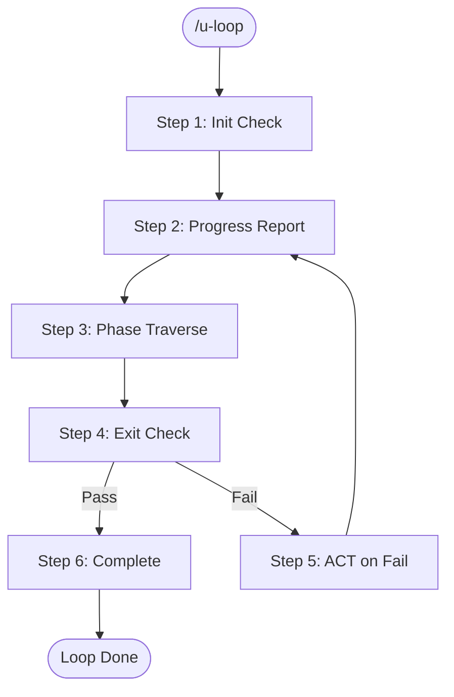

# Iteration Rules

> u-ssot의 Iteration 반복 시스템과 `/u-loop` 관련 규칙을 정의한다.

---

## 1. `/u-loop` Behavior

`/u-loop` 커맨드는 PDCA 사이클을 종료 조건 충족까지 자동 반복한다.

### 6-Step Loop Process



| Step | Name | Description |
|------|------|-------------|
| 1 | **Init Check** | 현재 프로젝트 상태 확인. `u-docs/` 구조 검증, `1_Index_PM.md` 로드, 현재 Phase/Iteration 파악 |
| 2 | **Progress Report** | 현재 Iteration 진행률 배너 출력 (Phase, 완료율, 백로그 수, 결함 수) |
| 3 | **Phase Traverse** | 현재 Phase부터 순서대로 실행: PLAN → DESIGN → DO → CHECK. 각 Phase 완료 시 Gate 검증 |
| 4 | **Exit Check** | 4가지 종료 조건 판정. 모두 충족 시 Step 6, 미충족 시 Step 5 |
| 5 | **ACT on Fail** | ACT Phase 실행 (백로그 정리, 아카이브, 회고). 다음 Iteration 번호 증가 후 Step 2로 복귀 |
| 6 | **Complete** | 최종 완료. 완료 배너 출력, 전체 Iteration 요약 |

---

## 2. `/u-loop-from [phase]` Behavior

특정 Phase부터 루프를 시작한다.

```
/u-loop-from design   # DESIGN Phase부터 시작
/u-loop-from check    # CHECK Phase부터 시작
```

| Phase Argument | Starting Point | Skipped Phases |
|---------------|----------------|----------------|
| `plan` | PLAN Phase | None (전체 실행) |
| `design` | DESIGN Phase | PLAN |
| `dev` / `do` | DO Phase | PLAN, DESIGN |
| `check` | CHECK Phase | PLAN, DESIGN, DO |
| `act` | ACT Phase | PLAN, DESIGN, DO, CHECK |

**주의사항:**
- 시작 Phase의 선행 문서가 Final 상태인지 자동 검증
- 선행 문서가 Final이 아닌 경우 경고 출력 후 사용자 확인 요청
- Iteration 2+ 에서만 유효 (Iteration 1은 반드시 PLAN부터)

---

## 3. `/u-stop` Behavior

실행 중인 루프를 즉시 중단한다.

```
/u-stop
```

동작:
1. 현재 Phase 작업을 안전하게 중단 (진행 중인 문서는 Draft 상태로 저장)
2. 루프 상태를 `PAUSED`로 변경
3. 현재 상태 저장: Phase, Iteration, 진행률
4. 중단 배너 출력

```
+--------------------------------------------------+
| LOOP PAUSED                                       |
| Iteration: 2 | Phase: DO | Progress: 45%         |
| Resume: /u-resume | Status: /u-status             |
+--------------------------------------------------+
```

---

## 4. `/u-resume` Behavior

중단된 루프를 재개한다.

```
/u-resume
```

동작:
1. 저장된 상태 로드 (Phase, Iteration, 진행률)
2. 루프 상태를 `RUNNING`으로 변경
3. 중단된 Phase부터 루프 재개
4. 재개 배너 출력

```
+--------------------------------------------------+
| LOOP RESUMED                                      |
| Iteration: 2 | Phase: DO | Progress: 45%         |
| Continuing from where you left off...             |
+--------------------------------------------------+
```

---

## 5. Exit Criteria

### Pseudocode

```python
def check_exit_criteria():
    # Condition 1: All backlog items Done
    backlog = parse_backlog("u-docs/shared/05-act/5_Backlog_RA.md")
    active_items = [item for item in backlog
                    if item.status not in ("Done", "Cancelled", "Deferred")]
    cond_1 = len(active_items) == 0

    # Condition 2: No Critical/Major defects
    report = parse_report("u-docs/{app}/04-check/4_Report_QA.md")
    critical_major = [d for d in report.defects
                      if d.severity in ("Critical", "Major")]
    cond_2 = len(critical_major) == 0

    # Condition 3: All FR implemented
    srs = parse_srs("u-docs/{app}/01-plan/1_SRS_RA.md")
    unimplemented = [fr for fr in srs.features
                     if not fr.implemented]
    cond_3 = len(unimplemented) == 0

    # Condition 4: Build success
    cond_4 = run_command("bun run build").returncode == 0

    return ExitResult(
        passed=all([cond_1, cond_2, cond_3, cond_4]),
        details={
            "backlog_active": len(active_items),
            "critical_major_defects": len(critical_major),
            "unimplemented_fr": len(unimplemented),
            "build_success": cond_4,
        }
    )
```

### Exit Report Format

```
+--------------------------------------------------+
| EXIT CRITERIA CHECK                               |
|--------------------------------------------------|
| [PASS] Backlog items: 0 open                     |
| [PASS] Critical/Major defects: 0                 |
| [FAIL] FR implementation: 2 remaining            |
| [PASS] Build: SUCCESS                            |
|--------------------------------------------------|
| Result: FAIL - Continuing to ACT Phase           |
+--------------------------------------------------+
```

---

## 6. Backlog Item Structure

`5_Backlog_RA.md` 내 백로그 항목의 표준 구조:

| Field | Description | Example |
|-------|-------------|---------|
| `BL-ID` | 백로그 고유 ID | BL-001, BL-002 |
| `Type` | 항목 유형 | Bug, Enhancement, Task |
| `Origin` | 발생 출처 | CHECK (QA 발견), DESIGN (설계 누락), DEV (구현 이슈), PLAN (요구사항 변경/추가) |
| `Description` | 항목 설명 | "로그인 API 에러 핸들링 누락" |
| `Priority` | 우선순위 | Critical, Major, Minor, Trivial |
| `Status` | 처리 상태 | Open, InProgress, Blocked, Done, Deferred, Cancelled |
| `Related DEF` | 연관 결함 ID (CHECK origin만 해당) | DEF-001, - |
| `Iteration` | 등록된 Iteration | Iter 1, Iter 2 |
| `Assignee` | 담당 에이전트 | u-dv-fe, u-dv-be, u-ra 등 |

<details><summary>JSON Format (Backlog Item)</summary>

```json
{
  "blId": "BL-001",
  "type": "Bug",
  "origin": "CHECK",
  "description": "로그인 API 500 에러",
  "priority": "Critical",
  "status": "Open",
  "relatedDef": "DEF-001",
  "iteration": "Iter 1",
  "assignee": "u-dv-be"
}
```

</details>

### Backlog Table Format

```markdown
| BL-ID | Type | Origin | Description | Priority | Status | Related DEF | Iteration | Assignee |
|-------|------|--------|-------------|----------|--------|-------------|-----------|----------|
| BL-001 | Bug | CHECK | 로그인 API 500 에러 | Critical | Open | DEF-001 | Iter 1 | u-dv-be |
| BL-002 | Enhancement | DESIGN | 비밀번호 규칙 강화 | Minor | Open | - | Iter 1 | u-sa |
| BL-003 | Task | DEV | 에러 바운더리 추가 | Major | Open | - | Iter 1 | u-dv-fe |
```

---

## 7. Progress Banner Formats

### Iteration Start Banner

```
+==================================================+
| ITERATION 2 STARTED                               |
|--------------------------------------------------|
| Previous: Iter 1 (FAIL - 3 open backlog items)   |
| Focus: BL-001 (Critical), BL-003 (Major)         |
| Target Phase: PLAN → CHECK                        |
+==================================================+
```

### Phase Progress Banner

```
+--------------------------------------------------+
| PHASE: DESIGN | Iteration: 2                      |
|--------------------------------------------------|
| [DONE] u-UX: Screen Design (2_Screen_UX.md)       |
| [WORK] u-SA: ERD (2_ERD_SA.md)                    |
| [WAIT] u-SA: API Contract (2_API_SA.md)           |
| [WAIT] u-RA: Validation                           |
|--------------------------------------------------|
| Progress: 25% | Backlog: 3 open                  |
+--------------------------------------------------+
```

### Loop Complete Banner

```
+==================================================+
| LOOP COMPLETE                                     |
|--------------------------------------------------|
| Total Iterations: 3                               |
| Final Status: ALL PASS                            |
| Documents: 17 Final                               |
| Build: SUCCESS                                    |
| Defects Resolved: 5/5                             |
+==================================================+
```

---

## 8. Iteration Rules Summary

| # | Rule | Description |
|---|------|-------------|
| 1 | 자동 반복 | CHECK Gate 실패 시 자동으로 ACT → 다음 PLAN 전환 |
| 2 | 증분 작업 | Iteration 2+ 에서는 Backlog Open 항목만 대상으로 변경분만 갱신 |
| 3 | 최대 반복 | 기본 10회 제한 (`maxIterations` 설정으로 변경 가능) |
| 4 | 중단/재개 | `/u-stop`으로 루프 중단, `/u-resume`으로 재개 |
| 5 | Final 유지 | 기존 Final 문서는 유지, 해당 항목만 PATCH 업데이트 |
| 6 | 아카이브 | 매 Iteration 완료 시 `u-docs/iterations/iter-N/`에 스냅샷 보관 |

---

## 9. Iteration Carry-Over Policy

Iteration 종료 시 백로그 항목의 상태에 따라 다음과 같이 처리한다.

| Status at Iter End | Action | Details |
|-------------------|--------|---------|
| Done | Archive | 활성 백로그에서 제거, IterationLog에 완료 기록 |
| Cancelled | Purge | 제거, 취소 사유 기록 |
| Open / Blocked / Deferred | Carry-Over | Iteration 필드를 N+1로 갱신, 상태 유지 |
| InProgress | Carry-Over + Reset | Iteration 필드를 N+1로 갱신, Status를 Open으로 리셋 |

<details><summary>JSON Format (Carry-Over Policy)</summary>

```json
{
  "carryOverPolicy": {
    "rules": [
      { "statusAtEnd": "Done", "action": "Archive", "details": "활성 백로그에서 제거, IterationLog 기록" },
      { "statusAtEnd": "Cancelled", "action": "Purge", "details": "제거, 취소 사유 기록" },
      { "statusAtEnd": ["Open", "Blocked", "Deferred"], "action": "Carry-Over", "details": "Iteration N+1로 갱신, 상태 유지" },
      { "statusAtEnd": "InProgress", "action": "Carry-Over+Reset", "details": "Iteration N+1로 갱신, Status→Open 리셋" }
    ]
  }
}
```

</details>

### Maximum Carry-Over Rule

| Carry-Over Count | Action |
|-----------------|--------|
| 3회 연속 이월 | Priority 1단계 자동 상승 (예: Minor → Major) |
| 5회 연속 이월 | 사용자 경고 출력 + 처리 방안 결정 요청 (재평가/취소/분할) |

<details><summary>JSON Format (Maximum Carry-Over)</summary>

```json
{
  "maxCarryOver": [
    { "count": 3, "action": "priorityEscalation", "detail": "Priority 1단계 자동 상승" },
    { "count": 5, "action": "userWarning", "detail": "사용자 경고 + 처리 방안 결정 요청" }
  ]
}
```

</details>

---

## 10. Priority Re-Evaluation Rules

### Triggers

| Rule ID | Trigger | Action |
|---------|---------|--------|
| RE-01 | Iteration 이월 | 이월 횟수 기반 자동 상승 (3회: +1단계) |
| RE-02 | 연관 DEF 추가 발견 | 동일 FR에 DEF 2개 이상 → Major 이상으로 상승 |
| RE-03 | Blocker 발생 | Blocked 상태 BL이 차단하는 항목 중 최고 Priority로 상승 |
| RE-04 | 요구사항 변경 | 연관 FR의 Priority 변경에 맞춤 조정 |
| RE-05 | 사용자 수동 요청 | 사용자 지정 Priority로 변경 |

### De-escalation Rules

- **권한**: u-ra만 Priority 하향 가능
- **사유 기록**: 하향 시 반드시 사유를 Change Log에 기록
- **Critical → Major 이하**: 사용자 확인 필요 (자동 하향 불가)

<details><summary>JSON Format (Priority Re-Evaluation)</summary>

```json
{
  "reEvaluationRules": [
    { "ruleId": "RE-01", "trigger": "iterationCarryOver", "action": "autoEscalation", "detail": "3회 이월 시 Priority +1단계" },
    { "ruleId": "RE-02", "trigger": "additionalDefFound", "action": "escalateToMajor", "detail": "동일 FR에 DEF 2개+ → Major 이상" },
    { "ruleId": "RE-03", "trigger": "blockerOccurred", "action": "matchHighestPriority", "detail": "차단 항목 중 최고 Priority로 상승" },
    { "ruleId": "RE-04", "trigger": "requirementChange", "action": "alignWithFr", "detail": "연관 FR Priority에 맞춤" },
    { "ruleId": "RE-05", "trigger": "userManualRequest", "action": "setUserPriority", "detail": "사용자 지정 Priority로 변경" }
  ],
  "deEscalation": {
    "authority": "u-ra",
    "reasonRequired": true,
    "criticalToMajorRequiresUserConfirm": true
  }
}
```

</details>
