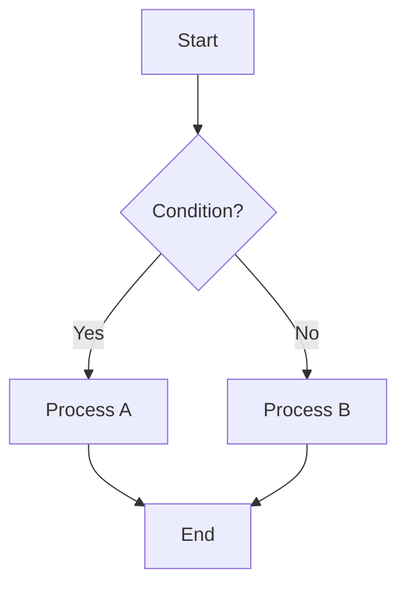
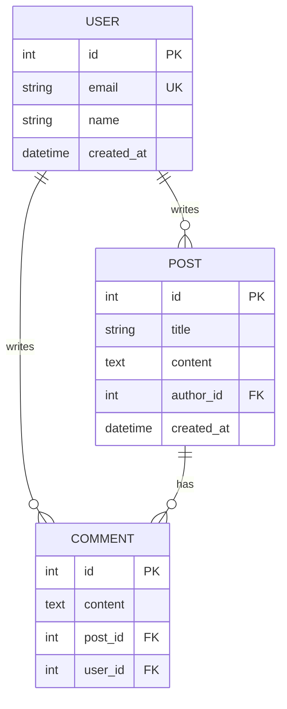
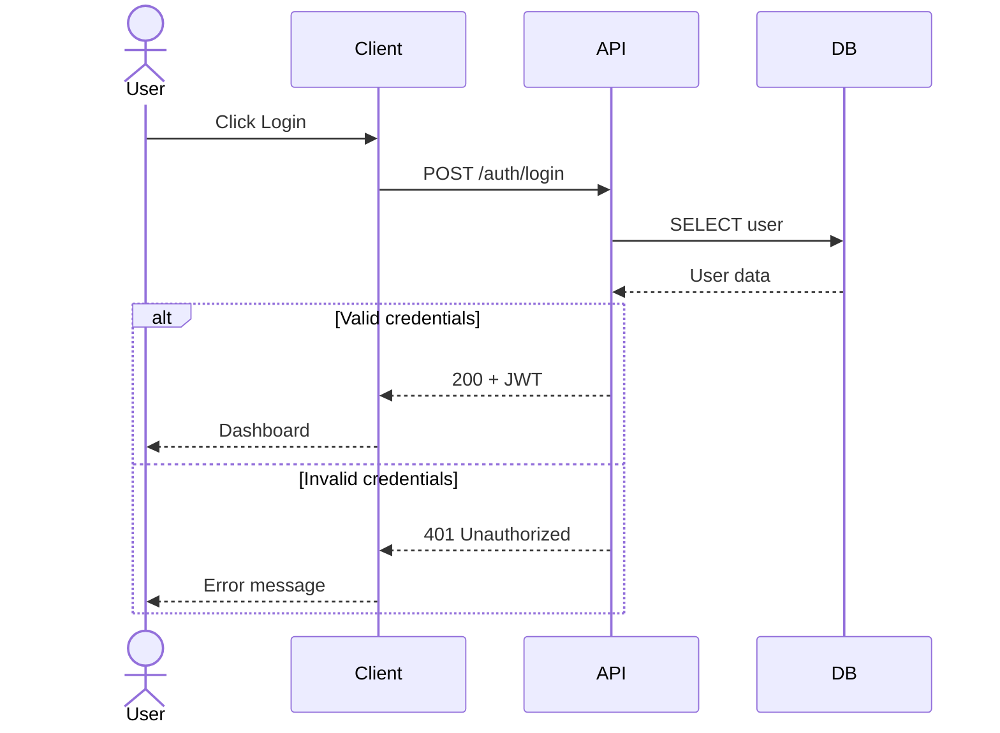
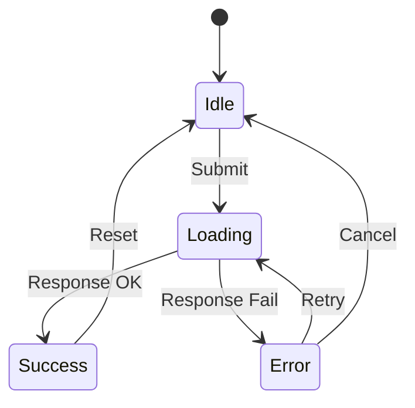
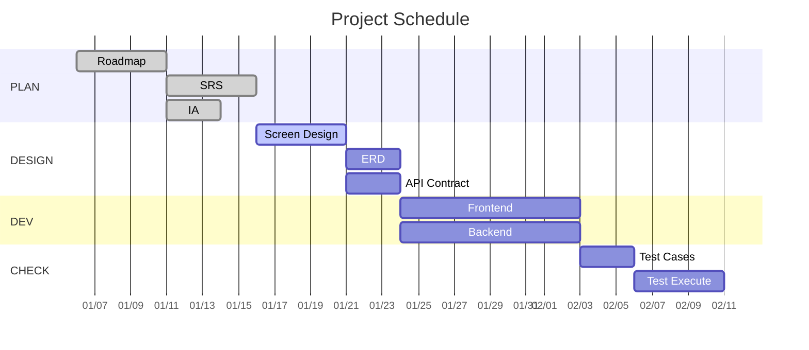
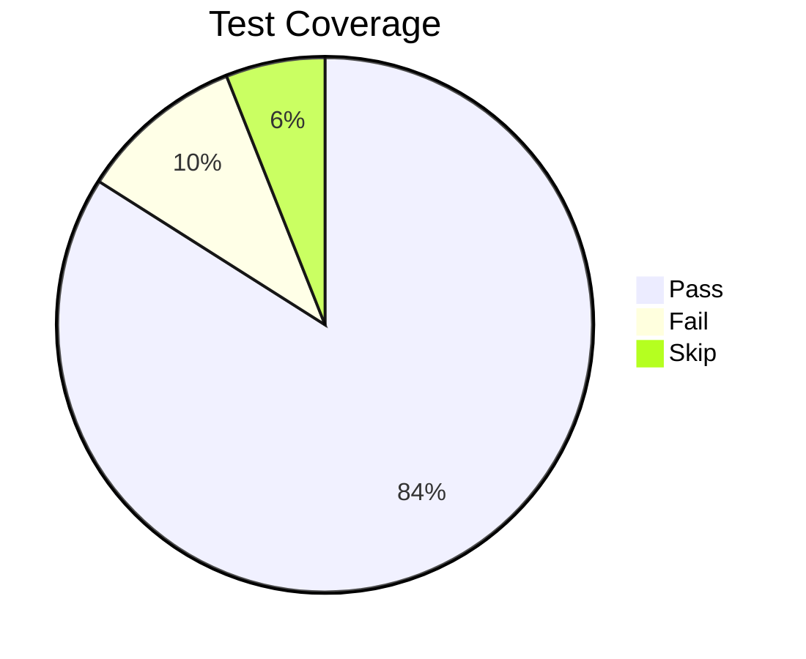
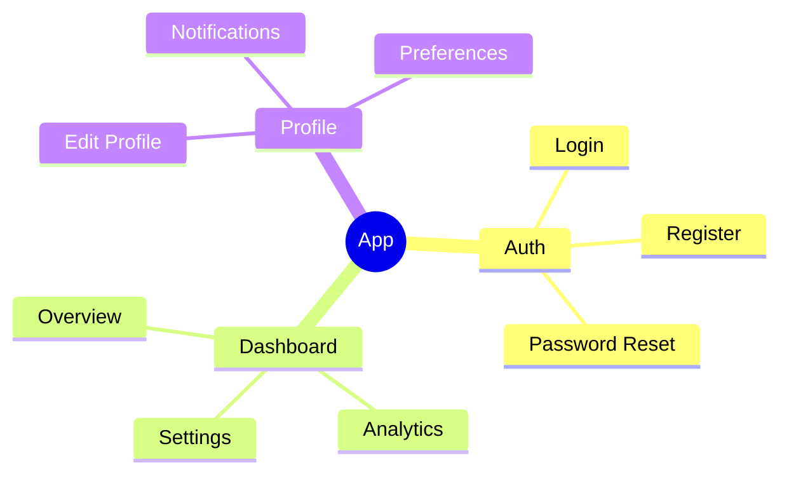
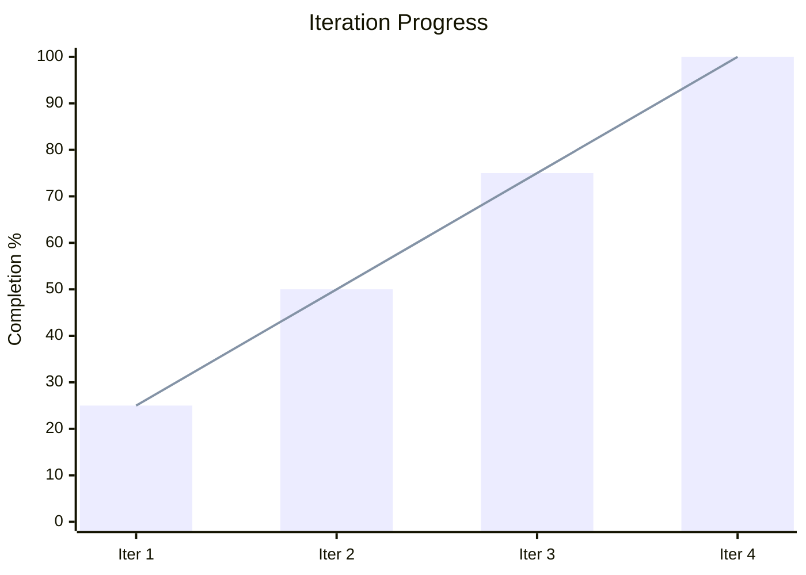
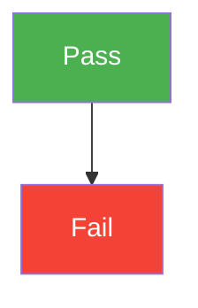

# Mermaid Diagram Guide

> u-ssot에서 사용하는 Mermaid 다이어그램 유형별 작성 가이드.
> 모든 SSoT 문서는 해당 Phase에 맞는 다이어그램을 포함해야 한다.

---

## 1. When to Use Each Diagram Type

| Diagram Type | Use Case | Phase | Example Document |
|-------------|----------|-------|-----------------|
| `flowchart TD` | 로직 흐름, 의사결정 분기 | DEV | `3DV_Code.md` |
| `erDiagram` | 데이터 모델, Entity 관계 | DESIGN | `2A_ERD.md` |
| `sequenceDiagram` | API 인터랙션, 메시지 흐름 | DESIGN | `2A_API.md` |
| `stateDiagram-v2` | 상태 전이, UI 상태 변화 | DESIGN | `2CX_Screen.md` |
| `gantt` | 프로젝트 일정, 마일스톤 | PLAN | `1PM_Roadmap.md` |
| `pie` | 비율 통계, 커버리지 | CHECK | `4QA_Report.md` |
| `mindmap` | 계층 구조, 정보 구조 | PLAN | `1CX_IA.md` |
| `xychart-beta` | 추이 분석, Iteration 진행률 | ACT | `5ACT_Iteration_Log.md` |

---

## 2. Syntax & Examples

### 2.1 flowchart TD (Top-Down Flow)

로직 흐름과 의사결정 분기를 표현한다.

**Node shapes:**
- `[text]` — 사각형 (프로세스)
- `{text}` — 다이아몬드 (분기/조건)
- `([text])` — 라운드 사각형 (시작/종료)
- `[(text)]` — 실린더 (데이터베이스)
- `((text))` — 원형 (이벤트)

**Direction options:**
- `TD` / `TB` — 위에서 아래
- `LR` — 왼쪽에서 오른쪽
- `RL` — 오른쪽에서 왼쪽
- `BT` — 아래에서 위

### 2.2 erDiagram (Entity Relationship)

데이터 모델과 Entity 간 관계를 표현한다.

**Relationship notations:**
- `||--||` — 1:1
- `||--o{` — 1:N
- `o{--o{` — M:N
- `||--o|` — 1:0..1

**Attribute markers:**
- `PK` — Primary Key
- `FK` — Foreign Key
- `UK` — Unique Key

### 2.3 sequenceDiagram (Sequence)

API 호출과 메시지 흐름을 표현한다.

**Arrow types:**
- `->>` — 동기 호출 (실선)
- `-->>` — 응답 (점선)
- `--)` — 비동기 메시지

**Keywords:**
- `participant` — 참여자
- `actor` — 사용자 (인물 아이콘)
- `alt` / `else` — 조건 분기
- `loop` — 반복
- `opt` — 선택적 흐름
- `Note over` — 참고 노트

### 2.4 stateDiagram-v2 (State Machine)

상태 전이와 UI 상태 변화를 표현한다.

**Keywords:**
- `[*]` — 시작/종료 상태
- `-->` — 전이 (transition)
- `:` 뒤에 트리거/이벤트 명시
- `state` — 중첩 상태 정의

### 2.5 gantt (Gantt Chart)

프로젝트 일정과 마일스톤을 표현한다.

**Task status:**
- `done` — 완료
- `active` — 진행 중
- `crit` — Critical path
- (없음) — 예정

### 2.6 pie (Pie Chart)

비율 통계와 커버리지를 표현한다.

### 2.7 mindmap (Mind Map)

계층 구조와 정보 구조를 표현한다.

### 2.8 xychart-beta (XY Chart)

추이 분석과 Iteration별 진행률을 표현한다.

---

## 3. Naming Conventions

### Node ID Naming

| Context | Convention | Example |
|---------|-----------|---------|
| Entity | `UPPER_SNAKE_CASE` | `USER`, `LINE_ITEM` |
| Process | `PascalCase` 또는 설명적 | `ValidateInput`, `SendEmail` |
| State | `PascalCase` | `Idle`, `Loading`, `Error` |
| Participant | `PascalCase` | `Client`, `API`, `DB` |
| Phase/Section | `UPPER_CASE` | `PLAN`, `DESIGN`, `CHECK` |

### Diagram Title Naming

| Phase | Title Convention | Example |
|-------|-----------------|---------|
| PLAN | `{Project} Roadmap` | `"MyApp Roadmap"` |
| DESIGN | `{Entity/Screen} {Type}` | `"User Entity Relationship"` |
| DEV | `{Feature} Flow` | `"Authentication Flow"` |
| CHECK | `{Test} Results` | `"API Test Results"` |
| ACT | `Iteration {N} {Metric}` | `"Iteration Progress"` |

### Color & Style

- Mermaid 기본 테마를 사용한다 (커스텀 테마 불필요)
- 필요시 `classDef`로 상태별 색상을 지정할 수 있다:

---

## 4. Best Practices

1. **한 다이어그램에 너무 많은 노드를 넣지 않는다** — 최대 15~20개 노드 권장
2. **방향을 일관되게 유지한다** — 같은 문서 내 flowchart는 동일 방향 사용
3. **한글과 영문을 혼용할 수 있다** — 노드 내 텍스트는 한글 가능
4. **ERD의 속성은 핵심 필드만 표시한다** — 전체 스키마는 별도 문서 참조
5. **sequenceDiagram에는 에러 케이스(alt)를 포함한다**
6. **gantt에는 반드시 section으로 Phase를 구분한다**
7. **다이어그램 앞에 간단한 설명 문장을 작성한다**
