# Mermaid Diagram Guide

> u-ssot에서 사용하는 Mermaid 다이어그램 유형별 작성 가이드.
> 모든 SSoT 문서는 해당 Phase에 맞는 다이어그램을 포함해야 한다.

---

## 1. When to Use Each Diagram Type

| Diagram Type | Use Case | Phase | Example Document |
|-------------|----------|-------|-----------------|
| `flowchart TD` | 로직 흐름, 의사결정 분기, **메뉴 트리** | DEV / PLAN | `3_Code_DV.md`, `1_IA_RA.md` |
| `erDiagram` | 데이터 모델, Entity 관계 | DESIGN | `2_ERD_SA.md` |
| `sequenceDiagram` | API 인터랙션, 메시지 흐름 | DESIGN | `2_API_SA.md` |
| `stateDiagram-v2` | 상태 전이, UI 상태 변화 | DESIGN | `2_Screen_UX.md` |
| `gantt` | 프로젝트 일정, 마일스톤 | PLAN | `1_Roadmap_PM.md` |
| `pie` | 비율 통계, 커버리지, 우선순위 분포 | CHECK / PLAN | `4_Report_QA.md`, `1_SRS_RA.md` |
| `mindmap` | 일반 계층 시각화 (IA 메뉴 트리에는 사용하지 않음) | - | - |
| `xychart-beta` | 추이 분석, Iteration 진행률 | ACT | `5_IterationLog_RA.md` |
| `journey` | 사용자 여정, 감정/만족도 흐름 | PLAN | `1_Roadmap_PM.md`, `1_IA_RA.md` |
| `classDiagram` | 도메인 모델, 클래스 구조, 타입 관계 | DESIGN / DO | `2_ERD_SA.md`, `3_Code_DV.md` |
| `timeline` | 마일스톤 타임라인, 이력 표현 | PLAN | `1_Roadmap_PM.md` |
| `C4Context` | 시스템 컨텍스트, 외부 의존성 | DESIGN | `2_API_SA.md` |
| `zenuml` | 복잡한 조건 분기 시퀀스 | DESIGN | `2_API_SA.md` |

---

## 2. Syntax & Examples

### 2.1 flowchart TD (Top-Down Flow)

로직 흐름과 의사결정 분기를 표현한다.

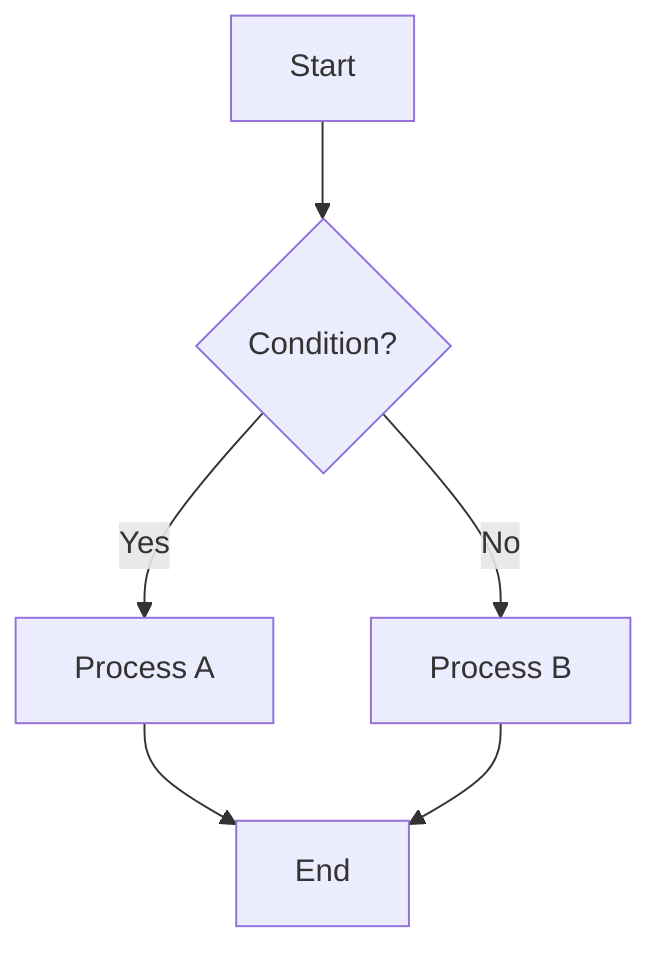

**Node shapes:**
- `[text]` — 사각형 (프로세스)
- `{text}` — 다이아몬드 (분기/조건)
- `([text])` — 라운드 사각형 (시작/종료)
- `[(text)]` — 실린더 (데이터베이스)
- `((text))` — 원형 (이벤트)

**Direction options:**
- `TD` / `TB` — 위에서 아래
- `LR` — 왼쪽에서 오른쪽
- `RL` — 오른쪽에서 왼쪽
- `BT` — 아래에서 위

### 2.2 erDiagram (Entity Relationship)

데이터 모델과 Entity 간 관계를 표현한다.

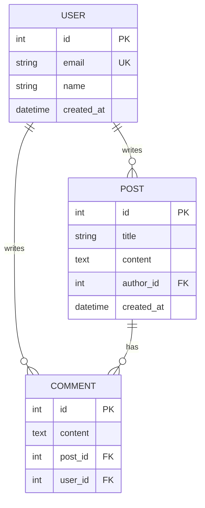

**Relationship notations:**
- `||--||` — 1:1
- `||--o{` — 1:N
- `o{--o{` — M:N
- `||--o|` — 1:0..1

**Attribute markers:**
- `PK` — Primary Key
- `FK` — Foreign Key
- `UK` — Unique Key

### 2.3 sequenceDiagram (Sequence)

API 호출과 메시지 흐름을 표현한다.

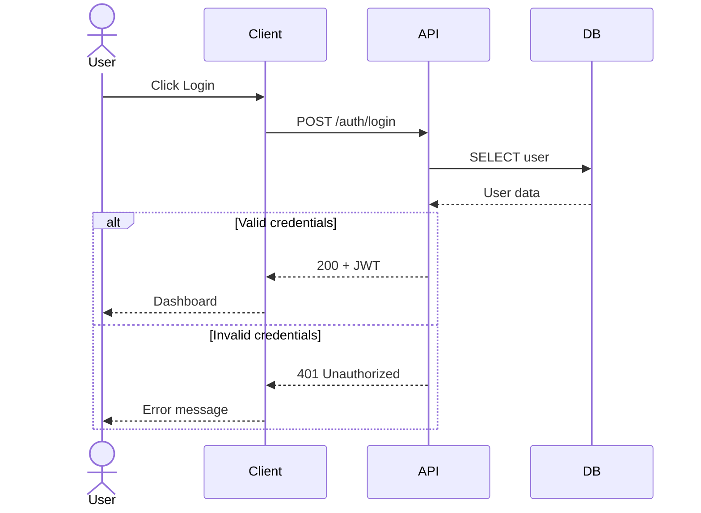

**Arrow types:**
- `->>` — 동기 호출 (실선)
- `-->>` — 응답 (점선)
- `--)` — 비동기 메시지

**Keywords:**
- `participant` — 참여자
- `actor` — 사용자 (인물 아이콘)
- `alt` / `else` — 조건 분기
- `loop` — 반복
- `opt` — 선택적 흐름
- `Note over` — 참고 노트

### 2.4 stateDiagram-v2 (State Machine)

상태 전이와 UI 상태 변화를 표현한다.

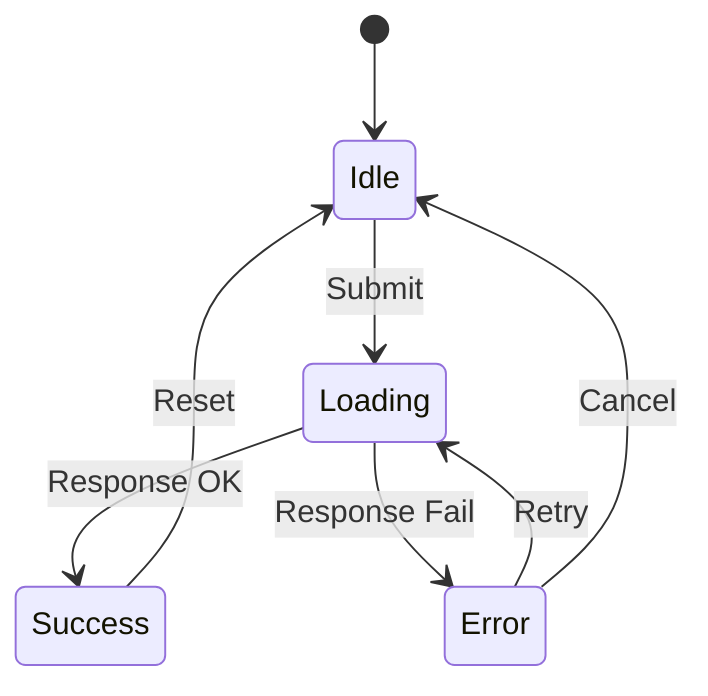

**Keywords:**
- `[*]` — 시작/종료 상태
- `-->` — 전이 (transition)
- `:` 뒤에 트리거/이벤트 명시
- `state` — 중첩 상태 정의

### 2.5 gantt (Gantt Chart)

프로젝트 일정과 마일스톤을 표현한다.

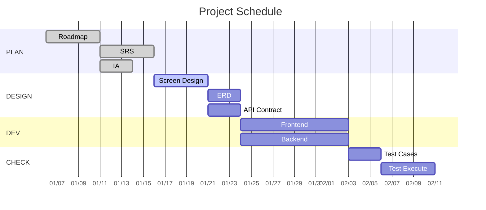

**Task status:**
- `done` — 완료
- `active` — 진행 중
- `crit` — Critical path
- (없음) — 예정

### 2.6 pie (Pie Chart)

비율 통계와 커버리지를 표현한다.

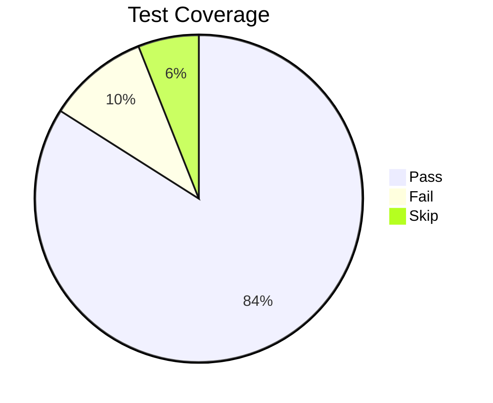

### 2.7 mindmap (Mind Map)

계층 구조와 정보 구조를 표현한다.

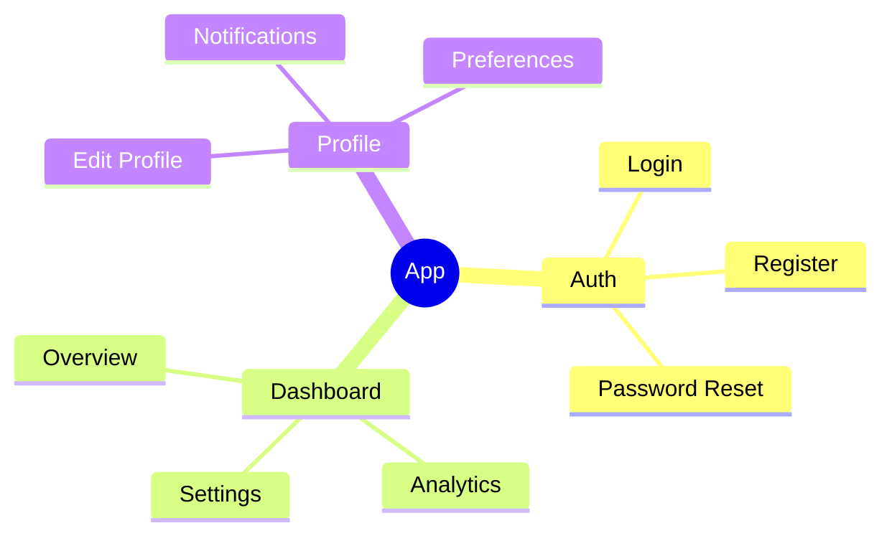

### 2.8 xychart-beta (XY Chart)

추이 분석과 Iteration별 진행률을 표현한다.

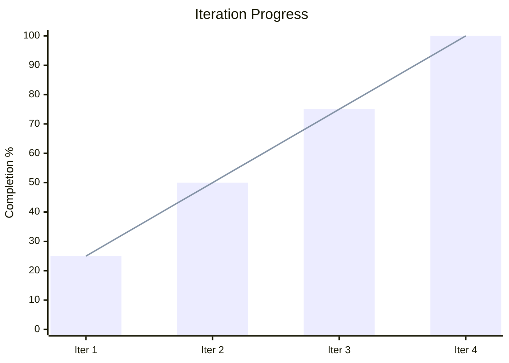

### 2.9 journey (User Journey)

사용자의 경험 단계별 감정/만족도를 표현한다. 사용자 시나리오 시각화에 사용한다.

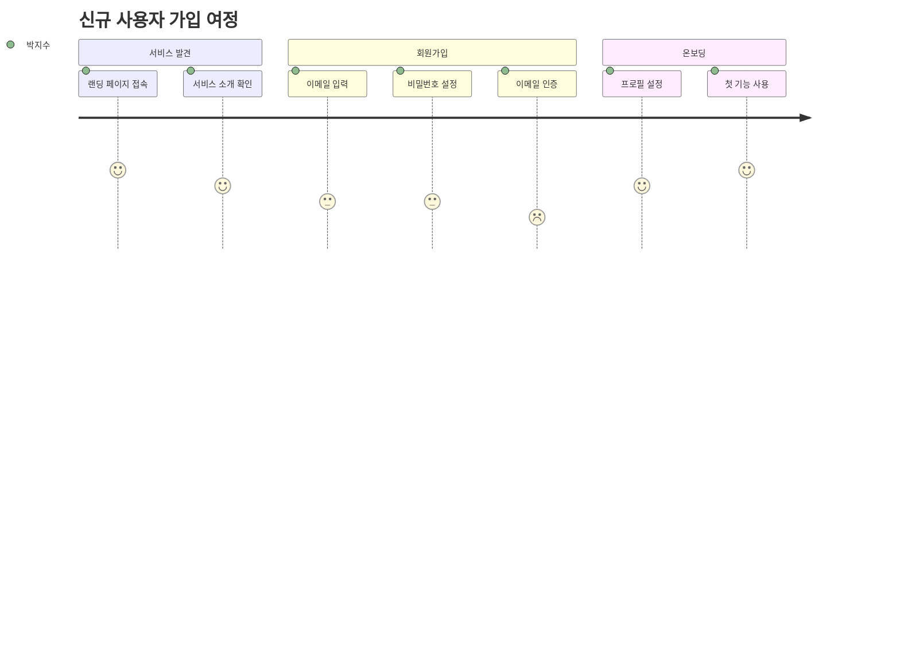

**Keywords:**
- `journey` — 다이어그램 선언
- `title` — 여정 제목
- `section` — 여정의 큰 단계 (Phase 구분)
- `[단계명]: [만족도 1-5]: [페르소나]` — 각 단계 (만족도 높을수록 긍정적)
- 복수 페르소나: `단계: 4: 박지수, 시스템`

---

### 2.10 classDiagram (Class Diagram)

도메인 모델과 클래스 구조, 타입 관계를 표현한다.

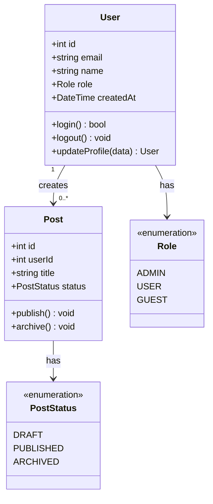

**Node shapes:**
- `class Name { }` — 클래스 정의
- `+field` — public 속성, `-field` — private 속성
- `+method()` — 메서드
- `<<enumeration>>` — 열거형, `<<interface>>` — 인터페이스, `<<abstract>>` — 추상 클래스

**Relationships:**
- `-->` — 연관 (Association)
- `<|--` — 상속 (Inheritance)
- `*--` — 합성 (Composition)
- `o--` — 집합 (Aggregation)
- `..>` — 의존 (Dependency)
- `"1" --> "0..*"` — 다중성(Multiplicity) 표기

---

### 2.11 timeline (Timeline)

프로젝트 마일스톤과 이벤트 타임라인을 표현한다.

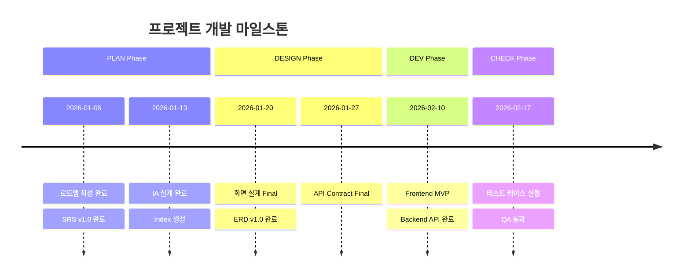

**Keywords:**
- `timeline` — 다이어그램 선언
- `title` — 타임라인 제목
- `section` — 큰 단계/Phase 구분
- `날짜 : 이벤트` — 타임라인 항목
- 같은 날짜 여러 이벤트: 이어서 `           : 이벤트` (앞에 공백)

---

### 2.12 C4Context (C4 Context Diagram)

시스템과 외부 요소의 관계(시스템 컨텍스트)를 표현한다. API Contract 최상단에 1개 포함한다.

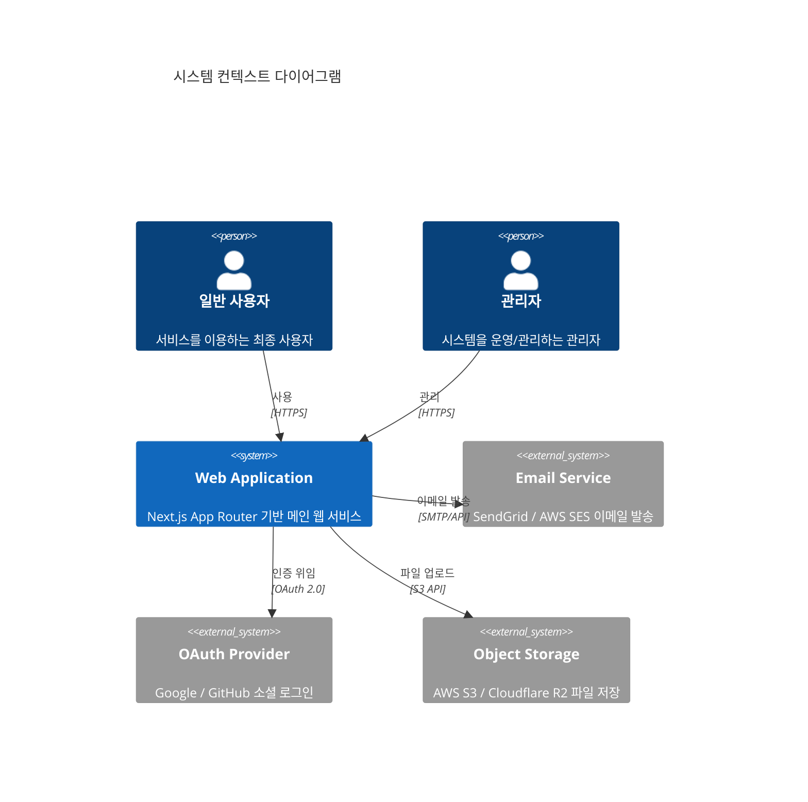

**Elements:**
- `Person(alias, "label", "description")` — 사람/역할
- `System(alias, "label", "description")` — 내부 시스템
- `System_Ext(alias, "label", "description")` — 외부 시스템/서비스
- `Rel(from, to, "label", "technology")` — 관계

---

### 2.13 zenuml (ZenUML Sequence)

ZenUML 문법으로 복잡한 조건 분기 시퀀스 다이어그램을 표현한다. 3단계 이상 중첩 조건이 있는 플로우에 적합하다.

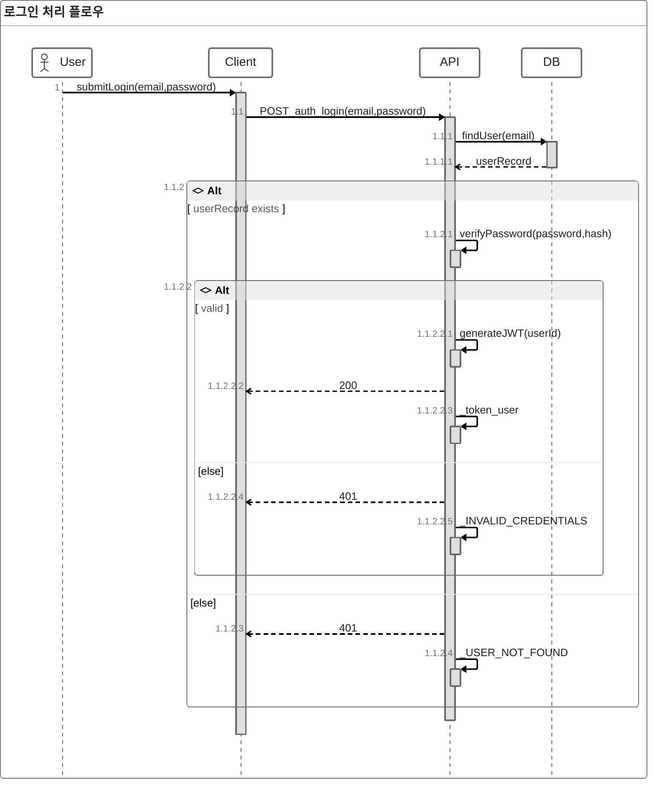

**Syntax:**
- `@Actor`, `@Client`, `@API`, `@DB` 등 — 참여자 선언
- `A -> B.method(params) { }` — 메서드 호출 + 중첩 흐름
- `if (condition) { }` / `else { }` — 조건 분기
- `return value` — 반환값
- `// comment` — 주석

---

## 3. Naming Conventions

### Node ID Naming

| Context | Convention | Example |
|---------|-----------|---------|
| Entity | `UPPER_SNAKE_CASE` | `USER`, `LINE_ITEM` |
| Process | `PascalCase` 또는 설명적 | `ValidateInput`, `SendEmail` |
| State | `PascalCase` | `Idle`, `Loading`, `Error` |
| Participant | `PascalCase` | `Client`, `API`, `DB` |
| Phase/Section | `UPPER_CASE` | `PLAN`, `DESIGN`, `CHECK` |

### Diagram Title Naming

| Phase | Title Convention | Example |
|-------|-----------------|---------|
| PLAN | `{Project} Roadmap` | `"MyApp Roadmap"` |
| DESIGN | `{Entity/Screen} {Type}` | `"User Entity Relationship"` |
| DEV | `{Feature} Flow` | `"Authentication Flow"` |
| CHECK | `{Test} Results` | `"API Test Results"` |
| ACT | `Iteration {N} {Metric}` | `"Iteration Progress"` |

### Color & Style

- Mermaid 기본 테마를 사용한다 (커스텀 테마 불필요)
- 필요시 `classDef`로 상태별 색상을 지정할 수 있다:

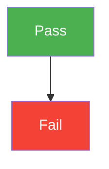

---

## 4. Syntax Pitfalls (필수 준수)

### 4.1 노드 라벨에 `/` 직접 사용 금지

Mermaid는 `[/text/]`를 trapezoid(사다리꼴) 노드로 해석한다. URL 경로를 노드 라벨에 넣으면 lexical error가 발생한다.

**금지 패턴 (Lexical Error 발생):**
```
HOME[/]
LOGIN[/login]
CONTENT[/content/list]
START[/u-loop 시작/]
```

**올바른 패턴 (권장: 경로 세그먼트 줄바꿈 스택):**
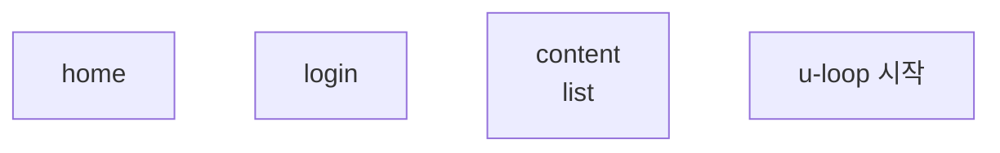

**규칙:**
- 노드 라벨에는 `/`를 직접 넣지 않는다
- 경로는 세그먼트 단위로 나눠 `<br/>`로 쌓아 표현한다 (예: `/services/protocol` → `"services<br/>protocol"`)
- 노드 라벨은 반드시 `["..."]` (큰따옴표 래핑) 사용
- trapezoid 노드 `[/text/]` 문법은 사용하지 않는다

### 4.2 특수문자 이스케이프

노드 라벨에 특수문자가 있으면 반드시 `["..."]`로 감싼다:

| 특수문자 | 금지 패턴 | 올바른 패턴 |
|----------|-----------|-------------|
| `/` | `A[/path]` | `A["path"]` 또는 `A["a<br/>b"]` |
| `(`, `)` | `A[func()]` | `A["func()"]` |
| `{`, `}` | `A[{obj}]` | `A["{obj}"]` |
| `>`, `<` | `A[a>b]` | `A["a>b"]` |
| `→` | `A{PLAN→DESIGN}` | `A{"PLAN to DESIGN"}` |

### 4.3 한글 라벨 안전 패턴

한글 텍스트는 기본적으로 `[한글]`로 사용 가능하지만, 특수문자와 함께 쓸 때는 `["..."]`를 사용한다:

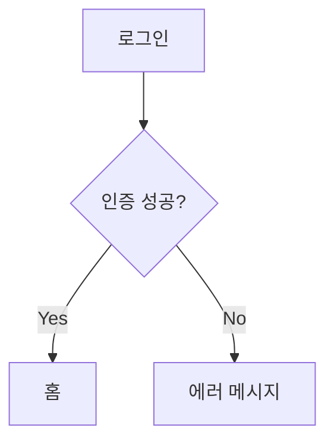

---

## 5. Best Practices

1. **한 다이어그램에 너무 많은 노드를 넣지 않는다** — 최대 15~20개 노드 권장
2. **방향을 일관되게 유지한다** — 같은 문서 내 flowchart는 동일 방향 사용
3. **한글과 영문을 혼용할 수 있다** — 노드 내 텍스트는 한글 가능
4. **ERD의 속성은 핵심 필드만 표시한다** — 전체 스키마는 별도 문서 참조
5. **sequenceDiagram에는 에러 케이스(alt)를 포함한다**
6. **gantt에는 반드시 section으로 Phase를 구분한다**
7. **다이어그램 앞에 간단한 설명 문장을 작성한다**
8. **노드 라벨에 `/` 또는 특수문자가 있으면 반드시 `["..."]`로 감싼다**
9. **journey에는 페르소나별 감정 흐름을 표현한다** — 만족도 1(낮음) ~ 5(높음) 명시, 페르소나 이름 한글 가능
10. **classDiagram은 도메인 핵심 엔티티만** — 모든 속성이 아닌 핵심 필드와 메서드만 표시 (최대 7-8개 속성)
11. **C4Context는 API Contract 최상단에 1개** — 시스템 전체 맥락 파악용, 내부 컴포넌트 상세는 포함하지 않음
12. **zenuml은 3단계 이상 중첩 조건이 있을 때** — 복잡한 auth/transaction 플로우에 sequenceDiagram 대신 사용
