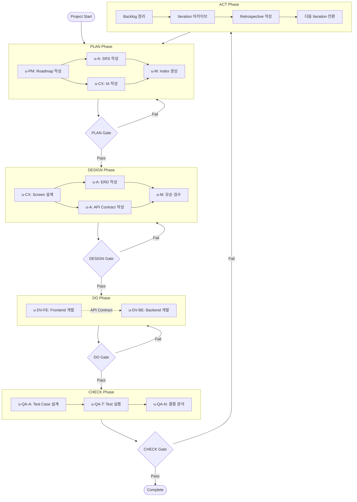
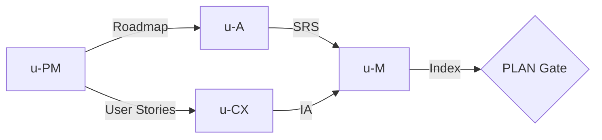
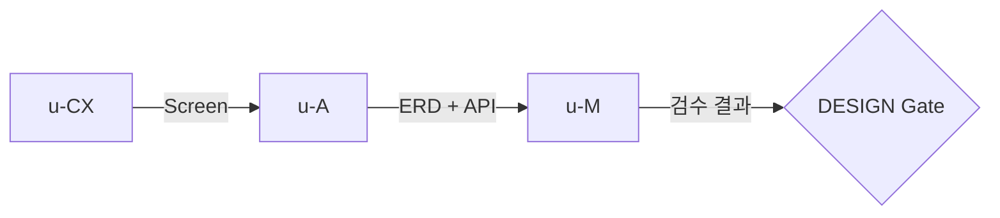
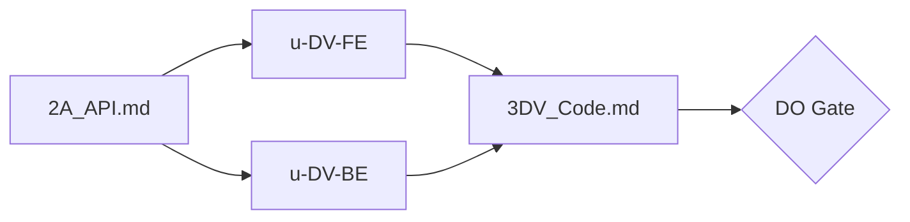
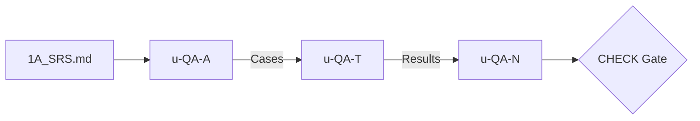
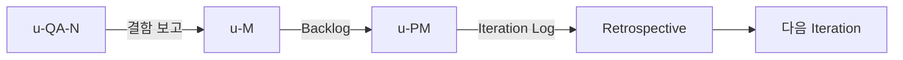

# PDCA Workflow

> u-ssot의 PDCA(Plan-Design-Do-Check-Act) 5-Phase 워크플로우를 정의한다.
> 모든 에이전트는 이 워크플로우를 기반으로 협업한다.

---

## 1. Main Workflow



---

## 2. Phase Details

### 2.1 PLAN Phase

**목적**: 프로젝트 범위와 요구사항을 정의한다.

| Step | Agent | Output | Description |
|------|-------|--------|-------------|
| 1 | u-PM | `1PM_Roadmap.md` | 로드맵, 마일스톤, 유저 스토리 작성 |
| 2 | u-A | `1A_SRS.md` | 기능/비기능 요구사항 명세 |
| 3 | u-CX | `1CX_IA.md` | 정보 구조도 (Information Architecture) |
| 4 | u-M | `1M_Index.md` | 문서 인덱스 생성, 상태 추적 시작 |



### 2.2 DESIGN Phase

**목적**: 화면 설계와 데이터/API 구조를 확정한다.

| Step | Agent | Output | Description |
|------|-------|--------|-------------|
| 1 | u-CX | `2CX_Screen.md` | 화면 상세 설계 (UI 컴포넌트, 상태 전이) |
| 2 | u-A | `2A_ERD.md` | Entity Relationship Diagram |
| 3 | u-A | `2A_API.md` | API Contract (OpenAPI 3.0) |
| 4 | u-M | 검수 결과 | 문서 간 모순 검수, 추적성 검증 |



### 2.3 DO Phase

**목적**: Contract 기반으로 Frontend/Backend를 병렬 개발한다.

| Step | Agent | Output | Description |
|------|-------|--------|-------------|
| 1 | u-DV-FE | Frontend Code | Next.js + react-query + Storybook |
| 2 | u-DV-BE | Backend Code | API Routes + Prisma/Drizzle |
| 3 | Both | `3DV_Code.md` | 구현 기록, 파일 매핑 |



### 2.4 CHECK Phase

**목적**: 테스트를 수행하고 결함을 분석한다.

| Step | Agent | Output | Description |
|------|-------|--------|-------------|
| 1 | u-QA-A | `4QA_Case.md` | 테스트 케이스 설계 |
| 2 | u-QA-T | `4QA_Report.md` | 테스트 실행 및 결과 기록 |
| 3 | u-QA-N | Defect Analysis | 결함 분류, 리포트, 수정 요청 |



### 2.5 ACT Phase

**목적**: 실패 항목을 정리하고 다음 Iteration을 준비한다.

| Step | Agent | Output | Description |
|------|-------|--------|-------------|
| 1 | u-M | `5ACT_Backlog.md` | 미해결 항목 정리 (Bug, Enhancement, Task) |
| 2 | u-M | `iterations/iter-N/` | 현재 Iteration 문서 아카이브 |
| 3 | u-PM | `5ACT_Iteration_Log.md` | Iteration 이력 기록 |
| 4 | Team | `5ACT_Retrospective.md` | 회고 (Good / Improve / Actions) |



---

## 3. Phase Transition Gate Conditions

| Transition | Gate Conditions | Validator |
|-----------|----------------|-----------|
| PLAN → DESIGN | `1PM_Roadmap.md` = Final, `1A_SRS.md` = Final, `1CX_IA.md` = Final | u-M |
| DESIGN → DO | `2A_ERD.md` = Final, `2A_API.md` = Final, `2CX_Screen.md` = Final + u-M 검수 통과 | u-M |
| DO → CHECK | 코드 구현 완료 + `bun run build` 성공 | u-M |
| CHECK → Complete | Critical/Major 결함 0건 + 백로그 Open 0건 + 전체 FR 구현 완료 | u-M + scripts |
| CHECK → ACT | 위 CHECK → Complete 조건 미충족 시 자동 전환 | Orchestrator |
| ACT → PLAN (Iter N+1) | `5ACT_Backlog.md` 정리 완료 + `5ACT_Retrospective.md` 작성 + 아카이브 완료 | u-M |

---

## 4. Iteration Rules

1. **자동 반복**: CHECK Gate 실패 시 자동으로 ACT Phase 진입, ACT 완료 후 다음 Iteration의 PLAN으로 전환
2. **증분 작업**: Iteration 2+ 에서는 `5ACT_Backlog.md`의 Open 항목만 대상으로 변경분만 갱신
3. **최대 반복**: 기본 10회 제한 (설정 변경 가능)
4. **중단/재개**: `/u-stop`으로 루프 중단, `/u-resume`으로 재개 가능
5. **Final 유지**: 기존 Final 문서는 유지하되, 해당 항목만 PATCH 업데이트
6. **아카이브**: 매 Iteration 완료 시 `u-docs/iterations/iter-N/`에 문서 스냅샷 보관

---

## 5. Exit Criteria

PDCA 사이클 종료를 위해 다음 4가지 조건을 **모두** 충족해야 한다:

```
EXIT =
  (backlog.filter(status != 'Done').length === 0) AND
  (defects.filter(severity in ['Critical', 'Major']).length === 0) AND
  (srs.features.every(fr => fr.implemented === true)) AND
  (buildResult === 'SUCCESS')
```

| # | Condition | Check Method |
|---|-----------|-------------|
| 1 | 백로그 전 항목 `Done` | `5ACT_Backlog.md` 파싱 |
| 2 | Critical/Major 결함 0건 | `4QA_Report.md` 파싱 |
| 3 | SRS의 모든 FR 구현 완료 | `1A_SRS.md` 구현 상태 확인 |
| 4 | 빌드 성공 | `bun run build` 실행 결과 |
