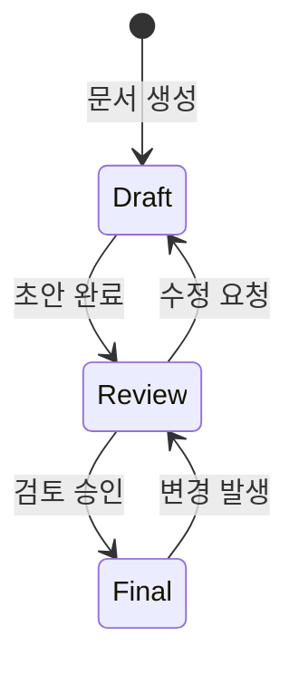
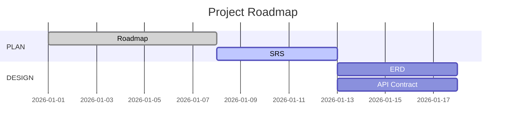
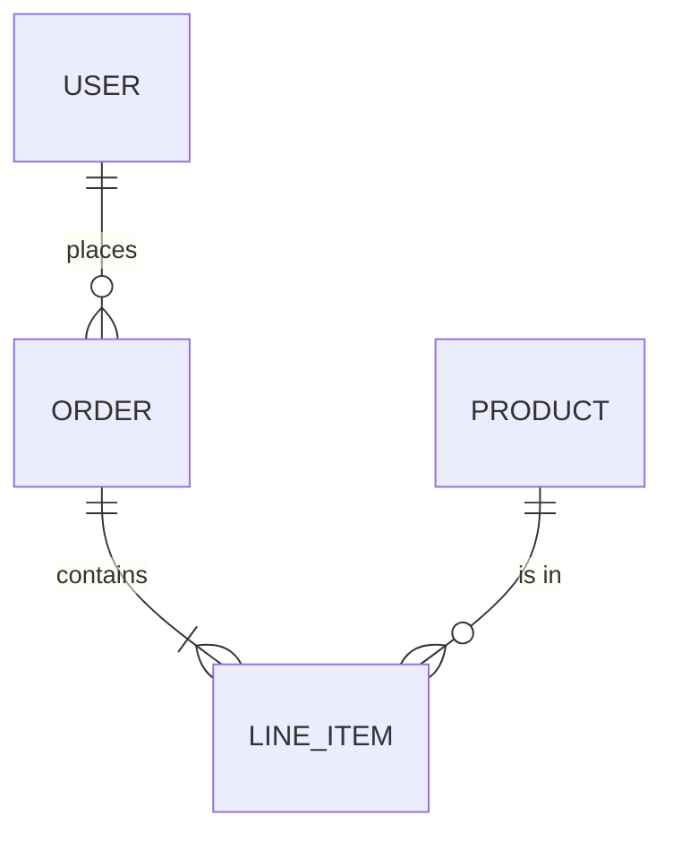
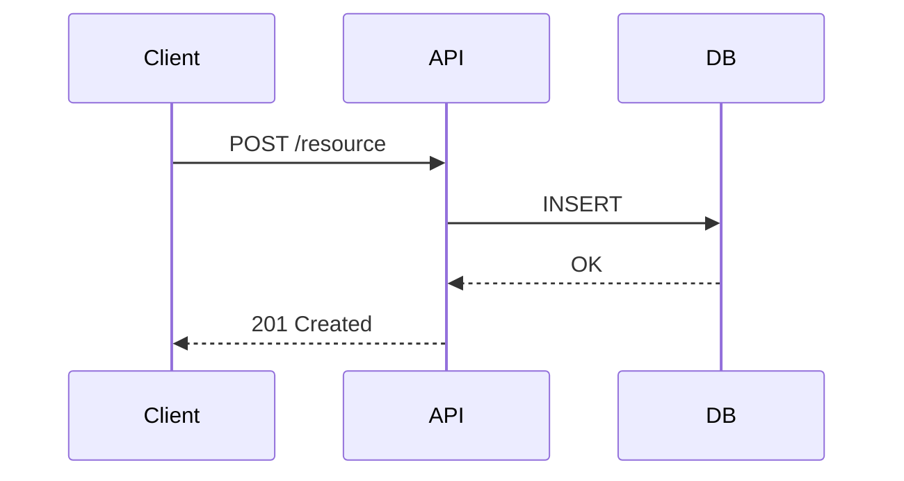
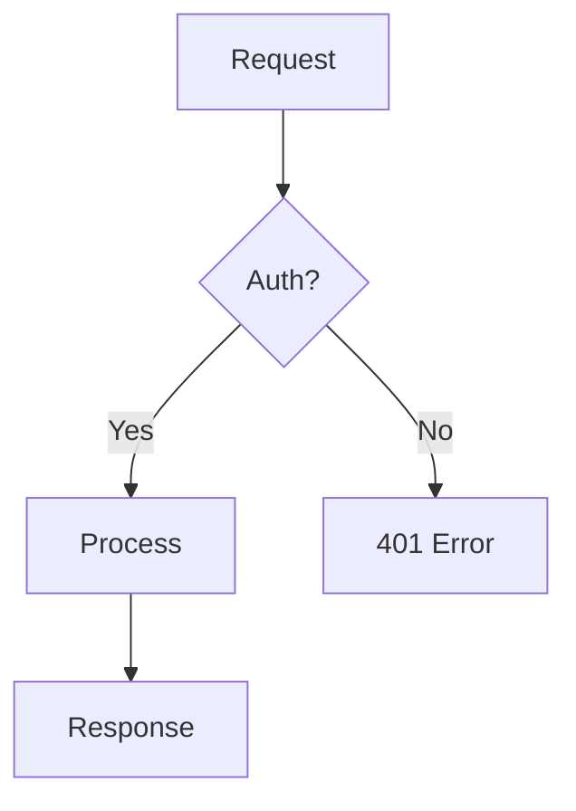
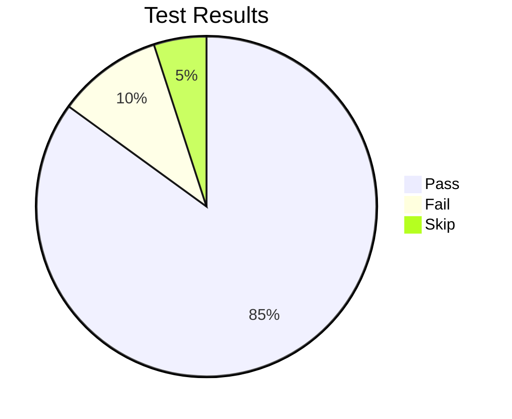
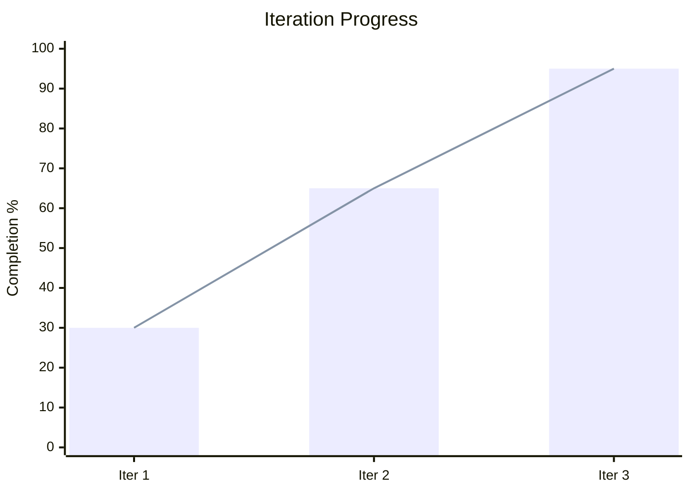

# SSoT Document Standard

> u-ssot 플러그인의 모든 SSoT 문서가 준수해야 하는 표준 양식을 정의한다.

---

## 1. Common Header Template

모든 SSoT 문서는 다음 YAML frontmatter 헤더를 포함해야 한다:

```yaml
---
document: "{DOC_ID}"           # 예: 1_Roadmap_PM, 2_ERD_SA
title: "{문서 제목}"
owner: "{담당 에이전트}"        # 예: u-RA, u-SA, u-UX
status: "Draft"                # Draft | Review | Final
version: "v0.1.0"             # vMAJOR.MINOR.PATCH
last_updated: "YYYY-MM-DD"
related_docs:
  - "{관련 문서 경로}"          # 예: u-docs/01-plan/1_SRS_RA.md
external_links:
  - "{외부 참조 URL}"          # 선택사항
---
```

### Header Fields

| Field | Required | Description |
|-------|----------|-------------|
| `document` | Yes | 문서 고유 ID (파일명 기반) |
| `title` | Yes | 문서 제목 (한글) |
| `owner` | Yes | 담당 에이전트 ID |
| `status` | Yes | 문서 상태: `Draft` / `Review` / `Final` |
| `version` | Yes | Semantic versioning: `vMAJOR.MINOR.PATCH` |
| `last_updated` | Yes | 최종 수정일 (`YYYY-MM-DD`) |
| `related_docs` | Yes | 관련 SSoT 문서 상대 경로 목록 |
| `external_links` | No | 외부 참조 링크 (선택) |

### Status Lifecycle



- **Draft**: 작성 중 (에이전트가 생성/수정 중)
- **Review**: 검토 대기 (u-RA 또는 관련 에이전트 검토)
- **Final**: 확정 (Phase 전환 Gate 통과 가능)

---

## 2. Version Rules

Semantic Versioning (`vMAJOR.MINOR.PATCH`)을 따른다:

| Change Type | Version Bump | Example | Description |
|-------------|-------------|---------|-------------|
| 구조 변경 | **MAJOR** | v1.0.0 → v2.0.0 | 섹션 추가/삭제, 문서 구조 재편 |
| 내용 추가/수정 | **MINOR** | v1.0.0 → v1.1.0 | FR 추가, 다이어그램 갱신, 상세 내용 보강 |
| 오타/포맷 수정 | **PATCH** | v1.1.0 → v1.1.1 | 오탈자 수정, 포맷팅 변경, 링크 수정 |

### Version Rules

1. 최초 생성 시 `v0.1.0`으로 시작한다
2. `Draft` → `Review` 전환 시 최소 MINOR bump 필요
3. `Review` → `Final` 전환 시 추가 bump 없이 상태만 변경
4. `Final` 상태 문서 수정 시 반드시 `Review`로 되돌리고 version bump
5. Iteration 2+ 진입 시 변경되는 문서만 MINOR 이상 bump

---

## 3. Phase-Specific Required Sections

### 3.1 PLAN Phase Documents

> 대상: `1_Roadmap_PM.md` (shared), `1_SRS_RA.md` (per-app), `1_IA_RA.md` (per-app), `1_Index_PM.md` (shared)

| Required Section | Description |
|-----------------|-------------|
| Background | 프로젝트 배경 및 목적 |
| Scope | 범위 정의 (In-Scope / Out-of-Scope) |
| User Stories | 사용자 스토리 목록 (Roadmap에만 정의, SRS는 FR table의 US Mapping 열로 참조) |
| Menu Tree | IA 문서에 필수: Domain Registry, Menu Tree Table (MN-{DOMAIN}-{NNN} 형식) |
| Gantt Chart | Mermaid `gantt` 다이어그램 (마일스톤, 일정) |



### 3.2 DESIGN Phase Documents

> 대상: `2_DesignSystem_UX.md`, `2_Screen_UX.md`, `2_ERD_SA.md`, `2_API_SA.md`

| Required Section | Description |
|-----------------|-------------|
| Design System | 디자인 시스템 정의 (컬러 팔레트, 타이포그래피, 스페이싱, 컴포넌트 규칙) |
| Screen Definition | 화면 목록 및 상세 설계 (화면ID, 화면명, 주요 컴포넌트) |
| Data Specification | 데이터 구조 정의 (Entity, Attribute, Type) |
| State Changes | 상태 전이 다이어그램 (`stateDiagram-v2`) |
| Exception Handling | 예외 케이스 정의 테이블 |
| ER Diagram | Mermaid `erDiagram` (Entity 관계도) |
| Sequence Diagram | Mermaid `sequenceDiagram` (인터랙션 흐름) |





### 3.3 DEV (DO) Phase Documents

> 대상: `3_Screen_UX.md`, `3_UIComponents_UX.md`, `3_DesignToken_UX.md`, `3_Code_DV.md`

| Required Section | Description |
|-----------------|-------------|
| Screen Implementation | 화면 구현 명세 (레이아웃, 인터랙션, 반응형 규칙) |
| UI Components | UI 컴포넌트 명세 (Props, 상태, 변형) |
| Design Tokens | 디자인 토큰 정의 (색상, 간격, 폰트 변수) |
| Build Configuration | 빌드 설정 (Turborepo, bun, Next.js) |
| Deploy Log | 배포/빌드 로그 기록 |
| API Specification | 구현된 API 엔드포인트 목록 |
| Flowchart | Mermaid `flowchart` (주요 로직 흐름) |



### 3.4 CHECK Phase Documents

> 대상: `4_Case_QA.md`, `4_Report_QA.md`

| Required Section | Description |
|-----------------|-------------|
| Test Conditions | 테스트 전제 조건 목록 |
| Test Steps | 테스트 절차 (Step-by-Step) |
| Actual vs Expected | 실제 결과 vs 기대 결과 비교 테이블 |
| Evidence | 테스트 증빙 (스크린샷, 로그 경로) |
| Pie Chart | Mermaid `pie` (테스트 커버리지, Pass/Fail 비율) |



### 3.5 ACT Phase Documents

> 대상: `backlog.md` (u-docs/ 루트), `5_IterationLog_RA.md`, `5_Retrospective_PM.md`

| Required Section | Description |
|-----------------|-------------|
| Backlog | 미해결 항목 테이블 (BL-ID, Type, Priority, Status) |
| Iteration History | Iteration별 변경 이력 (날짜, Phase, 변경 내용) |
| Retrospective | 회고 (Good / Improve / Actions) |
| XY Chart | Mermaid `xychart-beta` (Iteration별 진행률 추이) |



---

## 4. Document File Naming Convention

| Phase | Prefix | Example |
|-------|--------|---------|
| PLAN | `1_` | `1_Roadmap_PM.md`, `1_SRS_RA.md`, `1_IA_RA.md`, `1_Index_PM.md` |
| DESIGN | `2_` | `2_DesignSystem_UX.md`, `2_ERD_SA.md`, `2_API_SA.md`, `2_Screen_UX.md` |
| DEV | `3_` | `3_Screen_UX.md`, `3_UIComponents_UX.md`, `3_DesignToken_UX.md`, `3_Code_DV.md` |
| CHECK | `4_` | `4_Case_QA.md`, `4_Report_QA.md` |
| ACT | `5_` | `5_IterationLog_RA.md`, `5_Retrospective_PM.md` |
| ALL (root) | — | `backlog.md`, `summary.md` (u-docs/ 루트, PM 관리) |

---

## 5. Document Storage Path

모든 SSoT 문서는 프로젝트 루트의 `u-docs/` 하위에 저장된다. shared 문서와 per-app 문서가 분리된다:

```
u-docs/
├── shared/                         # Project-level shared docs
│   ├── 01-plan/
│   │   ├── 1_Roadmap_PM.md
│   │   └── 1_Index_PM.md
│   ├── 02-design/
│   │   ├── 2_ERD_SA.md
│   │   └── 2_DesignSystem_UX.md
│   ├── 03-dev/
│   │   ├── 3_UIComponents_UX.md
│   │   └── 3_DesignToken_UX.md
│   └── 05-act/
│       ├── 5_IterationLog_RA.md
│       └── 5_Retrospective_PM.md
├── backlog.md                      # PM(u-ra) 소유, 루트 관리 문서
├── summary.md                      # PM(u-ra) 소유, 루트 관리 문서
├── {app}/                          # Per-app docs (e.g., web/, admin/)
│   ├── 01-plan/
│   │   ├── 1_SRS_RA.md
│   │   └── 1_IA_RA.md
│   ├── 02-design/
│   │   ├── 2_API_SA.md
│   │   └── 2_Screen_UX.md
│   ├── 03-dev/
│   │   ├── 3_Code_DV.md
│   │   └── 3_Screen_UX.md
│   └── 04-check/
│       ├── 4_Case_QA.md
│       └── 4_Report_QA.md
├── assets/
│   └── (다이어그램, 스크린샷)
└── iterations/
    └── iter-N/
        └── (Iteration 아카이브)
```

---

## 6. Cross-Reference Rules

1. `related_docs`에는 반드시 `u-docs/` 기준 상대 경로를 사용한다 (shared/ 또는 {app}/ 접두사 포함)
2. 문서 내 다른 SSoT 문서 참조 시 `[문서명](상대경로)` 형식을 사용한다
3. shared 문서 참조: `u-docs/shared/{phase}/{doc}` 형식
4. app-specific 문서 참조: `u-docs/{app}/{phase}/{doc}` 형식
5. 수직적 추적성: PRD(why) → SRS(what) → MN/IA(navigate) → Screen(design) → ERD(how) → Code(execute)
6. 수평적 추적성: Screen(UI) ↔ API(data) ↔ QA Case(verify)
7. 추적성 깨짐 발견 시 `u-RA`에게 보고한다
