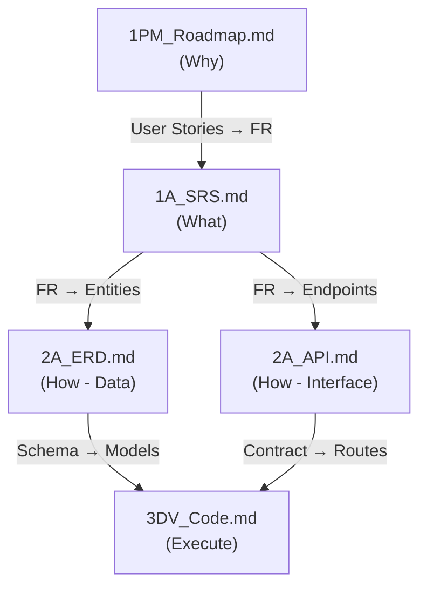
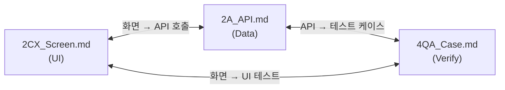
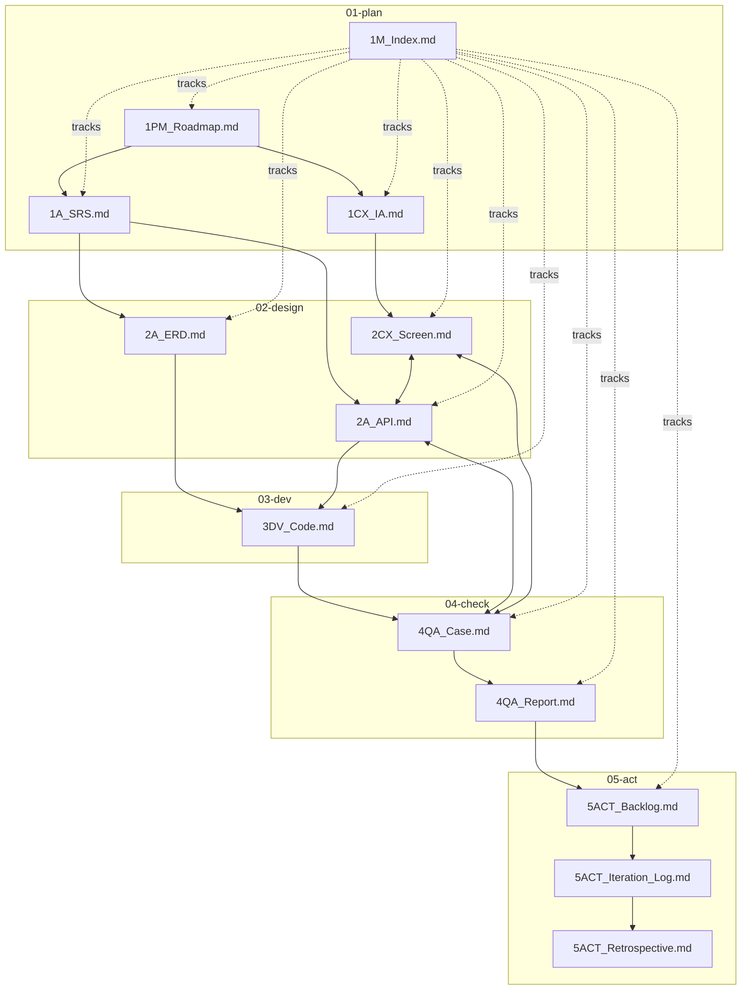

# Traceability Matrix

> u-ssot SSoT 문서 간의 추적성 매트릭스를 정의한다.
> 모든 문서는 수직적/수평적 추적성을 유지해야 한다.

---

## 1. Vertical Traceability Chain

PRD(why) → SRS(what) → ERD(how) → Code(execute) 순서의 수직적 추적성.

| Level | Document | Role | Traces From | Traces To |
|-------|----------|------|-------------|-----------|
| L1 (Why) | `1PM_Roadmap.md` | 프로젝트 목적, 유저 스토리, 마일스톤 | (최상위) | `1A_SRS.md` |
| L2 (What) | `1A_SRS.md` | 기능/비기능 요구사항 정의 | `1PM_Roadmap.md` | `2A_ERD.md`, `2A_API.md` |
| L3 (How) | `2A_ERD.md` | 데이터 모델, Entity 관계 | `1A_SRS.md` | `3DV_Code.md` |
| L3 (How) | `2A_API.md` | API Contract, 인터페이스 | `1A_SRS.md` | `3DV_Code.md` |
| L4 (Execute) | `3DV_Code.md` | 구현 기록, 파일 매핑 | `2A_ERD.md`, `2A_API.md` | `4QA_Case.md` |

### Vertical Chain Diagram



### Tracing Rules (Vertical)

1. `1PM_Roadmap.md`의 모든 User Story는 `1A_SRS.md`의 FR과 매핑되어야 한다
2. `1A_SRS.md`의 모든 FR은 `2A_ERD.md` 또는 `2A_API.md`에서 구체화되어야 한다
3. `2A_ERD.md`의 모든 Entity는 `3DV_Code.md`의 모델 파일과 매핑되어야 한다
4. `2A_API.md`의 모든 Endpoint는 `3DV_Code.md`의 라우트 파일과 매핑되어야 한다

---

## 2. Horizontal Traceability Chain

Screen(UI) ↔ API(data) ↔ QA Case(verify) 순서의 수평적 추적성.

| Document | Role | Horizontal Links |
|----------|------|-----------------|
| `2CX_Screen.md` | UI 화면 설계 | ↔ `2A_API.md` (화면이 호출하는 API) |
| `2A_API.md` | API 인터페이스 | ↔ `2CX_Screen.md` (API를 사용하는 화면), ↔ `4QA_Case.md` (API 테스트) |
| `4QA_Case.md` | 테스트 케이스 | ↔ `2A_API.md` (테스트 대상 API), ↔ `2CX_Screen.md` (테스트 대상 화면) |

### Horizontal Chain Diagram



### Tracing Rules (Horizontal)

1. `2CX_Screen.md`의 모든 화면은 사용하는 API endpoint를 명시해야 한다
2. `2A_API.md`의 모든 endpoint는 호출하는 화면을 참조해야 한다
3. `4QA_Case.md`의 테스트 케이스는 대상 API 또는 화면을 명시해야 한다

---

## 3. Full Dependency Graph



---

## 4. Cross-Reference Validation Rules

### 4.1 Validation Checklist

| # | Validation Rule | Source | Target | Severity |
|---|----------------|--------|--------|----------|
| V-001 | 모든 User Story는 FR과 매핑 | `1PM_Roadmap.md` | `1A_SRS.md` | Critical |
| V-002 | 모든 FR은 ERD 또는 API에서 구체화 | `1A_SRS.md` | `2A_ERD.md`, `2A_API.md` | Critical |
| V-003 | 모든 IA 항목은 Screen에서 설계 | `1CX_IA.md` | `2CX_Screen.md` | Major |
| V-004 | 모든 Screen은 사용 API를 명시 | `2CX_Screen.md` | `2A_API.md` | Major |
| V-005 | 모든 API endpoint는 테스트 케이스 존재 | `2A_API.md` | `4QA_Case.md` | Major |
| V-006 | 모든 Entity는 코드 모델과 매핑 | `2A_ERD.md` | `3DV_Code.md` | Critical |
| V-007 | 모든 API endpoint는 코드 라우트와 매핑 | `2A_API.md` | `3DV_Code.md` | Critical |
| V-008 | Index가 모든 문서를 추적 | `1M_Index.md` | All docs | Major |
| V-009 | 결함 리포트는 백로그에 등록 | `4QA_Report.md` | `5ACT_Backlog.md` | Major |
| V-010 | related_docs에 양방향 참조 존재 | All docs | All docs | Minor |

### 4.2 Traceability Matrix Table

실제 프로젝트에서 작성되는 추적성 매트릭스 테이블 형식:

```markdown
| FR-ID | Description | SRS | ERD | API | Screen | Code | QA Case | Status |
|-------|-------------|-----|-----|-----|--------|------|---------|--------|
| FR-001 | 사용자 로그인 | 1A:FR-001 | 2A:USER | 2A:POST /auth | 2CX:S-001 | auth.ts | 4QA:TC-001 | Implemented |
| FR-002 | 대시보드 조회 | 1A:FR-002 | 2A:DASHBOARD | 2A:GET /dashboard | 2CX:S-002 | dashboard.ts | 4QA:TC-002 | In Progress |
```

### 4.3 Validation Process

1. **자동 검증**: `scripts/validate-ssot.py`가 문서 파싱 후 추적성 검증
2. **u-M 검수**: Phase 전환 Gate에서 `u-M`이 문서 간 모순 검사
3. **수동 검토**: `/u-validate` 커맨드로 사용자가 직접 검증 요청 가능


---

## 5. Reference ID Format

문서 간 상호 참조 시 사용하는 ID 형식:

| Document | ID Format | Example |
|----------|-----------|---------|
| Roadmap User Story | `US-{NNN}` | US-001 |
| SRS Feature | `FR-{NNN}` | FR-001 |
| SRS Non-Functional | `NFR-{NNN}` | NFR-001 |
| ERD Entity | `Entity: {NAME}` | Entity: USER |
| API Endpoint | `{METHOD} {path}` | POST /auth/login |
| Screen | `S-{NNN}` | S-001 |
| QA Test Case | `TC-{NNN}` | TC-001 |
| Backlog Item | `BL-{NNN}` | BL-001 |
| Defect | `DEF-{NNN}` | DEF-001 |
