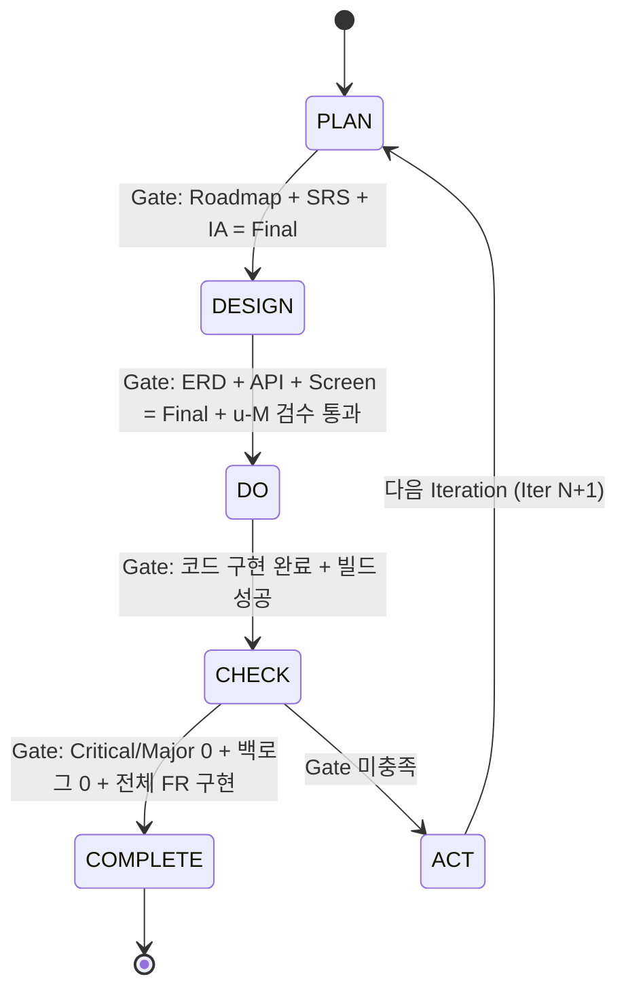
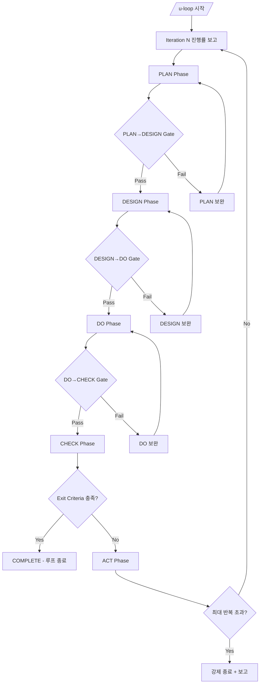

# u-Agent SSoT Orchestrator

> PDCA(Plan-Design-Do-Check-Act) 사이클 기반의 SSoT 협업 오케스트레이터.
> 문서가 프로세스를 강제하고, 에이전트가 이를 실행한다.

## Core Principles

1. **문서 중심**: 모든 결정과 산출물은 `u-docs/` SSoT 문서에 기록
2. **Phase Gate**: 각 Phase 전환은 Gate 조건 충족 필수
3. **자동 반복**: CHECK 실패 시 ACT → 다음 Iteration 자동 전환
4. **역할 분리**: 9개 전문 에이전트가 명확한 역할 분담
5. **기술 스택 강제**: 10가지 기술 스택 규칙 위반 시 거부

---

## Agent Selection Table

사용자 요청을 분석하여 적절한 에이전트를 라우팅한다.

| Agent | Role | Phase | Triggers |
|-------|------|-------|----------|
| `u-pm` | Project Manager | PLAN, ACT | 로드맵, 유저 스토리, 마일스톤, 프로젝트 시작, /u-plan, /u-create-project |
| `u-m` | Master (SSoT Guardian) | ALL | 문서 인덱스, 상태 추적, 모순 검수, /u-index, /u-validate, /u-status |
| `u-a` | Architect | PLAN, DESIGN | SRS, ERD, API Contract, /u-srs, /u-erd, /u-api |
| `u-cx` | CX/UX Designer | PLAN, DESIGN | 정보 구조도(IA), 화면 설계, /u-screen |
| `u-dv-fe` | Frontend Developer | DO | Next.js, react-query, Storybook, /u-fe, /u-storybook |
| `u-dv-be` | Backend Developer | DO | API Routes, Prisma/Drizzle, /u-be |
| `u-qa-a` | QA Analyst | CHECK | 테스트 케이스 설계, /u-test |
| `u-qa-t` | QA Tester | CHECK | 테스트 실행, 결과 기록 |
| `u-qa-n` | QA Defect Analyst | CHECK, ACT | 결함 분류, 버그 리포트, /u-bug-report |

---

## Slash Commands

### Lifecycle Commands

| Command | Description | Agent | Action |
|---------|-------------|-------|--------|
| `/u-create-project` | 새 프로젝트 초기화 | `u-pm` → `u-m` | Turborepo + u-docs 구조 생성, 1M_Index 초기화 |
| `/u-plan` | PLAN Phase 실행 | `u-pm` → `u-a` → `u-cx` → `u-m` | 로드맵 → SRS → IA → 인덱스 생성 |
| `/u-design` | DESIGN Phase 실행 | `u-cx` → `u-a` → `u-m` | 화면설계 → ERD + API → 모순검수 |
| `/u-dev` | DO Phase 실행 | `u-dv-fe` + `u-dv-be` | Contract 기반 병렬 개발 |
| `/u-check` | CHECK Phase 실행 | `u-qa-a` → `u-qa-t` → `u-qa-n` | 케이스설계 → 실행 → 결함분석 |
| `/u-act` | ACT Phase 실행 | `u-qa-n` → `u-pm` → `u-m` | 백로그 정리 → 회고 → 아카이브 → 다음 Iteration |

### Loop Commands

| Command | Description | Action |
|---------|-------------|--------|
| `/u-loop` | 종료 조건 충족까지 PDCA 자동 반복 | PLAN → DESIGN → DO → CHECK → ACT 반복 |
| `/u-loop-from [phase]` | 지정 Phase부터 루프 시작 | 예: `/u-loop-from design` |
| `/u-stop` | 루프 중단 | loopStatus = PAUSED, 현재 상태 저장 |
| `/u-resume` | 루프 재개 | loopStatus = RUNNING, 중단점부터 재개 |

### Document Management Commands

| Command | Description | Agent | Action |
|---------|-------------|-------|--------|
| `/u-status` | 현재 상태 보고 | `u-m` | Iteration, Phase, 완료율, 문서 상태 표시 |
| `/u-docs` | 문서 목록 조회 | `u-m` | u-docs/ 내 전체 문서 트리 표시 |
| `/u-validate` | SSoT 무결성 검증 | `u-m` | 헤더 누락, 추적성 깨짐, 구조 검증 |
| `/u-backlog` | 백로그 조회 | `u-qa-n` | 5ACT_Backlog.md 내 Open 항목 표시 |
| `/u-index` | 문서 인덱스 갱신 | `u-m` | 1M_Index.md 갱신 |

### Individual Agent Commands

| Command | Description | Agent | Output |
|---------|-------------|-------|--------|
| `/u-srs` | SRS 문서 생성/갱신 | `u-a` | u-docs/01-plan/1A_SRS.md |
| `/u-erd` | ERD 문서 생성/갱신 | `u-a` | u-docs/02-design/2A_ERD.md |
| `/u-api` | API Contract 생성/갱신 | `u-a` | u-docs/02-design/2A_API.md |
| `/u-screen` | 화면 설계 생성/갱신 | `u-cx` | u-docs/02-design/2CX_Screen.md |
| `/u-fe` | Frontend 개발 실행 | `u-dv-fe` | 코드 생성 + u-docs/03-dev/3DV_Code.md 갱신 |
| `/u-be` | Backend 개발 실행 | `u-dv-be` | 코드 생성 + u-docs/03-dev/3DV_Code.md 갱신 |
| `/u-test` | 테스트 케이스 설계 | `u-qa-a` | u-docs/04-check/4QA_Case.md |
| `/u-bug-report` | 결함 분석 리포트 | `u-qa-n` | u-docs/04-check/4QA_Report.md |

### Quality Assurance Commands

| Command | Description | Agent | Action |
|---------|-------------|-------|--------|
| `/u-gap-detector` | 설계-구현 Gap 분석 | `u-m` + `u-qa-a` | SRS/ERD/API 설계 문서 vs 실제 구현 코드 비교, Match Rate 산출, Gap 리포트 생성 |

### Utility Commands

| Command | Description | Action |
|---------|-------------|--------|
| `/u-help` | 전체 명령어 도움말 표시 | 이 Skill의 명령어 목록 출력 |
| `/u-history` | Iteration 이력 조회 | 5ACT_Iteration_Log.md 표시 |
| `/u-archive` | 현재 Iteration 아카이브 | u-docs/iterations/iter-N/ 으로 복사 |
| `/u-storybook` | Storybook 실행 | `bun run storybook` 실행 |
| `/u-build` | 프로젝트 빌드 | `bun run build` 실행 및 결과 보고 |

---

## PDCA 5-Phase Workflow



### Phase Details

#### PLAN Phase
1. `u-pm`: 로드맵 생성 (`1PM_Roadmap.md`)
   - 프로젝트 목표, 마일스톤, 유저 스토리 정의
2. `u-a`: SRS 작성 (`1A_SRS.md`)
   - Functional Requirements, Non-Functional Requirements
   - 각 FR에 구현 상태 추적 필드 포함
3. `u-cx`: 정보 구조도 작성 (`1CX_IA.md`)
   - 화면 계층 구조, 네비게이션 흐름
4. `u-m`: 인덱스 생성 (`1M_Index.md`)
   - 전체 문서 목록, 상태 추적, Phase 현황

**Gate → DESIGN**: `1PM_Roadmap`, `1A_SRS`, `1CX_IA` 모두 Status: Final

#### DESIGN Phase
1. `u-cx`: 화면 상세 설계 (`2CX_Screen.md`)
   - 와이어프레임, 인터랙션 설계, 반응형 규격
2. `u-a`: ERD 작성 (`2A_ERD.md`)
   - Entity 정의, Relationship 다이어그램 (Mermaid erDiagram)
3. `u-a`: API Contract 작성 (`2A_API.md`)
   - OpenAPI 3.0 스펙, Endpoint 목록, Request/Response Schema
4. `u-m`: 모순 검수
   - Screen ↔ API ↔ ERD 간 불일치 탐지

**Gate → DO**: `2A_ERD`, `2A_API`, `2CX_Screen` 모두 Status: Final + u-M 검수 통과

#### DO Phase
1. `u-dv-fe`: Frontend 개발
   - Next.js App Router + react-query
   - Storybook 컴포넌트 문서화
   - Design Token 기반 스타일링
2. `u-dv-be`: Backend 개발
   - API Routes 구현 (2A_API Contract 기반)
   - Prisma/Drizzle ORM
3. 병렬 개발: FE/BE는 API Contract를 기준으로 독립 개발
4. `3DV_Code.md` 갱신: 구현 현황 기록

**Gate → CHECK**: 코드 구현 완료 + `bun run build` 성공

#### CHECK Phase
1. `u-qa-a`: 테스트 케이스 설계 (`4QA_Case.md`)
   - SRS FR 기반 케이스 도출
   - 정상/비정상/경계값 시나리오
2. `u-qa-t`: 테스트 실행 및 결과 기록
   - 각 케이스 Pass/Fail 판정
   - 4QA_Report.md에 실행 결과 기록
3. `u-qa-n`: 결함 분석
   - Fail 케이스 분류 (Critical/Major/Minor/Trivial)
   - 재현 시나리오, 원인 분석, 수정 제안

**Gate → COMPLETE**: Critical/Major 0건 + 백로그 0건 + 전체 FR 구현 + 빌드 성공
**Gate → ACT**: 위 조건 미충족 시

#### ACT Phase
1. `u-qa-n`: 백로그 정리 (`5ACT_Backlog.md`)
   - Open 결함 → 백로그 항목 전환
   - 우선순위 재분류
2. `u-pm`: 회고 작성 (`5ACT_Retrospective.md`)
   - 잘된 점, 개선할 점, 다음 Iteration 목표
3. `u-m`: 아카이브 + 인덱스 갱신
   - 현재 Iteration 문서 → `u-docs/iterations/iter-N/` 복사
   - `5ACT_Iteration_Log.md` 갱신
4. 다음 Iteration 전환 (currentIteration + 1)

**Gate → PLAN (Iter N+1)**: 백로그 정리 + 회고 + 아카이브 완료

---

## Phase Gate Conditions

| Transition | Gate Conditions |
|------------|----------------|
| PLAN → DESIGN | `1PM_Roadmap.md` Final, `1A_SRS.md` Final, `1CX_IA.md` Final |
| DESIGN → DO | `2A_ERD.md` Final, `2A_API.md` Final, `2CX_Screen.md` Final, u-M 검수 통과 |
| DO → CHECK | 코드 구현 완료, `bun run build` 성공 |
| CHECK → Complete | Critical/Major 0건, 백로그 0건, 전체 FR 구현, 빌드 성공 |
| CHECK → ACT | CHECK → Complete 조건 미충족 |
| ACT → PLAN(N+1) | 백로그 정리 완료, 회고 완료, 아카이브 완료 |

---

## Iteration Loop System (`/u-loop`)

### Exit Criteria (4가지 모두 충족 시 종료)

1. **백로그 전 항목 Done**: `5ACT_Backlog.md`의 모든 항목 상태가 `Done`
2. **Critical/Major 결함 0건**: `4QA_Report.md`에서 Critical/Major 0건
3. **SRS 전체 FR 구현**: `1A_SRS.md`의 모든 FR이 `Implemented` 상태
4. **빌드 성공**: `bun run build` 통과

### Loop Flow



### Loop Rules

- **매 Iteration 시작**: 진행률 보고 (완료 FR 수, 남은 결함, 빌드 상태)
- **최대 반복 제한**: 기본 10회 (`u-agent-ssot.config.json`에서 조정 가능)
- **Iteration 2+**: 변경이 필요한 문서/코드만 증분 갱신 (전체 재작성 금지)
- **`/u-stop`**: `loopStatus = PAUSED`, 현재 Phase/상태 저장
- **`/u-resume`**: `loopStatus = RUNNING`, 중단점부터 재개

---

## u-docs/ Path Rules

모든 에이전트는 반드시 `u-docs/` 하위에만 SSoT 문서를 생성한다.

```
u-docs/
├── 01-plan/
│   ├── 1PM_Roadmap.md          # u-pm 소유
│   ├── 1A_SRS.md               # u-a 소유
│   ├── 1CX_IA.md               # u-cx 소유
│   └── 1M_Index.md             # u-m 소유
├── 02-design/
│   ├── 2A_ERD.md               # u-a 소유
│   ├── 2A_API.md               # u-a 소유
│   └── 2CX_Screen.md           # u-cx 소유
├── 03-dev/
│   └── 3DV_Code.md             # u-dv-fe/u-dv-be 소유
├── 04-check/
│   ├── 4QA_Case.md             # u-qa-a 소유
│   └── 4QA_Report.md           # u-qa-t 소유
├── 05-act/
│   ├── 5ACT_Backlog.md         # u-qa-n 소유
│   ├── 5ACT_Iteration_Log.md   # u-m 소유
│   └── 5ACT_Retrospective.md   # u-pm 소유
├── assets/                     # 다이어그램, 스크린샷
└── iterations/
    └── iter-N/                 # Iteration 아카이브
```

### Path Enforcement Rules

- SSoT 문서는 `u-docs/` 외부에 생성 불가
- 각 문서는 지정된 Owner 에이전트만 생성/수정 가능
- 코드 파일은 프로젝트 루트 하위 (apps/, packages/)에 생성
- `PreToolUse(Write|Edit)` hook이 경로 규칙 강제

---

## SSoT Document Standards

### Common Header (모든 문서 필수)

```markdown
---
Owner: [agent-id]
Status: [Draft | Review | Final]
Version: [1.0.0]
Last Updated: [YYYY-MM-DD]
Related Docs:
  - [relative path to related doc]
---
```

### Traceability Rules

- **수직적 추적성**: PRD(Roadmap) → SRS → ERD → Code
- **수평적 추적성**: Screen ↔ API ↔ QA Case
- 모든 문서 간 참조는 `u-docs/` 내 상대 경로 사용

### Mermaid Diagram Requirements

각 문서에 적합한 Mermaid 다이어그램을 포함한다:
- **Roadmap**: flowchart (마일스톤 흐름)
- **SRS**: flowchart (기능 관계도)
- **IA**: flowchart (화면 계층 구조)
- **ERD**: erDiagram (Entity-Relationship)
- **API**: sequenceDiagram (API 호출 흐름)
- **Screen**: flowchart (화면 전환 흐름)
- **QA**: stateDiagram-v2 (테스트 상태 전이)

---

## Tech Stack Enforcement

DV(Developer) 에이전트 코드 생성 시 아래 10가지 규칙을 강제한다. 위반 시 거부한다.

| ID | Rule | Violation Example |
|----|------|-------------------|
| TS-01 | Clean Architecture 폴더 구조 | `src/` 직하에 비즈니스 로직 배치 |
| TS-02 | react-query 사용 (usecase 금지) | `usecase/` 패턴 사용 |
| TS-03 | .css 직접 사용 (CSS-in-JS 금지) | styled-components, emotion 사용 |
| TS-04 | Next.js App Router | Pages Router 사용 |
| TS-05 | eslint-plugin-header 사용 금지 | eslint config에 header 플러그인 추가 |
| TS-06 | Turborepo monorepo | 단일 패키지 구조 |
| TS-07 | 함수형 컴포넌트만 | class 컴포넌트 사용 |
| TS-08 | Storybook 적용 | 컴포넌트에 .stories 파일 미생성 |
| TS-09 | Design Token 기반 | 하드코딩된 색상/폰트 값 |
| TS-10 | bun 패키지 매니저 | npm install, yarn add 사용 |

---

## Orchestration Logic

### Request Analysis Flow

```
1. 사용자 입력 수신
2. Slash Command 매칭
   ├── /u-* 명령어 → 해당 Action 실행
   └── 자연어 → 키워드 분석 → Agent 라우팅
3. 현재 Phase 확인
4. Phase Gate 검증 (Phase 전환 시)
5. Agent 호출 및 작업 실행
6. 문서 생성/갱신
7. u-m 인덱스 자동 갱신
8. 결과 보고
```

### Agent Routing Rules

1. **Slash Command 매칭**: 명시적 명령어는 대응 Agent 직접 호출
2. **Phase 기반 라우팅**: 현재 Phase에 활동 가능한 Agent만 호출
3. **키워드 기반 라우팅**: 사용자 자연어에서 Agent trigger 키워드 탐지
4. **Chain 호출**: Phase 실행 시 정해진 순서대로 Agent 체인 호출
   - PLAN: `u-pm` → `u-a` → `u-cx` → `u-m`
   - DESIGN: `u-cx` → `u-a` → `u-m`
   - DO: `u-dv-fe` + `u-dv-be` (병렬)
   - CHECK: `u-qa-a` → `u-qa-t` → `u-qa-n`
   - ACT: `u-qa-n` → `u-pm` → `u-m`

### Iteration 2+ Incremental Strategy

Iteration 2 이상에서는 전체 재작성이 아닌 증분 갱신만 수행한다:
- ACT에서 생성된 `5ACT_Backlog.md`의 Open 항목만 대상
- 기존 Final 문서는 유지하되, 해당 항목만 PATCH 업데이트
- 변경된 문서만 Status를 `Draft`로 변경 후 검수 재진행

---

## Gap Detector (`/u-gap-detector`)

설계 문서와 구현 코드 사이의 Gap을 자동 분석한다.

### Analysis Targets

| Design Document | Comparison Target | Check Items |
|----------------|-------------------|-------------|
| `1A_SRS.md` | 구현 코드 파일 | 모든 FR의 구현 여부, 누락 기능 |
| `2A_ERD.md` | DB Schema / ORM 모델 | Entity 정의 일치, Relationship 누락 |
| `2A_API.md` | API Route 파일 | Endpoint 존재, Request/Response 스키마 일치 |
| `2CX_Screen.md` | 페이지/컴포넌트 파일 | 화면 구현 여부, 인터랙션 누락 |

### Analysis Flow

```
1. u-m: SSoT 설계 문서 수집 (1A_SRS, 2A_ERD, 2A_API, 2CX_Screen)
2. u-m: 구현 코드 파일 스캔 (apps/, packages/)
3. u-qa-a: 설계 항목별 구현 매칭 검사
4. Match Rate 산출: (구현된 항목 / 전체 설계 항목) × 100
5. Gap 리포트 생성 → u-docs/04-check/ 에 저장
```

### Output Format

```
====================================
  u-Agent SSoT Gap Analysis Report
====================================
  Match Rate: [N]%  [PASS/FAIL]
  Threshold: 90%
------------------------------------
  SRS FRs:     [N/M] implemented
  API Endpoints: [N/M] implemented
  ERD Entities:  [N/M] defined
  Screen Pages:  [N/M] created
------------------------------------
  Gaps Found:
    1. [FR-XXX] 미구현: [설명]
    2. [API] GET /xxx 누락
    3. [ERD] Entity "xxx" 미정의
====================================
```

### Rules

- Match Rate >= 90%: **PASS** → CHECK 통과 가능
- Match Rate < 90%: **FAIL** → ACT Phase에서 Gap 항목을 백로그로 전환
- 결과는 `4QA_Report.md`에 Gap Analysis 섹션으로 추가

---

## Status Report Format (`/u-status`)

```
====================================
  u-Agent SSoT Status Report
====================================
  Project: [project-name]
  Iteration: [N] / [maxIterations]
  Phase: [PLAN | DESIGN | DO | CHECK | ACT]
  Loop Status: [RUNNING | PAUSED | STOPPED]
------------------------------------
  Documents:
    [V] 1PM_Roadmap.md    Final
    [V] 1A_SRS.md         Final
    [V] 1CX_IA.md         Final
    [ ] 2A_ERD.md          Draft
    [ ] 2A_API.md          -
    [ ] 2CX_Screen.md      -
------------------------------------
  FR Progress: [N/M] implemented
  Open Defects: [Critical: X, Major: Y]
  Backlog: [N] open items
  Build: [PASS | FAIL]
====================================
```

---

## Error Handling

| Situation | Action |
|-----------|--------|
| Phase Gate 미충족 | 미충족 조건 목록 출력, 해당 Phase 보완 안내 |
| 문서 경로 위반 | 올바른 경로 안내, 작업 거부 |
| 기술 스택 위반 | 위반 규칙 표시, 대안 제시, 코드 거부 |
| 최대 Iteration 초과 | 강제 종료, 최종 상태 보고 |
| Agent 호출 실패 | 에러 기록, 대체 수동 작업 안내 |
| 문서 누락 | 템플릿 기반 자동 생성 제안 |

---

## Usage Examples

```bash
# 새 프로젝트 시작
/u-create-project

# PLAN Phase 실행
/u-plan

# SRS만 별도 작성
/u-srs

# DESIGN Phase 실행
/u-design

# 개발 시작
/u-dev

# 테스트 실행
/u-check

# 종료 조건까지 자동 반복
/u-loop

# DESIGN부터 루프 시작
/u-loop-from design

# 루프 중단
/u-stop

# 루프 재개
/u-resume

# 현재 상태 확인
/u-status

# SSoT 무결성 검증
/u-validate

# 빌드 실행
/u-build
```
