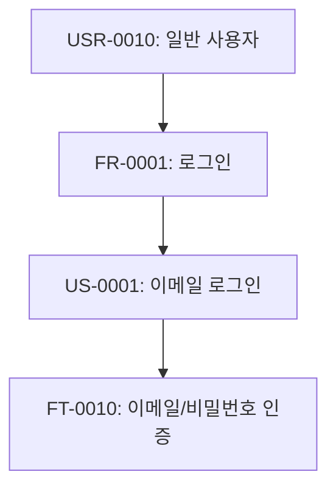

# u-browse — Implementation Reference

> SKILL.md의 Execution Flow에서 참조하는 상세 구현 가이드.

---

## § Step 0: contextMap 상세 구조

```
contextMap = {
  srs: { requirements: [...], userStories: [...], features: [...] },
  ia:  { siteMap: [...], screenHierarchy: [...], userFlows: [...] },
  erd: { entities: [...], relations: [...] },
  api: { endpoints: [...], errorCodes: [...] },
  screens: { screens: [...] },
  screenFlow: { navigationMap: [...], journeyFlows: [...], transitionRules: [...] },
  rtm: { traceabilityRows: [...], frCoverage: [...], gaps: [...] },
  designToken: { brandColors: [...], semanticColors: [...], typographyScale: [...] }
}
```

**교차 참조 인덱스:**

```
ftToScreens = { "FT-0010": ["SCR-001", "SCR-003"], ... }
screenToApis = { "SCR-001": ["POST /api/auth/login", "GET /api/user/profile"], ... }
screenToFts = { "SCR-001": ["FT-0010", "FT-0011"], ... }
entityToApis = { "User": ["GET /api/users", "POST /api/users"], ... }
screenFlows = { "SCR-001": { next: ["SCR-002"], prev: ["SCR-010"] }, ... }
ftToTcs = { "FT-0010": ["TC-0001", "TC-0002"], ... }
```

---

## § Step 2: Document Type Specifications

### 2-1. SRS → `srs.html`

**입력:** `srs.md` + `srs.json`
**교차 참조:** IA(화면 매핑), API(엔드포인트 매핑), Screens(FT 매핑)

| 섹션 | 내용 | 다이어그램 |
|------|------|-----------|
| **Overview** | 프로젝트명, 설명, 대상 사용자, 플랫폼 | - |
| **Stakeholders** | 이해관계자 역할 매트릭스 | - |
| **Requirements** | FR 테이블 (ID, Title, Priority 배지, Status 배지, 관련 US/FT 수) | Priority 분포 `pie` chart |
| **NF Requirements** | NR 테이블 (category, title, metric) | - |
| **User Stories** | US 카드 (actor, action, benefit, acceptance criteria 체크리스트) | - |
| **Features** | FT 테이블 + 각 FT에 연결된 Screen, API, TC 링크 | Use Case `flowchart` |
| **Hierarchy** | USR → FR → US → FT 트리 시각화 | `flowchart TD` |
| **Coverage** | FR별 US/FT/Screen/TC 커버리지 바 | 커버리지 bar chart |

**Hierarchy 다이어그램:** JSON의 `requirements`, `userStories`, `features` 배열에서 `tracedFrom` 필드를 추적하여 자동 생성.



---

### 2-2. IA → `ia.html`

**입력:** `ia.md` + `ia.json`
**교차 참조:** Screens(컴포넌트 수), SRS(FT 매핑)

| 섹션 | 내용 | 다이어그램 |
|------|------|-----------|
| **Visual Sitemap** | 화면 계층을 **인라인 SVG**로 시각화 | SVG sitemap |
| **Screen Hierarchy** | Level별 화면 테이블 + 와이어프레임 링크 | - |
| **Navigation Patterns** | 패턴별 적용 화면 매트릭스 | - |
| **User Flows** | 각 플로우의 단계별 화면 전이 | SVG flowchart |

**Visual Sitemap SVG 구성:**

1. **페이지 카드** — `width="120" height="90"` 사각형. 상단: 화면명(bold), 하단: 간략 와이어프레임 아이콘
2. **Level 색상:**
   - L1: `#0891b2`(청록) 흰텍스트
   - L2: `#dbeafe`(연파랑)
   - L3: `#ffffff` border `#d1d9e0`
   - L4: `#fef9c3`(연노랑)
3. **연결선** — 수직/수평 직각 (stroke: `#9ca3af`, width: 1.5, 삼각형 마커)
4. **어노테이션 마커** — `<circle fill="#ef4444">` + 흰 숫자, 점선 연결 callout

**SVG 레이아웃:** L1 중앙 상단 → L2 수평(간격 140px) → L3/L4 수직. viewBox 동적 계산.

**SVG 코드 패턴:**

```html
<div class="diag-container" style="max-height:400px;overflow:hidden;position:relative">
  <button class="diag-zoom" onclick="openDiagModal(this)" title="확대">🔍</button>
  <svg class="diag" viewBox="0 0 {{WIDTH}} {{HEIGHT}}" xmlns="http://www.w3.org/2000/svg">
    <defs>
      <marker id="arrow" markerWidth="10" markerHeight="7" refX="9" refY="3.5" orient="auto">
        <polygon points="0 0, 10 3.5, 0 7" fill="#9ca3af"/>
      </marker>
    </defs>
    <!-- L1 card -->
    <rect x="350" y="20" width="120" height="90" rx="4" fill="#0891b2" stroke="#0891b2"/>
    <text x="410" y="42" text-anchor="middle" fill="#fff" font-size="11" font-weight="700">HOMEPAGE</text>
    <!-- wireframe icon -->
    <rect x="370" y="50" width="80" height="4" rx="1" fill="rgba(255,255,255,.3)"/>
    <!-- Annotation -->
    <circle cx="475" cy="25" r="10" fill="#ef4444"/>
    <text x="475" y="29" text-anchor="middle" fill="#fff" font-size="9" font-weight="700">1</text>
    <!-- Connection -->
    <line x1="410" y1="110" x2="410" y2="140" stroke="#9ca3af" stroke-width="1.5" marker-end="url(#arrow)"/>
  </svg>
</div>
```

축소 표시 + 확대: `max-height:400px; overflow:hidden` + 모달로 전체 SVG.

---

### 2-3. ERD → `erd.html`

**입력:** `erd.md` + `erd.json`
**교차 참조:** API(엔티티 사용), Screens(데이터 바인딩)

| 섹션 | 내용 | 다이어그램 |
|------|------|-----------|
| **ER Diagram** | 전체 엔티티 관계 | `erDiagram` |
| **Entity Cards** | 컬럼 목록, PK/FK 배지, 타입 | - |
| **Relationships** | 1:1, 1:N, M:N 배지 | - |
| **API Usage** | 엔티티별 사용 API 엔드포인트 | - |
| **Screen Binding** | 엔티티별 바인딩 화면 | - |

> **Mermaid 제약조건:** 속성당 마커 1개만 (`PK`/`FK`/`UK` 택 1). 우선순위: PK > FK > UK.

---

### 2-4. API → `api.html`

**입력:** `api.md` + `api.json`
**교차 참조:** ERD(응답 엔티티), Screens(호출 화면), SRS(FT 매핑)

| 섹션 | 내용 | 다이어그램 |
|------|------|-----------|
| **Overview** | Base URL, Auth, 버전 | - |
| **Endpoints** | 메서드 배지(GET🟢/POST🔵/PUT🟠/DELETE🔴) + path | - |
| **Endpoint Detail** | Request/Response schema, 호출 화면, FT | `sequenceDiagram` |
| **Error Codes** | 에러 코드 테이블 | - |
| **Screen Mapping** | 화면×API 매트릭스 | - |

메서드 배지 CSS: `.method.get{background:#22c55e}` `.method.post{background:#3b82f6}` `.method.put{background:#f59e0b}` `.method.delete{background:#ef4444}`

---

### 2-5. Screens → `screens.html`

**입력:** `screens.md` + `screens.json`
**교차 참조:** IA, API, SRS, Screen Flow, ERD

| 섹션 | 내용 | 다이어그램 |
|------|------|-----------|
| **Screen List** | ID, 이름, 라우트, FT 링크, 와이어프레임 링크 | - |
| **Screen Cards** | 컴포넌트, Interactions, States, API, 데이터, Navigation | `stateDiagram-v2` |
| **Responsive** | 브레이크포인트별 레이아웃 | - |

---

### 2-6. Screen Flow → `screen-flow.html`

**입력:** `screen-flow.md` + `screen-flow.json`

| 섹션 | 내용 | 다이어그램 |
|------|------|-----------|
| **Navigation Map** | 전체 화면 전이 | `flowchart TD` |
| **Journey Flows** | 여정별 상세 | `flowchart LR` |
| **Transition Rules** | From→To, trigger, guard, side effect | - |

---

### 2-7. RTM → `rtm.html`

| 섹션 | 내용 | 다이어그램 |
|------|------|-----------|
| **Traceability Matrix** | FR→US→FT→Screen→API→TC 매핑 | - |
| **Coverage Dashboard** | FR별 % (100%🟢/50-99%🟡/<50%🔴) | `pie` chart |
| **Gaps** | 미매핑 경고 (severity 배지) | - |
| **Statistics** | 총 수량, 커버리지 요약 | bar chart |

---

### 2-8. Design Token → `design-token.html`

| 섹션 | 내용 |
|------|------|
| **Color Palette** | 컬러 스워치 (hex 미리보기 + 이름 + 용도) |
| **Typography** | 타이포 스케일 (실제 폰트 크기/두께 렌더링) |
| **Spacing** | 스페이싱 시스템 (실제 크기 박스 시각화) |
| **Design Principles** | Do / Don't 카드 |

---

### 2-9. UI Components → `ui-components.html`

**입력:** `screens.json`(components 집계) + `design-token.json` + `ux-guide.md`

| 섹션 | 내용 |
|------|------|
| **Component Catalog** | 타입별 그룹 카탈로그 |
| **Component Card** | 이름, 타입 배지, 시각적 미리보기, 사용 화면, Design Token, Storybook 링크 |
| **Usage Matrix** | 컴포넌트 × 화면 매트릭스 |

**생성 알고리즘:** screens.json 모든 화면 → components 수집 → 중복 제거 + 카운트 → 타입별 그룹핑 (Layout/Input/Display/Action/Navigation/Filter)

**컴포넌트 카드 HTML:**

```html
<div class="comp-card">
  <div class="comp-card-header">
    <span class="comp-type-badge input">Input</span>
    <h3>DateRangePicker</h3>
    <span class="usage-count">5개 화면에서 사용</span>
  </div>
  <div class="comp-card-body">
    <div class="comp-preview"><!-- 타입별 실제 HTML 미리보기 --></div>
    <div class="comp-props"><b>Props:</b> value, defaultRange, onChange</div>
    <div class="comp-usage"><b>사용 화면:</b> <a href="...">SCR-001</a>, ...</div>
    <div class="comp-tokens"><b>Design Token:</b> <code>var(--border)</code>, ...</div>
  </div>
</div>
```

**타입별 미리보기:** Input→`<input>`, Button→`<button>`, Display→배지/태그, Layout→박스 구조, Table→미니 테이블, Card/Modal→레이아웃 미리보기

**Storybook 연결:** `u-maker.config.json.storybook.url` 확인 → `deployed` 우선 → `url` 폴백 → `.storybook/` 자동감지 시 `localhost:6006`

---

## § Step 3: Wireframe Implementation

### 블록 1: doc-header

```html
<header class="doc-header">
  <div class="dh-left">
    <span class="sid">SCR-NNN</span>
    <div class="dh-meta">
      <strong class="dh-name">화면명</strong>
      <code class="dh-path">/route</code>
    </div>
  </div>
  <div class="dh-right">
    <a class="dh-index" href="index.html">Index</a>
    <span class="trace trace-ft">FT-XXX</span>
    <span class="trace trace-fr">FR-XXX</span>
    <button class="theme-toggle" type="button" aria-label="Toggle light and dark mode">
      <span data-mode="light">Light</span>
      <span data-mode="dark">Dark</span>
    </button>
  </div>
</header>
```

**Theme 토글 규칙:**
1. 기본값: `u-maker.config.json.theme` → 없으면 `light`
2. `<html data-theme="light|dark">` 변경
3. `localStorage['u-maker-theme']` 저장
4. 다크 모드에서도 annotation, 배지, 코드 블록 대비 유지

```css
:root { --bg:#f8fafc; --panel:#ffffff; --text:#0f172a; --muted:#64748b; --line:#dbe3ef; }
html[data-theme="dark"] { --bg:#0f172a; --panel:#111827; --text:#e5eef9; --muted:#94a3b8; --line:#334155; }
```

### 블록 2: stage

```
┌─────────────────────────────────────┬──────────────────┐
│ Left Stage (wireframe + markers)    │ Right Panel      │
│ app-shell: app-nav + app-page       │ Design / Develop │
│ inline-annotation-layer             │ 기타             │
└─────────────────────────────────────┴──────────────────┘
```

```html
<section class="stage">
  <div class="stage-main">
    <div class="app-shell">
      <aside class="app-nav"><!-- IA 기반 메뉴 --></aside>
      <main class="app-page">
        <section class="page-canvas">
          <!-- wireframe + inline annotation -->
          <div class="inline-annotation-layer">
            <span class="mk">1</span>
            <div class="mk-note">설명 텍스트</div>
          </div>
        </section>
      </main>
    </div>
  </div>
  <aside class="anno-panel">
    <section class="anno-section anno-design"><h2>Design</h2></section>
    <section class="anno-section anno-develop"><h2>Develop</h2></section>
    <section class="anno-section anno-other"><h2>기타</h2></section>
  </aside>
</section>
```

**stage 규칙:**
- 왼쪽: 실제 HTML wireframe (IA 사이드바 + 본문 레이아웃)
- 왼쪽에 인라인 annotation 배치 (마커, note chip, 상태 badge)
- 오른쪽: Design, Develop, 기타 3개 그룹
- 기본 grid: `minmax(0,1fr) 360px`. 1280px 미만→하단, 768px 미만→단일 컬럼

**Design 섹션:** 화면 목적, 컴포넌트 동작, UX 규칙, 접근성, 반응형
**Develop 섹션:** API endpoint, query/body, response, enum, validation, 에러 처리
**기타 섹션:** 운영/정책, QA 포인트, 미정 의사결정, dependency

### 블록 3: detail-tabs

7개 고정 순서 탭:

```html
<section class="detail-tabs">
  <div class="tab-list" role="tablist">
    <button role="tab" data-tab="overlays">Popup / BottomSheet / Dialog / Modal</button>
    <button role="tab" data-tab="events">Event Actions</button>
    <button role="tab" data-tab="data-models">Data Models</button>
    <button role="tab" data-tab="screen-flow">Screen Flow</button>
    <button role="tab" data-tab="sequence-diagram">Sequence Diagram</button>
    <button role="tab" data-tab="component-spec">Component Spec</button>
    <button role="tab" data-tab="global-rules">Global Rules</button>
  </div>
  <div class="tab-panels"><!-- 7 panels --></div>
</section>
```

**탭 상세:**

1. **Overlays** — Popup, BottomSheet, Dialog, Modal 4개 고정 슬롯. 각각 **실제 UI wireframe** + 트리거 + 후속 동작. 없으면 placeholder wireframe. 텍스트 요약 대체 금지.

```html
<div class="overlay-grid">
  <article class="overlay-preview overlay-popup"><h3>Popup</h3><div class="overlay-wireframe">...</div></article>
  <article class="overlay-preview overlay-bottomsheet"><h3>BottomSheet</h3>...</article>
  <article class="overlay-preview overlay-dialog"><h3>Dialog</h3>...</article>
  <article class="overlay-preview overlay-modal"><h3>Modal</h3>...</article>
</div>
```

2. **Event Actions** — Component, Trigger, API Call, Success, Failure 테이블
3. **Data Models** — 엔티티 단위 소제목. ERD, UI Mapping, Description
4. **Screen Flow** — 인라인 SVG 또는 flowchart (진입/이탈 + 전이 조건 + FT/FR edge)
5. **Sequence Diagram** — 사용자→FE→API→DB 시간순. 실패 분기 + invalidation
6. **Component Spec** — `#, 컴포넌트, 타입, Props/설명, Validation, API` 컬럼
7. **Global Rules** — common/ + scope override 공통 규칙 요약

### Annotation Marker CSS

```css
.mk { display:inline-flex; align-items:center; justify-content:center;
      width:17px; height:17px; background:#2563eb; color:#fff;
      border-radius:50%; font-size:9px; font-weight:700; }
.mk-note { display:inline-flex; padding:4px 8px; border-radius:999px;
           background:rgba(37,99,235,.10); color:var(--text); font-size:11px; }
```

### No-Clipping CSS

```css
.page-canvas, .tab-panels, .tab-panel, .overlay-preview,
.overlay-wireframe, .overlay-wireframe .overlay-body {
  height: auto; max-height: none; overflow: visible;
}
```

---

## § Step 3.5: Page Navigation

**레이아웃:** `page-layout` grid (1fr 200px) + `page-nav` sticky sidebar

```html
<body>
  <div class="page-layout">
    <main class="page-main">
      <section id="sec-overview"><h2>Overview</h2>...</section>
      <section id="sec-entities"><h2>Entity Cards</h2>...</section>
    </main>
    <nav class="page-nav">
      <div class="page-nav-title">On this page</div>
      <ul class="page-nav-list">
        <li><a href="#sec-overview" class="page-nav-link active">Overview</a></li>
        <li><a href="#sec-entities" class="page-nav-link">Entity Cards</a></li>
      </ul>
    </nav>
  </div>
</body>
```

**CSS:**

```css
.page-layout { display:grid; grid-template-columns:1fr 200px; gap:24px; max-width:1400px; margin:0 auto; padding:24px; }
.page-nav { position:sticky; top:24px; align-self:start; max-height:calc(100vh - 48px); overflow-y:auto; }
.page-nav-title { font-size:.75rem; font-weight:700; text-transform:uppercase; letter-spacing:.5px; color:var(--text-dim,#94a3b8); margin-bottom:12px; padding-left:12px; }
.page-nav-list { list-style:none; padding:0; margin:0; border-left:2px solid var(--border,#334155); }
.page-nav-link { display:block; padding:6px 12px; font-size:.8rem; color:var(--text-dim,#94a3b8); text-decoration:none; border-left:2px solid transparent; margin-left:-2px; transition:all .15s; }
.page-nav-link:hover { color:var(--text,#e2e8f0); }
.page-nav-link.active { color:#38bdf8; border-left-color:#38bdf8; font-weight:600; }
@media (max-width:768px) { .page-layout{grid-template-columns:1fr} .page-nav{display:none} }
```

**Scroll Spy:**

```javascript
document.addEventListener('DOMContentLoaded', () => {
  const sections = document.querySelectorAll('main section[id]');
  const navLinks = document.querySelectorAll('.page-nav-link');
  if (!sections.length || !navLinks.length) return;
  const observer = new IntersectionObserver(entries => {
    entries.forEach(entry => {
      if (entry.isIntersecting) {
        navLinks.forEach(l => l.classList.remove('active'));
        const a = document.querySelector('.page-nav-link[href="#' + entry.target.id + '"]');
        if (a) a.classList.add('active');
      }
    });
  }, { rootMargin: '-20% 0px -60% 0px', threshold: 0 });
  sections.forEach(s => observer.observe(s));
  navLinks.forEach(l => l.addEventListener('click', e => {
    e.preventDefault();
    document.querySelector(l.getAttribute('href'))?.scrollIntoView({ behavior:'smooth', block:'start' });
  }));
});
```

**문서별 page-nav 항목:**

| 문서 | 섹션 |
|------|------|
| SRS | Overview, Requirements, NF Requirements, User Stories, Features, Hierarchy, Coverage |
| IA | Visual Sitemap, Screen Hierarchy, Navigation Patterns, User Flows |
| ERD | ER Diagram, Entity Cards, Relationships, API Usage, Screen Binding |
| API | Overview, Endpoints, Endpoint Detail, Error Codes, Screen Mapping |
| Screens | Screen List, Screen Cards, Responsive |
| Screen Flow | Navigation Map, Journey Flows, Transition Rules |
| RTM | Traceability Matrix, Coverage Dashboard, Gaps, Statistics |
| Design Token | Color Palette, Typography, Spacing, Design Principles |
| UI Components | Component Catalog, Usage Matrix |

**구현 규칙:**
1. `<h2>` 기준 `<section id="sec-{kebab-name}">` 래퍼
2. 빈 섹션 제외, 실제 생성 섹션에서 동적 구성
3. iframe 내부 스크롤 기준 독립 동작
4. 와이어프레임 HTML에는 page-nav 미적용

---

## § Step 4: index.html Implementation

**FILES 배열:**

```javascript
const FILES = [
  { path:"hjw/01-plan/srs.html", type:"doc", name:"SRS", dir:"hjw/01-plan", icon:"📋", docType:"srs" },
  { path:"hjw/01-plan/ia.html", type:"doc", name:"IA", dir:"hjw/01-plan", icon:"🗺️", docType:"ia" },
  { path:"hjw/02-design/erd.html", type:"doc", name:"ERD", dir:"hjw/02-design", icon:"🗃️", docType:"erd" },
  // ... 나머지 문서
  { path:"hjw/02-design/wireframes/SCR-001.html", type:"wireframe", name:"로그인", screenId:"SCR-001", dir:"hjw/02-design/wireframes", domain:"인증", route:"/login" },
];
```

**핵심 함수:**

```javascript
function buildTree() {
  const tree = { __files: [] };
  FILES.forEach(f => {
    const parts = f.dir.split('/').filter(Boolean);
    let node = tree;
    parts.forEach(p => { if (!node[p]) node[p] = { __files: [] }; node = node[p]; });
    node.__files.push(f);
  });
  return tree;
}

function groupWireframesByDomain(files) {
  const groups = {};
  files.filter(f => f.type === 'wireframe').forEach(f => {
    const domain = normalizeDomainLabel(f.domain || '기타');
    if (!groups[domain]) groups[domain] = [];
    groups[domain].push(f);
  });
  return groups;
}

function normalizeDomainLabel(label) {
  const value = (label || '').trim();
  const aliases = { '주문관리':'주문', '주문/접수':'주문', '상담/문의':'상담', '상담사/모집인':'상담', '업무/운영':'운영' };
  return aliases[value] || value || '기타';
}
```

**Sidebar 렌더링:**

```javascript
const wireframeGroups = Object.entries(groupWireframesByDomain(FILES))
  .sort(sortDomainGroups)
  .map(([domain, items]) => [domain, collapseSparseDomain(domain, items)]);

wireframeGroups.forEach(([domain, items]) => {
  renderDomainHeader(domain, items.length, { collapsible: true });
  items.forEach(f => {
    const a = document.createElement('a');
    a.className = 'tree-file wireframe-link compact';
    a.title = (f.route || '') + ' · ' + f.screenId;
    a.innerHTML = '<span class="wf-id">' + f.screenId + '</span><span class="wf-name">' + f.name + '</span>';
  });
});
```

**Sidebar HTML 구조:**

```html
<aside class="browse-sidebar">
  <div class="sidebar-top">
    <button class="home-link">{app-name}</button>
    <p class="sidebar-subtitle">{App} Browse</p>
    <input type="search" placeholder="Search documents..." />
  </div>
  <section class="nav-section">
    <button class="nav-section-title is-open">Plan</button>
    <a class="nav-leaf" href="...">SRS</a>
  </section>
  <section class="nav-section">
    <button class="nav-section-title is-open">Wireframes</button>
    <button class="domain-row is-open">
      <span class="domain-name">주문</span><span class="count-badge">8</span>
    </button>
    <a class="nav-leaf wireframe current" href="...">
      <span class="wf-id">SCR-001</span><span class="wf-name">주문 목록</span>
    </a>
  </section>
</aside>
```
