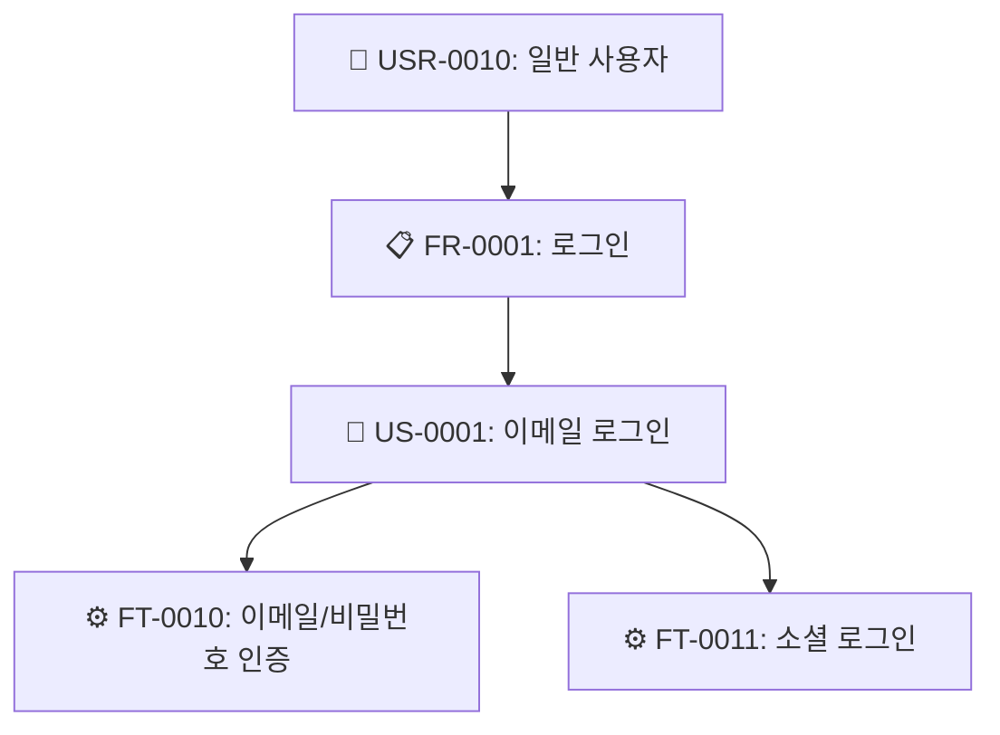
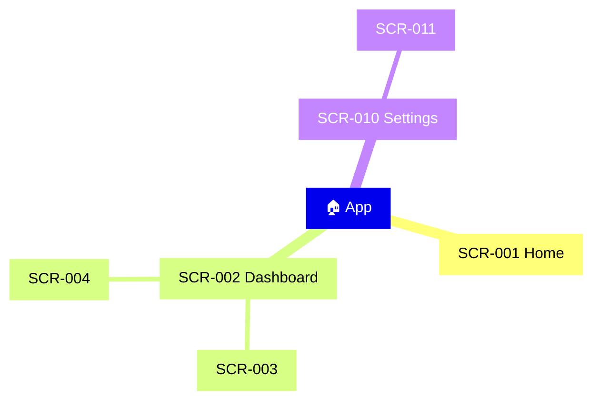
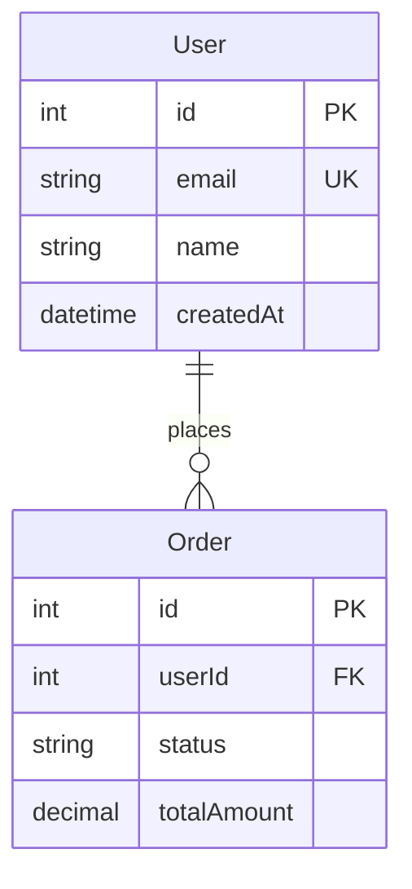
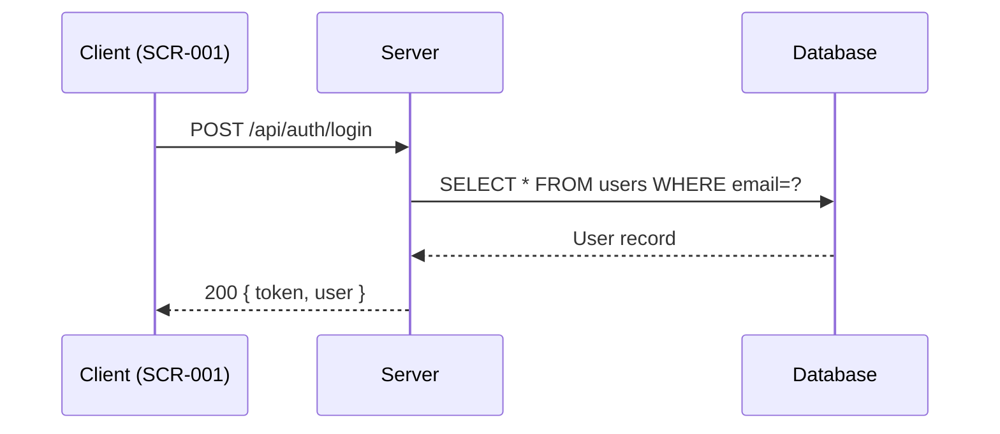

# u-browse -- Enriched SSoT Document Browser

`/u-browse [scope] [--only path] [--open]` 명령으로 `.u-maker/docs/` 하위의 SSoT 문서를 **분석·교차 참조·다이어그램이 포함된 리치 HTML**로 변환하고, **index.html** sidebar navigation으로 브라우징한다.

**Primary Agent:** u-agent-orchestrator

> **단순 변환이 아니다.** `.md`/`.json`을 그대로 렌더링하는 것이 아니라, 다른 문서를 교차 참조하고, JSON 데이터를 분석하여 다이어그램·통계·어노테이션을 자동 생성한 **리치 HTML**을 만든다.

---

## Arguments & Flags

| Argument/Flag | Required | Description |
|---------------|----------|-------------|
| `scope` | Optional | 대상 앱 이름. 생략 시 전체 앱 |
| `--only path` | - | 특정 경로만 변환 (예: `--only hjw/02-design`) |
| `--open` | - | 생성 후 `open` 명령으로 브라우저 자동 열기 |
| `--clean` | - | 기존 `_browse/` 삭제 후 재생성 |

---

## Output Structure

```
.u-maker/_browse/
├── index.html                          # 메인 뷰어 (sidebar + iframe)
├── hjw/
│   ├── 01-plan/
│   │   ├── srs.html                   # SRS 리치 HTML (계층 시각화, Use Case 다이어그램)
│   │   ├── ia.html                    # IA 리치 HTML (Mindmap, 화면 계층)
│   │   └── roadmap.html               # Roadmap 리치 HTML (Gantt chart)
│   ├── 02-design/
│   │   ├── erd.html                   # ERD 리치 HTML (ER 다이어그램, 엔티티 카드)
│   │   ├── api.html                   # API 리치 HTML (메서드 배지, Sequence 다이어그램)
│   │   ├── screens.html               # Screens 리치 HTML (컴포넌트 상세, 상태 다이어그램)
│   │   ├── screen-flow.html           # Screen Flow 리치 HTML (네비게이션 플로우차트)
│   │   ├── rtm.html                   # RTM 리치 HTML (커버리지 히트맵)
│   │   ├── design-token.html          # Design Token 리치 HTML (컬러 스워치, 타이포)
│   │   └── wireframes/
│   │       ├── index.html             # 와이어프레임 뷰어 인덱스
│   │       ├── SCR-001.html           # 와이어프레임 + 어노테이션 + 비즈니스 로직
│   │       ├── SCR-002.html
│   │       └── ...
│   ├── 03-dev/
│   │   └── ...
│   └── 04-check/
│       └── ...
└── ...
```

---

## ★ Execution Flow (MUST FOLLOW EXACTLY)

### Step 0: Load ALL Context (CRITICAL)

**모든 HTML 생성 전에, scope 내의 모든 문서를 먼저 읽어 메모리에 적재한다.**

1. `.u-maker/docs/{scope}/` 하위의 **모든 `.md`와 `.json`** 파일을 Read로 읽는다.
2. 특히 아래 핵심 JSON 파일들의 `data` 필드를 파싱하여 교차 참조 맵을 구성한다:

```
contextMap = {
  srs: { requirements: [...], userStories: [...], features: [...] },
  ia:  { siteMap: [...], screenHierarchy: [...], userFlows: [...] },
  erd: { entities: [...], relations: [...] },
  api: { endpoints: [...], errorCodes: [...] },
  screens: { screens: [...] },                    // 각 화면의 components, interactions, states
  screenFlow: { navigationMap: [...], journeyFlows: [...], transitionRules: [...] },
  rtm: { traceabilityRows: [...], frCoverage: [...], gaps: [...] },
  designToken: { brandColors: [...], semanticColors: [...], typographyScale: [...] }
}
```

3. **교차 참조 인덱스**를 구성한다:

```
// Feature → Screen 매핑
ftToScreens = { "FT-0010": ["SCR-001", "SCR-003"], ... }

// Screen → API 매핑 (screens.json의 interactions에서 API 호출 추출)
screenToApis = { "SCR-001": ["POST /api/auth/login", "GET /api/user/profile"], ... }

// Screen → Feature 매핑
screenToFts = { "SCR-001": ["FT-0010", "FT-0011"], ... }

// Entity → API 매핑 (API response schema에서 엔티티 추출)
entityToApis = { "User": ["GET /api/users", "POST /api/users"], ... }

// Screen → Screen Flow (from/to 전이 규칙)
screenFlows = { "SCR-001": { next: ["SCR-002", "SCR-003"], prev: ["SCR-010"] }, ... }

// Feature → Test Case 매핑
ftToTcs = { "FT-0010": ["TC-0001", "TC-0002"], ... }
```

이 컨텍스트는 이후 모든 Step에서 참조된다.

### Step 1: Discover Files & Create Directories

```bash
find .u-maker/docs/{scope} -type f \( -name "*.md" -o -name "*.json" -o -name "*.html" \) | sort
mkdir -p .u-maker/_browse/{scope}/{app}/01-plan
mkdir -p .u-maker/_browse/{scope}/{app}/02-design/wireframes
mkdir -p .u-maker/_browse/{scope}/{app}/03-dev
mkdir -p .u-maker/_browse/{scope}/{app}/04-check
```

### Step 2: Generate Enriched HTML per Document Type

**각 문서 타입별로 `.md` + `.json`을 함께 읽고, contextMap을 교차 참조하여 리치 HTML을 생성한다.**

---

#### 2-1. SRS → `srs.html`

**입력:** `srs.md` + `srs.json`
**교차 참조:** IA(화면 매핑), API(엔드포인트 매핑), Screens(FT 매핑)

**생성할 HTML 섹션:**

| 섹션 | 내용 | 다이어그램 |
|------|------|-----------|
| **Overview** | 프로젝트명, 설명, 대상 사용자, 플랫폼 | - |
| **Stakeholders** | 이해관계자 역할 매트릭스 | - |
| **Requirements** | FR 테이블 (ID, Title, Priority 배지, Status 배지, 관련 US/FT 수) | Priority 분포 `pie` chart |
| **NF Requirements** | NR 테이블 (category, title, metric) | - |
| **User Stories** | US 카드 (actor, action, benefit, acceptance criteria 체크리스트) | - |
| **Features** | FT 테이블 + 각 FT에 연결된 Screen, API, TC 링크 | Use Case `flowchart` |
| **Hierarchy** | USR → FR → US → FT 트리 시각화 | `flowchart TD` |
| **Coverage** | FR별 US/FT/Screen/TC 커버리지 바 | 커버리지 bar chart |

**다이어그램 생성 알고리즘 (Feature Hierarchy):**



JSON의 `requirements`, `userStories`, `features` 배열에서 `tracedFrom` 필드를 추적하여 자동 생성.

---

#### 2-2. IA → `ia.html`

**입력:** `ia.md` + `ia.json`
**교차 참조:** Screens(컴포넌트 수), SRS(FT 매핑)

**생성할 HTML 섹션:**

| 섹션 | 내용 | 다이어그램 |
|------|------|-----------|
| **Site Map** | 라우트 트리 (접기/펼치기) | `mindmap` |
| **Screen Hierarchy** | Level별 화면 테이블 + 와이어프레임 링크 | - |
| **Navigation Patterns** | 패턴별 적용 화면 매트릭스 | - |
| **User Flows** | 각 플로우의 단계별 화면 전이 | `flowchart LR` (per flow) |

**다이어그램 생성 (Site Map Mindmap):**

JSON의 `siteMap` 배열에서 `children` 재귀 순회하여:


---

#### 2-3. ERD → `erd.html`

**입력:** `erd.md` + `erd.json`
**교차 참조:** API(엔티티 사용 엔드포인트), Screens(데이터 바인딩)

**생성할 HTML 섹션:**

| 섹션 | 내용 | 다이어그램 |
|------|------|-----------|
| **ER Diagram** | 전체 엔티티 관계 시각화 | `erDiagram` |
| **Entity Cards** | 엔티티별 카드 (컬럼 목록, PK/FK 배지, 타입) | - |
| **Relationships** | 관계 테이블 (1:1, 1:N, M:N 배지) | - |
| **API Usage** | 각 엔티티가 사용되는 API 엔드포인트 목록 | - |
| **Screen Binding** | 각 엔티티가 바인딩된 화면 목록 | - |

**다이어그램 생성 (erDiagram):**

JSON의 `entities`와 `relations`에서 자동 생성:


---

#### 2-4. API → `api.html`

**입력:** `api.md` + `api.json`
**교차 참조:** ERD(응답 스키마 엔티티), Screens(호출 화면), SRS(FT 매핑)

**생성할 HTML 섹션:**

| 섹션 | 내용 | 다이어그램 |
|------|------|-----------|
| **Overview** | Base URL, Auth 방식, 버전 | - |
| **Endpoints** | 메서드 배지(GET🟢/POST🔵/PUT🟠/DELETE🔴) + path + 요약 | - |
| **Endpoint Detail** | 각 엔드포인트별: Request params, Body schema, Response schema, 호출 화면, 관련 FT | Sequence `sequenceDiagram` (주요 흐름) |
| **Error Codes** | 에러 코드 테이블 | - |
| **Screen Mapping** | 어떤 화면에서 어떤 API를 호출하는지 매트릭스 | - |

**메서드 배지 스타일:**

```html
<span class="method get">GET</span>
<span class="method post">POST</span>
<span class="method put">PUT</span>
<span class="method delete">DELETE</span>
```

CSS: `.method.get { background: #22c55e; }` `.method.post { background: #3b82f6; }` `.method.put { background: #f59e0b; }` `.method.delete { background: #ef4444; }`

**Sequence Diagram (주요 API 흐름):**



---

#### 2-5. Screens → `screens.html`

**입력:** `screens.md` + `screens.json`
**교차 참조:** IA(계층), API(호출 엔드포인트), SRS(FT), Screen Flow(전이), ERD(데이터)

**생성할 HTML 섹션:**

| 섹션 | 내용 | 다이어그램 |
|------|------|-----------|
| **Screen List** | 전체 화면 목록 (ID, 이름, 라우트, FT 링크, 와이어프레임 링크) | - |
| **Screen Cards** | 화면별 상세 카드: | |
| ↳ Components | 컴포넌트 테이블 (name, type 배지, interaction 설명) | - |
| ↳ Interactions | 트리거 → 엘리먼트 → 액션 (API 호출 포함) | - |
| ↳ States | 화면 상태 목록 (조건 → 표시 방식) | `stateDiagram-v2` |
| ↳ Related APIs | 이 화면에서 호출하는 API 엔드포인트 목록 | - |
| ↳ Related Data | 이 화면에 바인딩된 ERD 엔티티 | - |
| ↳ Navigation | 이 화면으로의 진입/이탈 경로 (Screen Flow 참조) | - |
| **Responsive** | 브레이크포인트별 레이아웃 변화 | - |

---

#### 2-6. Screen Flow → `screen-flow.html`

**입력:** `screen-flow.md` + `screen-flow.json`
**교차 참조:** Screens(화면 상세), IA(계층)

**생성할 HTML 섹션:**

| 섹션 | 내용 | 다이어그램 |
|------|------|-----------|
| **Navigation Map** | 전체 화면 전이 | `flowchart TD` |
| **Journey Flows** | 사용자 여정별 상세 플로우 | `flowchart LR` (per journey) |
| **Transition Rules** | From → To 테이블 (trigger, guard condition, side effect) | - |

---

#### 2-7. RTM → `rtm.html`

**입력:** `rtm.md` + `rtm.json`
**교차 참조:** 전체 (SRS, IA, ERD, API, Screens, TC)

**생성할 HTML 섹션:**

| 섹션 | 내용 | 다이어그램 |
|------|------|-----------|
| **Traceability Matrix** | FR → US → FT → Screen → API → TC 전체 매핑 테이블 | - |
| **Coverage Dashboard** | FR별 커버리지 % (색상 코딩: 100%=🟢, 50-99%=🟡, <50%=🔴) | `pie` chart |
| **Gaps** | 미매핑 항목 경고 리스트 (severity 배지) | - |
| **Statistics** | 총 FR/US/FT/Screen/TC 수, 커버리지 요약 | bar chart |

---

#### 2-8. Design Token → `design-token.html`

**입력:** `design-token.md` + `design-token.json`

**생성할 HTML 섹션:**

| 섹션 | 내용 |
|------|------|
| **Color Palette** | 컬러 스워치 (hex 미리보기 박스 + 이름 + 용도) |
| **Typography** | 타이포 스케일 (실제 폰트 크기/두께로 렌더링) |
| **Spacing** | 스페이싱 시스템 (실제 크기 박스 시각화) |
| **Design Principles** | 원칙 카드 (Do / Don't) |

---

### ★ Step 3: Generate Wireframe HTML (가장 중요)

**각 SCR-NNN 와이어프레임은 단순 UI 목업이 아니라, 분석된 컨텍스트가 포함된 리치 문서이다.**

**입력 소스 (교차 참조):**
- `screens.json` → 해당 화면의 components, interactions, states
- `screen-flow.json` → 해당 화면의 진입/이탈 경로, 전이 규칙
- `api.json` → 해당 화면에서 호출하는 API 엔드포인트
- `srs.json` → 해당 화면에 매핑된 Feature(FT)의 비즈니스 로직
- `erd.json` → 해당 화면에 바인딩된 데이터 엔티티
- `rtm.json` → 해당 화면의 추적성 매핑

**와이어프레임 HTML 레이아웃:**

```
┌──────────────────────────────────────────────────────────────────┐
│ SCR-001: 로그인 화면                               [← Prev] [Next →] │
│ Route: /login  |  FT: FT-0010, FT-0011  |  Status: Final        │
├──────────────────────────────────┬───────────────────────────────┤
│                                  │  📋 Description                │
│                                  │  사용자가 이메일/비밀번호 또는   │
│    ┌─────────────────────┐      │  소셜 계정으로 로그인하는 화면   │
│    │                     │      │                               │
│    │   🏢 Logo           │      ├───────────────────────────────┤
│    │                     │      │  🔘 Components                 │
│    │  ┌───────────────┐  │      │  • TextInput: email (필수)     │
│    │  │ Email         │  │      │  • TextInput: password (필수)  │
│    │  └───────────────┘  │      │  • Button: login (primary)    │
│    │  ┌───────────────┐  │      │  • Button: socialLogin        │
│    │  │ Password      │  │      │  • Link: forgotPassword       │
│    │  └───────────────┘  │      │  • Link: register             │
│    │                     │      │                               │
│    │  [  🔵 로그인  ]    │      ├───────────────────────────────┤
│    │                     │      │  ⚡ Button Actions             │
│    │  ── 또는 ──         │      │                               │
│    │                     │      │  🔵 로그인 버튼:               │
│    │  [G] [K] [N]       │      │    → POST /api/auth/login     │
│    │  소셜 로그인        │      │    → 성공: SCR-002 (Dashboard)│
│    │                     │      │    → 실패: 에러 메시지 표시    │
│    │  비밀번호 찾기       │      │    → Validation: email format,│
│    │  회원가입            │      │      password min 8자         │
│    │                     │      │                               │
│    └─────────────────────┘      │  🔗 소셜 로그인:              │
│                                  │    → GET /api/auth/{provider} │
│    (와이어프레임 영역)            │    → 성공: SCR-002            │
│                                  │    → 실패: 에러 모달          │
│                                  │                               │
│                                  │  📎 비밀번호 찾기:            │
│                                  │    → navigate: SCR-015        │
│                                  │                               │
│                                  │  📎 회원가입:                 │
│                                  │    → navigate: SCR-020        │
│                                  │                               │
├──────────────────────────────────┼───────────────────────────────┤
│  🔀 Screen Flow                  │  💬 Popups & Modals           │
│                                  │                               │
│  ┌─────┐    ┌─────────┐        │  ⚠️ 로그인 실패 모달:          │
│  │Splash│───▶│SCR-001 │        │    조건: 401 응답              │
│  │      │    │ Login   │        │    내용: "이메일 또는 비밀번호가│
│  └─────┘    └────┬────┘        │           올바르지 않습니다"    │
│                   │              │    버튼: [확인] → 포커스 email │
│              ┌────▼────┐        │                               │
│              │SCR-002  │        │  🔄 로딩 오버레이:             │
│              │Dashboard│        │    조건: API 호출 중           │
│              └─────────┘        │    내용: 스피너 + "로그인 중..." │
│                                  │                               │
├──────────────────────────────────┼───────────────────────────────┤
│  📊 Business Logic               │  🗃️ Data Entities             │
│                                  │                               │
│  FT-0010: 이메일/비밀번호 인증    │  User                         │
│  • email + password 입력          │  ├ id (PK)                   │
│  • 서버 인증 → JWT 발급           │  ├ email (UK)                │
│  • 토큰 로컬 스토리지 저장         │  ├ password (hashed)         │
│  • 5회 실패 시 10분 잠금           │  ├ name                     │
│                                  │  └ lastLoginAt               │
│  FT-0011: 소셜 로그인             │                               │
│  • Google/Kakao/Naver OAuth       │  Session                     │
│  • 미가입 사용자 자동 회원가입      │  ├ id (PK)                   │
│  • 기존 계정 연동                  │  ├ userId (FK → User)        │
│                                  │  ├ token                     │
│                                  │  └ expiresAt                 │
└──────────────────────────────────┴───────────────────────────────┘
```

**와이어프레임 HTML 생성 알고리즘:**

각 `SCR-NNN`에 대해:

1. **Screen Info** — `screens.json`에서 해당 SCR의 `name`, `route`, `description`, `tracedFrom` 추출
2. **Components** — `screens.json`의 `components` 배열에서 name, type, interaction 추출
3. **Button Actions** — `components`에서 type=button/link인 항목의 `interaction`을 분석:
   - API 호출이면 → `api.json`에서 해당 엔드포인트의 request/response 정보 포함
   - 네비게이션이면 → `screen-flow.json`에서 대상 화면 정보 포함
   - 상태 변경이면 → `screens.json`의 `states`에서 조건/표시 정보 포함
4. **Screen Flow** — `screen-flow.json`의 `navigationMap`에서 이 화면의 진입/이탈 경로 추출 → Mermaid `flowchart` 생성
5. **Business Logic** — `srs.json`에서 `tracedFrom` FT의 상위 US, FR 추출하여 비즈니스 규칙 표시
6. **Popups & Modals** — `screens.json`의 `interactions`에서 action에 "modal", "popup", "alert", "confirm", "toast" 포함된 항목 추출
7. **Data Entities** — `erd.json`에서 이 화면이 사용하는 엔티티 추출 (API response schema의 엔티티명으로 매핑)
8. **Wireframe Area** — 기존 wireframe HTML이 있으면 `<iframe>`으로 임베드, 없으면 `components`를 기반으로 간략 UI 목업 생성
9. **Navigation** — 이전/다음 화면 링크 (IA의 screenHierarchy 순서)

**와이어프레임 페이지 HTML 구조:**

```html
<!DOCTYPE html>
<html lang="ko">
<head>
<meta charset="UTF-8">
<meta name="viewport" content="width=device-width, initial-scale=1.0">
<title>{{SCR_ID}}: {{SCR_NAME}} — Wireframe</title>
<script src="https://cdn.jsdelivr.net/npm/mermaid@11/dist/mermaid.min.js"></script>
<style>
  /* --- 와이어프레임 페이지 전용 스타일 --- */
  * { margin:0; padding:0; box-sizing:border-box; }
  body { font-family: -apple-system, BlinkMacSystemFont, 'Segoe UI', Roboto, sans-serif; color: #1e293b; background: #f8fafc; }

  .wf-header { background: #1e293b; color: #f1f5f9; padding: 12px 24px; display: flex; justify-content: space-between; align-items: center; }
  .wf-header h1 { font-size: 16px; font-weight: 600; }
  .wf-header .meta { font-size: 12px; color: #94a3b8; }
  .wf-header .nav-btns a { color: #38bdf8; text-decoration: none; font-size: 13px; margin-left: 12px; }

  .wf-tags { padding: 8px 24px; background: #f1f5f9; display: flex; gap: 8px; flex-wrap: wrap; border-bottom: 1px solid #e2e8f0; }
  .tag { display: inline-block; padding: 2px 10px; border-radius: 9999px; font-size: 11px; font-weight: 600; }
  .tag.ft { background: #dbeafe; color: #1d4ed8; }
  .tag.route { background: #f0fdf4; color: #166534; }
  .tag.status { background: #fef3c7; color: #92400e; }

  .wf-body { display: grid; grid-template-columns: 1fr 360px; min-height: calc(100vh - 100px); }
  .wf-main { padding: 24px; display: flex; flex-direction: column; gap: 24px; }
  .wf-sidebar { background: #ffffff; border-left: 1px solid #e2e8f0; overflow-y: auto; }

  /* Wireframe preview area */
  .wf-preview { background: #ffffff; border: 2px dashed #cbd5e1; border-radius: 12px; min-height: 400px; padding: 24px; display: flex; align-items: center; justify-content: center; }
  .wf-preview iframe { width: 100%; min-height: 500px; border: none; border-radius: 8px; }

  /* Bottom panels */
  .wf-panels { display: grid; grid-template-columns: 1fr 1fr; gap: 16px; }
  .panel { background: #ffffff; border-radius: 12px; border: 1px solid #e2e8f0; overflow: hidden; }
  .panel-header { padding: 10px 16px; background: #f8fafc; border-bottom: 1px solid #e2e8f0; font-size: 13px; font-weight: 600; display: flex; align-items: center; gap: 6px; }
  .panel-body { padding: 12px 16px; font-size: 13px; line-height: 1.6; }

  /* Sidebar sections */
  .sb-section { border-bottom: 1px solid #f1f5f9; }
  .sb-section-title { padding: 10px 16px; font-size: 12px; font-weight: 700; text-transform: uppercase; color: #64748b; background: #f8fafc; cursor: pointer; display: flex; justify-content: space-between; }
  .sb-section-title::after { content: '▼'; font-size: 9px; }
  .sb-section.collapsed .sb-section-title::after { content: '▶'; }
  .sb-section.collapsed .sb-section-body { display: none; }
  .sb-section-body { padding: 12px 16px; font-size: 13px; }

  /* Component list */
  .comp-item { display: flex; align-items: center; gap: 8px; padding: 4px 0; }
  .comp-type { font-size: 10px; padding: 1px 6px; border-radius: 4px; font-weight: 600; }
  .comp-type.button { background: #dbeafe; color: #1d4ed8; }
  .comp-type.input { background: #fef3c7; color: #92400e; }
  .comp-type.link { background: #f0fdf4; color: #166534; }
  .comp-type.modal { background: #fce7f3; color: #9d174d; }
  .comp-type.table { background: #e0e7ff; color: #3730a3; }
  .comp-type.card { background: #f5f3ff; color: #6d28d9; }

  /* Action items */
  .action-item { padding: 8px 0; border-bottom: 1px solid #f1f5f9; }
  .action-trigger { font-weight: 600; color: #1e293b; }
  .action-detail { font-size: 12px; color: #64748b; margin-top: 2px; }
  .action-api { display: inline-block; font-family: monospace; font-size: 11px; background: #1e293b; color: #e2e8f0; padding: 1px 6px; border-radius: 3px; }
  .action-nav { color: #2563eb; text-decoration: none; }

  /* Entity mini card */
  .entity-card { background: #f8fafc; border-radius: 6px; padding: 8px; margin: 4px 0; border: 1px solid #e2e8f0; }
  .entity-name { font-weight: 600; font-size: 13px; }
  .entity-cols { font-size: 11px; color: #64748b; }

  /* Mermaid */
  .mermaid { text-align: center; margin: 8px 0; }

  /* Popup list */
  .popup-item { padding: 8px 0; border-bottom: 1px solid #f1f5f9; }
  .popup-condition { font-size: 11px; color: #f59e0b; }
  .popup-content { font-size: 12px; margin-top: 2px; }

  /* Responsive */
  @media (max-width: 900px) {
    .wf-body { grid-template-columns: 1fr; }
    .wf-sidebar { border-left: none; border-top: 1px solid #e2e8f0; }
    .wf-panels { grid-template-columns: 1fr; }
  }
  @media print { .wf-header { background: #fff; color: #000; } }
</style>
</head>
<body>
<header class="wf-header">
  <div>
    <h1>{{SCR_ID}}: {{SCR_NAME}}</h1>
    <div class="meta">Route: {{ROUTE}} | {{DESCRIPTION_SHORT}}</div>
  </div>
  <div class="nav-btns">
    <a href="{{PREV_LINK}}">← {{PREV_NAME}}</a>
    <a href="{{NEXT_LINK}}">{{NEXT_NAME}} →</a>
    <a href="{{INDEX_PATH}}" target="_top">☰ Index</a>
  </div>
</header>
<div class="wf-tags">
  {{#FEATURES}}<span class="tag ft">{{FT_ID}}</span>{{/FEATURES}}
  <span class="tag route">{{ROUTE}}</span>
  <span class="tag status">{{STATUS}}</span>
</div>

<div class="wf-body">
  <div class="wf-main">
    <!-- Wireframe Preview -->
    <div class="wf-preview">
      {{WIREFRAME_CONTENT}}
      <!-- iframe으로 기존 wireframe 임베드, 또는 컴포넌트 기반 목업 -->
    </div>

    <!-- Bottom Panels: Screen Flow + Business Logic -->
    <div class="wf-panels">
      <div class="panel">
        <div class="panel-header">🔀 Screen Flow</div>
        <div class="panel-body">
          <div class="mermaid">{{SCREEN_FLOW_MERMAID}}</div>
        </div>
      </div>
      <div class="panel">
        <div class="panel-header">📊 Business Logic</div>
        <div class="panel-body">{{BUSINESS_LOGIC_HTML}}</div>
      </div>
    </div>
  </div>

  <!-- Right Sidebar -->
  <div class="wf-sidebar">
    <div class="sb-section">
      <div class="sb-section-title" onclick="this.parentElement.classList.toggle('collapsed')">📋 Description</div>
      <div class="sb-section-body">{{DESCRIPTION_FULL}}</div>
    </div>
    <div class="sb-section">
      <div class="sb-section-title" onclick="this.parentElement.classList.toggle('collapsed')">🔘 Components ({{COMP_COUNT}})</div>
      <div class="sb-section-body">{{COMPONENTS_HTML}}</div>
    </div>
    <div class="sb-section">
      <div class="sb-section-title" onclick="this.parentElement.classList.toggle('collapsed')">⚡ Button Actions</div>
      <div class="sb-section-body">{{ACTIONS_HTML}}</div>
    </div>
    <div class="sb-section">
      <div class="sb-section-title" onclick="this.parentElement.classList.toggle('collapsed')">💬 Popups & Modals</div>
      <div class="sb-section-body">{{POPUPS_HTML}}</div>
    </div>
    <div class="sb-section">
      <div class="sb-section-title" onclick="this.parentElement.classList.toggle('collapsed')">🗃️ Data Entities</div>
      <div class="sb-section-body">{{ENTITIES_HTML}}</div>
    </div>
  </div>
</div>

<script>
  mermaid.initialize({ startOnLoad: true, theme: 'default' });
</script>
</body>
</html>
```

**플레이스홀더 생성 규칙:**

| 플레이스홀더 | 소스 | 생성 방법 |
|---|---|---|
| `{{SCR_ID}}` | screens.json → id | 직접 사용 |
| `{{SCR_NAME}}` | screens.json → name | 직접 사용 |
| `{{ROUTE}}` | screens.json → route | 직접 사용 |
| `{{DESCRIPTION_FULL}}` | screens.json → description | 직접 사용 |
| `{{FEATURES}}` | screens.json → tracedFrom | FT ID 배열 → 태그 반복 |
| `{{COMPONENTS_HTML}}` | screens.json → components | 각 컴포넌트를 `.comp-item`로 렌더링 |
| `{{ACTIONS_HTML}}` | screens.json → interactions (type=button/link) + api.json | 각 액션을 `.action-item`로 렌더링. API 호출이면 메서드+경로+응답 포함 |
| `{{POPUPS_HTML}}` | screens.json → interactions에서 modal/popup/alert 필터 | 각 팝업을 `.popup-item`로 렌더링. 트리거 조건 + 내용 + 버튼 |
| `{{SCREEN_FLOW_MERMAID}}` | screen-flow.json → navigationMap에서 이 SCR 관련 전이만 추출 | `flowchart TD` 코드 생성. 현재 화면은 강조 스타일 |
| `{{BUSINESS_LOGIC_HTML}}` | srs.json → features에서 tracedFrom FT 매핑된 항목 | FT별 제목 + 설명 + acceptance criteria |
| `{{ENTITIES_HTML}}` | erd.json → 이 화면의 API 응답 스키마에 포함된 엔티티 | `.entity-card`로 렌더링 (엔티티명 + 주요 컬럼) |
| `{{WIREFRAME_CONTENT}}` | 기존 wireframes/*.html이 있으면 iframe, 없으면 components 기반 목업 | `<iframe src="...">` 또는 컴포넌트 div 생성 |
| `{{PREV_LINK}}`, `{{NEXT_LINK}}` | IA screenHierarchy 순서에서 이전/다음 | 상대 경로 href |

---

### Step 4: Generate index.html (Main Viewer)

모든 파일 변환이 끝난 후, sidebar 파일 트리를 구성하여 index.html을 생성한다.

**FILES 배열 구성:**

```javascript
const FILES = [
  { path: "hjw/01-plan/srs.html", type: "doc", name: "SRS", dir: "hjw/01-plan", icon: "📋", docType: "srs" },
  { path: "hjw/01-plan/ia.html", type: "doc", name: "IA", dir: "hjw/01-plan", icon: "🗺️", docType: "ia" },
  { path: "hjw/02-design/erd.html", type: "doc", name: "ERD", dir: "hjw/02-design", icon: "🗃️", docType: "erd" },
  { path: "hjw/02-design/api.html", type: "doc", name: "API", dir: "hjw/02-design", icon: "🔌", docType: "api" },
  { path: "hjw/02-design/screens.html", type: "doc", name: "Screens", dir: "hjw/02-design", icon: "📱", docType: "screens" },
  { path: "hjw/02-design/screen-flow.html", type: "doc", name: "Screen Flow", dir: "hjw/02-design", icon: "🔀", docType: "screen-flow" },
  { path: "hjw/02-design/rtm.html", type: "doc", name: "RTM", dir: "hjw/02-design", icon: "📊", docType: "rtm" },
  { path: "hjw/02-design/wireframes/SCR-001.html", type: "wireframe", name: "SCR-001: 로그인", dir: "hjw/02-design/wireframes", icon: "🖼️" },
  { path: "hjw/02-design/wireframes/SCR-002.html", type: "wireframe", name: "SCR-002: 대시보드", dir: "hjw/02-design/wireframes", icon: "🖼️" },
  // ...
];
```

**INDEX_TEMPLATE:**

index.html은 이전 버전과 동일한 구조이되, `buildTree` 함수를 아래처럼 수정:

```javascript
// Build tree — 반드시 이 로직 사용
function buildTree() {
  const tree = { __files: [] };
  FILES.forEach(f => {
    const parts = f.dir.split('/').filter(Boolean);
    let node = tree;
    parts.forEach(p => {
      if (!node[p]) node[p] = { __files: [] };
      node = node[p];
    });
    node.__files.push(f);
  });
  return tree;
}
```

sidebar 파일 항목에 `icon` 필드를 반영하고, wireframe 항목은 🖼️ 아이콘으로 구분:

```javascript
const a = document.createElement('a');
a.className = 'tree-file';
a.innerHTML = '<span class="icon">' + f.icon + '</span> ' + f.name;
```

### Step 5: Verify & Open

```bash
find .u-maker/_browse -name "*.html" | wc -l
```

`--open` 플래그:
```bash
open .u-maker/_browse/index.html
```

---

## ★ CRITICAL IMPLEMENTATION RULES

1. **반드시 모든 컨텍스트를 먼저 로드.** Step 0에서 scope의 모든 .md/.json을 읽은 후에야 HTML 생성을 시작한다.
2. **교차 참조 필수.** 각 문서 HTML에는 다른 문서의 관련 정보가 반드시 포함되어야 한다.
3. **다이어그램 자동 생성.** JSON 데이터를 분석하여 Mermaid 코드를 자동 생성한다. 원본 .md의 다이어그램을 복사하는 것이 아니다.
4. **와이어프레임은 리치 문서.** 단순 UI 목업이 아니라, 어노테이션·액션·흐름·로직·팝업·엔티티가 포함된 종합 문서를 생성한다.
5. **Write 도구로 실제 파일 생성.** 분석이나 설명만으로 끝내지 않는다.
6. **병렬 처리.** 독립적인 파일 변환은 여러 Write 호출을 동시에 수행한다.
7. **소스 문서 READ-ONLY.** 원본 .md/.json을 절대 수정하지 않는다.
8. **`_browse/` 디렉토리만 쓰기.** 다른 경로에 파일을 생성하지 않는다.

---

## Safety Rules

1. **소스 문서 무수정:** `.md` / `.json` / `.html` 파일은 읽기만 수행 (READ-ONLY)
2. **`_browse/` 디렉토리만 쓰기:** 생성 파일은 `.u-maker/_browse/` 하위에만 생성
3. **인라인 리소스:** 외부 의존성 없는 단일 HTML (Mermaid.js CDN만 예외)
4. **민감 정보 제외:** `.env` 값, 하드코딩 시크릿은 변환에 포함하지 않음
5. **기존 파일 덮어쓰기:** 기존 `_browse/`는 경고 없이 덮어쓰기 (스냅샷 개념)
6. **독립 실행 가능:** 각 개별 HTML은 index.html 없이도 단독으로 열람 가능해야 함
