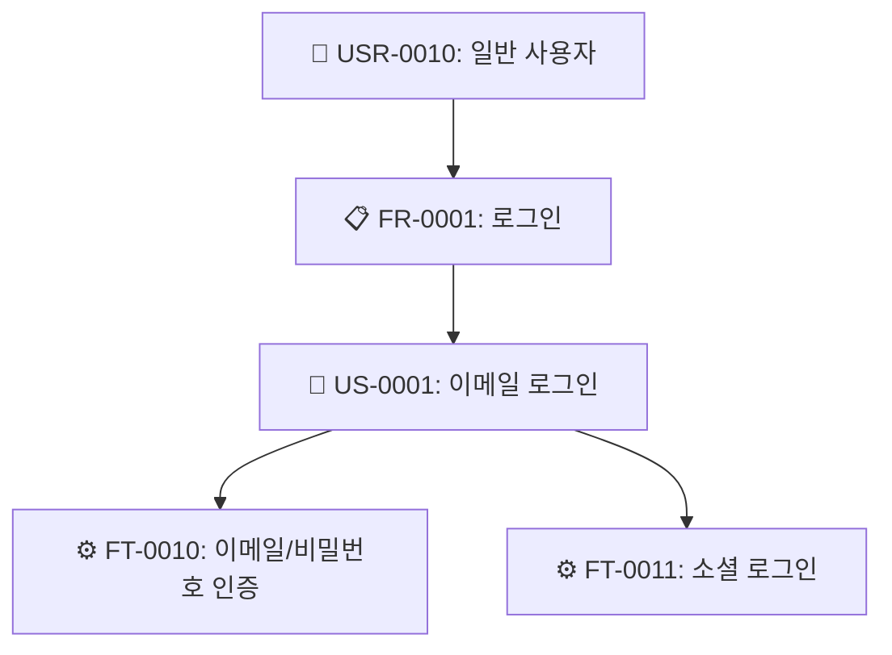
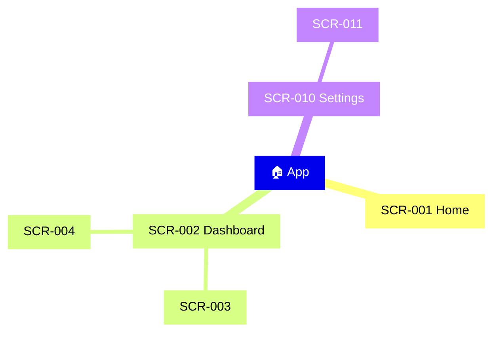
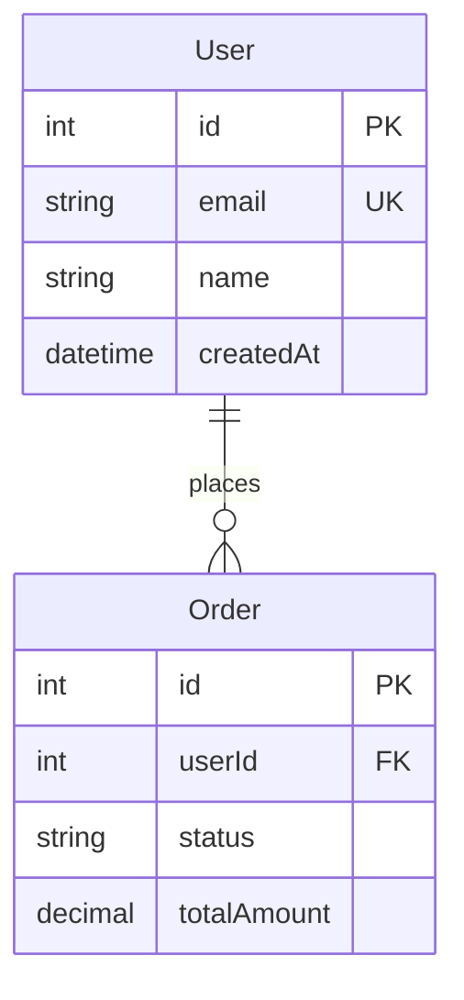
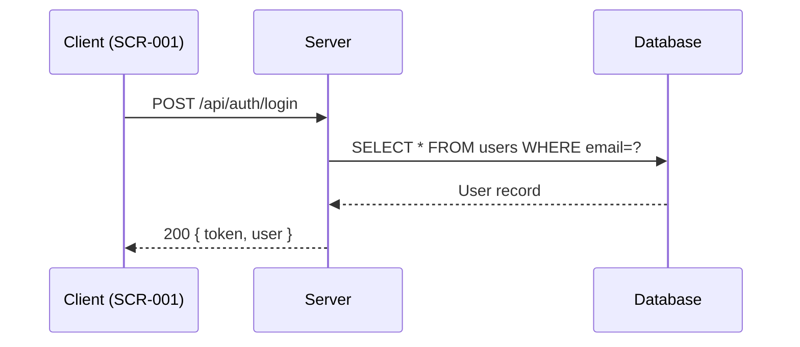

# u-browse -- Enriched SSoT Document Browser

`/u-browse [scope] [--only path] [--open]` 명령으로 `.u-maker/docs/` 하위의 SSoT 문서를 **분석·교차 참조·다이어그램이 포함된 리치 HTML**로 변환하고, **index.html** sidebar navigation으로 브라우징한다.

**Primary Agent:** u-agent-orchestrator

> **단순 변환이 아니다.** `.md`/`.json`을 그대로 렌더링하는 것이 아니라, 다른 문서를 교차 참조하고, JSON 데이터를 분석하여 다이어그램·통계·어노테이션을 자동 생성한 **리치 HTML**을 만든다.

---

## Arguments & Flags

| Argument/Flag | Required | Description |
|---------------|----------|-------------|
| `scope` | Optional | 대상 앱 이름. 생략 시 전체 앱 |
| `--only path` | - | 특정 경로만 변환 (예: `--only hjw/02-design`) |
| `--open` | - | 생성 후 `open` 명령으로 브라우저 자동 열기 |
| `--clean` | - | 기존 `_browse/` 삭제 후 재생성 |

---

## Output Structure

```
.u-maker/_browse/
├── index.html                          # 메인 뷰어 (sidebar + iframe)
├── hjw/
│   ├── 01-plan/
│   │   ├── srs.html                   # SRS 리치 HTML (계층 시각화, Use Case 다이어그램)
│   │   ├── ia.html                    # IA 리치 HTML (Mindmap, 화면 계층)
│   │   └── roadmap.html               # Roadmap 리치 HTML (Gantt chart)
│   ├── 02-design/
│   │   ├── erd.html                   # ERD 리치 HTML (ER 다이어그램, 엔티티 카드)
│   │   ├── api.html                   # API 리치 HTML (메서드 배지, Sequence 다이어그램)
│   │   ├── screens.html               # Screens 리치 HTML (컴포넌트 상세, 상태 다이어그램)
│   │   ├── screen-flow.html           # Screen Flow 리치 HTML (네비게이션 플로우차트)
│   │   ├── rtm.html                   # RTM 리치 HTML (커버리지 히트맵)
│   │   ├── design-token.html          # Design Token 리치 HTML (컬러 스워치, 타이포)
│   │   └── wireframes/
│   │       ├── index.html             # 와이어프레임 뷰어 인덱스
│   │       ├── SCR-001.html           # 와이어프레임 + 어노테이션 + 비즈니스 로직
│   │       ├── SCR-002.html
│   │       └── ...
│   ├── 03-dev/
│   │   └── ...
│   └── 04-check/
│       └── ...
└── ...
```

---

## ★ Execution Flow (MUST FOLLOW EXACTLY)

### Step 0: Load ALL Context (CRITICAL)

**모든 HTML 생성 전에, scope 내의 모든 문서를 먼저 읽어 메모리에 적재한다.**

1. `.u-maker/docs/{scope}/` 하위의 **모든 `.md`와 `.json`** 파일을 Read로 읽는다.
2. 특히 아래 핵심 JSON 파일들의 `data` 필드를 파싱하여 교차 참조 맵을 구성한다:

```
contextMap = {
  srs: { requirements: [...], userStories: [...], features: [...] },
  ia:  { siteMap: [...], screenHierarchy: [...], userFlows: [...] },
  erd: { entities: [...], relations: [...] },
  api: { endpoints: [...], errorCodes: [...] },
  screens: { screens: [...] },                    // 각 화면의 components, interactions, states
  screenFlow: { navigationMap: [...], journeyFlows: [...], transitionRules: [...] },
  rtm: { traceabilityRows: [...], frCoverage: [...], gaps: [...] },
  designToken: { brandColors: [...], semanticColors: [...], typographyScale: [...] }
}
```

3. **교차 참조 인덱스**를 구성한다:

```
// Feature → Screen 매핑
ftToScreens = { "FT-0010": ["SCR-001", "SCR-003"], ... }

// Screen → API 매핑 (screens.json의 interactions에서 API 호출 추출)
screenToApis = { "SCR-001": ["POST /api/auth/login", "GET /api/user/profile"], ... }

// Screen → Feature 매핑
screenToFts = { "SCR-001": ["FT-0010", "FT-0011"], ... }

// Entity → API 매핑 (API response schema에서 엔티티 추출)
entityToApis = { "User": ["GET /api/users", "POST /api/users"], ... }

// Screen → Screen Flow (from/to 전이 규칙)
screenFlows = { "SCR-001": { next: ["SCR-002", "SCR-003"], prev: ["SCR-010"] }, ... }

// Feature → Test Case 매핑
ftToTcs = { "FT-0010": ["TC-0001", "TC-0002"], ... }
```

이 컨텍스트는 이후 모든 Step에서 참조된다.

### Step 1: Discover Files & Create Directories

```bash
find .u-maker/docs/{scope} -type f \( -name "*.md" -o -name "*.json" -o -name "*.html" \) | sort
mkdir -p .u-maker/_browse/{scope}/{app}/01-plan
mkdir -p .u-maker/_browse/{scope}/{app}/02-design/wireframes
mkdir -p .u-maker/_browse/{scope}/{app}/03-dev
mkdir -p .u-maker/_browse/{scope}/{app}/04-check
```

### Step 2: Generate Enriched HTML per Document Type

**각 문서 타입별로 `.md` + `.json`을 함께 읽고, contextMap을 교차 참조하여 리치 HTML을 생성한다.**

---

#### 2-1. SRS → `srs.html`

**입력:** `srs.md` + `srs.json`
**교차 참조:** IA(화면 매핑), API(엔드포인트 매핑), Screens(FT 매핑)

**생성할 HTML 섹션:**

| 섹션 | 내용 | 다이어그램 |
|------|------|-----------|
| **Overview** | 프로젝트명, 설명, 대상 사용자, 플랫폼 | - |
| **Stakeholders** | 이해관계자 역할 매트릭스 | - |
| **Requirements** | FR 테이블 (ID, Title, Priority 배지, Status 배지, 관련 US/FT 수) | Priority 분포 `pie` chart |
| **NF Requirements** | NR 테이블 (category, title, metric) | - |
| **User Stories** | US 카드 (actor, action, benefit, acceptance criteria 체크리스트) | - |
| **Features** | FT 테이블 + 각 FT에 연결된 Screen, API, TC 링크 | Use Case `flowchart` |
| **Hierarchy** | USR → FR → US → FT 트리 시각화 | `flowchart TD` |
| **Coverage** | FR별 US/FT/Screen/TC 커버리지 바 | 커버리지 bar chart |

**다이어그램 생성 알고리즘 (Feature Hierarchy):**



JSON의 `requirements`, `userStories`, `features` 배열에서 `tracedFrom` 필드를 추적하여 자동 생성.

---

#### 2-2. IA → `ia.html`

**입력:** `ia.md` + `ia.json`
**교차 참조:** Screens(컴포넌트 수), SRS(FT 매핑)

**생성할 HTML 섹션:**

| 섹션 | 내용 | 다이어그램 |
|------|------|-----------|
| **Site Map** | 라우트 트리 (접기/펼치기) | `mindmap` |
| **Screen Hierarchy** | Level별 화면 테이블 + 와이어프레임 링크 | - |
| **Navigation Patterns** | 패턴별 적용 화면 매트릭스 | - |
| **User Flows** | 각 플로우의 단계별 화면 전이 | `flowchart LR` (per flow) |

**다이어그램 생성 (Site Map Mindmap):**

JSON의 `siteMap` 배열에서 `children` 재귀 순회하여:


---

#### 2-3. ERD → `erd.html`

**입력:** `erd.md` + `erd.json`
**교차 참조:** API(엔티티 사용 엔드포인트), Screens(데이터 바인딩)

**생성할 HTML 섹션:**

| 섹션 | 내용 | 다이어그램 |
|------|------|-----------|
| **ER Diagram** | 전체 엔티티 관계 시각화 | `erDiagram` |
| **Entity Cards** | 엔티티별 카드 (컬럼 목록, PK/FK 배지, 타입) | - |
| **Relationships** | 관계 테이블 (1:1, 1:N, M:N 배지) | - |
| **API Usage** | 각 엔티티가 사용되는 API 엔드포인트 목록 | - |
| **Screen Binding** | 각 엔티티가 바인딩된 화면 목록 | - |

**다이어그램 생성 (erDiagram):**

JSON의 `entities`와 `relations`에서 자동 생성:


---

#### 2-4. API → `api.html`

**입력:** `api.md` + `api.json`
**교차 참조:** ERD(응답 스키마 엔티티), Screens(호출 화면), SRS(FT 매핑)

**생성할 HTML 섹션:**

| 섹션 | 내용 | 다이어그램 |
|------|------|-----------|
| **Overview** | Base URL, Auth 방식, 버전 | - |
| **Endpoints** | 메서드 배지(GET🟢/POST🔵/PUT🟠/DELETE🔴) + path + 요약 | - |
| **Endpoint Detail** | 각 엔드포인트별: Request params, Body schema, Response schema, 호출 화면, 관련 FT | Sequence `sequenceDiagram` (주요 흐름) |
| **Error Codes** | 에러 코드 테이블 | - |
| **Screen Mapping** | 어떤 화면에서 어떤 API를 호출하는지 매트릭스 | - |

**메서드 배지 스타일:**

```html
<span class="method get">GET</span>
<span class="method post">POST</span>
<span class="method put">PUT</span>
<span class="method delete">DELETE</span>
```

CSS: `.method.get { background: #22c55e; }` `.method.post { background: #3b82f6; }` `.method.put { background: #f59e0b; }` `.method.delete { background: #ef4444; }`

**Sequence Diagram (주요 API 흐름):**



---

#### 2-5. Screens → `screens.html`

**입력:** `screens.md` + `screens.json`
**교차 참조:** IA(계층), API(호출 엔드포인트), SRS(FT), Screen Flow(전이), ERD(데이터)

**생성할 HTML 섹션:**

| 섹션 | 내용 | 다이어그램 |
|------|------|-----------|
| **Screen List** | 전체 화면 목록 (ID, 이름, 라우트, FT 링크, 와이어프레임 링크) | - |
| **Screen Cards** | 화면별 상세 카드: | |
| ↳ Components | 컴포넌트 테이블 (name, type 배지, interaction 설명) | - |
| ↳ Interactions | 트리거 → 엘리먼트 → 액션 (API 호출 포함) | - |
| ↳ States | 화면 상태 목록 (조건 → 표시 방식) | `stateDiagram-v2` |
| ↳ Related APIs | 이 화면에서 호출하는 API 엔드포인트 목록 | - |
| ↳ Related Data | 이 화면에 바인딩된 ERD 엔티티 | - |
| ↳ Navigation | 이 화면으로의 진입/이탈 경로 (Screen Flow 참조) | - |
| **Responsive** | 브레이크포인트별 레이아웃 변화 | - |

---

#### 2-6. Screen Flow → `screen-flow.html`

**입력:** `screen-flow.md` + `screen-flow.json`
**교차 참조:** Screens(화면 상세), IA(계층)

**생성할 HTML 섹션:**

| 섹션 | 내용 | 다이어그램 |
|------|------|-----------|
| **Navigation Map** | 전체 화면 전이 | `flowchart TD` |
| **Journey Flows** | 사용자 여정별 상세 플로우 | `flowchart LR` (per journey) |
| **Transition Rules** | From → To 테이블 (trigger, guard condition, side effect) | - |

---

#### 2-7. RTM → `rtm.html`

**입력:** `rtm.md` + `rtm.json`
**교차 참조:** 전체 (SRS, IA, ERD, API, Screens, TC)

**생성할 HTML 섹션:**

| 섹션 | 내용 | 다이어그램 |
|------|------|-----------|
| **Traceability Matrix** | FR → US → FT → Screen → API → TC 전체 매핑 테이블 | - |
| **Coverage Dashboard** | FR별 커버리지 % (색상 코딩: 100%=🟢, 50-99%=🟡, <50%=🔴) | `pie` chart |
| **Gaps** | 미매핑 항목 경고 리스트 (severity 배지) | - |
| **Statistics** | 총 FR/US/FT/Screen/TC 수, 커버리지 요약 | bar chart |

---

#### 2-8. Design Token → `design-token.html`

**입력:** `design-token.md` + `design-token.json`

**생성할 HTML 섹션:**

| 섹션 | 내용 |
|------|------|
| **Color Palette** | 컬러 스워치 (hex 미리보기 박스 + 이름 + 용도) |
| **Typography** | 타이포 스케일 (실제 폰트 크기/두께로 렌더링) |
| **Spacing** | 스페이싱 시스템 (실제 크기 박스 시각화) |
| **Design Principles** | 원칙 카드 (Do / Don't) |

---

### ★ Step 3: Generate Wireframe HTML (가장 중요)

**각 SCR-NNN 와이어프레임은 단순 UI 목업이 아니라, 풀 앱 프레임 + 인라인 어노테이션 + 컴포넌트 명세 + 로직 다이어그램이 포함된 종합 설계 문서이다.**

**입력 소스 (교차 참조):**
- `screens.json` → 해당 화면의 components, interactions, states
- `screen-flow.json` → 해당 화면의 진입/이탈 경로, 전이 규칙
- `api.json` → 해당 화면에서 호출하는 API 엔드포인트
- `srs.json` → 해당 화면에 매핑된 Feature(FT)의 비즈니스 로직
- `erd.json` → 해당 화면에 바인딩된 데이터 엔티티
- `ia.json` → 사이드바 메뉴 구조, 화면 계층

---

#### 와이어프레임 HTML 구조 (5개 섹션)

와이어프레임 HTML은 다음 5개 섹션으로 구성된다. **이 순서와 구조를 반드시 따른다.**

**섹션 1: doc-header (상단 고정 바)**

```html
<div class="doc-header">
  <div class="dh-left">
    <span class="sid">S-APP-NNNN</span>          <!-- Screen ID 배지 -->
    <span class="dh-name">화면 제목</span>        <!-- 화면명 -->
    <span class="dh-path">/route/path</span>      <!-- 라우트 경로 -->
  </div>
  <div class="dh-right">
    <a href="index.html">전체 목록</a>            <!-- 인덱스 링크 -->
    <span>FT-XXXX</span>                          <!-- 관련 Feature -->
    <span>FR-XXXX</span>                          <!-- 관련 Requirement -->
    <span>YYYY-MM-DD</span>                       <!-- 생성일 -->
  </div>
</div>
```

**섹션 2: stage (앱 프레임 + 어노테이션 패널)**

```
┌─────────────────────────────────────────┬──────────────────────┐
│  App Frame (실제 앱 UI 모습)              │  어노테이션 패널       │
│  ┌──────────┬─────────────────────┐     │                      │
│  │ Sidebar  │  Page Header        │     │  ① PageTitle         │
│  │ (메뉴)   │  ────────────────   │     │  설명 텍스트...       │
│  │          │  Tabs ③             │     │                      │
│  │          │  Filters ④⑤⑥⑦      │     │  ② CountBadge        │
│  │          │  ────────────────   │     │  설명 텍스트...       │
│  │          │  Table ⑧⑨⑩⑪       │     │                      │
│  │          │  ────────────────   │     │  ③ StatusTab         │
│  │          │  Pagination         │     │  설명 텍스트...       │
│  │          │                     │     │  ...                  │
│  └──────────┴─────────────────────┘     │                      │
│                                          │  [비즈니스 규칙]      │
│                                          │  (있는 경우에만 표시)  │
└─────────────────────────────────────────┴──────────────────────┘
```

**핵심 규칙:**

1. **App Frame은 실제 앱처럼 렌더링.** IA의 사이드바 메뉴, 페이지 헤더, 탭, 필터, 테이블, 페이지네이션 등 실제 데이터가 포함된 풀 UI를 구성한다.
2. **어노테이션 마커 `<span class="mk">N</span>`** 를 UI 요소 옆에 인라인으로 배치한다. 마커 번호는 우측 어노테이션 패널의 설명과 1:1 대응한다.
3. **어노테이션 패널**은 각 마커에 대해 `컴포넌트명 + 동작 설명 + API 호출(있으면) + 네비게이션(있으면)`을 기술한다.
4. **비즈니스 규칙**은 해당 화면에 특별한 규칙이 있는 경우에만 어노테이션 패널 하단에 표시한다. 없으면 생략.

**Grid Layout:** `grid-template-columns: 1fr 300px`

**섹션 3: 컴포넌트 명세 테이블 (spec-wrap)**

```html
<div class="spec-wrap">
  <div class="spec-title">컴포넌트 명세</div>
  <table class="spec-tbl">
    <thead><tr><th>#</th><th>컴포넌트</th><th>타입</th><th>Props / 설명</th><th>API</th></tr></thead>
    <tbody>
      <!-- 어노테이션 마커 번호 순서대로 모든 컴포넌트 나열 -->
      <tr><td>1</td><td>PageTitle</td><td>Layout</td><td>title="화면제목"</td><td>-</td></tr>
      <tr><td>2</td><td>SearchButton</td><td>Action</td><td>variant=primary</td><td>GET /v1/resource</td></tr>
      <!-- ... -->
    </tbody>
  </table>
</div>
```

각 컴포넌트에 대해:
- `#`: 어노테이션 마커 번호
- `컴포넌트`: 컴포넌트명 (PascalCase)
- `타입`: Layout / Display / Input / Filter / Action / Navigation 중 택 1
- `Props / 설명`: 주요 props, placeholder, 기본값, 동작 설명
- `API`: 이 컴포넌트가 트리거하는 API 엔드포인트 (없으면 `-`)

**섹션 3-1: 유사 화면 대비 차이점 테이블 (선택 — 비슷한 화면이 있을 때만)**

```html
<div class="spec-wrap">
  <div class="spec-title">{유사화면 ID} 대비 차이점</div>
  <table class="spec-tbl">
    <thead><tr><th>컴포넌트</th><th>차이 내용</th><th>API</th></tr></thead>
    <tbody>
      <tr><td>WorkTypeSelect</td><td>추가 필터: 봉분정비/석물보수/...</td><td>query param: workType</td></tr>
    </tbody>
  </table>
</div>
```

**섹션 4: 로직 흐름 다이어그램 (diagrams-section)**

SVG 다이어그램으로 화면의 로직 흐름을 시각화한다. **Mermaid가 아닌 인라인 SVG로 직접 그린다.**

3가지 다이어그램을 생성한다:

**A. Condition Flow Chart — 조건 분기 흐름**

화면 진입부터 데이터 표시까지의 조건 분기를 시각화:
- 시작(둥근 사각형, 청록) → 기본 파라미터 설정(사각형, 하늘) → API 호출(사각형, 초록) → 결과 분기(마름모, 노랑) → 렌더링/Empty State
- 필터 변경 시 API 재호출 루프

**SVG 스타일 규칙:**
| 요소 | 색상 | 용도 |
|---|---|---|
| 시작/종료 노드 | `#0891b2` (청록) | 진입/종료점 |
| 프로세스 노드 | `#e0f2fe` stroke `#38bdf8` | 기본 처리 단계 |
| API 호출 노드 | `#10b981` (초록) | API 요청 |
| 분기 다이아몬드 | `#f59e0b` (노랑) | 조건 판단 |
| 에러/Empty | `#fee2e2` stroke `#f87171` | 실패/빈 상태 |
| 화살표 | `#6b7280` | 흐름 연결 |

**B. Sequential Diagram — 시퀀스 다이어그램**

사용자 → 프론트엔드 → Backend API → DB 간의 상호작용 시퀀스:
- 4개 actor 라이프라인: 사용자(보라) / 프론트엔드(파랑) / Backend(초록) / DB(노랑)
- 화면 진입 → 기본 조회 → 응답 → 렌더링 → 필터 변경 → 재조회 흐름
- 실선 화살표(요청), 점선 화살표(응답)

**C. Data Flow Diagram — 데이터 흐름**

화면의 상태 관리와 데이터 흐름을 시각화:
- 외부 엔티티(사각형): 사용자, DB
- 프로세스(원): 페이지 컴포넌트, Backend API
- 데이터 스토어(양쪽 열린 사각형): 상태 관리(Zustand/Redux), API 캐시(TanStack Query)
- 화살표로 데이터 흐름 방향 표시

**섹션 5: 어노테이션 범례 (하단)**

```html
<div class="spec-wrap">
  <div class="spec-title">어노테이션 범례</div>
  <div style="display:flex;flex-wrap:wrap;gap:8px;font-size:11px">
    <span><span class="mk">1</span> PageTitle</span>
    <span><span class="mk">2</span> CountBadge</span>
    <!-- 모든 마커 나열 -->
  </div>
</div>
```

---

#### 와이어프레임 생성 알고리즘

각 `SCR-NNN`에 대해:

1. **Screen Info** — `screens.json`에서 id, name, route, description, tracedFrom 추출
2. **App Sidebar** — `ia.json`의 `siteMap`에서 사이드바 메뉴 구조 생성. 현재 화면에 `.active` 클래스 적용
3. **Page Body** — `screens.json`의 `components` 배열을 분석하여 실제 UI 요소 생성:
   - type=table → `<table>` (3~5행의 샘플 데이터 포함)
   - type=input → `<input>` 또는 `<select>`
   - type=button → `<button>`
   - type=card → `<div>` 카드
   - 각 요소 옆에 `<span class="mk">N</span>` 어노테이션 마커 배치
4. **Annotation Panel** — 각 마커에 대해:
   - 컴포넌트명 (bold)
   - 동작 설명 (1~2줄)
   - API 호출이면 `<code>GET /v1/...</code>` 포함
   - 네비게이션이면 대상 화면 ID 포함
5. **Component Spec Table** — 모든 컴포넌트를 마커 번호 순서대로 테이블 작성
6. **Diagrams** — 화면의 주요 API 호출과 조건 분기를 분석하여 3가지 SVG 다이어그램 생성
7. **Annotation Legend** — 모든 마커의 빠른 참조 목록

**어노테이션 마커 CSS:**

```css
.mk { display:inline-flex; align-items:center; justify-content:center;
      width:17px; height:17px; background:#2563eb; color:#fff;
      border-radius:50%; font-size:9px; font-weight:700; }
```

---

### Step 4: Generate index.html (Main Viewer)

모든 파일 변환이 끝난 후, sidebar 파일 트리를 구성하여 index.html을 생성한다.

**FILES 배열 구성:**

```javascript
const FILES = [
  { path: "hjw/01-plan/srs.html", type: "doc", name: "SRS", dir: "hjw/01-plan", icon: "📋", docType: "srs" },
  { path: "hjw/01-plan/ia.html", type: "doc", name: "IA", dir: "hjw/01-plan", icon: "🗺️", docType: "ia" },
  { path: "hjw/02-design/erd.html", type: "doc", name: "ERD", dir: "hjw/02-design", icon: "🗃️", docType: "erd" },
  { path: "hjw/02-design/api.html", type: "doc", name: "API", dir: "hjw/02-design", icon: "🔌", docType: "api" },
  { path: "hjw/02-design/screens.html", type: "doc", name: "Screens", dir: "hjw/02-design", icon: "📱", docType: "screens" },
  { path: "hjw/02-design/screen-flow.html", type: "doc", name: "Screen Flow", dir: "hjw/02-design", icon: "🔀", docType: "screen-flow" },
  { path: "hjw/02-design/rtm.html", type: "doc", name: "RTM", dir: "hjw/02-design", icon: "📊", docType: "rtm" },
  { path: "hjw/02-design/wireframes/SCR-001.html", type: "wireframe", name: "SCR-001: 로그인", dir: "hjw/02-design/wireframes", icon: "🖼️" },
  { path: "hjw/02-design/wireframes/SCR-002.html", type: "wireframe", name: "SCR-002: 대시보드", dir: "hjw/02-design/wireframes", icon: "🖼️" },
  // ...
];
```

**INDEX_TEMPLATE:**

index.html은 이전 버전과 동일한 구조이되, `buildTree` 함수를 아래처럼 수정:

```javascript
// Build tree — 반드시 이 로직 사용
function buildTree() {
  const tree = { __files: [] };
  FILES.forEach(f => {
    const parts = f.dir.split('/').filter(Boolean);
    let node = tree;
    parts.forEach(p => {
      if (!node[p]) node[p] = { __files: [] };
      node = node[p];
    });
    node.__files.push(f);
  });
  return tree;
}
```

sidebar 파일 항목에 `icon` 필드를 반영하고, wireframe 항목은 🖼️ 아이콘으로 구분:

```javascript
const a = document.createElement('a');
a.className = 'tree-file';
a.innerHTML = '<span class="icon">' + f.icon + '</span> ' + f.name;
```

### Step 5: Verify & Open

```bash
find .u-maker/_browse -name "*.html" | wc -l
```

`--open` 플래그:
```bash
open .u-maker/_browse/index.html
```

---

## ★ CRITICAL IMPLEMENTATION RULES

1. **반드시 모든 컨텍스트를 먼저 로드.** Step 0에서 scope의 모든 .md/.json을 읽은 후에야 HTML 생성을 시작한다.
2. **교차 참조 필수.** 각 문서 HTML에는 다른 문서의 관련 정보가 반드시 포함되어야 한다.
3. **다이어그램 자동 생성.** JSON 데이터를 분석하여 Mermaid 코드를 자동 생성한다. 원본 .md의 다이어그램을 복사하는 것이 아니다.
4. **와이어프레임은 리치 문서.** 단순 UI 목업이 아니라, 어노테이션·액션·흐름·로직·팝업·엔티티가 포함된 종합 문서를 생성한다.
5. **Write 도구로 실제 파일 생성.** 분석이나 설명만으로 끝내지 않는다.
6. **병렬 처리.** 독립적인 파일 변환은 여러 Write 호출을 동시에 수행한다.
7. **소스 문서 READ-ONLY.** 원본 .md/.json을 절대 수정하지 않는다.
8. **`_browse/` 디렉토리만 쓰기.** 다른 경로에 파일을 생성하지 않는다.

---

## Safety Rules

1. **소스 문서 무수정:** `.md` / `.json` / `.html` 파일은 읽기만 수행 (READ-ONLY)
2. **`_browse/` 디렉토리만 쓰기:** 생성 파일은 `.u-maker/_browse/` 하위에만 생성
3. **인라인 리소스:** 외부 의존성 없는 단일 HTML (Mermaid.js CDN만 예외)
4. **민감 정보 제외:** `.env` 값, 하드코딩 시크릿은 변환에 포함하지 않음
5. **기존 파일 덮어쓰기:** 기존 `_browse/`는 경고 없이 덮어쓰기 (스냅샷 개념)
6. **독립 실행 가능:** 각 개별 HTML은 index.html 없이도 단독으로 열람 가능해야 함
