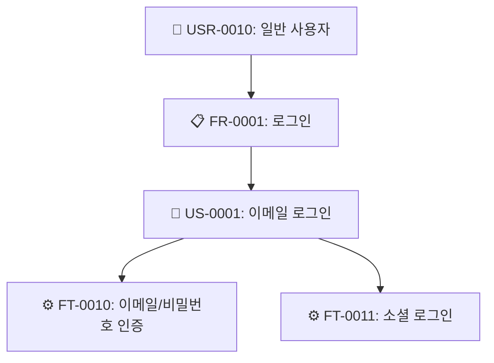
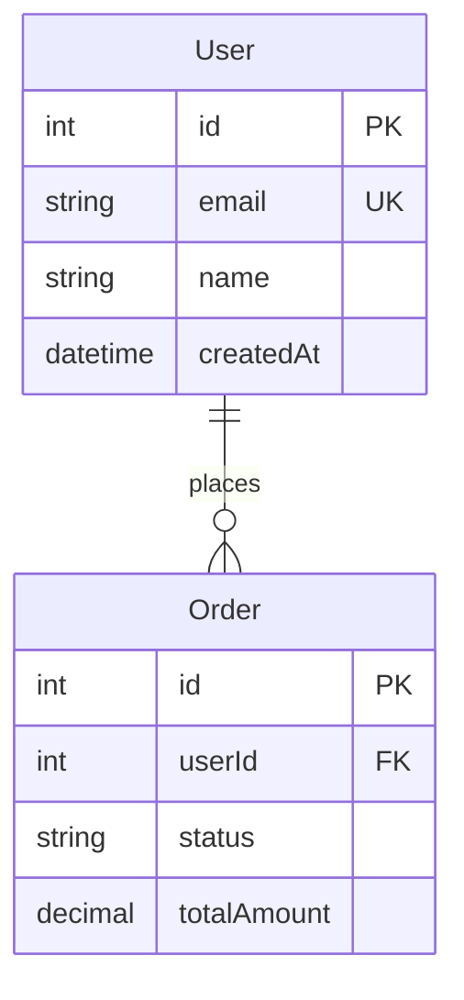
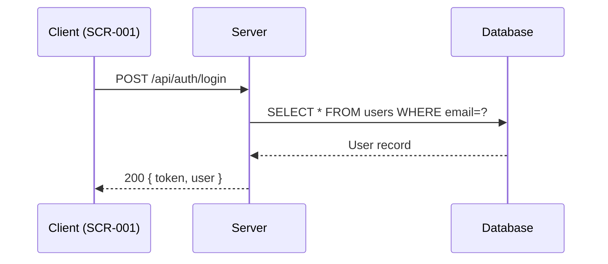

# u-browse -- Enriched SSoT Document Browser

`/u-browse [scope] [--only path] [--open]` 명령으로 `.u-maker/docs/` 하위의 SSoT 문서를 **분석·교차 참조·다이어그램이 포함된 리치 HTML**로 변환하고, **index.html** sidebar navigation으로 브라우징한다.

**Primary Agent:** u-agent-orchestrator

> **단순 변환이 아니다.** `.md`/`.json`을 그대로 렌더링하는 것이 아니라, 다른 문서를 교차 참조하고, JSON 데이터를 분석하여 다이어그램·통계·어노테이션을 자동 생성한 **리치 HTML**을 만든다.

> **전역 HTML 규칙:** `/u-browse`가 생성하는 모든 HTML(`srs.html`, `erd.html`, `api.html`, `screens.html`, `screen-flow.html`, `rtm.html`, `design-token.html`, `ui-components.html`, `wireframes/*.html`, `_browse/index.html`)은 공통 `Light | Dark` toggle과 `localStorage['u-maker-theme']` 기반 테마 저장을 지원해야 한다.

---

## Arguments & Flags

| Argument/Flag | Required | Description |
|---------------|----------|-------------|
| `scope` | Optional | 대상 앱 이름. 생략 시 전체 앱 |
| `--only path` | - | 특정 경로만 변환 (예: `--only hjw/02-design`) |
| `--open` | - | 생성 후 `open` 명령으로 브라우저 자동 열기 |
| `--clean` | - | 기존 `_browse/` 삭제 후 재생성 |

---

## Output Structure

```
.u-maker/_browse/
├── index.html                          # 메인 뷰어 (sidebar + iframe)
├── hjw/
│   ├── 01-plan/
│   │   ├── srs.html                   # SRS 리치 HTML (계층 시각화, Use Case 다이어그램)
│   │   ├── ia.html                    # IA 리치 HTML (SVG Sitemap, 화면 계층)
│   │   └── roadmap.html               # Roadmap 리치 HTML (Gantt chart)
│   ├── 02-design/
│   │   ├── erd.html                   # ERD 리치 HTML (ER 다이어그램, 엔티티 카드)
│   │   ├── api.html                   # API 리치 HTML (메서드 배지, Sequence 다이어그램)
│   │   ├── screens.html               # Screens 리치 HTML (컴포넌트 상세, 상태 다이어그램)
│   │   ├── screen-flow.html           # Screen Flow 리치 HTML (네비게이션 플로우차트)
│   │   ├── rtm.html                   # RTM 리치 HTML (커버리지 히트맵)
│   │   ├── design-token.html          # Design Token 리치 HTML (컬러 스워치, 타이포)
│   │   ├── ui-components.html         # UI 컴포넌트 카탈로그 (Storybook 연결)
│   │   └── wireframes/
│   │       ├── index.html             # 와이어프레임 뷰어 인덱스
│   │       ├── SCR-001.html           # 와이어프레임 + 어노테이션 + 비즈니스 로직
│   │       ├── SCR-002.html
│   │       └── ...
│   ├── 03-dev/
│   │   └── ...
│   └── 04-check/
│       └── ...
└── ...
```

---

## ★ Execution Flow (MUST FOLLOW EXACTLY)

### Step 0: Load ALL Context (CRITICAL)

**모든 HTML 생성 전에, scope 내의 모든 문서를 먼저 읽어 메모리에 적재한다.**

1. `.u-maker/docs/{scope}/` 하위의 **모든 `.md`와 `.json`** 파일을 Read로 읽는다.
2. 특히 아래 핵심 JSON 파일들의 `data` 필드를 파싱하여 교차 참조 맵을 구성한다:

```
contextMap = {
  srs: { requirements: [...], userStories: [...], features: [...] },
  ia:  { siteMap: [...], screenHierarchy: [...], userFlows: [...] },
  erd: { entities: [...], relations: [...] },
  api: { endpoints: [...], errorCodes: [...] },
  screens: { screens: [...] },                    // 각 화면의 components, interactions, states
  screenFlow: { navigationMap: [...], journeyFlows: [...], transitionRules: [...] },
  rtm: { traceabilityRows: [...], frCoverage: [...], gaps: [...] },
  designToken: { brandColors: [...], semanticColors: [...], typographyScale: [...] }
}
```

3. **교차 참조 인덱스**를 구성한다:

```
// Feature → Screen 매핑
ftToScreens = { "FT-0010": ["SCR-001", "SCR-003"], ... }

// Screen → API 매핑 (screens.json의 interactions에서 API 호출 추출)
screenToApis = { "SCR-001": ["POST /api/auth/login", "GET /api/user/profile"], ... }

// Screen → Feature 매핑
screenToFts = { "SCR-001": ["FT-0010", "FT-0011"], ... }

// Entity → API 매핑 (API response schema에서 엔티티 추출)
entityToApis = { "User": ["GET /api/users", "POST /api/users"], ... }

// Screen → Screen Flow (from/to 전이 규칙)
screenFlows = { "SCR-001": { next: ["SCR-002", "SCR-003"], prev: ["SCR-010"] }, ... }

// Feature → Test Case 매핑
ftToTcs = { "FT-0010": ["TC-0001", "TC-0002"], ... }
```

이 컨텍스트는 이후 모든 Step에서 참조된다.

### Step 1: Discover Files & Create Directories

```bash
find .u-maker/docs/{scope} -type f \( -name "*.md" -o -name "*.json" -o -name "*.html" \) | sort
mkdir -p .u-maker/_browse/{scope}/{app}/01-plan
mkdir -p .u-maker/_browse/{scope}/{app}/02-design/wireframes
mkdir -p .u-maker/_browse/{scope}/{app}/03-dev
mkdir -p .u-maker/_browse/{scope}/{app}/04-check
```

### Step 2: Generate Enriched HTML per Document Type

**각 문서 타입별로 `.md` + `.json`을 함께 읽고, contextMap을 교차 참조하여 리치 HTML을 생성한다.**

---

#### 2-1. SRS → `srs.html`

**입력:** `srs.md` + `srs.json`
**교차 참조:** IA(화면 매핑), API(엔드포인트 매핑), Screens(FT 매핑)

**생성할 HTML 섹션:**

| 섹션 | 내용 | 다이어그램 |
|------|------|-----------|
| **Overview** | 프로젝트명, 설명, 대상 사용자, 플랫폼 | - |
| **Stakeholders** | 이해관계자 역할 매트릭스 | - |
| **Requirements** | FR 테이블 (ID, Title, Priority 배지, Status 배지, 관련 US/FT 수) | Priority 분포 `pie` chart |
| **NF Requirements** | NR 테이블 (category, title, metric) | - |
| **User Stories** | US 카드 (actor, action, benefit, acceptance criteria 체크리스트) | - |
| **Features** | FT 테이블 + 각 FT에 연결된 Screen, API, TC 링크 | Use Case `flowchart` |
| **Hierarchy** | USR → FR → US → FT 트리 시각화 | `flowchart TD` |
| **Coverage** | FR별 US/FT/Screen/TC 커버리지 바 | 커버리지 bar chart |

**다이어그램 생성 알고리즘 (Feature Hierarchy):**



JSON의 `requirements`, `userStories`, `features` 배열에서 `tracedFrom` 필드를 추적하여 자동 생성.

---

#### 2-2. IA → `ia.html`

**입력:** `ia.md` + `ia.json`
**교차 참조:** Screens(컴포넌트 수), SRS(FT 매핑)

**생성할 HTML 섹션:**

| 섹션 | 내용 | 다이어그램 |
|------|------|-----------|
| **Visual Sitemap** | 화면 계층을 **인라인 SVG**로 시각화 | SVG sitemap (아래 참고) |
| **Screen Hierarchy** | Level별 화면 테이블 + 와이어프레임 링크 | - |
| **Navigation Patterns** | 패턴별 적용 화면 매트릭스 | - |
| **User Flows** | 각 플로우의 단계별 화면 전이 | SVG flowchart |

**★ Visual Sitemap SVG 생성 (핵심)**

Mermaid mindmap이 아닌, **인라인 SVG**로 직접 사이트맵을 그린다. 아래 레퍼런스 스타일을 따른다.

**SVG Sitemap 구성 요소:**

1. **페이지 카드** — 각 화면을 사각형 카드로 표현
   - 상단: 화면명 (bold, 배경색으로 Level 구분)
   - 하단: 간략 와이어프레임 아이콘 (회색 라인으로 헤더/콘텐츠/사이드바 표현)
   - 카드 크기: `width="120" height="90"` (대략)

2. **Level 색상 코딩:**
   | Level | 배경색 | 설명 |
   |-------|--------|------|
   | L1 (최상위) | `#0891b2` (청록) 흰 텍스트 | Home, 메인 랜딩 |
   | L2 (메인 내비) | `#dbeafe` (연파랑) | 주요 메뉴 항목 |
   | L3 (서브 내비) | `#ffffff` border `#d1d9e0` | 서브 페이지 |
   | L4 (상세) | `#fef9c3` (연노랑) | 상세/편집 화면 |

3. **연결선** — 부모→자식 화면 연결
   - 수직/수평 직각 연결선 (stroke: `#9ca3af`, width: 1.5)
   - 화살촉 마커 (삼각형)

4. **어노테이션 마커** — 빨간 원형 번호 배지
   - 각 주요 화면 옆에 `<circle fill="#ef4444">` + 흰 숫자
   - 주요 포인트가 있는 화면에 callout 텍스트 연결

5. **어노테이션 callout** — 빨간 점선으로 연결된 텍스트 블록
   - "Main points for {화면명}:"
   - 핵심 UX 포인트 bullet 목록

**SVG 레이아웃 알고리즘:**

```
Level 1:     [  Homepage  ]
              |    |    |
Level 2:   [Cat] [About] [Forum] [Login] [SignUp]
              |           |    |
Level 3:   children    [Category] [Profile]
                          |         |
Level 4:              [Thread]  [EditProfile]
```

- L1은 중앙 상단에 1개
- L2는 L1 아래에 수평 배열 (간격: 140px)
- L3은 각 L2 아래에 수직 또는 수평 배열
- L4은 L3 아래에 수직 배열
- SVG viewBox는 전체 트리 크기에 맞게 동적 계산

**SVG 생성 코드 패턴:**

```html
<div class="diag-container" style="max-height:400px;overflow:hidden;position:relative">
  <button class="diag-zoom" onclick="openDiagModal(this)" title="확대">🔍</button>
  <svg class="diag" viewBox="0 0 {{WIDTH}} {{HEIGHT}}" xmlns="http://www.w3.org/2000/svg">
    <defs>
      <marker id="arrow" markerWidth="10" markerHeight="7" refX="9" refY="3.5" orient="auto">
        <polygon points="0 0, 10 3.5, 0 7" fill="#9ca3af"/>
      </marker>
    </defs>

    <!-- L1: Homepage card -->
    <rect x="350" y="20" width="120" height="90" rx="4" fill="#0891b2" stroke="#0891b2"/>
    <text x="410" y="42" text-anchor="middle" fill="#fff" font-size="11" font-weight="700">HOMEPAGE</text>
    <!-- wireframe icon inside card -->
    <rect x="370" y="50" width="80" height="4" rx="1" fill="rgba(255,255,255,.3)"/>
    <rect x="370" y="58" width="50" height="3" rx="1" fill="rgba(255,255,255,.2)"/>
    <rect x="370" y="64" width="80" height="30" rx="2" fill="rgba(255,255,255,.15)"/>

    <!-- Annotation marker -->
    <circle cx="475" cy="25" r="10" fill="#ef4444"/>
    <text x="475" y="29" text-anchor="middle" fill="#fff" font-size="9" font-weight="700">1</text>

    <!-- Annotation callout -->
    <line x1="485" y1="25" x2="520" y2="25" stroke="#ef4444" stroke-dasharray="3"/>
    <text x="525" y="22" fill="#374151" font-size="10" font-weight="700">Main points for homepage:</text>
    <text x="525" y="34" fill="#6b7280" font-size="9">- 카테고리별 콘텐츠 강조</text>
    <text x="525" y="44" fill="#6b7280" font-size="9">- 사용자 인터랙션 증가</text>

    <!-- Connection line to L2 -->
    <line x1="410" y1="110" x2="410" y2="140" stroke="#9ca3af" stroke-width="1.5" marker-end="url(#arrow)"/>

    <!-- L2: Categories card -->
    <rect x="80" y="150" width="120" height="80" rx="4" fill="#dbeafe" stroke="#93c5fd"/>
    <text x="140" y="170" text-anchor="middle" fill="#1e40af" font-size="10" font-weight="700">CATEGORIES</text>
    <!-- ... 더 많은 카드 -->

    <!-- L3: Sub-pages as smaller text items -->
    <text x="100" y="260" fill="#6b7280" font-size="9">→ Clients</text>
    <text x="100" y="275" fill="#6b7280" font-size="9">→ Portfolios</text>
    <!-- ... -->
  </svg>
</div>
```

JSON의 `siteMap` 배열에서 `children` 재귀 순회하여 위 패턴으로 SVG를 생성한다. 화면 수가 많으면 L3 이하는 텍스트 목록으로 간략화한다.

**축소 표시 + 확대:** `max-height: 400px; overflow: hidden` + 🔍 확대 버튼 (모달로 전체 SVG 표시)

---

#### 2-3. ERD → `erd.html`

**입력:** `erd.md` + `erd.json`
**교차 참조:** API(엔티티 사용 엔드포인트), Screens(데이터 바인딩)

**생성할 HTML 섹션:**

| 섹션 | 내용 | 다이어그램 |
|------|------|-----------|
| **ER Diagram** | 전체 엔티티 관계 시각화 | `erDiagram` |
| **Entity Cards** | 엔티티별 카드 (컬럼 목록, PK/FK 배지, 타입) | - |
| **Relationships** | 관계 테이블 (1:1, 1:N, M:N 배지) | - |
| **API Usage** | 각 엔티티가 사용되는 API 엔드포인트 목록 | - |
| **Screen Binding** | 각 엔티티가 바인딩된 화면 목록 | - |

**다이어그램 생성 (erDiagram):**

JSON의 `entities`와 `relations`에서 자동 생성:


> **주의 — Mermaid 제약조건 마커 규칙:**
> 속성(attribute)당 **하나의 마커만** 허용된다 (`PK`, `FK`, `UK` 중 택 1).
> `PK_FK`, `FK_UK` 등 결합 표기는 **Mermaid 구문 오류**를 발생시킨다.
> 복합 제약조건 컬럼은 우선순위: `PK` > `FK` > `UK` 중 하나만 표기.
> (예: PK이면서 FK → `PK`, FK이면서 UK → `FK`)

---

#### 2-4. API → `api.html`

**입력:** `api.md` + `api.json`
**교차 참조:** ERD(응답 스키마 엔티티), Screens(호출 화면), SRS(FT 매핑)

**생성할 HTML 섹션:**

| 섹션 | 내용 | 다이어그램 |
|------|------|-----------|
| **Overview** | Base URL, Auth 방식, 버전 | - |
| **Endpoints** | 메서드 배지(GET🟢/POST🔵/PUT🟠/DELETE🔴) + path + 요약 | - |
| **Endpoint Detail** | 각 엔드포인트별: Request params, Body schema, Response schema, 호출 화면, 관련 FT | Sequence `sequenceDiagram` (주요 흐름) |
| **Error Codes** | 에러 코드 테이블 | - |
| **Screen Mapping** | 어떤 화면에서 어떤 API를 호출하는지 매트릭스 | - |

**메서드 배지 스타일:**

```html
<span class="method get">GET</span>
<span class="method post">POST</span>
<span class="method put">PUT</span>
<span class="method delete">DELETE</span>
```

CSS: `.method.get { background: #22c55e; }` `.method.post { background: #3b82f6; }` `.method.put { background: #f59e0b; }` `.method.delete { background: #ef4444; }`

**Sequence Diagram (주요 API 흐름):**



---

#### 2-5. Screens → `screens.html`

**입력:** `screens.md` + `screens.json`
**교차 참조:** IA(계층), API(호출 엔드포인트), SRS(FT), Screen Flow(전이), ERD(데이터)

**생성할 HTML 섹션:**

| 섹션 | 내용 | 다이어그램 |
|------|------|-----------|
| **Screen List** | 전체 화면 목록 (ID, 이름, 라우트, FT 링크, 와이어프레임 링크) | - |
| **Screen Cards** | 화면별 상세 카드: | |
| ↳ Components | 컴포넌트 테이블 (name, type 배지, interaction 설명) | - |
| ↳ Interactions | 트리거 → 엘리먼트 → 액션 (API 호출 포함) | - |
| ↳ States | 화면 상태 목록 (조건 → 표시 방식) | `stateDiagram-v2` |
| ↳ Related APIs | 이 화면에서 호출하는 API 엔드포인트 목록 | - |
| ↳ Related Data | 이 화면에 바인딩된 ERD 엔티티 | - |
| ↳ Navigation | 이 화면으로의 진입/이탈 경로 (Screen Flow 참조) | - |
| **Responsive** | 브레이크포인트별 레이아웃 변화 | - |

---

#### 2-6. Screen Flow → `screen-flow.html`

**입력:** `screen-flow.md` + `screen-flow.json`
**교차 참조:** Screens(화면 상세), IA(계층)

**생성할 HTML 섹션:**

| 섹션 | 내용 | 다이어그램 |
|------|------|-----------|
| **Navigation Map** | 전체 화면 전이 | `flowchart TD` |
| **Journey Flows** | 사용자 여정별 상세 플로우 | `flowchart LR` (per journey) |
| **Transition Rules** | From → To 테이블 (trigger, guard condition, side effect) | - |

---

#### 2-7. RTM → `rtm.html`

**입력:** `rtm.md` + `rtm.json`
**교차 참조:** 전체 (SRS, IA, ERD, API, Screens, TC)

**생성할 HTML 섹션:**

| 섹션 | 내용 | 다이어그램 |
|------|------|-----------|
| **Traceability Matrix** | FR → US → FT → Screen → API → TC 전체 매핑 테이블 | - |
| **Coverage Dashboard** | FR별 커버리지 % (색상 코딩: 100%=🟢, 50-99%=🟡, <50%=🔴) | `pie` chart |
| **Gaps** | 미매핑 항목 경고 리스트 (severity 배지) | - |
| **Statistics** | 총 FR/US/FT/Screen/TC 수, 커버리지 요약 | bar chart |

---

#### 2-8. Design Token → `design-token.html`

**입력:** `design-token.md` + `design-token.json`

**생성할 HTML 섹션:**

| 섹션 | 내용 |
|------|------|
| **Color Palette** | 컬러 스워치 (hex 미리보기 박스 + 이름 + 용도) |
| **Typography** | 타이포 스케일 (실제 폰트 크기/두께로 렌더링) |
| **Spacing** | 스페이싱 시스템 (실제 크기 박스 시각화) |
| **Design Principles** | 원칙 카드 (Do / Don't) |

---

#### 2-9. UI Components → `ui-components.html`

**입력:** `screens.json` (전체 화면의 components 집계) + `design-token.json` + `ux-guide.md`
**교차 참조:** Screens(사용처), Design Token(스타일), Storybook(있으면 연결)

**sidebar에서 Design Tokens 바로 아래에 위치한다.**

**생성할 HTML 섹션:**

| 섹션 | 내용 |
|------|------|
| **Component Catalog** | 전체 화면에서 사용된 컴포넌트를 타입별로 그룹핑하여 카탈로그 표시 |
| **Component Card** | 각 컴포넌트별: 이름, 타입 배지, 용도 설명, 사용 화면 목록, 시각적 미리보기, Storybook 링크 |
| **Usage Matrix** | 컴포넌트 × 화면 매트릭스 (어떤 컴포넌트가 어떤 화면에서 사용되는지) |

**Component Catalog 생성 알고리즘:**

1. `screens.json`의 모든 화면에서 `components` 배열을 수집
2. 컴포넌트명(PascalCase)으로 중복 제거 + 사용 횟수 카운트
3. 타입별 그룹핑 (Layout / Input / Display / Action / Navigation / Filter)
4. 각 컴포넌트에 대해:

```html
<!-- 컴포넌트 카드 -->
<div class="comp-card">
  <div class="comp-card-header">
    <span class="comp-type-badge input">Input</span>
    <h3>DateRangePicker</h3>
    <span class="usage-count">5개 화면에서 사용</span>
  </div>
  <div class="comp-card-body">
    <!-- 시각적 미리보기 -->
    <div class="comp-preview">
      <input type="text" placeholder="2026-01-01 ~ 2026-03-29" readonly
             style="border:1px solid #d1d9e0;padding:6px 10px;border-radius:6px;font-size:12px;width:200px">
    </div>
    <!-- Props -->
    <div class="comp-props">
      <div><b>Props:</b> value: [Date, Date] | defaultRange: last30d | onChange: fn</div>
      <div><b>Validation:</b> startDate ≤ endDate, 최대 범위 1년</div>
    </div>
    <!-- 사용처 -->
    <div class="comp-usage">
      <b>사용 화면:</b>
      <a href="wireframes/SCR-001.html">SCR-001 접수내역</a>,
      <a href="wireframes/SCR-010.html">SCR-010 정산내역</a>, ...
    </div>
    <!-- Design Token 연결 -->
    <div class="comp-tokens">
      <b>Design Token:</b> border: <code>var(--border)</code>, bg: <code>var(--input-bg)</code>, radius: <code>6px</code>
    </div>
    <!-- Storybook 링크 (있으면) -->
    <div class="comp-storybook">
      <a href="{{STORYBOOK_URL}}/iframe.html?id=components-daterangepicker" target="_blank">
        📖 Storybook에서 보기
      </a>
    </div>
  </div>
</div>
```

**Storybook 연결:**

1. `u-maker.config.json`에서 `storybook.url` 설정을 확인:
   ```json
   {
     "storybook": {
       "url": "http://localhost:6006",
       "deployed": "https://storybook.example.com"
     }
   }
   ```
2. 설정이 있으면 각 컴포넌트 카드에 Storybook 링크를 생성:
   - URL 패턴: `{storybook.url}/?path=/story/components-{component-name-kebab}`
   - `deployed` URL이 있으면 우선 사용, 없으면 `url` 사용
3. 설정이 없으면 Storybook 링크 섹션을 생략
4. 프로젝트에 `.storybook/` 디렉토리가 존재하면 자동 감지하여 `storybook.url` 미설정이라도 `http://localhost:6006` 기본값 사용

**컴포넌트 타입별 시각적 미리보기:**

| 타입 | 미리보기 렌더링 |
|------|----------------|
| **Input** | `<input>` 또는 `<select>` 실제 HTML 요소 (placeholder 포함) |
| **Button/Action** | `<button>` 실제 렌더링 (primary/secondary/danger 스타일) |
| **Display** | 배지, 태그, 아이콘 등 실제 렌더링 |
| **Filter** | 탭바, 셀렉트, 체크박스 그룹 등 실제 렌더링 |
| **Layout** | 간략 박스 레이아웃 (header/sidebar/content 구조) |
| **Navigation** | 링크, 브레드크럼 등 실제 렌더링 |
| **Table** | 2~3행 미니 테이블 미리보기 |
| **Card** | 카드 레이아웃 미리보기 |
| **Modal** | 미니 모달 박스 미리보기 |

**Usage Matrix 생성:**

```html
<table class="usage-matrix">
  <thead>
    <tr>
      <th>컴포넌트</th>
      <th>SCR-001</th><th>SCR-002</th><th>SCR-010</th><th>...</th>
    </tr>
  </thead>
  <tbody>
    <tr>
      <td>DateRangePicker</td>
      <td>●</td><td></td><td>●</td><td>...</td>
    </tr>
    <tr>
      <td>StatusBadge</td>
      <td>●</td><td>●</td><td>●</td><td>...</td>
    </tr>
  </tbody>
</table>
```

---

### ★ Step 3: Generate Wireframe HTML (가장 중요)

**각 SCR-NNN 와이어프레임은 단순 UI 목업이 아니라, 풀 앱 프레임 + 인라인 어노테이션 + 컴포넌트 명세 + 로직 다이어그램이 포함된 종합 설계 문서이다.**

**입력 소스 (교차 참조):**
- `screens.json` → 해당 화면의 components, interactions, states
- `screen-flow.json` → 해당 화면의 진입/이탈 경로, 전이 규칙
- `api.json` → 해당 화면에서 호출하는 API 엔드포인트
- `srs.json` → 해당 화면에 매핑된 Feature(FT)의 비즈니스 로직
- `erd.json` → 해당 화면에 바인딩된 데이터 엔티티
- `ia.json` → 사이드바 메뉴 구조, 화면 계층

---

#### 와이어프레임 HTML 구조 (header + stage + tabbed details)

와이어프레임 HTML은 다음 3개 블록으로 구성된다. **이 순서와 구조를 반드시 따른다.**

**블록 1: doc-header (상단 고정 바 + theme toggle)**

상단 바에는 다음 정보가 모두 보여야 한다:
- 화면 아이디
- 화면명
- 화면 route(path)
- 관련 FT
- 관련 FR
- `Light | Dark` 토글
- `index.html` 복귀 링크

```html
<header class="doc-header">
  <div class="dh-left">
    <span class="sid">S-FSMS-0206</span>
    <div class="dh-meta">
      <strong class="dh-name">추모캔버스</strong>
      <code class="dh-path">/memorial</code>
    </div>
  </div>
  <div class="dh-right">
    <a class="dh-index" href="index.html">Index</a>
    <span class="trace trace-ft">FT-FSMS-060101~060104</span>
    <span class="trace trace-fr">FR-FSMS-0600</span>
    <button class="theme-toggle" type="button" aria-label="Toggle light and dark mode">
      <span data-mode="light">Light</span>
      <span data-mode="dark">Dark</span>
    </button>
  </div>
</header>
```

**Theme 토글 규칙:**
1. 기본값은 `light`.
2. 토글 시 `<html data-theme="light|dark">` 값을 변경한다.
3. 선택값은 `localStorage['u-maker-wireframe-theme']`에 저장한다.
4. 다크 모드에서도 annotation 번호, 상태 배지, 코드 블록 대비가 깨지지 않아야 한다.

```css
:root {
  --bg: #f8fafc;
  --panel: #ffffff;
  --text: #0f172a;
  --muted: #64748b;
  --line: #dbe3ef;
}
html[data-theme="dark"] {
  --bg: #0f172a;
  --panel: #111827;
  --text: #e5eef9;
  --muted: #94a3b8;
  --line: #334155;
}
```

**블록 2: stage (좌측 wireframe html + 인라인 annotation / 우측 annotation panel)**

```
┌──────────────────────────────────────────────────────┬──────────────────────────┐
│ Left Stage                                           │ Right Panel              │
│ ┌──────────────────────────────────────────────────┐ │ ┌──────────────────────┐ │
│ │ App frame (실제 앱 UI)                           │ │ │ Design               │ │
│ │ Sidebar + Header + Content + Inline markers      │ │ │ Develop              │ │
│ │ Annotation chip / callout / marker overlay       │ │ │ 기타                 │ │
│ └──────────────────────────────────────────────────┘ │ └──────────────────────┘ │
└──────────────────────────────────────────────────────┴──────────────────────────┘
```

```html
<section class="stage">
  <div class="stage-main">
    <div class="app-shell">
      <aside class="app-nav"><!-- IA 기반 실제 메뉴 구조 --></aside>
      <main class="app-page">
        <section class="page-canvas">
          <!-- 실제 HTML wireframe -->
          <div class="inline-annotation-layer">
            <span class="mk">1</span>
            <div class="mk-note">검색은 주문번호/고인명 기준</div>
          </div>
        </section>
      </main>
    </div>
  </div>

  <aside class="anno-panel">
    <section class="anno-section anno-design"><h2>Design</h2></section>
    <section class="anno-section anno-develop"><h2>Develop</h2></section>
    <section class="anno-section anno-other"><h2>기타</h2></section>
  </aside>
</section>
```

**stage 핵심 규칙:**
1. **왼쪽은 실제 HTML wireframe이다.** placeholder 그림이 아니라, IA 사이드바와 본문 레이아웃이 있는 풀 앱 프레임을 구성한다.
2. **왼쪽에는 인라인 annotation도 함께 보여준다.** 마커 번호, 짧은 note chip, 상태 badge, empty/loading/error note를 wireframe 안에 배치한다.
3. **오른쪽은 상세 annotation 전용 패널이다.** 최소 3개 그룹: `Design`, `Develop`, `기타`.
4. `기타` 섹션에는 운영 메모, QA 포인트, 법/정책 제약, 문서 cross-reference, 미결정 사항을 넣는다.
5. 기본 그리드는 `grid-template-columns: minmax(0, 1fr) 360px`.
6. 1280px 미만에서는 오른쪽 패널을 stage 하단으로 내리고, 768px 미만에서는 단일 컬럼으로 전환한다.

**Design 섹션에 포함할 내용:**
- 화면 목적, 핵심 사용자 시나리오
- 컴포넌트 동작 설명
- UX 규칙 (empty/loading/error)
- 접근성, 반응형, 상태 배지 규칙

**Develop 섹션에 포함할 내용:**
- API endpoint, query/body, response schema
- enum, validation, store/query key
- 에러 처리, 캐시 무효화, DB/정렬 힌트

**기타 섹션에 포함할 내용:**
- 운영/정책 규칙
- QA 확인 포인트
- 미정 의사결정, dependency, release note

**블록 3: detail-tabs (하단 탭 세트)**

하단에는 고정 순서의 탭을 둔다. 탭 라벨은 아래 순서를 반드시 따른다.

1. `Popup / BottomSheet / Dialog / Modal`
2. `Event Actions`
3. `Data Models`
4. `Screen Flow`
5. `Sequence Diagram`
6. `Component Spec`
7. `Global Rules`

```html
<section class="detail-tabs">
  <div class="tab-list" role="tablist">
    <button role="tab" data-tab="overlays">Popup / BottomSheet / Dialog / Modal</button>
    <button role="tab" data-tab="events">Event Actions</button>
    <button role="tab" data-tab="data-models">Data Models</button>
    <button role="tab" data-tab="screen-flow">Screen Flow</button>
    <button role="tab" data-tab="sequence-diagram">Sequence Diagram</button>
    <button role="tab" data-tab="component-spec">Component Spec</button>
    <button role="tab" data-tab="global-rules">Global Rules</button>
  </div>

  <div class="tab-panels">
    <section id="tab-overlays" class="tab-panel is-active"></section>
    <section id="tab-events" class="tab-panel"></section>
    <section id="tab-data-models" class="tab-panel"></section>
    <section id="tab-screen-flow" class="tab-panel"></section>
    <section id="tab-sequence-diagram" class="tab-panel"></section>
    <section id="tab-component-spec" class="tab-panel"></section>
    <section id="tab-global-rules" class="tab-panel"></section>
  </div>
</section>
```

**각 탭의 필수 내용:**

**1. Popup / BottomSheet / Dialog / Modal**
- 화면에서 파생되는 overlay를 모두 포함한다.
- Popup, BottomSheet, Dialog, Modal을 유형별 소제목으로 구분한다.
- 각 overlay는 **실제 UI wireframe** + 트리거 + 성공/실패 후속 동작 + Design/Develop note를 가진다.
- 폼 overlay는 ERD 필드와 1:1 매핑된 입력을 표시한다.

**2. Event Actions**
- 컴포넌트, 트리거, API Call, Success, Failure 컬럼을 가진 표를 사용한다.

```html
<table class="spec-tbl">
  <thead><tr><th>Component</th><th>Trigger</th><th>API Call</th><th>Success</th><th>Failure</th></tr></thead>
  <tbody>
    <tr>
      <td>CreateButton</td>
      <td>click</td>
      <td><code>POST /v1/fsms/memorial</code></td>
      <td>목록 재조회 + 생성 완료 토스트</td>
      <td>필드 에러 표시 + 에러 토스트</td>
    </tr>
  </tbody>
</table>
```

**3. Data Models**
- ERD, UI Mapping, Description 컬럼을 포함한다.
- 필요 시 `타입`, `제약조건`, `sample value`를 추가한다.
- 화면별 데이터 모델은 엔티티 단위 소제목으로 묶는다.

**4. Screen Flow**
- 현재 화면의 진입 경로, 이탈 경로, 전이 조건을 인라인 SVG 또는 flowchart로 표현한다.
- 전이 근거 FT/FR를 각 edge 또는 노드 설명에 연결한다.

**5. Sequence Diagram**
- 사용자 → 프론트엔드 → API → DB 흐름을 시간 순서대로 표시한다.
- 요청/응답/실패 분기와 invalidation 포인트를 포함한다.

**6. Component Spec**
- 사용 컴포넌트 명세 표를 제공한다.
- 최소 컬럼: `#`, `컴포넌트`, `타입`, `Props / 설명`, `Validation`, `API`.

**7. Global Rules**
- `common/` 문서와 scope override에서 상속된 글로벌 UX/개발 규칙을 요약한다.
- 예: 날짜 포맷, 상태색, 공통 버튼 라벨, empty state 문구, 권한 규칙, PII masking.

---

#### 와이어프레임 생성 알고리즘

각 `SCR-NNN`에 대해:

1. **Screen Meta 수집** — `screens.json`에서 `id`, `name`, `route`, `description`, `tracedFrom`를 읽고 관련 `FT`, `FR`를 확정한다.
2. **Theme Frame 구성** — `light/dark` 토글, CSS 변수, `localStorage` 기반 테마 스크립트를 포함한다.
3. **Left Stage 생성** — `ia.json` 기반 앱 내비게이션 + `screens.json`의 컴포넌트 배열 + `erd.json` 필드로 실제 HTML wireframe을 만든다.
4. **Inline Annotation 생성** — 모든 주요 컴포넌트 옆에 `<span class="mk">N</span>` 마커와 짧은 note를 배치한다.
5. **Right Annotation Panel 생성** — 마커 번호 기준으로 `Design`, `Develop`, `기타` 3개 섹션을 채운다.
6. **Overlay Tab 생성** — Popup, BottomSheet, Dialog, Modal을 실제 UI mockup으로 만든다.
7. **Event Actions Tab 생성** — `interactions`와 `api.json`을 교차 참조해 `Component / Trigger / API Call / Success / Failure` 표를 만든다.
8. **Data Models Tab 생성** — ERD 엔티티별 `ERD / UI Mapping / Description` 표를 만든다.
9. **Screen Flow Tab 생성** — `screen-flow.json`의 진입/이탈, 분기 규칙, edge label을 사용해 흐름도를 만든다.
10. **Sequence Diagram Tab 생성** — 사용자, FE, API, DB 라이프라인과 실패 분기를 포함한 시퀀스를 만든다.
11. **Component Spec Tab 생성** — 모든 사용 컴포넌트를 번호 순으로 정리한다.
12. **Global Rules Tab 생성** — `common` 문서 + app override의 공통 규칙을 추출해 요약한다.
13. **반응형 검증** — desktop/tablet/mobile에서 header, stage, tabs가 깨지지 않도록 레이아웃을 조정한다.

**어노테이션 마커 CSS:**

```css
.mk { display:inline-flex; align-items:center; justify-content:center;
      width:17px; height:17px; background:#2563eb; color:#fff;
      border-radius:50%; font-size:9px; font-weight:700; }
.mk-note { display:inline-flex; padding:4px 8px; border-radius:999px;
           background:rgba(37,99,235,.10); color:var(--text); font-size:11px; }
```

### Step 3.5: Page-level Side Navigation (모든 개별 HTML 공통)

**모든 개별 문서 HTML** (srs.html, erd.html, api.html, screens.html, screen-flow.html, rtm.html, design-token.html, ui-components.html)에 **페이지 내 섹션 네비게이션 사이드바**를 포함한다.

index.html의 sidebar는 문서 간 이동용이고, 이 page-nav는 **문서 내 섹션 간 이동용**이다.

**레이아웃 구조:**

```
┌─────────────────────────────────────────────────┬──────────────┐
│                                                 │  Page Nav    │
│  Main Content (기존 문서 섹션들)                   │              │
│                                                 │  ● Overview  │
│  [Overview]                                     │  ○ Entities  │
│  [Entity Cards]                                 │  ○ Relations │
│  [Relationships]                                │  ○ API Usage │
│  [API Usage]                                    │  ○ Statistics│
│  [Statistics]                                   │              │
│                                                 │              │
└─────────────────────────────────────────────────┴──────────────┘
```

**HTML 구조:**

```html
<body>
  <div class="page-layout">
    <!-- Main content -->
    <main class="page-main">
      <section id="sec-overview"><h2>Overview</h2>...</section>
      <section id="sec-entities"><h2>Entity Cards</h2>...</section>
      <section id="sec-relations"><h2>Relationships</h2>...</section>
      <!-- ... -->
    </main>

    <!-- Page-level side navigation -->
    <nav class="page-nav">
      <div class="page-nav-title">On this page</div>
      <ul class="page-nav-list">
        <li><a href="#sec-overview" class="page-nav-link active">Overview</a></li>
        <li><a href="#sec-entities" class="page-nav-link">Entity Cards</a></li>
        <li><a href="#sec-relations" class="page-nav-link">Relationships</a></li>
        <li><a href="#sec-api-usage" class="page-nav-link">API Usage</a></li>
        <li><a href="#sec-statistics" class="page-nav-link">Statistics</a></li>
      </ul>
    </nav>
  </div>
</body>
```

**CSS:**

```css
.page-layout {
  display: grid;
  grid-template-columns: 1fr 200px;
  gap: 24px;
  max-width: 1400px;
  margin: 0 auto;
  padding: 24px;
}

.page-nav {
  position: sticky;
  top: 24px;
  align-self: start;
  max-height: calc(100vh - 48px);
  overflow-y: auto;
}

.page-nav-title {
  font-size: 0.75rem;
  font-weight: 700;
  text-transform: uppercase;
  letter-spacing: 0.5px;
  color: var(--text-dim, #94a3b8);
  margin-bottom: 12px;
  padding-left: 12px;
}

.page-nav-list {
  list-style: none;
  padding: 0;
  margin: 0;
  border-left: 2px solid var(--border, #334155);
}

.page-nav-link {
  display: block;
  padding: 6px 12px;
  font-size: 0.8rem;
  color: var(--text-dim, #94a3b8);
  text-decoration: none;
  border-left: 2px solid transparent;
  margin-left: -2px;
  transition: all 0.15s;
}

.page-nav-link:hover {
  color: var(--text, #e2e8f0);
}

.page-nav-link.active {
  color: #38bdf8;
  border-left-color: #38bdf8;
  font-weight: 600;
}

/* 반응형: 768px 미만에서 page-nav 숨김 */
@media (max-width: 768px) {
  .page-layout { grid-template-columns: 1fr; }
  .page-nav { display: none; }
}
```

**Scroll Spy (JS):**

```javascript
document.addEventListener('DOMContentLoaded', () => {
  const sections = document.querySelectorAll('main section[id]');
  const navLinks = document.querySelectorAll('.page-nav-link');

  if (!sections.length || !navLinks.length) return;

  const observer = new IntersectionObserver(entries => {
    entries.forEach(entry => {
      if (entry.isIntersecting) {
        navLinks.forEach(link => link.classList.remove('active'));
        const activeLink = document.querySelector(
          '.page-nav-link[href="#' + entry.target.id + '"]'
        );
        if (activeLink) activeLink.classList.add('active');
      }
    });
  }, { rootMargin: '-20% 0px -60% 0px', threshold: 0 });

  sections.forEach(section => observer.observe(section));

  // Smooth scroll on click
  navLinks.forEach(link => {
    link.addEventListener('click', e => {
      e.preventDefault();
      const target = document.querySelector(link.getAttribute('href'));
      if (target) target.scrollIntoView({ behavior: 'smooth', block: 'start' });
    });
  });
});
```

**문서 타입별 page-nav 항목:**

| 문서 | 섹션 목록 |
|------|-----------|
| **SRS** | Overview, Requirements, NF Requirements, User Stories, Features, Hierarchy, Coverage |
| **IA** | Visual Sitemap, Screen Hierarchy, Navigation Patterns, User Flows |
| **ERD** | ER Diagram, Entity Cards, Relationships, API Usage, Screen Binding |
| **API** | Overview, Endpoints, Endpoint Detail, Error Codes, Screen Mapping |
| **Screens** | Screen List, Screen Cards (각 SCR-NNN 서브링크), Responsive |
| **Screen Flow** | Navigation Map, Journey Flows, Transition Rules |
| **RTM** | Traceability Matrix, Coverage Dashboard, Gaps, Statistics |
| **Design Token** | Color Palette, Typography, Spacing, Design Principles |
| **UI Components** | Component Catalog, Usage Matrix |

**구현 규칙:**

1. 각 문서 HTML의 주요 섹션(`<h2>` 기준)마다 `<section id="sec-{kebab-name}">` 래퍼를 추가한다.
2. page-nav 항목은 해당 문서의 실제 생성된 섹션 목록에서 동적으로 구성한다 (빈 섹션은 제외).
3. index.html의 iframe 내에서 독립적으로 동작해야 한다 (iframe 내부 스크롤 기준).
4. 와이어프레임 HTML (`SCR-NNN.html`)에는 page-nav를 적용하지 않는다 (자체 레이아웃 사용).

---

### Step 4: Generate index.html (Main Viewer)

모든 파일 변환이 끝난 후, sidebar 파일 트리를 구성하여 index.html을 생성한다.

**index.html wireframe sidebar 요구사항:**

- 전체 wireframe을 탐색할 수 있는 **깔끔한 sidebar navigation**을 반드시 제공한다.
- sidebar는 기본적으로 **2-depth까지만** 노출한다. `섹션 → 문서/도메인 → 화면` 이상으로 깊어지지 않는다.
- 상위 섹션은 고정 순서를 사용한다: `Plan`, `Design`, `Wireframes`, `Reports`.
- `Wireframes Index` 같은 중간 인덱스 파일을 별도 leaf로 노출하지 않는다. 앱명/로고 클릭 시 index root로 돌아가도록 한다.
- 와이어프레임은 `도메인 grouping` 기준으로 묶되, 기본 우선순위는 `IA depth-1 menu > screen domain > route prefix > fallback: 기타`를 사용한다.
- 도메인명은 렌더링 전에 반드시 정규화한다. 예: `주문`, `주문관리`, `주문/접수`처럼 유사한 이름은 하나의 canonical label로 병합한다.
- 도메인 그룹은 `IA 순서 우선, 같은 레벨이면 화면 수 내림차순`으로 정렬한다.
- 화면이 1개뿐인 도메인은 별도 대그룹을 남발하지 말고, `기타` 또는 인접 상위 도메인에 흡수해 sidebar 길이를 줄인다.
- 각 도메인 그룹에는 화면 개수 badge만 표시한다. leaf에는 count를 반복 표시하지 않는다.
- 그룹 내부 leaf는 `화면 ID badge + 짧은 화면명`만 보여준다. `route`는 기본 노출하지 말고 hover tooltip 또는 secondary meta로만 제공한다.
- 현재 선택된 wireframe은 강조 표시한다.
- 검색 필터는 도메인명, 화면 ID, 화면명, route 검색을 지원하되, 검색 결과는 **트리 대신 flat list**로 임시 표시한다.
- 문서 인덱스와 wireframe 인덱스는 같은 sidebar 안에서 구분 섹션으로 렌더링하되, 각 섹션 기본 상태는 `핵심만 펼침`이다.

**시각 정리 규칙:**

1. 아이콘은 섹션 레벨에만 사용하고, leaf 행에는 기본적으로 사용하지 않는다.
2. badge 색상은 절제한다. phase badge, active row, count badge만 강조색을 사용한다.
3. 긴 도메인명은 한 줄 ellipsis 처리한다.
4. sidebar 본문에는 `route`, `status`, `type`를 동시에 노출하지 않는다.
5. 기본 펼침 상태:
   - `Plan`: 펼침
   - `Design`: 펼침
   - `Wireframes`: 펼침
   - `Reports`: 접힘
6. `Wireframes` 내부에서는 현재 화면이 속한 도메인만 펼치고 나머지는 접는다.

**FILES 배열 구성:**

```javascript
const FILES = [
  { path: "hjw/01-plan/srs.html", type: "doc", name: "SRS", dir: "hjw/01-plan", icon: "📋", docType: "srs" },
  { path: "hjw/01-plan/ia.html", type: "doc", name: "IA", dir: "hjw/01-plan", icon: "🗺️", docType: "ia" },
  { path: "hjw/02-design/erd.html", type: "doc", name: "ERD", dir: "hjw/02-design", icon: "🗃️", docType: "erd" },
  { path: "hjw/02-design/api.html", type: "doc", name: "API", dir: "hjw/02-design", icon: "🔌", docType: "api" },
  { path: "hjw/02-design/screens.html", type: "doc", name: "Screens", dir: "hjw/02-design", icon: "📱", docType: "screens" },
  { path: "hjw/02-design/screen-flow.html", type: "doc", name: "Screen Flow", dir: "hjw/02-design", icon: "🔀", docType: "screen-flow" },
  { path: "hjw/02-design/rtm.html", type: "doc", name: "RTM", dir: "hjw/02-design", icon: "📊", docType: "rtm" },
  { path: "hjw/02-design/design-token.html", type: "doc", name: "Design Tokens", dir: "hjw/02-design", icon: "🎨", docType: "design-token" },
  { path: "hjw/02-design/ui-components.html", type: "doc", name: "UI Components", dir: "hjw/02-design", icon: "🧩", docType: "ui-components" },
  { path: "hjw/02-design/wireframes/SCR-001.html", type: "wireframe", name: "로그인", screenId: "SCR-001", dir: "hjw/02-design/wireframes", domain: "인증", route: "/login" },
  { path: "hjw/02-design/wireframes/SCR-002.html", type: "wireframe", name: "대시보드", screenId: "SCR-002", dir: "hjw/02-design/wireframes", domain: "운영", route: "/dashboard" },
  // ...
];
```

**INDEX_TEMPLATE:**

index.html은 이전 버전과 동일한 구조이되, `buildTree`, `normalizeDomainLabel`, `groupWireframesByDomain`을 함께 사용한다:

```javascript
// Build tree — 반드시 이 로직 사용
function buildTree() {
  const tree = { __files: [] };
  FILES.forEach(f => {
    const parts = f.dir.split('/').filter(Boolean);
    let node = tree;
    parts.forEach(p => {
      if (!node[p]) node[p] = { __files: [] };
      node = node[p];
    });
    node.__files.push(f);
  });
  return tree;
}

function groupWireframesByDomain(files) {
  const groups = {};
  files
    .filter(f => f.type === 'wireframe')
    .forEach(f => {
      const domain = normalizeDomainLabel(f.domain || '기타');
      if (!groups[domain]) groups[domain] = [];
      groups[domain].push(f);
    });
  return groups;
}

function normalizeDomainLabel(label) {
  const value = (label || '').trim();
  const aliases = {
    '주문관리': '주문',
    '주문/접수': '주문',
    '상담/문의': '상담',
    '상담사/모집인': '상담',
    '업무/운영': '운영'
  };
  return aliases[value] || value || '기타';
}
```

sidebar는 **section header → compact group header → compact leaf row** 순서로 렌더링한다. wireframe 영역은 아래와 같이 도메인 그룹을 먼저 렌더링한다:

```javascript
const wireframeGroups = Object.entries(groupWireframesByDomain(FILES))
  .sort(sortDomainGroups)
  .map(([domain, items]) => [domain, collapseSparseDomain(domain, items)]);

wireframeGroups.forEach(([domain, items]) => {
  renderDomainHeader(domain, items.length, { collapsible: true });
  items.forEach(f => {
    const a = document.createElement('a');
    a.className = 'tree-file wireframe-link compact';
    a.title = (f.route || '') + ' · ' + f.screenId;
    a.innerHTML =
      '<span class="wf-id">' + f.screenId + '</span>' +
      '<span class="wf-name">' + f.name + '</span>';
  });
});
```

**권장 sidebar HTML 구조:**

```html
<aside class="browse-sidebar">
  <div class="sidebar-top">
    <button class="home-link">hyunjin-erp</button>
    <p class="sidebar-subtitle">HJW Browse</p>
    <input type="search" placeholder="Search documents..." />
  </div>

  <section class="nav-section">
    <button class="nav-section-title is-open">Plan</button>
    <a class="nav-leaf" href="...">SRS</a>
    <a class="nav-leaf" href="...">IA</a>
  </section>

  <section class="nav-section">
    <button class="nav-section-title is-open">Wireframes</button>
    <button class="domain-row is-open">
      <span class="domain-name">주문</span>
      <span class="count-badge">8</span>
    </button>
    <a class="nav-leaf wireframe current" href="...">
      <span class="wf-id">SCR-HJW-020</span>
      <span class="wf-name">주문 목록</span>
    </a>
  </section>
</aside>
```

### Step 5: Verify & Open

```bash
find .u-maker/_browse -name "*.html" | wc -l
```

`--open` 플래그:
```bash
open .u-maker/_browse/index.html
```

---

## ★ CRITICAL IMPLEMENTATION RULES

1. **반드시 모든 컨텍스트를 먼저 로드.** Step 0에서 scope의 모든 .md/.json을 읽은 후에야 HTML 생성을 시작한다.
2. **교차 참조 필수.** 각 문서 HTML에는 다른 문서의 관련 정보가 반드시 포함되어야 한다.
3. **다이어그램 자동 생성.** JSON 데이터를 분석하여 Mermaid 코드를 자동 생성한다. 원본 .md의 다이어그램을 복사하는 것이 아니다.
4. **와이어프레임은 리치 문서.** 단순 UI 목업이 아니라, 어노테이션·액션·흐름·로직·팝업·엔티티가 포함된 종합 문서를 생성한다.
5. **Write 도구로 실제 파일 생성.** 분석이나 설명만으로 끝내지 않는다.
6. **병렬 처리.** 독립적인 파일 변환은 여러 Write 호출을 동시에 수행한다.
7. **소스 문서 READ-ONLY.** 원본 .md/.json을 절대 수정하지 않는다.
8. **`_browse/` 디렉토리만 쓰기.** 다른 경로에 파일을 생성하지 않는다.

---

## Safety Rules

1. **소스 문서 무수정:** `.md` / `.json` / `.html` 파일은 읽기만 수행 (READ-ONLY)
2. **`_browse/` 디렉토리만 쓰기:** 생성 파일은 `.u-maker/_browse/` 하위에만 생성
3. **인라인 리소스:** 외부 의존성 없는 단일 HTML (Mermaid.js CDN만 예외)
4. **민감 정보 제외:** `.env` 값, 하드코딩 시크릿은 변환에 포함하지 않음
5. **기존 파일 덮어쓰기:** 기존 `_browse/`는 경고 없이 덮어쓰기 (스냅샷 개념)
6. **독립 실행 가능:** 각 개별 HTML은 index.html 없이도 단독으로 열람 가능해야 함
