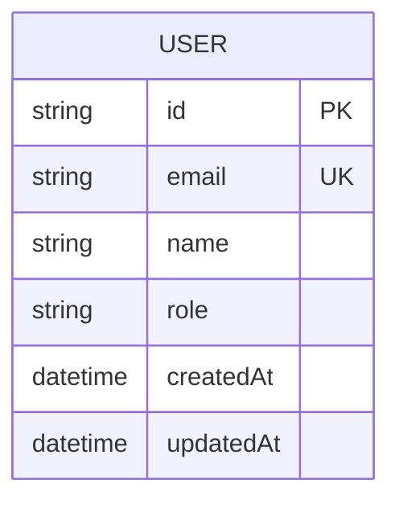

# Scaffolding Specification — Turborepo + Bun Monorepo

모든 `{{PROJECT_NAME}}`은 실행 시 입력받은 project-name으로 치환한다.

---

## §1. 기본 정보

| 항목 | 값 |
|------|-----|
| 프로젝트명 | `{{PROJECT_NAME}}` |
| 패키지 매니저 | Bun (workspace 프로토콜) |
| 모노레포 도구 | Turborepo |
| 네임스페이스 | `@{{PROJECT_NAME}}/*` |
| TypeScript | strict 모드 필수 |
| Node 버전 | >=20 |

---

## §2. 폴더 구조

```
{{PROJECT_NAME}}/
├── apps/
│   ├── web/                    → Next.js 15 (App Router)
│   ├── admin/                  → Next.js 15 (App Router) — 관리자 대시보드
│   └── backend/                → Nest.js API 서버 (포트 2920, prefix /v1)
├── packages/
│   ├── ui-backoffice/          → @{{PROJECT_NAME}}/ui-backoffice
│   ├── ui-common/              → @{{PROJECT_NAME}}/ui-common
│   ├── ui-app/               → @{{PROJECT_NAME}}/ui-app
│   ├── hooks/                  → @{{PROJECT_NAME}}/hooks
│   ├── data/                   → @{{PROJECT_NAME}}/data
│   ├── domain/                 → @{{PROJECT_NAME}}/domain
│   ├── infrastructure/         → @{{PROJECT_NAME}}/infrastructure
│   ├── tokens/                 → @{{PROJECT_NAME}}/tokens
│   └── config/                 → @{{PROJECT_NAME}}/config
└── .u-maker/
    └── docs/
```

---

## §3. 의존 흐름

```
apps/* → hooks → data → domain ← infrastructure
apps/* → ui-*  → tokens
```

패키지별 의존 관계:

| Package | Dependencies |
|---------|-------------|
| `domain` | 없음 (순수 타입/상수) |
| `tokens` | 없음 (순수 CSS) |
| `config` | 없음 (설정 프리셋) |
| `data` | `@{{PROJECT_NAME}}/domain` |
| `infrastructure` | `@{{PROJECT_NAME}}/domain` |
| `hooks` | `@{{PROJECT_NAME}}/data`, `@{{PROJECT_NAME}}/domain` |
| `ui-*` | `@{{PROJECT_NAME}}/tokens` |
| `apps/*` | `@{{PROJECT_NAME}}/hooks`, `@{{PROJECT_NAME}}/ui-*`, `@{{PROJECT_NAME}}/infrastructure`, `@{{PROJECT_NAME}}/domain` |

**역방향 의존 절대 금지.**

---

## §4. 기술 스택

| 영역 | 기술 | 비고 |
|------|------|------|
| FE Framework | Next.js 15 (App Router) | Server Component 기본 |
| BE Framework | Nest.js 10+ | apps/backend 전용 |
| 서버 상태 | TanStack Query v5 | packages/hooks |
| 클라이언트 상태 | Zustand | 최소한으로 사용 |
| 스타일링 | 순수 CSS (.css 파일) | CSS-in-JS, Sass, inline 금지 |
| 디자인 토큰 | CSS Custom Properties | packages/tokens |
| 컴포넌트 문서화 | Storybook 8 | packages/ui-* |
| 린트 | ESLint 9 (Flat Config) | eslint-plugin-header 사용 금지 |
| 타입 | TypeScript 5.x (Strict) | 공유 tsconfig 상속 |

---

## §5. 핵심 규칙

1. **함수형 Only** — class 사용 절대 금지 (Nest.js 제외)
2. **TanStack Query 훅 = usecase** — 별도 usecase 레이어 없음
3. **Server Component 기본** — `'use client'`는 필요 시에만
4. **순수 CSS + Design Tokens** — `var(--*)` 참조, inline style 금지
5. **Named export만 사용** — default export 금지 (Next.js page/layout 제외)
6. **Import alias**: `@/` → `src/` (앱 내부), `@{{PROJECT_NAME}}/` → `packages/*`

---

## §6. 패키지별 생성 상세

### §6.1 packages/config

#### package.json

```json
{
  "name": "@{{PROJECT_NAME}}/config",
  "version": "0.0.0",
  "private": true,
  "exports": {
    "./eslint": "./eslint/index.js",
    "./tsconfig/base": "./tsconfig/base.json",
    "./tsconfig/nextjs": "./tsconfig/nextjs.json",
    "./tsconfig/library": "./tsconfig/library.json"
  }
}
```

#### tsconfig/base.json

```json
{
  "$schema": "https://json.schemastore.org/tsconfig",
  "compilerOptions": {
    "strict": true,
    "esModuleInterop": true,
    "skipLibCheck": true,
    "forceConsistentCasingInFileNames": true,
    "moduleResolution": "bundler",
    "module": "ESNext",
    "target": "ES2022",
    "lib": ["ES2022"],
    "resolveJsonModule": true,
    "isolatedModules": true,
    "incremental": true
  },
  "exclude": ["node_modules"]
}
```

#### tsconfig/nextjs.json

```json
{
  "$schema": "https://json.schemastore.org/tsconfig",
  "extends": "./base.json",
  "compilerOptions": {
    "jsx": "preserve",
    "allowJs": true,
    "noEmit": true,
    "module": "ESNext",
    "plugins": [{ "name": "next" }]
  }
}
```

#### tsconfig/library.json

```json
{
  "$schema": "https://json.schemastore.org/tsconfig",
  "extends": "./base.json",
  "compilerOptions": {
    "declaration": true,
    "declarationMap": true,
    "outDir": "dist",
    "rootDir": "src"
  }
}
```

#### eslint/index.js

```js
import js from "@eslint/js";
import tsPlugin from "@typescript-eslint/eslint-plugin";
import tsParser from "@typescript-eslint/parser";

/** @type {import("eslint").Linter.Config[]} */
export const baseConfig = [
  js.configs.recommended,
  {
    files: ["**/*.{ts,tsx}"],
    plugins: {
      "@typescript-eslint": tsPlugin,
    },
    languageOptions: {
      parser: tsParser,
      parserOptions: {
        ecmaVersion: "latest",
        sourceType: "module",
      },
    },
    rules: {
      ...tsPlugin.configs.recommended.rules,
      "@typescript-eslint/no-unused-vars": [
        "error",
        { argsIgnorePattern: "^_", varsIgnorePattern: "^_" },
      ],
      "@typescript-eslint/no-explicit-any": "warn",
    },
  },
  {
    ignores: ["dist/", ".next/", "node_modules/", ".turbo/"],
  },
];

export const nextConfig = [
  ...baseConfig,
  {
    files: ["**/*.{ts,tsx}"],
    rules: {
      "@typescript-eslint/no-unused-vars": [
        "error",
        { argsIgnorePattern: "^_", varsIgnorePattern: "^_" },
      ],
    },
  },
];

export const libraryConfig = [
  ...baseConfig,
];

export const nestConfig = [
  ...baseConfig,
  {
    files: ["**/*.ts"],
    rules: {
      "@typescript-eslint/no-explicit-any": "off",
    },
  },
];
```

#### eslint/package.json (eslint 디렉토리용이 아님 — 위 index.js의 devDependencies는 config의 package.json에 포함)

config의 package.json devDependencies:

```json
{
  "devDependencies": {
    "@eslint/js": "^9.0.0",
    "@typescript-eslint/eslint-plugin": "^8.0.0",
    "@typescript-eslint/parser": "^8.0.0",
    "eslint": "^9.0.0",
    "typescript": "^5.0.0"
  }
}
```

---

### §6.2 packages/tokens

#### package.json

```json
{
  "name": "@{{PROJECT_NAME}}/tokens",
  "version": "0.0.0",
  "private": true,
  "main": "src/index.css",
  "files": ["src/**/*.css"]
}
```

#### src/colors.css

```css
:root {
  --color-primary: #2563eb;
  --color-primary-hover: #1d4ed8;
  --color-secondary: #64748b;
  --color-on-primary: #ffffff;
  --color-on-secondary: #ffffff;
  --color-surface: #ffffff;
  --color-background: #f8fafc;
  --color-border: #e2e8f0;
  --color-text: #0f172a;
  --color-text-muted: #64748b;
  --color-error: #ef4444;
  --color-success: #22c55e;
}
```

#### src/typography.css

```css
:root {
  --font-family-sans: 'Pretendard', -apple-system, sans-serif;
  --font-family-mono: 'JetBrains Mono', monospace;
  --font-size-xs: 0.75rem;
  --font-size-sm: 0.875rem;
  --font-size-base: 1rem;
  --font-size-lg: 1.125rem;
  --font-size-xl: 1.25rem;
  --font-size-2xl: 1.5rem;
  --font-size-3xl: 1.875rem;
  --font-weight-regular: 400;
  --font-weight-medium: 500;
  --font-weight-semibold: 600;
  --font-weight-bold: 700;
}
```

#### src/spacing.css

```css
:root {
  --spacing-xs: 0.25rem;
  --spacing-sm: 0.5rem;
  --spacing-md: 1rem;
  --spacing-lg: 1.5rem;
  --spacing-xl: 2rem;
  --spacing-2xl: 3rem;
  --radius-sm: 0.25rem;
  --radius-md: 0.5rem;
  --radius-lg: 0.75rem;
  --radius-full: 9999px;
}
```

#### src/shadows.css

```css
:root {
  --shadow-sm: 0 1px 2px 0 rgb(0 0 0 / 0.05);
  --shadow-md: 0 4px 6px -1px rgb(0 0 0 / 0.1), 0 2px 4px -2px rgb(0 0 0 / 0.1);
  --shadow-lg: 0 10px 15px -3px rgb(0 0 0 / 0.1), 0 4px 6px -4px rgb(0 0 0 / 0.1);
}
```

#### src/index.css

```css
@import './colors.css';
@import './typography.css';
@import './spacing.css';
@import './shadows.css';
```

---

### §6.3 packages/domain

#### package.json

```json
{
  "name": "@{{PROJECT_NAME}}/domain",
  "version": "0.0.0",
  "private": true,
  "main": "src/index.ts",
  "types": "src/index.ts",
  "scripts": {
    "build": "tsc --project tsconfig.json",
    "lint": "eslint ."
  },
  "dependencies": {
    "zod": "^3.23.0"
  },
  "devDependencies": {
    "@{{PROJECT_NAME}}/config": "workspace:*",
    "typescript": "^5.0.0",
    "eslint": "^9.0.0"
  }
}
```

#### tsconfig.json

```json
{
  "extends": "@{{PROJECT_NAME}}/config/tsconfig/library",
  "compilerOptions": {
    "outDir": "dist",
    "rootDir": "src"
  },
  "include": ["src"]
}
```

#### eslint.config.js

```js
import { libraryConfig } from "@{{PROJECT_NAME}}/config/eslint";

export default libraryConfig;
```

#### src/models/user.ts

```ts
export interface User {
  id: string;
  email: string;
  name: string;
  role: UserRole;
  createdAt: string;
  updatedAt: string;
}

export type UserRole = "admin" | "manager" | "member";

export interface CreateUserInput {
  email: string;
  name: string;
  role: UserRole;
}

export interface UpdateUserInput {
  name?: string;
  role?: UserRole;
}
```

#### src/models/index.ts

```ts
export { type User, type UserRole, type CreateUserInput, type UpdateUserInput } from "./user";
```

#### src/repositories/user.repository.ts

```ts
import type { User, CreateUserInput, UpdateUserInput } from "../models";

export interface UserRepository {
  findAll(): Promise<User[]>;
  findById(id: string): Promise<User | null>;
  create(input: CreateUserInput): Promise<User>;
  update(id: string, input: UpdateUserInput): Promise<User>;
  delete(id: string): Promise<void>;
}
```

#### src/repositories/index.ts

```ts
export { type UserRepository } from "./user.repository";
```

#### src/validators/user.schema.ts

```ts
import { z } from "zod";

export const userRoleSchema = z.enum(["admin", "manager", "member"]);

export const createUserSchema = z.object({
  email: z.string().email(),
  name: z.string().min(1).max(100),
  role: userRoleSchema,
});

export const updateUserSchema = z.object({
  name: z.string().min(1).max(100).optional(),
  role: userRoleSchema.optional(),
});
```

#### src/validators/index.ts

```ts
export { userRoleSchema, createUserSchema, updateUserSchema } from "./user.schema";
```

#### src/services/index.ts

```ts
// Services barrel export
```

#### src/constants/index.ts

```ts
// Constants barrel export
```

#### src/index.ts

```ts
export * from "./models";
export * from "./repositories";
export * from "./validators";
export * from "./services";
export * from "./constants";
```

---

### §6.4 packages/data

#### package.json

```json
{
  "name": "@{{PROJECT_NAME}}/data",
  "version": "0.0.0",
  "private": true,
  "main": "src/index.ts",
  "types": "src/index.ts",
  "scripts": {
    "build": "tsc --project tsconfig.json",
    "lint": "eslint ."
  },
  "dependencies": {
    "@{{PROJECT_NAME}}/domain": "workspace:*"
  },
  "devDependencies": {
    "@{{PROJECT_NAME}}/config": "workspace:*",
    "typescript": "^5.0.0",
    "eslint": "^9.0.0"
  }
}
```

#### tsconfig.json

```json
{
  "extends": "@{{PROJECT_NAME}}/config/tsconfig/library",
  "compilerOptions": {
    "outDir": "dist",
    "rootDir": "src"
  },
  "include": ["src"]
}
```

#### eslint.config.js

```js
import { libraryConfig } from "@{{PROJECT_NAME}}/config/eslint";

export default libraryConfig;
```

#### src/routes/api-routes.ts

```ts
export const API_ROUTES = {
  USERS: {
    LIST: "/v1/users",
    DETAIL: (id: string) => `/v1/users/${id}`,
    CREATE: "/v1/users",
    UPDATE: (id: string) => `/v1/users/${id}`,
    DELETE: (id: string) => `/v1/users/${id}`,
  },
} as const;
```

#### src/routes/index.ts

```ts
export { API_ROUTES } from "./api-routes";
```

#### src/query-keys/user.keys.ts

```ts
export const userKeys = {
  all: ["users"] as const,
  lists: () => [...userKeys.all, "list"] as const,
  list: (filters?: Record<string, unknown>) =>
    [...userKeys.lists(), filters] as const,
  details: () => [...userKeys.all, "detail"] as const,
  detail: (id: string) => [...userKeys.details(), id] as const,
};
```

#### src/query-keys/index.ts

```ts
export { userKeys } from "./user.keys";
```

#### src/mappers/user.mapper.ts

```ts
import type { User } from "@{{PROJECT_NAME}}/domain";

export interface UserApiResponse {
  id: string;
  email: string;
  name: string;
  role: string;
  created_at: string;
  updated_at: string;
}

export const userMapper = {
  toDomain(raw: UserApiResponse): User {
    return {
      id: raw.id,
      email: raw.email,
      name: raw.name,
      role: raw.role as User["role"],
      createdAt: raw.created_at,
      updatedAt: raw.updated_at,
    };
  },

  toDomainList(rawList: UserApiResponse[]): User[] {
    return rawList.map(userMapper.toDomain);
  },
};
```

#### src/mappers/index.ts

```ts
export { userMapper, type UserApiResponse } from "./user.mapper";
```

#### src/repositories/user.repository.impl.ts

```ts
import type { User, UserRepository, CreateUserInput, UpdateUserInput } from "@{{PROJECT_NAME}}/domain";
import { API_ROUTES } from "../routes";
import { userMapper, type UserApiResponse } from "../mappers";

const MOCK_USERS: User[] = [
  {
    id: "1",
    email: "admin@example.com",
    name: "Admin User",
    role: "admin",
    createdAt: new Date().toISOString(),
    updatedAt: new Date().toISOString(),
  },
];

const createUserRepository = (
  fetcher: (url: string, options?: RequestInit) => Promise<Response>,
): UserRepository => ({
  async findAll(): Promise<User[]> {
    try {
      const response = await fetcher(API_ROUTES.USERS.LIST);
      const data: UserApiResponse[] = await response.json();
      return userMapper.toDomainList(data);
    } catch {
      return MOCK_USERS;
    }
  },

  async findById(id: string): Promise<User | null> {
    try {
      const response = await fetcher(API_ROUTES.USERS.DETAIL(id));
      const data: UserApiResponse = await response.json();
      return userMapper.toDomain(data);
    } catch {
      return MOCK_USERS.find((u) => u.id === id) ?? null;
    }
  },

  async create(input: CreateUserInput): Promise<User> {
    const response = await fetcher(API_ROUTES.USERS.CREATE, {
      method: "POST",
      headers: { "Content-Type": "application/json" },
      body: JSON.stringify(input),
    });
    const data: UserApiResponse = await response.json();
    return userMapper.toDomain(data);
  },

  async update(id: string, input: UpdateUserInput): Promise<User> {
    const response = await fetcher(API_ROUTES.USERS.UPDATE(id), {
      method: "PATCH",
      headers: { "Content-Type": "application/json" },
      body: JSON.stringify(input),
    });
    const data: UserApiResponse = await response.json();
    return userMapper.toDomain(data);
  },

  async delete(id: string): Promise<void> {
    await fetcher(API_ROUTES.USERS.DELETE(id), {
      method: "DELETE",
    });
  },
});

export { createUserRepository };
```

#### src/repositories/index.ts

```ts
export { createUserRepository } from "./user.repository.impl";
```

#### src/utils/index.ts

```ts
// Utils barrel export
```

#### src/index.ts

```ts
export * from "./repositories";
export * from "./mappers";
export * from "./query-keys";
export * from "./routes";
export * from "./utils";
```

---

### §6.5 packages/infrastructure

#### package.json

```json
{
  "name": "@{{PROJECT_NAME}}/infrastructure",
  "version": "0.0.0",
  "private": true,
  "main": "src/index.ts",
  "types": "src/index.ts",
  "scripts": {
    "build": "tsc --project tsconfig.json",
    "lint": "eslint ."
  },
  "dependencies": {
    "@{{PROJECT_NAME}}/domain": "workspace:*",
    "axios": "^1.7.0"
  },
  "devDependencies": {
    "@{{PROJECT_NAME}}/config": "workspace:*",
    "typescript": "^5.0.0",
    "eslint": "^9.0.0"
  }
}
```

#### tsconfig.json

```json
{
  "extends": "@{{PROJECT_NAME}}/config/tsconfig/library",
  "compilerOptions": {
    "outDir": "dist",
    "rootDir": "src"
  },
  "include": ["src"]
}
```

#### eslint.config.js

```js
import { libraryConfig } from "@{{PROJECT_NAME}}/config/eslint";

export default libraryConfig;
```

#### src/api/api-client.ts

```ts
import axios, { type AxiosInstance, type InternalAxiosRequestConfig, type AxiosError } from "axios";

const createApiClient = (baseURL?: string): AxiosInstance => {
  const client = axios.create({
    baseURL: baseURL || process.env.NEXT_PUBLIC_API_URL || "http://localhost:2920",
    timeout: 10000,
    headers: {
      "Content-Type": "application/json",
    },
  });

  client.interceptors.request.use(
    (config: InternalAxiosRequestConfig) => {
      const token =
        typeof window !== "undefined"
          ? localStorage.getItem("access_token")
          : null;
      if (token && config.headers) {
        config.headers.Authorization = `Bearer ${token}`;
      }
      return config;
    },
    (error: AxiosError) => Promise.reject(error),
  );

  client.interceptors.response.use(
    (response) => response,
    (error: AxiosError) => {
      if (error.response?.status === 401) {
        if (typeof window !== "undefined") {
          localStorage.removeItem("access_token");
        }
      }
      return Promise.reject(error);
    },
  );

  return client;
};

export { createApiClient };
```

#### src/api/index.ts

```ts
export { createApiClient } from "./api-client";
```

#### src/auth/index.ts

```ts
// Auth barrel export
```

#### src/storage/storage.ts

```ts
const createStorage = (storage: Storage) => ({
  get<T>(key: string): T | null {
    try {
      const item = storage.getItem(key);
      return item ? (JSON.parse(item) as T) : null;
    } catch {
      return null;
    }
  },

  set<T>(key: string, value: T): void {
    storage.setItem(key, JSON.stringify(value));
  },

  remove(key: string): void {
    storage.removeItem(key);
  },

  clear(): void {
    storage.clear();
  },
});

export const localStore =
  typeof window !== "undefined"
    ? createStorage(window.localStorage)
    : null;

export const sessionStore =
  typeof window !== "undefined"
    ? createStorage(window.sessionStorage)
    : null;
```

#### src/storage/index.ts

```ts
export { localStore, sessionStore } from "./storage";
```

#### src/index.ts

```ts
export * from "./api";
export * from "./auth";
export * from "./storage";
```

---

### §6.6 packages/hooks

#### package.json

```json
{
  "name": "@{{PROJECT_NAME}}/hooks",
  "version": "0.0.0",
  "private": true,
  "main": "src/index.ts",
  "types": "src/index.ts",
  "scripts": {
    "build": "tsc --project tsconfig.json",
    "lint": "eslint ."
  },
  "dependencies": {
    "@{{PROJECT_NAME}}/data": "workspace:*",
    "@{{PROJECT_NAME}}/domain": "workspace:*",
    "@tanstack/react-query": "^5.0.0"
  },
  "peerDependencies": {
    "react": "^18.0.0 || ^19.0.0"
  },
  "devDependencies": {
    "@{{PROJECT_NAME}}/config": "workspace:*",
    "@types/react": "^19.0.0",
    "react": "^19.0.0",
    "typescript": "^5.0.0",
    "eslint": "^9.0.0"
  }
}
```

#### tsconfig.json

```json
{
  "extends": "@{{PROJECT_NAME}}/config/tsconfig/library",
  "compilerOptions": {
    "outDir": "dist",
    "rootDir": "src",
    "jsx": "react-jsx"
  },
  "include": ["src"]
}
```

#### eslint.config.js

```js
import { libraryConfig } from "@{{PROJECT_NAME}}/config/eslint";

export default libraryConfig;
```

#### src/queries/use-users.ts

```ts
import { useQuery } from "@tanstack/react-query";
import { userKeys, createUserRepository } from "@{{PROJECT_NAME}}/data";
import type { User } from "@{{PROJECT_NAME}}/domain";

const repo = createUserRepository(fetch);

export const useUsers = () => {
  return useQuery<User[]>({
    queryKey: userKeys.lists(),
    queryFn: () => repo.findAll(),
  });
};

export const useUser = (id: string) => {
  return useQuery<User | null>({
    queryKey: userKeys.detail(id),
    queryFn: () => repo.findById(id),
    enabled: !!id,
  });
};
```

#### src/queries/index.ts

```ts
export { useUsers, useUser } from "./use-users";
```

#### src/mutations/index.ts

```ts
// Mutations barrel export
```

#### src/index.ts

```ts
export * from "./queries";
export * from "./mutations";
```

---

### §6.7 packages/ui-common (ui-backoffice, ui-app도 동일 구조)

세 UI 패키지 모두 아래 구조를 따른다. `{{UI_PACKAGE}}`는 각각 `ui-common`, `ui-backoffice`, `ui-app`로 치환.

#### package.json

```json
{
  "name": "@{{PROJECT_NAME}}/{{UI_PACKAGE}}",
  "version": "0.0.0",
  "private": true,
  "main": "src/index.ts",
  "types": "src/index.ts",
  "scripts": {
    "build": "tsc --project tsconfig.json",
    "lint": "eslint .",
    "storybook": "storybook dev -p 6006",
    "build-storybook": "storybook build"
  },
  "dependencies": {
    "@{{PROJECT_NAME}}/tokens": "workspace:*"
  },
  "peerDependencies": {
    "react": "^18.0.0 || ^19.0.0",
    "react-dom": "^18.0.0 || ^19.0.0"
  },
  "devDependencies": {
    "@{{PROJECT_NAME}}/config": "workspace:*",
    "@storybook/react": "^8.0.0",
    "@storybook/react-vite": "^8.0.0",
    "storybook": "^8.0.0",
    "@types/react": "^19.0.0",
    "@types/react-dom": "^19.0.0",
    "react": "^19.0.0",
    "react-dom": "^19.0.0",
    "typescript": "^5.0.0",
    "eslint": "^9.0.0"
  }
}
```

#### tsconfig.json

```json
{
  "extends": "@{{PROJECT_NAME}}/config/tsconfig/library",
  "compilerOptions": {
    "outDir": "dist",
    "rootDir": "src",
    "jsx": "react-jsx"
  },
  "include": ["src"]
}
```

#### eslint.config.js

```js
import { libraryConfig } from "@{{PROJECT_NAME}}/config/eslint";

export default libraryConfig;
```

#### .storybook/main.ts

```ts
import type { StorybookConfig } from "@storybook/react-vite";

const config: StorybookConfig = {
  stories: ["../src/**/*.stories.@(ts|tsx)"],
  framework: {
    name: "@storybook/react-vite",
    options: {},
  },
  addons: [],
};

export { config };
export default config;
```

#### .storybook/preview.ts

```ts
import "@{{PROJECT_NAME}}/tokens/src/index.css";
import type { Preview } from "@storybook/react";

const preview: Preview = {
  parameters: {
    controls: {
      matchers: {
        color: /(background|color)$/i,
        date: /Date$/i,
      },
    },
  },
};

export default preview;
```

#### src/components/Button/Button.tsx

```tsx
import type { ButtonHTMLAttributes, ReactNode } from "react";
import "./Button.css";

interface ButtonProps extends ButtonHTMLAttributes<HTMLButtonElement> {
  variant?: "primary" | "secondary" | "ghost";
  size?: "sm" | "md" | "lg";
  children: ReactNode;
}

const Button = ({
  variant = "primary",
  size = "md",
  children,
  className = "",
  ...props
}: ButtonProps) => {
  return (
    <button
      className={`btn btn--${variant} btn--${size} ${className}`.trim()}
      {...props}
    >
      {children}
    </button>
  );
};

export { Button, type ButtonProps };
```

#### src/components/Button/Button.css

```css
.btn {
  display: inline-flex;
  align-items: center;
  justify-content: center;
  border: none;
  border-radius: var(--radius-md);
  font-family: var(--font-family-sans);
  font-weight: var(--font-weight-medium);
  cursor: pointer;
  transition: background-color 0.15s ease, color 0.15s ease;
}

.btn--primary {
  background-color: var(--color-primary);
  color: var(--color-on-primary);
}

.btn--primary:hover {
  background-color: var(--color-primary-hover);
}

.btn--secondary {
  background-color: var(--color-secondary);
  color: var(--color-on-secondary);
}

.btn--ghost {
  background-color: transparent;
  color: var(--color-text);
}

.btn--ghost:hover {
  background-color: var(--color-background);
}

.btn--sm {
  padding: var(--spacing-xs) var(--spacing-sm);
  font-size: var(--font-size-sm);
}

.btn--md {
  padding: var(--spacing-sm) var(--spacing-md);
  font-size: var(--font-size-base);
}

.btn--lg {
  padding: var(--spacing-md) var(--spacing-lg);
  font-size: var(--font-size-lg);
}
```

#### src/components/Button/Button.stories.tsx

```tsx
import type { Meta, StoryObj } from "@storybook/react";
import { Button } from "./Button";

const meta: Meta<typeof Button> = {
  title: "Components/Button",
  component: Button,
  argTypes: {
    variant: {
      control: "select",
      options: ["primary", "secondary", "ghost"],
    },
    size: {
      control: "select",
      options: ["sm", "md", "lg"],
    },
  },
};

export default meta;
type Story = StoryObj<typeof Button>;

export const Primary: Story = {
  args: {
    children: "Button",
    variant: "primary",
    size: "md",
  },
};

export const Secondary: Story = {
  args: {
    children: "Button",
    variant: "secondary",
    size: "md",
  },
};

export const Ghost: Story = {
  args: {
    children: "Button",
    variant: "ghost",
    size: "md",
  },
};
```

#### src/components/Button/index.ts

```ts
export { Button, type ButtonProps } from "./Button";
```

#### src/index.ts

```ts
export * from "./components/Button";
```

---

### §6.8 apps/web, apps/admin (Next.js)

두 Next.js 앱 모두 동일 구조. `{{APP_NAME}}`은 각각 `web`, `admin`으로 치환.
포트: web=3000, admin=3001.

#### package.json

```json
{
  "name": "@{{PROJECT_NAME}}/{{APP_NAME}}",
  "version": "0.0.0",
  "private": true,
  "scripts": {
    "dev": "next dev --port {{PORT}}",
    "build": "next build",
    "start": "next start --port {{PORT}}",
    "lint": "eslint ."
  },
  "dependencies": {
    "@{{PROJECT_NAME}}/domain": "workspace:*",
    "@{{PROJECT_NAME}}/hooks": "workspace:*",
    "@{{PROJECT_NAME}}/infrastructure": "workspace:*",
    "@{{PROJECT_NAME}}/tokens": "workspace:*",
    "@{{PROJECT_NAME}}/ui-common": "workspace:*",
    "@tanstack/react-query": "^5.0.0",
    "next": "^15.0.0",
    "react": "^19.0.0",
    "react-dom": "^19.0.0"
  },
  "devDependencies": {
    "@{{PROJECT_NAME}}/config": "workspace:*",
    "@types/react": "^19.0.0",
    "@types/react-dom": "^19.0.0",
    "typescript": "^5.0.0",
    "eslint": "^9.0.0"
  }
}
```

`apps/admin`은 추가로 `@{{PROJECT_NAME}}/ui-backoffice` 의존 포함.

#### next.config.ts

```ts
import type { NextConfig } from "next";

const nextConfig: NextConfig = {
  transpilePackages: [
    "@{{PROJECT_NAME}}/ui-common",
    "@{{PROJECT_NAME}}/ui-backoffice",
    "@{{PROJECT_NAME}}/ui-app",
    "@{{PROJECT_NAME}}/hooks",
    "@{{PROJECT_NAME}}/data",
    "@{{PROJECT_NAME}}/domain",
    "@{{PROJECT_NAME}}/infrastructure",
  ],
};

export default nextConfig;
```

#### tsconfig.json

```json
{
  "extends": "@{{PROJECT_NAME}}/config/tsconfig/nextjs",
  "compilerOptions": {
    "paths": {
      "@/*": ["./src/*"]
    }
  },
  "include": ["src", "next-env.d.ts", ".next/types/**/*.ts"],
  "exclude": ["node_modules"]
}
```

#### eslint.config.js

```js
import { nextConfig } from "@{{PROJECT_NAME}}/config/eslint";

export default nextConfig;
```

#### src/app/globals.css

```css
@import "@{{PROJECT_NAME}}/tokens/src/index.css";

*,
*::before,
*::after {
  box-sizing: border-box;
  margin: 0;
  padding: 0;
}

body {
  font-family: var(--font-family-sans);
  font-size: var(--font-size-base);
  color: var(--color-text);
  background-color: var(--color-background);
  line-height: 1.6;
}

.page-main {
  padding: var(--spacing-xl);
}
```

#### src/app/layout.tsx

```tsx
import type { ReactNode } from "react";
import "./globals.css";

export const metadata = {
  title: "{{APP_NAME}}",
  description: "{{APP_NAME}} application",
};

export default function RootLayout({ children }: { children: ReactNode }) {
  return (
    <html lang="ko">
      <body>{children}</body>
    </html>
  );
}
```

#### src/app/page.tsx

```tsx
import { Button } from "@{{PROJECT_NAME}}/ui-common";

export default function HomePage() {
  return (
    <main className="page-main">
      <h1>{{APP_NAME}}</h1>
      <p>Welcome to {{APP_NAME}}</p>
      <Button variant="primary">Get Started</Button>
    </main>
  );
}
```

> Note: `page.tsx`와 `layout.tsx`는 Next.js 규칙상 default export를 사용한다.

#### src/lib/api.ts

```ts
import { createApiClient } from "@{{PROJECT_NAME}}/infrastructure";

export const apiClient = createApiClient();
```

#### src/features/

빈 디렉토리. `.gitkeep` 파일 생성.

---

### §6.9 apps/backend (Nest.js)

#### package.json

```json
{
  "name": "@{{PROJECT_NAME}}/backend",
  "version": "0.0.0",
  "private": true,
  "scripts": {
    "dev": "nest start --watch",
    "build": "nest build",
    "start": "node dist/main",
    "lint": "eslint ."
  },
  "dependencies": {
    "@nestjs/common": "^10.0.0",
    "@nestjs/core": "^10.0.0",
    "@nestjs/platform-express": "^10.0.0",
    "@nestjs/swagger": "^8.0.0",
    "reflect-metadata": "^0.2.0",
    "rxjs": "^7.8.0"
  },
  "devDependencies": {
    "@{{PROJECT_NAME}}/config": "workspace:*",
    "@nestjs/cli": "^10.0.0",
    "@types/express": "^5.0.0",
    "typescript": "^5.0.0",
    "eslint": "^9.0.0"
  }
}
```

#### nest-cli.json

```json
{
  "$schema": "https://json.schemastore.org/nest-cli",
  "collection": "@nestjs/schematics",
  "sourceRoot": "src",
  "compilerOptions": {
    "deleteOutDir": true
  }
}
```

#### tsconfig.json

```json
{
  "extends": "@{{PROJECT_NAME}}/config/tsconfig/base",
  "compilerOptions": {
    "outDir": "dist",
    "rootDir": "src",
    "module": "commonjs",
    "target": "ES2022",
    "moduleResolution": "node",
    "declaration": true,
    "emitDecoratorMetadata": true,
    "experimentalDecorators": true,
    "sourceMap": true,
    "incremental": true
  },
  "include": ["src"]
}
```

#### eslint.config.js

```js
import { nestConfig } from "@{{PROJECT_NAME}}/config/eslint";

export default nestConfig;
```

#### src/main.ts

```ts
import { NestFactory } from "@nestjs/core";
import { SwaggerModule, DocumentBuilder } from "@nestjs/swagger";
import { AppModule } from "./app.module";

async function bootstrap() {
  const app = await NestFactory.create(AppModule);

  app.setGlobalPrefix("v1");
  app.enableCors();

  const swaggerConfig = new DocumentBuilder()
    .setTitle("{{PROJECT_NAME}} API")
    .setDescription("{{PROJECT_NAME}} Backend API")
    .setVersion("1.0")
    .build();

  const document = SwaggerModule.createDocument(app, swaggerConfig);

  // GET /v1/reference → Swagger UI
  SwaggerModule.setup("v1/reference", app, document);

  // GET /v1/openapi.json → raw OpenAPI spec
  app.getHttpAdapter().get("/v1/openapi.json", (_req: unknown, res: { json: (doc: unknown) => void }) => {
    res.json(document);
  });

  await app.listen(2920);
  console.log("Backend running on http://localhost:2920");
}

bootstrap();
```

#### src/app.module.ts

```ts
import { Module } from "@nestjs/common";
import { UsersModule } from "./users/users.module";

@Module({
  imports: [UsersModule],
})
export class AppModule {}
```

#### src/users/users.module.ts

```ts
import { Module } from "@nestjs/common";
import { UsersController } from "./users.controller";
import { UsersService } from "./users.service";

@Module({
  controllers: [UsersController],
  providers: [UsersService],
})
export class UsersModule {}
```

#### src/users/users.controller.ts

```ts
import { Controller, Get, Param } from "@nestjs/common";
import { ApiTags, ApiOperation, ApiResponse } from "@nestjs/swagger";
import { UsersService } from "./users.service";

@ApiTags("Users")
@Controller("users")
export class UsersController {
  constructor(private readonly usersService: UsersService) {}

  @Get()
  @ApiOperation({ summary: "Get all users" })
  @ApiResponse({ status: 200, description: "List of users" })
  findAll() {
    return this.usersService.findAll();
  }

  @Get(":id")
  @ApiOperation({ summary: "Get user by ID" })
  @ApiResponse({ status: 200, description: "User found" })
  @ApiResponse({ status: 404, description: "User not found" })
  findOne(@Param("id") id: string) {
    return this.usersService.findOne(id);
  }
}
```

#### src/users/users.service.ts

```ts
import { Injectable } from "@nestjs/common";

interface User {
  id: string;
  email: string;
  name: string;
  role: string;
  created_at: string;
  updated_at: string;
}

@Injectable()
export class UsersService {
  private readonly users: User[] = [
    {
      id: "1",
      email: "admin@example.com",
      name: "Admin User",
      role: "admin",
      created_at: new Date().toISOString(),
      updated_at: new Date().toISOString(),
    },
    {
      id: "2",
      email: "member@example.com",
      name: "Member User",
      role: "member",
      created_at: new Date().toISOString(),
      updated_at: new Date().toISOString(),
    },
  ];

  findAll(): User[] {
    return this.users;
  }

  findOne(id: string): User | undefined {
    return this.users.find((user) => user.id === id);
  }
}
```

---

## §7. Root Configuration Files

### package.json

```json
{
  "name": "{{PROJECT_NAME}}",
  "private": true,
  "workspaces": ["apps/*", "packages/*"],
  "scripts": {
    "dev": "turbo dev",
    "build": "turbo build",
    "lint": "turbo lint",
    "storybook": "turbo storybook --filter=@{{PROJECT_NAME}}/ui-common",
    "clean": "turbo clean && rm -rf node_modules"
  },
  "devDependencies": {
    "turbo": "^2.0.0"
  },
  "packageManager": "bun@1.2.0"
}
```

### turbo.json

```json
{
  "$schema": "https://turbo.build/schema.json",
  "tasks": {
    "build": {
      "dependsOn": ["^build"],
      "outputs": [".next/**", "dist/**"]
    },
    "dev": {
      "cache": false,
      "persistent": true
    },
    "lint": {
      "dependsOn": ["^build"]
    },
    "storybook": {
      "cache": false,
      "persistent": true
    },
    "test": {
      "dependsOn": ["^build"]
    }
  }
}
```

### tsconfig.json (root)

```json
{
  "extends": "@{{PROJECT_NAME}}/config/tsconfig/base"
}
```

### .gitignore

```
node_modules/
.next/
dist/
.turbo/
bun.lockb
.env*.local
.u-maker/.state/
.u-maker/output/
.u-maker/reports/
*.tsbuildinfo
```

### CLAUDE.md

프로젝트 루트에 생성하는 **AI 에이전트 가이드**. Claude Code가 이 프로젝트에서 작업할 때 컨텍스트로 로드되어 동작 기준이 된다. **실제 스캐폴드된 구조·스택·규칙만** 기술한다 — 스캐폴드에 없는 컴포넌트(예: 아직 추출하지 않은 layout primitive)를 강제하지 않는다. `{{PROJECT_NAME}}` 치환을 적용하고, Step 6 git commit 에 포함된다.

```markdown
# {{PROJECT_NAME}}

Turborepo 모노레포. 패키지 매니저 `bun@1.2.0`, Clean Architecture 레이어 구조.

## 디자인시스템

- 각 앱은 raw HTML / inline style 대신 `@{{PROJECT_NAME}}/ui-*` 컴포넌트와 `@{{PROJECT_NAME}}/tokens` design token 만 사용한다.
- `ui-common`: 공통 컴포넌트(모든 앱). `ui-backoffice`: 관리자/백오피스(admin). `ui-app`: 엔드유저 앱 UI.
- inline style 금지 — 색·간격·타이포 등 모든 값은 design token(`var(--*)`)으로 표현한다.
- 레이아웃(`display`/`flex*`/`grid*`/`gap`/`padding`/`margin`)을 `<div>` + inline style 로 직접 짜지 말 것. 반복되는 레이아웃 컴포지션은 `ui-*` 패키지에 layout primitive 컴포넌트로 추출해 재사용한다.

## 명령어

- 전체: `bun run dev|build|lint|storybook`
- 단일 앱/패키지: `bun --filter @{{PROJECT_NAME}}/<name> run dev|build`
- Push 전 필수: `bun run build && bun run lint` 통과 확인

## 앱

| 앱 | 포트 | 스택 |
|----|------|------|
| web | 3000 | Next.js 15 App Router |
| admin | 3001 | Next.js 15 App Router (관리자 대시보드) |
| backend | 2920 | Nest.js API, prefix `/v1`, Swagger (`GET /v1/reference`, `GET /v1/openapi.json`) |

## 아키텍처 (Clean Architecture)

의존 흐름: `apps/* → hooks → data → domain ← infrastructure`, `apps/* → ui-* → tokens`

- **domain** (`@{{PROJECT_NAME}}/domain`): 타입, 인터페이스, Zod 검증, 서비스. 외부 의존 없음.
- **data** (`@{{PROJECT_NAME}}/data`): Repository 구현, Mapper, queryKeys, routes. → domain.
- **infrastructure** (`@{{PROJECT_NAME}}/infrastructure`): axios apiClient, storage. → domain.
- **hooks** (`@{{PROJECT_NAME}}/hooks`): TanStack Query 훅 = usecase. → data, domain.
- **ui** (`@{{PROJECT_NAME}}/ui-common|ui-backoffice|ui-app`): 컴포넌트 + Storybook. → tokens.

Repository: 인터페이스는 `domain/src/repositories/`, 구현은 `data/src/repositories/`. API 호출 실패 시 mock fallback (`try { await api(...) } catch { return mockData }`).

Import alias: `@/` → 앱의 `src/`, `@{{PROJECT_NAME}}/` → `packages/*`.

## SSoT

설계 문서(`.u-maker/docs/`): SRS → ERD → API Contract → Screen 이 구현 기준. 코드와 문서가 어긋나면(gap) 문서를 먼저 갱신한 뒤 구현한다.

## 코딩 컨벤션

- TypeScript strict, 함수형(class 금지 — Nest.js 제외), Named export(Next.js page/layout 제외).
- 네이밍: 변수/함수 `camelCase`, 타입 `PascalCase`, 상수 `UPPER_SNAKE_CASE`, 파일 `kebab-case.ts`(컴포넌트 `PascalCase.tsx`).
- Server Component 기본, 필요 시에만 `'use client'`.
- 서버 상태는 TanStack Query(설치됨). 클라이언트 상태가 필요하면 Zustand 권장(스캐폴드 미포함 — 필요 시 추가).
- 스타일: 순수 CSS(`.css`) + design token. CSS-in-JS / Sass / SCSS / inline style 금지.
- 공통 모듈은 `packages/*` 에 구현.

## 금지사항

1. **앱에서 API 직접 호출 금지** — 반드시 `domain → data → hooks → apps` 경유.
2. **Next.js API Route / Route Handler 금지** — 백엔드는 `apps/backend`(Nest.js, `/v1`) 가 담당.
3. **클래스 금지** — 함수형만 (Nest.js 제외).
4. **역방향 의존 금지** — domain 이 data/infrastructure/hooks 를 import 불가.
5. **`packages/` 새 폴더 생성 금지** — 기존 패키지만 사용.
6. **layout 용도 inline style 금지** — design token + `ui-*` 컴포넌트로 표현.

## Git

- Commit: `type(scope): message` (type: feat/fix/refactor/chore/docs/style/test, scope: 패키지·앱명).
- Branch: `feat/|fix/|refactor/|chore/`.
- Push 전 `bun run build && bun run lint` 통과 필수.
```

---

## §8. SSoT Document Templates

### .u-maker/docs/SRS.md

```markdown
---
Owner: TBD
Status: Draft
Version: 0.1.0
Last Updated: {{ISO_DATE}}
App: {{PROJECT_NAME}}
---

# Software Requirements Specification

## 1. Overview

### 1.1 Purpose

### 1.2 Scope

### 1.3 Definitions & Acronyms

## 2. Functional Requirements

| ID | Category | Requirement | Priority | Status |
|----|----------|-------------|----------|--------|

## 3. Non-Functional Requirements

| ID | Category | Requirement | Priority |
|----|----------|-------------|----------|

## 4. User Stories

| ID | As a... | I want to... | So that... | Linked FR |
|----|---------|-------------|------------|-----------|

## 5. Features (Implementation Units)

| ID | Feature Name | Description | Linked US | Complexity |
|----|-------------|-------------|-----------|------------|
```

### .u-maker/docs/ERD.md

```markdown
---
Owner: TBD
Status: Draft
Version: 0.1.0
Last Updated: {{ISO_DATE}}
App: {{PROJECT_NAME}}
---

# Entity-Relationship Diagram

## Overview



## Entities

| ID | Entity | Description | Key Fields |
|----|--------|-------------|------------|

## Relationships

| ID | From | To | Type | Description |
|----|------|----|------|-------------|
```

### .u-maker/docs/API-Contract.md

```markdown
---
Owner: TBD
Status: Draft
Version: 0.1.0
Last Updated: {{ISO_DATE}}
App: {{PROJECT_NAME}}
---

# API Contract

## Base URL

`http://localhost:2920/v1`

## Endpoints

| ID | Method | Path | Description | Request Body | Response |
|----|--------|------|-------------|-------------|----------|
| API-010 | GET | /users | List all users | — | User[] |
| API-020 | GET | /users/:id | Get user by ID | — | User |

## Error Responses

| Status | Description |
|--------|-------------|
| 400 | Bad Request |
| 401 | Unauthorized |
| 404 | Not Found |
| 500 | Internal Server Error |
```

### .u-maker/docs/Screen.md

```markdown
---
Owner: TBD
Status: Draft
Version: 0.1.0
Last Updated: {{ISO_DATE}}
App: {{PROJECT_NAME}}
---

# Screen Specification

## Screen List

| ID | Screen Name | Route | Type | Description | Linked US |
|----|------------|-------|------|-------------|-----------|

## Screen Details

### SC-010: (TBD)

**Route:** /
**Type:** dashboard
**Components:**
**Interactions:**
**Validation Rules:**
```

---

## §9. Naming Convention

| 대상 | 규칙 | 예시 |
|------|------|------|
| 변수/함수 | camelCase | `fetchUser`, `userName` |
| 타입/인터페이스 | PascalCase | `UserRepository` |
| 상수 | UPPER_SNAKE_CASE | `MAX_RETRY_COUNT` |
| 파일 (일반) | kebab-case.ts | `user-repository.ts` |
| 파일 (컴포넌트) | PascalCase.tsx | `UserCard.tsx` |

---

## §10. 금지 사항

- class 컴포넌트 / 클래스 (Nest.js 제외)
- 별도 usecase 레이어
- CSS-in-JS / Sass / SCSS / inline style
- eslint-plugin-header
- npm / yarn / pnpm 관련 설정
- Next.js API Route / Route Handler
- apps에서 API 직접 호출 (반드시 domain → data → hooks 경유)
- 역방향 의존 (domain이 data/hooks를 import하는 등)
- packages/ 아래 명세에 없는 새 폴더
