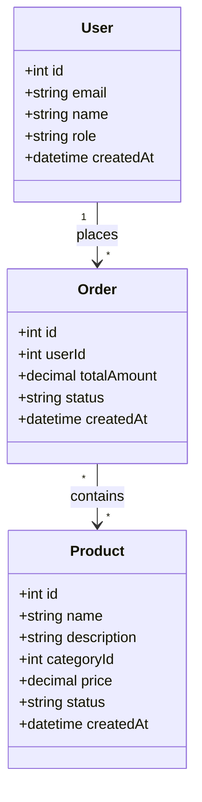

# API Specification Reference

> Detailed rules for generating the API Contract document, including endpoint derivation from FRs, OpenAPI 3.0 structure, request/response schemas, authentication/role mapping, error response conventions, Mermaid classDiagram for models, and JSON companion structure.

## 1. Overview

The API Contract defines the interface between frontend and backend. It translates SRS functional requirements and ERD entities into RESTful API endpoints with full request/response schemas, authentication rules, and error handling conventions. The API Contract is the contract that frontend and backend teams use independently -- any change to this document constitutes a breaking change that requires coordination.

The API Contract is produced as a pair: `api.md` (human-readable with Mermaid diagrams) and `api.json` (machine-readable companion conforming to `_meta/schemas/doc-companion.schema.json`). Every endpoint must trace back to at least one FR from the SRS.

## 2. Endpoint Derivation from FR

Endpoints are derived from SRS functional requirements through a systematic mapping process.

### 2.1 Derivation Algorithm

1. **Identify CRUD operations:** For each FR that implies data management ("create", "read", "list", "update", "delete", "manage"), generate the standard CRUD endpoint set for the related entity.

2. **Identify action endpoints:** For FRs that describe non-CRUD operations ("send notification", "generate report", "process payment", "export data"), create action-specific endpoints.

3. **Map FR to endpoint set:**

| FR Pattern | Generated Endpoints |
|-----------|-------------------|
| "Manage {Entity}" | GET /entities, GET /entities/:id, POST /entities, PUT /entities/:id, DELETE /entities/:id |
| "List {Entity}" | GET /entities |
| "Create {Entity}" | POST /entities |
| "View {Entity} detail" | GET /entities/:id |
| "Update {Entity}" | PUT /entities/:id |
| "Delete {Entity}" | DELETE /entities/:id |
| "Search {Entity}" | GET /entities?q={query}&filters... |
| "{Action} {Entity}" | POST /entities/:id/{action} |

4. **Map IA page inventory:** Cross-reference the IA page inventory to identify which endpoints each page needs. A page like "Product List" needs `GET /products`, while "Product Detail" needs `GET /products/:id`.

5. **Assign IDs:** Each endpoint receives an API-prefixed ID in 10-increment: API-010, API-020, API-030, etc.

### 2.2 URL Path Conventions

- Use plural nouns for resource collections: `/users`, `/products`, `/orders`
- Use kebab-case for multi-word resources: `/order-items`, `/product-categories`
- Use path parameters for specific resources: `/users/:id`, `/orders/:orderId/items`
- Nest related resources up to 2 levels: `/users/:userId/orders` (not deeper)
- Use query parameters for filtering, sorting, pagination: `?status=active&sort=name&page=1&limit=20`
- Action endpoints use verb suffixes: `/orders/:id/cancel`, `/users/:id/activate`

## 3. OpenAPI 3.0 Structure

While the API Contract is written in Markdown (not YAML), its structure mirrors OpenAPI 3.0 for clarity and future export capability.

### 3.1 Endpoint Detail Structure

Each endpoint in Section 2 of the API document follows this structure:

```markdown
### API-010: List Products

**Endpoint:** `GET /api/v1/products`
**Auth:** Bearer Token (roles: admin, manager, user)
**Related FR:** FR-020

**Query Parameters:**

| Parameter | Type | Required | Default | Description |
|-----------|------|----------|---------|-------------|
| page | integer | No | 1 | Page number |
| limit | integer | No | 20 | Items per page (max: 100) |
| sort | string | No | created_at | Sort field |
| order | enum | No | desc | Sort order: asc/desc |
| q | string | No | — | Search query |
| category_id | integer | No | — | Filter by category |
| status | enum | No | — | Filter by status |

**Response (200):**
```json
{
  "data": [
    {
      "id": 1,
      "name": "string",
      "category_id": 1,
      "price": 29.99,
      "status": "active",
      "created_at": "2026-04-03T10:00:00Z"
    }
  ],
  "pagination": {
    "page": 1,
    "limit": 20,
    "total": 150,
    "totalPages": 8
  }
}
```
```

### 3.2 Request Body Convention

For POST and PUT endpoints, the request body uses JSON format:

```markdown
**Request Body:**
```json
{
  "name": "string (required, max: 255)",
  "description": "string (optional, max: 5000)",
  "category_id": "integer (required, FK to categories)",
  "price": "decimal (required, min: 0)",
  "status": "enum: draft|active|archived (default: draft)"
}
```
```

Field descriptions include: type, required/optional, constraints (min, max, pattern), and references (FK relationships).

### 3.3 Pagination Standard

All list endpoints use consistent pagination:

```json
{
  "data": [],
  "pagination": {
    "page": 1,
    "limit": 20,
    "total": 150,
    "totalPages": 8
  }
}
```

Query parameters: `page` (1-based), `limit` (default 20, max 100), `sort` (field name), `order` (asc/desc).

## 4. Request/Response Schemas

### 4.1 Response Envelope

All API responses follow a consistent envelope:

**Success (single item):**
```json
{
  "data": { ... }
}
```

**Success (list):**
```json
{
  "data": [ ... ],
  "pagination": { ... }
}
```

**Error:**
```json
{
  "error": {
    "code": "VALIDATION_ERROR",
    "message": "Human-readable error message",
    "details": [
      { "field": "email", "message": "Email is already taken" }
    ]
  }
}
```

### 4.2 Data Type Mapping

Columns from the ERD map to API field types:

| ERD Type | API Type | JSON Type | Notes |
|----------|---------|-----------|-------|
| bigint | integer | number | IDs, counts |
| int | integer | number | Small integers |
| varchar | string | string | With maxLength |
| text | string | string | No maxLength |
| boolean | boolean | boolean | true/false |
| decimal | number | number | Precision preserved |
| timestamp | string (ISO 8601) | string | Format: "2026-04-03T10:00:00Z" |
| date | string (ISO 8601) | string | Format: "2026-04-03" |
| json | object | object | Flexible schema |
| enum | string (enum) | string | Enumerated values |

### 4.3 Field Naming Convention

- API field names use `camelCase` in JSON: `createdAt`, `categoryId`, `userName`
- This differs from the ERD column names (snake_case). The API layer performs the mapping.
- Nested objects use the entity name: `{ "category": { "id": 1, "name": "..." } }`

## 5. Authentication and Role Mapping

### 5.1 Auth Section Structure

Section 3 of the API document defines the auth/role matrix:

| Role | Description | Accessible Endpoints |
|------|-----------|---------------------|
| admin | Full system access | All endpoints |
| manager | Department management | CRUD on owned resources, read all |
| user | Regular user | CRUD on own resources only |
| guest | Unauthenticated | Public read-only endpoints |

### 5.2 Auth Derivation

- Roles are derived from SRS stakeholders and FRs that mention role-based access.
- Auth requirements are derived from IA navigation items (Auth Required field).
- Public endpoints (guest-accessible) correspond to pages where `authRequired: false` in the IA.

### 5.3 Auth Header Convention

All authenticated endpoints require:
```
Authorization: Bearer {token}
```

Token format, refresh logic, and session management are documented but not defined in the API Contract -- they are implementation details.

### 5.4 Role-Based Response Filtering

Some endpoints return different data based on role:
- Admin sees all fields including internal metadata
- Regular users see only their own data and public fields
- This is noted in the endpoint detail as "Response varies by role"

## 6. Error Response Conventions

### 6.1 Standard Error Codes

| HTTP Status | Error Code | When Used |
|------------|-----------|-----------|
| 400 | `VALIDATION_ERROR` | Request body fails validation |
| 400 | `BAD_REQUEST` | Malformed request structure |
| 401 | `UNAUTHORIZED` | Missing or invalid auth token |
| 403 | `FORBIDDEN` | Valid token but insufficient role |
| 404 | `NOT_FOUND` | Resource does not exist |
| 409 | `CONFLICT` | Duplicate resource or state conflict |
| 422 | `UNPROCESSABLE_ENTITY` | Business rule violation |
| 429 | `RATE_LIMITED` | Too many requests |
| 500 | `INTERNAL_ERROR` | Unexpected server error |

### 6.2 Error Response Format

Every endpoint in Section 2 includes an error table:

| Code | Message | Condition |
|------|---------|-----------|
| 400 | Validation failed | Required fields missing or invalid format |
| 401 | Unauthorized | No Bearer token provided |
| 403 | Forbidden | User role lacks permission |
| 404 | Product not found | ID does not exist |

### 6.3 Validation Error Details

For 400 VALIDATION_ERROR responses, the `details` array lists each field-level error:

```json
{
  "error": {
    "code": "VALIDATION_ERROR",
    "message": "Validation failed",
    "details": [
      { "field": "name", "message": "Name is required" },
      { "field": "price", "message": "Price must be a positive number" }
    ]
  }
}
```

## 7. Mermaid classDiagram for Models

Section 4 of the API document includes a Mermaid class diagram showing the API data models and their relationships.

### 7.1 Class Diagram Syntax



### 7.2 Class Diagram Conventions

- Class names use PascalCase: `User`, `Product`, `OrderItem`
- Fields use camelCase (matching API JSON format): `createdAt`, `categoryId`
- Visibility: use `+` for public fields (all API fields are public by convention)
- Relationships use the same cardinality as the ERD but in classDiagram notation
- Only include fields that appear in API responses (not internal database fields like `password_hash`)

## 8. JSON Companion Structure (api.json)

The `api.json` file conforms to `_meta/schemas/doc-companion.schema.json`:

```json
{
  "docType": "api",
  "app": "my-app",
  "status": "Draft",
  "version": "1.0.0",
  "lastUpdated": "2026-04-03T11:15:00Z",
  "items": [
    {
      "id": "API-010",
      "type": "endpoint",
      "title": "List Products",
      "description": "GET /api/v1/products — Returns paginated product list",
      "status": "Draft",
      "priority": "Must",
      "tracedFrom": ["FR-020"],
      "tracedTo": ["SC-060"],
      "method": "GET",
      "path": "/api/v1/products",
      "auth": "Bearer",
      "roles": ["admin", "manager", "user"]
    }
  ],
  "crossRefs": [
    {
      "from": "API-010",
      "to": "FR-020",
      "relation": "implements"
    },
    {
      "from": "API-010",
      "to": "ENT-020",
      "relation": "references"
    }
  ]
}
```

### 8.1 Item Type Values for API

| type | Used For |
|------|---------|
| `endpoint` | API endpoint definitions |
| `model` | Data model definitions (from classDiagram) |

### 8.2 Extended Fields

Endpoint items include additional fields beyond the base doc-companion schema: `method` (GET/POST/PUT/DELETE), `path` (URL path), `auth` (Bearer/None), and `roles` (array of role strings). These enable downstream tools to generate OpenAPI YAML or SDK code.

## 9. API Versioning

All API paths are prefixed with `/api/v1/`. The version prefix ensures backward compatibility when breaking changes are introduced in future iterations. The version number is documented in the API summary section and in the `api.json` version field.

## 10. Validation Checks

After API Contract generation, the following validations are performed:

1. **ID uniqueness:** No duplicate API IDs.
2. **ID format:** All IDs match `^API-\d{3}$`.
3. **Method/path uniqueness:** No two endpoints share the same method + path combination.
4. **FR traceability:** Every endpoint traces to at least one FR.
5. **ERD consistency:** Endpoints referencing entities must map to valid ENT IDs in the ERD.
6. **Auth completeness:** Every endpoint specifies auth requirements and allowed roles.
7. **Error tables present:** Every endpoint includes an error response table.
8. **Response schema completeness:** Every endpoint has at least one success response example.
9. **Mermaid syntax validity:** The classDiagram block is syntactically valid Mermaid.
10. **JSON-Markdown sync:** Every item in `api.json` has a corresponding entry in `api.md`.
11. **Link graph update:** `data/links.json` contains nodes and edges for all API items.
