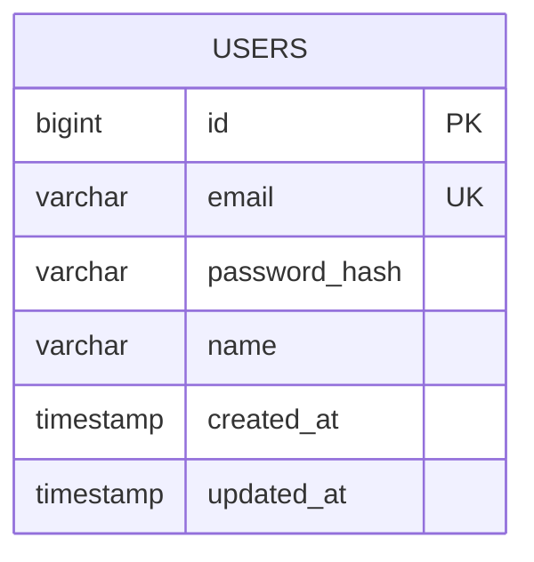
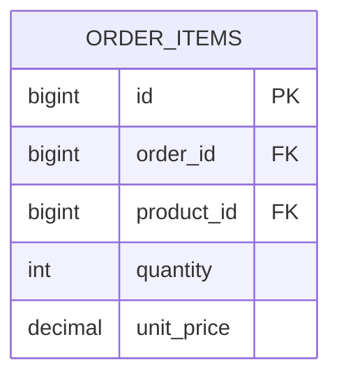
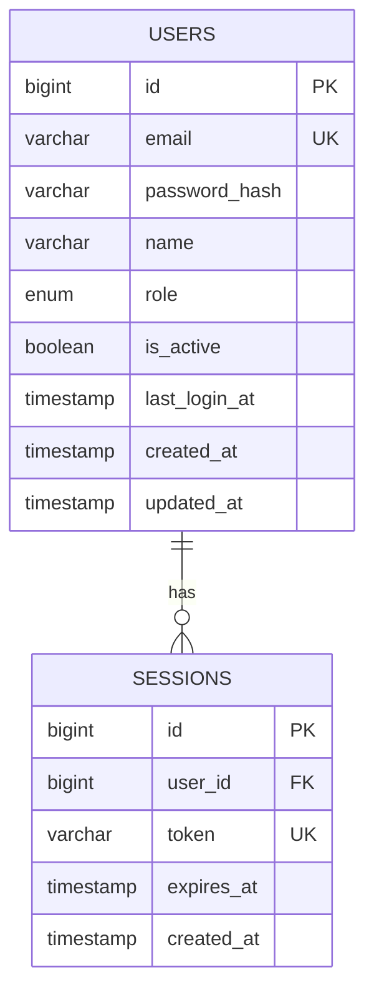
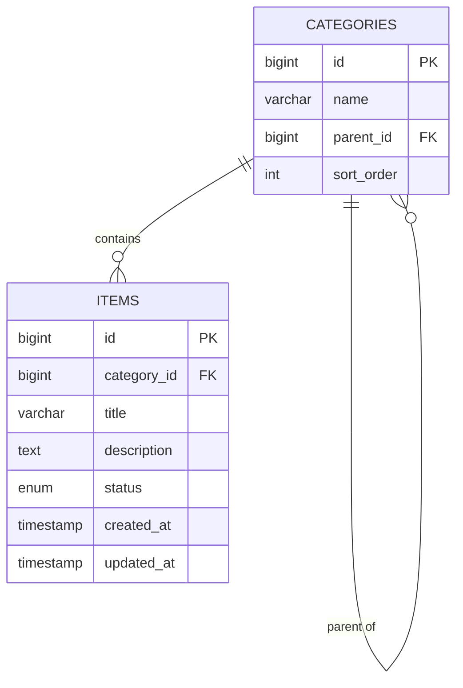
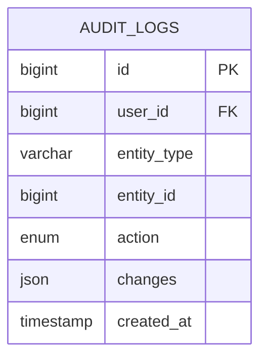
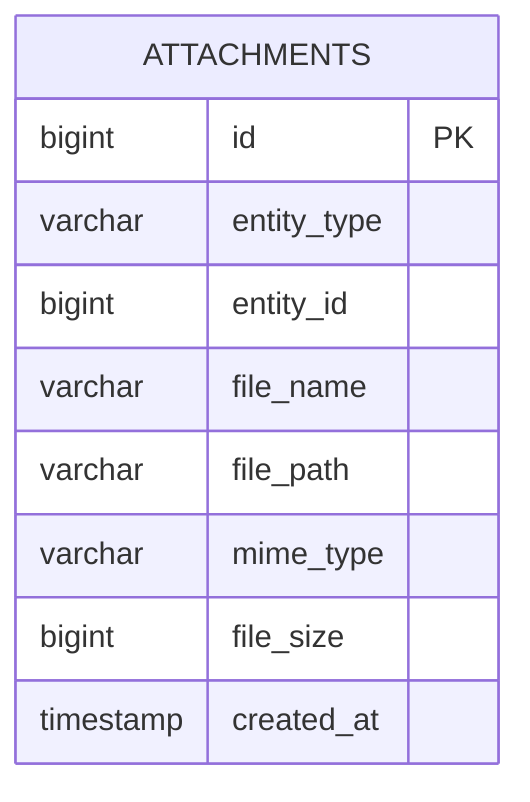

# ERD Specification Reference

> Detailed rules for generating the Entity-Relationship Diagram (ERD) document, including entity derivation from SRS, Mermaid erDiagram syntax rules, relationship cardinality, common table patterns, naming conventions, and JSON companion structure.

## 1. Overview

The ERD is the first deliverable of the Design phase. It defines the data model for the application by translating SRS requirements into a normalized entity-relationship structure. The ERD serves as the foundation for both the API contract (which exposes these entities via endpoints) and the Screen specification (which displays them in the UI).

The ERD is produced as a pair: `erd.md` (human-readable with Mermaid diagram) and `erd.json` (machine-readable companion conforming to `_meta/schemas/doc-companion.schema.json`). The ERD must trace every entity back to at least one FR from the SRS.

## 2. Entity Derivation from SRS

Entities are extracted from the SRS through a systematic derivation process.

### 2.1 Derivation Algorithm

1. **Scan data models:** Look for explicit data model references in FR descriptions, US descriptions, and FT details. Terms like "store", "save", "record", "manage", "track", and "maintain" typically indicate persistent entities.

2. **Identify nouns:** Extract significant nouns from FRs and USs that represent persistent business objects. Examples: "user", "product", "order", "payment", "category", "review".

3. **Filter candidates:** Remove nouns that are:
   - Actions or processes (not persistent data)
   - UI elements (these go to the Screen spec)
   - External systems (these become integration interfaces, not entities)
   - Attributes rather than entities (e.g., "name" is an attribute, not an entity)

4. **Map to entities:** Each remaining noun becomes an entity candidate. Consolidate synonyms (e.g., "customer" and "user" may be the same entity depending on context).

5. **Derive columns:** For each entity, derive columns from:
   - FR descriptions mentioning attributes of the entity
   - US acceptance criteria specifying data fields
   - FT descriptions detailing what data is captured or displayed
   - Glossary terms that define entity attributes

6. **Identify relationships:** Analyze FRs for relationship language: "belongs to", "has many", "contains", "is part of", "references".

### 2.2 Standard Columns

Every entity automatically includes these standard columns unless explicitly excluded:

| Column | Type | Constraint | Description |
|--------|------|-----------|-------------|
| `id` | `bigint` | PK | Auto-increment primary key |
| `created_at` | `timestamp` | — | Record creation timestamp |
| `updated_at` | `timestamp` | — | Last modification timestamp |

For soft-delete enabled entities, add:

| Column | Type | Constraint | Description |
|--------|------|-----------|-------------|
| `deleted_at` | `timestamp` | — | Soft-delete timestamp (null = active) |

## 3. Mermaid erDiagram Syntax Rules

The ERD diagram uses Mermaid's `erDiagram` syntax. This section documents critical syntax rules and constraints.

### 3.1 Basic Entity Syntax



### 3.2 PK/FK/UK Constraint Rule (Critical)

**PK, FK, and UK must NEVER be combined on a single column.** This is a Mermaid parser limitation and a strict project rule. Each column can have at most one constraint marker.

**Correct:**
```
bigint id PK
bigint category_id FK
varchar email UK
```

**Incorrect (will break Mermaid rendering):**
```
bigint id PK UK        ← FORBIDDEN: combined constraints
bigint user_id PK FK   ← FORBIDDEN: combined constraints
```

### 3.3 Handling Multi-Constraint Columns

When a column logically requires multiple constraints (common in junction tables), use the following pattern:

1. Annotate the column with the **most important** constraint in the Mermaid diagram (priority: PK > FK > UK).
2. Document the additional constraints in the entity table in Section 1 of the ERD Markdown.
3. Add a comment in the Mermaid diagram using `%%` syntax:



### 3.4 Supported Column Types

| Type | Usage | Example |
|------|-------|---------|
| `bigint` | Primary keys, foreign keys, large counters | `bigint id PK` |
| `int` | Small integers, quantities, counts | `int quantity` |
| `varchar` | Variable-length strings | `varchar email UK` |
| `text` | Long text content | `text description` |
| `boolean` | True/false flags | `boolean is_active` |
| `decimal` | Money, precise numbers | `decimal price` |
| `timestamp` | Date and time | `timestamp created_at` |
| `date` | Date only | `date birth_date` |
| `json` | JSON data (flexible schema) | `json metadata` |
| `enum` | Enumerated values | `enum status` |

### 3.5 Entity Naming Convention (Mermaid Display)

- Entity names use `UPPER_SNAKE_CASE` in Mermaid diagrams: `USERS`, `ORDER_ITEMS`, `PRODUCT_CATEGORIES`.
- **Plural form** for entity names (tables are collections): `USERS`, `ORDERS`, `USER_ROLES`.
- Column names use `lower_snake_case`: `created_at`, `user_id`, `product_name`.
- Foreign key columns follow the pattern `{referenced_table_singular}_id`: `user_id`, `category_id`, `order_id`.
- See § 8 for comprehensive naming conventions.

## 4. Relationship Cardinality Notation

Mermaid erDiagram uses a specific notation for relationship cardinality.

### 4.1 Cardinality Symbols

| Notation | Meaning | Read As |
|----------|---------|---------|
| `\|\|` | Exactly one | one and only one |
| `o\|` | Zero or one | zero or one |
| `}o` | Zero or many | zero or many |
| `}\|` | One or many | one or many |

### 4.2 Relationship Syntax

```
ENTITY_A <cardinality>--<cardinality> ENTITY_B : "label"
```

### 4.3 Common Relationship Patterns

**One-to-Many (1:N):**
```
USERS ||--o{ ORDERS : "places"
```
Read: "One USER places zero or many ORDERS."

**Many-to-Many (N:M) via junction table:**
```
PRODUCTS ||--o{ ORDER_ITEMS : "included in"
ORDERS ||--o{ ORDER_ITEMS : "contains"
```
Read: "Many-to-many between PRODUCTS and ORDERS via ORDER_ITEMS junction."

**One-to-One (1:1):**
```
USERS ||--o| PROFILES : "has"
```
Read: "One USER has zero or one PROFILE."

**Self-referencing:**
```
CATEGORIES ||--o{ CATEGORIES : "parent of"
```
Read: "A CATEGORY can be parent of zero or many CATEGORIES."

### 4.4 Relationship Label Conventions

- Labels should be verbs or verb phrases in lowercase: "places", "contains", "belongs to", "has", "manages".
- Labels are enclosed in double quotes: `"places"`.
- For bidirectional clarity, the label reads from left entity to right entity.

## 5. Common Table Patterns

### 5.1 User/Auth Pattern



### 5.2 CRUD with Categories Pattern



### 5.3 Audit Log Pattern



### 5.4 File/Media Attachment Pattern



## 6. ID Convention

ERD items use two ID prefixes:

| Prefix | Usage | Example |
|--------|-------|---------|
| ENT | Entity definitions | ENT-010, ENT-020 |
| REL | Relationship definitions | REL-010, REL-020 |

IDs follow the standard 10-increment rule. Each entity gets an ENT ID, and each relationship gets a REL ID. IDs are assigned in the order entities and relationships appear in the document.

## 7. JSON Companion Structure (erd.json)

The `erd.json` file conforms to `_meta/schemas/doc-companion.schema.json`:

```json
{
  "docType": "erd",
  "app": "my-app",
  "status": "Draft",
  "version": "1.0.0",
  "lastUpdated": "2026-04-03T11:00:00Z",
  "items": [
    {
      "id": "ENT-010",
      "type": "entity",
      "title": "USERS",
      "description": "Application user accounts",
      "status": "Draft",
      "tracedFrom": ["FR-010"],
      "tracedTo": ["API-010", "SC-010"],
      "columns": [
        { "name": "id", "type": "bigint", "constraint": "PK", "nullable": false },
        { "name": "email", "type": "varchar", "constraint": "UK", "nullable": false },
        { "name": "password_hash", "type": "varchar", "constraint": null, "nullable": false },
        { "name": "name", "type": "varchar", "constraint": null, "nullable": false },
        { "name": "role", "type": "enum", "constraint": null, "nullable": false, "values": ["admin", "user", "manager"] },
        { "name": "created_at", "type": "timestamp", "constraint": null, "nullable": false },
        { "name": "updated_at", "type": "timestamp", "constraint": null, "nullable": false }
      ]
    },
    {
      "id": "REL-010",
      "type": "relationship",
      "title": "USERS places ORDERS",
      "description": "One user places zero or many orders",
      "status": "Draft",
      "from": "ENT-010",
      "to": "ENT-020",
      "cardinality": "1:N",
      "fkColumn": "user_id"
    }
  ],
  "crossRefs": [
    {
      "from": "ENT-010",
      "to": "FR-010",
      "relation": "implements"
    }
  ]
}
```

### 7.1 Item Type Values for ERD

| type | Used For |
|------|---------|
| `entity` | Entity definitions (tables) |
| `relationship` | Relationship definitions between entities |

### 7.2 Extended Fields

Entity items include a `columns` array not present in the base doc-companion schema. Each column object contains: `name`, `type`, `constraint` (PK/FK/UK or null), `nullable`, and optionally `default` and `values` (for enum types). This extended structure enables downstream tools (API generator, code engine) to create database schemas automatically.

## 8. Naming Conventions (Advanced)

> **Core Principle:** Consistency above all. Pick a convention and enforce it across the entire project — tables, columns, indexes, constraints, views. Mixed conventions are worse than any single choice.

### 8.1 General Rules

- **English full names only** — no abbreviations (`customer`, not `cust`; `organization`, not `org`).
- **snake_case + lowercase** exclusively — most stable across PostgreSQL, MySQL, and modern ORMs.
- **No special characters or spaces** — only `[a-z0-9_]`.
- **Avoid reserved words** — never use `user`, `order`, `select`, `group` as bare table names. Use plural forms (`users`, `orders`) which naturally avoids most collisions.
- **Length guideline** — meaningful but concise, ideally ≤ 30 characters.

### 8.2 Table Naming

| Rule | Convention | Example |
|------|-----------|---------|
| **Number** | **Plural** (tables are collections) | `users`, `orders`, `order_items` |
| **Case** | **snake_case** (lowercase + `_`) | `user_profiles`, `product_categories` |
| **Domain prefix** (large projects) | `{domain}_` prefix for grouping | `sales_orders`, `hr_employees`, `audit_logs` |
| **Junction tables** (M:N) | Both table names, alphabetical order | `orders_products`, `roles_users` |
| **History/log tables** | `{entity}_audit_logs` or `{entity}_history` | `user_audit_logs`, `order_history` |
| **Mermaid display** | `UPPER_SNAKE_CASE` (Mermaid convention) | `USERS`, `ORDER_ITEMS` |
| **Document title** | Title Case | "Order Items" |

### 8.3 Column Naming

| Rule | Convention | Example |
|------|-----------|---------|
| **Number** | **Singular** always | `user_id`, `first_name` |
| **Case** | **snake_case** | `billing_address_line1` |
| **Primary Key** | `id` (simple) | `bigint id PK` |
| **Foreign Key** | `{referenced_table_singular}_id` | `user_id`, `category_id`, `order_id` |
| **Timestamps** | `created_at`, `updated_at`, `deleted_at` | `timestamp created_at` |
| **Boolean flags** | `is_` prefix | `is_active`, `is_verified`, `is_published` |
| **Status fields** | `status` (enum/string) | `enum status` |
| **Enum values** | lowercase snake_case | `active`, `in_progress`, `pending_review` |

### 8.4 Constraints & Indexes

| Object | Pattern | Example |
|--------|---------|---------|
| **Primary Key** | `pk_{table}` | `pk_users` |
| **Foreign Key** | `fk_{table}_{referenced_table}` | `fk_orders_users` |
| **Unique** | `uq_{table}_{column}` | `uq_users_email` |
| **Index** | `idx_{table}_{columns}` | `idx_users_email_status` |
| **Check** | `ck_{table}_{column}` | `ck_orders_total_positive` |

### 8.5 Other Database Objects

| Object | Pattern | Example |
|--------|---------|---------|
| **View** | `v_{description}` or `vw_` prefix | `v_active_users`, `vw_order_summary` |
| **Schema** | Domain-based separation | `auth.`, `sales.`, `hr.`, `inventory.` |
| **Trigger** | `trg_{table}_{event}` | `trg_users_before_update` |
| **Function** | `fn_{description}` | `fn_calculate_total` |

### 8.6 ORM Compatibility Notes

| ORM / Framework | Preferred Convention | Notes |
|-----------------|---------------------|-------|
| **Laravel / Eloquent** | Plural snake_case tables, `id` PK | Auto-maps `User` model → `users` table |
| **Django** | Plural snake_case | `app_model` prefix by default |
| **Spring Data JPA** | snake_case with `@Table` | `naming-strategy: org.hibernate.boot.model.naming.CamelCaseToUnderscoresNamingStrategy` |
| **Ruby on Rails** | Plural snake_case, `id` PK | Convention over configuration |
| **Prisma** | PascalCase model → snake_case table via `@@map` | Explicit mapping recommended |
| **Supabase** | Plural snake_case | PostgreSQL-native, snake_case essential |

### 8.7 Quick Reference (Copy-Paste)

```sql
-- Table: plural + snake_case
CREATE TABLE users (
    id            BIGSERIAL PRIMARY KEY,
    email         VARCHAR(255) UNIQUE NOT NULL,
    first_name    VARCHAR(100),
    last_name     VARCHAR(100),
    is_active     BOOLEAN DEFAULT true,
    created_at    TIMESTAMPTZ DEFAULT NOW(),
    updated_at    TIMESTAMPTZ DEFAULT NOW()
);

-- Junction table: alphabetical combination
CREATE TABLE roles_users (
    user_id  BIGINT REFERENCES users(id),
    role_id  BIGINT REFERENCES roles(id),
    PRIMARY KEY (user_id, role_id)
);

-- Index naming
CREATE INDEX idx_users_email ON users(email);

-- FK naming
ALTER TABLE orders
    ADD CONSTRAINT fk_orders_users
    FOREIGN KEY (user_id) REFERENCES users(id);
```

### 8.8 u-maker ID Conventions

| Prefix | Usage | Example |
|--------|-------|---------|
| ENT | Entity definitions | ENT-010, ENT-020 |
| REL | Relationship definitions | REL-010, REL-020 |

## 9. Validation Checks

After ERD generation, the following validations are performed:

1. **ID uniqueness:** No duplicate ENT or REL IDs.
2. **ID format:** All IDs match `^(ENT|REL)-\d{3}$`.
3. **PK/FK/UK never combined:** No column has more than one constraint marker in the Mermaid diagram.
4. **Every entity has a PK:** At least one column with PK constraint per entity.
5. **FK references valid entities:** Every FK column references an existing entity.
6. **Relationship consistency:** Every REL item references valid entity IDs in `from` and `to`.
7. **SRS traceability:** Every entity traces to at least one FR.
8. **Standard columns present:** Every entity includes `id`, `created_at`, `updated_at` (warning if missing).
9. **Mermaid syntax validity:** The erDiagram block is syntactically valid Mermaid.
10. **JSON-Markdown sync:** Every item in `erd.json` has a corresponding entry in `erd.md`.
11. **Link graph update:** `data/links.json` contains nodes and edges for all ERD items.
