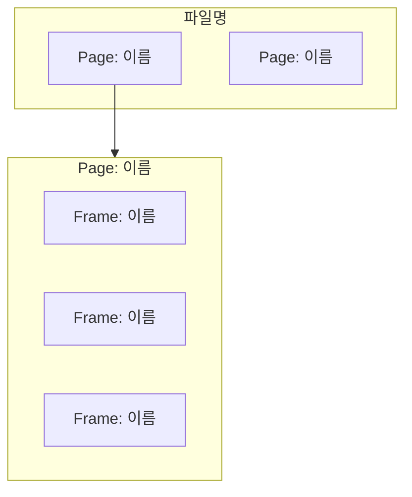
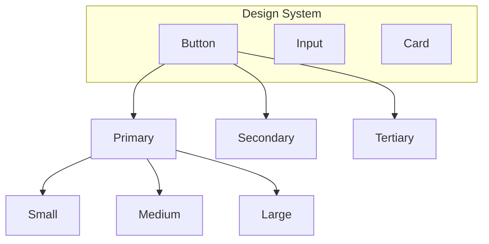
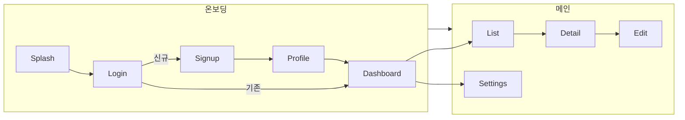
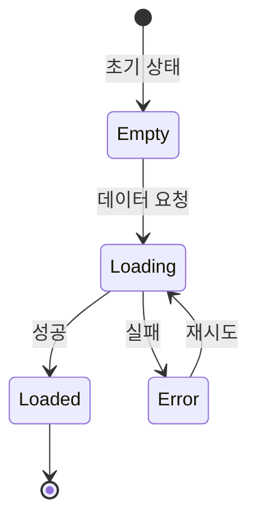

# Figma Analysis Guide

Figma MCP에서 수집한 데이터를 분석하는 6개 영역별 상세 기준.

## 1. 구조 분석 (Structure Analysis)

### 수집 대상
- `get_metadata` → pages, components 배열
- `get_design_context` → 코드 구조, 계층 정보

### 분석 항목

| 항목 | 확인 사항 | 평가 기준 |
|---|---|---|
| 페이지 구성 | 페이지 수, 네이밍 패턴 | 논리적 그룹핑 여부 |
| 프레임 계층 | 깊이, 네스팅 수준 | 3단계 이하가 적정 |
| 네이밍 규칙 | kebab-case, PascalCase 등 일관성 | 통일된 규칙 사용 여부 |
| Auto Layout | Auto Layout 사용률 | 70% 이상 사용이 적정 |
| 그룹 vs 프레임 | Group 사용 비율 | Frame 위주가 바람직 |

### Mermaid 패턴: 페이지/프레임 구조도



노드가 15개 이상이면 subgraph로 페이지별 분리한다.

---

## 2. 컴포넌트 분석 (Component Analysis)

### 수집 대상
- `get_metadata` → components, componentSets
- `get_design_context` → 코드 내 컴포넌트 참조

### 분석 항목

| 항목 | 확인 사항 | 평가 기준 |
|---|---|---|
| 컴포넌트 수 | 전체 개수, 카테고리별 분류 | — |
| 재사용률 | 인스턴스 대비 고유 컴포넌트 비율 | 높을수록 좋음 |
| Variant 구조 | Property, Value 조합 | 과도한 variant 경고 (>10) |
| Detached 인스턴스 | 원본에서 분리된 인스턴스 | 0이 이상적 |
| 미사용 컴포넌트 | 정의만 있고 인스턴스 없음 | 정리 권장 |

### Mermaid 패턴: 컴포넌트 계층도



---

## 3. 스타일 분석 (Style Analysis)

### 수집 대상
- `get_design_context` → CSS 변수, 컬러 값, 타이포그래피

### 분석 항목

| 항목 | 확인 사항 | 평가 기준 |
|---|---|---|
| 컬러 팔레트 | 사용된 고유 색상 수 | 10~20개가 적정 |
| 컬러 토큰 | Figma Styles로 등록 여부 | 모든 색상이 토큰화 권장 |
| 타이포그래피 | 폰트 패밀리, 크기, 굵기 조합 | 5~8 스케일이 적정 |
| 간격 체계 | 사용된 padding/gap 값 | 4px/8px 배수 체계 권장 |
| 라운딩 | border-radius 값 | 2~3종이 적정 |

### 컬러 표현 패턴 (HTML 테이블)

Mermaid는 컬러 시각화에 부적합하므로 HTML 테이블을 사용한다:

```markdown
| Token | Hex | 용도 |
|---|---|---|
| `--color-primary` | `#3B82F6` | 주요 액션 버튼 |
| `--color-secondary` | `#6B7280` | 보조 텍스트 |
| `--color-bg` | `#FFFFFF` | 배경색 |
```

---

## 4. UX 흐름 분석 (Flow Analysis)

### 수집 대상
- `get_design_context` → 프로토타입 연결 정보 (있을 경우)
- `get_screenshot` → 화면 시각적 분석
- 프레임 네이밍에서 흐름 추론

### 분석 항목

| 항목 | 확인 사항 | 평가 기준 |
|---|---|---|
| 핵심 흐름 | 주요 사용자 시나리오 식별 | 3~5개 핵심 흐름 |
| 흐름 단계 수 | 목표 달성까지 클릭/탭 수 | 5단계 이하 권장 |
| 진입/이탈점 | 흐름의 시작과 끝 | 명확한 진입점 존재 |
| 분기 처리 | 에러, 빈 상태, 권한 분기 | 주요 분기 커버 여부 |
| 되돌리기 | 이전 단계 복귀 가능성 | Back 네비게이션 존재 |

### Mermaid 패턴: 화면 흐름도



### Mermaid 패턴: 상태 다이어그램



---

## 5. 일관성 분석 (Consistency Analysis)

### 분석 항목

| 항목 | 확인 사항 | 심각도 |
|---|---|---|
| 하드코딩 컬러 | Style 미등록 색상 사용 | High |
| 하드코딩 텍스트 | Text Style 미적용 | Medium |
| 컴포넌트 오용 | 인스턴스 대신 직접 구현 | High |
| 간격 불일치 | 동일 맥락에서 다른 간격 사용 | Medium |
| 아이콘 크기 불일치 | 동일 컨텍스트에서 다른 아이콘 크기 | Low |
| 네이밍 불일치 | 규칙에서 벗어난 레이어 이름 | Low |

---

## 6. 접근성 분석 (Accessibility Analysis)

### 분석 항목

| 항목 | 확인 사항 | WCAG 기준 |
|---|---|---|
| 명도 대비 | 텍스트/배경 대비비 | AA: 4.5:1, AAA: 7:1 |
| 터치 타겟 | 버튼/링크 최소 크기 | 44x44px (모바일) |
| 텍스트 크기 | 최소 본문 텍스트 | 14px 이상 권장 |
| 포커스 상태 | 키보드 포커스 디자인 | 존재 여부 확인 |
| 컬러 의존성 | 색상만으로 정보 전달 | 대안 표시 필요 |

---

## 분석 결과 요약 매트릭스

보고서 상단에 삽입하는 종합 평가 테이블:

```markdown
| 분석 영역 | 점수 | 등급 | 주요 발견 |
|---|---|---|---|
| 구조 | /20 | A~D | ... |
| 컴포넌트 | /20 | A~D | ... |
| 스타일 | /20 | A~D | ... |
| UX 흐름 | /20 | A~D | ... |
| 일관성 | /10 | A~D | ... |
| 접근성 | /10 | A~D | ... |
| **총점** | **/100** | | |
```

등급 기준:
- A: 90~100% — 우수
- B: 70~89% — 양호
- C: 50~69% — 개선 필요
- D: 0~49% — 즉시 개선 필요
