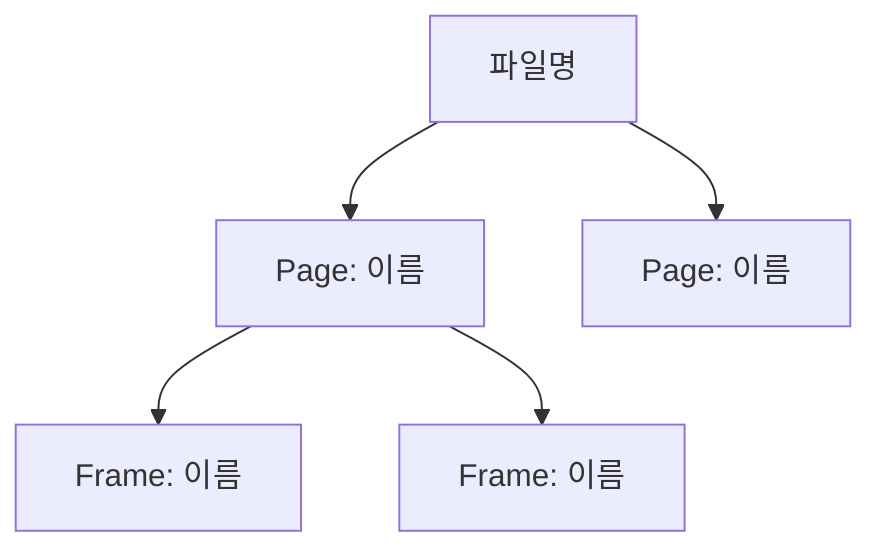
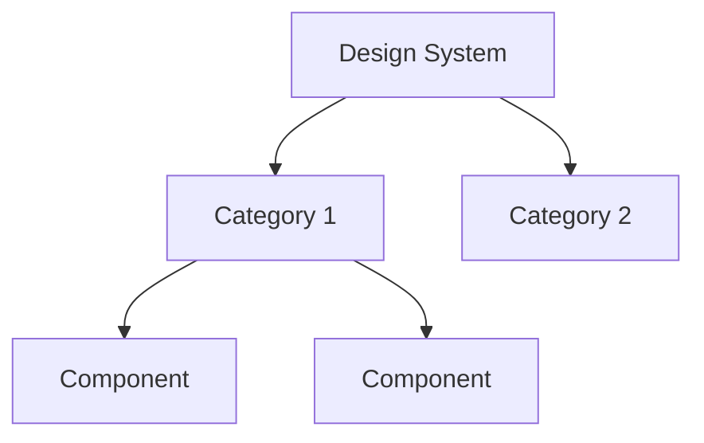
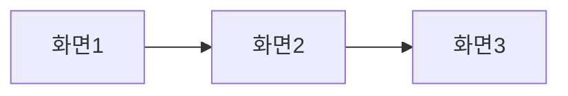
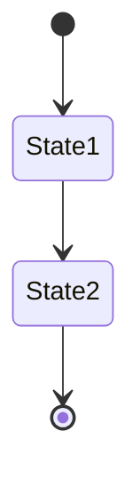

# Figma Design Analysis Report Template

보고서 생성 시 아래 구조를 따른다. 모든 섹션을 빠짐없이 채운다.

---

## 보고서 구조

```markdown
# Figma 디자인 분석 보고서

> **파일명**: {파일명}
> **Figma URL**: {url}
> **분석 일시**: {YYYY-MM-DD HH:mm}
> **분석 깊이**: {deep|shallow}

---

## 1. 요약 (Executive Summary)

### 종합 평가

| 분석 영역 | 점수 | 등급 | 주요 발견 |
|---|---|---|---|
| 구조 | /20 | | |
| 컴포넌트 | /20 | | |
| 스타일 | /20 | | |
| UX 흐름 | /20 | | |
| 일관성 | /10 | | |
| 접근성 | /10 | | |
| **총점** | **/100** | | |

### 핵심 발견사항

- 발견 1
- 발견 2
- 발견 3

### 즉시 개선 필요 항목

- [ ] 항목 1
- [ ] 항목 2

---

## 2. 파일 개요

| 항목 | 값 |
|---|---|
| 파일명 | |
| 페이지 수 | |
| 프레임 수 | |
| 컴포넌트 수 | |
| 마지막 수정 | |

---

## 3. 구조 분석

### 3.1 페이지/프레임 구조도

{아래 Mermaid 다이어그램을 실제 데이터로 채운다}



### 3.2 네이밍 패턴 분석

| 패턴 | 예시 | 비율 | 평가 |
|---|---|---|---|
| | | | |

### 3.3 Auto Layout 사용 현황

| 항목 | 값 |
|---|---|
| Auto Layout 프레임 수 | |
| 전체 프레임 대비 비율 | |
| Group 사용 수 | |

---

## 4. 컴포넌트 분석

### 4.1 컴포넌트 계층도



### 4.2 컴포넌트 목록

| 컴포넌트명 | Variant 수 | 인스턴스 수 | 비고 |
|---|---|---|---|
| | | | |

### 4.3 재사용 분석

| 지표 | 값 | 평가 |
|---|---|---|
| 고유 컴포넌트 수 | | |
| 총 인스턴스 수 | | |
| 재사용률 | | |
| Detached 인스턴스 | | |

---

## 5. 스타일 분석

### 5.1 컬러 시스템

| Token | Hex | 용도 | 등록 여부 |
|---|---|---|---|
| | | | |

### 5.2 타이포그래피

| 스타일명 | 폰트 | 크기 | 굵기 | 용도 |
|---|---|---|---|---|
| | | | | |

### 5.3 간격 체계

| 값 | 사용 빈도 | 맥락 |
|---|---|---|
| | | |

---

## 6. UX 흐름 분석

### 6.1 화면 흐름도



### 6.2 핵심 흐름 상세

#### 흐름 1: {흐름명}

| 단계 | 화면 | 사용자 행동 | 시스템 응답 |
|---|---|---|---|
| 1 | | | |
| 2 | | | |

### 6.3 상태 다이어그램 (depth=deep)



### 6.4 누락된 화면/상태

| 흐름 | 누락 상태 | 심각도 | 비고 |
|---|---|---|---|
| | | | |

---

## 7. 일관성 분석

| 항목 | 이슈 수 | 심각도 | 상세 |
|---|---|---|---|
| 하드코딩 컬러 | | | |
| 하드코딩 텍스트 | | | |
| 컴포넌트 오용 | | | |
| 간격 불일치 | | | |
| 아이콘 크기 불일치 | | | |
| 네이밍 불일치 | | | |

---

## 8. 접근성 분석

| 항목 | 상태 | WCAG | 상세 |
|---|---|---|---|
| 명도 대비 | | AA/AAA | |
| 터치 타겟 | | | |
| 최소 텍스트 크기 | | | |
| 포커스 상태 | | | |
| 컬러 의존성 | | | |

---

## 9. 스크린샷

{get_screenshot으로 캡처한 이미지를 삽입}

### 9.1 전체 화면


### 9.2 주요 프레임별 (depth=deep)

| 프레임명 | 스크린샷 |
|---|---|
| |  |

---

## 10. 개선 권고사항

### Must (즉시 개선)

1. 항목 — 근거

### Should (권장 개선)

1. 항목 — 근거

### Nice-to-have (선택 개선)

1. 항목 — 근거

---

## 11. 원본 소스

| 항목 | 경로/URL |
|---|---|
| Figma URL | |
| 메타데이터 | data/source/figma/{file}-metadata.json |
| 디자인 컨텍스트 | data/source/figma/{file}-context.md |
| 스크린샷 | {screenshot URLs} |
```

---

## HTML 변환 시 추가 사항

### Mermaid 렌더링 스크립트

HTML 보고서에 삽입할 Mermaid 초기화 코드:

```html
<script type="module">
  import mermaid from 'https://cdn.jsdelivr.net/npm/mermaid@11/dist/mermaid.esm.min.mjs';
  mermaid.initialize({
    startOnLoad: true,
    theme: 'neutral',
    fontFamily: "'Pretendard', sans-serif",
    flowchart: { useMaxWidth: true, htmlLabels: true },
    securityLevel: 'loose'
  });
</script>
```

### Mermaid 코드블록 → HTML 변환

Markdown의 ` ```mermaid ... ``` ` 블록을 아래 형태로 변환:

```html
<div class="diagram-container">
  <pre class="mermaid">
    graph TD
      A --> B
  </pre>
</div>
```

### 다이어그램 컨테이너 CSS

```css
.diagram-container {
  background: #fafbfc;
  border: 1px solid #e2e8f0;
  border-radius: 8px;
  padding: 24px;
  margin: 24px 0;
  overflow-x: auto;
}
.diagram-container .mermaid {
  display: flex;
  justify-content: center;
}
```

### 컬러칩 CSS

```css
.color-chip {
  display: inline-block;
  width: 24px;
  height: 24px;
  border-radius: 4px;
  border: 1px solid #e2e8f0;
  vertical-align: middle;
  margin-right: 8px;
}
```

컬러 테이블의 Hex 셀에 컬러칩을 추가:

```html
<td>
  <span class="color-chip" style="background: #3B82F6;"></span>
  <code>#3B82F6</code>
</td>
```

### 스크린샷 이미지 CSS

```css
.screenshot-container img {
  max-width: 100%;
  border: 1px solid #e2e8f0;
  border-radius: 8px;
  box-shadow: 0 2px 8px rgba(0,0,0,0.08);
}
```
