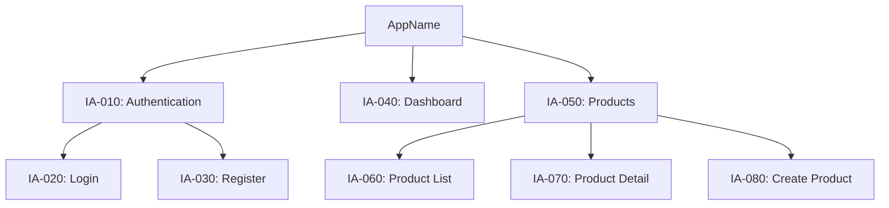
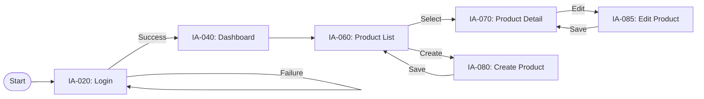

# IA Specification Reference

> Detailed rules for generating the Information Architecture (IA) document, including site map generation, page inventory derivation, navigation hierarchy, user flow diagramming, and JSON companion structure.

## 1. Overview

The Information Architecture (IA) document defines the structural organization of the application. It translates the functional requirements and user stories from the SRS into a navigable structure: pages, navigation hierarchies, and user flows. The IA is the bridge between "what the system does" (SRS) and "how users navigate it" (Screens).

The IA is produced as a pair: `ia.md` (human-readable with Mermaid diagrams) and `ia.json` (machine-readable companion conforming to `_meta/schemas/doc-companion.schema.json`). The IA is generated after the SRS and depends on it -- every IA page must trace back to at least one FR.

## 2. Site Map Generation Algorithm

The site map is a hierarchical tree that represents every page in the application. It is rendered as a Mermaid `graph TD` diagram in Section 1 of the IA.

### 2.1 Derivation from SRS

The site map is derived from the SRS through the following algorithm:

1. **Collect screen references:** Scan all FR descriptions, US descriptions, and FT titles for page/screen references. Common patterns include "dashboard page", "settings screen", "login form", "product list view", and similar terms.

2. **Extract page candidates:** For each screen reference, create a page candidate with:
   - Name: the identified page name (e.g., "Dashboard", "Product List")
   - Related FRs: the FR IDs where this page was referenced
   - Category: inferred from context (Auth, Dashboard, CRUD, Settings, Reports, etc.)

3. **Add system pages:** Automatically add common system pages that may not be explicitly mentioned in requirements:
   - Login / Register (if authentication FRs exist)
   - 404 Not Found
   - Error Page
   - Landing / Home (root page)

4. **Build hierarchy:** Group pages into a tree structure:
   - **Level 0 (Root):** Application name
   - **Level 1 (Sections):** Major functional areas (e.g., Dashboard, Products, Users, Settings)
   - **Level 2 (Pages):** Individual pages within sections (e.g., Product List, Product Detail, Product Create)
   - **Level 3 (Sub-pages):** Nested pages or modal-based views (e.g., Product Edit Form, Product Image Gallery)

5. **Assign IDs:** Each page receives an IA-prefixed ID in 10-increment: IA-010, IA-020, IA-030, etc. IDs are assigned in depth-first order starting from the root.

### 2.2 Mermaid Site Map Syntax



### 2.3 Naming Conventions

- Node IDs in Mermaid use uppercase shorthand (e.g., `AUTH`, `DASH`, `PLIST`).
- Node labels include the IA ID and page name: `[IA-010: Authentication]`.
- Section nodes (Level 1) use rounded brackets `()` or square brackets `[]`.
- Page nodes (Level 2+) use square brackets `[]`.

## 3. Page Inventory

Section 2 of the IA contains a tabular inventory of all pages.

### 3.1 Page Inventory Fields

| Field | Description | Example |
|-------|-----------|---------|
| ID | IA-prefixed, 10-increment | IA-010 |
| Page Name | Human-readable page name | Login |
| Path | URL path pattern | /auth/login |
| Parent | ID of the parent page (or "---" for root) | IA-010 |
| Description | Brief description of the page purpose | User authentication via email/password or social login |
| Related FR | Comma-separated FR IDs this page serves | FR-010, FR-020 |

### 3.2 Path Derivation Rules

URL paths are derived from the page hierarchy:

1. **Root:** `/`
2. **Level 1 sections:** `/{section-slug}` (e.g., `/products`, `/settings`)
3. **Level 2 pages:** `/{section-slug}/{page-slug}` (e.g., `/products/list`, `/products/create`)
4. **Level 3 sub-pages:** `/{section-slug}/{page-slug}/{sub-slug}` or parameterized `/{section-slug}/:id/{sub-slug}`
5. **Dynamic segments:** Use `:param` notation for dynamic path parameters (e.g., `/products/:id`, `/users/:userId/profile`)

### 3.3 Page Categories

Each page is implicitly categorized based on its function:

| Category | Description | Typical Pages |
|----------|-----------|--------------|
| **Auth** | Authentication and authorization flows | Login, Register, Forgot Password, Reset Password |
| **Dashboard** | Overview and summary views | Main Dashboard, Analytics Dashboard |
| **CRUD** | Create/Read/Update/Delete operations | List, Detail, Create, Edit pages |
| **Settings** | Configuration and preferences | User Settings, System Settings, Profile |
| **Reports** | Data visualization and export | Report List, Report Detail, Export |
| **System** | Infrastructure pages | 404, Error, Maintenance |

## 4. Navigation Hierarchy

Section 3 of the IA defines the navigation structure using three standard levels.

### 4.1 GNB (Global Navigation Bar)

The top-level navigation visible on all pages (typically a horizontal header bar or sidebar). GNB items correspond to Level 1 sections in the site map.

| Level | Label | Target | Auth Required | Role |
|-------|-------|--------|--------------|------|
| GNB | Dashboard | IA-040 | Yes | All |
| GNB | Products | IA-050 | Yes | Admin, Manager |
| GNB | Settings | IA-090 | Yes | All |

### 4.2 LNB (Local Navigation Bar)

Section-level navigation, typically a sidebar within a section. LNB items correspond to Level 2 pages within a section.

| Level | Label | Target | Auth Required | Role |
|-------|-------|--------|--------------|------|
| LNB | Product List | IA-060 | Yes | Admin, Manager |
| LNB | Create Product | IA-080 | Yes | Admin |

### 4.3 Tab Navigation

Page-level navigation for sub-views within a single page. Tabs do not change the URL path but switch between content panels.

| Level | Label | Target | Context |
|-------|-------|--------|---------|
| Tab | Overview | IA-070-tab1 | Product Detail |
| Tab | Reviews | IA-070-tab2 | Product Detail |
| Tab | Analytics | IA-070-tab3 | Product Detail |

### 4.4 Auth and Role Rules

Each navigation item specifies:
- **Auth Required:** `Yes` or `No`. Items with `No` are visible to unauthenticated users (e.g., Login, Register, Landing).
- **Role:** Which user roles can see this item. Derived from SRS stakeholder roles and FRs that reference role-based access.

## 5. User Flow Diagramming

Section 4 of the IA defines key user flows as Mermaid flowcharts. Each flow represents a complete user journey through multiple pages.

### 5.1 Flow Identification

User flows are derived from:
1. **User Stories:** Each US describes a user journey. Complex USs with multiple steps produce a flow diagram.
2. **Workflows:** Workflows extracted in digest files map directly to user flows.
3. **Critical Paths:** The engine identifies the 5-8 most critical user journeys based on priority and frequency.

### 5.2 Mermaid Flowchart Syntax



### 5.3 Flow Diagram Conventions

1. **Direction:** Use `flowchart LR` (left-to-right) for linear flows, `flowchart TD` (top-down) for branching flows.
2. **Start/End nodes:** Use rounded rectangle `([Start])` and `([End])` notation.
3. **Page nodes:** Reference IA IDs in labels: `[IA-010: Page Name]`.
4. **Edge labels:** Describe the action or condition: `|Success|`, `|Click Save|`, `|Select Item|`.
5. **Decision points:** Use diamond nodes `{Decision?}` for conditional branching.
6. **Error paths:** Include error/failure paths (e.g., validation errors returning to the same page).

### 5.4 Standard Flows

Every application should include these standard flows at minimum:

| Flow Name | Description | Typical Pages |
|-----------|-----------|--------------|
| Authentication Flow | Login → Dashboard (with failure handling) | Login, Register, Forgot Password, Dashboard |
| Primary CRUD Flow | List → Detail → Create/Edit → List | List, Detail, Create, Edit pages for the primary entity |
| Onboarding Flow | First-time user journey from registration to first action | Register, Profile Setup, Dashboard |

## 6. IA-to-FR Cross-Referencing

Every IA page must trace back to the SRS. The cross-referencing system ensures no page exists without a functional justification and no FR is left without a page to serve it.

### 6.1 Cross-Reference Rules

1. **Forward tracing (FR → IA):** Every FR should be served by at least one IA page. The `Related FR` column in the page inventory captures this. If an FR has no corresponding page, the IA generator emits a warning: "FR-XXX has no page assignment".

2. **Backward tracing (IA → FR):** Every IA page must reference at least one FR. System pages (404, Error) are exceptions and may reference NFRs instead.

3. **Coverage report:** After IA generation, a coverage check verifies:
   - FR coverage: percentage of FRs that have at least one IA page.
   - Page justification: percentage of IA pages that trace to at least one FR.
   - Target: both metrics should be >= 95%.

### 6.2 Cross-Reference in links.json

The cross-references are recorded in `data/links.json`:

```json
{
  "edges": [
    {
      "from": "ia:IA-060",
      "to": "srs:FR-010",
      "relation": "implements"
    },
    {
      "from": "ia:IA-070",
      "to": "srs:FR-020",
      "relation": "implements"
    }
  ]
}
```

The node type prefix (`ia:`, `srs:`) disambiguates IDs across document types.

## 7. JSON Companion Structure (ia.json)

The `ia.json` file conforms to `_meta/schemas/doc-companion.schema.json`:

```json
{
  "docType": "ia",
  "app": "my-app",
  "status": "Draft",
  "version": "1.0.0",
  "lastUpdated": "2026-04-03T10:35:00Z",
  "items": [
    {
      "id": "IA-010",
      "type": "section",
      "title": "Authentication",
      "description": "Authentication and authorization section",
      "status": "Draft",
      "tracedFrom": ["FR-010"],
      "tracedTo": ["IA-020", "IA-030"]
    },
    {
      "id": "IA-020",
      "type": "page",
      "title": "Login",
      "description": "User login via email/password or social login",
      "status": "Draft",
      "tracedFrom": ["FR-010"],
      "tracedTo": []
    }
  ],
  "crossRefs": [
    {
      "from": "IA-020",
      "to": "FR-010",
      "relation": "implements"
    }
  ]
}
```

### 7.1 Item Type Values for IA

| type | Used For | Description |
|------|---------|-------------|
| `section` | Level 1 nodes | Major functional areas (GNB targets) |
| `page` | Level 2 nodes | Individual pages within a section |
| `sub-page` | Level 3 nodes | Nested views within a page |
| `flow` | User flows | Flow diagrams (stored as items with Mermaid source in description) |

### 7.2 Navigation Metadata

Each page item in `ia.json` may include additional metadata beyond the base schema:

```json
{
  "id": "IA-020",
  "type": "page",
  "title": "Login",
  "path": "/auth/login",
  "parent": "IA-010",
  "navLevel": "LNB",
  "authRequired": false,
  "roles": ["*"]
}
```

These extended fields are stored alongside the standard doc-companion fields and are used by the Screen specification generator to build screen details.

## 8. Validation Checks

After IA generation, the following validations are performed:

1. **ID uniqueness:** No duplicate IA IDs.
2. **ID format:** All IDs match `^IA-\d{3}$`.
3. **Hierarchy integrity:** Every page has a valid parent ID (except root sections).
4. **Path uniqueness:** No two pages share the same URL path.
5. **FR coverage:** All FRs from the SRS have at least one IA page (>= 95% target).
6. **No orphan pages:** Every page traces to at least one FR.
7. **Navigation completeness:** Every Level 1 section appears in the GNB. Every Level 2 page appears in an LNB under its section.
8. **Mermaid syntax:** Site map and flow diagrams are syntactically valid Mermaid.
9. **JSON-Markdown sync:** Every item in `ia.json` has a corresponding entry in `ia.md`.
10. **Link graph update:** `data/links.json` contains nodes and edges for all IA items with their SRS cross-references.
