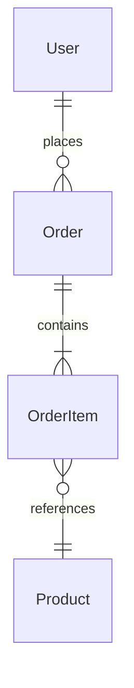
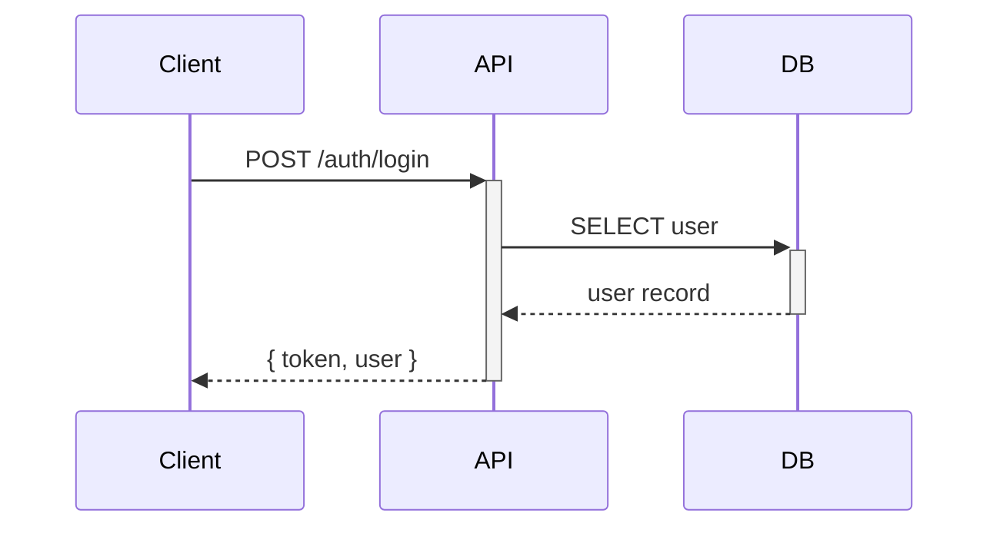
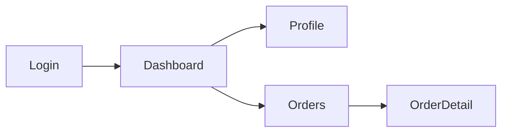

# u-skill-doc-engine -- REFERENCE

SKILL.md에서 참조하는 상세 구현, 스키마, 의사코드, 예시를 포함한다.

---

## Language Behavior Matrix

| `language.documents` | 문서 본문 언어 | 섹션 제목 | 설명/Description | ID/코드 |
|---------------------|--------------|----------|-----------------|---------|
| `ko` | 한국어 | 한국어 | 한국어 | 영문 유지 (FR-0001, POST /api/...) |
| `en` | English | English | English | 영문 유지 |
| `ja` | 日本語 | 日本語 | 日本語 | 영문 유지 |
| `zh` | 中文 | 中文 | 中文 | 영문 유지 |

**규칙:**
- ID, 코드 스니펫, 기술 용어(API path, entity name, HTTP method 등)는 언어 설정과 무관하게 **항상 영문**
- Mermaid 다이어그램의 노드 라벨은 `language.documents` 언어로 작성
- JSON companion 파일의 `description`, `title` 필드는 `language.documents` 언어로 작성
- 모든 문서 생성 스킬(`/u-plan`, `/u-design`, `/u-dev`, `/u-qa`, `/u-reverse` 등)은 이 설정을 따름

---

## License Resolution

```
function resolveLicense():
  config = loadConfig("u-maker.config.json")
  type = config.license?.type ?? "GPL-3.0"
  owner = config.license?.owner ?? ""
  copyright = config.license?.copyright ?? ""
  return { type, owner, copyright }
```

**HTML footer 삽입 규칙:**
- 모든 HTML 리포트(`/u-report`), wireframe viewer(`index.html`), GET_STARTED.html 등의 footer에 적용
- 삽입 형식: `{license.type} · © {license.owner}` (예: `GPL-3.0 · © U PLEAT`)
- `.md` 문서 footer에도 동일하게 적용: `License: {license.type} | Copyright (c) {year} {license.owner}`
- `{{license}}` 템플릿 변수로 접근 가능

---

## Theme Resolution & Config Schema

### Theme Resolution

```
function resolveTheme():
  config = loadConfig("u-maker.config.json")
  baseTheme = config.theme ?? "light"
  savedTheme = localStorage.getItem("u-maker-theme")
  return savedTheme ?? baseTheme
```

### Config Schema

```json
{
  "theme": "light"
}
```

| Field | Allowed | Default | Description |
|------|---------|---------|-------------|
| `theme` | `light`, `dark` | `light` | HTML 문서의 기본 테마 |

### 권장 구현

```html
<script>
const key = 'u-maker-theme';
const saved = localStorage.getItem(key);
const configTheme = window.__UMAKER_CONFIG__?.theme || 'light';
document.documentElement.setAttribute('data-theme', saved || configTheme || 'light');
function toggleTheme() {
  const next = document.documentElement.getAttribute('data-theme') === 'dark' ? 'light' : 'dark';
  document.documentElement.setAttribute('data-theme', next);
  localStorage.setItem(key, next);
}
</script>
```

---

## Mermaid Syntax & SVG Rendering

### Mermaid 문법 (Markdown 문서용)

`.md` 문서에서는 Mermaid 코드 블록으로 다이어그램을 작성한다:

````markdown





````

### SVG 렌더링 (HTML 문서용)

`.html` 문서 생성 시 Mermaid 다이어그램은 **인라인 SVG로 렌더링**한다:

1. Mermaid 코드 블록을 감지
2. Mermaid.js로 SVG 문자열 생성
3. `<div class="diagram">` 안에 SVG를 인라인 삽입
4. SVG에 `viewBox` 설정으로 반응형 스케일링
5. 외부 이미지 파일 생성 금지 (모든 SVG는 HTML 내 인라인)

```html
<!-- HTML 내 SVG 인라인 렌더링 예시 -->
<div class="diagram" data-type="erDiagram" data-title="User-Order ERD">
  <svg viewBox="0 0 800 400" xmlns="http://www.w3.org/2000/svg">
    <!-- Mermaid가 생성한 SVG 내용 -->
  </svg>
</div>
```

### 다이어그램 스타일 규칙

- Mermaid 곡선 커넥터 사용 (`curve: basis`), 직선 화살표 금지
- 노드 라벨은 `language.documents` 설정 언어로 작성
- ID/기술 용어(테이블명, API path 등)는 항상 영문
- 다이어그램 위에 제목 표시: `### {Diagram Title}`
- 다이어그램 아래에 범례(legend) 포함 (관계 유형, 색상 의미 등)

---

## create Pseudocode

```
function create(type, scope, data):
  // 1. 언어 설정 로드
  lang = resolveLanguage()  // config.language?.documents ?? "ko"

  // 2. 템플릿 로드
  template = readFile("_meta/templates/{type}.template.md")
  if not template: template = DEFAULT_TEMPLATE

  // 3. 템플릿 렌더링 (Mustache-style)
  rendered = render(template, {
    ...data,
    lang: lang,
    date: today(),
    scope: scope,
    license: resolveLicense(),
    copyright: resolveCopyright()
  })

  // 4. 헤더 설정
  header = {
    Owner: data.agent,
    Status: "Draft",
    Version: "1.0",
    "Last Updated": today(),
    "Related Docs": autoDetectRelatedDocs(type)
  }

  // 5. 파일 생성
  mdPath = "docs/{scope}/{phaseDir(type)}/{type}.md"
  jsonPath = mdPath.replace(".md", ".json")
  writeFile(mdPath, addHeader(header, rendered))
  writeFile(jsonPath, toCompanionJSON(rendered, header))

  // 6. 인덱스 갱신
  updateIndex(scope, { id: type, type, path: mdPath, status: "Draft", version: "1.0" })

  return {
    status: "created",
    files: { md: mdPath, json: jsonPath },
    version: "1.0",
    indexUpdated: true
  }
```

**출력 예시:**

```json
{
  "status": "created",
  "files": {
    "md": "docs/retail/01-plan/srs.md",
    "json": "docs/retail/01-plan/srs.json"
  },
  "version": "1.0",
  "indexUpdated": true
}
```

---

## read Pseudocode

```
function read(scope, doc):
  index = loadIndex(scope)
  entry = index.documents.find(d => d.id === doc || d.type === doc)

  if not entry:
    return { status: "not-found", message: "{doc}을 찾을 수 없습니다." }

  mdContent = readFile(entry.path)
  jsonContent = readFile(entry.path.replace(".md", ".json"))

  return {
    status: "found",
    md: mdContent,
    json: jsonContent,
    metadata: entry
  }
```

---

## update Pseudocode

```
function update(scope, doc, changes):
  // 1. 기존 문서 로드
  existing = read(scope, doc)
  if existing.status === "not-found": return existing

  // 2. Final 문서 수정 시 사용자 확인 (Always-Pause)
  if existing.metadata.status === "Final":
    confirm = pauseForUser("Final 문서 수정 확인")
    if not confirm: return { status: "cancelled" }
    existing.metadata.status = "Draft"

  // 3. changes 적용 (섹션별 부분 업데이트)
  updated = applyChanges(existing, changes)

  // 4. 버전 증가
  if changes.isStructural:
    version = bumpMajor(existing.metadata.version)  // 1.3 → 2.0
  else:
    version = bumpMinor(existing.metadata.version)  // 1.0 → 1.1

  // 5. 메타데이터 갱신
  updated.metadata.version = version
  updated.metadata.lastUpdated = today()

  // 6. 파일 갱신
  writeFile(existing.metadata.path, updated.md)
  writeFile(existing.metadata.path.replace(".md", ".json"), updated.json)

  // 7. 인덱스 갱신
  updateIndex(scope, updated.metadata)

  return { status: "updated", version: version }
```

**Status 전환 규칙:**

| Current | Allowed Next | Trigger |
|---------|-------------|---------|
| Draft | Review | 사용자 또는 에이전트 요청 |
| Draft | Final | 직접 확정 (소규모 문서) |
| Review | Final | 사용자 승인 |
| Review | Draft | 수정 필요 (사용자 반려) |
| Final | Draft | 재작업 (사용자 확인 필수, Always-Pause) |

**Final 문서 수정 시:**
- 반드시 사용자 확인 필요 (Always-Pause)
- 확인 후 Status → Draft로 전환
- 변경 사유 기록

---

## delete Pseudocode

```
function delete(scope, doc):
  entry = findDocument(scope, doc)
  removeFile(entry.path)                           // .md
  removeFile(entry.path.replace(".md", ".json"))   // .json
  removeFromIndex(scope, entry.id)                 // _index.json
  removeFromLinks(entry.id)                        // data/links.json

  return { status: "deleted", files: [entry.path, jsonPath] }
```

---

## Template Rendering Details

### Template Location

```
.u-maker/templates/{type}.template.md
```

### Mustache-Style Substitution

| Pattern | Description | Example |
|---------|-------------|---------|
| `{{variable}}` | 단순 치환 | `{{title}}` → "Login System" |
| `{{data.field}}` | 중첩 접근 | `{{project.name}}` → "Retail App" |
| `{{#section}}...{{/section}}` | 반복 블록 | 배열 항목 반복 |
| `{{#flag}}...{{/flag}}` | 조건 블록 | flag가 truthy일 때만 |
| `{{^flag}}...{{/flag}}` | 역조건 블록 | flag가 falsy일 때만 |
| `{{date}}` | 현재 날짜 (자동) | 2026-03-28 |
| `{{scope}}` | 현재 스코프 (자동) | retail |
| `{{lang}}` | 문서 언어 코드 (자동) | ko |
| `{{license}}` | 라이선스 타입 (자동) | GPL-3.0 |
| `{{copyright}}` | Copyright 문구 (자동) | Copyright (c) 2026 U PLEAT. All rights reserved. |
| `{{licenseOwner}}` | 저작권자 (자동) | U PLEAT |

### Template Example

```markdown
---
Owner: {{owner}}
Status: Draft
Version: 1.0
Last Updated: {{date}}
Related Docs: [{{relatedDocs}}]
---

# {{title}}

## 1. Overview

{{description}}

{{#sections}}
## {{sectionNumber}}. {{sectionTitle}}

{{sectionContent}}
{{/sections}}
```

---

## JSON Export Schema

```json
{
  "documentId": "{scope}/{type}",
  "type": "{type}",
  "version": "1.0",
  "status": "Draft",
  "lastUpdated": "{ISO 8601}",
  "owner": "{agent}",
  "data": {
    /* 문서 유형별 구조화된 데이터 */
  },
  "metadata": {
    "scope": "{scope}",
    "phase": "{phase}",
    "language": "{lang}",
    "relatedDocs": [],
    "sourceClassified": []
  }
}
```

### MD → JSON Sync Rules

- `.md` 생성 시 `.json` 반드시 함께 생성
- `.md` 수정 시 `.json` 반드시 함께 갱신
- `.md` 삭제 시 `.json` 반드시 함께 삭제
- `.json`만 단독 존재 불가 (반드시 `.md` 동반)
- `.md`와 `.json`의 version, status, lastUpdated는 항상 동기

---

## _index.json Schema

```json
{
  "scope": "retail",
  "lastUpdated": "{ISO 8601}",
  "documents": [
    {
      "id": "srs",
      "type": "srs",
      "path": "01-plan/srs.md",
      "status": "Final",
      "version": "1.2",
      "lastUpdated": "{ISO 8601}",
      "owner": "u-agent-planner",
      "phase": "plan"
    }
  ]
}
```

---

## Wireframe Viewer Implementation

### index.html 구조

단일 HTML 파일(SPA)로 외부 의존성 없이 동작한다. Mermaid 다이어그램은 **인라인 SVG**로 렌더링한다.

```
┌─────────────────────────────────────────────────────┐
│  {ProjectName} v{version}                           │
│  {appName} — SSoT Document Viewer                   │
├──────────────┬──────────────────────────────────────┤
│  Sidebar     │  Main Content                        │
│              │                                      │
│  ─ 문서 인덱스│  (선택된 문서/와이어프레임 렌더링)       │
│    SRS       │                                      │
│    IA        │  .html → innerHTML                    │
│    Roadmap   │  .md   → Markdown → HTML + SVG 렌더링  │
│    ERD       │                                      │
│    API       │  Mermaid 코드 블록 → 인라인 SVG         │
│    Screens   │                                      │
│    RTM       │                                      │
│              │                                      │
│  ─ 와이어프레임│  인증                                 │
│    SCR-001   │  운영대시보드                          │
│    SCR-002   │  장례행사                              │
│    SCR-003   │                                      │
│              │                                      │
│  ─ 테스트    │                                      │
│    TestCases │                                      │
│    TestReport│                                      │
│              │                                      │
└──────────────┴──────────────────────────────────────┘
```

### Sidebar Navigation

3개 그룹으로 구성된 전체 문서 인덱스:

**1. 문서 인덱스 (Phase별)**
- `_index.json`에서 문서 목록 로드
- Phase별 그룹핑: Plan (SRS, IA, Roadmap) → Design (ERD, API, Screens, RTM) → Dev (Code) → Check (TC, Report)
- 각 문서 옆에 Status 배지 (Draft/Review/Final)
- 클릭 시 Main Content에 해당 `.md` 문서를 HTML로 렌더링

**2. 와이어프레임**
- `screens.json`의 화면 목록을 **도메인 그룹**으로 표시
- 그룹 기준 우선순위: `IA depth-1 menu > screen domain > route prefix > fallback: 기타`
- 유사 도메인명은 렌더링 전에 canonical label로 병합
- 1개 화면만 가진 소도메인은 가능한 경우 인접 상위 그룹 또는 `기타`로 흡수
- 각 그룹 옆에 화면 개수 badge만 표시
- 항목은 `화면 ID badge + 짧은 이름` 형식으로 렌더링
- `route`는 기본 숨김, hover tooltip 또는 secondary meta에만 사용
- 클릭 시 해당 와이어프레임 로드

**3. 공통**
- Collapse/Expand 지원
- Scroll Spy: 현재 보고 있는 문서 하이라이트
- 검색 필터 (문서명/ID 키워드 검색)
- Light / Dark toggle 지원
- 검색 중에는 트리 대신 flat result list 표시
- 기본 펼침 상태는 `Plan`, `Design`, `Wireframes`만 열고 `Reports`는 접음
- 현재 선택된 wireframe이 속한 도메인만 자동 펼침

### Main Content Area

- **`.html` 파일:** `innerHTML`로 직접 렌더링
- **`.md` 파일:** 내장 Markdown 파서로 HTML 변환 후 렌더링
  - 지원: headings, paragraphs, lists, tables, code blocks, bold/italic, links, images
  - **Mermaid 코드 블록 → 인라인 SVG로 렌더링** (Mermaid.js CDN 사용)
  - SVG는 `viewBox` 기반 반응형, 확대/축소 가능
  - 다이어그램 위에 제목, 아래에 범례 자동 표시
- 와이어프레임 미선택 시 안내 메시지 표시

### 파일 매핑 규칙

와이어프레임 파일은 `wireframes/` 디렉토리에 화면 ID 기반으로 배치한다:

```
docs/{scope}/02-design/wireframes/
├── index.html              ← 자동 생성 (뷰어)
├── SCR-001.html            ← HTML 와이어프레임
├── SCR-002.md              ← Markdown 와이어프레임
├── SCR-003.html
└── ...
```

파일명 매핑 우선순위:
1. `{SCR-ID}.html` (최우선)
2. `{SCR-ID}.md`
3. 매핑 파일 없음 → Main Content에 "와이어프레임 미작성" 표시

### index.html 생성 프로세스

```
function generateDocumentViewer(scope):
  config = loadConfig()
  indexJson = read("docs/{scope}/_index.json")
  screensJson = read("docs/{scope}/02-design/screens.json")
  iaJson = read("docs/{scope}/01-plan/ia.json")

  // 1. 전체 문서 인덱스 구성 (Phase별 그룹핑)
  docIndex = groupDocumentsByPhase(indexJson)

  // 2. 화면 목록 + 도메인 그룹 구성
  screenGroups = groupScreensByDomain(screensJson, iaJson)

  // 3. wireframes/ 디렉토리 스캔 → 파일 매핑
  files = scanDir("docs/{scope}/02-design/wireframes/")
  mapping = mapScreensToFiles(screensJson, files)

  // 4. 전체 .md 문서 읽기 + Mermaid → SVG 변환
  documents = {}
  for doc in indexJson.documents:
    mdContent = readFile(doc.path)
    htmlContent = markdownToHtml(mdContent)
    htmlContent = renderMermaidToSVG(htmlContent)
    documents[doc.id] = htmlContent

  // 5. index.html 생성 (인라인 CSS + JS, Mermaid.js CDN)
  html = renderViewerTemplate({
    projectName: config.projectName,
    appName: scope,
    version: indexJson.version ?? "1.0",
    docIndex, screenGroups, mapping, documents,
    totalDocs: indexJson.documents.length,
    totalScreens: screensJson?.screens?.length ?? 0,
    language: config.language?.documents ?? "ko"
  })

  // 6. 파일 쓰기
  write("docs/{scope}/02-design/wireframes/index.html", html)
```

### 스타일 사양

| 요소 | 사양 |
|------|------|
| Sidebar 배경 | `#1e293b` (dark slate) |
| Sidebar 텍스트 | `#e2e8f0` (light gray) |
| Sidebar 너비 | `320px` (고정) |
| 그룹 제목 | bold, 섹션 레벨만 아이콘 사용 |
| Theme Toggle | Header 우측 고정, `light` 기본, `localStorage` 저장 |
| 화면 ID 배지 | `#334155` 배경, `#94a3b8` 텍스트, border-radius 4px |
| 화면 route | 기본 숨김, tooltip 또는 secondary meta만 허용 |
| Main Content 배경 | `#f1f5f9` (light blue-gray) |
| 선택된 항목 | `#334155` 배경 하이라이트 |
| 안내 메시지 | 중앙 정렬, `#64748b` 텍스트 |
| 반응형 | 768px 미만에서 sidebar 접기 + 햄버거 메뉴 |

### Sidebar Cleanliness Rules

1. Leaf row에는 아이콘을 기본적으로 사용하지 않는다.
2. 한 row에 `아이콘 + 이름 + route + count + status`를 동시에 넣지 않는다.
3. `Wireframes Index` 같은 synthetic leaf는 노출하지 않는다.
4. 그룹 collapse 아이콘은 단일 스타일로 통일한다.
5. 긴 도메인명/화면명은 ellipsis 처리하고, 전체 문자열은 title tooltip으로 제공한다.

### Markdown 렌더링 + SVG 다이어그램 사양

index.html에 인라인으로 경량 Markdown 파서 + Mermaid SVG 렌더러를 포함한다:

```
Markdown 지원 문법:
- # ~ ###### headings
- **bold**, *italic*, ~~strikethrough~~
- - / * / 1. lists (nested)
- | table | header | (GFM tables)
- ``` code blocks ``` (syntax highlighting 없이 monospace)
- [link](url), 
- > blockquote
- --- horizontal rule

다이어그램 렌더링 (Mermaid → SVG):
- ```mermaid 블록 감지 → Mermaid.js CDN으로 SVG 생성
- SVG는 인라인 삽입 (<svg> 태그 직접 embed)
- viewBox 기반 반응형 스케일링
- 지원 다이어그램 타입:
  - erDiagram (ERD)
  - sequenceDiagram (API 흐름)
  - flowchart / graph (Screen Flow, 워크플로우)
  - classDiagram (코드 구조)
  - stateDiagram (상태 전이)
  - inline SVG sitemap (IA 계층 — Mermaid mindmap 사용 금지)
  - pie (통계)
  - gantt (Roadmap)
- 다이어그램 클릭 시 확대 모달 표시 (zoom)
```

### 자동 재생성 트리거

| 이벤트 | 동작 |
|--------|------|
| `screens.md` 생성/수정 | index.html 재생성 |
| `wireframes/` 내 파일 추가/삭제 | index.html 재생성 |
| `/u-design --only screens` 실행 | index.html 재생성 |
| `/u-dev` FE 코드 생성 후 | index.html 재생성 (wireframe 파일이 있을 때) |

---

## Version History Schema

문서 내 버전 변경 이력 추적 (json의 metadata에 기록):

```json
{
  "versionHistory": [
    { "version": "1.0", "date": "2026-03-25", "author": "u-agent-planner", "changes": "Initial creation" },
    { "version": "1.1", "date": "2026-03-27", "author": "u-agent-planner", "changes": "Added FR-0015, FR-0016" }
  ]
}
```
