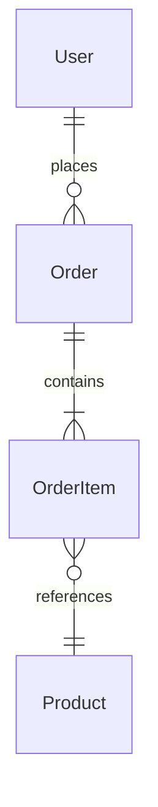
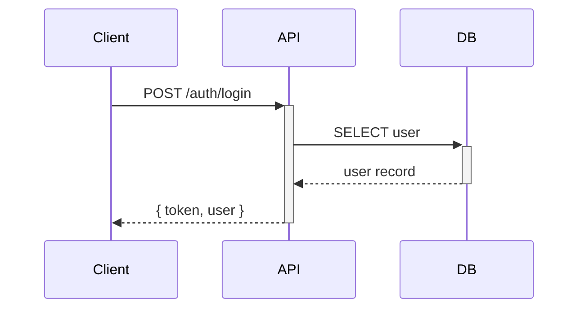
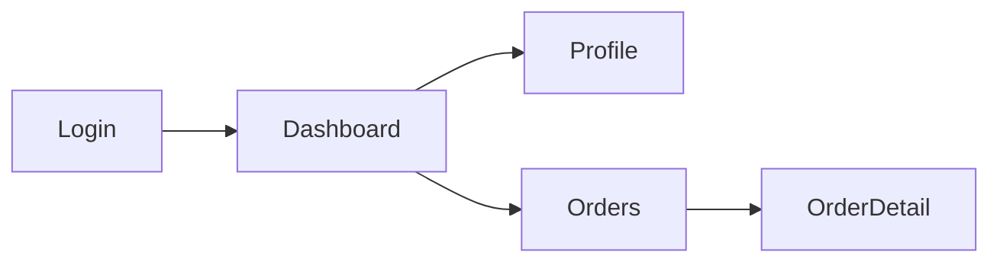

# u-skill-doc-engine -- Central Document CRUD Engine

모든 SSoT 문서의 생성/조회/수정/삭제를 관리하는 중앙 엔진. 모든 문서 조작은 이 엔진을 통해 수행되며, 템플릿 렌더링, JSON 동반 내보내기, 버전 관리, `_index.json` 자동 갱신을 보장한다.

**Owner Agent:** All agents (공용 엔진)

---

## 1. Document Header Standard

모든 SSoT 문서는 YAML frontmatter 헤더를 포함한다.

```markdown
---
Owner: u-agent-planner
Status: Draft
Version: 1.0
Last Updated: 2026-03-27
Related Docs: [srs.md, erd.md]
---
```

### Header Fields

| Field | Required | Description |
|-------|----------|-------------|
| `Owner` | YES | 담당 에이전트 이름 |
| `Status` | YES | Draft, Review, Final |
| `Version` | YES | Major.Minor (수정 시 자동 증가) |
| `Last Updated` | YES | ISO 8601 날짜 |
| `Related Docs` | YES | 관련 문서 목록 |

---

## 2. Language Setting

문서 생성 시 `u-maker.config.json`의 `language.documents` 값을 참조하여 해당 언어로 문서를 작성한다.

### Language Resolution

```
function resolveLanguage():
  config = loadConfig("u-maker.config.json")
  lang = config.language?.documents ?? "ko"   // 기본값: ko
  return lang
```

### Language Behavior

| `language.documents` | 문서 본문 언어 | 섹션 제목 | 설명/Description | ID/코드 |
|---------------------|--------------|----------|-----------------|---------|
| `ko` | 한국어 | 한국어 | 한국어 | 영문 유지 (FR-0001, POST /api/...) |
| `en` | English | English | English | 영문 유지 |
| `ja` | 日本語 | 日本語 | 日本語 | 영문 유지 |
| `zh` | 中文 | 中文 | 中文 | 영문 유지 |

**규칙:**
- ID, 코드 스니펫, 기술 용어(API path, entity name, HTTP method 등)는 언어 설정과 무관하게 **항상 영문**
- Mermaid 다이어그램의 노드 라벨은 `language.documents` 언어로 작성
- JSON companion 파일의 `description`, `title` 필드는 `language.documents` 언어로 작성
- 모든 문서 생성 스킬(`/u-plan`, `/u-design`, `/u-dev`, `/u-qa`, `/u-reverse` 등)은 이 설정을 따름

---

## 3. UML Diagram Policy

모든 SSoT 문서에 관련 UML/다이어그램을 **최대한 포함**한다. 시각화는 이해도를 높이고 리뷰 효율을 극대화한다.

### 문서별 필수/권장 다이어그램

| 문서 | 필수 다이어그램 | 권장 다이어그램 |
|------|--------------|--------------|
| **SRS** | Use Case Diagram (USR-FR 관계) | Activity Diagram (주요 워크플로우) |
| **IA** | Tree/Mindmap (화면 계층) | - |
| **ERD** | ER Diagram (엔티티-관계) | - |
| **API** | Sequence Diagram (주요 API 흐름) | State Diagram (리소스 상태 전이) |
| **Screens** | Component Diagram (레이아웃 구조) | Wireframe (ASCII or HTML) |
| **Screen Flow** | Flowchart (화면 간 내비게이션) | - |
| **RTM** | - | Traceability Matrix Heatmap |
| **Test Cases** | - | State Diagram (테스트 시나리오 흐름) |
| **Code** | Class Diagram (주요 모듈 구조) | Package Diagram (디렉토리 구조) |

### Mermaid 문법 (Markdown 문서용)

`.md` 문서에서는 Mermaid 코드 블록으로 다이어그램을 작성한다:

````markdown





````

### SVG 렌더링 (HTML 문서용)

`.html` 문서 생성 시 Mermaid 다이어그램은 **인라인 SVG로 렌더링**한다:

1. Mermaid 코드 블록을 감지
2. Mermaid.js로 SVG 문자열 생성
3. `<div class="diagram">` 안에 SVG를 인라인 삽입
4. SVG에 `viewBox` 설정으로 반응형 스케일링
5. 외부 이미지 파일 생성 금지 (모든 SVG는 HTML 내 인라인)

```html
<!-- HTML 내 SVG 인라인 렌더링 예시 -->
<div class="diagram" data-type="erDiagram" data-title="User-Order ERD">
  <svg viewBox="0 0 800 400" xmlns="http://www.w3.org/2000/svg">
    <!-- Mermaid가 생성한 SVG 내용 -->
  </svg>
</div>
```

### 다이어그램 스타일 규칙

- Mermaid 곡선 커넥터 사용 (`curve: basis`), 직선 화살표 금지
- 노드 라벨은 `language.documents` 설정 언어로 작성
- ID/기술 용어(테이블명, API path 등)는 항상 영문
- 다이어그램 위에 제목 표시: `### {Diagram Title}`
- 다이어그램 아래에 범례(legend) 포함 (관계 유형, 색상 의미 등)

---

## 4. CRUD Operations

### create(type, scope, data)

새 문서를 생성한다.

**프로세스:**

1. **언어 설정 로드:**
   - `u-maker.config.json` → `language.documents` 읽기
   - 문서 본문, 제목, 설명을 해당 언어로 작성

2. **템플릿 로드:**
   - `_meta/templates/{type}.template.md` 파일 읽기
   - 템플릿이 없으면 기본 구조 사용

3. **템플릿 렌더링:**
   - Mustache-style `{{variable}}` 치환
   - 중첩 변수 지원: `{{data.title}}`, `{{items.length}}`
   - 반복 블록: `{{#items}}...{{/items}}`
   - 조건 블록: `{{#hasData}}...{{/hasData}}`
   - `{{lang}}` → 현재 언어 코드 자동 주입

4. **헤더 설정:**
   ```yaml
   Owner: {agent}
   Status: Draft
   Version: 1.0
   Last Updated: {today}
   Related Docs: {auto-detect from type}
   ```

4. **파일 생성:**
   - `.md` 파일 생성
   - `.json` 동반 파일 생성
   - 경로: `docs/{scope}/{phase-dir}/{type}.md`

5. **인덱스 갱신:**
   - `_index.json`에 문서 등록

**출력:**

```json
{
  "status": "created",
  "files": {
    "md": "docs/retail/01-plan/srs.md",
    "json": "docs/retail/01-plan/srs.json"
  },
  "version": "1.0",
  "indexUpdated": true
}
```

### read(scope, doc)

문서를 조회한다.

```
function read(scope, doc):
  // type name으로 검색
  index = loadIndex(scope)
  entry = index.documents.find(d => d.id === doc || d.type === doc)

  if not entry:
    return { status: "not-found", message: "{doc}을 찾을 수 없습니다." }

  mdContent = readFile(entry.path)
  jsonContent = readFile(entry.path.replace(".md", ".json"))

  return {
    status: "found",
    md: mdContent,
    json: jsonContent,
    metadata: entry
  }
```

### update(scope, doc, changes)

문서를 수정한다.

**프로세스:**

1. 기존 문서 로드
2. `changes` 적용:
   - 섹션별 부분 업데이트 지원
   - 항목 추가/수정/삭제
3. 버전 증가:
   - 내용 변경 → Minor 증가 (1.0 → 1.1)
   - 구조 변경 → Major 증가 (1.1 → 2.0)
4. `Last Updated` 갱신
5. `.md` + `.json` 동시 갱신
6. `_index.json` 갱신

**Status 전환 규칙:**

| Current | Allowed Next | Trigger |
|---------|-------------|---------|
| Draft | Review | 사용자 또는 에이전트 요청 |
| Draft | Final | 직접 확정 (소규모 문서) |
| Review | Final | 사용자 승인 |
| Review | Draft | 수정 필요 (사용자 반려) |
| Final | Draft | 재작업 (사용자 확인 필수, Always-Pause) |

**Final 문서 수정 시:**
- 반드시 사용자 확인 필요 (Always-Pause)
- 확인 후 Status → Draft로 전환
- 변경 사유 기록

### delete(scope, doc)

문서와 관련 파일을 제거한다.

```
function delete(scope, doc):
  // .md + .json + _index.json 엔트리 제거
  entry = findDocument(scope, doc)
  removeFile(entry.path)                    // .md
  removeFile(entry.path.replace(".md", ".json"))  // .json
  removeFromIndex(scope, entry.id)          // _index.json
  removeFromLinks(entry.id)                 // _links.json

  return { status: "deleted", files: [entry.path, jsonPath] }
```

---

## 5. Template Rendering

### Template Location

```
.u-maker/templates/{type}.template.md
```

### Mustache-Style Substitution

| Pattern | Description | Example |
|---------|-------------|---------|
| `{{variable}}` | 단순 치환 | `{{title}}` → "Login System" |
| `{{data.field}}` | 중첩 접근 | `{{project.name}}` → "Retail App" |
| `{{#section}}...{{/section}}` | 반복 블록 | 배열 항목 반복 |
| `{{#flag}}...{{/flag}}` | 조건 블록 | flag가 truthy일 때만 |
| `{{^flag}}...{{/flag}}` | 역조건 블록 | flag가 falsy일 때만 |
| `{{date}}` | 현재 날짜 (자동) | 2026-03-28 |
| `{{scope}}` | 현재 스코프 (자동) | retail |
| `{{lang}}` | 문서 언어 코드 (자동) | ko |

### Template Example

```markdown
---
Owner: {{owner}}
Status: Draft
Version: 1.0
Last Updated: {{date}}
Related Docs: [{{relatedDocs}}]
---

# {{title}}

## 1. Overview

{{description}}

{{#sections}}
## {{sectionNumber}}. {{sectionTitle}}

{{sectionContent}}
{{/sections}}
```

---

## 6. JSON Export

모든 `.md` 파일은 동일 경로에 `.json` 동반 생성.

### JSON Structure

```json
{
  "documentId": "{scope}/{type}",
  "type": "{type}",
  "version": "1.0",
  "status": "Draft",
  "lastUpdated": "{ISO 8601}",
  "owner": "{agent}",
  "data": {
    /* 문서 유형별 구조화된 데이터 */
  },
  "metadata": {
    "scope": "{scope}",
    "phase": "{phase}",
    "language": "{lang}",
    "relatedDocs": [],
    "sourceClassified": []
  }
}
```

### MD → JSON Sync Rules

- `.md` 생성 시 `.json` 반드시 함께 생성
- `.md` 수정 시 `.json` 반드시 함께 갱신
- `.md` 삭제 시 `.json` 반드시 함께 삭제
- `.json`만 단독 존재 불가 (반드시 `.md` 동반)
- `.md`와 `.json`의 version, status, lastUpdated는 항상 동기

---

## 7. _index.json Management

### _index.json Structure

```json
{
  "scope": "retail",
  "lastUpdated": "{ISO 8601}",
  "documents": [
    {
      "id": "srs",
      "type": "srs",
      "path": "01-plan/srs.md",
      "status": "Final",
      "version": "1.2",
      "lastUpdated": "{ISO 8601}",
      "owner": "u-agent-planner",
      "phase": "plan"
    }
  ]
}
```

### Auto-Update Rules

모든 CRUD 작업 후 `_index.json`을 즉시 갱신한다.

| Operation | Index Action |
|-----------|-------------|
| create | 새 entry 추가 |
| update | 기존 entry의 status, version, lastUpdated 갱신 |
| delete | entry 제거 |

---

## 8. Document Path Convention

```
docs/{scope}/{phase-dir}/{type}.md
docs/{scope}/{phase-dir}/{type}.json
```

### Phase Directories

| Phase | Directory | Document Types |
|-------|-----------|---------------|
| Plan | `01-plan/` | srs, ia, roadmap |
| Do | `02-do/` | erd, api, screens, screen-flow, ux-override, design-token, rtm, code |
| Check | `04-check/` | test-cases, test-report |
| Act | `05-act/` | iteration-log, retrospective |
| Common | `common/` | glossary, coding-convention, ux-guide, design-token |

---

## 9. Wireframe & Document Viewer (index.html)

와이어프레임 및 **전체 SSoT 문서**를 브라우저에서 탐색할 수 있는 `index.html`을 자동 생성한다. Sidebar에는 와이어프레임뿐 아니라 전체 문서 인덱스를 포함한다.

### 생성 시점

아래 문서가 생성/수정될 때 `index.html`을 자동 재생성한다:
- `screens.md` / `screens.json` (화면 설계)
- `screen-flow.md` (화면 흐름)
- `wireframes/` 디렉토리 내 `.html` 또는 `.md` 파일

### 출력 경로

```
docs/{scope}/02-design/wireframes/index.html
```

### index.html 구조

단일 HTML 파일(SPA)로 외부 의존성 없이 동작한다. Mermaid 다이어그램은 **인라인 SVG**로 렌더링한다.

```
┌─────────────────────────────────────────────────────┐
│  {ProjectName} v{version}                           │
│  {appName} — SSoT Document Viewer                   │
├──────────────┬──────────────────────────────────────┤
│  Sidebar     │  Main Content                        │
│              │                                      │
│  ─ 문서 인덱스│  (선택된 문서/와이어프레임 렌더링)       │
│    SRS       │                                      │
│    IA        │  .html → innerHTML                    │
│    Roadmap   │  .md   → Markdown → HTML + SVG 렌더링  │
│    ERD       │                                      │
│    API       │  Mermaid 코드 블록 → 인라인 SVG         │
│    Screens   │                                      │
│    RTM       │                                      │
│              │                                      │
│  ─ 와이어프레임│                                      │
│    SCR-001   │                                      │
│    SCR-002   │                                      │
│    SCR-003   │                                      │
│              │                                      │
│  ─ 테스트    │                                      │
│    TestCases │                                      │
│    TestReport│                                      │
│              │                                      │
└──────────────┴──────────────────────────────────────┘
```

### 핵심 기능

#### Sidebar Navigation

3개 그룹으로 구성된 전체 문서 인덱스:

**1. 문서 인덱스 (Phase별)**
- `_index.json`에서 문서 목록 로드
- Phase별 그룹핑: Plan (SRS, IA, Roadmap) → Design (ERD, API, Screens, RTM) → Dev (Code) → Check (TC, Report)
- 각 문서 옆에 Status 배지 (Draft/Review/Final)
- 클릭 시 Main Content에 해당 `.md` 문서를 HTML로 렌더링

**2. 와이어프레임**
- `screens.json`의 화면 목록을 IA 그룹별로 표시
- 각 그룹 옆에 화면 개수 배지 표시
- 화면 ID + 이름 표시 (예: `0901 벌초 접수 내역`)
- 클릭 시 해당 와이어프레임 로드

**3. 공통**
- Collapse/Expand 지원
- Scroll Spy: 현재 보고 있는 문서 하이라이트
- 검색 필터 (문서명/ID 키워드 검색)

#### Main Content Area
- **`.html` 파일:** `innerHTML`로 직접 렌더링
- **`.md` 파일:** 내장 Markdown 파서로 HTML 변환 후 렌더링
  - 지원: headings, paragraphs, lists, tables, code blocks, bold/italic, links, images
  - **Mermaid 코드 블록 → 인라인 SVG로 렌더링** (Mermaid.js CDN 사용)
  - SVG는 `viewBox` 기반 반응형, 확대/축소 가능
  - 다이어그램 위에 제목, 아래에 범례 자동 표시
- 와이어프레임 미선택 시 안내 메시지 표시:
  ```
  와이어프레임을 선택하세요
  왼쪽 사이드바에서 화면을 클릭하면 여기에 표시됩니다 (총 {n}개 화면)
  ```

#### 파일 매핑 규칙

와이어프레임 파일은 `wireframes/` 디렉토리에 화면 ID 기반으로 배치한다:

```
docs/{scope}/02-design/wireframes/
├── index.html              ← 자동 생성 (뷰어)
├── SCR-001.html            ← HTML 와이어프레임
├── SCR-002.md              ← Markdown 와이어프레임
├── SCR-003.html
└── ...
```

파일명 매핑 우선순위:
1. `{SCR-ID}.html` (최우선)
2. `{SCR-ID}.md`
3. 매핑 파일 없음 → Main Content에 "와이어프레임 미작성" 표시

### index.html 생성 프로세스

```
function generateDocumentViewer(scope):
  config = loadConfig()
  indexJson = read("docs/{scope}/_index.json")
  screensJson = read("docs/{scope}/02-design/screens.json")
  iaJson = read("docs/{scope}/01-plan/ia.json")

  // 1. 전체 문서 인덱스 구성 (Phase별 그룹핑)
  docIndex = groupDocumentsByPhase(indexJson)

  // 2. 화면 목록 + 그룹핑 데이터 구성
  screenGroups = groupScreensByIA(screensJson, iaJson)

  // 3. wireframes/ 디렉토리 스캔 → 파일 매핑
  files = scanDir("docs/{scope}/02-design/wireframes/")
  mapping = mapScreensToFiles(screensJson, files)

  // 4. 전체 .md 문서 읽기 + Mermaid → SVG 변환
  documents = {}
  for doc in indexJson.documents:
    mdContent = readFile(doc.path)
    htmlContent = markdownToHtml(mdContent)
    htmlContent = renderMermaidToSVG(htmlContent)  // Mermaid → 인라인 SVG
    documents[doc.id] = htmlContent

  // 5. index.html 생성 (인라인 CSS + JS, Mermaid.js CDN)
  html = renderViewerTemplate({
    projectName: config.projectName,
    appName: scope,
    version: indexJson.version ?? "1.0",
    docIndex: docIndex,
    screenGroups: screenGroups,
    mapping: mapping,
    documents: documents,
    totalDocs: indexJson.documents.length,
    totalScreens: screensJson?.screens?.length ?? 0,
    language: config.language?.documents ?? "ko"
  })

  // 6. 파일 쓰기
  write("docs/{scope}/02-design/wireframes/index.html", html)
```

### 스타일 사양

| 요소 | 사양 |
|------|------|
| Sidebar 배경 | `#1e293b` (dark slate) |
| Sidebar 텍스트 | `#e2e8f0` (light gray) |
| Sidebar 너비 | `320px` (고정) |
| 그룹 제목 | bold, 좌측에 색상 dot indicator |
| 화면 ID 배지 | `#334155` 배경, `#94a3b8` 텍스트, border-radius 4px |
| Main Content 배경 | `#f1f5f9` (light blue-gray) |
| 선택된 항목 | `#334155` 배경 하이라이트 |
| 안내 메시지 | 중앙 정렬, `#64748b` 텍스트 |
| 반응형 | 768px 미만에서 sidebar 접기 + 햄버거 메뉴 |

### Markdown 렌더링 + SVG 다이어그램 사양

index.html에 인라인으로 경량 Markdown 파서 + Mermaid SVG 렌더러를 포함한다:

```
Markdown 지원 문법:
- # ~ ###### headings
- **bold**, *italic*, ~~strikethrough~~
- - / * / 1. lists (nested)
- | table | header | (GFM tables)
- ``` code blocks ``` (syntax highlighting 없이 monospace)
- [link](url), 
- > blockquote
- --- horizontal rule

다이어그램 렌더링 (Mermaid → SVG):
- ```mermaid 블록 감지 → Mermaid.js CDN으로 SVG 생성
- SVG는 인라인 삽입 (<svg> 태그 직접 embed)
- viewBox 기반 반응형 스케일링
- 지원 다이어그램 타입:
  - erDiagram (ERD)
  - sequenceDiagram (API 흐름)
  - flowchart / graph (Screen Flow, 워크플로우)
  - classDiagram (코드 구조)
  - stateDiagram (상태 전이)
  - mindmap (IA 계층)
  - pie (통계)
  - gantt (Roadmap)
- 다이어그램 클릭 시 확대 모달 표시 (zoom)
```

### 자동 재생성 트리거

| 이벤트 | 동작 |
|--------|------|
| `screens.md` 생성/수정 | index.html 재생성 |
| `wireframes/` 내 파일 추가/삭제 | index.html 재생성 |
| `/u-design --only screens` 실행 | index.html 재생성 |
| `/u-dev` FE 코드 생성 후 | index.html 재생성 (wireframe 파일이 있을 때) |

---

## 10. Version Tracking


### Version Format

`Major.Minor`

| Change Type | Version Bump | Example |
|-------------|-------------|---------|
| 내용 수정 (항목 추가/수정) | Minor +1 | 1.0 → 1.1 |
| 구조 변경 (섹션 추가/제거) | Major +1, Minor = 0 | 1.3 → 2.0 |
| Status 변경만 | 버전 유지 | 1.1 → 1.1 |

### Version History

문서 내 버전 변경 이력 추적 (json의 metadata에 기록):

```json
{
  "versionHistory": [
    { "version": "1.0", "date": "2026-03-25", "author": "u-agent-planner", "changes": "Initial creation" },
    { "version": "1.1", "date": "2026-03-27", "author": "u-agent-planner", "changes": "Added FR-0015, FR-0016" }
  ]
}
```

---

## 11. Safety Rules

1. 모든 문서 조작은 이 엔진을 통해 수행 (직접 파일 쓰기 금지)
2. `.md` 생성/수정/삭제 시 `.json` 반드시 동반
3. `_index.json` 갱신 필수 (CRUD 후 즉시)
4. Final 상태 문서 수정 시 Always-Pause (사용자 확인)
5. 삭제된 문서의 ID를 재사용하지 않음
6. 헤더 필드 누락 금지 (5개 필수 필드)
7. version은 자동 관리 (수동 설정 무시)
8. 동일 scope에서 같은 type의 문서는 1개만 존재 (중복 생성 거부)
9. 문서 본문은 `language.documents` 설정 언어로 작성 (ID/코드는 항상 영문)
10. 모든 문서에 관련 UML 다이어그램을 최대한 포함 (Section 3 필수/권장 테이블 참조)
11. HTML 생성 시 Mermaid 다이어그램은 반드시 인라인 SVG로 렌더링 (외부 이미지 파일 금지)
