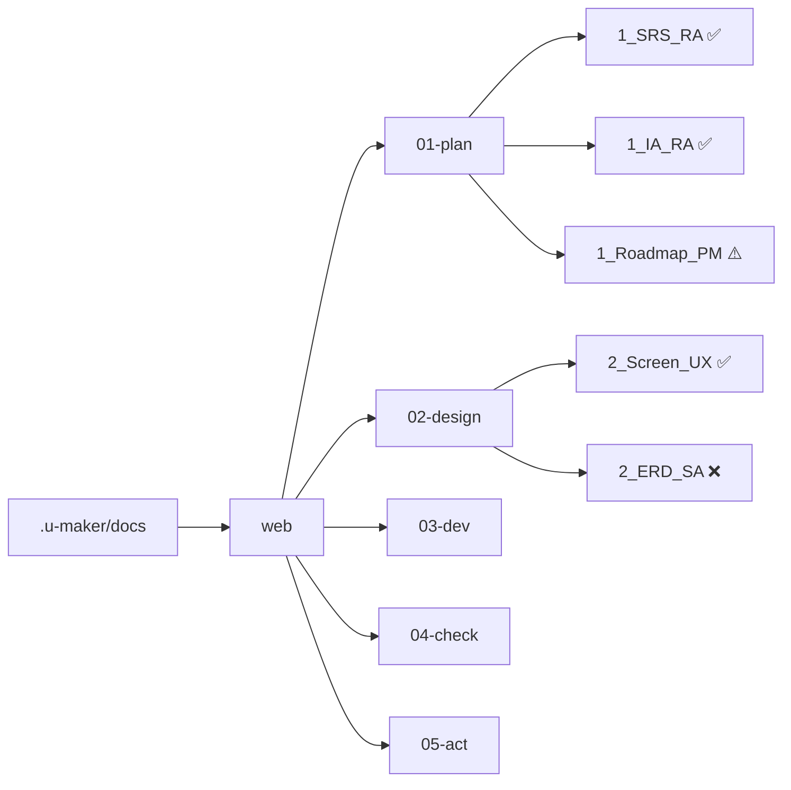
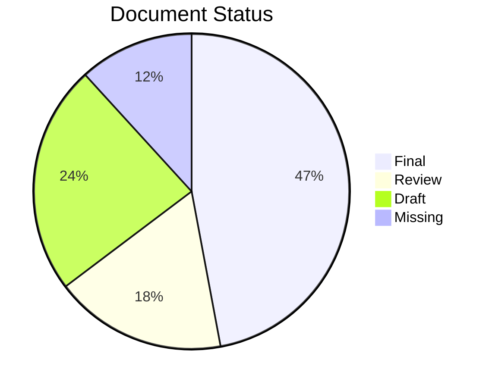
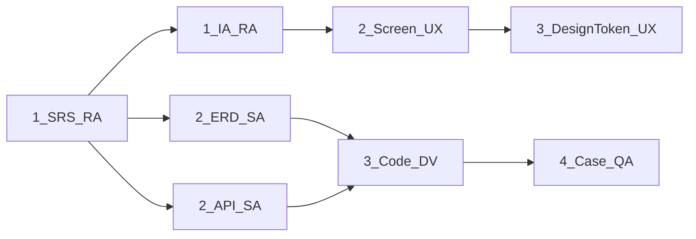
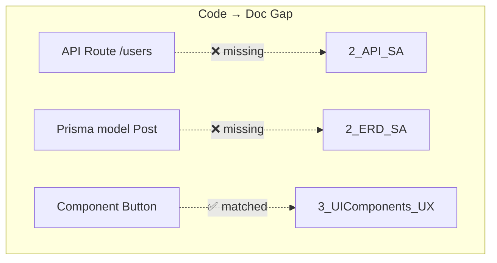

# Document Management

> .u-maker/docs/ 내 전체 문서 트리를 조회하거나 메타데이터를 갱신한다.

## Syntax

/u-skill-docs list [--phase PLAN|DESIGN|DO|CHECK|ACT] [--status Draft|Review|Final] [--app <name>]
/u-skill-docs update [<doc-name|all>] [--status <val>] [--version <val>]
/u-skill-docs rebuild [--app <name>]
/u-skill-docs (인수 없음 = /u-skill-docs list)

## Document List Flow

1. .u-maker/u-maker.config.json에서 apps 목록 확인
2. .u-maker/docs/ 디렉토리 스캔
3. 각 문서 YAML 헤더 파싱
4. Expected Document Matrix와 대조하여 누락 문서 탐지
5. 필터 옵션 적용
6. 구조화된 트리 출력

## Document Update Flow

**Mode A (인수 없음)**: 1_Index_PM.md 재동기화
**Mode B (문서 지정)**: YAML 헤더 수정 → Index 재동기화

## Document Rebuild Flow

기존 SSoT 문서를 현재 코드베이스 기반으로 재생성한다.

1. .u-maker/u-maker.config.json에서 apps 목록 및 설정 확인
2. 현재 코드베이스 분석 (소스코드, DB 스키마, API 라우트, 컴포넌트 등)
3. 기존 문서의 YAML 헤더와 내용을 읽어 현행 상태 파악
4. 코드 ↔ 문서 Gap 분석 (누락/불일치 항목 식별)
5. Gap이 있는 문서를 코드 기준으로 재생성 (기존 내용 보존 + 누락분 추가)
6. 동명의 .json 파일도 함께 재생성
7. 1_Index_PM.md 재동기화
8. 변경 사항 요약 출력

### SRS Structure Enforcement (all `1_SRS_RA.md`)

`/u-skill-docs update all` 또는 `/u-skill-docs rebuild` 수행 시, 모든 앱의 `1_SRS_RA.md`는 아래 구조를 강제한다.

1. FR + NFR
2. US
3. FT

즉, 상위 구조는 반드시 `FR+NFR > US > FT` 순서를 유지해야 한다.

## Status Transition Rules

| 현재 | 허용 전환 |
|------|-----------|
| Draft | → Review, → Final |
| Review | → Final, → Draft |
| Final | → Draft (경고 후), → Review |

## Mermaid Diagram 출력 규칙

모든 서브커맨드(list, update, rebuild) 실행 결과에 아래 Mermaid 다이어그램을 적극 활용한다.

### 1. Document Tree (list)

문서 구조를 트리뷰 텍스트가 아닌 Mermaid flowchart로 시각화한다.

- ✅ Final, ⚠️ Draft/Review, ❌ Missing
- 노드 색상: Final=green, Draft=yellow, Review=blue, Missing=red (style 지시문 사용)

### 2. Status Overview (list, update)

Phase별 문서 완성도를 pie chart로 요약한다.

### 3. Document Dependency (list --phase)

문서 간 의존 관계를 flowchart로 표시한다.

### 4. Rebuild Gap Report (rebuild)

rebuild 시 코드 ↔ 문서 Gap을 시각화한다.

## Rules

- u-agent-ra 에이전트가 담당
- iterations/ 아카이브 디렉토리는 목록에서 제외
- Post-Execution Summary Box 출력 필수
- **모든 출력에 최소 1개 이상의 Mermaid 다이어그램을 반드시 포함한다**
- `_refer/mermaid-guide.md` Section 3 "Mandatory Diagram Matrix"를 준수하여 적용 가능한 다이어그램을 최대한 많이 작성한다
- Menu Tree는 `flowchart TD` 사용 (mindmap 사용 금지)
- 모든 `1_SRS_RA.md`는 `FR+NFR > US > FT` 순서를 준수한다
