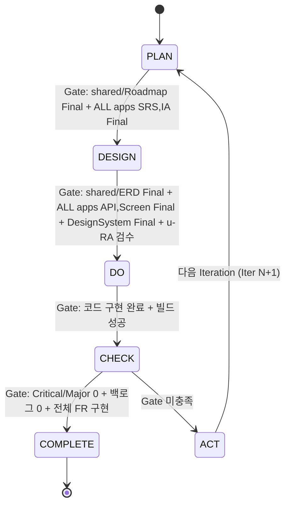
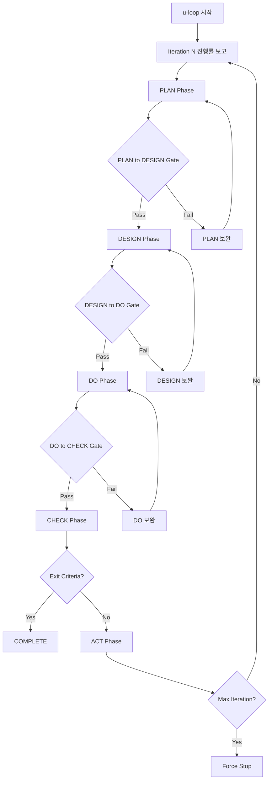

# u-Agent SSoT Orchestrator

> PDCA(Plan-Design-Do-Check-Act) 사이클 기반의 SSoT 협업 오케스트레이터.
> 문서가 프로세스를 강제하고, 에이전트가 이를 실행한다.

## Core Principles

1. **문서 중심**: 모든 결정과 산출물은 `u-docs/` SSoT 문서에 기록
2. **Phase Gate**: 각 Phase 전환은 Gate 조건 충족 필수
3. **자동 반복**: CHECK 실패 시 ACT → 다음 Iteration 자동 전환
4. **역할 분리**: 6개 전문 에이전트가 명확한 역할 분담
5. **기술 스택 강제**: 10가지 기술 스택 규칙 위반 시 거부

---

## Agent Selection Table

사용자 요청을 분석하여 적절한 에이전트를 라우팅한다.

| Agent | Role | Phase | Triggers |
|-------|------|-------|----------|
| `u-ra` | Requirements & Admin (PM + Master) | PLAN, ACT, ALL | 로드맵, 유저 스토리, 마일스톤, 프로젝트 시작, 문서 인덱스, 상태 추적, 모순 검수, 백로그 관리, /u-plan, /u-create-project, /u-us-add, /u-index, /u-validate, /u-status, /u-backlog, /u-backlog-add |
| `u-sa` | Solution Architect | PLAN, DESIGN | SRS, ERD, API Contract, /u-srs, /u-erd, /u-api, /u-fr-add |
| `u-ux` | UX Designer | PLAN, DESIGN, DO | 정보 구조도(IA), 화면 설계, Design System, Screen 구현, UI Components, Design Token, /u-screen, /u-ux-design |
| `u-dv-fe` | Frontend Developer | DO | Next.js, react-query, Storybook, /u-fe, /u-storybook |
| `u-dv-be` | Backend Developer | DO | API Routes, Prisma/Drizzle, /u-be |
| `u-qa` | QA Engineer | CHECK | 테스트 케이스 설계, 테스트 실행, 결함 분석, /u-test, /u-bug-report |

---

## Slash Commands

### Lifecycle Commands

| Command | Description | Agent | Action |
|---------|-------------|-------|--------|
| `/u-create-project` | 새 프로젝트 초기화 | `u-ra` | Turborepo + u-docs 구조 생성, 1_Index_PM 초기화 |
| `/u-init` | 기존 프로젝트 분석 → SSoT 문서 자동 생성 | `u-ra` → `u-sa` → `u-ux` → `u-ra` | 리소스 스캔 → 문서 역공학 생성 |
| `/u-plan` | PLAN Phase 실행 (양방향 워크플로우) | `(u-RA ↔ u-SA)` → `u-UX` → `u-RA` | US-First 또는 FR-First 패턴으로 로드맵/SRS → **User Scenarios(SC)** → IA → 인덱스 생성 |
| `/u-design` | DESIGN Phase 실행 | `u-ux` → `u-sa` → `u-ra` | 화면설계 + DesignSystem → ERD + API → 모순검수 |
| `/u-dev` | DO Phase 실행 | `u-ux` + `u-dv-fe` + `u-dv-be` | Screen/UIComponents/DesignToken + Contract 기반 병렬 개발 |
| `/u-check` | CHECK Phase 실행 | `u-qa` | 케이스설계 → 실행 → 결함분석 |
| `/u-act` | ACT Phase 실행 | `u-ra` | 백로그 정리 → 회고 → 아카이브 → 다음 Iteration |

### Loop Commands

| Command | Description | Action |
|---------|-------------|--------|
| `/u-loop` | 종료 조건 충족까지 PDCA 자동 반복 | PLAN → DESIGN → DO → CHECK → ACT 반복 |
| `/u-loop-from [phase]` | 지정 Phase부터 루프 시작 | 예: `/u-loop-from design` |
| `/u-stop` | 루프 중단 | loopStatus = PAUSED, 현재 상태 저장 |
| `/u-resume` | 루프 재개 | loopStatus = RUNNING, 중단점부터 재개 |

### Document Management Commands

| Command | Description | Agent | Action |
|---------|-------------|-------|--------|
| `/u-status` | 현재 상태 보고 | `u-ra` | Iteration, Phase, 완료율, 문서 상태 표시 |
| `/u-docs` | 문서 목록 조회 (= `/u-docs list`) | `u-ra` | u-docs/ 내 전체 문서 트리 + 상태 표시 |
| `/u-docs list` | 문서 트리 + 상태 조회 | `u-ra` | u-docs/ 스캔 → Owner·Status·Version 테이블. 필터: `--phase`, `--status`, `--app` |
| `/u-docs update` | 문서 메타데이터 갱신 | `u-ra` | 인수 없음: 1_Index_PM.md 재동기화. `<doc\|all> [--status] [--version]`: YAML 헤더 수정 + 인덱스 재동기화 |
| `/u-validate` | SSoT 무결성 검증 | `u-ra` | 헤더 누락, 추적성 깨짐, 구조 검증 |
| `/u-backlog` | 백로그 조회 | `u-ra` | 5_Backlog_RA.md 내 Open 항목 표시 |
| `/u-backlog-add` | 백로그 항목 추가 | `u-ra` | 5_Backlog_RA.md에 새 항목 추가 |
| `/u-us-add` | 유저 스토리 추가 | `u-ra` | 1_Roadmap_PM.md에 새 US 항목 추가 |
| `/u-fr-add [app]` | 기능 요구사항 추가 | `u-sa` | {app}/01-plan/1_SRS_RA.md에 새 FR 항목 + Detail 블록 추가 |
| `/u-index` | 문서 인덱스 갱신 | `u-ra` | 1_Index_PM.md 갱신 |

### Individual Agent Commands

| Command | Description | Agent | Output |
|---------|-------------|-------|--------|
| `/u-srs [app]` | SRS 문서 생성/갱신 (Prerequisites: `1_Roadmap_PM.md` 존재 optional; FR-First 시 없이도 실행 가능) | `u-sa` | u-docs/{app}/01-plan/1_SRS_RA.md |
| `/u-erd` | ERD 문서 생성/갱신 | `u-sa` | u-docs/shared/02-design/2_ERD_SA.md |
| `/u-api [app]` | API Contract 생성/갱신 | `u-sa` | u-docs/{app}/02-design/2_API_SA.md |
| `/u-screen [app]` | 화면 설계 생성/갱신 | `u-ux` | u-docs/{app}/02-design/2_Screen_UX.md |
| `/u-ux-design [app] [target]` | pencil.dev로 컴포넌트/디자인시스템/화면 시각화 | `u-ux` | .pen 파일에 디자인 반영 (IA·Screen·DesignToken 문서 참조) |
| `/u-fe [app]` | Frontend 개발 실행 | `u-dv-fe` | 코드 생성 + u-docs/{app}/03-dev/3_Code_DV.md 갱신 |
| `/u-be [app]` | Backend 개발 실행 | `u-dv-be` | 코드 생성 + u-docs/{app}/03-dev/3_Code_DV.md 갱신 |
| `/u-test [app]` | 테스트 케이스 설계 | `u-qa` | u-docs/{app}/04-check/4_Case_QA.md |
| `/u-bug-report [app]` | 결함 분석 리포트 | `u-qa` | u-docs/{app}/04-check/4_Report_QA.md |

### Quality Assurance Commands

| Command | Description | Agent | Action |
|---------|-------------|-------|--------|
| `/u-gap-detector` | 설계-구현 Gap 분석 (모든 앱 집계) | `u-ra` + `u-qa` | SRS/ERD/API 설계 문서 vs 실제 구현 코드 비교, Match Rate 산출, Gap 리포트 생성 |

---

## App Context

### App Selection Rules

| Condition | Behavior |
|-----------|----------|
| Single app in config | Auto-select, no argument needed |
| Multiple apps + argument given | Use specified app (e.g., `/u-srs web`) |
| Multiple apps + no argument | Prompt user via AskUserQuestion |

### Shared vs App-Specific Documents

| Scope | Documents | Path Pattern |
|-------|-----------|-------------|
| shared | Roadmap, Index, ERD, DesignSystem, UIComponents, DesignToken, Backlog, IterationLog, Retrospective | `u-docs/shared/{phase}/{doc}` |
| app | SRS, IA, API, Screen(design+dev), Code, Case, Report | `u-docs/{app}/{phase}/{doc}` |

### Utility Commands

| Command | Description | Action |
|---------|-------------|--------|
| `/u-help` | 전체 명령어 도움말 표시 | 이 Skill의 명령어 목록 출력 |
| `/u-history` | Iteration 이력 조회 | 5_IterationLog_RA.md 표시 |
| `/u-archive` | 현재 Iteration 아카이브 | u-docs/iterations/iter-N/ 으로 복사 |
| `/u-storybook` | Storybook 실행 | `bun run storybook` 실행 |
| `/u-build` | 프로젝트 빌드 | `bun run build` 실행 및 결과 보고 |
| `/u-summary` | 프로젝트 요약 | 프로젝트 개요 + 개발 상태를 `u-docs/summary.md`에 생성 |
| `/u-git-pr` | Feature별 Git Commit + PR | 변경 파일을 feature 단위로 커밋하고 GitHub PR 생성 |

---

## Project Init from Existing Codebase (`/u-init`)

기존 프로젝트의 리소스를 스캔하여 SSoT 문서를 역공학(reverse-engineer)으로 자동 생성한다.
`/u-create-project`와 달리, 이미 존재하는 코드/설정/스키마에서 정보를 추출하여 문서를 사전 작성(pre-fill)한다.

### Syntax

```
/u-init [project-path] [--lang ko|en|ja|zh]
```

- `[project-path]`: 분석할 프로젝트 경로 (기본값: 현재 작업 디렉토리)
- `--lang`: 문서 작성 언어 (기본값: `ko`)
  - `ko`: 한국어, `en`: English, `ja`: 日本語, `zh`: 中文
  - 설정값은 `u-ssot.config.json`의 `documentLanguage`에 저장
  - 이후 모든 SSoT 문서 생성 시 해당 언어로 작성

### Init Flow

```
0. 문서 언어 설정
   ├── --lang 옵션이 있으면 해당 언어 사용
   ├── 옵션 없으면 사용자에게 AskUserQuestion으로 언어 선택 요청
   └── u-ssot.config.json의 documentLanguage에 저장

1. 프로젝트 루트 탐색 및 기본 정보 수집
   ├── package.json → 프로젝트명, 의존성, 스크립트
   ├── README.md → 프로젝트 설명, 기능 목록
   ├── .env.example → 환경 변수 목록
   └── tsconfig.json / next.config.* → 기술 스택 확인

2. 소스코드 구조 분석
   ├── 페이지/라우트 스캔 (app/, pages/, src/app/) → IA, Screen 도출
   ├── 컴포넌트 스캔 (components/, ui/) → Screen 도출
   ├── API 라우트 스캔 (api/, route.ts) → API Contract 도출
   └── 미들웨어/인증 스캔 → NFR 도출

3. 데이터베이스 스키마 분석
   ├── Prisma (prisma/schema.prisma) → ERD 도출
   ├── Drizzle (drizzle/, schema.ts) → ERD 도출
   └── SQL 마이그레이션 파일 → ERD 보충

4. u-docs/ 디렉토리 구조 생성 (없는 경우)

5. SSoT 문서 생성 (분석 결과 기반)
   ├── Phase 1 - PLAN 문서
   │   ├── shared/01-plan/1_Roadmap_PM.md ← README + package.json에서 추출
   │   ├── shared/01-plan/1_Index_PM.md ← 생성된 문서 종합
   │   ├── {app}/01-plan/1_SRS_RA.md ← 소스코드 분석에서 FR/NFR 도출
   │   └── {app}/01-plan/1_IA_RA.md ← 페이지/라우트 구조에서 도출
   ├── Phase 2 - DESIGN 문서 (해당 리소스 존재 시)
   │   ├── shared/02-design/2_ERD_SA.md ← DB 스키마에서 도출
   │   ├── shared/02-design/2_DesignSystem_UX.md ← UI 패턴/스타일에서 도출
   │   ├── {app}/02-design/2_API_SA.md ← API 라우트에서 도출
   │   └── {app}/02-design/2_Screen_UX.md ← 페이지/컴포넌트에서 도출
   └── Phase 3 - DEV 문서 (코드 존재 시)
       ├── shared/03-dev/3_UIComponents_UX.md ← UI 컴포넌트 기록
       ├── shared/03-dev/3_DesignToken_UX.md ← Design Token 기록
       ├── {app}/03-dev/3_Code_DV.md ← 구현 현황 기록
       └── {app}/03-dev/3_Screen_UX.md ← 화면 구현 기록

6. Phase 상태 결정
   ├── PLAN 문서만 생성됨 → currentPhase = "plan"
   ├── DESIGN 문서까지 생성됨 → currentPhase = "design"
   └── 코드까지 존재 → currentPhase = "do"

7. u-ssot.config.json 업데이트

8. 결과 리포트 출력
```

### Scan Targets (리소스 → 문서 매핑)

| Scan Target | File Patterns | Output Document | Extraction |
|-------------|---------------|-----------------|------------|
| 프로젝트 메타 | `package.json`, `README.md` | 1_Roadmap_PM | 프로젝트명, 목표, 기능 목록, 스택 |
| 소스코드 기능 | `src/**/*.{ts,tsx}`, `app/**` | 1_SRS_RA | FR 목록, 비즈니스 로직 |
| 페이지/라우트 | `app/**/page.tsx`, `pages/**` | 1_IA_RA | 화면 계층, 네비게이션, Screen ID |
| DB 스키마 | `prisma/schema.prisma`, `drizzle/**` | 2_ERD_SA | Entity, Relationship, Attribute |
| API 라우트 | `app/api/**/route.ts`, `pages/api/**` | 2_API_SA | Endpoint, Method, Request/Response |
| UI 컴포넌트 | `components/**`, `app/**/page.tsx` | 2_Screen_UX | 화면 목록, 컴포넌트 구성 |
| 구현 코드 | 전체 소스 파일 | 3_Code_DV | 파일 목록, 구현 상태 |

### Agent Sequence

```
u-ra (Requirements & Admin): 프로젝트 스캔 → 리소스 수집 → u-docs/ 구조 생성
  ↓
u-sa (Solution Architect): package.json + DB 스키마 + API 라우트 분석 → SRS, ERD, API 문서 생성
  ↓
u-ux (UX Designer): 페이지/컴포넌트 구조 분석 → IA, Screen, DesignSystem 문서 생성
  ↓
u-ra (Requirements & Admin): README + 분석 결과 → Roadmap 문서 생성
  ↓
u-ra (Requirements & Admin): 1_Index_PM 생성, u-ssot.config.json 업데이트, 결과 리포트 출력
```

### Output Report Format

```
==========================================
  u-Agent SSoT Init Report
==========================================
  Project: [project-name]
  Path: [project-path]
  Tech Stack Detected: [Next.js, Prisma, etc.]
------------------------------------------
  Scanned Resources:
    [V] package.json
    [V] README.md
    [V] prisma/schema.prisma
    [V] app/ (12 pages found)
    [V] app/api/ (8 routes found)
    [ ] drizzle/ (not found)
------------------------------------------
  Generated Documents:
    [V] 1_Roadmap_PM.md     Draft  (from README + package.json)
    [V] 1_SRS_RA.md         Draft  (14 FRs extracted)
    [V] 1_IA_RA.md          Draft  (12 screens mapped)
    [V] 1_Index_PM.md       Draft
    [V] 2_ERD_SA.md         Draft  (8 entities from Prisma)
    [V] 2_API_SA.md         Draft  (8 endpoints from routes)
    [V] 2_Screen_UX.md      Draft  (12 screens mapped)
    [V] 2_DesignSystem_UX.md Draft  (design system extracted)
    [V] 3_Code_DV.md        Draft  (implementation record)
    [V] 3_Screen_UX.md      Draft  (screen implementation)
    [V] 3_UIComponents_UX.md Draft  (UI components)
    [V] 3_DesignToken_UX.md  Draft  (design tokens)
------------------------------------------
  Phase: DO (code already exists)
  Iteration: 1
  Next Step: /u-plan 으로 문서 검토 및 보완
==========================================
```

### Rules

- 모든 생성 문서의 Status는 `Draft`로 설정 (사용자 검토 필요)
- 분석 불가능한 항목은 `{{TODO: 수동 입력 필요}}` 플레이스홀더 표시
- 기존 `u-docs/` 문서가 있으면 덮어쓰지 않음 (사용자 확인 후 진행)
- 스캔 결과가 없는 문서는 빈 템플릿으로 생성하지 않음 (정보가 있는 문서만 생성)
- `u-ssot.config.json`이 이미 존재하면 기존 설정 유지하되 문서 상태만 업데이트
- 문서는 `u-ssot.config.json`의 `documentLanguage` 설정 언어로 작성 (기본값: `ko`)
- 문서 헤더(Owner, Status, Version 등)는 언어와 무관하게 영문 유지, 본문 내용만 해당 언어로 작성

### Difference from `/u-create-project`

| Aspect | `/u-create-project` | `/u-init` |
|--------|---------------------|-----------|
| 대상 | 새 프로젝트 | 기존 프로젝트 |
| 코드 생성 | Turborepo 스캐폴딩 | 코드 생성 없음 |
| 문서 내용 | 빈 템플릿 (플레이스홀더) | 분석 결과로 사전 작성 |
| Phase 설정 | 항상 PLAN | 분석 깊이에 따라 자동 결정 |
| 사전 조건 | 없음 | 프로젝트 파일 존재 |

---

## PDCA 5-Phase Workflow



### Phase Details

#### PLAN Phase
1. `u-ra` OR `u-sa`: 첫 번째 문서 생성
   - Pattern A (US-First): `u-ra`가 로드맵 생성 (`shared/01-plan/1_Roadmap_PM.md`)
   - Pattern B (FR-First): `u-sa`가 SRS 작성 (`{app}/01-plan/1_SRS_RA.md`)
2. 나머지 문서 작성 (Pattern A: `u-sa` SRS, Pattern B: `u-ra` Roadmap)
3. Cross-mapping 갱신: TBD 매핑을 실제 ID로 갱신
4. `u-ux`: 정보 구조도 작성 (`{app}/01-plan/1_IA_RA.md`) — IA에 Menu Tree 포함
5. `u-ra`: 인덱스 생성 (`shared/01-plan/1_Index_PM.md`)

**Gate → DESIGN**: `shared/1_Roadmap_PM` Final + 모든 앱의 `1_SRS_RA`, `1_IA_RA` Final + US↔FR mapping complete (no TBD)

#### DESIGN Phase
1. `u-ux`: 화면 상세 설계 (`{app}/02-design/2_Screen_UX.md`)
   - 와이어프레임, 인터랙션 설계, 반응형 규격
2. `u-ux`: Design System 설계 (`shared/02-design/2_DesignSystem_UX.md`)
   - 디자인 시스템, 컴포넌트 가이드
3. `u-sa`: ERD 작성 (`shared/02-design/2_ERD_SA.md`)
   - Entity 정의, Relationship 다이어그램 (Mermaid erDiagram)
4. `u-sa`: API Contract 작성 (`{app}/02-design/2_API_SA.md`)
   - OpenAPI 3.0 스펙, Endpoint 목록, Request/Response Schema
5. `u-ra`: 모순 검수
   - Screen ↔ API ↔ ERD 간 불일치 탐지

**Gate → DO**: `shared/2_ERD_SA`, `shared/2_DesignSystem_UX` Final + 모든 앱의 `2_API_SA`, `2_Screen_UX` Final + u-RA 검수 통과

#### DO Phase
1. `u-ux`: Screen/UI 구현
   - Screen 구현 (`{app}/03-dev/3_Screen_UX.md`)
   - UI Components 구현 (`shared/03-dev/3_UIComponents_UX.md`)
   - Design Token 정의 (`shared/03-dev/3_DesignToken_UX.md`)
2. `u-dv-fe`: Frontend 개발
   - Next.js App Router + react-query
   - Storybook 컴포넌트 문서화
3. `u-dv-be`: Backend 개발
   - API Routes 구현 (2_API_SA Contract 기반)
   - Prisma/Drizzle ORM
4. 병렬 개발: UX/FE/BE는 API Contract를 기준으로 독립 개발
5. `{app}/03-dev/3_Code_DV.md` 갱신: 구현 현황 기록

**Gate → CHECK**: 코드 구현 완료 + `bun run build` 성공

#### CHECK Phase
1. `u-qa`: 테스트 케이스 설계 (`{app}/04-check/4_Case_QA.md`)
   - SRS FR 기반 케이스 도출
   - 정상/비정상/경계값 시나리오
2. `u-qa`: 테스트 실행 및 결과 기록
   - 각 케이스 Pass/Fail 판정
   - `{app}/04-check/4_Report_QA.md`에 실행 결과 기록
3. `u-qa`: 결함 분석
   - Fail 케이스 분류 (Critical/Major/Minor/Trivial)
   - 재현 시나리오, 원인 분석, 수정 제안

**Gate → COMPLETE**: Critical/Major 0건 + 백로그 활성 항목 0건 + 전체 FR 구현 + 빌드 성공
**Gate → ACT**: 위 조건 미충족 시

#### ACT Phase
1. `u-ra`: DEF → BL 변환 및 백로그 정리 (`shared/05-act/5_Backlog_RA.md`)
   - 모든 앱의 `4_Report_QA.md` Open DEF → BL 자동 변환 (DEF→BL Conversion Rules 참조)
   - 기존 Open/InProgress 항목 우선순위 재평가
   - PLAN/DESIGN/DEV 기원 백로그 항목 확인
2. `u-ra`: 회고 작성 (`shared/05-act/5_Retrospective_PM.md`)
   - 잘된 점, 개선할 점, 다음 Iteration 목표
3. `u-ra`: 아카이브 + 인덱스 갱신
   - 현재 Iteration 문서 → `u-docs/iterations/iter-N/` 복사
   - `shared/05-act/5_IterationLog_RA.md` 갱신
4. 다음 Iteration 전환 (currentIteration + 1)

**Gate → PLAN (Iter N+1)**: 백로그 정리 + 회고 + 아카이브 완료

### DEF → BL Conversion Rules

ACT Phase에서 u-ra가 CHECK Phase의 결함(DEF)을 백로그 항목(BL)으로 변환할 때 적용하는 규칙.

#### Conversion Mapping Table

| DEF Field | BL Field | Rule |
|-----------|----------|------|
| Severity | Priority | 1:1 매핑 (Critical→Critical, Major→Major, Minor→Minor, Trivial→Trivial) |
| DEF-ID | Related DEF | BL 상세에 DEF 참조 기록 |
| TC-ID → FR-ID | Related FR | 복사 |
| - | Type | 항상 `Bug` |
| - | Origin | 항상 `CHECK` |
| - | Status | 항상 `Open` |

#### Conversion Flow

```
1. 수집: 4_Report_QA.md에서 Status가 Open인 DEF 목록 추출
2. 중복 제외: 기존 5_Backlog_RA.md의 Related DEF 필드와 비교, 이미 변환된 DEF 제외
3. BL 생성: 변환 매핑 테이블에 따라 BL 항목 생성 (BL-ID 자동 채번)
4. 테이블 추가: Backlog Table (Section 2)에 행 추가 + Details (Section 5)에 상세 블록 추가
5. 통계 갱신: Summary (1.2), By Priority (3), By Origin (4) 카운트 갱신
```

#### Traceability Link (양방향)

- **BL → DEF**: BL 상세의 `Related DEF` 필드에 DEF-ID 기록
- **DEF → BL**: DEF Status를 `Transferred to BL-XXX`로 갱신 (4_Report_QA.md에서)

<details><summary>JSON Format (DEF→BL Conversion)</summary>

```json
{
  "conversionMapping": {
    "severity": { "target": "priority", "rule": "1:1 (Critical→Critical, Major→Major, Minor→Minor, Trivial→Trivial)" },
    "defId": { "target": "relatedDef", "rule": "DEF-ID를 BL 상세에 기록" },
    "tcToFr": { "target": "relatedFr", "rule": "TC→FR 참조 복사" },
    "defaults": {
      "type": "Bug",
      "origin": "CHECK",
      "status": "Open"
    }
  },
  "conversionFlow": [
    "1. 수집: 4_Report_QA.md에서 Open DEF 추출",
    "2. 중복 제외: 기존 BL의 Related DEF와 비교",
    "3. BL 생성: 매핑 테이블에 따라 BL-ID 자동 채번",
    "4. 테이블 추가: Section 2 행 + Section 5 상세 블록",
    "5. 통계 갱신: Summary, By Priority, By Origin"
  ],
  "traceability": {
    "blToDef": "BL 상세의 relatedDef 필드",
    "defToBl": "DEF Status → 'Transferred to BL-XXX'"
  }
}
```

</details>

---

## Phase Gate Conditions

shared 문서는 1회 검증. perApp 문서는 모든 앱이 Final이어야 통과.

| Transition | Gate Conditions |
|------------|----------------|
| PLAN → DESIGN | `shared/1_Roadmap_PM.md` Final + 모든 앱의 `1_SRS_RA.md`, `1_IA_RA.md` Final |
| DESIGN → DO | `shared/2_ERD_SA.md`, `shared/2_DesignSystem_UX.md` Final + 모든 앱의 `2_API_SA.md`, `2_Screen_UX.md` Final + u-RA 검수 통과 |
| DO → CHECK | 코드 구현 완료, `bun run build` 성공 |
| CHECK → Complete | Critical/Major 0건, 백로그 활성 항목 0건, 모든 앱의 전체 FR 구현, 빌드 성공 |
| CHECK → ACT | CHECK → Complete 조건 미충족 |
| ACT → PLAN(N+1) | 백로그 정리 완료, 회고 완료, 아카이브 완료 |

<details><summary>JSON Format (Phase Gate Conditions)</summary>

```json
{
  "gateConditions": {
    "planToDesign": {
      "shared": [{ "document": "1_Roadmap_PM.md", "status": "Final" }],
      "perApp": [
        { "document": "1_SRS_RA.md", "status": "Final" },
        { "document": "1_IA_RA.md", "status": "Final" }
      ],
      "rule": "shared 문서 1회 검증 + 모든 앱의 perApp 문서 Final"
    },
    "designToDo": {
      "shared": [
        { "document": "2_ERD_SA.md", "status": "Final" },
        { "document": "2_DesignSystem_UX.md", "status": "Final" }
      ],
      "perApp": [
        { "document": "2_API_SA.md", "status": "Final" },
        { "document": "2_Screen_UX.md", "status": "Final" }
      ],
      "additionalCheck": "u-RA 검수 통과",
      "rule": "shared 문서 1회 검증 + 모든 앱의 perApp 문서 Final"
    },
    "doToCheck": {
      "codeComplete": true,
      "buildSuccess": true
    },
    "checkToComplete": {
      "criticalMajorDefects": 0,
      "activeBacklogItems": 0,
      "allFrImplemented": true,
      "buildSuccess": true
    },
    "actToPlan": {
      "backlogOrganized": true,
      "retrospectiveWritten": true,
      "archiveComplete": true
    }
  }
}
```

</details>

---

## Iteration Loop System (`/u-loop`)

### Exit Criteria (4가지 모두 충족 시 종료)

1. **백로그 활성 항목 없음**: `5_Backlog_RA.md`에서 Done/Cancelled/Deferred 외 활성 항목 0건
2. **Critical/Major 결함 0건**: `4_Report_QA.md`에서 Critical/Major 0건
3. **SRS 전체 FR 구현**: `1_SRS_RA.md`의 모든 FR이 `Implemented` 상태
4. **빌드 성공**: `bun run build` 통과

### Loop Flow



### Loop Rules

- **매 Iteration 시작**: 진행률 보고 (완료 FR 수, 남은 결함, 빌드 상태)
- **최대 반복 제한**: 기본 10회 (`u-ssot.config.json`에서 조정 가능)
- **Iteration 2+**: 변경이 필요한 문서/코드만 증분 갱신 (전체 재작성 금지)
- **`/u-stop`**: `loopStatus = PAUSED`, 현재 Phase/상태 저장
- **`/u-resume`**: `loopStatus = RUNNING`, 중단점부터 재개

---

## u-docs/ Path Rules

모든 에이전트는 반드시 `u-docs/` 하위에만 SSoT 문서를 생성한다.

```
u-docs/
├── shared/                          # Project-level shared docs
│   ├── 01-plan/
│   │   ├── 1_Roadmap_PM.md          # u-ra 소유
│   │   └── 1_Index_PM.md            # u-ra 소유
│   ├── 02-design/
│   │   ├── 2_ERD_SA.md              # u-sa 소유
│   │   └── 2_DesignSystem_UX.md     # u-ux 소유
│   ├── 03-dev/
│   │   ├── 3_UIComponents_UX.md     # u-ux 소유
│   │   └── 3_DesignToken_UX.md      # u-ux 소유
│   └── 05-act/
│       ├── 5_Backlog_RA.md          # u-ra 소유
│       ├── 5_IterationLog_RA.md     # u-ra 소유
│       └── 5_Retrospective_PM.md    # u-ra 소유
├── {app}/                           # Per-app docs (e.g., web/, admin/)
│   ├── 01-plan/
│   │   ├── 1_SRS_RA.md              # u-sa 소유
│   │   └── 1_IA_RA.md               # u-ux 소유
│   ├── 02-design/
│   │   ├── 2_API_SA.md              # u-sa 소유
│   │   └── 2_Screen_UX.md           # u-ux 소유
│   ├── 03-dev/
│   │   ├── 3_Code_DV.md             # u-dv-fe/u-dv-be 소유
│   │   └── 3_Screen_UX.md           # u-ux 소유
│   └── 04-check/
│       ├── 4_Case_QA.md             # u-qa 소유
│       └── 4_Report_QA.md           # u-qa 소유
├── assets/                          # 다이어그램, 스크린샷
└── iterations/
    └── iter-N/                      # Iteration 아카이브
```

### Path Enforcement Rules

- SSoT 문서는 `u-docs/` 외부에 생성 불가
- shared 문서는 `u-docs/shared/` 하위에만 생성
- app-specific 문서는 `u-docs/{app}/` 하위에만 생성 (app name = u-ssot.config.json의 apps 배열)
- 각 문서는 지정된 Owner 에이전트만 생성/수정 가능
- 코드 파일은 프로젝트 루트 하위 (apps/, packages/)에 생성
- `PreToolUse(Write|Edit)` hook이 경로 규칙 강제

---

## SSoT Document Standards

### Common Header (모든 문서 필수)

```markdown
---
Owner: [agent-id]
Status: [Draft | Review | Final]
Version: [1.0.0]
Last Updated: [YYYY-MM-DD]
Related Docs:
  - [relative path to related doc]
---
```

### Traceability Rules

- **수직적 추적성**: PRD(Roadmap) → SRS → MN(Menu) → Screen → ERD → Code
- **수평적 추적성**: Screen ↔ API ↔ QA Case
- 모든 문서 간 참조는 `u-docs/` 내 상대 경로 사용 (shared/ 또는 {app}/ 포함)

### Cascading Document Update Rule (연쇄 문서 갱신 규칙)

사용자가 기능, 시나리오, 요구사항 등을 직접 추가/수정/삭제할 때, **영향받는 하위 문서를 반드시 함께 갱신**해야 한다. 변경 전 사용자에게 영향 범위를 알린다.

#### Impact Propagation Map

| 변경 대상 | 영향받는 문서 (반드시 함께 갱신) |
|-----------|-------------------------------|
| **User Story** (1_Roadmap_PM) | → SRS (FR mapping) → IA (메뉴 추가/변경 시) |
| **FR** (1_SRS_RA) | → IA (새 화면 필요 시) → Screen → API → ERD → Code → QA Case |
| **Menu/IA** (1_IA_RA) | → Screen (화면 매핑) → Navigation Flow |
| **Screen** (2_Screen_UX) | → API (호출 endpoint) → QA Case (UI 테스트) |
| **API** (2_API_SA) | → Screen (호출부) → ERD (스키마) → Code (라우트) → QA Case |
| **ERD** (2_ERD_SA) | → API (스키마 참조) → Code (모델) |
| **Backlog** (5_Backlog_RA) | → 대상 문서 (Bug: 해당 문서, Enhancement: 해당 문서) |

#### Update Flow

```
1. 사용자 변경 요청 수신
2. 변경 대상 문서 식별
3. Impact Propagation Map으로 영향받는 문서 목록 산출
4. 사용자에게 영향 범위 알림:
   "이 변경은 다음 문서에도 영향을 줍니다: [문서 목록]"
   "함께 갱신하겠습니다."
5. 대상 문서 변경 실행
6. 영향받는 문서 순차 갱신 (상위 → 하위 순서)
7. 갱신된 문서의 Version + Last Updated 갱신
8. 변경된 Final 문서는 Status를 Draft로 변경
9. 결과 리포트 출력 (변경된 문서 목록 + 변경 내용 요약)
```

#### Rules

- **갱신 누락 금지**: 영향받는 문서를 갱신하지 않고 변경 완료 불가
- **사용자 알림 필수**: 변경 전 영향 범위를 반드시 사용자에게 고지
- **상위 우선**: 상위 문서부터 하위 문서 순으로 갱신 (Roadmap → SRS → IA → Screen → ...)
- **Final 문서 변경 시**: Status를 `Draft`로 변경하여 재검토 필요 표시
- **증분 갱신**: 변경된 항목만 PATCH 업데이트 (전체 재작성 금지)

### User Scenario Requirements

모든 프로젝트는 `1_Roadmap_PM.md`에 구체적인 User Scenario를 포함해야 한다.
User Scenario는 User Story를 구체적인 페르소나·상황·단계별 행동으로 발전시킨 것이다.

#### SC-ID Format

| Field | Rule |
|-------|------|
| **ID** | `SC-{NNN}` (3자리, 001부터) |
| **위치** | `1_Roadmap_PM.md` Section 4 (User Scenarios) |
| **최소 개수** | 주요 US당 최소 1개, 전체 최소 3개 |
| **SC → FR 추적성** | 각 SC의 Derived Features → SRS FR-ID로 매핑 |

#### Scenario Structure (필수 구성 요소)

| Component | Description | Required |
|-----------|-------------|----------|
| **Persona** | 이름·나이·역할·기술 수준·배경 | 필수 |
| **Situation** | 현재 처한 구체적 상황 | 필수 |
| **Goal** | 달성하려는 구체적 목표 | 필수 |
| **Trigger** | 시나리오 시작 계기 | 필수 |
| **Scenario Steps** | 단계별 구체적 행동 (최소 4단계) | 필수 |
| **journey diagram** | 단계별 만족도(1-5) + 페르소나 | 필수 |
| **Derived Features** | 파생 기능 목록 (최소 3개, FR-ID 매핑) | 필수 |

#### Feature Extraction Rules (시나리오 → 기능 도출)

시나리오의 각 행동 단계를 분석하여 기능을 도출한다:

1. **명시적 기능**: 단계에서 직접 언급된 행동 → FR
2. **암묵적 기능**: 행동이 성공하기 위한 전제 조건 → FR
   - 입력 폼 → 유효성 검증 FR 자동 추가
   - 목록 조회 → 페이지네이션/검색/필터 FR 자동 추가
   - 인증 필요 화면 → 권한 제어 FR 자동 추가
3. **에러 시나리오**: 각 단계의 실패 케이스 → Exception Handling FR 자동 추가
4. **도출 목표**: SC 1개당 최소 5개 FR 도출

#### SC → FR Traceability

- SRS FR 테이블에 `SC Mapping` 컬럼 포함
- FR Details 블록에 `SC Mapping` 필드 포함
- `/u-srs` 실행 시 SC Derived Features를 기반으로 FR 자동 도출

### Mermaid Diagram Requirements

모든 SSoT 문서는 최소 1개 이상의 Mermaid 다이어그램을 포함해야 한다.
에이전트는 문서 생성 시 아래 가이드를 따르되, 내용에 맞는 추가 다이어그램을 적극 활용한다.

| Document | Required Diagrams | Diagram Types |
|----------|-------------------|---------------|
| **1_Roadmap_PM** | 프로젝트 타임라인 + 마일스톤 + 유저 시나리오 여정 | `gantt`, `timeline`, `journey` |
| **1_SRS_RA** | 기능 관계도 + 구현 타임라인 + 우선순위 분포 + 시나리오 흐름 | `flowchart`, `gantt`, `pie`, `journey` |
| **1_IA_RA** | 메뉴 트리 + 네비게이션 흐름 + 유저 플로우 여정 | `flowchart TD`, `flowchart`, `journey` |
| **1_Index_PM** | 문서 의존성 + Phase Gate 상태 | `flowchart`, `stateDiagram-v2` |
| **2_ERD_SA** | ER 다이어그램 + 도메인 클래스 모델 + Entity 상태 전이 + 데이터 흐름 | `erDiagram`, `classDiagram`, `stateDiagram-v2`, `flowchart` |
| **2_API_SA** | 시스템 컨텍스트 + API 호출 시퀀스 + 토큰 라이프사이클 + 복잡 플로우 | `C4Context`, `sequenceDiagram`, `stateDiagram-v2`, `zenuml` |
| **2_Screen_UX** | 화면 상태 전이 + 화면 계층 | `stateDiagram-v2`, `flowchart` |
| **2_DesignSystem_UX** | 컴포넌트 계층 + 반응형 흐름 | `flowchart` |
| **3_Code_DV** | Clean Architecture + 로직 플로우 + 클래스 구조 | `flowchart`, `classDiagram` |
| **3_Screen_UX** | 컴포넌트 결정 흐름 + 라우트 계층 | `flowchart` |
| **3_UIComponents_UX** | 컴포넌트 의존성 트리 | `flowchart` |
| **3_DesignToken_UX** | 토큰 계층 구조 | `mindmap` |
| **4_Case_QA** | 테스트 실행 시퀀스 + 커버리지 분포 | `sequenceDiagram`, `pie` |
| **4_Report_QA** | 결과 분포 + 결함 라이프사이클 + 종료 판정 | `pie`, `stateDiagram-v2`, `flowchart` |
| **5_Backlog_RA** | 상태 머신 + 우선순위/원인 분포 | `stateDiagram-v2`, `pie` |
| **5_IterationLog_RA** | 진행률 추이 + 결함/FR 트렌드 | `xychart-beta` |
| **5_Retrospective_PM** | 개선 사이클 + 팀 건강도 추이 | `flowchart`, `xychart-beta` |

---

## Tech Stack Enforcement

DV(Developer) 에이전트 코드 생성 시 아래 10가지 규칙을 강제한다. 위반 시 거부한다.

| ID | Rule | Violation Example |
|----|------|-------------------|
| TS-01 | Clean Architecture 폴더 구조 | `src/` 직하에 비즈니스 로직 배치 |
| TS-02 | react-query 사용 (usecase 금지) | `usecase/` 패턴 사용 |
| TS-03 | .css 직접 사용 (CSS-in-JS 금지) | styled-components, emotion 사용 |
| TS-04 | Next.js App Router | Pages Router 사용 |
| TS-05 | eslint-plugin-header 사용 금지 | eslint config에 header 플러그인 추가 |
| TS-06 | Turborepo monorepo | 단일 패키지 구조 |
| TS-07 | 함수형 컴포넌트만 | class 컴포넌트 사용 |
| TS-08 | Storybook 적용 | 컴포넌트에 .stories 파일 미생성 |
| TS-09 | Design Token 기반 | 하드코딩된 색상/폰트 값 |
| TS-10 | bun 패키지 매니저 | npm install, yarn add 사용 |

---

## Orchestration Logic

### Request Analysis Flow

```
1. 사용자 입력 수신
2. Slash Command 매칭
   ├── /u-* 명령어 → 해당 Action 실행
   └── 자연어 → 키워드 분석 → Agent 라우팅
3. 현재 Phase 확인
4. Phase Gate 검증 (Phase 전환 시)
5. Agent 호출 및 작업 실행
6. 문서 생성/갱신
7. u-ra 인덱스 자동 갱신
8. 결과 보고
9. Post-Execution Summary Box 출력 (필수 — skill/command/agent 모든 실행에 적용)
```

### Agent Routing Rules

1. **Slash Command 매칭**: 명시적 명령어는 대응 Agent 직접 호출
2. **Phase 기반 라우팅**: 현재 Phase에 활동 가능한 Agent만 호출
3. **키워드 기반 라우팅**: 사용자 자연어에서 Agent trigger 키워드 탐지
4. **Chain 호출**: Phase 실행 시 정해진 순서대로 Agent 체인 호출
   - PLAN: `(u-ra ↔ u-sa)` → `u-ux` → `u-ra`
   - DESIGN: `u-ux` → `u-sa` → `u-ra`
   - DO: `u-ux` + `u-dv-fe` + `u-dv-be` (병렬)
   - CHECK: `u-qa`
   - ACT: `u-ra`

### Iteration 2+ Incremental Strategy

Iteration 2 이상에서는 전체 재작성이 아닌 증분 갱신만 수행한다:
- ACT에서 생성된 `5_Backlog_RA.md`의 Open 항목만 대상
- 기존 Final 문서는 유지하되, 해당 항목만 PATCH 업데이트
- 변경된 문서만 Status를 `Draft`로 변경 후 검수 재진행

---

## Gap Detector (`/u-gap-detector`)

설계 문서와 구현 코드 사이의 Gap을 자동 분석한다.

### Analysis Targets

| Design Document | Comparison Target | Check Items |
|----------------|-------------------|-------------|
| `{app}/1_SRS_RA.md` | 구현 코드 파일 | 모든 FR의 구현 여부, 누락 기능 |
| `shared/2_ERD_SA.md` | DB Schema / ORM 모델 | Entity 정의 일치, Relationship 누락 |
| `{app}/2_API_SA.md` | API Route 파일 | Endpoint 존재, Request/Response 스키마 일치 |
| `{app}/2_Screen_UX.md` | 페이지/컴포넌트 파일 | 화면 구현 여부, 인터랙션 누락 |

### Analysis Flow

```
1. u-ra: 모든 앱의 SSoT 설계 문서 수집 ({app}/1_SRS_RA, shared/2_ERD_SA, {app}/2_API_SA, {app}/2_Screen_UX)
2. u-ra: 구현 코드 파일 스캔 (apps/, packages/)
3. u-qa: 설계 항목별 구현 매칭 검사 (앱별 집계)
4. Match Rate 산출: (구현된 항목 / 전체 설계 항목) × 100
5. Gap 리포트 생성 → u-docs/{app}/04-check/ 에 저장
```

### Output Format

```
====================================
  u-Agent SSoT Gap Analysis Report
====================================
  Match Rate: [N]%  [PASS/FAIL]
  Threshold: 90%
------------------------------------
  SRS FRs:     [N/M] implemented
  API Endpoints: [N/M] implemented
  ERD Entities:  [N/M] defined
  Screen Pages:  [N/M] created
------------------------------------
  Gaps Found:
    1. [FR-XXX] 미구현: [설명]
    2. [API] GET /xxx 누락
    3. [ERD] Entity "xxx" 미정의
====================================
```

### Rules

- Match Rate >= 90%: **PASS** → CHECK 통과 가능
- Match Rate < 90%: **FAIL** → ACT Phase에서 Gap 항목을 백로그로 전환
- 결과는 `{app}/04-check/4_Report_QA.md`에 Gap Analysis 섹션으로 추가

---

## Document List (`/u-docs list`)

u-docs/ 디렉토리를 스캔하여 모든 SSoT 문서의 존재 여부·상태·버전을 구조화된 트리로 출력한다.
`/u-docs` (인수 없음)는 `/u-docs list`와 동일하게 동작한다 (하위 호환).

### Syntax

```
/u-docs list [--phase PLAN|DESIGN|DO|CHECK|ACT] [--status Draft|Review|Final] [--app <app-name>]
/u-docs
```

### Filter Options

| Option | Values | Description |
|--------|--------|-------------|
| `--phase` | `PLAN`, `DESIGN`, `DO`, `CHECK`, `ACT` | 특정 Phase 문서만 표시 |
| `--status` | `Draft`, `Review`, `Final`, `missing` | 특정 상태 문서만 표시 |
| `--app` | app 이름 (예: `web`, `admin`) | 특정 앱 문서만 표시 |

### Document List Flow

```
1. u-ssot.config.json에서 apps 목록 확인
2. u-docs/ 디렉토리 스캔 (실제 존재하는 .md 파일 수집)
3. 각 문서에서 YAML 헤더 파싱 (document, owner, status, version, last_updated)
4. Expected Document Matrix와 대조하여 누락 문서 탐지
5. 필터 옵션 적용 (--phase, --status, --app)
6. 구조화된 트리 출력 (shared → app 순서)
```

### Expected Document Matrix

| Phase | Document | Scope | Expected Path |
|-------|----------|-------|---------------|
| PLAN | 1_Roadmap_PM.md | shared | `u-docs/shared/01-plan/` |
| PLAN | 1_Index_PM.md | shared | `u-docs/shared/01-plan/` |
| PLAN | 1_SRS_RA.md | per-app | `u-docs/{app}/01-plan/` |
| PLAN | 1_IA_RA.md | per-app | `u-docs/{app}/01-plan/` |
| DESIGN | 2_ERD_SA.md | shared | `u-docs/shared/02-design/` |
| DESIGN | 2_DesignSystem_UX.md | shared | `u-docs/shared/02-design/` |
| DESIGN | 2_API_SA.md | per-app | `u-docs/{app}/02-design/` |
| DESIGN | 2_Screen_UX.md | per-app | `u-docs/{app}/02-design/` |
| DO | 3_UIComponents_UX.md | shared | `u-docs/shared/03-dev/` |
| DO | 3_DesignToken_UX.md | shared | `u-docs/shared/03-dev/` |
| DO | 3_Code_DV.md | per-app | `u-docs/{app}/03-dev/` |
| DO | 3_Screen_UX.md | per-app | `u-docs/{app}/03-dev/` |
| CHECK | 4_Case_QA.md | per-app | `u-docs/{app}/04-check/` |
| CHECK | 4_Report_QA.md | per-app | `u-docs/{app}/04-check/` |
| ACT | 5_Backlog_RA.md | shared | `u-docs/shared/05-act/` |
| ACT | 5_IterationLog_RA.md | shared | `u-docs/shared/05-act/` |
| ACT | 5_Retrospective_PM.md | shared | `u-docs/shared/05-act/` |

### Output Format

```
====================================
  u-Agent SSoT Document List
====================================
  Project: [project-name]
  Path: u-docs/
  Apps: web, admin
------------------------------------
  shared/
    01-plan/   [PLAN]
      ✓ 1_Roadmap_PM.md    u-ra    Final   v1.2.0   2026-03-01
      ✓ 1_Index_PM.md      u-ra    Final   v1.1.0   2026-03-01
    02-design/  [DESIGN]
      ✓ 2_ERD_SA.md        u-sa    Draft   v0.2.0   2026-02-28
      ✗ 2_DesignSystem_UX.md        —       —        (missing)
    03-dev/     [DO]
      ✗ 3_UIComponents_UX.md        —       —        (missing)
      ✗ 3_DesignToken_UX.md         —       —        (missing)
    05-act/     [ACT]
      ✗ 5_Backlog_RA.md             —       —        (missing)
      ✗ 5_IterationLog_RA.md        —       —        (missing)
      ✗ 5_Retrospective_PM.md       —       —        (missing)
  web/  (app)
    01-plan/   [PLAN]
      ✓ 1_SRS_RA.md        u-sa    Final   v1.0.0   2026-02-25
      ✓ 1_IA_RA.md         u-ux    Draft   v0.3.0   2026-02-26
    02-design/  [DESIGN]
      ✗ 2_API_SA.md                 —       —        (missing)
      ✗ 2_Screen_UX.md              —       —        (missing)
  admin/  (app)
    01-plan/   [PLAN]
      ✓ 1_SRS_RA.md        u-sa    Draft   v0.1.0   2026-02-20
      ✗ 1_IA_RA.md                  —       —        (missing)
------------------------------------
  Total: 6/17 present
  Draft: 3  |  Review: 0  |  Final: 3  |  Missing: 11
====================================
```

### Rules

- `u-ra` 에이전트가 담당
- 필터 없이 실행 시 모든 Expected Document Matrix 항목 포함 (missing 표시)
- `✓` = 파일 존재, `✗` = 파일 없음 (missing)
- YAML 헤더 파싱 실패 시 해당 필드를 `(no header)` 로 표시
- iterations/ 아카이브 디렉토리는 목록에서 제외

---

## Document Update (`/u-docs update`)

SSoT 문서의 YAML 헤더 메타데이터를 갱신하고 1_Index_PM.md를 재동기화한다.

### Syntax

```
/u-docs update                                   # 1_Index_PM.md 재동기화만
/u-docs update <doc-name|all> [--status <val>] [--version <val>]
```

- `<doc-name>`: 문서 이름 (확장자 없이, 예: `1_SRS_RA`). 앱이 여러 개면 모든 앱의 해당 문서에 적용
- `all`: u-docs/ 내 모든 존재하는 문서
- `--status`: `Draft` | `Review` | `Final`
- `--version`: 버전 문자열 (예: `1.2.0`). 미지정 시 기존 버전 유지

앱별로 다르게 적용하려면: `/u-docs update web/1_SRS_RA --status Final`

### Document Update Flow

**Mode A — 인수 없음 (Index 재동기화)**:

```
1. u-docs/ 스캔 → 실제 존재하는 모든 .md 파일 수집
2. 각 문서 YAML 헤더 파싱 (document, owner, status, version, last_updated)
3. 1_Index_PM.md의 Document Registry 테이블 전체 재작성
   - 파일 추가 시 신규 행 삽입
   - 파일 삭제 시 행 제거
   - Status/Version 변경 시 갱신
4. 재동기화 결과 출력 (추가/제거/갱신된 항목 수)
```

**Mode B — 특정 문서 헤더 수정**:

```
1. 대상 문서 경로 결정 (doc-name + app 조합)
2. 수정 전 현재 값 표시 (사용자 확인)
3. 대상 문서 YAML 헤더 수정:
   - status → 지정값으로 변경
   - version → 지정값으로 변경 (미지정 시 유지)
   - last_updated → 오늘 날짜로 자동 갱신 (YYYY-MM-DD)
4. Mode A (Index 재동기화) 실행
5. 변경 결과 출력
```

### Status Transition Rules

| 현재 Status | 허용 전환 | 비고 |
|------------|-----------|------|
| Draft | → Review, → Final | 항상 허용 |
| Review | → Final, → Draft | Final→Draft는 경고 후 진행 |
| Final | → Draft, → Review | 경고: "Final 문서를 변경합니다. 계속하시겠습니까?" |

Final → Draft 강등 시 해당 Phase Gate가 재평가될 수 있음을 사용자에게 알린다.

### Output Format

**Mode A (Index 재동기화)**:
```
====================================
  u-docs update: Index Resync
====================================
  Scanned: 17 expected / 6 found
  Added to Index:  0
  Updated in Index: 2 (1_SRS_RA.md v1.0.0→v1.1.0, 1_ERD_SA.md status Draft→Review)
  Removed from Index: 0
  1_Index_PM.md → synced
====================================
```

**Mode B (헤더 수정)**:
```
====================================
  u-docs update: Header Update
====================================
  Target: u-docs/web/01-plan/1_SRS_RA.md
  Changes:
    status:       Draft → Final
    last_updated: 2026-02-25 → 2026-03-01
  Index: 1_Index_PM.md → synced
====================================
```

### Rules

- `u-ra` 에이전트가 담당
- `all` 키워드는 누락 문서(missing)는 제외하고 존재하는 파일만 처리
- YAML 헤더가 없는 파일은 건너뛰고 경고 출력
- `--status Final` 적용 후 Phase Gate 조건 재평가 안내 메시지 출력
- 변경은 파일 헤더의 YAML 블록(`--- ... ---`) 내 해당 키만 정밀 수정

---

## Status Report Format (`/u-status`)

```
====================================
  u-Agent SSoT Status Report
====================================
  Project: [project-name]
  Iteration: [N] / [maxIterations]
  Phase: [PLAN | DESIGN | DO | CHECK | ACT]
  Loop Status: [RUNNING | PAUSED | STOPPED]
  Apps: [web, admin, ...]
------------------------------------
  Shared Documents:
    [V] 1_Roadmap_PM.md        Final
    [V] 1_Index_PM.md          Final
    [ ] 2_ERD_SA.md             Draft
    [ ] 2_DesignSystem_UX.md    -
------------------------------------
  App: web
    [V] 1_SRS_RA.md            Final
    [V] 1_IA_RA.md             Final
    [ ] 2_API_SA.md             -
    [ ] 2_Screen_UX.md          -
------------------------------------
  App: admin
    [V] 1_SRS_RA.md            Final
    [ ] 1_IA_RA.md              Draft
    [ ] 2_API_SA.md             -
    [ ] 2_Screen_UX.md          -
------------------------------------
  FR Progress: [N/M] implemented (all apps)
  Open Defects: [Critical: X, Major: Y]
  Backlog: [N] open items
  Build: [PASS | FAIL]
====================================
```

---

## Project Summary (`/u-summary`)

프로젝트 개요와 개발 상태를 요약하여 `u-docs/summary.md`에 생성한다.

### Summary Generation Flow

```
1. u-ssot.config.json에서 프로젝트 메타정보 수집
2. 1_Roadmap_PM.md에서 프로젝트 목표, 마일스톤 추출
3. 1_SRS_RA.md에서 FR 구현 현황 추출
4. 1_Index_PM.md에서 문서 상태 수집
5. 현재 Iteration, Phase, Loop 상태 확인
6. u-docs/summary.md에 요약 문서 생성
```

### Output Template (`u-docs/summary.md`)

```markdown
---
Owner: u-ra
Status: Draft
Version: 1.0.0
Last Updated: [YYYY-MM-DD]
---

# Project Summary

## 프로젝트 개요

| 항목 | 내용 |
|------|------|
| 프로젝트명 | [project-name] |
| 목표 | [1_Roadmap_PM에서 추출] |
| 기술 스택 | Next.js App Router, react-query, Prisma/Drizzle, Turborepo, bun |
| 에이전트 | 6개 전문 에이전트 (u-ra, u-sa, u-ux, u-dv-fe, u-dv-be, u-qa) |

## 주요 기능 (Features)

[1_SRS_RA.md의 FR 목록 요약]

## 개발 상태

| 항목 | 상태 |
|------|------|
| Iteration | [N] / [max] |
| 현재 Phase | [PLAN / DESIGN / DO / CHECK / ACT] |
| Loop Status | [RUNNING / PAUSED / STOPPED / -] |
| FR 진행률 | [N/M] implemented |
| 빌드 | [PASS / FAIL / -] |
| Open 결함 | Critical: [X], Major: [Y] |
| 백로그 | [N] open items |

## 문서 현황

[1_Index_PM.md 기반 문서 상태 테이블]

## 마일스톤

[1_Roadmap_PM.md에서 추출한 마일스톤 목록]
```

### Rules

- `u-ra` 에이전트가 담당
- 기존 `u-docs/summary.md`가 있으면 덮어쓰기 (최신 상태 반영)
- 존재하지 않는 문서는 해당 항목을 `-` 또는 `N/A`로 표시
- `1_Index_PM.md`에 `summary.md`를 참조로 추가

---

## Backlog Add (`/u-backlog-add`)

새로운 백로그 항목을 `shared/05-act/5_Backlog_RA.md`에 추가한다.

### Syntax

```
/u-backlog-add <description>
```

- `<description>`: 백로그 항목 설명 (자연어)
- 설명 없이 실행하면 대화형으로 항목 정보를 입력받는다

### Backlog Add Flow

```
1. 5_Backlog_RA.md 존재 확인 (없으면 템플릿에서 자동 생성)
2. 기존 BL-ID 최대값 확인 → 다음 BL-ID 자동 채번 (BL-NNN)
3. 사용자 입력 또는 인자에서 항목 정보 추출:
   - Description (필수)
   - Type (Bug / Enhancement / Task) — 기본값: Task
   - Priority (Critical / Major / Minor / Trivial) — 기본값: Minor
   - Origin (PLAN / DESIGN / DEV / CHECK) — 기본값: DEV
   - Added Date — 자동: 오늘 날짜 (YYYY-MM-DD)
   - Est. Hours (선택) — 기본값: TBD
   - Related Request (선택) — FR-ID, SC-ID, US-ID 목록
   - Impl. Status — 자동: Not Implemented
   - Related FR (선택)
4. Backlog Table (Section 2)에 행 추가
5. Backlog Details (Section 6)에 상세 블록 추가
6. Summary (Section 1.2) 카운트 갱신 + 전체 완료율(%) 재계산
7. Backlog by Priority (Section 4) 갱신
8. Backlog by Origin (Section 5) 갱신
9. Change Log 갱신
```

### Input Fields

| Field | Required | Default | Values |
|-------|----------|---------|--------|
| Description | Y | - | 자연어 설명 |
| Type | N | Task | Bug, Enhancement, Task |
| Priority | N | Minor | Critical, Major, Minor, Trivial |
| Origin | N | DEV | PLAN, DESIGN, DEV, CHECK |
| Added Date | N | 오늘 날짜 | YYYY-MM-DD (자동 입력) |
| Est. Hours | N | TBD | 숫자 + h (예: 4h). 미정 시 TBD |
| Related Request | N | - | FR-NNN, SC-NNN, US-NNN 목록 (추적성) |
| Impl. Status | N | Not Implemented | Not Implemented / In Progress / Implemented |
| Assignee | N | Auto-assign | agent-id (규칙 기반 자동 할당, 사용자 직접 지정 시 무시) |
| Related FR | N | - | FR-NNN |
| Related DEF | N | - | DEF-NNN (CHECK origin만 해당, 그 외 `-`) |
| Acceptance Criteria | N | - | Given-When-Then 체크리스트 (최소 1개 필수) |

**완료율 자동 갱신**: 항목 추가 또는 Status 변경 시마다 `Done / (Total - Cancelled) × 100`으로 완료율 재계산 후 Summary에 반영한다.

### Auto-Assignment Rules

| Origin | Type / Keyword | Default Assignee |
|--------|---------------|-----------------|
| PLAN | - | u-ra |
| DESIGN | - | u-sa |
| DEV / CHECK | Bug (frontend 키워드: 화면, 컴포넌트, UI, 페이지, 스타일, 레이아웃) | u-dv-fe |
| DEV / CHECK | Bug (backend 키워드: API, DB, 서버, 인증, 스키마, 쿼리) | u-dv-be |
| DEV / CHECK | Bug (기타) | u-dv-be (기본) |
| - | Enhancement (Screen/화면 관련) | u-ux |
| - | Enhancement (API/ERD 관련) | u-sa |
| - | Task | u-ra |

사용자가 Assignee를 직접 지정하면 자동 할당 규칙을 무시한다.

<details><summary>JSON Format (Auto-Assignment Rules)</summary>

```json
{
  "autoAssignmentRules": [
    { "origin": "PLAN", "type": "*", "keyword": null, "assignee": "u-ra" },
    { "origin": "DESIGN", "type": "*", "keyword": null, "assignee": "u-sa" },
    { "origin": ["DEV", "CHECK"], "type": "Bug", "keyword": ["화면", "컴포넌트", "UI", "페이지", "스타일", "레이아웃"], "assignee": "u-dv-fe" },
    { "origin": ["DEV", "CHECK"], "type": "Bug", "keyword": ["API", "DB", "서버", "인증", "스키마", "쿼리"], "assignee": "u-dv-be" },
    { "origin": ["DEV", "CHECK"], "type": "Bug", "keyword": null, "assignee": "u-dv-be" },
    { "origin": "*", "type": "Enhancement", "keyword": ["Screen", "화면"], "assignee": "u-ux" },
    { "origin": "*", "type": "Enhancement", "keyword": ["API", "ERD"], "assignee": "u-sa" },
    { "origin": "*", "type": "Task", "keyword": null, "assignee": "u-ra" }
  ],
  "userOverride": true
}
```

</details>

### Acceptance Criteria Format

모든 AC는 **Given-When-Then** 체크리스트 형식으로 작성한다:

```markdown
**Acceptance Criteria**:
- [ ] **Given** [precondition], **When** [action], **Then** [expected result]
- [ ] **Given** [precondition], **When** [action], **Then** [expected result]
```

- 최소 1개 AC 필수
- 사용자가 자연어로 입력 시 u-ra가 Given-When-Then 형식으로 변환
- 모든 체크박스 체크 완료 = Done 전이 조건 충족

<details><summary>JSON Format (Acceptance Criteria)</summary>

```json
{
  "acceptanceCriteria": [
    {
      "given": "precondition",
      "when": "action",
      "then": "expected result",
      "checked": false
    }
  ],
  "rules": {
    "minCount": 1,
    "format": "Given-When-Then",
    "naturalLanguageConversion": "u-ra가 자동 변환",
    "doneCondition": "모든 checked === true"
  }
}
```

</details>

### Example

```bash
# 간단 추가 (기본값 적용)
/u-backlog-add 로그인 페이지 반응형 미적용

# 상세 추가 (대화형)
/u-backlog-add
→ Type? Bug
→ Priority? Major
→ Origin? CHECK
→ Description? 로그인 실패 시 에러 메시지 미표시
→ Related FR? FR-003
```

### Generated Output (Backlog Table Row)

```markdown
| BL-004 | Bug | CHECK | 로그인 실패 시 에러 메시지 미표시 | Major | Open | 2026-03-02 | 3h | FR-003, SC-002 | ❌ Not Implemented | DEF-003 | Iter 1 | u-dv-fe |
```

### Generated Output (Backlog Details Block)

```markdown
### BL-004: 로그인 실패 시 에러 메시지 미표시

| Field | Value |
|-------|-------|
| **BL-ID** | BL-004 |
| **Type** | Bug |
| **Origin** | CHECK (DEF-003) |
| **Priority** | Major |
| **Status** | Open |
| **Added Date** | 2026-03-02 |
| **Est. Hours** | 3h |
| **Impl. Status** | ❌ Not Implemented |
| **Iteration** | Iter 1 |
| **Assignee** | u-dv-fe |
| **Related FR** | FR-003 |
| **Related Request** | FR-003, SC-002 |
| **Related DEF** | DEF-003 |

**Description**: 로그인 실패 시 에러 메시지 미표시

**Acceptance Criteria**:
- [ ] **Given** 잘못된 비밀번호를 입력했을 때, **When** 로그인 버튼을 클릭하면, **Then** 에러 메시지가 화면에 표시된다
```

### Rules

- `u-ra` 에이전트가 담당
- BL-ID는 기존 최대값 + 1로 자동 채번
- Status는 항상 `Open`으로 생성
- **Added Date**: 항목 생성 시 오늘 날짜 자동 입력 (YYYY-MM-DD)
- **Impl. Status**: 항목 생성 시 항상 `❌ Not Implemented`로 설정. Done 상태 전환 시 `✅ Implemented`로 갱신
- **Related Request**: 관련 FR-ID / SC-ID / US-ID 목록을 추적성 보장을 위해 기재
- Iteration은 현재 Iteration (u-ssot.config.json의 `currentIteration`)
- 5_Backlog_RA.md가 없으면 템플릿에서 자동 생성 후 항목 추가
- 항목 추가 후 Summary 카운트, 완료율(%), Priority/Origin 통계 자동 갱신

### Phase-Specific Backlog Triggers

각 Phase에서 백로그 항목이 자동 생성되는 트리거:

| Phase | Trigger | Type | Origin | Action |
|-------|---------|------|--------|--------|
| PLAN | TBD 매핑 잔존 / NFR 누락 발견 | Task / Enhancement | PLAN | u-ra가 즉시 BL 생성 (Phase 블로킹하지 않음) |
| DESIGN | 모순 검수에서 불일치 발견 | Bug | DESIGN | u-ra가 즉시 BL 생성 (Phase 블로킹하지 않음) |
| DEV | 빌드 실패 / Gap Rate < 90% | Bug / Task | DEV | u-ra가 즉시 BL 생성 (Phase 블로킹하지 않음) |
| CHECK | DEF 생성 → ACT에서 BL 변환 | Bug | CHECK | ACT Phase에서 u-ra가 DEF→BL 변환 수행 |

**PLAN/DESIGN/DEV** Phase에서는 u-ra가 해당 Phase를 블로킹하지 않고 즉시 BL을 생성한다.
**CHECK** Phase의 DEF는 ACT Phase에서 일괄 변환한다.

<details><summary>JSON Format (Phase-Specific Backlog Triggers)</summary>

```json
{
  "phaseBacklogTriggers": [
    { "phase": "PLAN", "trigger": "TBD 매핑 잔존 / NFR 누락", "type": ["Task", "Enhancement"], "origin": "PLAN", "blocking": false },
    { "phase": "DESIGN", "trigger": "모순 검수 불일치", "type": "Bug", "origin": "DESIGN", "blocking": false },
    { "phase": "DEV", "trigger": "빌드 실패 / Gap Rate < 90%", "type": ["Bug", "Task"], "origin": "DEV", "blocking": false },
    { "phase": "CHECK", "trigger": "DEF 생성", "type": "Bug", "origin": "CHECK", "blocking": false, "conversionPhase": "ACT" }
  ]
}
```

</details>

---

## User Story Add (`/u-us-add`)

새로운 유저 스토리를 `shared/01-plan/1_Roadmap_PM.md`의 Section 3 (User Stories) 테이블에 추가한다.

### Syntax

```
/u-us-add <description>
```

- `<description>`: 유저 스토리 설명 (자연어)
- 설명 없이 실행하면 대화형으로 항목 정보를 입력받는다

### US Add Flow

```
1. 1_Roadmap_PM.md 존재 확인 (없으면 템플릿에서 자동 생성)
2. 기존 US-ID 최대값 확인 → 다음 US-ID 자동 채번 (US-NNN)
3. 사용자 입력 또는 인자에서 항목 정보 추출:
   - As a [role] (필수)
   - I want to [feature] (필수)
   - So that [benefit] (필수)
   - Priority (Must / Should / Could / Won't) — 기본값: Should
   - FR Mapping — 기본값: TBD
4. User Stories 테이블 (Section 3)에 행 추가
5. Change Log 갱신
```

### Input Fields

| Field | Required | Default | Values |
|-------|----------|---------|--------|
| As a... | Y | - | 역할 (사용자, 관리자 등) |
| I want to... | Y | - | 기능 설명 |
| So that... | Y | - | 기대 효과 |
| Priority | N | Should | Must, Should, Could, Won't |
| FR Mapping | N | TBD | FR-NNN (SRS 작성 후 갱신) |

### Example

```bash
# 인라인 추가
/u-us-add 사용자로서 소셜 로그인을 하고 싶다

# 대화형 추가
/u-us-add
→ As a? 관리자
→ I want to? 사용자 목록을 조회하고 싶다
→ So that? 사용자 현황을 파악할 수 있다
→ Priority? Must
→ FR Mapping? FR-005
```

### Generated Output (User Stories Table Row)

```markdown
| US-004 | 관리자 | 사용자 목록을 조회하고 싶다 | 사용자 현황을 파악할 수 있다 | Must | FR-005 |
```

### Generated Output (Change Log Entry)

```markdown
| [YYYY-MM-DD] | [1.x.0] | US-004 추가 | u-ra |
```

### Rules

- `u-ra` 에이전트가 담당
- US-ID는 3자리 숫자로 자동 채번 (US-001, US-002, ...)
- FR Mapping 기본값은 `TBD` (SRS 작성 후 `/u-plan`에서 자동 갱신)
- 1_Roadmap_PM.md가 없으면 템플릿에서 자동 생성 후 항목 추가
- Version은 Minor 버전 증가 (예: 1.0.0 → 1.1.0)

---

## Functional Requirement Add (`/u-fr-add`)

새로운 기능 요구사항(FR)을 `{app}/01-plan/1_SRS_RA.md`의 Section 2 (Functional Requirements) 테이블과 FR Details 블록에 추가한다.

### Syntax

```
/u-fr-add [app] <description>
```

- `<description>`: FR 설명 (자연어)
- 설명 없이 실행하면 대화형으로 항목 정보를 입력받는다

### FR Add Flow

```
1. 1_SRS_RA.md 존재 확인 (없으면 템플릿에서 자동 생성)
2. 기존 FR-ID 최대값 확인 → 다음 FR-ID 자동 채번 (FR-NNN)
3. 사용자 입력 또는 인자에서 항목 정보 추출:
   - Feature (필수)
   - Description (필수)
   - Priority (Must / Should / Could / Won't) — 기본값: Should
   - US Mapping — 기본값: TBD (Technical FR은 `-`)
   - Input / Output / Business Rule / Exception (선택)
4. FR 테이블 (Section 2)에 행 추가
5. FR Details 블록 추가
6. Change Log 갱신
```

### Input Fields

| Field | Required | Default | Values |
|-------|----------|---------|--------|
| Feature | Y | - | 기능명 (예: 소셜 로그인) |
| Description | Y | - | 기능 상세 설명 |
| Priority | N | Should | Must, Should, Could, Won't |
| US Mapping | N | TBD | US-NNN (Roadmap 연계) 또는 `-` (Technical FR) |
| Input | N | `{{TODO}}` | 입력 데이터 |
| Output | N | `{{TODO}}` | 출력 데이터 |
| Business Rule | N | `{{TODO}}` | 비즈니스 규칙 |
| Exception | N | `{{TODO}}` | 예외 처리 |

### Example

```bash
# 인라인 추가
/u-fr-add 소셜 로그인 - Google OAuth 2.0 기반 인증

# 대화형 추가
/u-fr-add
→ Feature? 소셜 로그인
→ Description? Google OAuth 2.0 기반 인증 기능
→ Priority? Must
→ US Mapping? US-001
→ Input? Google OAuth token
→ Output? JWT access token + refresh token
→ Business Rule? 기존 이메일 사용자는 자동 연동
→ Exception? OAuth 토큰 만료 시 재인증 요청
```

### Generated Output (FR Table Row)

```markdown
| FR-005 | 소셜 로그인 | Google OAuth 2.0 기반 인증 기능 | Must | US-001 | [ ] Not Started |
```

### Generated Output (FR Details Block)

```markdown
### FR-005: 소셜 로그인

| Field | Value |
|-------|-------|
| **FR-ID** | FR-005 |
| **Feature** | 소셜 로그인 |
| **Priority** | Must |
| **US Mapping** | US-001 |
| **Implemented** | [ ] Not Started |

**Description**: Google OAuth 2.0 기반 인증 기능

**Input**: Google OAuth token

**Output**: JWT access token + refresh token

**Business Rule**: 기존 이메일 사용자는 자동 연동

**Exception**: OAuth 토큰 만료 시 재인증 요청
```

### Generated Output (Change Log Entry)

```markdown
| [YYYY-MM-DD] | [1.x.0] | FR-005 추가 | u-sa |
```

### Rules

- `u-sa` 에이전트가 담당
- FR-ID는 3자리 숫자로 자동 채번 (FR-001, FR-002, ...)
- Implemented 상태는 항상 `[ ] Not Started`로 생성
- US Mapping 기본값은 `TBD`, Technical FR은 `-`
- 선택 필드 미입력 시 `{{TODO}}` 플레이스홀더 삽입
- 1_SRS_RA.md가 없으면 템플릿에서 자동 생성 후 항목 추가
- Version은 Minor 버전 증가 (예: 1.0.0 → 1.1.0)

---

## Feature Git Commit & PR (`/u-git-pr`)

feature별로 변경사항을 git commit하고 GitHub PR을 생성한다.

### Git PR Flow

```
1. git status로 변경된 파일 목록 수집
2. 변경 파일을 feature 단위로 그룹핑 (디렉토리/문서 기준)
3. feature별로 브랜치 생성 (feat/<feature-name>)
4. feature별로 관련 파일만 stage + commit
5. 원격에 push
6. gh pr create로 PR 생성 (제목, 요약, 변경 목록 포함)
7. PR URL 출력
```

### Feature Grouping Rules

변경 파일을 아래 기준으로 feature 단위로 그룹핑한다:

| 변경 대상 | Feature Name 예시 | 기준 |
|-----------|-------------------|------|
| `u-docs/shared/01-plan/*`, `u-docs/{app}/01-plan/*` | `docs-plan` | PLAN Phase 문서 |
| `u-docs/shared/02-design/*`, `u-docs/{app}/02-design/*` | `docs-design` | DESIGN Phase 문서 |
| `u-docs/shared/03-dev/*`, `u-docs/{app}/03-dev/*` | `docs-dev` | DO Phase 문서 |
| `u-docs/{app}/04-check/*` | `docs-check` | CHECK Phase 문서 |
| `u-docs/shared/05-act/*` | `docs-act` | ACT Phase 문서 |
| `apps/web/**` | `fe-<page-or-component>` | Frontend 코드 |
| `packages/**` | `pkg-<package-name>` | 공유 패키지 |
| `commands/*`, `agents/*`, `skills/*` | `plugin-<description>` | 플러그인 구성 |
| 기타 | `misc-<description>` | 분류 불가 파일 |

사용자가 feature 이름을 직접 지정할 수도 있다: `/u-git-pr feat/auth-login`

### Commit Message Convention

```
<type>(<scope>): <subject>

<body>

Co-Authored-By: Claude <noreply@anthropic.com>
```

- **type**: feat, fix, docs, refactor, test, chore
- **scope**: feature name 또는 phase name
- **subject**: 변경 요약 (한글 가능)

### PR Template

```markdown
## Summary
- [1-3 bullet points 요약]

## Changes
- [변경된 파일/기능 목록]

## Related Documents
- [관련 SSoT 문서 경로]

## Checklist
- [ ] SSoT 문서 헤더 포함 (Owner, Status, Version)
- [ ] 기술 스택 규칙 준수
- [ ] bun run build 성공
```

### Rules

- main 브랜치에 직접 commit하지 않음 (항상 feature 브랜치 사용)
- PR 생성 전 `git diff`로 변경 내용 확인 후 사용자에게 보여줌
- force push 금지
- 민감 파일 (.env, credentials) commit 차단
- 하나의 PR에는 하나의 feature만 포함

---

## Visual UX Design (`/u-ux-design`)

pencil.dev MCP 도구를 사용하여 SSoT 문서(IA, Screen, DesignToken, UIComponents) 기반의 시각적 디자인을 생성하거나 갱신한다. `u-ux` 에이전트가 담당한다.

### Syntax

```
/u-ux-design [app] [target]
```

- `[app]`: 앱 이름 (생략 시 단일 앱 자동 선택 또는 AskUserQuestion)
- `[target]`: 처리 대상
  - `all` (기본값): 디자인 시스템 + 모든 화면
  - `system`: 디자인 시스템(컴포넌트/토큰)만
  - `S-NNN`: 특정 화면 ID
  - `<ComponentName>`: 특정 컴포넌트 이름

### Routing

```
/u-ux-design → u-ux 에이전트 → pencil.dev MCP 도구 활용
```

### Reference Documents (우선순위 순)

| 문서 | 경로 | 참조 내용 |
|------|------|----------|
| IA | `u-docs/{app}/01-plan/1_IA_RA.md` | 화면 계층, 메뉴 구조 |
| Screen Design | `u-docs/{app}/02-design/2_Screen_UX.md` | 레이아웃, Elements, 인터랙션 |
| Screen Dev | `u-docs/{app}/03-dev/3_Screen_UX.md` | 구현 상세 |
| DesignToken | `u-docs/shared/03-dev/3_DesignToken_UX.md` | 색상, 타이포, 간격 |
| UIComponents | `u-docs/shared/03-dev/3_UIComponents_UX.md` | 컴포넌트 Props, Variants |
| DesignSystem | `u-docs/shared/02-design/2_DesignSystem_UX.md` | 브랜드 스타일 |

### Execution Flow

```
1. App context 결정 (단일/다중 앱 처리)
2. target 파싱 (all / system / S-NNN / ComponentName)
3. u-ux 에이전트 spawn → pencil.dev MCP 활용하여 디자인 작업 수행
4. 완료 후 Summary Box 출력 (.pen 파일 경로, 처리된 화면/컴포넌트 목록)
```

### Examples

```bash
# 전체 디자인 시스템 + 모든 화면
/u-ux-design
/u-ux-design all

# 특정 앱 전체
/u-ux-design web all

# 디자인 시스템만
/u-ux-design system
/u-ux-design web system

# 특정 화면만
/u-ux-design S-001
/u-ux-design web S-003

# 특정 컴포넌트만
/u-ux-design Button
/u-ux-design web Card
```

---

## Error Handling

| Situation | Action |
|-----------|--------|
| Phase Gate 미충족 | 미충족 조건 목록 출력, 해당 Phase 보완 안내 |
| 문서 경로 위반 | 올바른 경로 안내, 작업 거부 |
| 기술 스택 위반 | 위반 규칙 표시, 대안 제시, 코드 거부 |
| 최대 Iteration 초과 | 강제 종료, 최종 상태 보고 |
| Agent 호출 실패 | 에러 기록, 대체 수동 작업 안내 |
| 문서 누락 | 템플릿 기반 자동 생성 제안 |

---

## Post-Execution Summary Box

**u-ssot 에코시스템의 모든 skill, command, agent 실행 완료 후 반드시 Summary Box를 출력한다.**

상세 규격은 `references/post-execution-summary.md`를 참조한다. 이 규칙은 slash command 뿐만 아니라, 에이전트 직접 호출, 자연어 트리거 등 u-ssot 에코시스템이 동작하는 모든 경우에 적용된다.

---

## Usage Examples

```bash
# 새 프로젝트 시작
/u-create-project

# PLAN Phase 실행
/u-plan

# SRS만 별도 작성
/u-srs

# DESIGN Phase 실행
/u-design

# 개발 시작
/u-dev

# 테스트 실행
/u-check

# 종료 조건까지 자동 반복
/u-loop

# DESIGN부터 루프 시작
/u-loop-from design

# 루프 중단
/u-stop

# 루프 재개
/u-resume

# 현재 상태 확인
/u-status

# SSoT 무결성 검증
/u-validate

# 빌드 실행
/u-build

# pencil.dev로 전체 화면 시각화
/u-ux-design all

# 특정 화면만 pencil.dev로 시각화
/u-ux-design S-001

# 디자인 시스템(컴포넌트/토큰)만 시각화
/u-ux-design system
```
