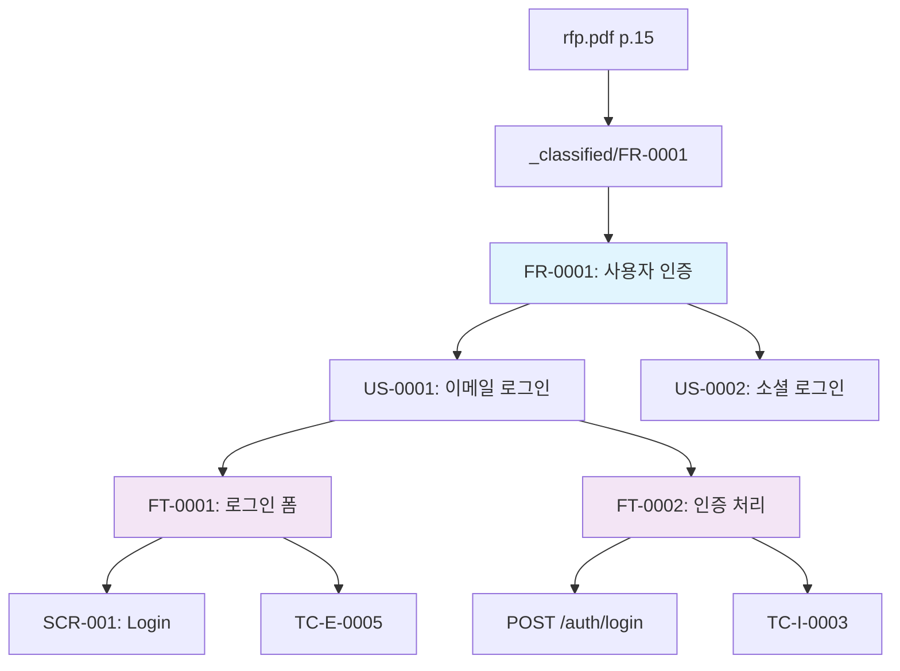

# u-trace -- Full Traceability Chain

`/u-trace [scope] [id] [--direction X] [--depth N]` 명령으로 특정 항목의 전체 추적성 체인을 조회한다. 원시 자료부터 최종 산출물까지의 계보를 표시한다.

**Primary Agent:** u-agent-guardian (engine-dep, engine-validator 사용)

---

## Arguments

| Argument | Required | Description |
|----------|----------|-------------|
| `scope` | Optional | 대상 앱 이름. 생략 시 자동 선택 |
| `id` | Required | 추적 대상 ID (FR-0001, US-003, FT-007, BL-001, SCR-010, TC-U-0023, DEF-0003, A-005 등) |

## Flags

| Flag | Description |
|------|-------------|
| `--direction X` | `up` (source 방향), `down` (derived 방향), `both` (기본) |
| `--depth N` | 추적 깊이 제한 (기본: 무제한) |
| `--format tree` | 트리 형식 출력 (기본) |
| `--format chain` | 선형 체인 형식 출력 |
| `--format mermaid` | Mermaid 다이어그램 출력 |
| `--verbose` | 각 노드의 상세 정보 포함 |

---

## Execution Flow

### Step 1: Identify Item Type

ID 패턴으로 항목 유형 자동 인식:

| ID Pattern | Type | Location |
|------------|------|----------|
| `FR-XXXX` | Functional Requirement | `srs.json` |
| `NR-XXXX` | Non-Functional Requirement | `srs.json` |
| `USR-XXXX` | User Type | `srs.json` |
| `US-XXXX` | User Story | `srs.json` |
| `FT-XXXX` | Feature | `srs.json` |
| `SCR-XXX` | Screen | `screens.json` |
| `BL-XXX` | Backlog Item | `_backlog/_index.json` |
| `TC-{T}-XXXX` | Test Case | `test-cases.json` |
| `DEF-XXXX` | Defect | `defects/` |
| `A-XXX` | Assumption | `_assumptions/_index.json` |
| `DC-XXX` | Decision | `_classified/decisions/` |
| `WF-XXX` | Workflow | `_classified/workflows/` |

### Step 2: Load Data Sources

1. `srs.json` → FR, NR, USR, US, FT 계층 + 매핑
2. `ia.json` → Screen 계층
3. `screens.json` → Screen-FT 매핑
4. `api.json` → API-Screen, API-ERD 매핑
5. `erd.json` → Entity-API 매핑
6. `rtm.json` → 전체 추적 행렬
7. `test-cases.json` → TC-FT 매핑
8. `_backlog/_index.json` → BL source 참조
9. `_classified/` → classified item source 메타데이터
10. `.u-maker/_links.json` → 문서 간 의존 관계
11. `_assumptions/_index.json` → 가정의 impact 참조

### Step 3: Trace UP (Source Direction)

주어진 ID에서 상위 항목으로 역추적:

```
추적 계보 (상향):
FT-0007
  └── US-0003 (parent)
       └── FR-0001 (parent)
            └── USR-0001 (related)
            └── _classified/requirements/FR-0001.json (source classified)
                 └── _input/rfp/main-rfp.pdf p.15 §3.2.1 (raw source)
```

**역추적 규칙:**

| From | Up To | Via |
|------|-------|-----|
| FT | US | `srs.json` parentUS |
| US | FR | `srs.json` parentFR |
| FR | USR | `srs.json` relatedUSR |
| FR | classified item | `srs.json` source.ref → `_classified/` |
| classified item | raw input | `_classified/{item}.json` source.file |
| SCR | FT | `screens.json` relatedFT → `srs.json` |
| TC | FT | `test-cases.json` relatedFT |
| DEF | TC | `defects/{def}.json` relatedTC |
| BL | source ref | `_backlog/_index.json` source.ref |
| A | impact refs | `_assumptions/_index.json` impact[] |

### Step 4: Trace DOWN (Derived Direction)

주어진 ID에서 하위 항목으로 순추적:

```
추적 계보 (하향):
FR-0001
  ├── US-0001
  │    ├── FT-0001
  │    │    ├── SCR-001 (mapped screen)
  │    │    ├── API: GET /users (mapped endpoint)
  │    │    ├── code: src/app/login/page.tsx (implementation)
  │    │    ├── TC-U-0001 (test case)
  │    │    └── TC-E-0005 (test case)
  │    └── FT-0002
  │         ├── SCR-001 (mapped screen)
  │         ├── API: POST /auth/login (mapped endpoint)
  │         ├── code: src/app/api/auth/route.ts (implementation)
  │         └── TC-I-0003 (test case)
  └── US-0002
       └── FT-0003
            ├── SCR-002 (mapped screen)
            ├── TC-U-0010 (test case)
            └── BL-023 (backlog: bug)
                 └── DEF-0003 (defect source)
```

**순추적 규칙:**

| From | Down To | Via |
|------|---------|-----|
| USR | FR | `srs.json` FR.relatedUSR |
| FR | US | `srs.json` US.parentFR |
| US | FT | `srs.json` FT.parentUS |
| FT | SCR | `screens.json` Screen.relatedFT |
| FT | API | `api.json` endpoint.relatedFT |
| FT | code | `code.json` file.relatedFT |
| FT | TC | `test-cases.json` TC.relatedFT |
| TC | DEF | `defects/` DEF.relatedTC |
| DEF | BL | `_backlog/_index.json` source.ref = DEF |

### Step 5: Assemble Full Chain

양방향(both) 추적 결과를 병합:

```
_input/rfp/main-rfp.pdf p.15 §3.2.1   ← raw source
  └── _classified/requirements/FR-0001  ← classified
       └── FR-0001: 사용자 인증          ← SRS requirement
            ├── US-0001: 이메일 로그인    ← user story
            │    ├── FT-0001: 로그인 폼 표시  ← feature
            │    │    ├── SCR-001: Login     ← screen
            │    │    ├── GET /auth/check    ← API
            │    │    ├── page.tsx           ← code
            │    │    ├── TC-E-0005: 로그인 성공 ← test
            │    │    └── TC-E-0006: 로그인 실패 ← test
            │    └── FT-0002: 인증 처리     ← feature
            │         ├── POST /auth/login  ← API
            │         ├── route.ts          ← code
            │         └── TC-I-0003: Auth API ← test
            └── US-0002: 소셜 로그인       ← user story
                 └── FT-0003: OAuth 연동   ← feature
                      └── ...
```

---

## Output Formats

### --format tree (기본)

위의 트리 형식 그대로 출력. 들여쓰기로 계층 표현.

### --format chain

선형 체인 형식:

```markdown
## Trace Chain: FT-0007

### Upstream (← source)
FT-0007 ← US-0003 ← FR-0001 ← USR-0001 ← _classified/FR-0001 ← rfp.pdf p.15

### Downstream (→ derived)
FT-0007 → SCR-010 → code: dashboard/page.tsx
FT-0007 → API: GET /dashboard/stats
FT-0007 → TC-E-0015 → DEF-0003 → BL-023
```

### --format mermaid

Mermaid 다이어그램:



### --verbose 추가 시

각 노드에 상세 정보 포함:

```markdown
### FT-0007: 대시보드 통계 표시

| Field | Value |
|-------|-------|
| **Type** | Feature |
| **Status** | Code-complete |
| **Parent US** | US-0003 |
| **Complexity** | M |
| **Story Points** | 3 |
| **Screen** | SCR-010 |
| **API** | GET /dashboard/stats |
| **Code** | src/app/dashboard/page.tsx |
| **Test Cases** | TC-E-0015, TC-U-0042 |
| **Defects** | DEF-0003 (Minor, Resolved) |
```

---

## Special Cases

### Orphan Detection

추적 중 끊어진 체인 발견 시:

```
⚠ Orphan detected: FT-0099 has no parent US
⚠ Dead end: US-0023 has no derived FT
```

### Cross-Document Trace

ID가 여러 문서에 걸쳐 참조될 때:

```
FR-0001 referenced in:
  - srs.md (definition)
  - rtm.md (row 1, 2)
  - ia.md (SCR mapping)
  - test-cases.md (via FT→TC)
  - _backlog/ (BL-001 source)
```

### Assumption Impact Trace

가정 ID 추적 시:

```
A-005: "이력 테이블 필요 여부"
  └── Impact: FR-0012, api.md, test-cases.md
       ├── FR-0012 → US-0020 → FT-0045
       ├── api.md: POST /payments/cancel
       └── test-cases.md: TC-I-0030
```

---

## Safety Rules

1. 읽기 전용 명령 (파일 수정 없음)
2. 존재하지 않는 ID 입력 시 "ID not found" 에러 + 유사 ID 제안
3. 순환 참조 탐지 시 경고 표시 + 순환 지점에서 중단
4. `--depth` 제한 없으면 전체 체인 추적 (성능 주의)
5. JSON 파일 파싱 실패 시 해당 노드 "?" 표시 + 경고
6. 여러 앱에 걸친 추적은 scope = all 일 때만 가능
7. Mermaid 출력 시 노드 50개 초과 시 depth 제한 권장 경고
8. 민감 정보(파일 경로 내 credential 등) 마스킹
