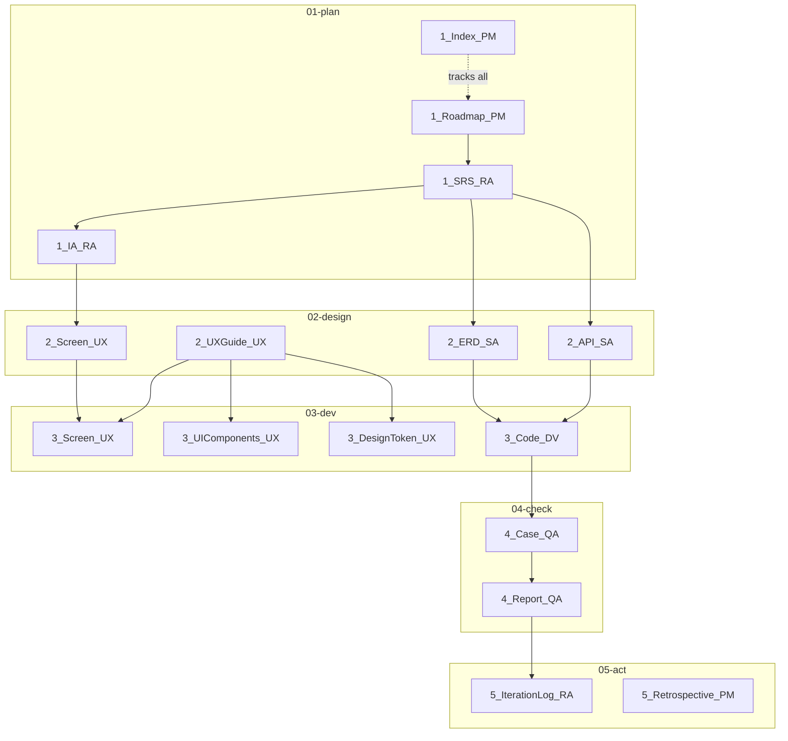
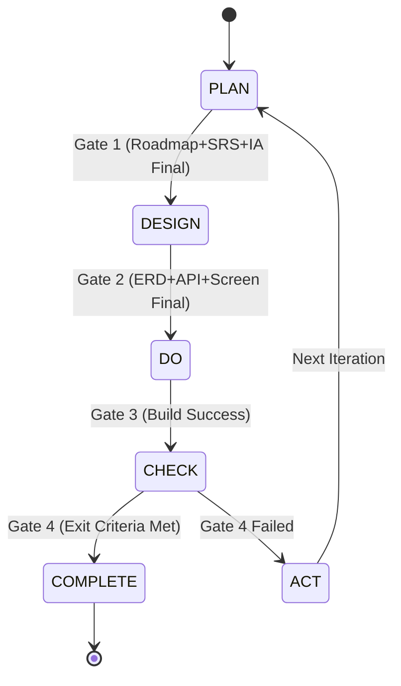

# {{PROJECT_NAME}} Document Index

## 1. Background

### 1.1 Purpose

이 문서는 프로젝트의 모든 SSoT 문서를 중앙에서 추적하고 관리하는 마스터 인덱스이다.
`u-RA` (Requirements Analyst/SSoT Guardian) 에이전트가 유지 관리한다.

### 1.2 Current State

| Key | Value |
|-----|-------|
| Project | {{PROJECT_NAME}} |
| Current Phase | PLAN |
| Current Iteration | 1 |
| Loop Status | STOPPED |
| Total Documents | 0 / 13 |
| Final Documents | 0 / 13 |

---

## 2. Document Registry

### 2.1 PLAN Phase (01-plan/)

| Doc ID | Document | Path | Owner | Status | Version | Last Updated |
|--------|----------|------|-------|--------|---------|-------------|
| 1_Roadmap_PM | Roadmap | `u-docs/01-plan/1_Roadmap_PM.md` | u-RA | Draft | v0.1.0 | {{DATE}} |
| 1_SRS_RA | SRS | `u-docs/01-plan/1_SRS_RA.md` | u-SA | - | - | - |
| 1_IA_RA | IA | `u-docs/01-plan/1_IA_RA.md` | u-UX | - | - | - |
| 1_Index_PM | Index | `u-docs/01-plan/1_Index_PM.md` | u-RA | Draft | v0.1.0 | {{DATE}} |

### 2.2 DESIGN Phase (02-design/)

| Doc ID | Document | Path | Owner | Status | Version | Last Updated |
|--------|----------|------|-------|--------|---------|-------------|
| 2_ERD_SA | ERD | `u-docs/02-design/2_ERD_SA.md` | u-SA | - | - | - |
| 2_API_SA | API Contract | `u-docs/02-design/2_API_SA.md` | u-SA | - | - | - |
| 2_Screen_UX | Screen Design | `u-docs/02-design/2_Screen_UX.md` | u-UX | - | - | - |

### 2.3 DEV Phase (03-dev/)

| Doc ID | Document | Path | Owner | Status | Version | Last Updated |
|--------|----------|------|-------|--------|---------|-------------|
| 3_Code_DV | Code Record | `u-docs/03-dev/3_Code_DV.md` | u-DV | - | - | - |

### 2.4 CHECK Phase (04-check/)

| Doc ID | Document | Path | Owner | Status | Version | Last Updated |
|--------|----------|------|-------|--------|---------|-------------|
| 4_Case_QA | Test Cases | `u-docs/04-check/4_Case_QA.md` | u-QA | - | - | - |
| 4_Report_QA | QA Report | `u-docs/04-check/4_Report_QA.md` | u-QA | - | - | - |

### 2.5 ACT Phase (05-act/)

| Doc ID | Document | Path | Owner | Status | Version | Last Updated |
|--------|----------|------|-------|--------|---------|-------------|
| 5_IterationLog_RA | Iteration Log | `u-docs/05-act/5_IterationLog_RA.md` | u-RA | - | - | - |
| 5_Retrospective_PM | Retrospective | `u-docs/05-act/5_Retrospective_PM.md` | u-RA | - | - | - |

---

## 3. Document Dependency Diagram

---

## 4. Phase Gate Status

| Gate | From → To | Conditions | Status |
|------|-----------|-----------|--------|
| Gate 1 | PLAN → DESIGN | `1_Roadmap_PM`=Final, `1_SRS_RA`=Final, `1_IA_RA`=Final + US↔FR mapping complete (no TBD) | Not Ready |
| Gate 2 | DESIGN → DO | `2_ERD_SA`=Final, `2_API_SA`=Final, `2_Screen_UX`=Final + u-RA 검수 | Not Ready |
| Gate 3 | DO → CHECK | 코드 구현 완료 + `bun run build` 성공 | Not Ready |
| Gate 4 | CHECK → Complete | Critical/Major 0건 + Backlog 0건 + 전체 FR 구현 | Not Ready |
| Gate 5 | ACT → PLAN(N+1) | Backlog 정리 + 회고 + 아카이브 완료 | Not Ready |

---

## 5. FR Implementation Tracking

| FR-ID | Feature | Menu ID | SRS | ERD | API | Screen | Code | QA | Status |
|-------|---------|---------|-----|-----|-----|--------|------|----|--------|
| FR-0010 | {{기능명}} | MN-XXX-NNNN | - | - | - | - | - | - | Planned |
| FR-0020 | {{기능명}} | MN-XXX-NNNN | - | - | - | - | - | - | Planned |

---

## 6. Iteration History

| Iteration | Start Date | End Date | Phase Reached | Result | Backlog Items |
|-----------|-----------|---------|---------------|--------|--------------|
| Iter 1 | {{DATE}} | - | PLAN | In Progress | 0 |

---

## 7. Validation Log

| Date | Validator | Type | Result | Issues |
|------|-----------|------|--------|--------|
| {{DATE}} | u-RA | Initial | - | No documents yet |

---

## Change Log

| Version | Date | Author | Description |
|---------|------|--------|-------------|
| v0.1.0 | {{DATE}} | u-RA | Initial index created |
