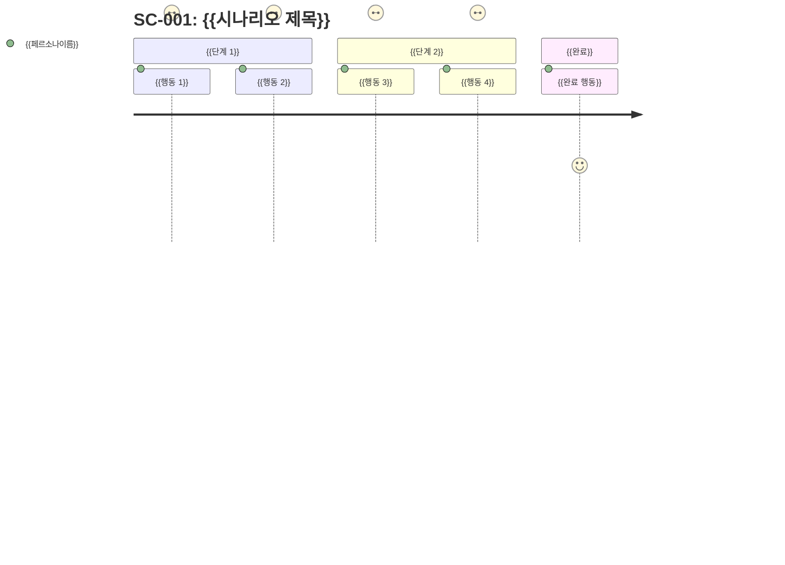
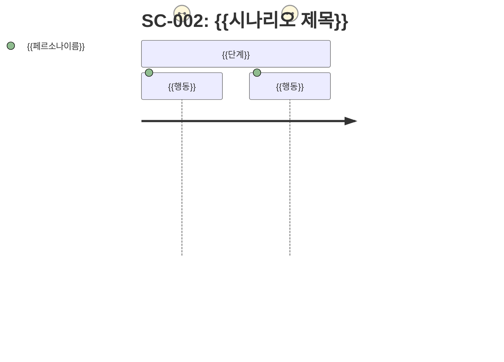
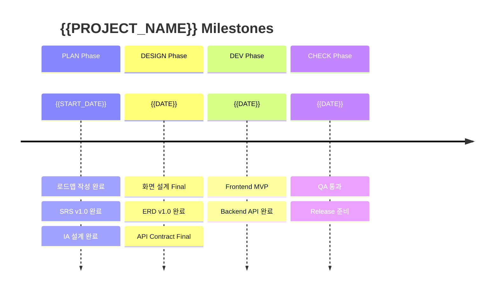
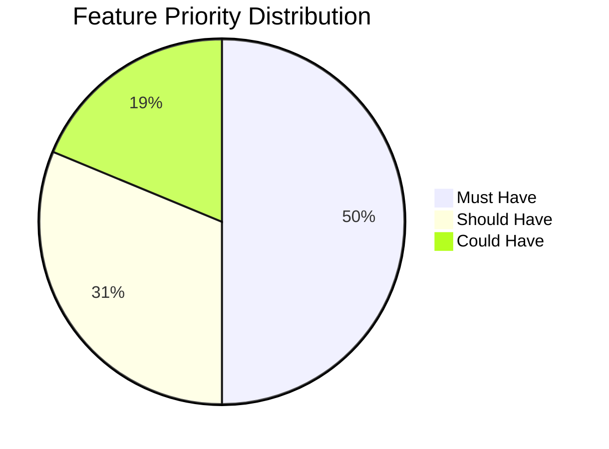

# {{PROJECT_NAME}} Roadmap

## 1. Background

### 1.1 Project Overview

{{프로젝트 배경과 목적을 서술한다.}}

### 1.2 Problem Statement

{{해결하고자 하는 문제를 정의한다.}}

### 1.3 Goals

| # | Goal | Success Metric |
|---|------|---------------|
| G-001 | {{목표}} | {{측정 기준}} |
| G-002 | {{목표}} | {{측정 기준}} |

---

## 2. Scope

### 2.1 In-Scope

- {{범위 내 항목 1}}
- {{범위 내 항목 2}}

### 2.2 Out-of-Scope

- {{범위 외 항목 1}}
- {{범위 외 항목 2}}

---

## 3. User Stories

> FR Mapping은 SRS 작성 후 갱신 가능. PLAN Gate 전 모든 US는 FR과 매핑 필수.

| US-ID | As a... | I want to... | So that... | Priority | FR Mapping |
|-------|---------|-------------|------------|----------|------------|
| US-001 | {{역할}} | {{기능}} | {{가치}} | Must | TBD |
| US-002 | {{역할}} | {{기능}} | {{가치}} | Should | TBD |
| US-003 | {{역할}} | {{기능}} | {{가치}} | Could | TBD |

---

## 4. User Scenarios

> User Story를 구체적인 페르소나·상황·단계별 행동으로 발전시킨 시나리오.
> 각 SC에서 Derived Features를 도출하여 SRS FR 작성의 기반으로 사용한다.

### SC-001: {{시나리오 제목}}

| Field | Value |
|-------|-------|
| **Persona** | {{이름}}, {{나이}}세, {{역할}}, {{배경: 기술 수준/사용 환경}} |
| **Situation** | {{현재 처한 구체적 상황 — 어떤 문제/필요가 있는지}} |
| **Goal** | {{이 시나리오에서 달성하려는 구체적 목표}} |
| **Trigger** | {{시나리오를 시작하는 계기/진입점}} |
| **Related US** | US-001 |

**Scenario Steps**:
1. {{구체적 행동 1 — 어떤 화면에서 무엇을 클릭/입력하는지}}
2. {{구체적 행동 2 — 시스템 반응 포함}}
3. {{구체적 행동 3}}
4. {{구체적 행동 4}}
5. {{완료 상태 — 사용자가 목표를 달성한 상태}}



**Derived Features**:
| Feature | Description | Priority | FR Mapping |
|---------|-------------|----------|------------|
| {{기능명}} | {{이 시나리오에서 필요한 기능 — 구체적으로}} | Must | TBD |
| {{기능명}} | {{설명}} | Must | TBD |
| {{기능명}} | {{설명}} | Should | TBD |

---

### SC-002: {{시나리오 제목}}

| Field | Value |
|-------|-------|
| **Persona** | {{이름}}, {{나이}}세, {{역할}}, {{배경}} |
| **Situation** | {{상황}} |
| **Goal** | {{목표}} |
| **Trigger** | {{계기}} |
| **Related US** | US-002 |

**Scenario Steps**:
1. {{단계 1}}
2. {{단계 2}}
3. {{단계 3}}
4. {{단계 4}}



**Derived Features**:
| Feature | Description | Priority | FR Mapping |
|---------|-------------|----------|------------|
| {{기능명}} | {{설명}} | Must | TBD |
| {{기능명}} | {{설명}} | Should | TBD |

---

## 5. Milestones

| Milestone | Target Date | Deliverables | Status |
|-----------|------------|-------------|--------|
| M1: PLAN Complete | {{날짜}} | Roadmap, SRS, IA, Index | Pending |
| M2: DESIGN Complete | {{날짜}} | Screen, ERD, API | Pending |
| M3: DEV Complete | {{날짜}} | Frontend, Backend, Code Record | Pending |
| M4: CHECK Complete | {{날짜}} | Test Cases, QA Report | Pending |
| M5: Release | {{날짜}} | Final Build | Pending |

---

## 6. Gantt Chart

```mermaid
gantt
    title {{PROJECT_NAME}} Roadmap
    dateFormat YYYY-MM-DD
    axisFormat %m/%d

    section PLAN
        Roadmap             :done, p1, {{START_DATE}}, 5d
        SRS                 :p2, after p1, 5d
        IA                  :p3, after p1, 3d
        Index               :p4, after p2, 1d

    section DESIGN
        Screen Design       :d1, after p4, 5d
        ERD                 :d2, after d1, 3d
        API Contract        :d3, after d1, 3d
        Validation          :d4, after d2, 2d

    section DEV
        Frontend            :dev1, after d4, 10d
        Backend             :dev2, after d4, 10d

    section CHECK
        Test Case Design    :t1, after dev1, 3d
        Test Execution      :t2, after t1, 5d
        Defect Analysis     :t3, after t2, 2d

    section ACT
        Backlog Review      :a1, after t3, 2d
        Retrospective       :a2, after a1, 1d
```

### 6.1 Milestone Timeline



---

## 6.2 Feature Priority Distribution



---

## 7. Stakeholders

| Role | Name | Responsibility |
|------|------|---------------|
| Product Owner | {{이름}} | 요구사항 결정, 우선순위 조정 |
| Tech Lead | {{이름}} | 기술 의사결정, 아키텍처 |
| Designer | {{이름}} | UX/UI 설계 |
| QA Lead | {{이름}} | 품질 보증, 테스트 전략 |

---

## 8. Risks

| Risk | Impact | Probability | Mitigation |
|------|--------|------------|------------|
| {{리스크}} | High/Medium/Low | High/Medium/Low | {{대응 전략}} |

---

## Change Log

| Version | Date | Author | Description |
|---------|------|--------|-------------|
| v0.1.0 | {{DATE}} | u-RA | Initial draft |
