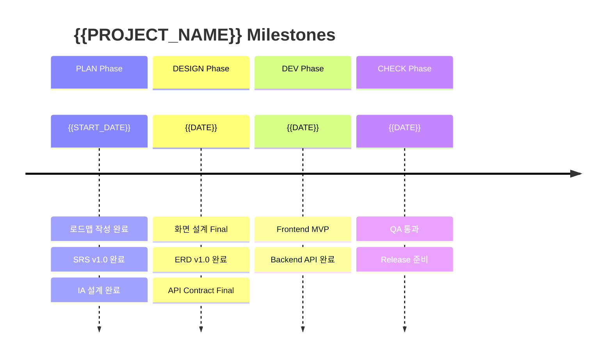
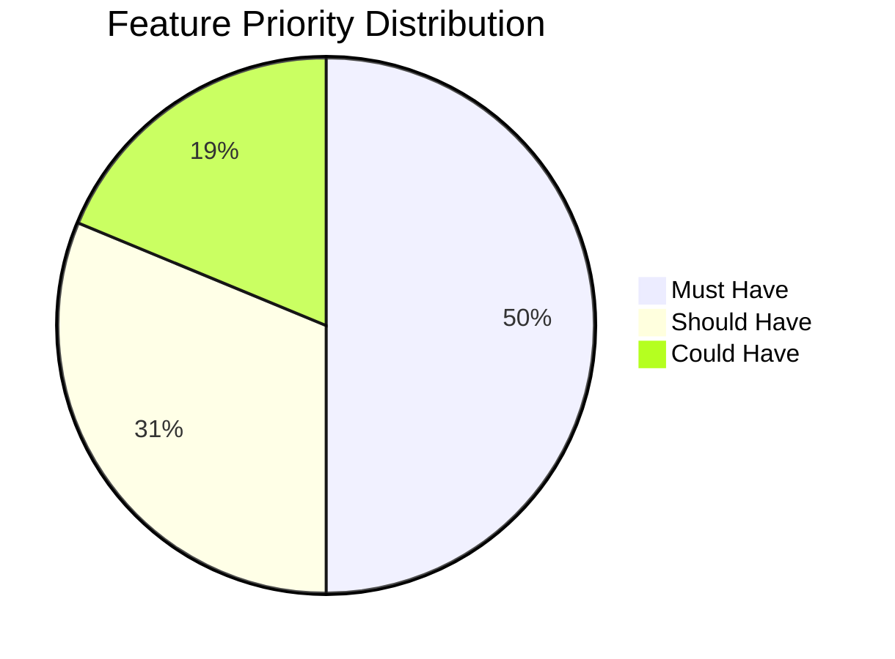

# {{PROJECT_NAME}} Roadmap

## 1. Background

### 1.1 Project Overview

{{프로젝트 배경과 목적을 서술한다.}}

### 1.2 Problem Statement

{{해결하고자 하는 문제를 정의한다.}}

### 1.3 Goals

| # | Goal | Success Metric |
|---|------|---------------|
| G-0010 | {{목표}} | {{측정 기준}} |
| G-0020 | {{목표}} | {{측정 기준}} |

---

## 2. Scope

### 2.1 In-Scope

- {{범위 내 항목 1}}
- {{범위 내 항목 2}}

### 2.2 Out-of-Scope

- {{범위 외 항목 1}}
- {{범위 외 항목 2}}

---

## 3. Milestones

| Milestone | Target Date | Deliverables | Status |
|-----------|------------|-------------|--------|
| M1: PLAN Complete | {{날짜}} | Roadmap, SRS, IA, Index | Pending |
| M2: DESIGN Complete | {{날짜}} | Screen, ERD, API | Pending |
| M3: DEV Complete | {{날짜}} | Frontend, Backend, Code Record | Pending |
| M4: CHECK Complete | {{날짜}} | Test Cases, QA Report | Pending |
| M5: Release | {{날짜}} | Final Build | Pending |

---

## 4. Gantt Chart

```mermaid
gantt
    title {{PROJECT_NAME}} Roadmap
    dateFormat YYYY-MM-DD
    axisFormat %m/%d

    section PLAN
        Roadmap             :done, p1, {{START_DATE}}, 5d
        SRS                 :p2, after p1, 5d
        IA                  :p3, after p1, 3d
        Index               :p4, after p2, 1d

    section DESIGN
        Screen Design       :d1, after p4, 5d
        ERD                 :d2, after d1, 3d
        API Contract        :d3, after d1, 3d
        Validation          :d4, after d2, 2d

    section DEV
        Frontend            :dev1, after d4, 10d
        Backend             :dev2, after d4, 10d

    section CHECK
        Test Case Design    :t1, after dev1, 3d
        Test Execution      :t2, after t1, 5d
        Defect Analysis     :t3, after t2, 2d

    section ACT
        Backlog Review      :a1, after t3, 2d
        Retrospective       :a2, after a1, 1d
```

### 4.1 Milestone Timeline



---

## 4.2 Feature Priority Distribution



---

## 5. Stakeholders

| Role | Name | Responsibility |
|------|------|---------------|
| Product Owner | {{이름}} | 요구사항 결정, 우선순위 조정 |
| Tech Lead | {{이름}} | 기술 의사결정, 아키텍처 |
| Designer | {{이름}} | UX/UI 설계 |
| QA Lead | {{이름}} | 품질 보증, 테스트 전략 |

---

## 6. Risks

| Risk | Impact | Probability | Mitigation |
|------|--------|------------|------------|
| {{리스크}} | High/Medium/Low | High/Medium/Low | {{대응 전략}} |

---

## Change Log

| Version | Date | Author | Description |
|---------|------|--------|-------------|
| v0.1.0 | {{DATE}} | u-RA | Initial draft |
