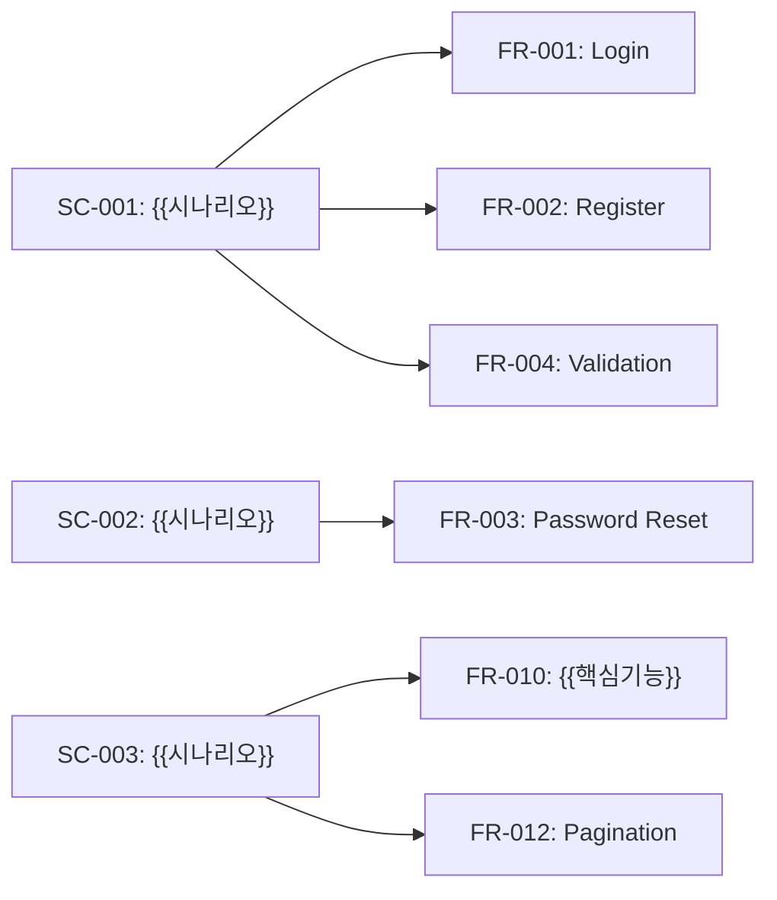
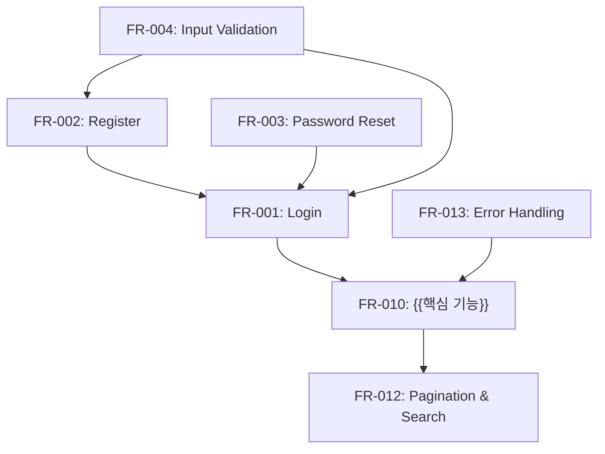
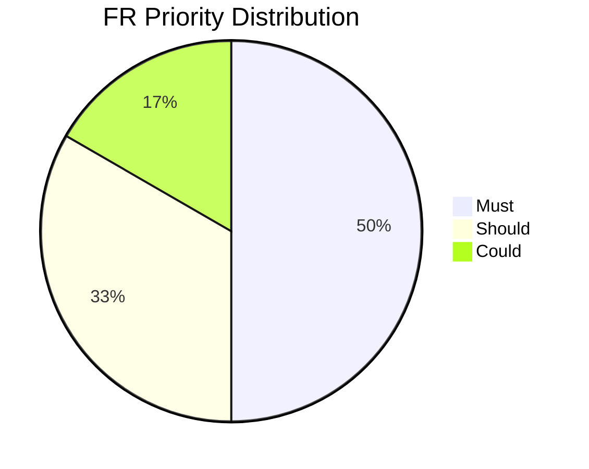

# {{PROJECT_NAME}} SRS

## 1. Background

### 1.1 Purpose

{{이 SRS 문서의 목적을 서술한다.}}

### 1.2 Scope

{{시스템 범위를 정의한다.}}

### 1.3 Definitions & Acronyms

| Term | Definition |
|------|-----------|
| {{용어}} | {{정의}} |

### 1.4 References

- `1_Roadmap_PM.md` — 프로젝트 로드맵 및 유저 스토리

---

## 1.5 Scenario Reference

> 이 SRS는 `1_Roadmap_PM.md`의 User Scenarios(SC)를 기반으로 FR을 도출한다.
> 각 SC의 Derived Features가 FR의 원천이며, FR Details의 SC Mapping 필드로 추적한다.

| SC-ID | Scenario Title | Derived FR Count | Related US |
|-------|---------------|-----------------|------------|
| SC-001 | {{시나리오 제목}} | {{FR 수}} | US-001 |
| SC-002 | {{시나리오 제목}} | {{FR 수}} | US-002 |
| SC-003 | {{시나리오 제목}} | {{FR 수}} | US-003 |



---

## 2. Functional Requirements (FR)

> US Mapping은 Roadmap 작성 후 갱신 가능. Technical FR은 `-`로 표시.
> FR은 Domain 코드별로 그룹핑하여 작성한다. 최소 15개 이상 도출 필수.

| FR-ID | Feature | Description | Priority | US Mapping | SC Mapping | Implemented |
|-------|---------|-------------|----------|------------|------------|-------------|
| **AUTH Group** | | | | | | |
| FR-001 | Login | 이메일/비밀번호로 사용자 인증 | Must | US-001 | SC-001 | No |
| FR-002 | Register | 신규 계정 생성 | Must | US-001 | SC-001 | No |
| FR-003 | Password Reset | 비밀번호 재설정 (이메일 인증) | Must | US-001 | SC-002 | No |
| FR-004 | Input Validation | 이메일 형식, 비밀번호 강도 검증 | Must | - | SC-001, SC-002 | No |
| **CORE Group** | | | | | | |
| FR-010 | {{핵심 기능명}} | {{상세 설명}} | Must | US-002 | SC-003 | No |
| FR-011 | {{핵심 기능명}} | {{상세 설명}} | Must | US-002 | SC-003 | No |
| FR-012 | Pagination & Search | 목록 페이지네이션, 키워드 검색, 필터 | Should | US-002 | SC-003 | No |
| FR-013 | Error Handling | 네트워크/서버/권한 오류 처리 및 메시지 표시 | Must | - | SC-001, SC-002, SC-003 | No |
| **ADMIN Group** | | | | | | |
| FR-020 | {{관리 기능명}} | {{상세 설명}} | Should | US-003 | SC-004 | No |
| FR-021 | Audit Log | 주요 데이터 생성/수정/삭제 이력 추적 | Could | - | - | No |

### FR Details

### AUTH Group

#### FR-001: Login

- **Description**: 이메일과 비밀번호를 입력받아 사용자를 인증하고 JWT 토큰을 발급한다.
- **SC Mapping**: SC-001
- **Input**: email (string, required), password (string, required)
- **Output**: JWT access token, user profile (id, email, name, role)
- **Business Rule**: 5회 연속 실패 시 계정 잠금 (30분). 비밀번호는 bcrypt 해싱 후 비교.
- **Exception**: 이메일 미존재 → 401. 비밀번호 불일치 → 401. 계정 잠금 → 423.

#### FR-002: Register

- **Description**: 신규 사용자 계정을 생성한다. 이메일 중복 검사 후 비밀번호를 암호화하여 저장한다.
- **SC Mapping**: SC-001
- **Input**: email (string, required, unique), password (string, required, min 8자), name (string, required)
- **Output**: 생성된 사용자 정보 (id, email, name), 자동 로그인 JWT 토큰
- **Business Rule**: 이메일은 RFC 5321 형식 준수. 비밀번호는 8자 이상, 대/소문자+숫자 포함.
- **Exception**: 중복 이메일 → 409 Conflict. 형식 오류 → 400 Validation Error.

#### FR-003: Password Reset

- **Description**: 등록된 이메일로 비밀번호 재설정 링크를 발송하고, 토큰 검증 후 비밀번호를 변경한다.
- **SC Mapping**: SC-002
- **Input**: email (string, required) → reset token (UUID, 1시간 유효) → new password (string, required)
- **Output**: 이메일 발송 확인 메시지, 비밀번호 변경 성공 응답
- **Business Rule**: 재설정 토큰은 1회 사용 후 무효화. 만료 시간 1시간.
- **Exception**: 미등록 이메일 → 200 (보안상 동일 응답). 토큰 만료 → 410 Gone.

#### FR-004: Input Validation

- **Description**: 모든 사용자 입력에 대해 형식, 길이, 필수 여부를 검증하고 필드별 에러 메시지를 표시한다.
- **SC Mapping**: SC-001, SC-002
- **Input**: 폼 필드 입력값 (이메일, 비밀번호, 이름 등)
- **Output**: 유효성 검증 결과 (성공/실패), 실패 시 필드별 에러 메시지
- **Business Rule**: 클라이언트/서버 양측 검증 필수. 에러는 필드 아래 표시.
- **Exception**: 빈 필드 → "필수 입력 항목입니다". 형식 오류 → "올바른 형식으로 입력하세요".

### CORE Group

#### FR-010: {{핵심 기능명}}

- **Description**: {{상세 설명}}
- **SC Mapping**: SC-003
- **Input**: {{입력 데이터/조건}}
- **Output**: {{출력 결과}}
- **Business Rule**: {{비즈니스 규칙}}
- **Exception**: {{예외 케이스}}

#### FR-011: {{핵심 기능명}}

- **Description**: {{상세 설명}}
- **SC Mapping**: SC-003
- **Input**: {{입력 데이터/조건}}
- **Output**: {{출력 결과}}
- **Business Rule**: {{비즈니스 규칙}}
- **Exception**: {{예외 케이스}}

#### FR-012: Pagination & Search

- **Description**: 목록 데이터를 페이지 단위로 로드하고, 키워드 검색과 필터 조건을 지원한다.
- **SC Mapping**: SC-003
- **Input**: page (number, default 1), limit (number, default 20), keyword (string, optional), filter params
- **Output**: 데이터 배열, pagination 메타 (total, totalPages, currentPage)
- **Business Rule**: limit 최대값 100. 검색어 최소 2자 이상. 필터는 AND 조건 적용.
- **Exception**: 범위 초과 page → 빈 배열 반환. 검색어 1자 → 400 Bad Request.

#### FR-013: Error Handling

- **Description**: 네트워크 오류, 서버 오류, 권한 오류 발생 시 사용자에게 적절한 메시지를 표시한다.
- **SC Mapping**: SC-001, SC-002, SC-003
- **Input**: API 응답 에러 코드 (4xx, 5xx)
- **Output**: 사용자 친화적 에러 메시지, 재시도 또는 대안 행동 안내
- **Business Rule**: 401 → 로그인 페이지 리다이렉트. 403 → 권한 없음 메시지. 500 → "잠시 후 다시 시도해주세요".
- **Exception**: 오프라인 상태 → "인터넷 연결을 확인해주세요". Timeout → "요청 시간이 초과되었습니다".

### ADMIN Group

#### FR-020: {{관리 기능명}}

- **Description**: {{상세 설명}}
- **SC Mapping**: SC-004
- **Input**: {{입력 데이터/조건}}
- **Output**: {{출력 결과}}
- **Business Rule**: {{비즈니스 규칙}}
- **Exception**: {{예외 케이스}}

#### FR-021: Audit Log

- **Description**: 주요 데이터(생성, 수정, 삭제)에 대한 이력을 자동으로 추적하고 저장한다.
- **SC Mapping**: {{SC-ID}}
- **Input**: 데이터 변경 이벤트 (entity, action, actor, before/after)
- **Output**: 감사 로그 레코드 (timestamp, user_id, action, target_entity, target_id)
- **Business Rule**: 삭제 이력은 90일 보관. 관리자만 조회 가능.
- **Exception**: 로그 저장 실패는 트랜잭션에 영향 없이 별도 처리.

---

## 3. Non-Functional Requirements (NFR)

| NFR-ID | Category | Requirement | Target | Priority |
|--------|----------|-------------|--------|----------|
| NFR-001 | Performance | API 응답 시간 | P95 < 300ms | Must |
| NFR-002 | Performance | 페이지 초기 로딩 시간 | LCP < 2.5s | Must |
| NFR-003 | Security | 비밀번호 암호화 | bcrypt rounds ≥ 10 | Must |
| NFR-004 | Security | HTTPS 강제 적용 | 모든 엔드포인트 TLS 1.2+ | Must |
| NFR-005 | Security | JWT 토큰 만료 | Access 1h, Refresh 7d | Must |
| NFR-006 | Usability | 반응형 지원 | Mobile (360px) ~ Desktop (1920px) | Should |
| NFR-007 | Usability | 접근성 | WCAG 2.1 AA 수준 | Should |
| NFR-008 | Reliability | 서비스 가용성 | 99.9% Uptime | Should |
| NFR-009 | Reliability | 에러 복구 | 자동 재시도 3회, Fallback UI 표시 | Should |
| NFR-010 | Scalability | 동시 접속자 | 최소 1,000 동시 사용자 지원 | Could |

---

## 4. Feature Dependency



---

## 4.5 FR Priority Distribution



---

## 5. Gantt (Feature Timeline)

```mermaid
gantt
    title Feature Implementation Timeline
    dateFormat YYYY-MM-DD

    section Core
        FR-001 {{기능명}}  :f1, {{START_DATE}}, 5d
        FR-002 {{기능명}}  :f2, after f1, 5d

    section Extended
        FR-003 {{기능명}}  :f3, after f2, 3d
        FR-004 {{기능명}}  :f4, after f2, 3d
```

---

## 6. Acceptance Criteria Summary

| FR-ID | Acceptance Criteria |
|-------|-------------------|
| FR-001 | {{인수 조건 1}}, {{인수 조건 2}} |
| FR-002 | {{인수 조건 1}}, {{인수 조건 2}} |

---

## Change Log

| Version | Date | Author | Description |
|---------|------|--------|-------------|
| v0.1.0 | {{DATE}} | u-SA | Initial draft |
