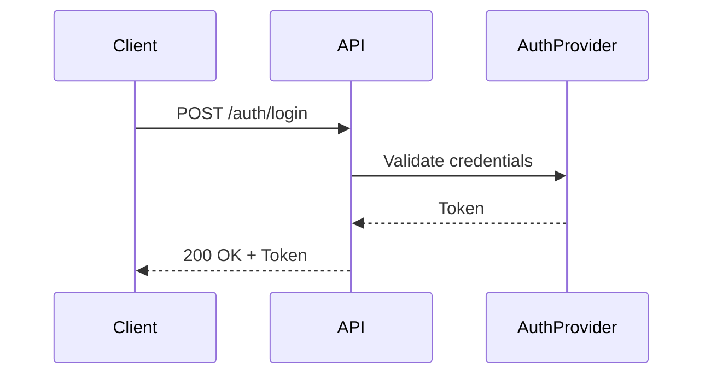
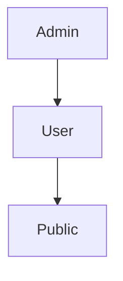
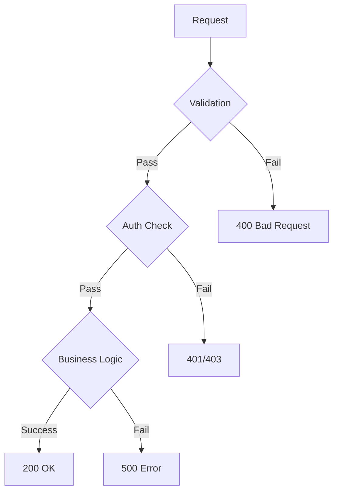

# {{PROJECT_NAME}} Common Design

## 1. Authentication Policy

### 1.1 Authentication Methods

| Method | Description | Use Case |
|--------|-------------|----------|
| {{인증 방식}} | {{설명}} | {{사용 사례}} |

### 1.2 Token Management

| Item | Value |
|------|-------|
| Token Type | {{JWT / Session / etc.}} |
| Access Token TTL | {{e.g., 15min}} |
| Refresh Token TTL | {{e.g., 7d}} |
| Storage | {{e.g., httpOnly cookie}} |

### 1.3 Authentication Flow



---

## 2. RBAC Policy (Role-Based Access Control)

### 2.1 Role Definitions

| Role | Description | Access Level |
|------|-------------|-------------|
| {{역할명}} | {{역할 설명}} | {{접근 수준}} |

### 2.2 Permission Matrix

| Resource | Public | User | Admin |
|----------|--------|------|-------|
| {{리소스}} | {{R/W/N}} | {{R/W/N}} | {{R/W/N}} |

> R = Read, W = Write, N = No Access

### 2.3 Role Hierarchy



---

## 3. Security Policy

### 3.1 Input Validation

| Rule | Description |
|------|-------------|
| XSS Prevention | {{HTML 이스케이핑, CSP 정책}} |
| SQL Injection | {{ORM 사용, Parameterized Query}} |
| CSRF | {{CSRF 토큰, SameSite Cookie}} |

### 3.2 Data Protection

| Item | Policy |
|------|--------|
| Password Hashing | {{e.g., bcrypt, argon2}} |
| Sensitive Data Encryption | {{e.g., AES-256}} |
| PII Handling | {{개인정보 처리 방침}} |

### 3.3 API Security

| Item | Policy |
|------|--------|
| Rate Limiting | {{e.g., 100 req/min per IP}} |
| CORS | {{허용 Origin 목록}} |
| HTTPS | {{필수 여부}} |

---

## 4. Common Business Rules

### 4.1 Business Rule Registry

| ID | Rule | Description | Scope |
|----|------|-------------|-------|
| BR-0010 | {{규칙명}} | {{규칙 설명}} | {{적용 범위}} |

### 4.2 Validation Rules

| Field Pattern | Rule | Error Message |
|--------------|------|---------------|
| Email | {{RFC 5322 형식}} | {{에러 메시지}} |
| Password | {{최소 8자, 대소문자+숫자+특수문자}} | {{에러 메시지}} |
| Phone | {{국가 코드 포함 E.164}} | {{에러 메시지}} |

---

## 5. Error Handling Standard

### 5.1 Error Response Format

```json
{
  "error": {
    "code": "ERR_AUTH_001",
    "message": "Human-readable message",
    "details": {}
  }
}
```

### 5.2 Error Code Registry

| Code | HTTP Status | Description | Action |
|------|------------|-------------|--------|
| ERR_AUTH_001 | 401 | {{인증 실패}} | {{재로그인 유도}} |
| ERR_AUTH_002 | 403 | {{권한 없음}} | {{권한 요청 안내}} |
| ERR_VALID_001 | 400 | {{입력값 유효성 실패}} | {{필드별 에러 표시}} |
| ERR_SERVER_001 | 500 | {{서버 내부 오류}} | {{재시도 안내}} |

### 5.3 Error Handling Flow



---

## 6. Glossary

| Term | Definition |
|------|-----------|
| {{용어}} | {{정의}} |

---

## Change Log

| Version | Date | Author | Changes |
|---------|------|--------|---------|
| v0.1.0 | {{DATE}} | u-RA | Initial creation |
