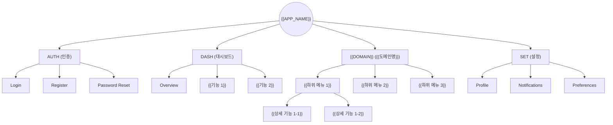
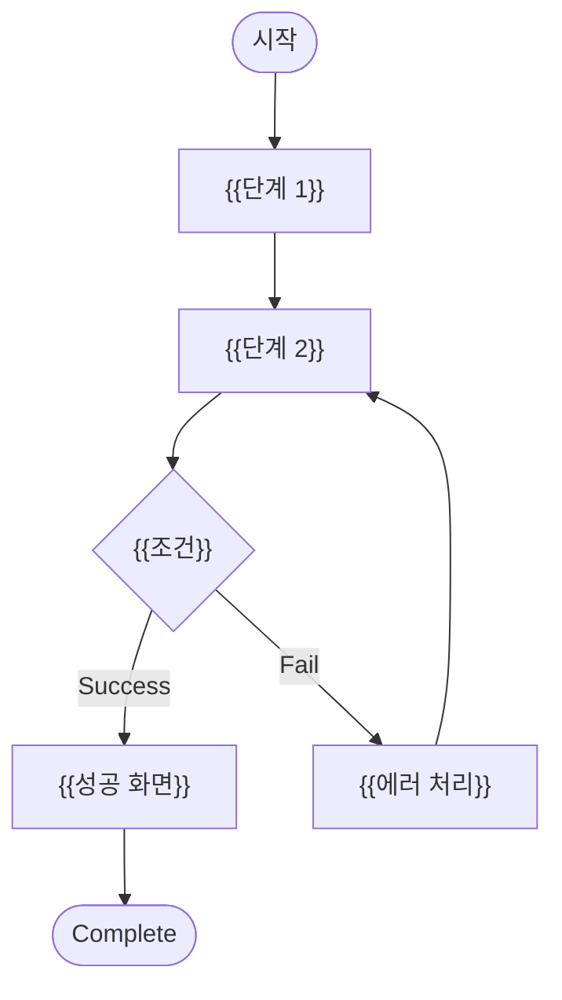
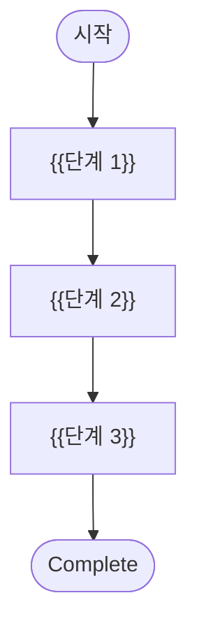

# {{PROJECT_NAME}} Information Architecture — {{APP_NAME}}

## 1. Background

### 1.1 Purpose

{{IA 문서의 목적을 서술한다. 사용자 관점의 정보 구조와 네비게이션 체계를 정의한다.}}

### 1.2 Target Users

| User Type | Description | Primary Goals |
|-----------|-------------|--------------|
| {{사용자 유형 1}} | {{설명}} | {{주요 목표}} |
| {{사용자 유형 2}} | {{설명}} | {{주요 목표}} |

---

## 2. Domain Registry

> MN(Menu Navigation) 도메인 코드를 정의한다. Menu ID의 DOMAIN 부분에 사용된다.

| Domain Code | Domain Name | Description |
|-------------|-------------|-------------|
| AUTH | Authentication | 로그인, 회원가입, 비밀번호 |
| DASH | Dashboard | 대시보드, 개요, 분석 |
| {{DOMAIN}} | {{도메인명}} | {{설명}} |
| SET | Settings | 설정, 프로필, 알림 |

### 2.1 Domain Code Rules

- 대문자 영문 2-5자
- 프로젝트 내 유일해야 함
- 약어 사용 권장 (AUTH, DASH, SET, PROD, USR 등)

---

## 3. Menu Tree

### 3.1 Menu Tree Diagram

> **규칙**: Menu Tree는 Mermaid `flowchart TD`로 작성한다. `mindmap` 사용 금지.



### 3.2 Menu Tree Table

| Menu ID | Menu Name | Path | Depth | Parent MN-ID | Screen ID | Icon | Auth | Order | Visible | FT Mapping |
|---------|-----------|------|-------|-------------|-----------|------|------|-------|---------|------------|
| MN-AUTH-0010 | Login | `/auth/login` | 1 | - | S-0010 | LogIn | No | 1 | Conditional | - |
| MN-AUTH-0020 | Register | `/auth/register` | 1 | - | S-0020 | UserPlus | No | 2 | Conditional | - |
| MN-DASH-0010 | Dashboard | `/dashboard` | 1 | - | S-0030 | LayoutDashboard | Yes | 1 | Always | FT-0010 |
| MN-{{DOMAIN}}-0010 | {{메뉴명}} | `/{{path}}` | 1 | - | S-0040 | {{아이콘}} | Yes | 2 | Always | FT-0020 |
| MN-{{DOMAIN}}-0020 | {{하위 메뉴}} | `/{{path}}/{{sub}}` | 2 | MN-{{DOMAIN}}-0010 | S-0050 | {{아이콘}} | Yes | 1 | Always | FT-0030 |
| MN-SET-0010 | Settings | `/settings` | 1 | - | S-0060 | Settings | Yes | 99 | Always | - |
| MN-SET-0020 | Profile | `/settings/profile` | 2 | MN-SET-0010 | S-0070 | User | Yes | 1 | Always | - |

### 3.3 Menu ID Rules

- **Format**: `MN-{DOMAIN}-{NNNN}`
- **DOMAIN**: Domain Registry(§2)에 등록된 코드 (대문자 2-5자)
- **NNNN**: 도메인 내 순번 (4자리, 0010부터, 10단위 증가)
- **Menu → Screen**: 1:1 관계. 모든 메뉴는 정확히 하나의 Screen에 매핑
- **비메뉴 화면**: Modal, Drawer, Error 등은 Menu ID 없이 Screen ID만 부여

---

## 4. Navigation Flow

```mermaid
flowchart LR
    HOME[Home] --> AUTH{Logged in?}
    AUTH -->|Yes| DASH[Dashboard]
    AUTH -->|No| LOGIN[Login]
    LOGIN --> DASH
    DASH --> MENU1[{{메뉴 1}}]
    DASH --> MENU2[{{메뉴 2}}]
    DASH --> SETTINGS[Settings]
    MENU1 --> SUB1[{{하위 1-1}}]
    MENU1 --> SUB2[{{하위 1-2}}]
```

---

## 5. Screen Inventory

| Screen ID | Screen Name | Path | Access Type | Menu ID | Parent Screen | FT Mapping | Priority |
|-----------|------------|------|-------------|---------|---------------|------------|----------|
| S-0010 | Login | `/auth/login` | Menu | MN-AUTH-0010 | - | - | Must |
| S-0020 | Register | `/auth/register` | Menu | MN-AUTH-0020 | - | - | Must |
| S-0030 | Dashboard | `/dashboard` | Menu | MN-DASH-0010 | - | FT-0010 | Must |
| S-0040 | {{화면명}} | `/{{path}}` | Menu | MN-{{DOMAIN}}-0010 | Dashboard | FT-0020 | Must |
| S-0050 | {{화면명}} | `/{{path}}/{{sub}}` | Menu | MN-{{DOMAIN}}-0020 | S-0040 | FT-0030 | Should |
| S-0060 | Settings | `/settings` | Menu | MN-SET-0010 | - | - | Must |
| S-0070 | Profile | `/settings/profile` | Menu | MN-SET-0020 | Settings | - | Must |
| S-0080 | {{모달/Drawer}} | - | Modal | - | S-0040 | FT-0040 | Should |
| S-0090 | Error 404 | `/404` | Error | - | - | - | Must |

### 5.1 Access Type Guide

| Access Type | Description | Menu ID |
|-------------|-------------|---------|
| Menu | 네비게이션 메뉴로 접근 가능 | 필수 (MN-XXX-NNNN) |
| Direct | URL 직접 접근만 가능 | 선택 |
| Modal | 모달 다이얼로그 | - (없음) |
| Drawer | 사이드 드로어 | - (없음) |
| Sub-route | 부모 화면의 하위 라우트 | 선택 |
| Error | 에러 페이지 | - (없음) |

---

## 6. User Flows

> User Story(US-NNNN) 기반으로 작성한다. 각 플로우는 flowchart(분기 로직)로 표현한다.

### 6.1 {{US-0010: 주요 플로우 1}}



### 6.2 {{US-0020: 주요 플로우 2}}



---

## 7. Content Model

| Content Type | Fields | Source | Display Screen |
|-------------|--------|--------|---------------|
| {{컨텐츠 유형 1}} | {{필드 목록}} | {{데이터 소스}} | S-0030, S-0040 |
| {{컨텐츠 유형 2}} | {{필드 목록}} | {{데이터 소스}} | S-0040, S-0050 |

---

## 8. Scope

### 8.1 In-Scope

- {{범위 내 항목}}

### 8.2 Out-of-Scope

- {{범위 외 항목}}

---

## Change Log

| Version | Date | Author | Description |
|---------|------|--------|-------------|
| v0.1.0 | {{DATE}} | u-UX | Initial draft |
