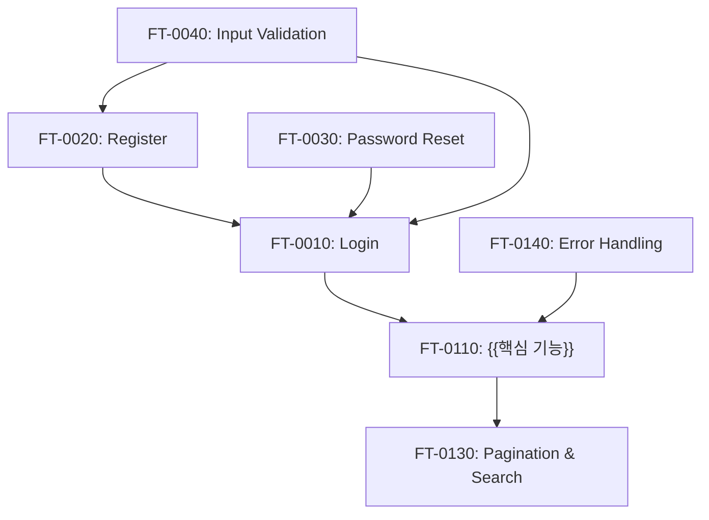
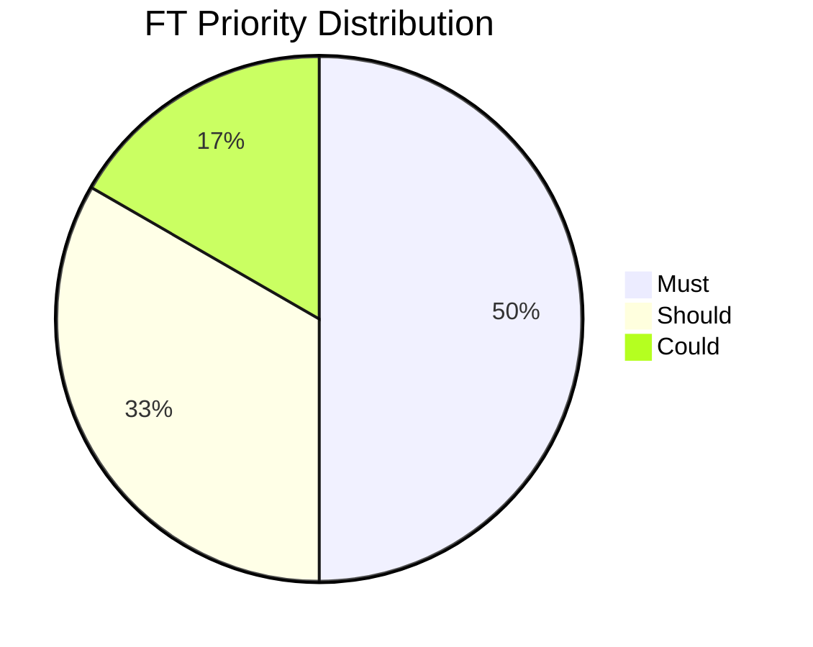

# {{PROJECT_NAME}} SRS

> 작성 순서 규칙: **Requirements(FR) → User Stories(US) → Features(FT)**.

## 1. Background

### 1.1 Purpose

{{이 SRS 문서의 목적을 서술한다.}}

### 1.2 Scope

{{시스템 범위를 정의한다.}}

### 1.3 Definitions & Acronyms

| Term | Definition |
|------|-----------|
| {{용어}} | {{정의}} |

### 1.4 References

- `1_Roadmap_PM.md` — 프로젝트 로드맵

---

## 2. Functional Requirements (FR)

> SRS의 기준 체인은 `Requirements(FR) → User Stories(US) → Features(FT)`를 따른다.
> PLAN Gate 전 모든 FR은 USR와 매핑 필수. Technical FR은 USR Mapping을 `-`로 표시 가능.

| FR-ID | Requirement | Description | Priority | USR Mapping | Implemented |
|-------|-------------|-------------|----------|-------------|-------------|
| **AUTH Group** | | | | | |
| <a id="fr-0010"></a>FR-0010 | 사용자 인증 처리 | 이메일/비밀번호 검증 후 JWT 발급 | Must | [USR-0010](#usr-0010) | No |
| <a id="fr-0020"></a>FR-0020 | 계정 생성 처리 | 이메일 중복 검사 + 비밀번호 암호화 저장 | Must | [USR-0010](#usr-0010) | No |
| <a id="fr-0030"></a>FR-0030 | 비밀번호 재설정 처리 | 이메일 인증 토큰 발송 + 토큰 검증 후 변경 | Must | [USR-0010](#usr-0010) | No |
| <a id="fr-0040"></a>FR-0040 | 입력 유효성 검증 | 클라이언트/서버 양측 형식·길이·필수 검증 | Must | - | No |
| **CORE Group** | | | | | |
| <a id="fr-0110"></a>FR-0110 | {{요구사항명}} | {{상세 설명}} | Must | [USR-0010](#usr-0010) | No |
| <a id="fr-0120"></a>FR-0120 | {{요구사항명}} | {{상세 설명}} | Must | [USR-0010](#usr-0010) | No |
| <a id="fr-0130"></a>FR-0130 | 페이지네이션·검색 처리 | 페이지 단위 로드 + 키워드 검색 + 필터 | Should | [USR-0010](#usr-0010) | No |
| <a id="fr-0140"></a>FR-0140 | 에러 핸들링 처리 | 네트워크/서버/권한 오류별 메시지 표시 | Must | - | No |
| **ADMIN Group** | | | | | |
| <a id="fr-0210"></a>FR-0210 | {{요구사항명}} | {{상세 설명}} | Should | [USR-0020](#usr-0020) | No |
| <a id="fr-0220"></a>FR-0220 | 감사 로그 처리 | 데이터 CRUD 이력 자동 추적·저장 | Could | - | No |

### FR Details

### AUTH Group

#### FR-0010: 사용자 인증 처리 (USR-0010)

- **Description**: 이메일과 비밀번호를 입력받아 사용자를 인증하고 JWT 토큰을 발급한다.
- **Input**: email (string, required), password (string, required)
- **Output**: JWT access token, user profile (id, email, name, role)
- **Business Rule**: 5회 연속 실패 시 계정 잠금 (30분). 비밀번호는 bcrypt 해싱 후 비교.
- **Exception**: 이메일 미존재 → 401. 비밀번호 불일치 → 401. 계정 잠금 → 423.

#### FR-0020: 계정 생성 처리 (USR-0010)

- **Description**: 신규 사용자 계정을 생성한다. 이메일 중복 검사 후 비밀번호를 암호화하여 저장한다.
- **Input**: email (string, required, unique), password (string, required, min 8자), name (string, required)
- **Output**: 생성된 사용자 정보 (id, email, name), 자동 로그인 JWT 토큰
- **Business Rule**: 이메일은 RFC 5321 형식 준수. 비밀번호는 8자 이상, 대/소문자+숫자 포함.
- **Exception**: 중복 이메일 → 409 Conflict. 형식 오류 → 400 Validation Error.

#### FR-0030: 비밀번호 재설정 처리 (USR-0010)

- **Description**: 등록된 이메일로 비밀번호 재설정 링크를 발송하고, 토큰 검증 후 비밀번호를 변경한다.
- **Input**: email (string, required) → reset token (UUID, 1시간 유효) → new password (string, required)
- **Output**: 이메일 발송 확인 메시지, 비밀번호 변경 성공 응답
- **Business Rule**: 재설정 토큰은 1회 사용 후 무효화. 만료 시간 1시간.
- **Exception**: 미등록 이메일 → 200 (보안상 동일 응답). 토큰 만료 → 410 Gone.

#### FR-0040: 입력 유효성 검증 (Technical FR)

- **Description**: 모든 사용자 입력에 대해 형식, 길이, 필수 여부를 검증하고 필드별 에러 메시지를 표시한다.
- **Input**: 폼 필드 입력값 (이메일, 비밀번호, 이름 등)
- **Output**: 유효성 검증 결과 (성공/실패), 실패 시 필드별 에러 메시지
- **Business Rule**: 클라이언트/서버 양측 검증 필수. 에러는 필드 아래 표시.
- **Exception**: 빈 필드 → "필수 입력 항목입니다". 형식 오류 → "올바른 형식으로 입력하세요".

### CORE Group

#### FR-0110: {{요구사항명}} (USR-0010)

- **Description**: {{상세 설명}}
- **Input**: {{입력 데이터/조건}}
- **Output**: {{출력 결과}}
- **Business Rule**: {{비즈니스 규칙}}
- **Exception**: {{예외 케이스}}

#### FR-0120: {{요구사항명}} (USR-0010)

- **Description**: {{상세 설명}}
- **Input**: {{입력 데이터/조건}}
- **Output**: {{출력 결과}}
- **Business Rule**: {{비즈니스 규칙}}
- **Exception**: {{예외 케이스}}

#### FR-0130: 페이지네이션·검색 처리 (USR-0010)

- **Description**: 목록 데이터를 페이지 단위로 로드하고, 키워드 검색과 필터 조건을 지원한다.
- **Input**: page (number, default 1), limit (number, default 20), keyword (string, optional), filter params
- **Output**: 데이터 배열, pagination 메타 (total, totalPages, currentPage)
- **Business Rule**: limit 최대값 100. 검색어 최소 2자 이상. 필터는 AND 조건 적용.
- **Exception**: 범위 초과 page → 빈 배열 반환. 검색어 1자 → 400 Bad Request.

#### FR-0140: 에러 핸들링 처리 (Technical FR)

- **Description**: 네트워크 오류, 서버 오류, 권한 오류 발생 시 사용자에게 적절한 메시지를 표시한다.
- **Input**: API 응답 에러 코드 (4xx, 5xx)
- **Output**: 사용자 친화적 에러 메시지, 재시도 또는 대안 행동 안내
- **Business Rule**: 401 → 로그인 페이지 리다이렉트. 403 → 권한 없음 메시지. 500 → "잠시 후 다시 시도해주세요".
- **Exception**: 오프라인 상태 → "인터넷 연결을 확인해주세요". Timeout → "요청 시간이 초과되었습니다".

### ADMIN Group

#### FR-0210: {{요구사항명}} (USR-0020)

- **Description**: {{상세 설명}}
- **Input**: {{입력 데이터/조건}}
- **Output**: {{출력 결과}}
- **Business Rule**: {{비즈니스 규칙}}
- **Exception**: {{예외 케이스}}

#### FR-0220: 감사 로그 처리 (Technical FR)

- **Description**: 주요 데이터(생성, 수정, 삭제)에 대한 이력을 자동으로 추적하고 저장한다.
- **Input**: 데이터 변경 이벤트 (entity, action, actor, before/after)
- **Output**: 감사 로그 레코드 (timestamp, user_id, action, target_entity, target_id)
- **Business Rule**: 삭제 이력은 90일 보관. 관리자만 조회 가능.
- **Exception**: 로그 저장 실패는 트랜잭션에 영향 없이 별도 처리.

---

## 3. Non-Functional Requirements (NFR)

| NFR-ID | Category | Requirement | Target | Priority |
|--------|----------|-------------|--------|----------|
| <a id="nfr-0010"></a>NFR-0010 | Performance | API 응답 시간 | P95 < 300ms | Must |
| <a id="nfr-0020"></a>NFR-0020 | Performance | 페이지 초기 로딩 시간 | LCP < 2.5s | Must |
| <a id="nfr-0030"></a>NFR-0030 | Security | 비밀번호 암호화 | bcrypt rounds ≥ 10 | Must |
| <a id="nfr-0040"></a>NFR-0040 | Security | HTTPS 강제 적용 | 모든 엔드포인트 TLS 1.2+ | Must |
| <a id="nfr-0050"></a>NFR-0050 | Security | JWT 토큰 만료 | Access 1h, Refresh 7d | Must |
| <a id="nfr-0060"></a>NFR-0060 | Usability | 반응형 지원 | Mobile (360px) ~ Desktop (1920px) | Should |
| <a id="nfr-0070"></a>NFR-0070 | Usability | 접근성 | WCAG 2.1 AA 수준 | Should |
| <a id="nfr-0080"></a>NFR-0080 | Reliability | 서비스 가용성 | 99.9% Uptime | Should |
| <a id="nfr-0090"></a>NFR-0090 | Reliability | 에러 복구 | 자동 재시도 3회, Fallback UI 표시 | Should |
| <a id="nfr-0100"></a>NFR-0100 | Scalability | 동시 접속자 | 최소 1,000 동시 사용자 지원 | Could |

---

## 4. Users (USR)

> 시스템을 사용하는 사용자 유형(역할)을 정의한다.

| USR-ID | Role | Description | Priority |
|--------|------|-------------|----------|
| <a id="usr-0010"></a>USR-0010 | {{역할명}} | {{역할 설명}} | Must |
| <a id="usr-0020"></a>USR-0020 | {{역할명}} | {{역할 설명}} | Should |
| <a id="usr-0030"></a>USR-0030 | {{역할명}} | {{역할 설명}} | Could |

---

## 5. User Stories (US)

> 모든 US는 USR 및 FR과 매핑 필수. FT Mapping은 Feature 도출 후 갱신 가능.

| US-ID | USR Mapping | As a... | I want to... | So that... | Priority | FR Mapping | FT Mapping |
|-------|-------------|---------|-------------|------------|----------|------------|------------|
| <a id="us-0010"></a>US-0010 | [USR-0010](#usr-0010) | {{역할}} | {{원하는 동작}} | {{가치}} | Must | [FR-0010](#fr-0010), [FR-0020](#fr-0020), [FR-0030](#fr-0030) | TBD |
| <a id="us-0020"></a>US-0020 | [USR-0010](#usr-0010) | {{역할}} | {{원하는 동작}} | {{가치}} | Should | [FR-0110](#fr-0110), [FR-0120](#fr-0120), [FR-0130](#fr-0130) | TBD |
| <a id="us-0030"></a>US-0030 | [USR-0020](#usr-0020) | {{역할}} | {{원하는 동작}} | {{가치}} | Could | [FR-0210](#fr-0210) | TBD |

---

## 6. Features (FT)

> FT = Feature (구현 단위). "Functional Test"가 아님.
> Feature는 User Story를 구현 단위로 분해한 결과물이다.
> US Mapping은 필수이며, `FR → US → FT` 체인으로 추적한다.

| FT-ID | Feature | Description | Priority | US Mapping | Implemented |
|-------|---------|-------------|----------|------------|-------------|
| **AUTH Group** | | | | | |
| <a id="ft-0010"></a>FT-0010 | Login | 이메일/비밀번호로 사용자 인증 | Must | [US-0010](#us-0010) | No |
| <a id="ft-0020"></a>FT-0020 | Register | 신규 계정 생성 | Must | [US-0010](#us-0010) | No |
| <a id="ft-0030"></a>FT-0030 | Password Reset | 비밀번호 재설정 (이메일 인증) | Must | [US-0010](#us-0010) | No |
| <a id="ft-0040"></a>FT-0040 | Input Validation | 이메일 형식, 비밀번호 강도 검증 | Must | [US-0010](#us-0010) | No |
| **CORE Group** | | | | | |
| <a id="ft-0110"></a>FT-0110 | {{핵심 기능명}} | {{상세 설명}} | Must | [US-0020](#us-0020) | No |
| <a id="ft-0120"></a>FT-0120 | {{핵심 기능명}} | {{상세 설명}} | Must | [US-0020](#us-0020) | No |
| <a id="ft-0130"></a>FT-0130 | Pagination & Search | 목록 페이지네이션, 키워드 검색, 필터 | Should | [US-0020](#us-0020) | No |
| <a id="ft-0140"></a>FT-0140 | Error Handling | 네트워크/서버/권한 오류 처리 및 메시지 표시 | Must | [US-0020](#us-0020) | No |
| **ADMIN Group** | | | | | |
| <a id="ft-0210"></a>FT-0210 | {{관리 기능명}} | {{상세 설명}} | Should | [US-0030](#us-0030) | No |
| <a id="ft-0220"></a>FT-0220 | Audit Log | 주요 데이터 생성/수정/삭제 이력 추적 | Could | [US-0030](#us-0030) | No |

## 7. Feature Dependency



---

## 8. FT Priority Distribution



---

## 9. Gantt (Feature Timeline)

```mermaid
gantt
    title Feature Implementation Timeline
    dateFormat YYYY-MM-DD

    section Core
        FT-0010 {{기능명}}  :f1, {{START_DATE}}, 5d
        FT-0020 {{기능명}}  :f2, after f1, 5d

    section Extended
        FT-0030 {{기능명}}  :f3, after f2, 3d
        FT-0040 {{기능명}}  :f4, after f2, 3d
```

---

## 10. Acceptance Criteria Summary

| FT-ID | Acceptance Criteria |
|-------|-------------------|
| FT-0010 | {{인수 조건 1}}, {{인수 조건 2}} |
| FT-0020 | {{인수 조건 1}}, {{인수 조건 2}} |

---

## Change Log

| Version | Date | Author | Description |
|---------|------|--------|-------------|
| v0.1.0 | {{DATE}} | u-SA | Initial draft |
