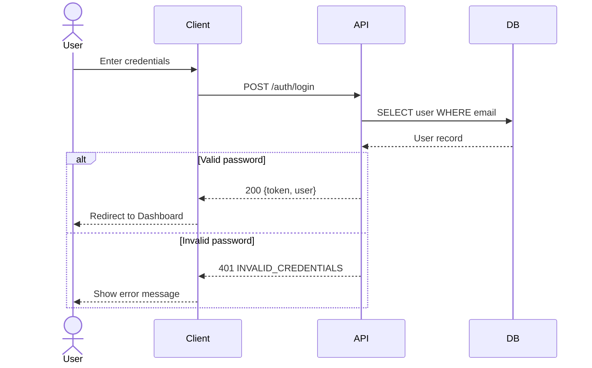
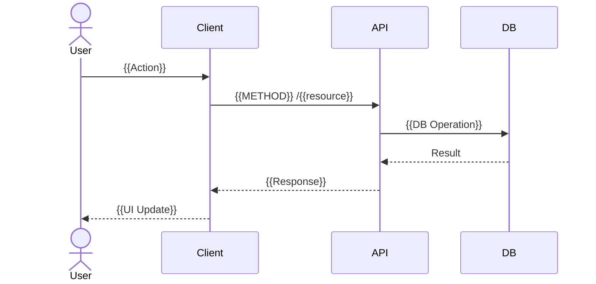

# {{PROJECT_NAME}} API Contract

## 1. Background

### 1.1 Purpose

{{API Contract 문서의 목적. Frontend/Backend 간 인터페이스를 정의한다.}}

### 1.2 Data Specification

| Item | Value |
|------|-------|
| Base URL | `{{BASE_URL}}` |
| Protocol | REST (JSON) |
| Auth | Bearer Token (JWT) |
| Spec | OpenAPI 3.0 |

---

## 2. API Overview

| Method | Path | Description | FR Mapping | Screen Mapping | Auth |
|--------|------|-------------|------------|---------------|------|
| POST | `/auth/login` | 로그인 | FR-001 | S-006 | No |
| POST | `/auth/register` | 회원가입 | FR-001 | S-007 | No |
| GET | `/{{resource}}` | {{설명}} | FR-002 | S-003 | Yes |
| POST | `/{{resource}}` | {{설명}} | FR-003 | S-004 | Yes |
| PUT | `/{{resource}}/:id` | {{설명}} | FR-003 | S-004 | Yes |
| DELETE | `/{{resource}}/:id` | {{설명}} | FR-003 | S-004 | Yes |

---

## 3. API Details

### 3.1 POST /auth/login

**Description**: 사용자 로그인

**Request**:
```json
{
  "email": "string (required)",
  "password": "string (required)"
}
```

**Response (200)**:
```json
{
  "token": "string (JWT)",
  "user": {
    "id": "number",
    "email": "string",
    "name": "string",
    "role": "string"
  }
}
```

**Error Responses**:

| Status | Code | Message |
|--------|------|---------|
| 400 | VALIDATION_ERROR | 입력값 검증 실패 |
| 401 | INVALID_CREDENTIALS | 이메일 또는 비밀번호 불일치 |
| 429 | TOO_MANY_REQUESTS | 요청 횟수 초과 |

### 3.2 GET /{{resource}}

**Description**: {{설명}}

**Query Parameters**:

| Param | Type | Required | Default | Description |
|-------|------|----------|---------|-------------|
| page | number | No | 1 | 페이지 번호 |
| limit | number | No | 20 | 페이지당 항목 수 |
| sort | string | No | created_at | 정렬 기준 |

**Response (200)**:
```json
{
  "data": [],
  "pagination": {
    "page": 1,
    "limit": 20,
    "total": 0,
    "totalPages": 0
  }
}
```

### 3.3 POST /{{resource}}

**Description**: {{설명}}

**Request**:
```json
{
  "{{field}}": "{{type}} (required)"
}
```

**Response (201)**:
```json
{
  "id": "number",
  "{{field}}": "{{value}}"
}
```

---

## 4. Sequence Diagrams

### 4.1 Login Flow



### 4.2 {{Resource}} CRUD Flow



---

## 5. OpenAPI 3.0 Spec (YAML)

```yaml
openapi: "3.0.3"
info:
  title: "{{PROJECT_NAME}} API"
  version: "1.0.0"
  description: "{{API 설명}}"
servers:
  - url: "{{BASE_URL}}"
paths:
  /auth/login:
    post:
      summary: "로그인"
      tags: ["Auth"]
      requestBody:
        required: true
        content:
          application/json:
            schema:
              type: object
              required: [email, password]
              properties:
                email:
                  type: string
                  format: email
                password:
                  type: string
      responses:
        "200":
          description: "로그인 성공"
        "401":
          description: "인증 실패"
```

---

## 6. Exception Handling

| # | Endpoint | Exception | Status | Response |
|---|----------|-----------|--------|----------|
| E-001 | POST /auth/login | 잘못된 인증 정보 | 401 | `{error: "INVALID_CREDENTIALS"}` |
| E-002 | ALL | 인증 토큰 만료 | 401 | `{error: "TOKEN_EXPIRED"}` |
| E-003 | ALL | 서버 내부 오류 | 500 | `{error: "INTERNAL_SERVER_ERROR"}` |
| E-004 | {{endpoint}} | {{예외}} | {{status}} | {{response}} |

---

## 7. Common Response Format

```json
// Success
{
  "data": {},
  "message": "Success"
}

// Error
{
  "error": {
    "code": "ERROR_CODE",
    "message": "Human-readable message"
  }
}

// Paginated
{
  "data": [],
  "pagination": {
    "page": 1,
    "limit": 20,
    "total": 100,
    "totalPages": 5
  }
}
```

---

## Change Log

| Version | Date | Author | Description |
|---------|------|--------|-------------|
| v0.1.0 | {{DATE}} | u-A | Initial draft |
