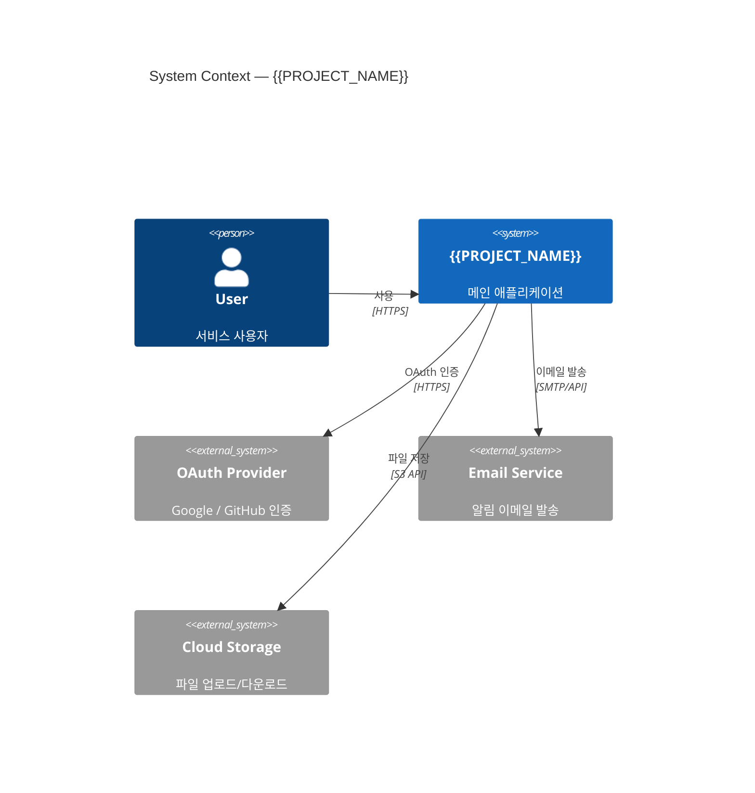
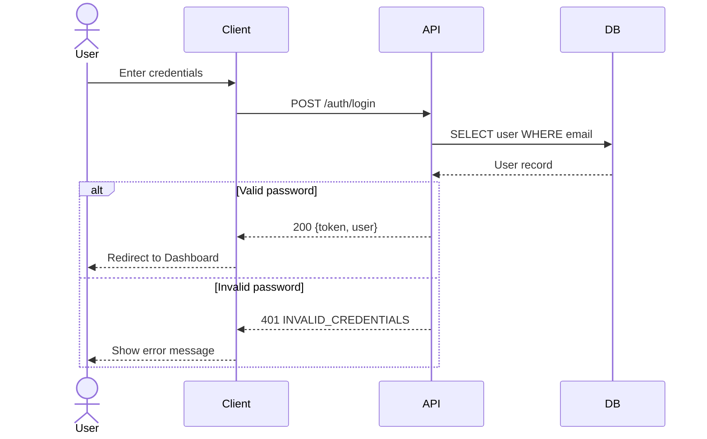
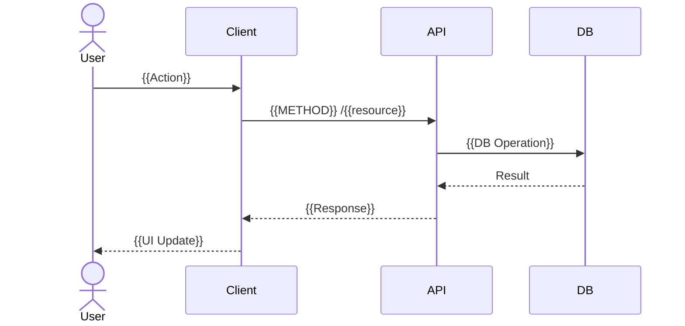
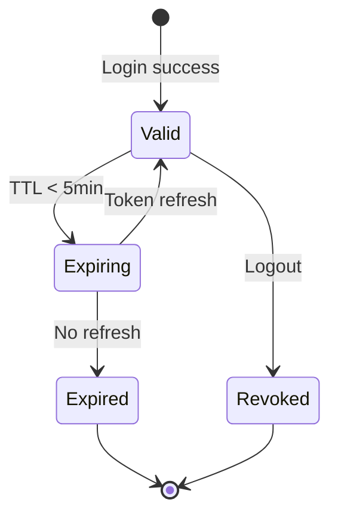

# {{PROJECT_NAME}} API Contract

## 1. Background

### 1.1 Purpose

{{API Contract 문서의 목적. Frontend/Backend 간 인터페이스를 정의한다.}}

### 1.2 Data Specification

| Item | Value |
|------|-------|
| Base URL | `{{BASE_URL}}` |
| Protocol | REST (JSON) |
| Auth | Bearer Token (JWT) |
| Spec | OpenAPI 3.0 |

---

## 2. API Overview

| Method | Path | Description | FR Mapping | Screen Mapping | Menu Mapping | Auth |
|--------|------|-------------|------------|---------------|-------------|------|
| POST | `/auth/login` | 로그인 | FR-001 | S-006 | MN-AUTH-001 | No |
| POST | `/auth/register` | 회원가입 | FR-001 | S-007 | MN-AUTH-002 | No |
| GET | `/{{resource}}` | {{설명}} | FR-002 | S-003 | MN-XXX-NNN | Yes |
| POST | `/{{resource}}` | {{설명}} | FR-003 | S-004 | MN-XXX-NNN | Yes |
| PUT | `/{{resource}}/:id` | {{설명}} | FR-003 | S-004 | MN-XXX-NNN | Yes |
| DELETE | `/{{resource}}/:id` | {{설명}} | FR-003 | S-004 | MN-XXX-NNN | Yes |

---

## 3. API Details

> **작성 규칙**: 각 Endpoint는 Swagger(OpenAPI) 스타일로 Parameters, Request Body Schema(필드명·타입·required·description·예시값), Response Schema를 완전히 기술한다. `{{TODO}}` 없이 실제 값으로 작성한다.

### 3.1 POST /auth/login

**Summary**: 사용자 로그인
**Tags**: Auth
**Auth Required**: No
**Related FR**: FR-001 | **Screen**: S-006 | **Menu**: MN-AUTH-001

#### Parameters

없음 (Body 사용)

#### Request Body

```json
{
  "email": "string",       // 필수. 사용자 이메일 주소. 형식: RFC 5322. 예: "user@example.com"
  "password": "string"     // 필수. 비밀번호. 최소 8자, 영문+숫자+특수문자 조합. 예: "Password123!"
}
```

| Field | Type | Required | Constraints | Description |
|-------|------|----------|-------------|-------------|
| email | string | Y | format: email | 사용자 이메일 주소 |
| password | string | Y | minLength: 8, pattern: 영문+숫자+특수문자 | 로그인 비밀번호 |

#### Response (200 OK)

```json
{
  "data": {
    "accessToken": "string",   // JWT Access Token. TTL: 1h
    "refreshToken": "string",  // Refresh Token. TTL: 7d. HttpOnly Cookie로도 설정
    "user": {
      "id": "number",          // 사용자 고유 ID
      "email": "string",       // 이메일 주소
      "name": "string",        // 표시명
      "role": "string"         // 권한: "user" | "admin"
    }
  },
  "message": "Login successful"
}
```

#### Error Responses

| Status | Code | Description | Condition |
|--------|------|-------------|-----------|
| 400 | VALIDATION_ERROR | 입력값 형식 오류 | 이메일 형식 불일치, 필수 필드 누락 |
| 401 | INVALID_CREDENTIALS | 인증 실패 | 이메일 또는 비밀번호 불일치 |
| 423 | ACCOUNT_LOCKED | 계정 잠김 | 5회 이상 실패 시 30분 잠금 |
| 429 | TOO_MANY_REQUESTS | 요청 한도 초과 | 분당 10회 초과 |
| 500 | INTERNAL_SERVER_ERROR | 서버 오류 | 예기치 못한 서버 에러 |

---

### 3.2 GET /{{resource}}

**Summary**: {{리소스 목록 조회}}
**Tags**: {{Tag}}
**Auth Required**: Yes (Bearer Token)
**Related FR**: FR-002 | **Screen**: S-003 | **Menu**: MN-XXX-NNN

#### Parameters

**Path Parameters**: 없음

**Query Parameters**:

| Param | Type | Required | Default | Constraints | Description |
|-------|------|----------|---------|-------------|-------------|
| page | integer | No | 1 | min: 1 | 페이지 번호 |
| limit | integer | No | 20 | min: 1, max: 100 | 페이지당 항목 수 |
| sort | string | No | created_at | enum: created_at, updated_at, name | 정렬 기준 필드 |
| order | string | No | desc | enum: asc, desc | 정렬 방향 |
| search | string | No | - | maxLength: 100 | 검색 키워드 (이름/설명 대상) |

**Header Parameters**:

| Header | Required | Description |
|--------|----------|-------------|
| Authorization | Y | `Bearer {accessToken}` |

#### Response (200 OK)

```json
{
  "data": [
    {
      "id": "number",           // 항목 고유 ID
      "{{field}}": "{{type}}", // 항목 필드 설명
      "createdAt": "string",   // ISO 8601 형식. 예: "2026-03-01T12:00:00Z"
      "updatedAt": "string"    // ISO 8601 형식
    }
  ],
  "pagination": {
    "page": 1,          // 현재 페이지
    "limit": 20,        // 페이지당 항목 수
    "total": 100,       // 전체 항목 수
    "totalPages": 5     // 전체 페이지 수
  },
  "message": "Success"
}
```

#### Error Responses

| Status | Code | Description | Condition |
|--------|------|-------------|-----------|
| 401 | UNAUTHORIZED | 인증 필요 | 토큰 없음 또는 만료 |
| 403 | FORBIDDEN | 권한 없음 | 접근 권한 부족 |
| 422 | INVALID_QUERY | 쿼리 파라미터 오류 | 허용되지 않는 sort 값 등 |

---

### 3.3 POST /{{resource}}

**Summary**: {{리소스 생성}}
**Tags**: {{Tag}}
**Auth Required**: Yes (Bearer Token)
**Related FR**: FR-003 | **Screen**: S-004 | **Menu**: MN-XXX-NNN

#### Parameters

**Header Parameters**:

| Header | Required | Description |
|--------|----------|-------------|
| Authorization | Y | `Bearer {accessToken}` |
| Content-Type | Y | `application/json` |

#### Request Body

```json
{
  "{{field1}}": "string",   // 필수. {{설명}}. 예: "{{예시값}}"
  "{{field2}}": "number",   // 필수. {{설명}}. min: {{min}}, max: {{max}}
  "{{field3}}": "string"    // 선택. {{설명}}. 기본값: {{default}}
}
```

| Field | Type | Required | Constraints | Description |
|-------|------|----------|-------------|-------------|
| {{field1}} | string | Y | maxLength: {{N}} | {{설명}} |
| {{field2}} | number | Y | min: {{N}}, max: {{N}} | {{설명}} |
| {{field3}} | string | N | - | {{설명}}. 기본값: {{default}} |

#### Response (201 Created)

```json
{
  "data": {
    "id": "number",          // 생성된 항목 ID
    "{{field1}}": "string",  // 생성된 값
    "{{field2}}": "number",
    "createdAt": "string"    // ISO 8601 형식
  },
  "message": "Created successfully"
}
```

#### Error Responses

| Status | Code | Description | Condition |
|--------|------|-------------|-----------|
| 400 | VALIDATION_ERROR | 입력값 검증 실패 | 필수 필드 누락, 형식 오류 |
| 401 | UNAUTHORIZED | 인증 필요 | 토큰 없음 또는 만료 |
| 409 | CONFLICT | 중복 항목 | 이미 존재하는 {{field1}} |

---

### 3.4 PUT /{{resource}}/:id

**Summary**: {{리소스 수정}}
**Tags**: {{Tag}}
**Auth Required**: Yes (Bearer Token)
**Related FR**: FR-003 | **Screen**: S-004

#### Parameters

**Path Parameters**:

| Param | Type | Required | Description |
|-------|------|----------|-------------|
| id | integer | Y | 수정할 항목 ID |

#### Request Body

```json
{
  "{{field1}}": "string",  // 선택. 수정할 필드만 포함 (Partial Update)
  "{{field2}}": "number"
}
```

#### Response (200 OK)

```json
{
  "data": {
    "id": "number",
    "{{field1}}": "string",
    "updatedAt": "string"
  },
  "message": "Updated successfully"
}
```

#### Error Responses

| Status | Code | Description | Condition |
|--------|------|-------------|-----------|
| 400 | VALIDATION_ERROR | 입력값 오류 | 형식 불일치 |
| 401 | UNAUTHORIZED | 인증 필요 | |
| 403 | FORBIDDEN | 권한 없음 | 다른 사용자 리소스 수정 시도 |
| 404 | NOT_FOUND | 항목 없음 | 해당 ID의 항목 미존재 |

---

### 3.5 DELETE /{{resource}}/:id

**Summary**: {{리소스 삭제}}
**Tags**: {{Tag}}
**Auth Required**: Yes (Bearer Token)
**Related FR**: FR-003

#### Parameters

**Path Parameters**:

| Param | Type | Required | Description |
|-------|------|----------|-------------|
| id | integer | Y | 삭제할 항목 ID |

#### Response (200 OK)

```json
{
  "data": null,
  "message": "Deleted successfully"
}
```

#### Error Responses

| Status | Code | Description | Condition |
|--------|------|-------------|-----------|
| 401 | UNAUTHORIZED | 인증 필요 | |
| 403 | FORBIDDEN | 권한 없음 | |
| 404 | NOT_FOUND | 항목 없음 | |

---

## 3.5 System Context



---

## 4. Sequence Diagrams

### 4.1 Login Flow



### 4.2 {{Resource}} CRUD Flow



### 4.3 Token Lifecycle



### 4.4 Complex Auth Flow (zenuml)

> 3단계 이상 중첩 조건이 있는 복잡한 인증·트랜잭션 플로우에 사용한다.

```zenuml
@Actor User
@Boundary Client
@Control API
@Database DB

// Login with token refresh
User -> Client.submitLogin(email, password) {
  Client -> API.POST_auth_login(credentials) {
    API -> DB.findUserByEmail(email) {
      return userRecord
    }
    if (passwordValid) {
      API -> DB.createSession(userId) {
        return sessionId
      }
      return {token, refreshToken, user}
    } else {
      throw INVALID_CREDENTIALS
    }
  }
}

// Token refresh flow
User -> Client.makeAuthenticatedRequest() {
  if (tokenExpiring) {
    Client -> API.POST_auth_refresh(refreshToken) {
      if (refreshTokenValid) {
        return {newToken}
      } else {
        throw REFRESH_TOKEN_EXPIRED
      }
    }
  }
  Client -> API.resource(newToken) {
    return data
  }
}
```

---

## 5. OpenAPI 3.0 Spec (YAML)

```yaml
openapi: "3.0.3"
info:
  title: "{{PROJECT_NAME}} API"
  version: "1.0.0"
  description: "{{API 설명}}"
servers:
  - url: "{{BASE_URL}}"
paths:
  /auth/login:
    post:
      summary: "로그인"
      tags: ["Auth"]
      requestBody:
        required: true
        content:
          application/json:
            schema:
              type: object
              required: [email, password]
              properties:
                email:
                  type: string
                  format: email
                password:
                  type: string
      responses:
        "200":
          description: "로그인 성공"
        "401":
          description: "인증 실패"
```

---

## 6. Exception Handling

| # | Endpoint | Exception | Status | Response |
|---|----------|-----------|--------|----------|
| E-001 | POST /auth/login | 잘못된 인증 정보 | 401 | `{error: "INVALID_CREDENTIALS"}` |
| E-002 | ALL | 인증 토큰 만료 | 401 | `{error: "TOKEN_EXPIRED"}` |
| E-003 | ALL | 서버 내부 오류 | 500 | `{error: "INTERNAL_SERVER_ERROR"}` |
| E-004 | {{endpoint}} | {{예외}} | {{status}} | {{response}} |

---

## 7. Common Response Format

```json
// Success
{
  "data": {},
  "message": "Success"
}

// Error
{
  "error": {
    "code": "ERROR_CODE",
    "message": "Human-readable message"
  }
}

// Paginated
{
  "data": [],
  "pagination": {
    "page": 1,
    "limit": 20,
    "total": 100,
    "totalPages": 5
  }
}
```

---

## Change Log

| Version | Date | Author | Description |
|---------|------|--------|-------------|
| v0.1.0 | {{DATE}} | u-SA | Initial draft |
