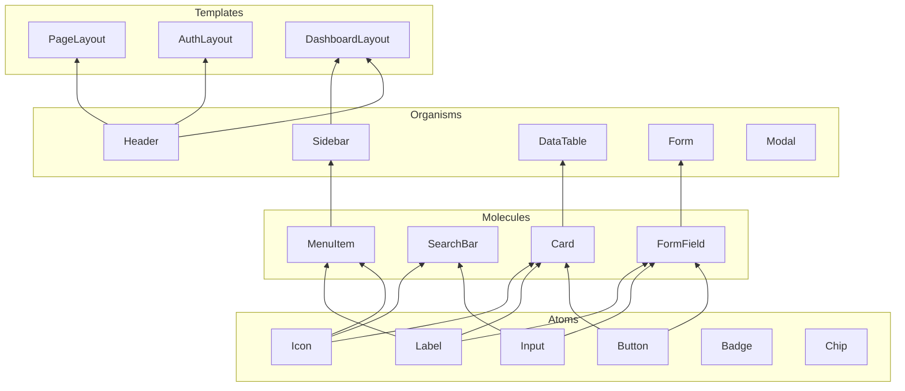
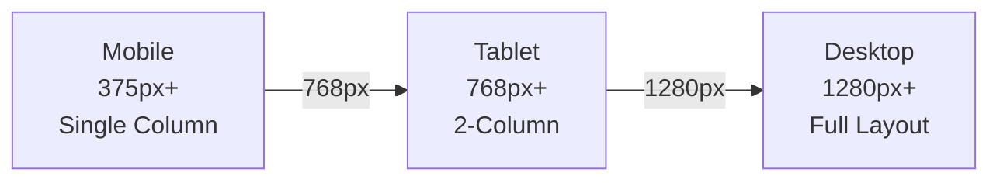

# {{PROJECT_NAME}} Design System

## 1. Overview

### 1.1 Purpose

{{디자인 시스템의 목적. 일관된 UI/UX를 제공하기 위한 컴포넌트 및 스타일 가이드를 정의한다.}}

### 1.2 Design Principles

| # | Principle | Description |
|---|-----------|-------------|
| 1 | Consistency | 동일한 패턴은 동일한 컴포넌트로 구현 |
| 2 | Accessibility | WCAG 2.1 AA 수준 준수 |
| 3 | Responsiveness | Mobile-first, 3-breakpoint 시스템 |
| 4 | Simplicity | 최소한의 복잡도로 최대한의 표현 |

---

## 2. Color Palette

### 2.1 Brand Colors

| Token | Value | Usage |
|-------|-------|-------|
| `--color-primary` | {{#HEX}} | 주요 버튼, 링크, 강조 |
| `--color-primary-hover` | {{#HEX}} | 주요 요소 호버 상태 |
| `--color-secondary` | {{#HEX}} | 보조 버튼, 태그 |
| `--color-accent` | {{#HEX}} | 알림, 뱃지 |

### 2.2 Semantic Colors

| Token | Value | Usage |
|-------|-------|-------|
| `--color-success` | {{#HEX}} | 성공 상태, 완료 |
| `--color-warning` | {{#HEX}} | 경고, 주의 |
| `--color-error` | {{#HEX}} | 에러, 실패 |
| `--color-info` | {{#HEX}} | 정보, 안내 |

### 2.3 Neutral Colors

| Token | Value | Usage |
|-------|-------|-------|
| `--color-bg-primary` | {{#HEX}} | 메인 배경 |
| `--color-bg-secondary` | {{#HEX}} | 카드, 섹션 배경 |
| `--color-text-primary` | {{#HEX}} | 본문 텍스트 |
| `--color-text-secondary` | {{#HEX}} | 보조 텍스트 |
| `--color-border` | {{#HEX}} | 구분선, 테두리 |

---

## 3. Typography

### 3.1 Font Family

| Token | Value | Usage |
|-------|-------|-------|
| `--font-sans` | {{Font Name}}, sans-serif | 본문 |
| `--font-mono` | {{Font Name}}, monospace | 코드 |

### 3.2 Type Scale

| Token | Size | Weight | Line Height | Usage |
|-------|------|--------|-------------|-------|
| `--text-h1` | 2.25rem | 700 | 1.2 | 페이지 제목 |
| `--text-h2` | 1.875rem | 600 | 1.25 | 섹션 제목 |
| `--text-h3` | 1.5rem | 600 | 1.3 | 서브 섹션 |
| `--text-body` | 1rem | 400 | 1.5 | 본문 |
| `--text-sm` | 0.875rem | 400 | 1.4 | 보조 텍스트 |
| `--text-xs` | 0.75rem | 400 | 1.4 | 캡션, 라벨 |

---

## 4. Spacing

| Token | Value | Usage |
|-------|-------|-------|
| `--space-xs` | 0.25rem | 인라인 요소 간 |
| `--space-sm` | 0.5rem | 관련 요소 간 |
| `--space-md` | 1rem | 컴포넌트 내부 패딩 |
| `--space-lg` | 1.5rem | 섹션 간 |
| `--space-xl` | 2rem | 페이지 섹션 간 |
| `--space-2xl` | 3rem | 주요 영역 간 |

---

## 5. Component Library

### 5.1 Component Hierarchy (Atomic Design)

| Level | Components |
|-------|-----------|
| Atoms | Button, Input, Label, Icon, Badge, Chip |
| Molecules | FormField, SearchBar, Card, MenuItem |
| Organisms | Header, Sidebar, DataTable, Form, Modal |
| Templates | PageLayout, AuthLayout, DashboardLayout |

### 5.2 Component Catalog

| Component | Variants | Storybook | Status |
|-----------|----------|-----------|--------|
| Button | primary, secondary, outline, ghost, danger | Y | {{STATUS}} |
| Input | text, email, password, number, textarea | Y | {{STATUS}} |
| Card | default, interactive, media | Y | {{STATUS}} |
| Modal | default, confirmation, form | Y | {{STATUS}} |
| DataTable | default, sortable, selectable | Y | {{STATUS}} |
| {{Component}} | {{Variants}} | Y | {{STATUS}} |

---

## 6. Layout System

### 6.1 Breakpoints

| Token | Value | Description |
|-------|-------|-------------|
| `--breakpoint-sm` | 375px | Mobile |
| `--breakpoint-md` | 768px | Tablet |
| `--breakpoint-lg` | 1280px | Desktop |

### 6.2 Grid System

| Property | Value |
|----------|-------|
| Max Width | 1280px |
| Columns | 12 |
| Gutter | 1rem (sm), 1.5rem (md), 2rem (lg) |
| Margin | 1rem (sm), 2rem (md), auto (lg) |

---

## 7. Iconography

| Category | Icon Set | Usage |
|----------|----------|-------|
| Navigation | {{아이콘 세트}} | 메뉴, 네비게이션 |
| Action | {{아이콘 세트}} | 버튼, 인터랙션 |
| Status | {{아이콘 세트}} | 상태 표시 |

---

## 8. Responsive Breakpoint Flow

---

## 9. Motion & Animation

| Token | Value | Usage |
|-------|-------|-------|
| `--duration-fast` | 150ms | 호버, 포커스 |
| `--duration-normal` | 250ms | 토글, 트랜지션 |
| `--duration-slow` | 400ms | 모달, 페이지 전환 |
| `--easing-default` | ease-in-out | 기본 이징 |

---

## Change Log

| Version | Date | Author | Description |
|---------|------|--------|-------------|
| v0.1.0 | {{DATE}} | u-UX | Initial draft |
