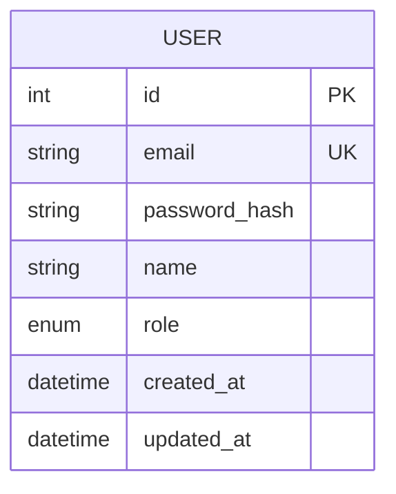
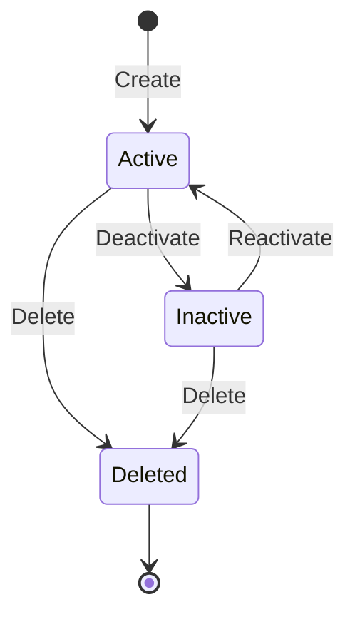

# {{PROJECT_NAME}} ERD

## 1. Background

### 1.1 Purpose

{{ERD 문서의 목적. SRS의 기능 요구사항을 데이터 모델로 구체화한다.}}

### 1.2 Data Specification

| Item | Value |
|------|-------|
| Database | PostgreSQL / SQLite |
| ORM | Prisma / Drizzle |
| Naming | snake_case (DB), camelCase (Code) |

---

## 2. ER Diagram

---

## 3. Entity Definitions

### 3.1 USER

| Attribute | Type | Constraint | Description |
|-----------|------|-----------|-------------|
| id | int | PK, Auto Increment | 고유 식별자 |
| email | string(255) | UK, NOT NULL | 이메일 주소 |
| password_hash | string(255) | NOT NULL | 암호화된 비밀번호 |
| name | string(100) | NOT NULL | 사용자 이름 |
| role | enum('admin','user') | NOT NULL, DEFAULT 'user' | 사용자 역할 |
| created_at | datetime | NOT NULL, DEFAULT NOW | 생성일시 |
| updated_at | datetime | NOT NULL | 수정일시 |

### 3.2 {{ENTITY_NAME}}

| Attribute | Type | Constraint | Description |
|-----------|------|-----------|-------------|
| id | int | PK, Auto Increment | 고유 식별자 |
| {{attribute}} | {{type}} | {{constraint}} | {{설명}} |

---

## 4. Relationships

| From | To | Cardinality | Description |
|------|-----|------------|-------------|
| USER | {{ENTITY}} | 1:N | {{관계 설명}} |

---

## 5. State Changes

---

## 6. Exceptions

| # | Exception Case | Entity | Handling |
|---|---------------|--------|----------|
| E-001 | 중복 이메일 가입 시도 | USER | 409 Conflict 반환 |
| E-002 | {{예외 케이스}} | {{Entity}} | {{처리 방법}} |

---

## 7. FR Mapping

| FR-ID | Feature | Related Entities |
|-------|---------|-----------------|
| FR-001 | {{기능명}} | USER |
| FR-002 | {{기능명}} | {{Entity 목록}} |

---

## Change Log

| Version | Date | Author | Description |
|---------|------|--------|-------------|
| v0.1.0 | {{DATE}} | u-SA | Initial draft |
