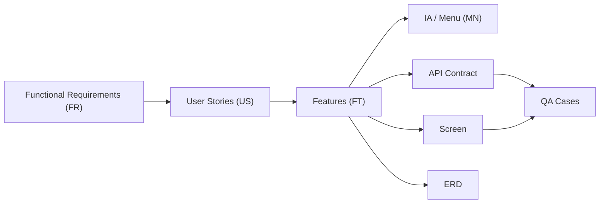

# {{PROJECT_NAME}} Requirements Traceability Matrix (RTM)

## 1. Background

### 1.1 Purpose

이 문서는 요구사항 추적표(RTM)로서 `FR → US → FT` 체인을 기준으로 IA/Screen/API/ERD/QA까지의 추적 가능성을 관리한다.

### 1.2 Scope

| Item | Value |
|------|-------|
| Traceability Base | FR → US → FT |
| Coverage Target | 100% (모든 FR/US/FT가 최소 1개 이상의 하위 산출물과 연결) |
| Gate Usage | DESIGN → DO Gate 검증 자료 |

---

## 2. Coverage Summary

| App | FR Total | FR Linked | US Total | US Linked | FT Total | FT Linked | Coverage |
|-----|----------|-----------|----------|-----------|----------|-----------|----------|
| {{APP_NAME}} | {{N}} | {{N}} | {{N}} | {{N}} | {{N}} | {{N}} | {{XX}}% |

> Coverage 100% 미달 시 Gap 항목을 생성하고 원인/조치 계획을 기록한다.

---

## 3. RTM Matrix

| FR-ID | US-ID | FT-ID | App | MN-ID | Screen ID | API Mapping | ERD Entity | QA Case | Status | Note |
|-------|-------|-------|-----|-------|-----------|-------------|------------|---------|--------|------|
| [FR-0010](../01-plan/1_SRS_RA.md#fr-0010) | [US-0010](../01-plan/1_SRS_RA.md#us-0010) | [FT-0010](../01-plan/1_SRS_RA.md#ft-0010) | {{APP_NAME}} | MN-AUTH-0010 | S-0060 | POST /auth/login | USER | [TC-0010](../04-check/4_Case_QA.md#tc-0010) | Covered | - |
| [FR-0020](../01-plan/1_SRS_RA.md#fr-0020) | [US-0010](../01-plan/1_SRS_RA.md#us-0010) | [FT-0020](../01-plan/1_SRS_RA.md#ft-0020) | {{APP_NAME}} | MN-AUTH-0020 | S-0070 | POST /auth/register | USER | [TC-0020](../04-check/4_Case_QA.md#tc-0020) | Covered | - |
| [FR-0130](../01-plan/1_SRS_RA.md#fr-0130) | [US-0020](../01-plan/1_SRS_RA.md#us-0020) | [FT-0130](../01-plan/1_SRS_RA.md#ft-0130) | {{APP_NAME}} | MN-CORE-0010 | S-0020 | GET /items | ITEM, TAG | [TC-0130](../04-check/4_Case_QA.md#tc-0130) | Partial | QA 케이스 보강 필요 |

### Status Definition

| Status | Description |
|--------|-------------|
| Covered | RTM 컬럼이 모두 채워짐 |
| Partial | 일부 컬럼 누락 (예: QA 또는 API 미연결) |
| Gap | 핵심 매핑 누락 (FR/US/FT 또는 설계 산출물 연결 없음) |

---

## 4. Gap & Action Items

| Gap ID | Scope | Missing Link | Impact | Action | Owner | Due Date | Status |
|--------|-------|--------------|--------|--------|-------|----------|--------|
| GAP-0010 | FT-0130 | QA Case | 검증 불가 | TC 보강 | u-QA | {{DATE}} | Open |
| GAP-0020 | FR-0210 | API Mapping | 구현 불가 | API 설계 보강 | u-SA | {{DATE}} | Open |

---

## 5. Traceability Flow

---

## 6. Change Log

| Version | Date | Author | Description |
|---------|------|--------|-------------|
| v0.1.0 | {{DATE}} | u-RA | Initial RTM template |
