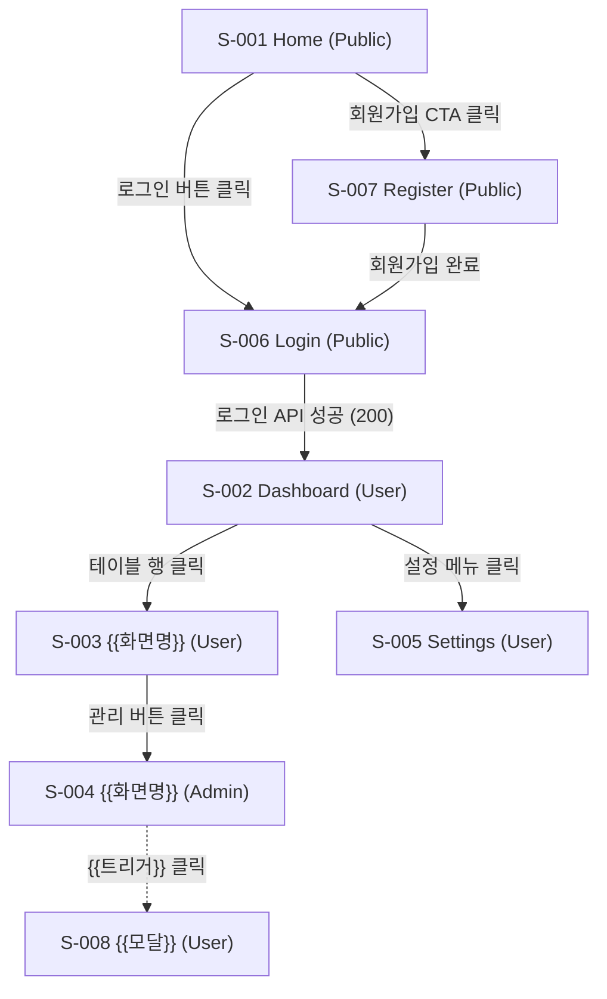
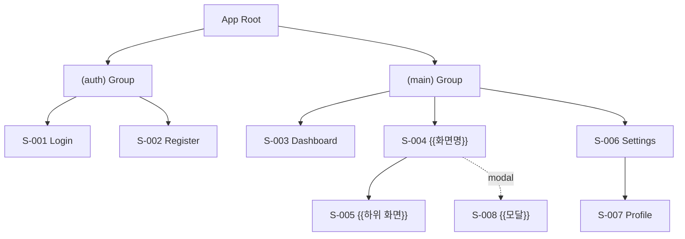
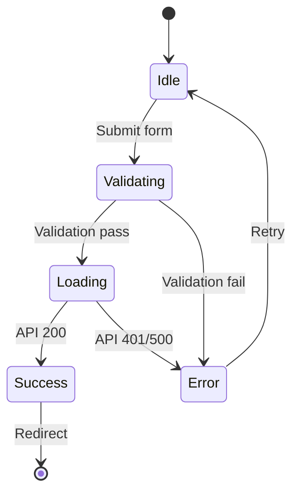
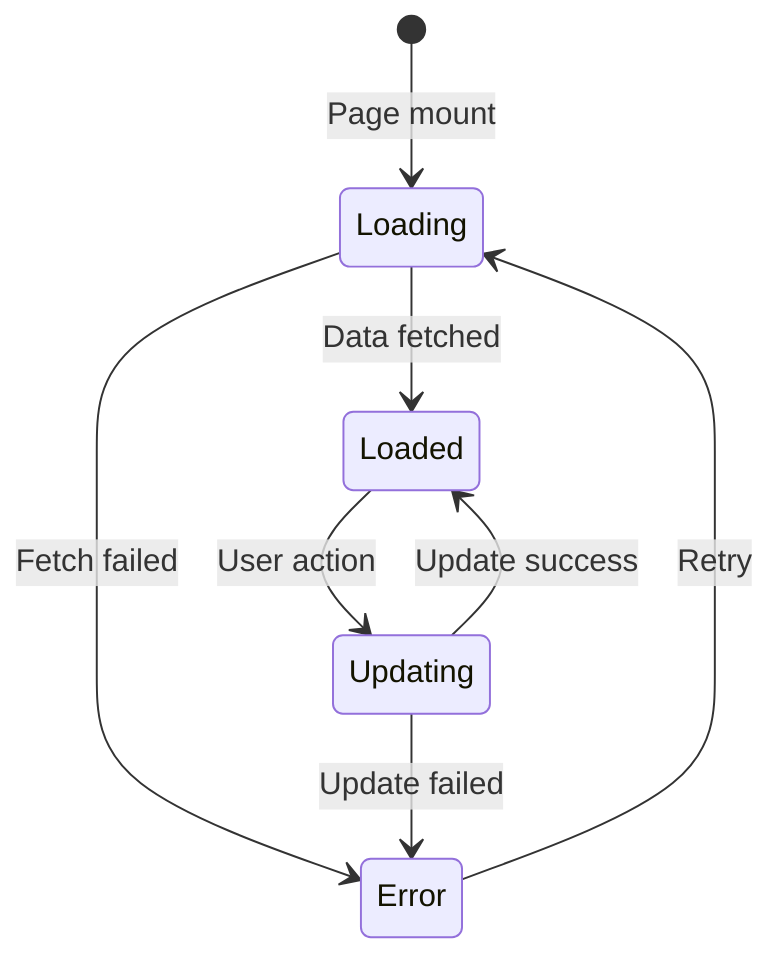

# {{PROJECT_NAME}} Screen Design

## 1. Background

### 1.1 Purpose

{{화면 설계 문서의 목적. IA에서 정의한 화면 목록을 상세하게 설계한다.}}

### 1.2 Design Specification

| Item | Value |
|------|-------|
| Responsive | Mobile-first |
| Breakpoints | 375px (Mobile), 768px (Tablet), 1280px (Desktop) |
| Component Library | Custom (packages/ui) |
| Design Token | packages/tokens |

---

## 2. IA Coverage Check

> IA(1_IA_RA.md)에 정의된 **모든 메뉴 항목**에 대응하는 화면이 설계되어야 한다.
> IA에 없는 화면도 플로우상 필요하면 (모달, 에러 페이지 등) 추가한다.

| Menu ID | Menu Name | Screen ID | Status |
|---------|-----------|-----------|--------|
| MN-XXX-001 | {{메뉴명}} | S-001 | Designed |
| MN-XXX-002 | {{메뉴명}} | S-002 | Designed |
| MN-XXX-003 | {{메뉴명}} | S-003 | Designed |
| - | {{연결 화면 (모달 등)}} | S-00N | Designed |

**Coverage**: {{N}}/{{M}} menus covered ({{%}}%)

> ⚠️ Coverage 100% 필수. 누락된 메뉴가 있으면 화면 설계를 추가해야 한다.

---

## 3. Screen Definition

| Screen ID | Screen Name | Path | Menu ID | Goal | Access Role | FR Mapping | API Endpoints | Connected Screens (← 전환 조건) | Priority |
|-----------|------------|------|---------|------|-------------|------------|--------------|----------------------------------|----------|
| S-001 | Home | `/` | MN-XXX-NNN | {{화면 목표}} | Public | - | - | S-006 ← 로그인 클릭, S-007 ← CTA 클릭 | Must |
| S-002 | Dashboard | `/dashboard` | MN-XXX-NNN | {{화면 목표}} | User | FR-001 | GET /dashboard | S-003 ← 행 클릭, S-005 ← 설정 메뉴 | Must |
| S-003 | {{화면명}} | `/{{path}}` | MN-XXX-NNN | {{화면 목표}} | User | FR-002 | GET /{{resource}} | S-002 ← 뒤로가기, S-004 ← 관리 버튼 | Must |
| S-004 | {{화면명}} | `/{{path}}` | MN-XXX-NNN | {{화면 목표}} | Admin | FR-003 | POST /{{resource}} | S-003 ← 뒤로가기 | Should |
| S-005 | Settings | `/settings` | MN-XXX-NNN | {{화면 목표}} | User | - | GET, PUT /settings | S-002 ← 사이드바 메뉴 | Must |
| S-006 | Login | `/auth/login` | MN-XXX-NNN | 사용자 인증 | Public | FR-001 | POST /auth/login | S-001 ← 로고, S-002 ← 로그인 성공, S-007 ← 회원가입 링크 | Must |
| S-007 | Register | `/auth/register` | MN-XXX-NNN | 신규 계정 생성 | Public | FR-001 | POST /auth/register | S-006 ← 가입 완료 | Must |

### Access Role Definitions

| Role | Description | Example Screens |
|------|-------------|-----------------|
| Public | 비로그인 사용자도 접근 가능 | Home, Login, Register |
| User | 인증된 일반 사용자 | Dashboard, Settings, Profile |
| Admin | 관리자 권한 필요 | Admin Panel, User Management |
| {{Role}} | {{설명}} | {{해당 화면}} |

---

## 4. Screen Details

> 각 화면은 **Goal**, **Access Role**, **Connected Screens** (전환 조건 포함)를 필수로 포함한다.
> IA의 모든 메뉴에 대응하는 화면을 빠짐없이 작성한다.
> Element Description은 해당 요소가 **무엇을 표시하고, 어떻게 동작하며, 어떤 제약이 있는지** 구체적으로 기술한다.

### 4.1 S-001: Home

| Field | Value |
|-------|-------|
| **Goal** | 서비스 소개 및 주요 기능 안내, 신규 사용자 유입 유도 |
| **Access Role** | Public |
| **Connected Screens** | S-006 (Login) ← 로그인 버튼 클릭, S-007 (Register) ← 회원가입 CTA 버튼 클릭 |
| **Menu ID** | MN-XXX-NNN |
| **FR Mapping** | - |
| **Wireframe** | [HTML Wireframe](2_Screen_Wireframes/S-001.html) |
| **Design** | [Pencil Design]({{APP_NAME}}.pen) |

**Layout**:
```
+------------------------------------------+
| [Header: Logo / Navigation / Auth]       |
+------------------------------------------+
| [Hero Section]                           |
|   Title                                  |
|   Description                            |
|   [CTA Button]                           |
+------------------------------------------+
| [Feature Section]                        |
|   [Card] [Card] [Card]                   |
+------------------------------------------+
| [Footer]                                 |
+------------------------------------------+
```

**Elements**:

| Element | Type | Props | Description | Role Visibility |
|---------|------|-------|-------------|-----------------|
| Header | Layout | - | 로고, 주요 메뉴 링크, 인증 버튼을 포함하는 글로벌 네비게이션 바. 스크롤 시 상단 고정(sticky). | All |
| LoginButton | Button | - | 헤더 우측에 위치. 클릭 시 로그인 페이지(S-006)로 이동. 로그인 상태에서는 숨김 처리. | Public (비로그인 시) |
| UserMenu | Menu | user | 로그인된 사용자의 아바타와 드롭다운 메뉴(프로필, 설정, 로그아웃). 비로그인 시 LoginButton으로 대체. | User (로그인 시) |
| HeroSection | Section | title, description, ctaText | 서비스의 핵심 가치를 전달하는 메인 배너 영역. 제목, 설명 문구, CTA 버튼으로 구성. | All |
| FeatureCard | Card | icon, title, description | 서비스의 주요 기능을 아이콘과 짧은 설명으로 소개하는 카드. 3개 가로 배치(모바일에서 세로 스택). | All |
| Footer | Layout | - | 서비스 정보, 이용약관, 개인정보처리방침, 고객지원 링크를 포함하는 글로벌 푸터. | All |

**Navigation**:

| Target Screen | Condition | Trigger Element |
|--------------|-----------|-----------------|
| S-006 (Login) | 로그인 버튼 클릭 | LoginButton |
| S-007 (Register) | 회원가입 CTA 버튼 클릭 | HeroSection CTA |

### 4.2 S-006: Login

| Field | Value |
|-------|-------|
| **Goal** | 기존 사용자 인증, 대시보드 접근 |
| **Access Role** | Public (로그인 상태면 Dashboard로 리다이렉트) |
| **Connected Screens** | S-001 (Home) ← 로고 클릭, S-002 (Dashboard) ← 로그인 성공 시, S-007 (Register) ← 회원가입 링크 클릭 |
| **Menu ID** | MN-XXX-NNN |
| **FR Mapping** | FR-001 |
| **Wireframe** | [HTML Wireframe](2_Screen_Wireframes/S-006.html) |
| **Design** | [Pencil Design]({{APP_NAME}}.pen) |

**Layout**:
```
+------------------------------------------+
| [Header]                                 |
+------------------------------------------+
|          [Login Form]                    |
|          Email: [________]               |
|          Password: [________]            |
|          [Login Button]                  |
|          [Register Link]                 |
|          [Forgot Password Link]          |
+------------------------------------------+
```

**Elements**:

| Element | Type | Props | Description | Role Visibility |
|---------|------|-------|-------------|-----------------|
| LoginForm | Form | onSubmit | 이메일과 비밀번호를 입력받아 인증을 요청하는 폼. 유효성 검증 실패 시 필드별 인라인 에러 메시지를 표시한다. Enter 키로도 제출 가능. | Public |
| EmailInput | Input | value, onChange, error | 이메일 주소 입력 필드. 이메일 형식 유효성 검증(regex). 미입력 시 "이메일을 입력해주세요" 에러 표시. placeholder: "example@email.com". | Public |
| PasswordInput | Input | value, onChange, error | 비밀번호 입력 필드. 마스킹 처리, 보기/숨기기 토글 제공. 미입력 시 "비밀번호를 입력해주세요" 에러 표시. | Public |
| SubmitButton | Button | loading, disabled | 로그인 요청 제출 버튼. API 호출 중 로딩 스피너 표시 및 disabled 상태. 폼 유효성 검증 실패 시 비활성화. | Public |
| RegisterLink | Link | - | "계정이 없으신가요? 회원가입" 텍스트 링크. 클릭 시 회원가입 페이지(S-007)로 이동. | Public |

**Navigation**:

| Target Screen | Condition | Trigger Element |
|--------------|-----------|-----------------|
| S-001 (Home) | 로고 클릭 | Header Logo |
| S-002 (Dashboard) | 로그인 API 성공 (200 OK + JWT 발급) | SubmitButton (onSubmit → API 200) |
| S-007 (Register) | 회원가입 링크 클릭 | RegisterLink |

**API Mapping**:
- Submit → `POST /auth/login`
- Success → Redirect to `/dashboard` (S-002)
- Error → Show error message

### 4.3 S-002: Dashboard

| Field | Value |
|-------|-------|
| **Goal** | 주요 데이터 요약 제공, 빠른 액션 진입점 |
| **Access Role** | User |
| **Connected Screens** | S-003 ({{화면명}}) ← 데이터 행 클릭, S-005 (Settings) ← 사이드바 설정 메뉴 클릭 |
| **Menu ID** | MN-XXX-NNN |
| **FR Mapping** | FR-001 |
| **Wireframe** | [HTML Wireframe](2_Screen_Wireframes/S-002.html) |
| **Design** | [Pencil Design]({{APP_NAME}}.pen) |

**Layout**:
```
+------------------------------------------+
| [Header]                                 |
+------------------------------------------+
| [Sidebar]  | [Main Content]             |
|            |   [Summary Cards]           |
|            |   [Card][Card][Card]         |
|            |                             |
|            |   [Data Table / List]       |
|            |   [Row]                     |
|            |   [Row]                     |
|            |   [Pagination]              |
+------------------------------------------+
```

**Elements**:

| Element | Type | Props | Description | Role Visibility |
|---------|------|-------|-------------|-----------------|
| Sidebar | Navigation | menuItems, activeItem | 주요 메뉴 항목을 세로로 나열하는 사이드바 네비게이션. 현재 활성 메뉴 하이라이트 표시. 모바일에서 햄버거 메뉴로 전환. | User |
| SummaryCard | Card | title, value, icon | 핵심 지표(총 항목 수, 오늘 변경, 상태별 비율 등)를 숫자와 아이콘으로 표시하는 요약 카드. 클릭 시 해당 상세 페이지로 이동. | User |
| AdminSummary | Card | title, value | 전체 사용자 수, 시스템 상태 등 관리자 전용 통계를 표시하는 카드. 일반 User에게는 숨김 처리. | Admin |
| DataTable | Table | columns, data, pagination | 최근 항목을 테이블 형태로 표시. 컬럼별 정렬 지원. 행 클릭 시 상세 페이지(S-003)로 이동. 데이터 없으면 Empty 상태 표시. | User |
| Pagination | Navigation | page, totalPages, onChange | 데이터 테이블 하단 페이지네이션. 이전/다음, 페이지 번호 직접 선택. 페이지당 10건 기본. | User |

**Navigation**:

| Target Screen | Condition | Trigger Element |
|--------------|-----------|-----------------|
| S-003 ({{화면명}}) | 데이터 테이블 행 클릭 | DataTable row |
| S-005 (Settings) | 사이드바 설정 메뉴 클릭 | Sidebar "Settings" item |

---

## 5. Screen Flow (Connected Screens)

> 화면 간 연결 흐름을 다이어그램으로 표현한다. 권한에 따른 접근 가능 여부도 표시한다.



---

## 6. Screen Hierarchy



---

## 7. State Changes

### 7.1 Login State



### 7.2 {{Screen}} State



---

## 8. Exception Handling

| # | Screen | Exception Case | UI Handling |
|---|--------|---------------|------------|
| E-001 | S-006 | 잘못된 로그인 정보 | 에러 메시지 표시 ("이메일 또는 비밀번호가 일치하지 않습니다") |
| E-002 | S-006 | 네트워크 에러 | 에러 메시지 표시 + 재시도 버튼 |
| E-003 | S-002 | 데이터 로딩 실패 | Skeleton UI → 에러 메시지 + 재시도 |
| E-004 | ALL | 인증 만료 | 로그인 페이지로 리다이렉트 |
| E-005 | ALL | 권한 부족 (403) | "접근 권한이 없습니다" 메시지 + 이전 화면 이동 |
| E-006 | {{Screen}} | {{예외}} | {{UI 처리}} |

---

## 9. Data Specification

| Screen | Data Source | Fields | Refresh |
|--------|-----------|--------|---------|
| S-002 | GET /dashboard | summary, recentItems | On mount + 30s interval |
| S-003 | GET /{{resource}} | list, pagination | On mount + page change |
| S-006 | POST /auth/login | token, user | On submit |

---

## Change Log

| Version | Date | Author | Description |
|---------|------|--------|-------------|
| v0.1.0 | {{DATE}} | u-UX | Initial draft |
